# 一道题了解虚拟机本身的机制实现的shellcode-先知社区

> **来源**: https://xz.aliyun.com/news/16092  
> **文章ID**: 16092

---

# 前言：

这里记录一个笔者第一次遇到非数据越界泄露libc而是利用vm虚拟机本身的机制实现的shellcode的打法

# 2024 SCTF vmcode

## 程序保护

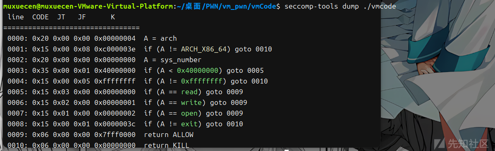  
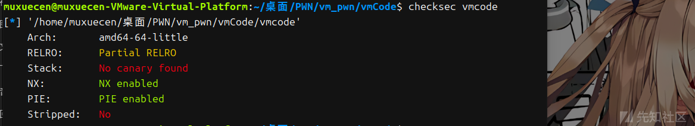

## 程序分析

这里先创建沙盒规则  
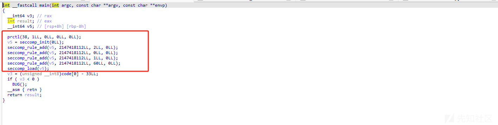  
BUG这里反编译看不了：  
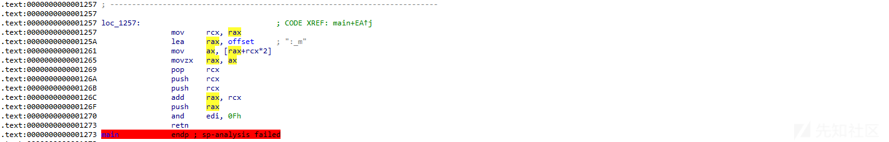

就只能硬看汇编加调试了

我们照着开始的shellcode去找字符串 发现也是找不到的，因此猜测程序是通过opcode进行的一些调用

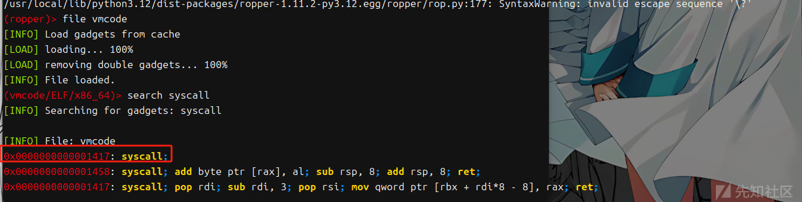

通过跟踪syscall进行分析 0x1417

根据vm题的经验 我们输入的字节基本对应的是一些类似 push pop mov lea这种功能 因此我们重点关注cmp 和跳转的位置

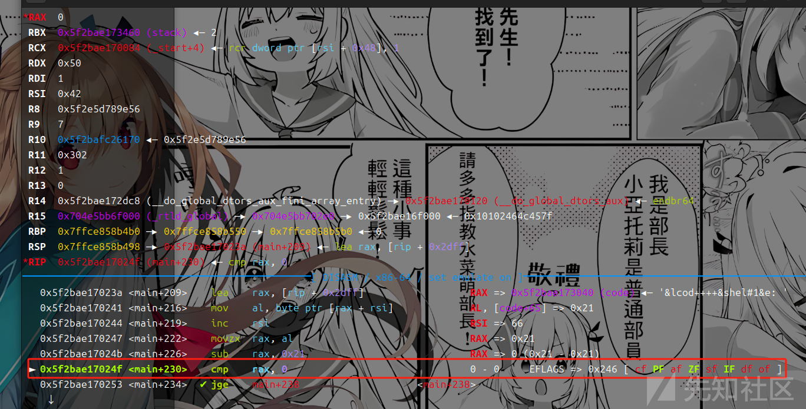

这里rax要大于等于0x21，接下来的代码就是程序跳转的关键

```
0x5f2bae170257 <main+238>    mov    rcx, rax                       RCX => 0
   0x5f2bae17025a <main+241>    lea    rax, [rip + 0xdbf]             RAX => 0x5f2bae171020 (offset) ◂— 0x8a006d005f003a /* ':' */
   0x5f2bae170261 <main+248>    mov    ax, word ptr [rax + rcx*2]     AX, [offset] => 0x3a
   0x5f2bae170265 <main+252>    movzx  rax, ax                        RAX => 0x3a
   0x5f2bae170269 <main+256>    pop    rcx                            RCX => 0x5f2bae17023a (main+209)
 ► 0x5f2bae17026a <main+257>    push   rcx
   0x5f2bae17026b <main+258>    push   rcx
   0x5f2bae17026c <main+259>    add    rax, rcx                       RAX => 0x5f2bae170274 (main+267) (0x3a + 0x5f2bae17023a)
   0x5f2bae17026f <main+262>    push   rax
   0x5f2bae170270 <main+263>    and    edi, 0xf                       EDI => 1 (0x1 & 0xf)
   0x5f2bae170273 <main+266>    ret
```

这里取出offset中的值每次两字节，作为ax 然后把ax赋值给rax 再把rcx+rax 此时的rcx是0x5f2bae17023a 也就是$0x023a 然后再push进入栈中直接ret返回 也就是返回的值是$0x123a+offset[i]的值

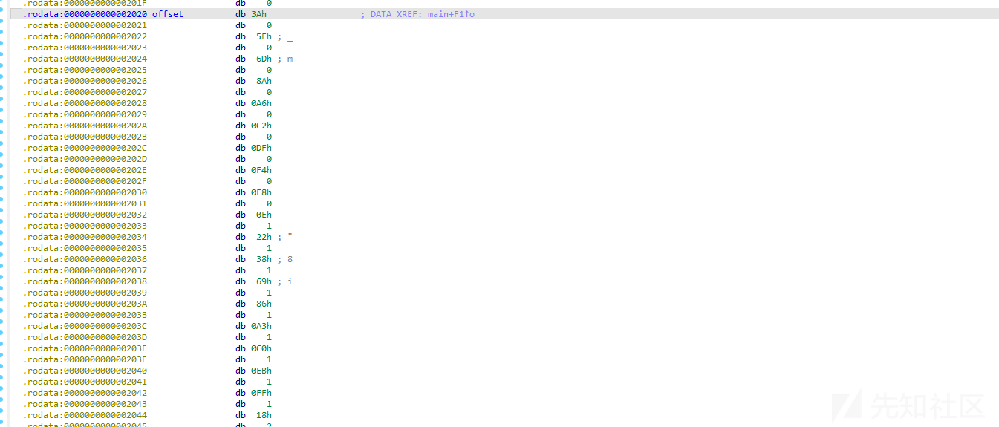

0x3a+0x123a=0x1274 也就是返回$0x1274

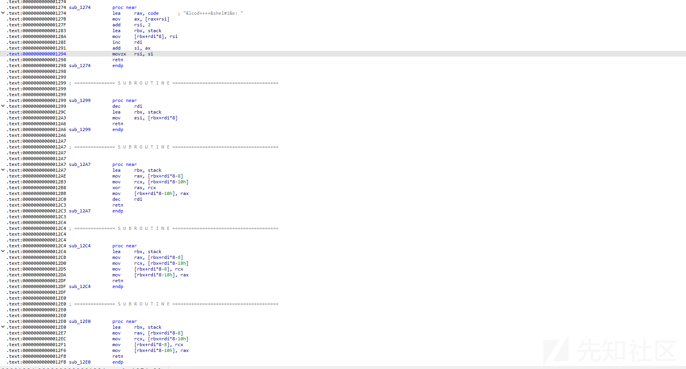

发现$0x1274后面是各种大于0x1274的函数 总共有19个根据这个逻辑 应该是通过传入大于0x21的值 加上$0x123a来控制返回地址来执行功能。

开始逐个分析

### 0x21 $0x1274

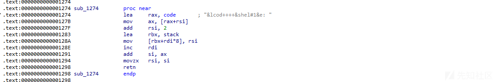

这里是通过我们传入的值 来和最开始的0x44进行相加 然后 传给rsi 会作为后续code的索引值

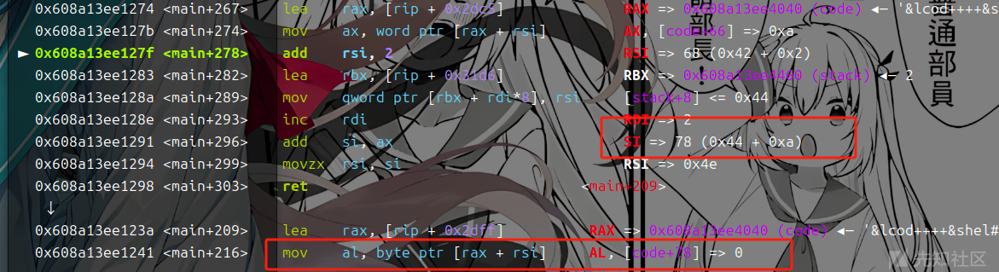

### 0x22 $0x1299

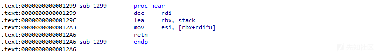

通过调整rdi的值 作为索引传给esi 也会对后续code索引有影响

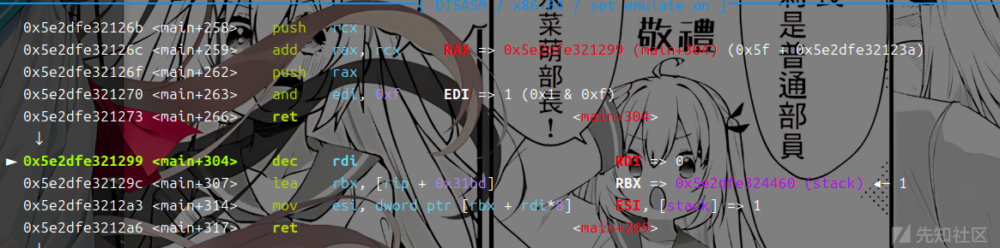

### 0x23 $0x12A7


将stack中 stack[v1]和stack[v1-8]异或 把异或后的结果放入stack[v1-8]

### 0x24 $0x12c4

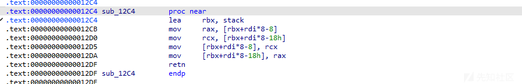

将stack[v1]和stack[v1-0x10]交换位置

### 0x25 $0x12e0

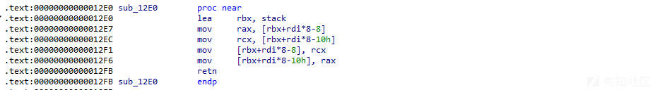

将stack[v1]和stack[v1-0x8]交换位置

### 0x26 $0x12fc

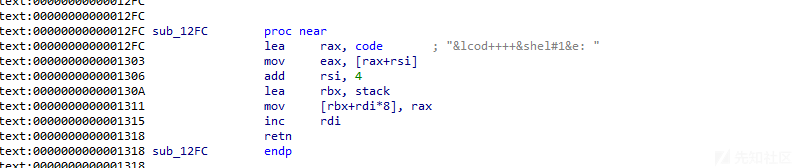

把code中取出来的值放入stack段中

### 0x27 $0x1319

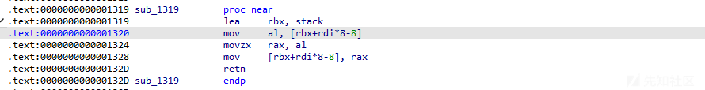

将stack[v1]的值变为 stack[v1的低位]

### 0x28 $132e

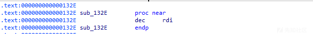

rdi减一

### 0x29 $0x1332

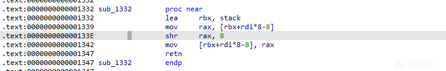

取出栈中的值 右移8位 然后放回去

### 0x2a $0x1348

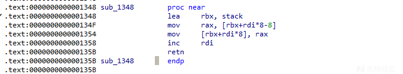

将stack[v1]放入 stack[v1+8]

### 0x2b $0x135c

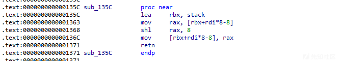

取出栈中的值 左移8位 然后放回去

### 0x2c $0x1372 0x2c 0x138c

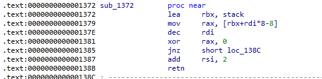

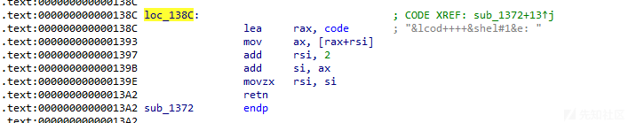

从stack中读值 如果是0则rsi加2返回 不是则 取code的值进行处理

### 0x2d $0x13a3

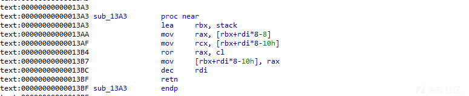

首先从 `stack` 中获取两个相邻的值。第一个值通过地址 `[rbx + rdi * 8 - 8]` 读取，并存储在寄存器 `rax` 中；第二个值通过地址 `[rbx + rdi * 8 - 0x10]` 读取，存储在寄存器 `rcx` 中。接着，使用 `rcx` 的值作为循环右移的位数，对 `rax` 中的值进行右循环移位。最后，将循环移位后的结果写回到 `stack` 的前一个位置，同时减少索引 `rdi` 的值

### 0x2e $0x13c0

0x33的循环左移

### 0x2f $0x13dd

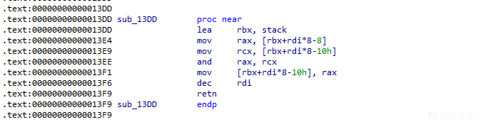

位与

### 0x30 $0x13fa


读取参数进行系统调用 这里rax rdi rsi rdx 都可以控制！！

### 0x31 $0x1425

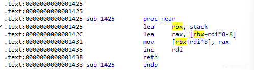

将stack[v1-1]的值取出来存入stack[v1]

### 0x32 $0x1439

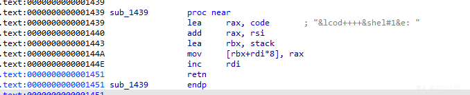

将code地址偏移rsi后存入stack段

## 功能表一览

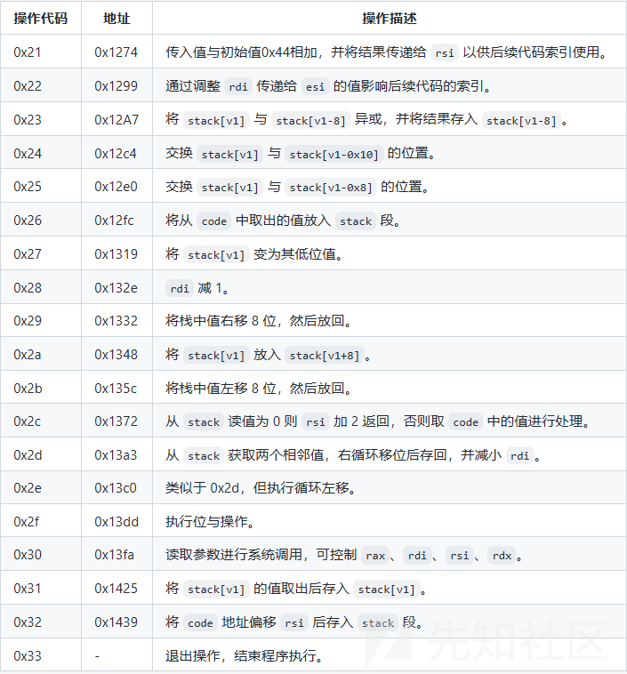

## 漏洞分析

利用0x30 这个位置系统调用来实现orw的过程

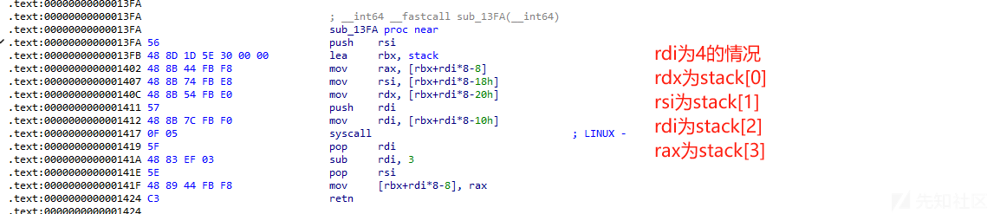

其余情况可以类推

然后可以通过传入参数到栈中去构造orw 由于程序开了pie 因此关键点在于读取的地址和'flag'的地址要怎么取


这里是可以取出[rbx+rdi\*8-8]的地址的！！ 因此就绕过了pie解决了上面的问题 接下来构造orw

open('./flag\x00',0,0)`-->`read(0,adr,len)` --> write(1,adr,len)

### open

push\_4\_byte(reversed\_string\_to\_int(b'flag'[::-1]))+push\_rsp()+push\_4\_byte(0)+swap\_8\_10()+push\_4\_byte(2)+syscall()

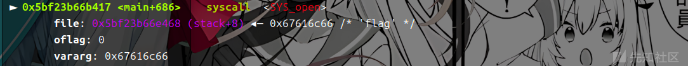

### read

push\_rsp()+copy\_and\_push()+copy\_and\_push()+copy\_and\_push()+copy\_and\_push()+copy\_and\_push()+copy\_and\_push() 这里是为了保证读入的地址不变的情况 增加rdi 把栈抬高 因为如果太低的话 后面

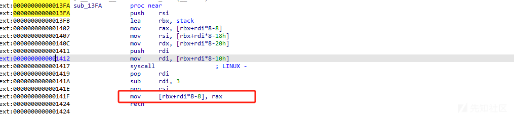

这一步会覆盖读入的flag 且后面进行参数传递的时候也容易读入flag

push\_4\_byte(0x100)+swap\_8\_10()+push\_4\_byte(3)+push\_4\_byte(0)+syscall() 这里就是read(3,addr,0x100)

### write

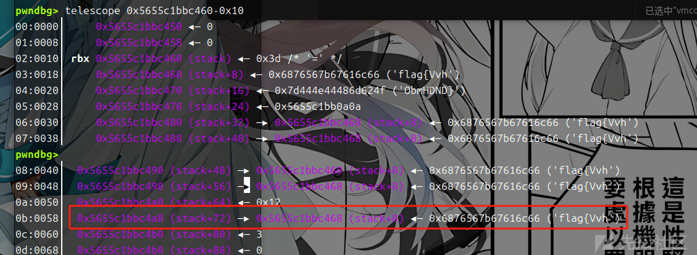

read之后观察到是这样，此时rdi要减一才能匹配我们的地址 进行下一步操作因此

pop()+copy\_and\_push()+push\_4\_byte(0x100)+swap\_8\_10()+push\_4\_byte(1)+push\_4\_byte(1)+syscall()

最后就可以成功读出flag

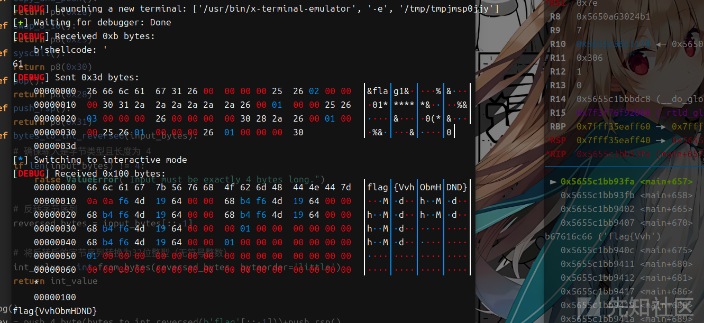

只用了61字节读出了flag
