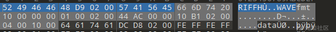
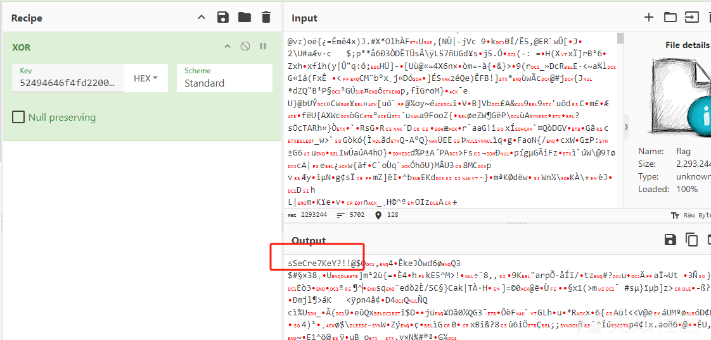
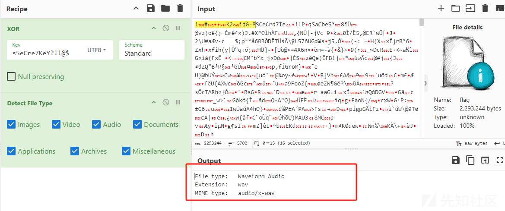
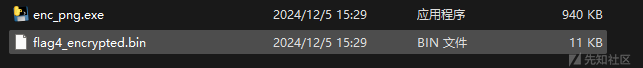
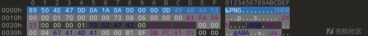
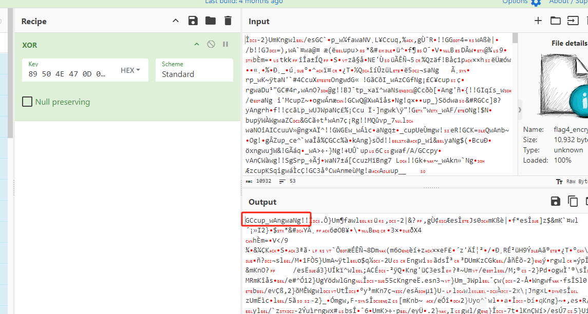
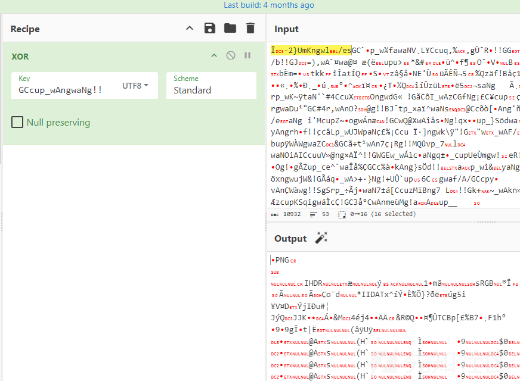
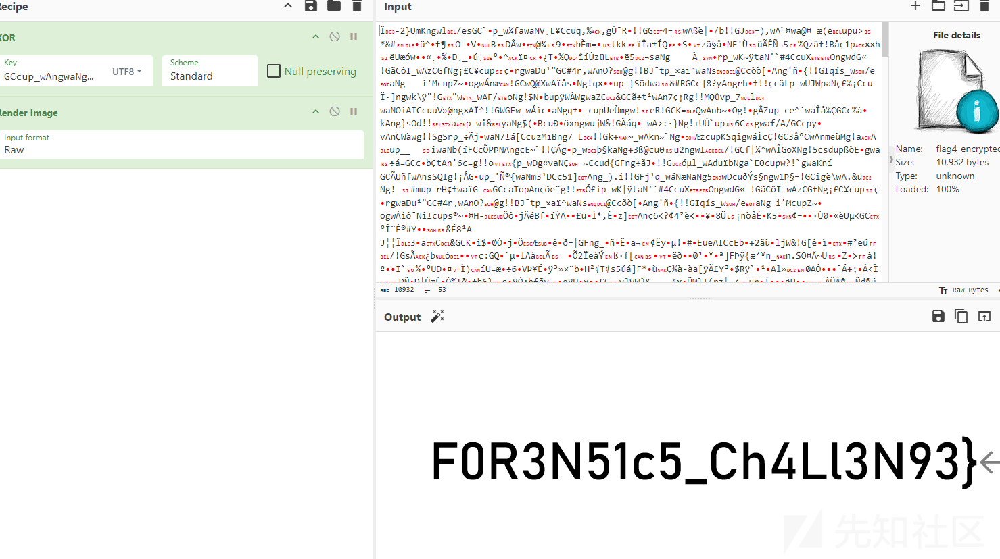

# 求被异或算法加密文件的KEY的骚操作-先知社区

> **来源**: https://xz.aliyun.com/news/16096  
> **文章ID**: 16096

---

## 前言：

### 本文以国城杯misc方向两道题eZ\_Steg0,Just\_F0r3n51Cs的部分解题过程为例。讲解对一个文件被key进行以后加密处理后，如何利用骚操作得到key，并通过KEY来解出文件。

## 例题一、eZ\_Steg0：

这是一个已经被xor加密的文件，通过题目提示可以知道是音频文件， 所以就是

​ **flag XOR KEY = flag.wav**

我们先去找其他wav文件的文件头结构的**例子**

我们可以看到前四个字节是固定的文件头RIFF 中间四个字节关于文件的大小 后面八个字节是57 41 56 45 66 6D 74 20 是固定的

我们先在瑞士军刀打开flag

flag实际是2293236个字节 换算成16进制应该是 F4 FD 22 00

因为 **flag XOR KEY = flag.wav** ，所以flag.wav的文件大小也是2293236 字节 ，十进制转十六进制后是22fdf4 在文件中的格式是 F4 FD 22 00 所以我们可以推算出flag.wav的文件头结构是52494646f4fd220057415645666D7420

将flag.wav的文件头当作xor的key来解密，其实就是**flag XOR flag.wav=KEY**

得到sSeCre7KeY?!!@$是真正的key

再把sSeCre7KeY?!!@$以UTF-8的格式 当作xor的key

成功解出flag.wav

## 例题二、Just\_F0r3n51Cs

这里本来是利用exe去解出pyc再反编译成py，再把flag4\_encrypted.bin去解密

但是这里猜测flag4\_encrypted.bin 是被异或加密的数据，通过enc\_png.exe的提示，可以知道解密后是png文件

即 **flag4\_encrypted.bin XOR KEY ==flag4.png**

我们可以利用png文件头的固定格式![image-20241209170201218]

89 50 4E 47 0D 0A 1A 0A 00 00 00 0D 49 48 44 52

来找到key

得到key：GCcup\_wAngwaNg!!

再反过来解开flag4.png

得到png文件 ，进行png解析后得到flag

