# Web安全--业务逻辑漏洞篇-先知社区

> **来源**: https://xz.aliyun.com/news/16102  
> **文章ID**: 16102

---

## 一、逻辑漏洞的概念

## 1、逻辑漏洞的定义

逻辑漏洞是指在软件或系统的设计和实现中，由于逻辑错误或缺陷导致的安全问题。这些漏洞不是由于代码编写的错误引起的，而是由于系统设计时的逻辑思路有问题，导致系统在某些情况下无法正常处理，进而被攻击者利用。

简单理解：就是编程人员的思维逻辑不够严谨造成的漏洞。

## 2、逻辑漏洞的危害

逻辑漏洞的存在，可能导致系统崩溃、数据泄露、功能异常等问题，严重时甚至可能被黑客利用，对系统安全构成威胁。

## 二、逻辑漏洞与常见漏洞类型的区别

## 1、漏洞性质

逻辑漏洞是由于系统设计中的逻辑错误或缺陷引起的，它们允许攻击者通过非预期的使用方式或操作顺序，规避安全机制或获得未授权的访问。而其他漏洞是由于系统没有正确验证用户输入的数据，或者编码错误或配置不当引起。

## 2、攻击方式和目标

逻辑漏洞需要攻击者攻击者需要了解应用的业务逻辑，通常利用合法用户身份，通过规避或操纵流程实现攻击目标。而其他常见漏洞是通过注入恶意代码、操纵输入数据或利用错误配置直接攻击网站应用。

## 3、检测方法

逻辑漏洞通常不会被防火墙等设备检测到，可以逃逸各种防护，难以通过自动化工具或防火墙检测。需要人工审查和业务逻辑分析，通常通过渗透测试和代码审计发现。而其他漏洞可以容易被自动化扫描工具、防火墙(如WAF，Web应用防火墙)和入侵检测系统(IDS)发现。

## 三、逻辑漏洞的发展趋势

由于越来越多的厂商增加各种设备，其他类型漏洞越来越难利用，但是逻辑漏洞的特点就是无视各种防御设备，并且在业务逻辑中，再资深的程序员也会犯错就给了逻辑漏洞更多的可乘之机。

随着这种安全体系的建设，逻辑漏洞的比例也将会在之后的所有漏洞中占比越来越多，每一年，逻辑漏洞的数量的数量都会程指数增长。

## 四、逻辑漏洞的分类

逻辑漏洞进行分类的话大致可以分为以下几种类型

## 1、越权类漏洞

越权类漏洞是一种常见的安全漏洞，发生在用户可以访问或执行其权限范围之外的资源或操作。根据用户试图获取的权限类型，越权漏洞可以分为水平越权和垂直越权。

## 2、业务逻辑类漏洞

业务逻辑类漏洞是一类与应用程序的业务流程和功能相关的漏洞，发生在应用程序未能正确地实施业务规则或逻辑上出现缺陷，导致攻击者可以利用这些漏洞进行未授权的操作或获取敏感信息。

## 3、流程跳过类漏洞

流程跳过类漏洞发生在攻击者通过绕过或跳过应用程序中的某些步骤或检查来达到其目的。利用应用程序在处理流程中未正确验证关键步骤或状态的漏洞，从而使攻击者可以规避验证、授权或其他安全机制。

## 五、常见的逻辑漏洞

## 1、身份认证安全

（1）漏洞产生原因：有些网站对身份认证模块没有做好安全防护，因此导致漏洞产生

（2）绕过身份认证有以下几种方法：

```
暴力破解、撞库（以信息收集找到的凭证作为字典）

    Cookie&Session类

    加密
```

（3）暴力破解测试方法：在没有验证码限制或者一次验证码可以多次使用的地方，可以分为以下几种情况

```
爆破用户名。当输入的用户名不存在时，会显示请输入正确用户名，或者用户名不存在

    已知用户名。比如：已知用户名为admin，密码可以进行字典爆破

    使用一个常用密码。比如 123456 对大量用户进行爆破
```

修复方法：

```
增加验证码，登录失败的时候，变换验证码。(确保验证码不能被工具识别)

    限制登录频率，例如，5 分钟内登录失败次数超过 5 次则锁定账号 1 小时。

    二次验证，可以添加手机验证码或邮箱验证码。
```

基于这一块内容的练习，可以看pikachu靶场中有相关练习

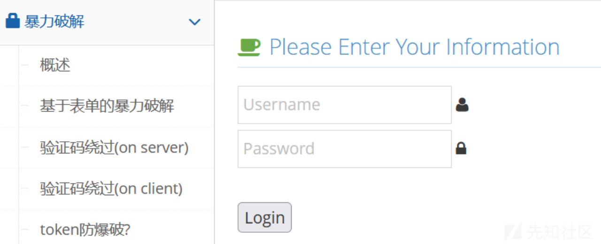

（4）Cookie&Session类

```
Cookie：指某些网站为了辨别用户身份、进行 session 跟踪而储存在用户本地终端上的数据（通常经过加密），我们俗称为浏览器缓存

    Session：在网络应用中，称为“会话控制”。Session 对象存储特定用户会话所需的属性及配置信息。当用户在应用程序的 Web 页之间跳转时，存储在 Session 对象中的变量将不会丢失，而是在整个用户会话中一直存在下去。当用户请求来自应用程序的 Web 页时，如果该用户还没有会话，则 Web 服务器将自动创建一个 Session对象，与Cookie有一定相同之处。
```

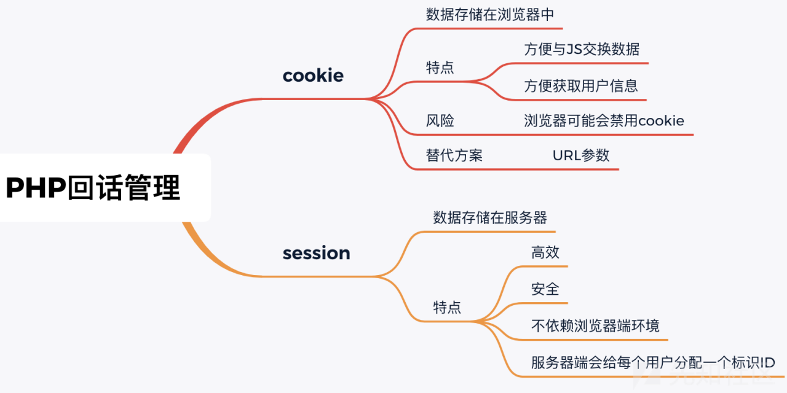

```
Cookie伪造： 通过修改 Cookie 中的某个参数来实现登录其他用户

    测试方法：使用一个账号登录，找一个可以证明身份的页面，例如首页的欢迎 xxx 或者是个人中心显示昵称的地方，刷新该页面拦截请求，观察 Cookie 中的字段和值，例如 userid=xxx，修改Cookie中的值，把 xxx 改成 admin，forword 放行，页面显示 admin 的信息，则存在此问题。

    修复方法：对于客户端标识的用户信息，使用 Session 会话认证方式，避免通过 Cookie 去仿冒其他人的身份。

    Session会话固定攻击： 一种诱骗受害者使用攻击者指定的会话标识（Session id）的攻击手段，利用了服务器的session不变的机制

    攻击步骤：攻击者通过某种手段重置目标用户的 Session id，然后监听用户会话状态，目标用户携带攻击者设定的Session id 登录站点，攻击者通过 Session id 获得合法会话。

    攻击者重置 Session id 的方法：通过xss，嗅探等方法取得用户的session，并且修改数据包。

    修复方法：每次登陆成功之后重新生成session，sessionID闲置过久时，进行重置sessionID
```

（5）加密测试

```
概念：有些网站在前端加密，然后传到后台直接和数据库里的值做对比，这时抓包就知道加密方式，然后做暴力破解。

    测试方法：用账号密码登录，拦截请求，查看传输信息是不是通过一些加密方式对账号和密码进行了加密，如果有则存在此问题；对于前端加密后的密码进行暴力破解测试时，可以在BurpSuite的Intruder模块Payload Processing中选择加密方式
```

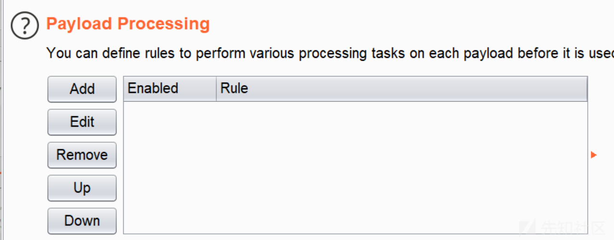

```
修复方法：把加密对比的方法放到后台去执行
```

## 2、未授权访问

授权的概念：就是对特定资源的读写权限。简单的说，就是你的权限能让你做什么事情，而验证则表示是否真的可以对这些资源进行读写

未授权访问的概念：就是指用户在没有通过认证授权的情况下，能够直接访问需要通过认证才能访问到的页面或者文本信息

越权漏洞的产生：主要是用于开发人员在对数据进行操作时对客户端请求的数据过分相信而遗漏了权限的判断

越权漏洞常发生的位置：修改、重置、找回账户密码、查看、修改其他账户未公开的信息例如个人资料、文件、数据、程序等等，还有与账户关联的一些权限操作

越权漏洞的分类：

水平越权：指相同权限的不同用户可以互相访问

举例：两个不同的班级的学生A和B，通过修改请求，A可以任意修改B的个人信息

垂直越权：指使用权限低的用户可以访问权限较高的用户

举例：同一个班级不同权限的老师和学生，通过修改请求，学生可以修改和查看老师的账号信息

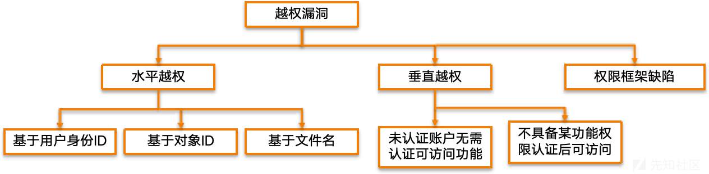

同级别（权限）的用户或者同一角色的不同用户之间，可以越权访问、修改或者删除的非法操作，如果出现此漏洞，那么将可能会造成大批量数据泄露，严重的甚至会造成用户信息被恶意篡改。

### 案例1：某系统任意用户密码修改

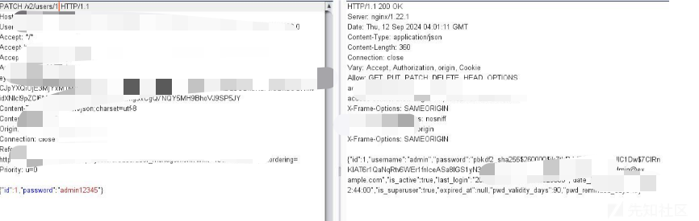

说明：通过修改密码处功能点进行抓包，修改其id值然后放包即可修改他人密码

### 案例2：信息泄露

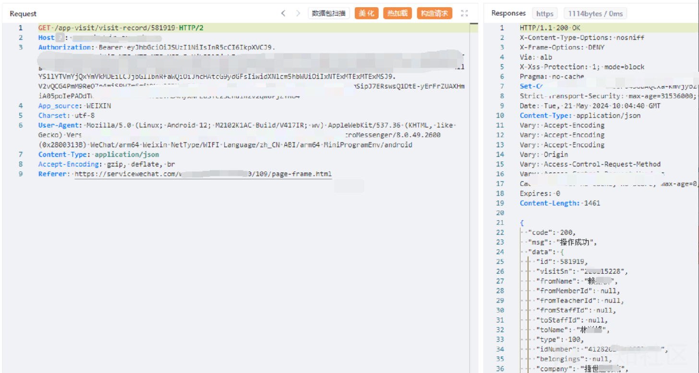

说明：点击预约记录并抓包，发现可以看到自己的预约信息及其他信息。这里的id推测为自己的用户id，将userAddrld和userld修改为被害者Id发送，发现修改成功

3、数据篡改

数据纂改分为两方面：业务一致性安全、业务数据安全


### 案例1、商品编号纂改

步骤：提交订单时，抓包修改商品标号，导致商品与价格不符却交易成功

举例：例如100个积分只能换商品编号为001, 1000个积分只能换商品编号005， 在100积分换商品的时候抓包把换商品的编号修改为005， 用低积分换取高积分商品。

修复：金额不在客户端传入，防止被篡改，如必要，则务必检查交易金额与商品价格或对支付金额做签名校验

相关案例： 某积分商城支付漏洞

说明：通过抓包可以修改积分


### 案例2、金额数据纂改

步骤： 在提交订单时进行抓包，修改支付的金额或折扣等相关数据。

修复： 商品信息如金额、折扣等原始数据校验应来自于服务器端，不应接受客户端传来的值。

相关案例： 某订单支付时的总价未验证漏洞

说明：在支付时抓包，将数据包中的支付的金额修改为1

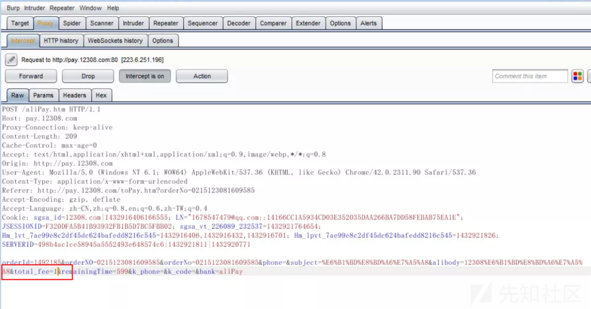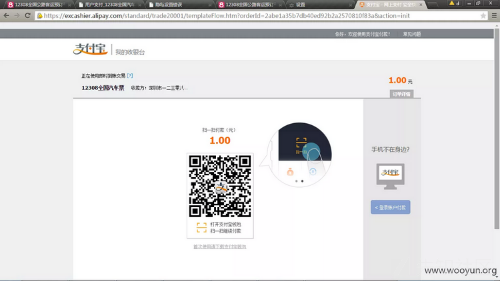

### 案例3、本地JS参数纂改

步骤： 部分应用程序通过Javascript处理用户提交的请求， 通过修改Javascript脚本，测试修改后的数据是否影响到用户。

修复：服务器校验；跨平台支付调用接口，要做好数据的完整性校验，确保一致性

### 案例4、最大数限制突破

步骤：很多商品限制用户购买数量时，服务器仅在页面通过js脚本限制，没有在服务器端校验用户提交的数量，通过抓包修改商品最大数限制，将请求中的商品数量改为大于最大数限制的值，查看能否以修改后的数量完成业务流程。

修复： 每次提交都对其对应的各项信息做强校验

## 4、任意密码重置漏洞

概念：任意密码重置漏洞是系统设计缺陷，允许攻击者在未经授权的情况下更改其他用户的密码。

漏洞分析与常见场景：缺乏身份验证、不安全的重置链接、安全问题或验证码的缺陷以及会话固定攻击是任意密码重置漏洞的常见场景。

### 案例1、验证码泄露

验证码返回凭证的三种形式：url返回凭证、抓包返回凭证、凭证在页面中

说明：进入重置密码页面，输入手机号，验证码，下一步，抓包，查看返回值。得到验证码信息

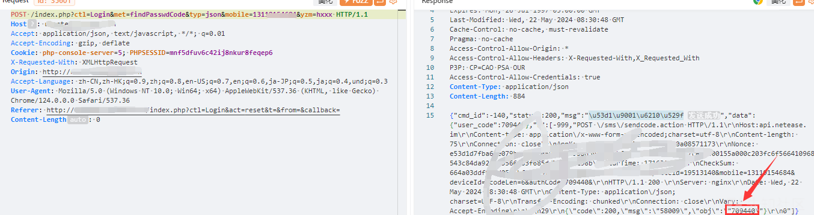

### 案例2、验证码爆破

进入找回密码界面，输入需要找回的手机号进行验证，如果存在该手机号，则会向改手机号发送短信验证码进行验证

这里我们随便输入一个验证码然后抓包，然后对该验证码进行爆破，即可爆破出正确验证码

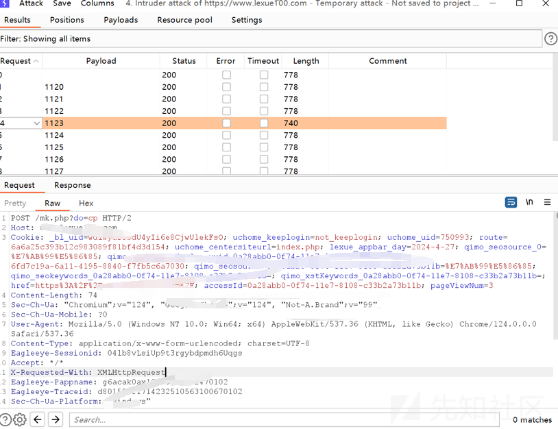

### 案例3、邮箱弱token

获取邮箱弱token的方法：Unix时间戳 + md5

例如：

（1）通过邮箱找回密码，正常流程去邮箱查看重置密码链接，发现链接处有一串 md5 加密字符串。字符串解密，类似 1491293277（10位），可以判断为Unix时间戳。 重置他人密码只需利用他人邮箱发送重置密码邮件，在短时间内对Unix时间戳进行暴力破解，即可获得重置密码的链接。

（2）用户名，例如：重置密码链接直接使用用户名进行区别，改变用户名即可更改他人密码

（3）服务器时间，例如：利用两个帐号同时点击找回密码，去邮箱查看找回密码的链接，发现两者的随机 token 只差1-2，而且可以猜测出为服务器时间。所以可以用一个未知帐号和一个已知帐号同时点击找回密码，稍微遍历随机 token，就可以构造出未知帐号的密码找回链接


### 案例4、跳过验证的方法介绍

跳过验证步骤、找回方式、直接到设置新密码页面

（1）正常流程下，密码找回，查看最后设置新密码页面的 URL，记录下来。继续返回密码找回处，输入其他用户名，提交找回申请，直接访问上面记录下的修改密码页面，成功修改密码

（2）正常流程下，修改密码页面抓包，修改其中的USERNAME\_COOKIE为其他用户（有可能会经过编码，比如 base64），提交即可修改其他用户密码，如果抓包其中有 step 参数，可以修改这个参数为最后一步（比如：5），提交便可略过之前的步骤

说明：输入用户名，抓包，数据包中有step参数，将这个参数改为最后一步，step改为4即可，提交后便掠过之前所有的验证步骤，修改密码成功

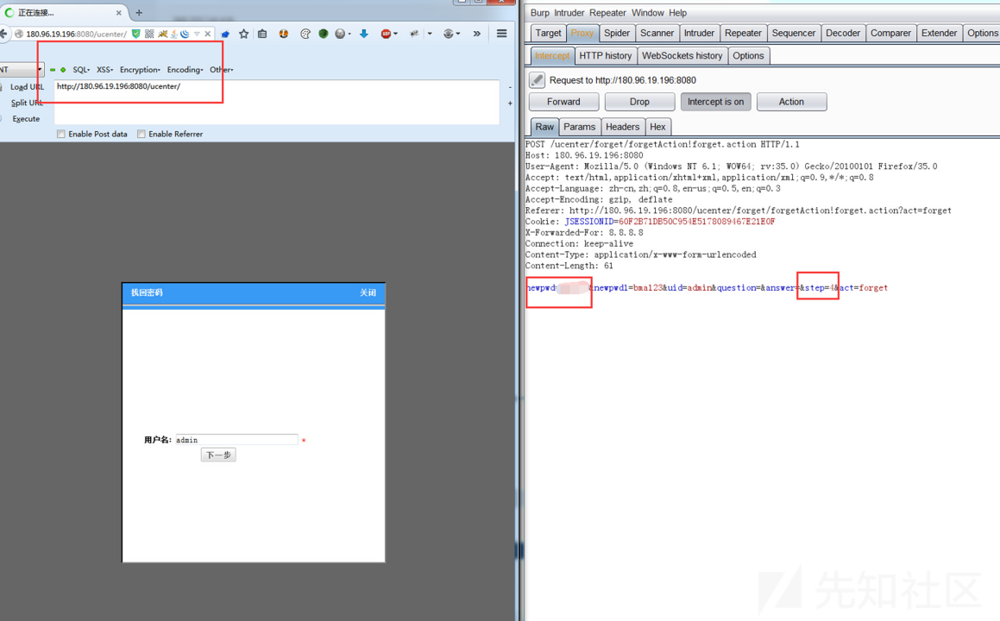

## 5、接口调用安全

概念：接口也叫做API（Application Programming Interface—）翻译为“应用程序编程接口”，是一些预先定义的函数 目的是提供应用程序与开发人员基于某软件或硬件得以访问一组例程的能力，而又无需访问源码，或理解内部工作机制的细节

接口调用安全的几种分类：

（1）重放攻击：在短信、邮件调用业务或生成业务数据环节中（类：短信验证码，邮件验证码，订单生成，评论提交等），对其业务环节进行调用（重放）测试 常见类型：短信轰炸、恶意注册

修复：  
1.对评论提交等操作采用验证码机制，防止生成数据业务被恶意调用；  
2.短信/邮件接口，需要对接调用频率进行控制或者上限限制；  
3.每一个订单（接口访问）使用唯一的token，提交一次后，token失效

（2）内容编辑：  
例如：点击获取短信验证码，抓包，可以修改短信内容，实施下一步攻击

修复：从客户端处获取手机号、邮箱等账号信息，要与Session中的凭证进行核验，验证通过后才允许进行业务操作。

（3）接口调用遍历漏洞：Web接口一般将常见的一些功能需求进行封装，通过传入不同的参数来获取对应的数据或者执行相应的功能，其中最常见的场景就是通过接口传入id参数，返回对应id的信息。此类接口如请求合法性校验不严，很容易出现非授权访问或者越权访问的问题。

修复：  
1.在session中存储当前用户的凭证或者id，只有传入凭证或者id参数值与session中的一致才返回结果。  
2.一般涉及身份校验的接口，不要直接将敏感信息的明文信息在客户端与服务端间传递，可以将敏感信息在服务端关联到用户标识ID，在客户端保存用户标识 ID 并提交到服务端，服务端根据 ID 取出对应信息后进行校验；

（4）接口未授权访问/调用漏洞：在正常的业务中，敏感功能的接口需要对访问者的身份进行验证，验证通过后才允许调用接口进行操作。接口未做身份验证或身份校验不严，可能导致非授权访问或越权调用

修复：  
1.采用Token校验的方式，在url中添加一个Token参数，只有Token验证通过才返回接口数据且Token使用一次后失效；  
2.在接口被调用时，服务器端对会话状态进行验证，如果已经登录，便返回接口数据；如未登录，则返回自定义的错误信息；  
3.未授权访问接口做Session认证，并对用户访问的每一个URL做身份鉴别，正确的校验用户id及token等；  
4.服务器端需校验身份唯一性，访问接口来源验证，不同身份只能查看修改删除添加自己的信息。

#### 接口测试思路

​ 接口分类：目前接口（API）主要分为WEB接口、TCP接口、其他特定接口。2017年，OWASP 组织根据近几年安全攻击趋势，发布了OWASP top 10（2017），其中【A10-未受到充分保护的API】为新增的最新十大安全威胁之一。以下是常见的接口测试分类：（安全测试的角度来划分）

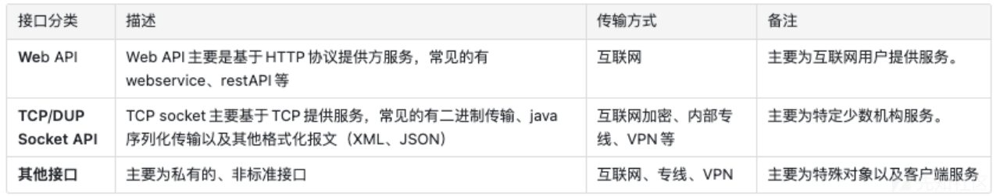

#### 测试方式

Web API 测试主要参考常规web测试，使用burpsuite、fiddler、Firefox-hackbar插件等集成安全测试工具对API接口进行分析、测试。

Socket API测试使用SocketTool等socket数据包测试工具，以及开发接口的公司使用的专用测试工具或者自己编写的测试脚本进行分析、测试。

使用wireshark进行数据包流量分析。 其他接口测试（接近研究性质），主要使用wireshark、SocketTool、自主编写的测试（FUZZ）脚本等进行测试。

#### 测试流程

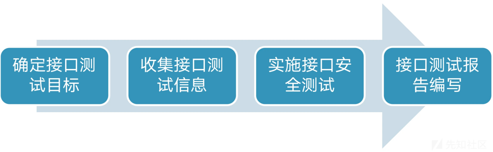
