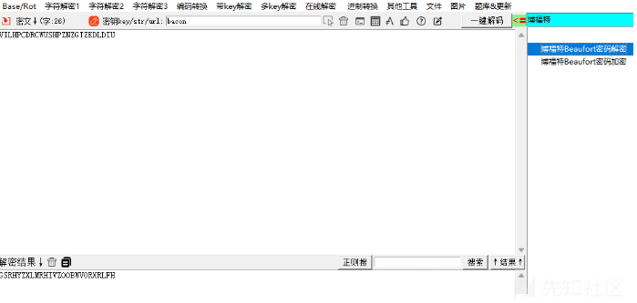
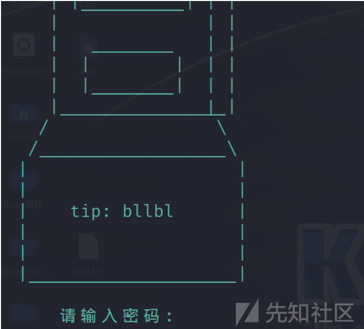
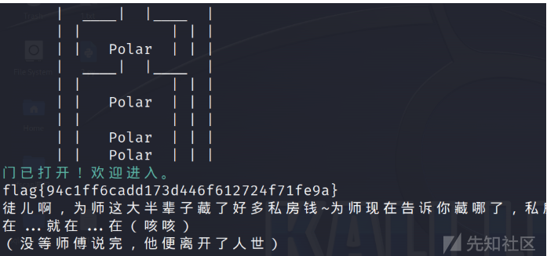

# PolarD&N--2024冬季个人挑战赛--Crypto-WP-先知社区

> **来源**: https://xz.aliyun.com/news/16103  
> **文章ID**: 16103

---

# 博福特与埃特巴什的秘密

题目描述：


根据题目名字，再根据提示用博福特解码



再根据题目用埃特巴什码解密：


# 幂数加密了解一下

txt:

44420122088421088810140108442

根据题目意思 把0去掉 当间隔 ：4442 122 88421 8881 14 1 8442

然后幂数加密 是由2的倍数来组成然后依次相加：

4442就是由22+22+22+21 然后相加为14 在英文表里就是N

122：E

88421：W

8881:Y

14: E

1:A

8842:R

所以flag为：flag{NEWYEAR}

# bllbl的密码锁

txt:

```
U2FsdGVkX1+2ohXvVEyY3J2P3xS6K1uQdbmRnTd2cEYaMPNEgl/mZJuM3+KGIh46
ZeKSgkr3IVCY8GhSGWRuh9qocOLTVO9bXHVqTTkXFf6+Pn68lihnaxXfgyyS0mPY
X4YLnw8yug8OvjGRVnB9yjdXZL2rZivQSGqe4CfQqk9+Ut9rLqkogqbwpEhCG9nM
3J72KKVqGJ46l9D8YX/8S3msGcCOVBkN+CKln3+ddwUR2tE3xIC8hTLCQH2sG+LJ
ot9XSw9a/12l/YlVq5S8fMyCgdzdn8CIwRRKCOcZyUz5eoaeAPAbnE1I5J2smhVs
wsFfjJ1eR93hbm3yAJbI2HeMZhrke/KY8ixpivaL/1N7tmC2xKlfY9/p3MGzlFL5
o5mAmMG5ogkW9Rz6aM36eSr0nVQRu97Dy8ljLipEOF+wepJmxqHIcphLq0EzJjtM
F5VY1bTk6uFOjIbvQuePQiu/56cj+CP3+8I9nL0gajMZJ0oeuYXTi0n100FtznDS
A5pHnCs+7FCXFnibYhGxhylYYLOEN7evhgfNK3m+jTix+Z1oDU7KbegN0Q6nwh8v
rCwL+nWsWCoKAd/eYGkIHvt4nYcIW0DYIah8k+abADmREFSn/xr+/+x75xYrlJkD
pyxg/cKzpk+JFxPxcCVRbGk+fDUQbiL5I0am1F5jMWqEQj0OwXMxMiXjek84admP
2OABxIhf+r/DWtnlkDg+QE3w9nZCfDWrlVZSXlgSfeJCVOkVaKOaAuixCmnCeUEY
e7EroMah6ga1CqYcGaYYT1nEFpU3kVF9hGvNGy6C+EAz8P6GV+eKA8bdOrBFazD0
rNrh9ANX9C1lPr9VJmG/WfCFXSOoRksclGrAZyU94LkVqTk5OE493HTD9OHBawz8
iM92zUYPBMsuqvRf+x4RPiRTNrgubmIjxb1+4lR1p8KU6nhJuiahVDBvaWWHcvxd
I4UHggatwoF7nmxVCzuTjymEslKcn9WkDGfd2C62cxQ/fJoOsFp3qpLYPPGQksYq
1xj4AZkl8MGE5QqrGXd8MoqF/RIn3iflZ/j60nONkc3Z5RaZCQ9z0qG+7PlJSXer

```

然后连接nc：



提示是bllbl，应该是个密钥

再看txt里面是U2Fsd开头，应该是AES或者rabbit解密。

```
class Bllbl_crypto1:
    def __init__(self):
        self.char_map = "BALUINGbaluing+-"#偶吼吼吼，balalabuliang的大小写作为集合哦
        self.index_map = {char: index for index, char in enumerate(self.char_map)}

    def encode(self, mingwen):
        b_str = ''.join(format(int(char, 16), '04b') for char in mingwen)
        list_en = []
        for i in range(0, len(b_str), 4):
            list_4_b = b_str[i:i + 4]
            index = int(list_4_b, 2)
            list_en.append(self.char_map[index])

        return ''.join(list_en)

#                  哼~什么注释都不给你，嘿嘿，因为【害羞】~你最棒了，可不要小瞧我们的羁绊啊


密文：nInuILUauBilLUaLBgnnNBluG-bNaIlinaA+bLaglgInL-GUG-BGb-alnnAIaGLn+nninab+IiNn+L-+LaUBa-gl-Lubiu-Uua

```

然后逆向解码即可：

```
class Bllbl_crypto1:
    def __init__(self):
        self.char_map = "BALUINGbaluing+-"
        self.index_map = {char: index for index, char in enumerate(self.char_map)}

    def decode(self, cipher):
        # 将密文字符映射回对应的 4 位二进制
        binary_str = ''.join(format(self.index_map[char], '04b') for char in cipher)

        # 每 4 位二进制组成一个 16 进制字符
        hex_str = ''.join(hex(int(binary_str[i:i + 4], 2))[2:] for i in range(0, len(binary_str), 4))

        return hex_str


# 使用解码器
crypto = Bllbl_crypto1()
ciphertext = "nInuILUauBilLUaLBgnnNBluG-bNaIlinaA+bLaglgInL-GUG-BGb-alnnAIaGLn+nninab+IiNn+L-+LaUBa-gl-Lubiu-Uua"
plaintext = crypto.decode(ciphertext)

print(f"解码后的明文: {plaintext}")
#c4ca4238a0b923820dcc509a6f75849bc81e728d9d4c2f636f067f89cc14862ceccbc87e4b5ce2fe28308fd9f2a7baf3a8

```

将得到的明文去服务器上交互：



# RSA共模攻击

task：

```
n1= 20367004933619640329031799226776514837061685981664854285308115632909435670724596920128402172098160576548639864098528644817516365660648152982472184401323785790562533467196556834124275893853534815001482876360398354954695792370636033673202145070244264275187457752956505832556854269231285319773348399301741813934834487846223229051935634443669493220012667872355681808618502449585839172939977649524262173256707695568263984472286856069995773192355643301872930251256460438128472182620887659172465881490174220827917135702261368000920219514539361766564775919476617752618166100973206718108473026971567131239107358379641923763013
n2= 20367004933619640329031799226776514837061685981664854285308115632909435670724596920128402172098160576548639864098528644817516365660648152982472184401323785790562533467196556834124275893853534815001482876360398354954695792370636033673202145070244264275187457752956505832556854269231285319773348399301741813934834487846223229051935634443669493220012667872355681808618502449585839172939977649524262173256707695568263984472286856069995773192355643301872930251256460438128472182620887659172465881490174220827917135702261368000920219514539361766564775919476617752618166100973206718108473026971567131239107358379641923763013
e1= 2333
e2= 23333
c1= 10264744066430466481593872630149143558573077174416980857009118692134660819073913212595308263898462327337283768644911383152506209840559778285757586705322364622425329621425100366723498923698716160356383331699930898455469318543849123623408889653265452565954257437198570129871082756267930336123137826093005304199337852991417533302939219968193861864872868938531890911844179764341487167273826185141101537209604030231278035081281820795150900579415774349854010257952836794529900536730723453110219127519437954530016383921843131179651083796172790701851004000889426375776340135273928938349542525459256006377475939436412482003970
c2= 5419945808600875685324905255766599302044490914532517430566320331248051121989090272712976205411073231922350575383585807837699039790705965844972602000549867253273355997765191642673804824094384527196797854210696722264604208353972695860473231983654542614752370002709975410103077627528638449599044074982480645065659196532121501525242050349677315892712735554820817806905097442560421171589689581990204756724213720035752010249253635380639611831099379821172339940499162281183608981563319912252895890992937277744761454652788338855099270346501953960046919430422924656133558212488023532963289949329182442150206387260469485512737
```

就是个不互素的共模攻击(

exp:

```
import gmpy2
from Crypto.Util.number import *
n1= 20367004933619640329031799226776514837061685981664854285308115632909435670724596920128402172098160576548639864098528644817516365660648152982472184401323785790562533467196556834124275893853534815001482876360398354954695792370636033673202145070244264275187457752956505832556854269231285319773348399301741813934834487846223229051935634443669493220012667872355681808618502449585839172939977649524262173256707695568263984472286856069995773192355643301872930251256460438128472182620887659172465881490174220827917135702261368000920219514539361766564775919476617752618166100973206718108473026971567131239107358379641923763013
n2= 20367004933619640329031799226776514837061685981664854285308115632909435670724596920128402172098160576548639864098528644817516365660648152982472184401323785790562533467196556834124275893853534815001482876360398354954695792370636033673202145070244264275187457752956505832556854269231285319773348399301741813934834487846223229051935634443669493220012667872355681808618502449585839172939977649524262173256707695568263984472286856069995773192355643301872930251256460438128472182620887659172465881490174220827917135702261368000920219514539361766564775919476617752618166100973206718108473026971567131239107358379641923763013
e1= 2333
e2= 23333
c1= 10264744066430466481593872630149143558573077174416980857009118692134660819073913212595308263898462327337283768644911383152506209840559778285757586705322364622425329621425100366723498923698716160356383331699930898455469318543849123623408889653265452565954257437198570129871082756267930336123137826093005304199337852991417533302939219968193861864872868938531890911844179764341487167273826185141101537209604030231278035081281820795150900579415774349854010257952836794529900536730723453110219127519437954530016383921843131179651083796172790701851004000889426375776340135273928938349542525459256006377475939436412482003970
c2= 5419945808600875685324905255766599302044490914532517430566320331248051121989090272712976205411073231922350575383585807837699039790705965844972602000549867253273355997765191642673804824094384527196797854210696722264604208353972695860473231983654542614752370002709975410103077627528638449599044074982480645065659196532121501525242050349677315892712735554820817806905097442560421171589689581990204756724213720035752010249253635380639611831099379821172339940499162281183608981563319912252895890992937277744761454652788338855099270346501953960046919430422924656133558212488023532963289949329182442150206387260469485512737

_,x,y=gmpy2.gcdext(e1,e2)
m=pow(c1,x,n1)*pow(c2,y,n2)%n1
a=gmpy2.gcd(e1,e2)
m=gmpy2.iroot(m,a)[0]
print(long_to_bytes(m))

```

# variation-rsa

task:

```
from Crypto.Util.number import *
from flag import *

n1 = 14824267720565830614198366423536599666692078969408403530258418602151322644585576708517191288357418574410537646212589360867055238409644225020114747038342097744542022643037865665129552322573216047070677736725417436626920538199776045223182025555032687422098410274010072272948921387942284889428172227747124840681230287572405913777684484640035353309074356839921615363768839468380890923086904115913017609689750326299359077846457821010369130002914875100460359637094049091716624328545343429605828899486733904861746381542564902018804771429533804771098266001841458433664015729735822285137823715376774756745985491673136930276941
n2 = 21093893530165595850339636291340886775560459889174993298599564679470961520127537242137351793326916956073009495303622153882623912792088101281148271957920985536369095953335024370158909102755939425266322061024660469804331164229029302486833732919273709880115072578649082360889893770131535569945349586879686172801621707802368786052168013925892590355941771860436819249314675001571361991296570354259045254453585842424561844676250437625123809885279029491512960326206418322762119343167800501997630708987739950144724219375568233516957162796160222178022591375724806703162674485897117438453945303273004012532132059011075717387753
n3 = 18851781425565649500243914718895527060598553785142033499277947796047289729069551538151421839511239897691881228121437622923274745439286192958624933347473814433650645821240330239352230328910532686189064529002598986350545013596873280380093139589440286483854335646063005690269032198568724965964443111093291700142910652223408636268615176273268372177721667944316123253596652992256076572634227395015036348109972259736684061785035583511127926569341967394058493301139935304361924639075754092181040235419401702148068770694697982444290753353433701503833775179671108406498799549700127209151389161427718168658930877516526900193773
n4 = 24141384186719901100738328229558939321137195844627407412035205930880546126459260897433418685279927024995699136588216700770429628894224051287181657357533218989737870319139269421990248988961435374202640406264110282763206906390508271179764960952342404379846442988489435158217691170804372863828966379599925114485971708200189788312061335938149982724447336254731731196164294152411281627551943972751739099703406466680639123738668207648503911709799873188331259979032169198913999856215096219340617703116234922400948884716827963616800355410477122406692338452507358998811789750057925245184372948089354754021196407808558611706347
n5 = 27318577363188389010777000006309038146149568153342680277329454682460382014736977771701476436793256452622448296665625336293530182434223007914485160853928124259423931234549637565465312854050133553101056456348604117421250840812257865413145378087504121964973256347325500523801284199727074717327057009988590900033465488838411205419861719503492329750506421557659566793009179911321072512769094073583391850440926455889648811384353704831466087203207493141784030943780957637583967661055007939557364118592325819246060161116832663690401118085081185643994190287681118343291069123911734332419664019717764123106277592362757215369227
n6 = 23279048677948732944246045283025308427605697005872399005537528250552617144495344749322775508766281162164676817529480952526644219727544025172002421791418672728154203177554834465135080719871147878014347768357902201127620075363554533320943045725990456088670395831473286777889590888927822294580895334230380579965775406733741903354395281680491679994952638403650250478885893675153500100983994448967210657066830060805681453121007319883818996584537483756124030749688830761886047644923339363936836237308406534213706297507538286802906757352059469885515114285041899411525651842889457974296366733997911092037452209283086447745201

e1 = 59537
e2 = 86311
e3 = 65537

mm1 = bytes_to_long(flag1)
mm2 = bytes_to_long(flag2)
mm3 = bytes_to_long(flag3)

c1 = pow(mm1, e1, n1)
c1 = pow(c1, e1, n2)
c2 = pow(mm2, e2, n3)
c2 = pow(c2, e2, n4)
c3 = pow(mm3, e3, n5)
c3 = pow(c3, e3, n6)
print("c1 =", c1)
print(
    "---------------------------------------------------------------PolarCTF(别看俺，俺是分割线 QwQ)--------------------------------------------------------------------------")
print("c2 =", c2)
print(
    "---------------------------------------------------------------PolarCTF(别看俺，俺是分割线 QwQ)--------------------------------------------------------------------------")
print("c3 =", c3)

# c1 = 15586247697277532046812950432902773732327329184929961854997495210573627117260228709936327195953289907799735776425925363312137294734464930656006335287372431016600211951629567046779533236160645460268386728835983326093046904859159743244507215622807770074479759250929154791311227414122209325560728780689824290378441264308163115237261828259796271013473102073280513506976297605519870543598183104646977435546991722183887485579279535990826339444296156216087404614022283778959805361955256593072994347166395388701693394136294643451644783704090395347138731250701463174399456633197640174044073848759722308083678547686777162484795
# c2 = 17538934691576368783671402501171847280494794600029573039793422483216151678595631267048878509399287917096434364875515741919976948438750360077454119679833636779683059708923187173534056993351622231730338590900612436146711101466447607660747846309349555660230127698911782175033934569458421302573395765698060907602063256600517663557182214450409111576326817516851471592870072454559230917774145790891005667612040640372734277924267234931622903586083603003276003081251200734229179424055785828132466558983095351212117320446426640092631710276126438840261800085306640721068097066410181192932853444970770042765344237745920213249599
# c3 = 16500292460777375934245920298090466447118028191799066692857815637083078289925184090552039119465751284568237901897458018074018407946955502121238967064151893052235846218026798473133501871632705816383843633672282725382714026554688976046798940263992443021302540771543277815175625781564566057557112370221505148930784203175724847617881577039888356144680645030276155402270796992419421218599142459006125030744519466683717481511271970404369880716637102820401418219595824439631746538283450446161346732193660604974975033057222454482416413370442920846656168361120774965471969258033191477596029419991953860038094093086641087013952

```

根据公因子可以求出p,q来 ，然后逆过来求m1,m2,m3就可以了，需要注意这里的m1,m2,m3需要decode()才行，不然是乱码。

exp:

```
from Crypto.Util.number import *
import gmpy2

c1 = 15586247697277532046812950432902773732327329184929961854997495210573627117260228709936327195953289907799735776425925363312137294734464930656006335287372431016600211951629567046779533236160645460268386728835983326093046904859159743244507215622807770074479759250929154791311227414122209325560728780689824290378441264308163115237261828259796271013473102073280513506976297605519870543598183104646977435546991722183887485579279535990826339444296156216087404614022283778959805361955256593072994347166395388701693394136294643451644783704090395347138731250701463174399456633197640174044073848759722308083678547686777162484795
c2 = 17538934691576368783671402501171847280494794600029573039793422483216151678595631267048878509399287917096434364875515741919976948438750360077454119679833636779683059708923187173534056993351622231730338590900612436146711101466447607660747846309349555660230127698911782175033934569458421302573395765698060907602063256600517663557182214450409111576326817516851471592870072454559230917774145790891005667612040640372734277924267234931622903586083603003276003081251200734229179424055785828132466558983095351212117320446426640092631710276126438840261800085306640721068097066410181192932853444970770042765344237745920213249599
c3 = 16500292460777375934245920298090466447118028191799066692857815637083078289925184090552039119465751284568237901897458018074018407946955502121238967064151893052235846218026798473133501871632705816383843633672282725382714026554688976046798940263992443021302540771543277815175625781564566057557112370221505148930784203175724847617881577039888356144680645030276155402270796992419421218599142459006125030744519466683717481511271970404369880716637102820401418219595824439631746538283450446161346732193660604974975033057222454482416413370442920846656168361120774965471969258033191477596029419991953860038094093086641087013952

n1 = 14824267720565830614198366423536599666692078969408403530258418602151322644585576708517191288357418574410537646212589360867055238409644225020114747038342097744542022643037865665129552322573216047070677736725417436626920538199776045223182025555032687422098410274010072272948921387942284889428172227747124840681230287572405913777684484640035353309074356839921615363768839468380890923086904115913017609689750326299359077846457821010369130002914875100460359637094049091716624328545343429605828899486733904861746381542564902018804771429533804771098266001841458433664015729735822285137823715376774756745985491673136930276941
n2 = 21093893530165595850339636291340886775560459889174993298599564679470961520127537242137351793326916956073009495303622153882623912792088101281148271957920985536369095953335024370158909102755939425266322061024660469804331164229029302486833732919273709880115072578649082360889893770131535569945349586879686172801621707802368786052168013925892590355941771860436819249314675001571361991296570354259045254453585842424561844676250437625123809885279029491512960326206418322762119343167800501997630708987739950144724219375568233516957162796160222178022591375724806703162674485897117438453945303273004012532132059011075717387753
n3 = 18851781425565649500243914718895527060598553785142033499277947796047289729069551538151421839511239897691881228121437622923274745439286192958624933347473814433650645821240330239352230328910532686189064529002598986350545013596873280380093139589440286483854335646063005690269032198568724965964443111093291700142910652223408636268615176273268372177721667944316123253596652992256076572634227395015036348109972259736684061785035583511127926569341967394058493301139935304361924639075754092181040235419401702148068770694697982444290753353433701503833775179671108406498799549700127209151389161427718168658930877516526900193773
n4 = 24141384186719901100738328229558939321137195844627407412035205930880546126459260897433418685279927024995699136588216700770429628894224051287181657357533218989737870319139269421990248988961435374202640406264110282763206906390508271179764960952342404379846442988489435158217691170804372863828966379599925114485971708200189788312061335938149982724447336254731731196164294152411281627551943972751739099703406466680639123738668207648503911709799873188331259979032169198913999856215096219340617703116234922400948884716827963616800355410477122406692338452507358998811789750057925245184372948089354754021196407808558611706347
n5 = 27318577363188389010777000006309038146149568153342680277329454682460382014736977771701476436793256452622448296665625336293530182434223007914485160853928124259423931234549637565465312854050133553101056456348604117421250840812257865413145378087504121964973256347325500523801284199727074717327057009988590900033465488838411205419861719503492329750506421557659566793009179911321072512769094073583391850440926455889648811384353704831466087203207493141784030943780957637583967661055007939557364118592325819246060161116832663690401118085081185643994190287681118343291069123911734332419664019717764123106277592362757215369227
n6 = 23279048677948732944246045283025308427605697005872399005537528250552617144495344749322775508766281162164676817529480952526644219727544025172002421791418672728154203177554834465135080719871147878014347768357902201127620075363554533320943045725990456088670395831473286777889590888927822294580895334230380579965775406733741903354395281680491679994952638403650250478885893675153500100983994448967210657066830060805681453121007319883818996584537483756124030749688830761886047644923339363936836237308406534213706297507538286802906757352059469885515114285041899411525651842889457974296366733997911092037452209283086447745201

e1 = 59537
e2 = 86311
e3 = 65537

p1=gmpy2.gcd(n1,n2)
p2=gmpy2.gcd(n3,n4)
p3=gmpy2.gcd(n5,n6)

q1=n1//p1
q2=n2//p1
q3=n3//p2
q4=n4//p2
q5=n5//p3
q6=n6//p3


phi1=(p1-1)*(q1-1)
phi2=(p1-1)*(q2-1)
phi3=(p2-1)*(q3-1)
phi4=(p2-1)*(q4-1)
phi5=(p3-1)*(q5-1)
phi6=(p3-1)*(q6-1)

d1=gmpy2.invert(e1,phi1)
d2=gmpy2.invert(e1,phi2)
d3=gmpy2.invert(e2,phi3)
d4=gmpy2.invert(e2,phi4)
d5=gmpy2.invert(e3,phi5)
d6=gmpy2.invert(e3,phi6)

m1=pow(c1,d2,n2)
m1=pow(m1,d1,n1)
print(long_to_bytes(m1).decode())#把flag中的2给删了

m2=pow(c2,d4,n4)
m2=pow(m2,d3,n3)
print(long_to_bytes(m2).decode())#把flag中的5在原本位置上双写


m3=pow(c3,d6,n6)
m3=pow(m3,d5,n5)
print(long_to_bytes(m3).decode())#flag{c2c4c982b574fb735487899f11faed80}

#flag{cc4c98b5574fb7355487899f11faed80}

```
