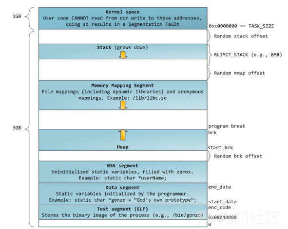
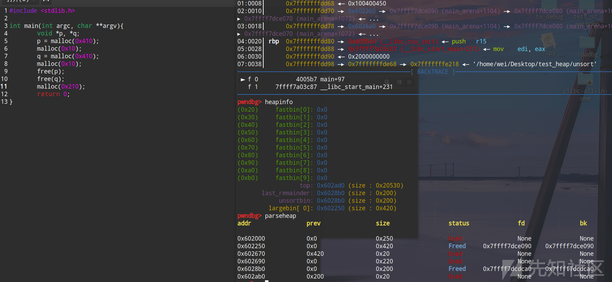

# Ptmalloc2源代码分析（Glibc内存管理）-先知社区

> **来源**: https://xz.aliyun.com/news/16109  
> **文章ID**: 16109

---

# 1. 基础知识

## 1.1 Linux 进程内存布局

Linux 系统在装载 elf 格式的程序文件时，会调用 `loader` 把可执行文件中的各个段依次载入到从某一地址开始的空间中（载入地址取决于 `link editor(ld)` 和机器地址位数，在 32 位机器上是 0x8048000，即 128M 处）。以 32 位机器为例，首先被载入的是 `.text` 段，然后是 `.data` 段，最后是 `.bss` 段。上面的空间供内核使用，应用程序不可以直接访问。应用程序的堆栈从最高地址处开始向下生长，`.bss` 段与栈之间的空间是空闲的，空闲空间被分成两部分，一部分为 heap，一部分为 mmap 映射区域。Heap 和 mmap 区域都可以供用户自由使用，但是它在刚开始的时候并没有映射到内存空间内，是不可访问的。

在向内核请求分配 heap, mmap 空间之前，对这些空间进行访问会导致 `segmentation fault`。用户程序可以直接使用系统调用来管理 heap 和 mmap 映射区域，但更多的时候程序都是使用 C 语言提供的 `malloc()` 和 `free()` 函数来动态的分配和释放内存。

stack 区域是唯一不需要映射，用户却可以访问的内存区域，这也是利用堆栈溢出进行攻击的基础。

结构图如下。



栈至顶向下扩展，并且栈是有界的。堆至底向上扩展，mmap 映射区域至顶向下扩展，mmap 映射区域和堆相对扩展，直至耗尽虚拟地址空间中的剩余区域，这种结构便于 C 运行时库使用 mmap 映射区域和堆进行内存分配。

## 1.2 操作系统内存分配函数

heap 和 mmap 映射区域是可以提供给用户程序使用的虚拟内存空间，操作系统提供了相关的系统调用来分配该区域的内存。对 heap 的操作，操作系统提供了 `brk()` 函数，C 运行时库提供了 `sbrk()` 函数；对 mmap 映射区域的操作，操作系统提供了 `mmap()` 和 `munmap()` 函数。Glibc 同样是使用这些函数向操作系统申请虚拟内存。

这里提一个很重要的概念，内存的延迟分配，只有在真正访问一个地址的时候才建立这个地址的物理映射，这是 Linux 内存管理的基本思想之一。Linux 内核在用户申请内存的时候，只是给它分配了一个线性区（也就是虚拟内存），并没有分配实际物理内存；只有当用户真正使用到这块内存的时候，内核才会分配具体的物理页面给用户，这时候才占用宝贵的物理内存。内核释放物理页面是通过释放线性区，找到其所对应的物理页面，将其全部释放的过程。

## 1.3 ptmalloc 内存分配

首先要知道，当一个 chunk 被链入 fast bins 或者 tcache 的时候，它的下一个堆块的 `pre_inuse` 位是不会被改变的，依旧为 1，这就意味着在没有触发 `malloc_consolidate` 等内存整理的机制时，他们是不会被其它堆块合并、整理的，当 chunk 被链入 unsorted bin 时，下一个堆块的 `pre_inuse` 位便会改成 0，在下一次内存整理的时候它们就会被链入对应的真正的 bins，即 small bins 或者 large bins。

初学者很容易卡在 small bins 和 large bins 的分配过程上，不清楚这些 chunk 怎么来的，这需要读完 malloc 和 free 的源码才会有比较深的认识。

简单讲一下当用户正常请求分配内存时的大致流程（这里省略了一些类似判断分配区、申请系统资源之类的操作，只关注我们应该主要了解的、正常使用下常用的，详细见 2.1 的 malloc 源码分析）。

1. ptmalloc 首先会查找用户所需的分配空间是否在 fast bins 范围内（0x80），如果是的话就去所属 fast bin 链找有没有合适的空闲 chunk，可以找到就结束分配。
2. 检查是否在 small bins 范围内（0x400），如果是的话就去所属 small bin 链查找是否有空闲 chunk，可以找到就在那条链的尾部摘出一个 chunk，结束分配。
3. 此时说明用户申请的空间比较大，或者说相应的 bin 链中没有 chunk，ptmalloc 开始遍历 fast bins 中的 chunk，将相邻的空闲 chunk 进行合并后链入 unsorted bin，然后**遍历 unsorted bin** 中的 chunk。

   3.1 如果 unsorted bin 只有一个 chunk，并且这个 chunk 在上次分配时被使用过，并且所需分配的 chunk 大小属于 small bins，且 chunk 的大小大于等于需要分配的大小，这种情况下就直接将该 chunk 进行切割，剩下的部分继续留在 unsorted bin 里，分配结束；

   3.2 否则比如 unsorted bin 里有若干 chunk，就会从后往前一直整理这些 chunk，根据 chunk 的空间大小**将其放入所属 small bin 链或是 large bin 链中**，一直整理直到遇到 `chunk_size = nb` 的 chunk，或者说整理到 bin 链为空。

   > 写了个 demo 测试 unsorted bin 链里有多个 chunk 的情况，假如不清楚 small/large bins 的入链机制，就很容易感到疑惑，这里抛出一个问题：通过调试我们可以发现最后进行的 malloc，切割的是最后入 unsorted 链的 chunk，就是 unsorted bin 的链头，那为什么不是链尾的那个 chunk 呢，毕竟 unsorted bin 是 FIFO 的啊。
   >
   > 
   >
   > 实际上，chunk 不是直接在 unsorted bin 里面被切割的，因为此时 unsorted bin 里面有不止一个 chunk，如果是只有一个的话就是直接切割。这里将所有 unsorted chunk 从后往前先链入了 large bin，这俩堆块大小一致，被链入同一条 bin 链，高地址的那个堆块是最后被链入的，然后根据 best-fit 原则找到了相应的 bin 链后，高地址的那个堆块被当成了”候选“的，从中切割出 0x220 后，剩下的部分被链入 unsorted，这个“候选“详见 2.1 的源码的注释里面的 5.1 之前那一段源码注释，如下。
   >
   > “如果从 large bin 链表中选取的 chunk victim 不是链表中的最后一个 chunk，并且与 victim 大小相同的chunk不止一个，那么意味着 victim 为 chunk size 链表中的节点，为了不调整 chunk size 链表，需要避免将 chunk size 链表中的节点取出，所以取 victim->fd 节点对应的 chunk 作为候选 chunk。由于 large bin 链表中的 chunk 也是按大小排序，同一大小的 chunk 有多个时，这些 chunk 必定排在一起，所以 victim->fd 节点对应的 chunk 的大小必定与 victim 的大小一样。”
4. 如果到了这一步还是没能分配出去，说明需要分配的是一块比较大的内存，或者在 small bins 和 unsorted bin 中都找不到合适的 chunk，此时 fast bins 和 unsorted bin 中所有的 chunk 都清理干净了，合并了一部分 chunk 进入 small/large bins，那接下来继续找对应的 bin 链子，如果还没成功，就遍历 small bins 和 large bins，按照 “smallest-first，best-fit” 原则，找一个合适的 chunk，从中划分一块所需大小的 chunk，并将剩下的部分链入到 unsorted bin 中。若操作成功，则分配结束。
5. 若是还没能分配成功的话就到 `sbrk`, `mmap` 了。

# 2. 源代码分析

主要分析的文件包括 `arena.c` 和 `malloc.c`，这两个文件包括了 `ptmalloc` 的核心实现，其中 `arena.c` 主要是对多线程支持的实现，`malloc.c` 定义了公用的 malloc()，free()等函数，实现了基于分配区的内存管理算法。

## 2.1 内存分配 malloc

ptmalloc2 主要的内存分配函数为 `malloc()`，即源码里的 `__libc_malloc()`，它其实是对 `_int_malloc()` 函数的简单封装，`_int_malloc()` 函数才是内存分配的核心。

首先看 `__libc_malloc()`。

```
void *
__libc_malloc(size_t bytes)
{
  //首先检查是否存在内存分配的 hook 函数，如果存在，调用 hook 函数，并返回，hook 函数主要用于进程在创建新线程过程中分配内存，或者支持用户提供的内存分配函数。
  mstate ar_ptr;
  void *victim;

  void *(*hook)(size_t, const void *) = atomic_forced_read(__malloc_hook);
  if (__builtin_expect(hook != NULL, 0))
    return (*hook)(bytes, RETURN_ADDRESS(0));

  //获取分配区指针，如果获取分配区失败，返回退出，否则，调用 _int_malloc() 函数分配内存。
  arena_get(ar_ptr, bytes);

  victim = _int_malloc(ar_ptr, bytes);
  /* Retry with another arena only if we were able to find a usable arena
     before.  */


  //如果 _int_malloc() 函数分配内存失败，就会判断使用的分配区是不是主分配区，然后是一些获取分配区，解锁之类的操作。
  if (!victim && ar_ptr != NULL)
  {
    LIBC_PROBE(memory_malloc_retry, 1, bytes);
    ar_ptr = arena_get_retry(ar_ptr, bytes);
    victim = _int_malloc(ar_ptr, bytes);
  }

  if (ar_ptr != NULL)
    (void)mutex_unlock(&ar_ptr->mutex);

  assert(!victim || chunk_is_mmapped(mem2chunk(victim)) ||
         ar_ptr == arena_for_chunk(mem2chunk(victim)));
  return victim;
}

```

`ar_ptr` 是指向全局内存分配器的指针，说白了就是全局内存分配器状态机，`main_arena` 也是 `mstate` 结构。

`atomic_forced_read` 是汇编语句，用于原子读操作，每次只会读取一次，例如调用 `malloc_hook_ini` 初始化，只会调用一次。

`__malloc_hook` 指向 `malloc_hook_ini`，该函数为 ptmalloc 的初始化函数。主要用于初始化全局状态机和 chunk 的数据结构，首先来看看 `malloc_hook_ini` 函数。

```
/**

* 初始化。

*/

static void *

malloc_hook_ini (size_t sz, const void *caller){
    //先将 malloc_hook 的值设置为 NULL，然后调用 ptmalloc_init 函数，最后又回调了 libc_malloc 函数。
    __malloc_hook = NULL;
    ptmalloc_init ();
    return __libc_malloc (sz);

}

```

总结一下运行流程：

第一次调用 malloc 申请堆空间：首先会跟着 hook 指针进入 `malloc_hook_ini()` 函数里面进行对 ptmalloc 的初始化工作，并置空 hook，再调用 `ptmalloc_init()` 和 `__libc_malloc()`；

再次调用 malloc 申请堆空间：malloc() -> \_\_libc\_malloc() -> \_int\_malloc()。

然后终于分析到核心函数 \_int\_malloc() 了。

```
static void *
_int_malloc(mstate av, size_t bytes)
{
  INTERNAL_SIZE_T nb; /* 符合要求的请求大小 */
  unsigned int idx;   /* 相关的bin指数 */
  mbinptr bin;        /* 相关的bin */

  mchunkptr victim;     /* 检查/选择的块 */
  INTERNAL_SIZE_T size; /* its size */
  int victim_index;     /* its bin index */

  mchunkptr remainder;          /* 被分割的剩余部分 */
  unsigned long remainder_size; /* its size */

  unsigned int block; /* bit map traverser */
  unsigned int bit;   /* bit map traverser */
  unsigned int map;   /* current word of binmap */

  mchunkptr fwd; /* misc temp for linking */
  mchunkptr bck; /* misc temp for linking */

  const char *errstr = NULL;

  /*
     Convert request size to internal form by adding SIZE_SZ bytes
     overhead plus possibly more to obtain necessary alignment and/or
     to obtain a size of at least MINSIZE, the smallest allocatable
     size. Also, checked_request2size traps (returning 0) request sizes
     that are so large that they wrap around zero when padded and
     aligned.
   */

  checked_request2size(bytes, nb);

```

`checked_request2size()` 函数将请求分配的内存大小 bytes 转换为需要分配下去的 chunk 实际大小 nb。Ptmalloc 内部分配都是以 chunk 为单位，根据 chunk 的大小，决定如何分配满足条件的 chunk，达到分配最小的 size 的同时符合对齐要求的目的。

如果所需的 chunk 大小小于等于 fast bins 中的最大 chunk 大小，首先尝试从 fast bins 中 分配 chunk。

先检查是否属于 fast bins 范围内，尝试分配链中的 chunk 出去，源码如下。

```
/*
     If the size qualifies as a fastbin, first check corresponding bin.
     This code is safe to execute even if av is not yet initialized, so we
     can try it without checking, which saves some time on this fast path.
   */

  if ((unsigned long)(nb) <= (unsigned long)(get_max_fast()))
  {
    //根据所需 chunk 的大小获得该 chunk 所属 fast bin 的 index。
    idx = fastbin_index(nb);

    //从链中取出第一个 chunk，并调用 chunk2mem() 函数返回用户所需的内存块。
    mfastbinptr *fb = &fastbin(av, idx);
    mchunkptr pp = *fb;
    do
    {
      victim = pp;
      if (victim == NULL)
        break;
    } while ((pp = catomic_compare_and_exchange_val_acq(fb, victim->fd, victim)) != victim);
    if (victim != 0)
    {
      if (__builtin_expect(fastbin_index(chunksize(victim)) != idx, 0))
      {
        errstr = "malloc(): memory corruption (fast)";
      errout:
        malloc_printerr(check_action, errstr, chunk2mem(victim), av);
        return NULL;
      }
      check_remalloced_chunk(av, victim, nb);
      void *p = chunk2mem(victim);
      alloc_perturb(p, bytes);
      return p;
    }
  }

```

然后检查是否属于 small bins 范围内，是的话则会执行如下的代码：

```
/*
     If a small request, check regular bin.  Since these "smallbins"
     hold one size each, no searching within bins is necessary.
     (For a large request, we need to wait until unsorted chunks are
     processed to find best fit. But for small ones, fits are exact
     anyway, so we can check now, which is faster.)
   */

  if (in_smallbin_range(nb))
  {
    idx = smallbin_index(nb);

    //根据 index 获得某个 small bin 的空闲 chunk 双向循环链表表头,在 if 语句里将最后一个 chunk 赋值给 victim。
    bin = bin_at(av, idx);
    //如果 victim 与表头相同，表示该链表为空，不能从 small bin 的空闲 chunk 链表中分配。
    //下面都是 victim 与表头不相同的情况。
    if ((victim = last(bin)) != bin)
    {
      //如果 victim 为 0，表示所属 small bin 还没有初始化为双向循环链表，调用 malloc_consolidate() 函数将 fast bins 中的 chunk 合并。
      if (victim == 0) /* initialization check */
        malloc_consolidate(av);
      //否则说明有合适的 chunk 在对应的 bin 链，将 victim 从 small bin 的双向循环链表中取出，设置 victim chunk 的 inuse 标志，该标志处于 victim chunk 的下一个相邻 chunk 的 size 字段的第一个 bit。从 small bin 中取出 victim 也可以用 unlink() 宏函数，只是这里没有使用。
      else
      {
        bck = victim->bk;
        //经典的通过检查 victim 的 bck 的 fd 指针是否指向 victim，来确定链表是否有被破坏。
        if (__glibc_unlikely(bck->fd != victim))
        {
          errstr = "malloc(): smallbin double linked list corrupted";
          goto errout;
        }
        //脱链。
        set_inuse_bit_at_offset(victim, nb);
        bin->bk = bck;
        bck->fd = bin;

        //接着判断当前分配区是否为非主分配区，如果是，将 victim chunk 的 size 字段中的表示非主分配区的标志 bit 清零，最后调用 chunk2mem() 函数获得 chunk 的实际可用的内存指针，将该内存指针返回给应用层。
        if (av != &main_arena)
          victim->size |= NON_MAIN_ARENA;
        check_malloced_chunk(av, victim, nb);
        void *p = chunk2mem(victim);
        alloc_perturb(p, bytes);
        return p;
      }
    }
  }

```

这里要注意的是进行 `malloc_consolidate` 的时机，以及在这段代码中有两种情况是没有获取到 chunk 的，需要下一步的程序来处理：

1. **当对应的 small bin 中没有空闲 chunk。**
2. **对应的 small bin 还没有初始化完成，这时就会调用 malloc\_consolidate。**

接下来，如果 chunk 不属于 small bins，那么就一定属于 large bins，这里只直接进行 `malloc_consolidate`，然后去走下面的大循环了。

```
/*
     If this is a large request, consolidate fastbins before continuing.
     While it might look excessive to kill all fastbins before
     even seeing if there is space available, this avoids
     fragmentation problems normally associated with fastbins.
     Also, in practice, programs tend to have runs of either small or
     large requests, but less often mixtures, so consolidation is not
     invoked all that often in most programs. And the programs that
     it is called frequently in otherwise tend to fragment.
   */

  else
  {
    idx = largebin_index(nb);
    if (have_fastchunks(av))
      malloc_consolidate(av);
  }

```

最后是一个多重循环，此时 fast bins 里的 chunk 腾完到 unsorted 里了，所以接下来开始捣腾 unsorted bin。

```
/*
     Process recently freed or remaindered chunks, taking one only if
     it is exact fit, or, if this a small request, the chunk is remainder from
     the most recent non-exact fit.  Place other traversed chunks in
     bins.  Note that this step is the only place in any routine where
     chunks are placed in bins.

     The outer loop here is needed because we might not realize until
     near the end of malloc that we should have consolidated, so must
     do so and retry. This happens at most once, and only when we would
     otherwise need to expand memory to service a "small" request.
   */

  for (;;)
  {
    int iters = 0;
    //反向遍历 unsorted bin 的双向循环链表，遍历结束的条件是循环链表中只剩下一个头结点。
    while ((victim = unsorted_chunks(av)->bk) != unsorted_chunks(av))
    {
      //检查当前遍历的 chunk 是否合法。 
      bck = victim->bk;
      if (__builtin_expect(victim->size <= 2 * SIZE_SZ, 0) || __builtin_expect(victim->size > av->system_mem, 0))
        malloc_printerr(check_action, "malloc(): memory corruption",
                        chunk2mem(victim), av);
      size = chunksize(victim);

      /*
         If a small request, try to use last remainder if it is the
         only chunk in unsorted bin.  This helps promote locality for
         runs of consecutive small requests. This is the only
         exception to best-fit, and applies only when there is
         no exact fit for a small chunk.
       */

      //1.如果需要分配一个 small bin chunk，且 unsorted bin 中只有一个 chunk，且这个 chunk 为 last remainder chunk，且这个 chunk 的大小大于所需 chunk 的大小加上 MINSIZE，在满足这些条件的情况下，可以使用这个chunk切分出需要的small bin chunk。
      //这是唯一的从 unsorted bin 中分配出 small bin chunk 的情况，这种优化利于 cpu 的高速缓存命中。
      if (in_smallbin_range(nb) &&
          bck == unsorted_chunks(av) &&
          victim == av->last_remainder &&
          (unsigned long)(size) > (unsigned long)(nb + MINSIZE))
      {
        /* split and reattach remainder */
        //切割这个 chunk。
        remainder_size = size - nb;
        remainder = chunk_at_offset(victim, nb);
        unsorted_chunks(av)->bk = unsorted_chunks(av)->fd = remainder;
        av->last_remainder = remainder;
        remainder->bk = remainder->fd = unsorted_chunks(av);
        if (!in_smallbin_range(remainder_size))
        {
          remainder->fd_nextsize = NULL;
          remainder->bk_nextsize = NULL;
        }

        //设置被分割出去的 chunk 和 剩下的 last remainder chunk 的信息。
        set_head(victim, nb | PREV_INUSE |
                             (av != &main_arena ? NON_MAIN_ARENA : 0));
        set_head(remainder, remainder_size | PREV_INUSE);
        set_foot(remainder, remainder_size);

        check_malloced_chunk(av, victim, nb);
        void *p = chunk2mem(victim);
        alloc_perturb(p, bytes);
        return p;
      }

      //将当前遍历的 chunk 脱链。
      /* remove from unsorted list */
      unsorted_chunks(av)->bk = bck;
      bck->fd = unsorted_chunks(av);

      /* Take now instead of binning if exact fit */

      //2.若当前遍历的 chunk 的 size 与 nb 一致，设置物理相邻的下一个堆块的 pre_inuse 位，返回指针，结束分配。
      if (size == nb)
      {
        set_inuse_bit_at_offset(victim, size);
        if (av != &main_arena)
          victim->size |= NON_MAIN_ARENA;
        check_malloced_chunk(av, victim, nb);
        void *p = chunk2mem(victim);
        alloc_perturb(p, bytes);
        return p;
      }

      /* place chunk in bin */

      //3.如果当前遍历的 chunk 属于 small bins，那就将它链入 small bins。
      if (in_smallbin_range(size))
      {
        victim_index = smallbin_index(size);
        bck = bin_at(av, victim_index);
        fwd = bck->fd;
      }
      else
      {
        //4.如果当前遍历的 chunk 属于 large bins，那就将它链入 large bins。
        victim_index = largebin_index(size);
        bck = bin_at(av, victim_index);
        fwd = bck->fd;

        /* maintain large bins in sorted order */
        //当 large bin 链中存在 bins 时，要将该 chunk 链入合适的位置。
        //从这段源码就可以看出来一个 chunk 存在于两个双向循环链表中，一个链表包含了 large bin 中所有的 chunk，另一个链表为 chunk size 链表，该链表从每个相同大小的 chunk 的取出第一个 chunk 按照大小顺序链接在一起，便于一次跨域多个相同大小的 chunk 遍历下一个不同大小的 chunk，这样可以加快在 large bin 链表中的遍历速度。
        if (fwd != bck)
        {
          /* Or with inuse bit to speed comparisons */
          size |= PREV_INUSE;
          /* if smaller than smallest, bypass loop below */
          assert((bck->bk->size & NON_MAIN_ARENA) == 0);
          if ((unsigned long)(size) < (unsigned long)(bck->bk->size))
          {
            fwd = bck;
            bck = bck->bk;

            victim->fd_nextsize = fwd->fd;
            victim->bk_nextsize = fwd->fd->bk_nextsize;
            fwd->fd->bk_nextsize = victim->bk_nextsize->fd_nextsize = victim;
          }
          //正向遍历 chunk size 链表，直到在链中找到第一个大小小于等于当前 chunk 大小的块。
          else
          {
            assert((fwd->size & NON_MAIN_ARENA) == 0);
            while ((unsigned long)size < fwd->size)
            {
              fwd = fwd->fd_nextsize;
              assert((fwd->size & NON_MAIN_ARENA) == 0);
            }


            if ((unsigned long)size == (unsigned long)fwd->size)
              /* Always insert in the second position.  */
              fwd = fwd->fd;
            else
            {
              victim->fd_nextsize = fwd;
              victim->bk_nextsize = fwd->bk_nextsize;
              fwd->bk_nextsize = victim;
              victim->bk_nextsize->fd_nextsize = victim;
            }
            bck = fwd->bk;
          }
        }
        //当 large bin 链中没有 bins 时，直接将该 chunk 入链。
        else
          victim->fd_nextsize = victim->bk_nextsize = victim;
      }

      mark_bin(av, victim_index);
      victim->bk = bck;
      victim->fd = fwd;
      fwd->bk = victim;
      bck->fd = victim;

      //如果 unsorted bin 中的 chunk 超过了 10000 个，最多遍历 10000 个就退出，避免长时间处理 unsorted bin 影响内存分配的效率。
#define MAX_ITERS 10000
      if (++iters >= MAX_ITERS)
        break;
    }

```

前面将 unsorted bin 中的空闲 chunk 加入到相应的 small bins 和 large bins 后，（如果 nb 不属于 small bins size 范围的话）先使用最佳匹配法分配 large bin chunk，即首先到所属的 large bin 链中查找。

```
/*
       If a large request, scan through the chunks of current bin in
       sorted order to find smallest that fits.  Use the skip list for this.
     */

    //如果所需分配的 chunk 为 large bin chunk，查询对应的 large bin 链表，如果 large bin 链表为空，或者链表中最大的 chunk 也不能满足要求，则不能从 large bin 中分配。否则，遍历 large bin 链表，找到合适的 chunk。
    if (!in_smallbin_range(nb))
    {
      bin = bin_at(av, idx);

      /* skip scan if empty or largest chunk is too small */
      if ((victim = first(bin)) != bin &&
          (unsigned long)(victim->size) >= (unsigned long)(nb))
      {
        victim = victim->bk_nextsize;
        //反向遍历 chunk size 链表，直到找到第一个大于等于所需 chunk 大小的 chunk 退出循环。
        while (((unsigned long)(size = chunksize(victim)) <
                (unsigned long)(nb)))
          victim = victim->bk_nextsize;

        /* Avoid removing the first entry for a size so that the skip
           list does not have to be rerouted.  */
        //如果从 large bin 链表中选取的 chunk victim 不是链表中的最后一个 chunk，并且与 victim 大小相同的chunk不止一个，那么意味着 victim 为 chunk size 链表中的节点，为了不调整 chunk size 链表，需要避免将 chunk size 链表中的节点取出，所以取 victim->fd 节点对应的 chunk 作为候选 chunk。由于 large bin 链表中的 chunk 也是按大小排序，同一大小的 chunk 有多个时，这些 chunk 必定排在一起，所以 victim->fd 节点对应的 chunk 的大小必定与 victim 的大小一样。
        //这样脱链的就变成了 victim 的下一个同样大小的堆块了，减少了工作量，因为不用去修改 chunk size 链表。
        if (victim != last(bin) && victim->size == victim->fd->size)
          victim = victim->fd;

        //计算将 victim 切分后剩余大小，并调用 unlink() 宏函数将 victim 从 large bin 链表中取出。
        remainder_size = size - nb;
        unlink(av, victim, bck, fwd);

        //5.1.如果将 victim 切分后剩余大小小于 MINSIZE，则将整个 victim 分配出去。
        /* Exhaust */
        if (remainder_size < MINSIZE)
        {
          set_inuse_bit_at_offset(victim, size);
          if (av != &main_arena)
            victim->size |= NON_MAIN_ARENA;
        }

        //5.2.从 victim 中切分出所需的 chunk，剩余部分作为一个新的 chunk 加入到 unsorted bin 中。如果剩余部分 chunk 属于 large bins，将剩余部分 chunk 的 chunk size 链表指针设置为 NULL，因为 unsorted bin 中的 chunk 是不排序的，这两个指针无用，必须清零。
        //划重点了，这里被切割了的 chunk 剩余部分会进入 unsorted bin 链中。
        /* Split */
        else
        {
          remainder = chunk_at_offset(victim, nb);
          /* We cannot assume the unsorted list is empty and therefore
             have to perform a complete insert here.  */
          bck = unsorted_chunks(av);
          fwd = bck->fd;
          if (__glibc_unlikely(fwd->bk != bck))
          {
            errstr = "malloc(): corrupted unsorted chunks";
            goto errout;
          }
          remainder->bk = bck;
          remainder->fd = fwd;
          bck->fd = remainder;
          fwd->bk = remainder;
          if (!in_smallbin_range(remainder_size))
          {
            remainder->fd_nextsize = NULL;
            remainder->bk_nextsize = NULL;
          }
          set_head(victim, nb | PREV_INUSE |
                               (av != &main_arena ? NON_MAIN_ARENA : 0));
          set_head(remainder, remainder_size | PREV_INUSE);
          set_foot(remainder, remainder_size);
        }

        //至此已经从 large bin 中使用最佳匹配法找到了合适的 chunk，调用 chunk2mem() 获得 chunk 中可用的内存指针，返回给应用层。
        check_malloced_chunk(av, victim, nb);
        void *p = chunk2mem(victim);
        alloc_perturb(p, bytes);
        return p;
      }
    }

```

如果通过上面的方式从最合适的 large bin 中都没有分配到需要的 chunk，则查看比当前 bin 的 index 大的 small bin 或 large bin 是否有空闲 chunk 可利用来分配所需的 chunk。源代码实现如下。

```
/*
       Search for a chunk by scanning bins, starting with next largest
       bin. This search is strictly by best-fit; i.e., the smallest
       (with ties going to approximately the least recently used) chunk
       that fits is selected.

       The bitmap avoids needing to check that most blocks are nonempty.
       The particular case of skipping all bins during warm-up phases
       when no chunks have been returned yet is faster than it might look.
     */

    //获取下一个相邻 bin 的空闲 chunk 链表，并获取该 bin 对于 binmap 中的 bit 位的值。Binmap 中的标识了相应的 bin 中是否有空闲 chunk 存在。Binmap 按 block 管理，每个 block 为一个int，共 32 个 bit，可以表示 32 个 bin 中是否有空闲 chunk 存在。使用 binmap 可以加快查找 bin 是否包含空闲 chunk。这里只查询比所需 chunk 大的 bin 中是否有空闲 chunk 可用。
    ++idx;
    bin = bin_at(av, idx);
    block = idx2block(idx);
    map = av->binmap[block];
    bit = idx2bit(idx);

    //遍历 binmap 的每一个 block，直到找到一个不为 0 的 block 或者遍历完所有的 block。退出循环遍历后，设置 bin 指向 block 的第一个 bit 对应的 bin，并将 bit 置为 1，表示该 block 中 bit 1 对应的 bin，就是能够取 chunk 的 bin 链，这个 bin 中如果有空闲 chunk，它的 chunk 的大小一定满足要求。
    for (;;)
    {
      /* Skip rest of block if there are no more set bits in this block.  */
      if (bit > map || bit == 0)
      {
        do
        {
          if (++block >= BINMAPSIZE) /* out of bins */
            goto use_top;
        } while ((map = av->binmap[block]) == 0);

        bin = bin_at(av, (block << BINMAPSHIFT));
        bit = 1;
      }

      //在一个 block 遍历对应的 bin，直到找到一个 bit 不为 0 退出遍历，则该 bit 对于的 bin 中有空闲 chunk 存在。
      /* Advance to bin with set bit. There must be one. */
      while ((bit & map) == 0)
      {
        bin = next_bin(bin);
        bit <<= 1;
        assert(bit != 0);
      }

      //将 bin 链表中的最后一个 chunk 赋值为 victim。
      /* Inspect the bin. It is likely to be non-empty */
      victim = last(bin);

      //如果 victim 与 bin 链表头指针相同，表示该 bin 中没有空闲 chunk，binmap 中的相应位设置不准确，将 binmap 的相应 bit 位清零，获取当前 bin 下一个 bin，将 bit 移到下一个 bit 位，即乘以 2。
      /*  If a false alarm (empty bin), clear the bit. */
      if (victim == bin)
      {
        av->binmap[block] = map &= ~bit; /* Write through */
        bin = next_bin(bin);
        bit <<= 1;
      }


      //6.当前 bin 中的最后一个 chunk 满足要求，获取该 chunk 的大小，计算切分出所需 chunk 后剩余部分的大小，然后将 victim 从 bin 的链表中取出。接下来的操作跟“5”的基本差不多，有剩剩余部分会进 unsorted。
      else
      {
        size = chunksize(victim);

        /*  We know the first chunk in this bin is big enough to use. */
        assert((unsigned long)(size) >= (unsigned long)(nb));

        remainder_size = size - nb;

        /* unlink */
        unlink(av, victim, bck, fwd);

        /* Exhaust */
        if (remainder_size < MINSIZE)
        {
          set_inuse_bit_at_offset(victim, size);
          if (av != &main_arena)
            victim->size |= NON_MAIN_ARENA;
        }

        /* Split */
        else
        {
          remainder = chunk_at_offset(victim, nb);

          /* We cannot assume the unsorted list is empty and therefore
             have to perform a complete insert here.  */
          bck = unsorted_chunks(av);
          fwd = bck->fd;
          if (__glibc_unlikely(fwd->bk != bck))
          {
            errstr = "malloc(): corrupted unsorted chunks 2";
            goto errout;
          }
          remainder->bk = bck;
          remainder->fd = fwd;
          bck->fd = remainder;
          fwd->bk = remainder;

          /* advertise as last remainder */
          if (in_smallbin_range(nb))
            av->last_remainder = remainder;
          if (!in_smallbin_range(remainder_size))
          {
            remainder->fd_nextsize = NULL;
            remainder->bk_nextsize = NULL;
          }
          set_head(victim, nb | PREV_INUSE |
                               (av != &main_arena ? NON_MAIN_ARENA : 0));
          set_head(remainder, remainder_size | PREV_INUSE);
          set_foot(remainder, remainder_size);
        }
        check_malloced_chunk(av, victim, nb);
        void *p = chunk2mem(victim);
        alloc_perturb(p, bytes);
        return p;
      }
    }

```

如果从所有的 bins 中都没有获得所需的 chunk，可能的情况为 bins 中没有空闲 chunk，或者所需的 chunk 大小很大，下一步将尝试从 top chunk 中分配所需 chunk。源代码实现如下，其实主要是切割 top chunk 或者申请系统资源了。

```
use_top:
    /*
       If large enough, split off the chunk bordering the end of memory
       (held in av->top). Note that this is in accord with the best-fit
       search rule.  In effect, av->top is treated as larger (and thus
       less well fitting) than any other available chunk since it can
       be extended to be as large as necessary (up to system
       limitations).

       We require that av->top always exists (i.e., has size >=
       MINSIZE) after initialization, so if it would otherwise be
       exhausted by current request, it is replenished. (The main
       reason for ensuring it exists is that we may need MINSIZE space
       to put in fenceposts in sysmalloc.)
     */

    victim = av->top;
    size = chunksize(victim);

    if ((unsigned long)(size) >= (unsigned long)(nb + MINSIZE))
    {
      remainder_size = size - nb;
      remainder = chunk_at_offset(victim, nb);
      av->top = remainder;
      set_head(victim, nb | PREV_INUSE |
                           (av != &main_arena ? NON_MAIN_ARENA : 0));
      set_head(remainder, remainder_size | PREV_INUSE);

      check_malloced_chunk(av, victim, nb);
      void *p = chunk2mem(victim);
      alloc_perturb(p, bytes);
      return p;
    }

    /* When we are using atomic ops to free fast chunks we can get
       here for all block sizes.  */
    else if (have_fastchunks(av))
    {
      malloc_consolidate(av);
      /* restore original bin index */
      if (in_smallbin_range(nb))
        idx = smallbin_index(nb);
      else
        idx = largebin_index(nb);
    }

    /*
       Otherwise, relay to handle system-dependent cases
     */
    else
    {
      void *p = sysmalloc(nb, av);
      if (p != NULL)
        alloc_perturb(p, bytes);
      return p;
    }
  }

```

## 2.2 内存整理 malloc\_consolidate

`malloc_consolidate(`) 函数用于将 fast bins 中的 chunk 合并，并加入 unsorted bin 中，源码如下。

```
static void malloc_consolidate(mstate av)
{
  mfastbinptr *fb;          /* current fastbin being consolidated */
  mfastbinptr *maxfb;       /* last fastbin (for loop control) */
  mchunkptr p;              /* current chunk being consolidated */
  mchunkptr nextp;          /* next chunk to consolidate */
  mchunkptr unsorted_bin;   /* bin header */
  mchunkptr first_unsorted; /* chunk to link to */

  /* These have same use as in free() */
  mchunkptr nextchunk;
  INTERNAL_SIZE_T size;
  INTERNAL_SIZE_T nextsize;
  INTERNAL_SIZE_T prevsize;
  int nextinuse;
  mchunkptr bck;
  mchunkptr fwd;

  /*
    If max_fast is 0, we know that av hasn't
    yet been initialized, in which case do so below
  */

  //如果全局变量 global_max_fast 不为零，表示 ptmalloc 已经初始化，然后清除分配区 flag 中 fast bin 的标志位，该标志位表示分配区的 fast bins 中包含空闲 chunk，表示将要把里面的所有 chunk 都清空。
  if (get_max_fast() != 0)
  {
    clear_fastchunks(av);

    unsorted_bin = unsorted_chunks(av);

    /*
      Remove each chunk from fast bin and consolidate it, placing it
      then in unsorted bin. Among other reasons for doing this,
      placing in unsorted bin avoids needing to calculate actual bins
      until malloc is sure that chunks aren't immediately going to be
      reused anyway.
    */

    //将分配区最大的 fast bin 链指针赋值给 maxfb，第一条 fast bin 链指针赋值给 fb，然后遍历 fast bins 的每条链。
    maxfb = &fastbin(av, NFASTBINS - 1);
    fb = &fastbin(av, 0);
    do
    {
      //获取当前 bin 链的头指针赋值给 p，如果 p 不为 0，则说明当前 bin 链中存在 chunk，所有将当前 fast bin 链表的头指针赋值为 0，即删除了该 fast bin 中的空闲 chunk 链表，然后对这条链中的 chunk 进行遍历。
      p = atomic_exchange_acq(fb, 0);
      if (p != 0)
      {
        do
        {
          check_inuse_chunk(av, p);
          nextp = p->fd;

          /* Slightly streamlined version of consolidation code in free() */
          size = p->size & ~(PREV_INUSE | NON_MAIN_ARENA);
          nextchunk = chunk_at_offset(p, size);
          nextsize = chunksize(nextchunk);

          //检查当前 chunk 的前一个 chunk 是否空闲，先合并，没有直接被链入 unsorted，因为还没检查物理相邻的下一个 chunk 是否空闲。
          //如果当前 chunk 的前一个 chunk 空闲，则将当前 chunk 与前一个 chunk 合并成一个空闲 chunk，由于前一个 chunk 空闲，则当前 chunk 的 prev_size 保存了前一个 chunk 的大小，计算出合并后的 chunk 大小，并获取前一个 chunk 的指针，将前一个 chunk 从空闲链表中删除。
          if (!prev_inuse(p))
          {
            prevsize = p->prev_size;
            size += prevsize;
            p = chunk_at_offset(p, -((long)prevsize));
            unlink(av, p, bck, fwd);
          }

          //如果与当前 chunk 相邻的下一个 chunk 不是分配区的 top chunk，查看与当前 chunk 相邻的下一个 chunk 是否处于 inuse 状态。
          if (nextchunk != av->top)
          {
            nextinuse = inuse_bit_at_offset(nextchunk, nextsize);

            //如果与当前 chunk 相邻的下一个 chunk 不处于 inuse 状态，，将相邻的下一个空闲 chunk 从空闲链表中删除，并计算当前 chunk 与下一个 chunk 合并后的 chunk 大小。
            if (!nextinuse)
            {
              size += nextsize;
              unlink(av, nextchunk, bck, fwd);
            }
            //如果与当前 chunk 相邻的下一个 chunk 处于 inuse 状态，清除当前 chunk 的 inuse 状态。
            else
              clear_inuse_bit_at_offset(nextchunk, 0);

            //将合并后的 chunk 加入 unsorted bin 的双向循环链表中。
            first_unsorted = unsorted_bin->fd;
            unsorted_bin->fd = p;
            first_unsorted->bk = p;

            //如果合并后的 chunk 属于 large bin，将 chunk 的 fd_nextsize 和 bk_nextsize 设置为 NULL，因为在 unsorted bin 中这两个字段无用。
            //这里注意一下，特意清了数据。
            if (!in_smallbin_range(size))
            {
              p->fd_nextsize = NULL;
              p->bk_nextsize = NULL;
            }

            //设置合并后的空闲 chunk 大小，并标识前一个 chunk 处于 inuse 状态，因为必须保证不能有两个相邻的 chunk 都处于空闲状态。然后将合并后的 chunk 加入 unsorted bin 的双向循环链表中。最后设置合并后的空闲 chunk 的 foot 为自身的 size，chunk 空闲时必须设置 foot，该 foot 处于下一个 chunk 的 prev_size 中，只有 chunk 空闲是 foot 才是有效的。
            set_head(p, size | PREV_INUSE);
            p->bk = unsorted_bin;
            p->fd = first_unsorted;
            set_foot(p, size);
          }

          //如果当前 chunk 的下一个 chunk 为 top chunk，则将当前 chunk 合并入 top chunk，修改 top chunk 的大小。
          else
          {
            size += nextsize;
            set_head(p, size | PREV_INUSE);
            av->top = p;
          }

        //直到遍历完当前 bin 链中的所有空闲 chunk。
        } while ((p = nextp) != 0);
      }
    //直到遍历完 fast bins 的每一条 bin 链。
    } while (fb++ != maxfb);
  }
  //如果 ptmalloc 没有初始化，初始化 ptmalloc。
  else
  {
    malloc_init_state(av);
    check_malloc_state(av);
  }
}

```

## 2.3 内存释放 free

一样的，ptmalloc2 里，`__libc_free()` 是对 `_int_free()` 函数的简单封装，首先看`__libc_free()`。

```
void __libc_free(void *mem)
{
  mstate ar_ptr;
  mchunkptr p; /* chunk corresponding to mem */

  //如果存在 free 的 hook 函数，执行该 hook 函数返回，free 的 hook 函数主要用于创建新线程使用或使用用户提供的 free 函数。
  void (*hook)(void *, const void *) = atomic_forced_read(__free_hook);
  if (__builtin_expect(hook != NULL, 0))
  {
    (*hook)(mem, RETURN_ADDRESS(0));
    return;
  }

  if (mem == 0) /* free(0) has no effect */
    return;

  //根据要释放的内存空间指针获取 chunk 指针。
  p = mem2chunk(mem);

  //如果当前 free 的 chunk 是通过 mmap() 分配的，调用 munmap_chunk() 函数 unmap 本 chunk。munmap_chunk() 函数调用 munmap() 函数释放 mmap() 分配的内存块。同时查看是否开启了 mmap 分配阈值动态调整机制，默认是开启的，如果当前 free 的 chunk 的大小大于设置的 mmap 分配阈值，小于 mmap 分配阈值的最大值，将当前 chunk 的大小赋值给 mmap 分配阈值，并修改 mmap 收缩阈值为 mmap 分配阈值的 2 倍。默认情况下 mmap 分配阈值与 mmap 收缩阈值相等，都为 128KB。程序返回。
  if (chunk_is_mmapped(p)) /* release mmapped memory. */
  {
    /* see if the dynamic brk/mmap threshold needs adjusting */
    if (!mp_.no_dyn_threshold && p->size > mp_.mmap_threshold && p->size <= DEFAULT_MMAP_THRESHOLD_MAX)
    {
      mp_.mmap_threshold = chunksize(p);
      mp_.trim_threshold = 2 * mp_.mmap_threshold;
      LIBC_PROBE(memory_mallopt_free_dyn_thresholds, 2,
                 mp_.mmap_threshold, mp_.trim_threshold);
    }
    munmap_chunk(p);
    return;
  }

  //根据 chunk 指针获得分配区的指针，即 chunk 的管理块 arena，然后调用 _int_free() 函数执行实际的释放工作。
  ar_ptr = arena_for_chunk(p);
  _int_free(ar_ptr, p, 0);
}

```

然后是 `_int_free()` 函数，实现源代码如下。

```
static void
_int_free(mstate av, mchunkptr p, int have_lock)
{
  INTERNAL_SIZE_T size;     /* its size */
  mfastbinptr *fb;          /* associated fastbin */
  mchunkptr nextchunk;      /* next contiguous chunk */
  INTERNAL_SIZE_T nextsize; /* its size */
  int nextinuse;            /* true if nextchunk is used */
  INTERNAL_SIZE_T prevsize; /* size of previous contiguous chunk */
  mchunkptr bck;            /* misc temp for linking */
  mchunkptr fwd;            /* misc temp for linking */

  const char *errstr = NULL;
  int locked = 0;

  size = chunksize(p);

  //首先进行一系列的安全检查。chunk 的指针地址不能溢出，chunk 的大小必须大于等于 MINSIZE。
  /* Little security check which won't hurt performance: the
     allocator never wrapps around at the end of the address space.
     Therefore we can exclude some size values which might appear
     here by accident or by "design" from some intruder.  */
  if (__builtin_expect((uintptr_t)p > (uintptr_t)-size, 0) || __builtin_expect(misaligned_chunk(p), 0))
  {
    errstr = "free(): invalid pointer";
  errout:
    if (!have_lock && locked)
      (void)mutex_unlock(&av->mutex);
    malloc_printerr(check_action, errstr, chunk2mem(p), av);
    return;
  }
  /* We know that each chunk is at least MINSIZE bytes in size or a
     multiple of MALLOC_ALIGNMENT.  */
  if (__glibc_unlikely(size < MINSIZE || !aligned_OK(size)))
  {
    errstr = "free(): invalid size";
    goto errout;
  }

  check_inuse_chunk(av, p);

```

2.3.1 检查是否能被链进 fast bins。

```
/*
    If eligible, place chunk on a fastbin so it can be found
    and used quickly in malloc.
  */

  //如果当前 free 的 chunk 属于 fast bins 且下一个 chunk 不是 top chunk，查看下一个相邻的 chunk 的大小是否小于等于 2*SIZE_SZ，且是否大于分配区，即检查下一个相邻 chunk 的大小有没有问题。
  if ((unsigned long)(size) <= (unsigned long)(get_max_fast())

#if TRIM_FASTBINS
      /*
  If TRIM_FASTBINS set, don't place chunks
  bordering top into fastbins
      */
      && (chunk_at_offset(p, size) != av->top)
#endif
  )
  {

    if (__builtin_expect(chunk_at_offset(p, size)->size <= 2 * SIZE_SZ, 0) || __builtin_expect(chunksize(chunk_at_offset(p, size)) >= av->system_mem, 0))
    {
      /* We might not have a lock at this point and concurrent modifications
         of system_mem might have let to a false positive.  Redo the test
         after getting the lock.  */
      if (have_lock || ({
            assert(locked == 0);
            mutex_lock(&av->mutex);
            locked = 1;
            chunk_at_offset(p, size)->size <= 2 * SIZE_SZ || chunksize(chunk_at_offset(p, size)) >= av->system_mem;
          }))
      {
        errstr = "free(): invalid next size (fast)";
        goto errout;
      }
      if (!have_lock)
      {
        (void)mutex_unlock(&av->mutex);
        locked = 0;
      }
    }

    //设置当前分配区的 fast bin flag，表示当前分配区的 fast bins 中已有空闲 chunk。然后根据当前 free 的 chunk 大小获取其所属的 fast bin 头指针。
    free_perturb(chunk2mem(p), size - 2 * SIZE_SZ);

    set_fastchunks(av);
    unsigned int idx = fastbin_index(size);
    fb = &fastbin(av, idx);

    //检查 double free 的，即检查 fast bin 链头的 chunk 和要释放的 chunk 是否一致。
    /* Atomically link P to its fastbin: P->FD = *FB; *FB = P;  */
    mchunkptr old = *fb, old2;
    unsigned int old_idx = ~0u;
    do
    {
      /* Check that the top of the bin is not the record we are going to add
         (i.e., double free).  */
      if (__builtin_expect(old == p, 0))
      {
        errstr = "double free or corruption (fasttop)";
        goto errout;
      }
      //检查顶部 fastbin 块的大小是否与我们要添加的块的大小相同。
      /* Check that size of fastbin chunk at the top is the same as
         size of the chunk that we are adding.  We can dereference OLD
         only if we have the lock, otherwise it might have already been
         deallocated.  See use of OLD_IDX below for the actual check.  */
      if (have_lock && old != NULL)
        old_idx = fastbin_index(chunksize(old));
      p->fd = old2 = old;
    } while ((old = catomic_compare_and_exchange_val_rel(fb, p, old2)) != old2);

    if (have_lock && old != NULL && __builtin_expect(old_idx != idx, 0))
    {
      errstr = "invalid fastbin entry (free)";
      goto errout;
    }
  }

```

2.3.2 如果当前 free 的 chunk 的大小不在 fast bins 的范围内，且不是通过 mmap() 分配的，首先进行一系列检查。

```
/*
    Consolidate other non-mmapped chunks as they arrive.
  */

  else if (!chunk_is_mmapped(p))
  {
    //当前还没有获得分配区的锁，获取分配区的锁。
    if (!have_lock)
    {
      (void)mutex_lock(&av->mutex);
      locked = 1;
    }

    //获取当前 free 的 chunk 的下一个相邻的 chunk。
    nextchunk = chunk_at_offset(p, size);

        //进行安全检查，当前 free 的 chunk 不能为 top chunk，因为 top chunk 为空闲 chunk，如果再次 free 就可能为 double free 错误了。
    /* Lightweight tests: check whether the block is already the
       top block.  */
    if (__glibc_unlikely(p == av->top))
    {
      errstr = "double free or corruption (top)";
      goto errout;
    }
    //如果当前 free 的 chunk 是通过 sbrk() 分配的，并且下一个相邻的 chunk 的地址已经超过了 top chunk 的结束地址，即超过了当前分配区的结束地址，报错。
    /* Or whether the next chunk is beyond the boundaries of the arena.  */
    if (__builtin_expect(contiguous(av) && (char *)nextchunk >= ((char *)av->top + chunksize(av->top)), 0))
    {
      errstr = "double free or corruption (out)";
      goto errout;
    }

    //如果当前 free 的 chunk 的下一个相邻 chunk 的 size 中标志位没有标识当前 free chunk 为 inuse 状态，可能为 double free 错误。
    //这就是为什么 fast bin 的 double free 这么容易利用，因为 chunk 被链入 fast bin 是不会将下一个 chunk 的 pre_inuse 位置 0 的。
    /* Or whether the block is actually not marked used.  */
    if (__glibc_unlikely(!prev_inuse(nextchunk)))
    {
      errstr = "double free or corruption (!prev)";
      goto errout;
    }

    //计算当前 free 的 chunk 的下一个相邻 chunk 的大小，该大小如果小于等于 2*SIZE_SZ 或是大于了分配区所分配区的内存总量，报错。
    nextsize = chunksize(nextchunk);
    if (__builtin_expect(nextchunk->size <= 2 * SIZE_SZ, 0) || __builtin_expect(nextsize >= av->system_mem, 0))
    {
      errstr = "free(): invalid next size (normal)";
      goto errout;
    }

    free_perturb(chunk2mem(p), size - 2 * SIZE_SZ);

```

2.3.3 然后进行 consolidate。

```
/* consolidate backward */
    //如果当前 free 的 chunk 的前一个相邻 chunk 为空闲状态，与前一个空闲 chunk 合并。计算合并后的 chunk 大小，并将前一个相邻空闲 chunk 从空闲 chunk 链表中删除。
    if (!prev_inuse(p))
    {
      prevsize = p->prev_size;
      size += prevsize;
      p = chunk_at_offset(p, -((long)prevsize));
      unlink(av, p, bck, fwd);
    }

    //如果与当前 free 的 chunk 相邻的下一个 chunk 不是分配区的 top chunk，查看与当前 chunk 相邻的下一个 chunk 是否处于 inuse 状态。如果与当前 free 的 chunk 相邻的下一个 chunk 处于 inuse 状态，清除当前 chunk 的 inuse 状态，则当前 chunk 空闲了。
    //否则，将相邻的下一个空闲 chunk 从空闲链表中删除，并计算当前 chunk 与下一个 chunk 合并后的 chunk 大小。
    if (nextchunk != av->top)
    {
      /* get and clear inuse bit */
      nextinuse = inuse_bit_at_offset(nextchunk, nextsize);

      /* consolidate forward */
      if (!nextinuse)
      {
        unlink(av, nextchunk, bck, fwd);
        size += nextsize;
      }
      else
        clear_inuse_bit_at_offset(nextchunk, 0);

      /*
  Place the chunk in unsorted chunk list. Chunks are
  not placed into regular bins until after they have
  been given one chance to be used in malloc.
      */
      //将合并后的 chunk 加入 unsorted bin 的双向循环链表中。如果合并后的 chunk 属于 large  bins，将 chunk 的 fd_nextsize 和 bk_nextsize 设置为 NULL，因为在 unsorted bin 中这两个字段无用。

      bck = unsorted_chunks(av);
      fwd = bck->fd;
      if (__glibc_unlikely(fwd->bk != bck))
      {
        errstr = "free(): corrupted unsorted chunks";
        goto errout;
      }
      p->fd = fwd;
      p->bk = bck;
      if (!in_smallbin_range(size))
      {
        p->fd_nextsize = NULL;
        p->bk_nextsize = NULL;
      }
      bck->fd = p;
      fwd->bk = p;

      //设置合并后的空闲 chunk 大小，并标识前一个 chunk 处于 inuse 状态，因为必须保证不能有两个相邻的 chunk 都处于空闲状态。然后将合并后的 chunk 加入 unsorted bin 的双向循环链表中。最后设置合并后的空闲 chunk 的 foot，chunk 空闲时必须设置 foot，该 foot 处于下一个 chunk 的 prev_size 中，只有 chunk 空闲是 foot 才是有效的。
      set_head(p, size | PREV_INUSE);
      set_foot(p, size);

      check_free_chunk(av, p);
    }

    /*
      If the chunk borders the current high end of memory,
      consolidate into top
    */

    //如果当前 free 的 chunk 下一个相邻的 chunk 为 top chunk，则将当前 chunk 合并入 top chunk，修改 top chunk 的大小。
    else
    {
      size += nextsize;
      set_head(p, size | PREV_INUSE);
      av->top = p;
      check_chunk(av, p);
    }

```

2.3.4 对合并后的 chunk 进行相关操作，注意这里是有机会触发 `malloc_consolidate()` 的。

```
/*
      If freeing a large space, consolidate possibly-surrounding
      chunks. Then, if the total unused topmost memory exceeds trim
      threshold, ask malloc_trim to reduce top.

      Unless max_fast is 0, we don't know if there are fastbins
      bordering top, so we cannot tell for sure whether threshold
      has been reached unless fastbins are consolidated.  But we
      don't want to consolidate on each free.  As a compromise,
      consolidation is performed if FASTBIN_CONSOLIDATION_THRESHOLD
      is reached.
    */

    //如果合并后的 chunk 大小大于 64KB(0x10000)，并且 fast bins 中存在空闲 chunk，调用 malloc_consolidate() 函数合并 fast bins 中的空闲 chunk 到 unsorted bin 中。
    //这里也很重要，就是判断得到的 unsorted bin size 是否大于 FASTBIN_CONSOLIDATION_THRESHOLD，就会触发 malloc_consolidate。
    if ((unsigned long)(size) >= FASTBIN_CONSOLIDATION_THRESHOLD)
    {
      if (have_fastchunks(av))
        malloc_consolidate(av);

      //如果当前分配区为主分配区，并且 top chunk 的大小大于 heap 的收缩阈值，调用 systrim() 函数收缩 heap。
      if (av == &main_arena)
      {
#ifndef MORECORE_CANNOT_TRIM
        if ((unsigned long)(chunksize(av->top)) >=
            (unsigned long)(mp_.trim_threshold))
          systrim(mp_.top_pad, av);
#endif
      }
      //如果为非主分配区，调用 heap_trim()函数收缩非主分配区的 sub_heap。
      else
      {
        /* Always try heap_trim(), even if the top chunk is not
           large, because the corresponding heap might go away.  */
        heap_info *heap = heap_for_ptr(top(av));

        assert(heap->ar_ptr == av);
        heap_trim(heap, mp_.top_pad);
      }
    }

    //如果获得了分配区的锁，则对分配区解锁。
    if (!have_lock)
    {
      assert(locked);
      (void)mutex_unlock(&av->mutex);
    }
  }

```

2.3.5 如果当前 free 的 chunk 是通过 mmap() 分配的。

```
/*
    If the chunk was allocated via mmap, release via munmap().
  */
//如果当前 free 的 chunk 是通过 mmap()分配的，调用 munma_chunk()释放内存。
  else
  {
    munmap_chunk(p);
  }
}

```

# 3. 补充

## 3.1 触发 malloc\_consolidate

**2.23 下的 malloc\_consolidate**

fast bins 会在以下情况下进行与前后堆块的合并（合并是对所有 fast bins 中的 chunk 而言）并链入 unsorted bin。  
**malloc：**

1、在申请 fast bins 以外、small bins 以内的大小的堆块时，去查找对应的 small bin 还没有初始化完成。

2、在申请 large chunk 时。

3、当申请的 size 大于 top chunk size，需要申请新的 top chunk 时。

**free：**  
1、free 的堆块大小若是大于 fast bins 中的最大 size（注意这里并不是指当前 fast bins 中最大 chunk 的 size，而是指 fast bins 中所定义的最大 chunk 的 size，是一个固定值。），就会尝试进行与前后块的合并，合并后的 chunk 会被链入 unsorted bin，如果这个被合并过后的 chunk 的大小大于 `FASTBIN_CONSOLIDATION_THRESHOLD`（64KB，即 0x10000 B），且 fast bins 链中有 chunk，就会触发 `malloc_consolidate`。  
另外：`malloc_consolidate` 既可以作为 fast bins 的初始化函数，也可以作为 fast bins 的合并函数。

合并过程（会循环 fast bins 中的每一块，并对此块进行操作）：  
1、首先将与该块相邻的下一块的 `PREV_INUSE` 置为 1。  
2、如果相邻的上一块未被占用，则合并，再判断相邻的下一块是否被占用，若未被占用，则合并。  
3、不管是否有进行合并，这个 chunk 放到 unsorted bin 中，（如果与top chunk相邻，则合并到top chunk中），这点尤其要注意，可以用来泄 libc 基地址。

## 3.2 unlink

unlink **用于从 bin 双向链表删除某个空闲块。**是把 free 掉的 chunk 从所属的 bins 链中，摘下来的操作（当然还包括一系列的检测机制）。fast bins 没有 unlink 机制，它们利用已知的堆块大小或地址来进行分配和释放操作，以避免频繁调用 unlink 操作，这就是为什么漏洞会经常出现在它们身上的原因。

在 free 掉一个堆块（除 fast bins 大小的 chunk 外）后，glibc 会检查这块 chunk 相邻的上下两块 chunk 的状态，然后判断是否进行后向合并或前向合并，若要进行合并，这时先触发对被合并 chunk 的 unlink 操作。

读下源码，`P` 是指向当前要操作的 chunk 的指针。

```
#define unlink(AV, P, BK, FD) {                                            
            if (__builtin_expect (chunksize(P) != prev_size (next_chunk(P)), 0))      
              malloc_printerr ("corrupted size vs. prev_size");                              
            FD = P->fd;                                                                      
            BK = P->bk;                                                                      
            if (__builtin_expect (FD->bk != P || BK->fd != P, 0))                      
              malloc_printerr ("corrupted double-linked list");                              
            else {                                                                      
                FD->bk = BK;                                                              
                BK->fd = FD;

```

具体操作如下：

1. 检查当前 chunk 的 size 字段与它相邻的下一块 chunk 中记录的 `pre_size` 是否一样，如果不一样，就报 `corrupted size vs. prev_size` 的错误。
2. 检查是否满足 `P->fd->bk==P` 和 `P->bk->fd==P`，否则报 `corrupted double-linked list` 的错误。
3. 解链操作：`FD->bk=BK`， `BK->fd=FD`（就是循环双链表的脱链操作）。

对于初学者来说，一开始直接看代码的话可能会感觉有点抽象难懂，不过你想，假如要 free chunk P，他们的检查机制是 `FD->bk=P`, `BK->fd=P`，如果通过了检查的话，那么将执行 `FD->bk=BK`, `BK->fd=FD`，有没发现，其实它就是把前面检查的地方进行了修改，用指针 P 指向的内存存放的数据去替换。  
怎么替换呢？就是**将 FD->bk 变成了 P->bk，BK->fd 变成了 P->fd**。  
所以 unlink 能怎么利用呢？看似无懈可击的检查机制下，此时假如有一个管理堆块的数组，`list[x]` 处存放了 P 的指针，如果将 P 的 fd 和 bk 域分别修改为 `list[x]-0x18` 和 `list[x]-0x10` 不就妥妥能过检查了吗？最后的结果是能**将 `list[x]` 处存放的 P 指针改成 `list[x]-0x18`**（64位下）,此时程序要是想对 chunk P 进行写操作，不就会写到 `list[x]-0x18` 处了吗。

large bins 的 unlink 还会麻烦些，在此基础上还要去处理 fd\_nextsize 和 bk\_nextsize。

```
if (!in_smallbin_range (chunksize_nomask (P))                             
                    && __builtin_expect (P->fd_nextsize != NULL, 0)) {                      
                    if (__builtin_expect (P->fd_nextsize->bk_nextsize != P, 0)              
                        || __builtin_expect (P->bk_nextsize->fd_nextsize != P, 0))    
                      malloc_printerr ("corrupted double-linked list (not small)");   
                    if (FD->fd_nextsize == NULL) {                                      
                        if (P->fd_nextsize == P)                                      
                          FD->fd_nextsize = FD->bk_nextsize = FD;                      
                        else {                                                              
                            FD->fd_nextsize = P->fd_nextsize;                              
                            FD->bk_nextsize = P->bk_nextsize;                              
                            P->fd_nextsize->bk_nextsize = FD;                              
                            P->bk_nextsize->fd_nextsize = FD;                              
                          }                                                              
                      } else {                                                              
                        P->fd_nextsize->bk_nextsize = P->bk_nextsize;                      
                        P->bk_nextsize->fd_nextsize = P->fd_nextsize;                      
                      }                                                                                   }                                                                      \
              }                                                                              
        }

```

接下来，结束 unlink 后。

不管是向前合并还是向后合并，unlink 后都会将合并好的 chunk 加入到 unsorted bin 链的链头，所以这个 chunk 无论属于 small bins 还是 large bins 都是没有 `fd_nextsize` 和 `bk_nextsize` 的，会将这两处置 NULL。最后就设置合并过后的 chunk 的 head 和 foot（设置当前 chunk 的 size，下一块 chunk 的 pre\_size 字段）。

# 4. 内容来源

本文以 《Glibc 内存管理 Ptmalloc2 源代码分析》为参考对 malloc 与 free 的过程进行分析。

相关宏定义可查阅

[heap - 5 - malloc、free函数相关的宏定义 | Kiprey's Blog](https://kiprey.github.io/2020/04/heap-5-heap_definitions/)

2.23 的 glibc 的版本确实过老，相比 2.31 的源码有许多不同之处

[glibc 2.31 malloc与free 源码分析（持续更新） - PwnKi - 博客园 (cnblogs.com)](https://www.cnblogs.com/luoleqi/p/15520621.html)
