# 某系统渗透测试-先知社区

> **来源**: https://xz.aliyun.com/news/16124  
> **文章ID**: 16124

---

# 前言

该系统为事业单位，但是比较偏，所以可以作为渗透测试的目标，而且漏洞挺多的，漏洞还不重样，所以有一定的参考的价值，不是很复杂的漏洞，很适合新手学习。

# 弱口令

首先还是从登录框来

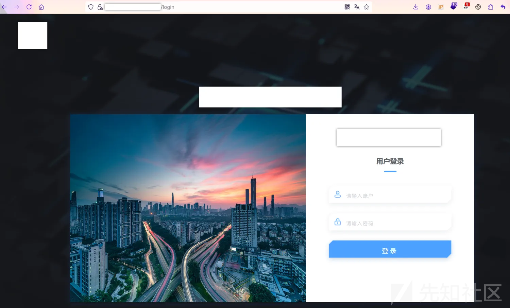  
简单输几个常见的账号密码就出货了  
test/123456

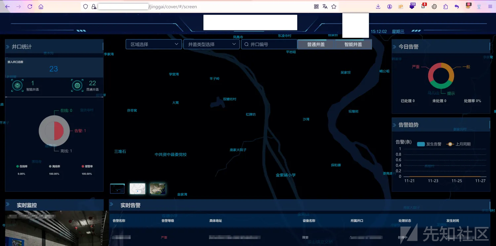

# 地图key泄露

进来发现是一个地图界面，这种大概率是有地图key泄露的，打开网站源码就发现了高德的key

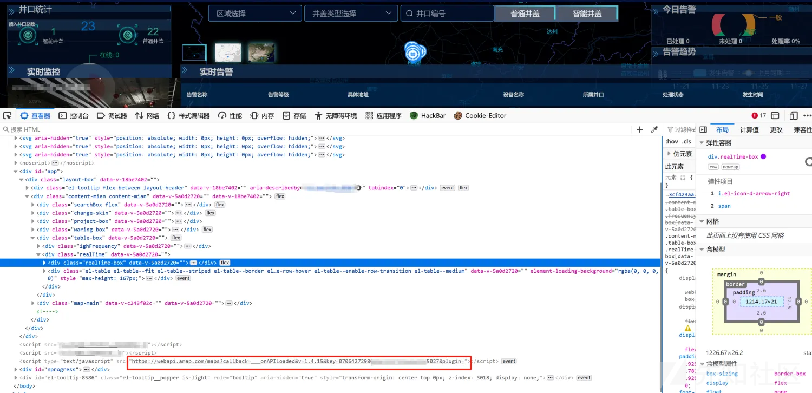

# 目录浏览

打开网站点击屏幕发现可以点开

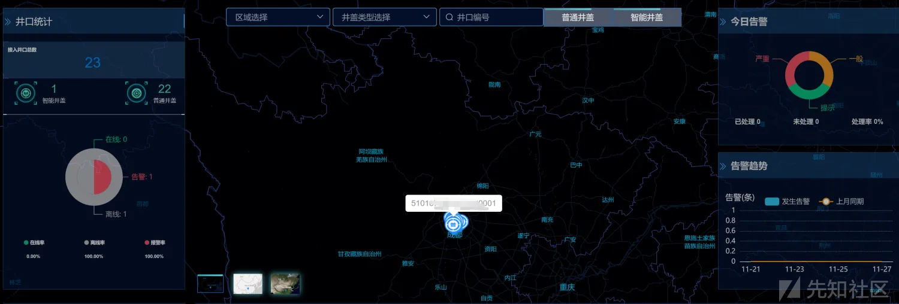

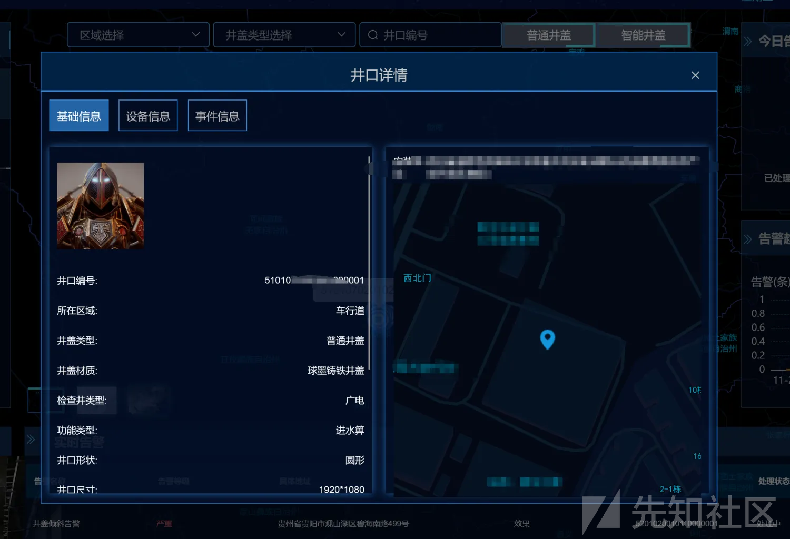  
点击图像右键新建链接发现图片文件名为一串数字

  
去掉图片路径，直接目录浏览

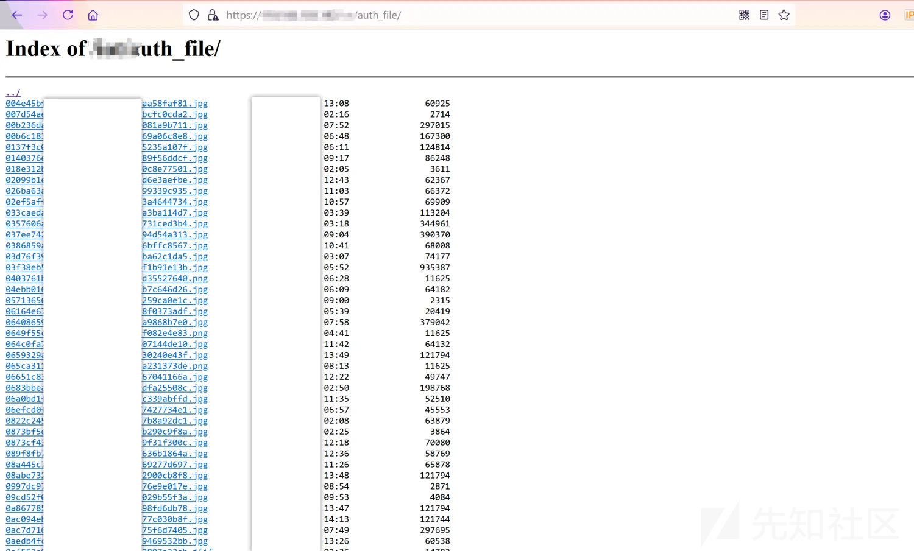

# 敏感信息泄露

这里还没有截图网站就关了，这还是我在burp里面找到的[哭]  
通过一个敏感接口发现大量系统网站用户信息泄露，包括密码和手机号等。

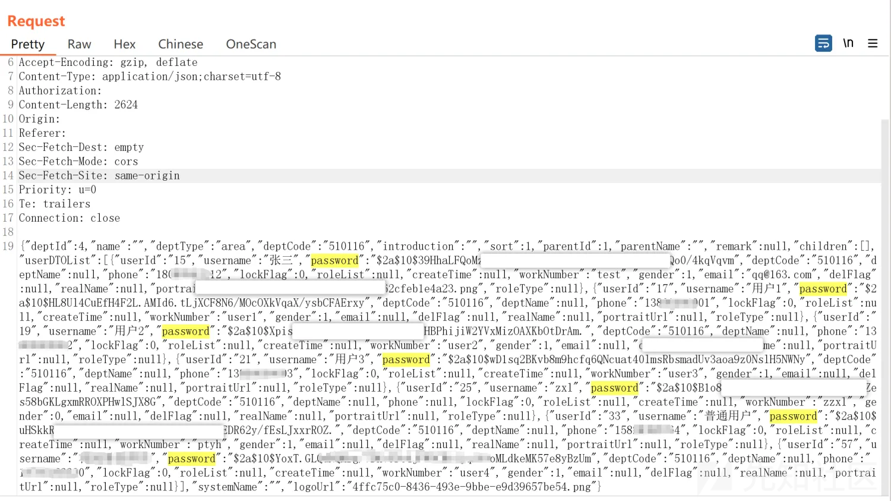

# 文件上传-xss

这里头像处存在任意文件上传，但是因为不解析的缘故所以也没啥用，但是可以上传html文件造成存储型XSS，这个可以水一下hhh

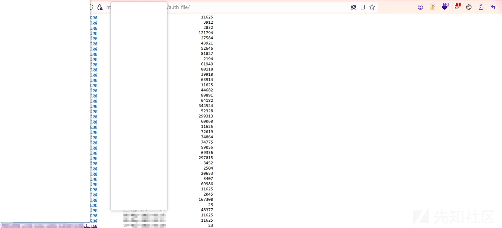  
头像上传处，点击修改

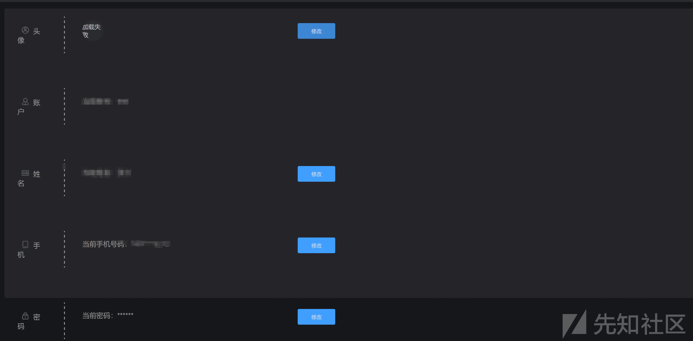  
前端校验，抓包更改后缀为html

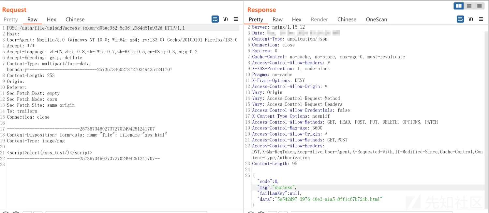  
访问，存储型XSS一枚

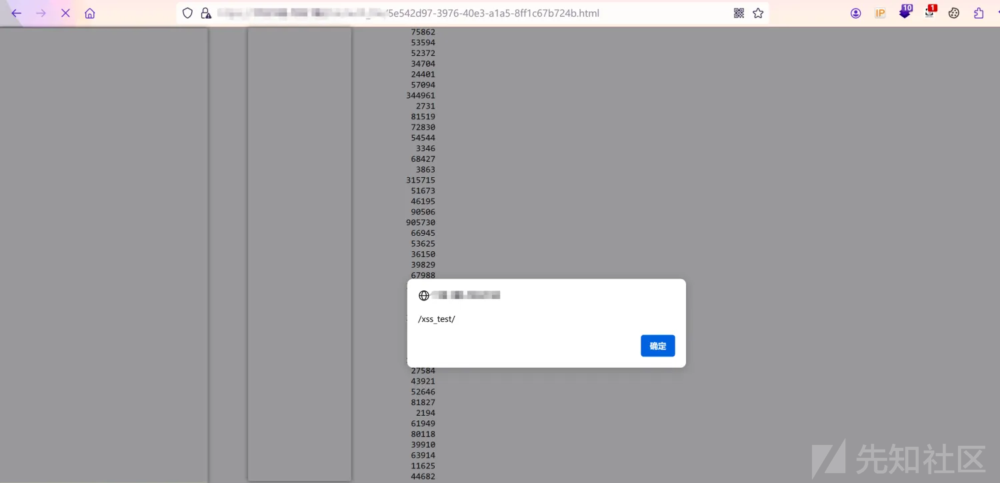

# spring接口泄露

spring信息泄露，这个也可以水一下hhh

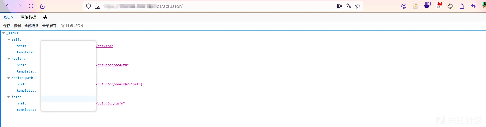

# 接口遍历

这里还有一个接口遍历，通过拼接存在用户可发现用户密码手机号等信息。

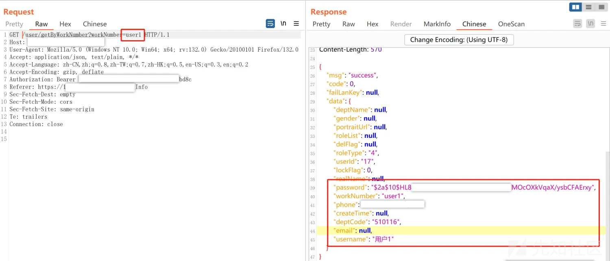
