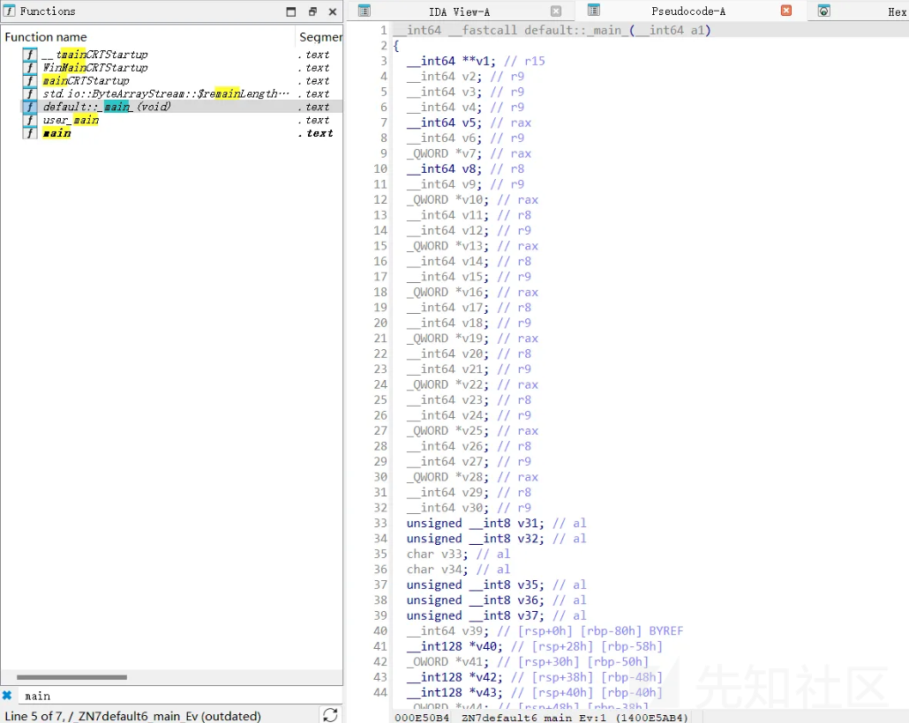
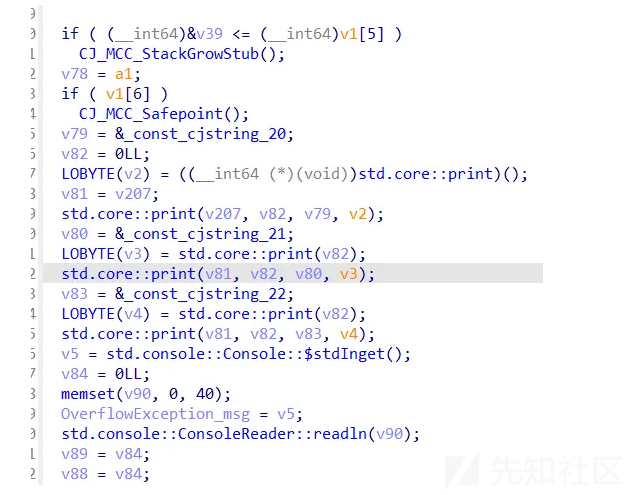
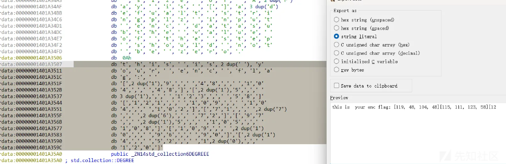
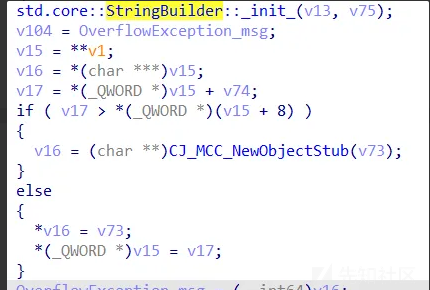
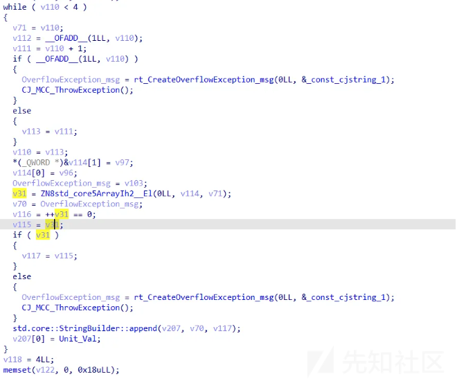
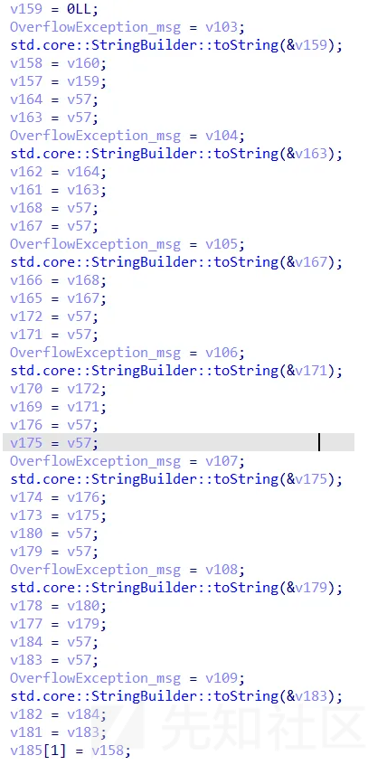
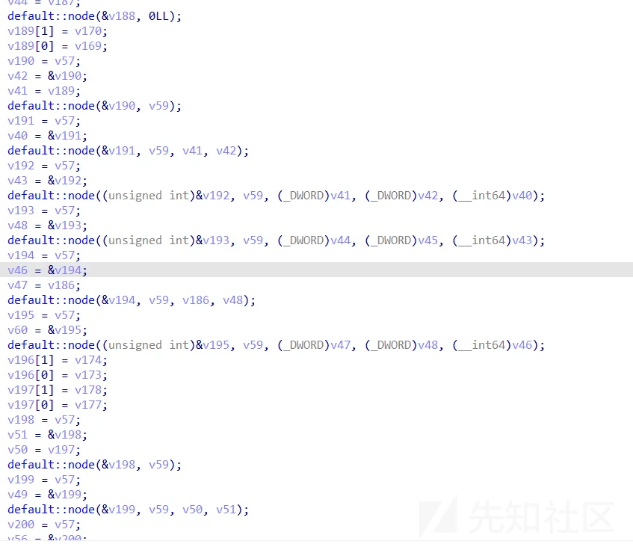
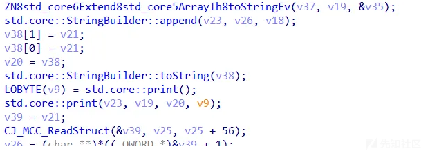
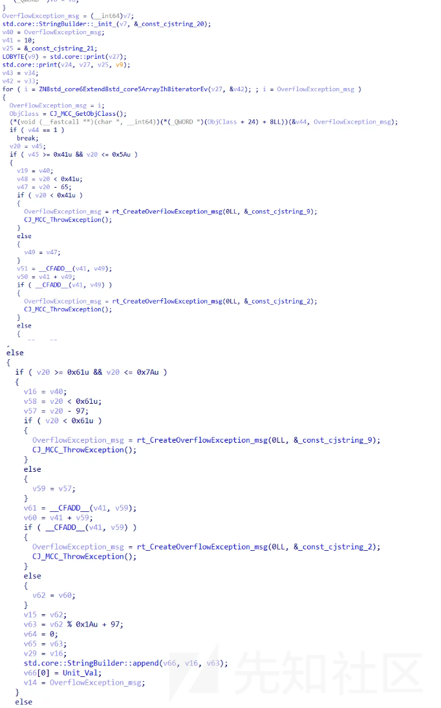

# 华为仓颉语言逆向加密进阶分析-先知社区

> **来源**: https://xz.aliyun.com/news/16140  
> **文章ID**: 16140

---

## 前言

在本文中，我们将深入分析使用仓颉编程语言编写的加密逻辑代码。笔者将分享仓颉语言中二叉树编码、凯撒加密的源码，并对编译后的程序进行逆向分析，同时分享相关思路与流程。

## 基于二叉树的加密逻辑

### 逆向流程

IDA分析

由于题目未经过去符号处理，我们可以直接在IDA中找到主函数的位置。



我们逐个分析



此处是一个明显的print



接着往下看



很明显的创建字符串 这段函数出现多次 说明创建了多次字符串  


看上去这一大段代码非常臃肿 但是抓住几个重点就可以很快地分析。

首先是while 循环四次 然后是 std.core::StringBuilder::append(v207, v70, v117); 说明了主要功能。

所以就是给一次字符串里传四个数，为什么是数，由v31 = ZN8std\_core5ArrayIh2\_\_El(0LL, v114, v71);可知。

再跟着下面的代码分析

```
while ( v118 < 8 )
  {
    v69 = v118;
    v120 = __OFADD__(1LL, v118);
    v119 = v118 + 1;
    if ( __OFADD__(1LL, v118) )
    {
      OverflowException_msg = rt_CreateOverflowException_msg(0LL, &_const_cjstring_1);
      CJ_MCC_ThrowException();
    }
    else
    {
      v121 = v119;
    }
    v118 = v121;
    *(_QWORD *)&v122[1] = v97;
    v122[0] = v96;
    OverflowException_msg = v104;
    v32 = ZN8std_core5ArrayIh2__El(0LL, v122, v69);
    std.core::StringBuilder::append(v207, OverflowException_msg, v32 ^ 2u);
    v207[0] = Unit_Val;
  }
  v123 = 8LL;
  memset(v127, 0, 0x18uLL);
  while ( v123 < 12 )
  {
    v68 = v123;
    v125 = __OFADD__(1LL, v123);
    v124 = v123 + 1;
    if ( __OFADD__(1LL, v123) )
    {
      OverflowException_msg = rt_CreateOverflowException_msg(0LL, &_const_cjstring_1);
      CJ_MCC_ThrowException();
    }
    else
    {
      v126 = v124;
    }
    v123 = v126;
    *(_QWORD *)&v127[1] = v97;
    v127[0] = v96;
    OverflowException_msg = v105;
    v33 = ZN8std_core5ArrayIh2__El(0LL, v127, v68);
    v67 = OverflowException_msg;
    v129 = v33 == 0;
    v128 = v33 - 1;
    if ( v33 )
    {
      v130 = v128;
    }
    else
    {
      OverflowException_msg = rt_CreateOverflowException_msg(0LL, &_const_cjstring_11);
      CJ_MCC_ThrowException();
    }
    std.core::StringBuilder::append(v207, v67, v130);
    v207[0] = Unit_Val;
  }
  v131 = 12LL;
  memset(v135, 0, 0x18uLL);
  while ( v131 < 16 )
  {
    v66 = v131;
    v133 = __OFADD__(1LL, v131);
    v132 = v131 + 1;
    if ( __OFADD__(1LL, v131) )
    {
      OverflowException_msg = rt_CreateOverflowException_msg(0LL, &_const_cjstring_1);
      CJ_MCC_ThrowException();
    }
    else
    {
      v134 = v132;
    }
    v131 = v134;
    *(_QWORD *)&v135[1] = v97;
    v135[0] = v96;
    OverflowException_msg = v106;
    v34 = ZN8std_core5ArrayIh2__El(0LL, v135, v66);
    v65 = OverflowException_msg;
    v137 = __CFADD__(v34, 10);
    v136 = v34 + 10;
    if ( __CFADD__(v34, 10) )
    {
      OverflowException_msg = rt_CreateOverflowException_msg(0LL, &_const_cjstring_1);
      CJ_MCC_ThrowException();
    }
    else
    {
      v138 = v136;
    }
    std.core::StringBuilder::append(v207, v65, v138);
    v207[0] = Unit_Val;
  }
  v139 = 16LL;
  memset(v143, 0, 0x18uLL);
  while ( v139 < 20 )
  {
    v64 = v139;
    v141 = __OFADD__(1LL, v139);
    v140 = v139 + 1;
    if ( __OFADD__(1LL, v139) )
    {
      OverflowException_msg = rt_CreateOverflowException_msg(0LL, &_const_cjstring_1);
      CJ_MCC_ThrowException();
    }
    else
    {
      v142 = v140;
    }
    v139 = v142;
    *(_QWORD *)&v143[1] = v97;
    v143[0] = v96;
    OverflowException_msg = v107;
    v35 = ZN8std_core5ArrayIh2__El(0LL, v143, v64);
    v63 = OverflowException_msg;
    v145 = v35 < 0xAu;
    v144 = v35 - 10;
    if ( v35 < 0xAu )
    {
      OverflowException_msg = rt_CreateOverflowException_msg(0LL, &_const_cjstring_11);
      CJ_MCC_ThrowException();
    }
    else
    {
      v146 = v144;
    }
    std.core::StringBuilder::append(v207, v63, v146);
    v207[0] = Unit_Val;
  }
  v147 = 20LL;
  memset(v151, 0, 0x18uLL);
  while ( v147 < 24 )
  {
    v62 = v147;
    v149 = __OFADD__(1LL, v147);
    v148 = v147 + 1;
    if ( __OFADD__(1LL, v147) )
    {
      OverflowException_msg = rt_CreateOverflowException_msg(0LL, &_const_cjstring_1);
      CJ_MCC_ThrowException();
    }
    else
    {
      v150 = v148;
    }
    v147 = v150;
    *(_QWORD *)&v151[1] = v97;
    v151[0] = v96;
    OverflowException_msg = v108;
    v36 = ZN8std_core5ArrayIh2__El(0LL, v151, v62);
    std.core::StringBuilder::append(v207, OverflowException_msg, v36 ^ 2u);
    v207[0] = Unit_Val;
  }
  v152 = 24LL;
  memset(v156, 0, 0x18uLL);
  while ( v152 < 28 )
  {
    v61 = v152;
    v154 = __OFADD__(1LL, v152);
    v153 = v152 + 1;
    if ( __OFADD__(1LL, v152) )
    {
      OverflowException_msg = rt_CreateOverflowException_msg(0LL, &_const_cjstring_1);
      CJ_MCC_ThrowException();
    }
    else
    {
      v155 = v153;
    }
    v152 = v155;
    *(_QWORD *)&v156[1] = v97;
    v156[0] = v96;
    OverflowException_msg = v109;
    v37 = ZN8std_core5ArrayIh2__El(0LL, v156, v61);
    std.core::StringBuilder::append(v207, OverflowException_msg, v37 ^ 5u);
    v207[0] = Unit_Val;
  }
```

结合密文可以猜到，这很明显就是对原来输入的28个字符 进行了切片 切成7份数字然后分别进行了一些简单运算。

继续往下看



很明显的to string传值转类型

再接着往下看



这段引用了default node 函数 我们需要跟进查看

在这里可以确定就是print我们传进去的字符串，前面也没有任何字符串操作。



难点在于这个树状结构实在是太难识别了，不过根据经验有两种取巧方式，一种是通过动态调试查看值的变化，另外一种是通过打表来确定。

我们这里使用打表的方式来解决这个问题。

输入flag{1234567890123456789012} 然后模拟他的切片加密数组 随后将切片与结果进行比对即可。

发现是一个简单遍历，A B C D E F G→C D B A F E G

ok 这道题到此结束

解密还原  
通过分析加密规则，可以逐步逆推用户输入的原始字符串：

首先手搓将顺序改对。

第一段：每个字符减去 1。  
original\_char = encrypted\_char - 1  
第二段：每个字符与 2 异或。  
original\_char = encrypted\_char ^ 2  
第三段：每个字符加 1。  
original\_char = encrypted\_char + 1  
第四段：每个字符减去 10。  
original\_char = encrypted\_char - 10  
第五段：每个字符加 10。  
original\_char = encrypted\_char + 10  
第六段：每个字符与 2 异或。  
original\_char = encrypted\_char ^ 2  
第七段：每个字符与 5 异或。  
original\_char = encrypted\_char ^ 5

```
# 解密脚本
def decrypt_char(char, operation):
    if operation == 1:
        return char - 1
    elif operation == 2:
        return char ^ 2
    elif operation == 3:
        return char + 1
    elif operation == 4:
        return char - 10
    elif operation == 5:
        return char + 10
    elif operation == 6:
        return char ^ 2
    elif operation == 7:
        return char ^ 5

# 输入数据
data3 = [119, 48, 104, 48]
data4 = [115, 111, 123, 58]
data2 = [121, 109, 104, 102]
data1 = [71, 77, 66, 72]
data6 = [97, 115, 105, 108]
data5 = [109, 110, 96, 90]
data7 = [114, 52, 100, 120]

# 解密每个数组
decrypted_data = []

# 第一个数组
decrypted_line1 = [chr(decrypt_char(char, 1)) for char in data1]
decrypted_data.append(''.join(decrypted_line1))

# 第二个数组
decrypted_line2 = [chr(decrypt_char(char, 2)) for char in data2]
decrypted_data.append(''.join(decrypted_line2))

# 第三个数组
decrypted_line3 = [chr(decrypt_char(char, 3)) for char in data3]
decrypted_data.append(''.join(decrypted_line3))

# 第四个数组
decrypted_line4 = [chr(decrypt_char(char, 4)) for char in data4]
decrypted_data.append(''.join(decrypted_line4))

# 第五个数组
decrypted_line5 = [chr(decrypt_char(char, 5)) for char in data5]
decrypted_data.append(''.join(decrypted_line5))

# 第六个数组
decrypted_line6 = [chr(decrypt_char(char, 6)) for char in data6]
decrypted_data.append(''.join(decrypted_line6))

# 第七个数组
decrypted_line7 = [chr(decrypt_char(char, 7)) for char in data7]
decrypted_data.append(''.join(decrypted_line7))

# 输出结果
for line in decrypted_data:
    print(line)
FLAG
{ojd
x1i1
ieq0
wxjd
cqkn
w1a}
```

### 源码概览

首先，我们对代码做一个整体的功能性拆解：

声明与导入模块：

```
import std.console.*
import std.collection.*
import std.convert.*
import std.random.*
```

这里导入了常用的标准库模块，比如 std.console 用于输入输出，std.collection 用于集合操作，std.convert 和 std.random 则为数据转换和随机数生成提供支持。  
二叉树节点定义：

```
func node(value: String,
    left!: () -> Unit = {=>}, right!: () -> Unit = {=>}){
    return { =>
        left()
        var inputtest = Array(value)
        print ("${inputtest}")
        right()
    }
}
```

node 函数定义了一个二叉树节点，每个节点包含 value 字符串和两个子节点 left 和 right。通过递归调用，可以实现对二叉树的深度优先遍历。

加密逻辑：

核心加密逻辑通过对用户输入的字符串进行分段处理，利用多种不同的规则（如位运算、加减操作）对每段进行逐步编码。  
二叉树遍历与验证：  
最后，程序将加密后的各段字符串构造为二叉树，并通过深度优先遍历将其打印出来供验证。

代码分析：

密文输入  
程序在启动时，首先输出加密目标密文以及要求用户输入的提示：

```
print("this is  your enc flag: [119, 48, 104, 48][115, 111, 123, 58][121, 109, 104, 102][71, 77, 66, 72][97, 115, 105, 108][109, 110, 96, 90][114, 52, 100, 120]")
print("\\n")
print("plz input enc data")
var input = Console.stdIn.readln()
这里的密文由 7 段数组组成，每段包含 4 个整数，分别是加密后的字符串值。用户需要输入flag，并通过加密算法生成相同的密文，才能得到flag。
```

1.加密规则分段  
程序对用户输入的字符串按以下规则进行分段处理，每段处理 4 个字符：

```
var inputchar = Array(input)
var str1 = StringBuilder("")
var str2 = StringBuilder("")
var str3 = StringBuilder("")
var str4 = StringBuilder("")
var str5 = StringBuilder("")
var str6 = StringBuilder("")
var str7 = StringBuilder("")
```

第一段 (str1)：每个字符加 1。  
for (i in 0..4){  
str1.append(Rune(inputchar[i]+1))  
}  
第二段 (str2)：每个字符与 2 异或。  
for (i in 4..8){  
str2.append(Rune(inputchar[i]^2))  
}  
第三段 (str3)：每个字符减 1。  
for (i in 8..12){  
str3.append(Rune(inputchar[i]-1))  
}  
第四段 (str4)：每个字符加 10。  
for (i in 12..16){  
str4.append(Rune(inputchar[i]+10))  
}  
第五段 (str5)：每个字符减 10。  
for (i in 16..20){  
str5.append(Rune(inputchar[i]-10))  
}  
第六段 (str6)：每个字符与 2 异或。  
for (i in 20..24){  
str6.append(Rune(inputchar[i]^2))  
}  
第七段 (str7)：每个字符与 5 异或。  
for (i in 24..28){  
str7.append(Rune(inputchar[i]^5))  
}  
2.二叉树的构造与遍历  
加密后的每段字符串将作为二叉树的节点内容，并通过递归定义的方式构造完整的二叉树：

```
let tree = node(A,
    left: node(B, left: node(C, right: node(D))),
    var inputtest = Array(value)
    print ("${inputtest}")
    right: node(E, left: node(F), right: node(G)))

tree()
```

在上述代码中：  
A 是根节点，表示第一段加密字符串。  
左子树包含 B、C 和 D。  
右子树包含 E、F 和 G。  
遍历时，程序会按照深度优先顺序打印出每个节点的内容。

## 基于凯撒的加密逻辑

### 逆向过程

IDA分析  


有上面btree的分析经验我们可以很快分析出这个kaisa

在IDA中，我们可以看到代码使用了一个固定的偏移量shift=10来进行字符位移。程序会分别处理大写字母（65-90）和小写字母（97-122）的ASCII范围，对于其他字符则保持不变。通过模26运算确保字符循环移位在字母表范围内。

解密过程只需要将偏移量改为负值或者使用26减去原始偏移量即可。比如当shift=10时，解密时使用shift=16（26-10）就能还原原始文本。

### 源码概览

```
import std.console.*
import std.collection.*
import std.convert.*
import std.random.* 

main() {

    print("plz input flag")
    //var input = Console.stdIn.readln() 此处输入flag
    var input = "flag{kaisa}"

    var inputchar = Array(input)
    var plaintext = StringBuilder("")
    var shift = 10u8

    print("\n")
    for (char in inputchar){
    if (char >= 65 && char <= 90) { // Uppercase letters
            plaintext.append(Rune(((char - 65 + shift) % 26) + 65))
            } else if (char >= 97 && char <= 122) { // Lowercase letters
            plaintext.append(Rune(((char - 97 + shift) % 26) + 97))
            } else {
            plaintext.append(Rune(char))
            }
        }
    print(plaintext)//此处换成对比即可

}
```

## 总结

仓颉的一些保护措施和一些类似于python的高结合度的代码是代码有股pyc的繁杂味道。不过多结合动调并查看其关键函数名可以使得逆向事半功倍，不过如果是去符号的话，还是建议将符号恢复后在做题，不然有些太过于折磨自己了。
