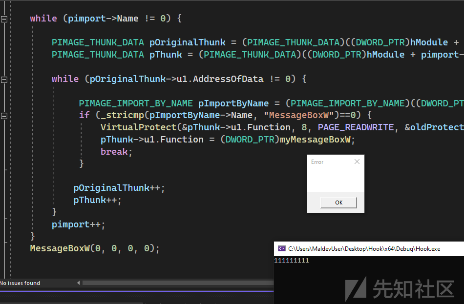
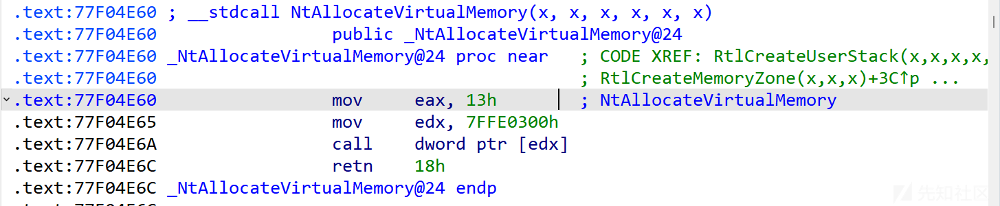
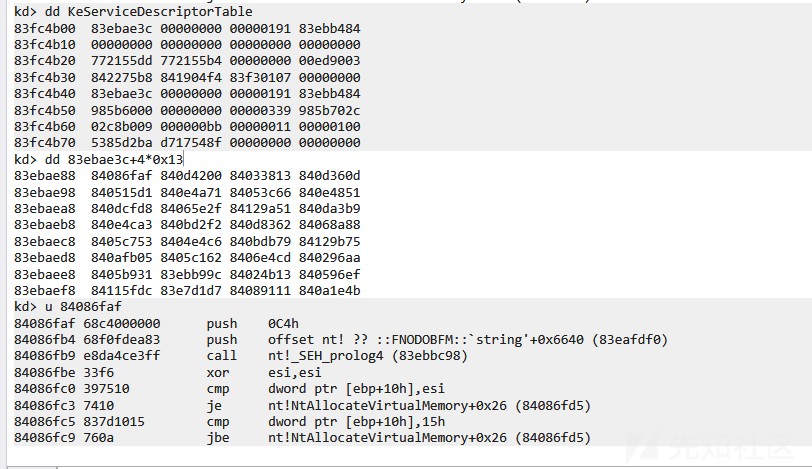
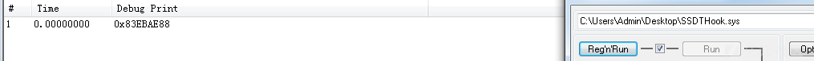
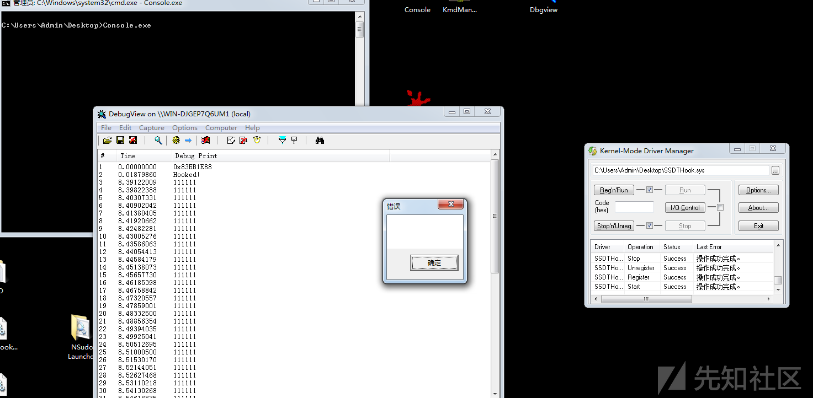
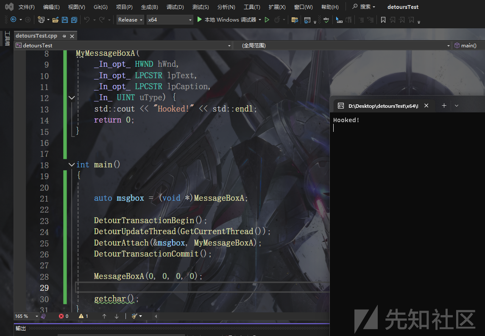
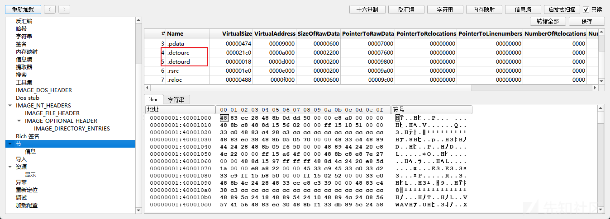
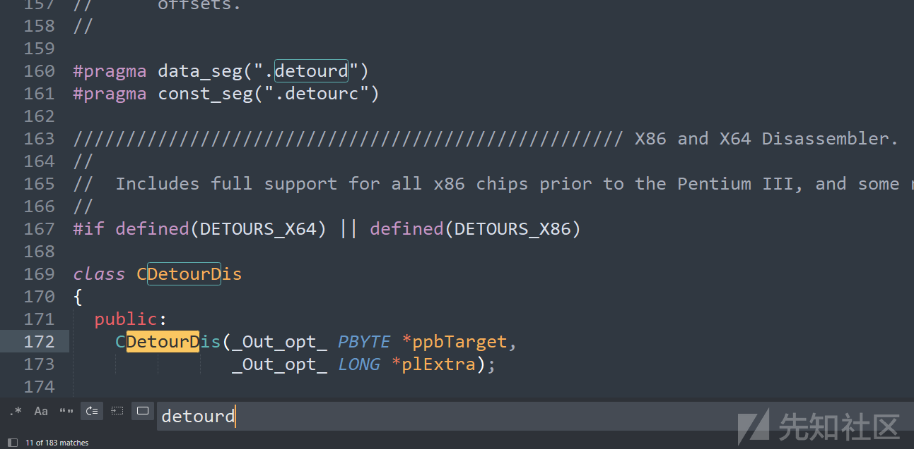

# 免杀基础-hook-先知社区

> **来源**: https://xz.aliyun.com/news/16141  
> **文章ID**: 16141

---

# hook

什么是hook 用于拦截函数的执行过程，以获取或修改其执行时的数据 更改执行流程的一种技术

大体分两种

修改函数代码和修改函数地址

## InlineHook

第一种我们称之为`INLINE HOOK`(内联hook) 它的特点是直接修改目标函数的代码，例如在函数入口处插入跳转指令，将控制流引导至自定义的处理逻辑，从而实现对函数行为的拦截和修改

32位下patch 目标函数前7个字节 目的是替换成自己的汇编 跳转到指定地址 这里用0x00占位

```
0xB8, 0x00, 0x00, 0x00, 0x00,     // mov eax, lpMem
0xFF, 0xE0                        // jmp eax
```

编写代替函数 在函数内解除hook防止无限循环 再重新挂钩

```
int myMessageBoxW(
    _In_opt_ HWND hWnd,
    _In_opt_ LPCWSTR lpText,
    _In_opt_ LPCWSTR lpCaption,
    _In_ UINT uType) {
    printf("111111111\n");

    memcpy(Hookedfunc, originalBytes, 7);
    int res = MessageBoxW(hWnd, lpText, lpCaption, uType);
    installHook(Hookedfunc, myMessageBoxW);
    return res;
};

```

hook 直接将函数开始的地方改为我们需要的硬编码 jmp到指定函数

```
void installHook(LPVOID Hookedfunc,LPVOID targetFunc) {

    DWORD oldProtection;

    char code[] = { 0xB8, 0x00, 0x00, 0x00, 0x00,     // mov eax, lpMem
                    0xFF, 0xE0                        // jmp eax
    };
    memcpy(originalBytes, Hookedfunc, 7); 

    DWORD_PTR lpMem = (DWORD_PTR)targetFunc;
    memcpy(&code[1], &lpMem, sizeof(lpMem));

    VirtualProtect(Hookedfunc, sizeof(code), PAGE_EXECUTE_READWRITE, &oldProtection);
    memcpy(Hookedfunc, code, sizeof(code));

}

```


64位的也差不多

```
int myMessageBoxW(
    _In_opt_ HWND hWnd,
    _In_opt_ LPCWSTR lpText,
    _In_opt_ LPCWSTR lpCaption,
    _In_ UINT uType) {
    printf("111111111\n");

    memcpy(Hookedfunc, originalBytes, 13);
    int res = MessageBoxW(hWnd, lpText, lpCaption, uType);
    installHook(Hookedfunc, myMessageBoxW);
    return res;
};

void installHook(LPVOID Hookedfunc,LPVOID targetFunc) {

    DWORD oldProtection;
    char code[] = { 0x49, 0xBA, 0x00, 0x00, 0x00, 0x00, 0x00, 0x00, 0x00, 0x00, // mov r10, lpMem
                    0x41, 0xFF, 0xE2                                            // jmp r10
    };

    memcpy(originalBytes, Hookedfunc, 13);
    DWORD_PTR lpMem = (DWORD_PTR)targetFunc;
    memcpy(&code[2], &lpMem, sizeof(lpMem));

    VirtualProtect(Hookedfunc, sizeof(code), PAGE_EXECUTE_READWRITE, &oldProtection);
    memcpy(Hookedfunc, code, sizeof(code));

}

```

这里还有很多优化的空间 但是对免杀来说已经够用了

## IAT HOOK

第二种是修改函数的地址 比如常说的`IAT hook` `SSDT hook`

这类的特点是函数地址需要查表得到 那么我们可以篡改这个表来达到修改执行函数的目的

这里以IAT HOOK举例 通常是往目标进程注入dll 这里为了方便直接在当前进程搞了

首先获取到`IAT` 获取要hook的函数的地址

```
HMODULE hModule = GetModuleHandle(NULL);
    PIMAGE_DOS_HEADER pDosHeader = (PIMAGE_DOS_HEADER)hModule;
    PIMAGE_NT_HEADERS pNtHeader = (PIMAGE_NT_HEADERS)((DWORD_PTR)hModule + pDosHeader->e_lfanew);
    PIMAGE_DATA_DIRECTORY pDataDir = (PIMAGE_DATA_DIRECTORY)&pNtHeader->OptionalHeader.DataDirectory[IMAGE_DIRECTORY_ENTRY_IMPORT];
    PIMAGE_IMPORT_DESCRIPTOR pimport = (PIMAGE_IMPORT_DESCRIPTOR)(pDataDir->VirtualAddress + (DWORD_PTR)hModule);


    FARPROC funcAddr = NULL;

    while (pimport->Name != 0) {

        PIMAGE_THUNK_DATA pOriginalThunk = (PIMAGE_THUNK_DATA)((DWORD_PTR)hModule + pimport->OriginalFirstThunk);
        PIMAGE_THUNK_DATA pThunk = (PIMAGE_THUNK_DATA)((DWORD_PTR)hModule + pimport->FirstThunk);

        while (pOriginalThunk->u1.AddressOfData != 0) {

             PIMAGE_IMPORT_BY_NAME pImportByName = (PIMAGE_IMPORT_BY_NAME)((DWORD_PTR)hModule + pOriginalThunk->u1.AddressOfData);
             if (_stricmp(pImportByName->Name, "MessageBoxW")==0) {
                 funcAddr = (FARPROC)pThunk->u1.Function;
                 break;
             }

            pOriginalThunk++;
            pThunk++;
        }
        pimport++;
    }

    MessageBoxW(0, 0, 0, 0);

```

定义恶意函数 替换掉IAT中的目标函数为恶意函数

```
PVOID oldMessageBox = MessageBoxW;

typedef int (WINAPI* pMessageBoxW)(
    _In_opt_ HWND hWnd,
    _In_opt_ LPCWSTR lpText,
    _In_opt_ LPCWSTR lpCaption,
    _In_ UINT uType);


int myMessageBoxW(
    _In_opt_ HWND hWnd,
    _In_opt_ LPCWSTR lpText,
    _In_opt_ LPCWSTR lpCaption,
    _In_ UINT uType) {
    printf("111111111\n");
    pMessageBoxW MsgBox = (pMessageBoxW)oldMessageBox;
    return MsgBox(hWnd, lpText, lpCaption, uType);
};
....

PIMAGE_IMPORT_BY_NAME pImportByName = (PIMAGE_IMPORT_BY_NAME)((DWORD_PTR)hModule + pOriginalThunk->u1.AddressOfData);
             if (_stricmp(pImportByName->Name, "MessageBoxW")==0) {
                 VirtualProtect(&pThunk->u1.Function, 8, PAGE_READWRITE, &oldProtect);
                 pThunk->u1.Function = (DWORD_PTR)myMessageBoxW;
                 VirtualProtect(&pThunk->u1.Function, 8, oldProtect, &oldProtect);
                 break;
             }

```



## SSDT Hook

首先是获取SSDT

直接使用导出的全局变量`KeServiceDescriptorTable`即可

```
typedef struct _ServiceDescriptorTable{
    PVOID pSSDTBase;
    PVOID pServiceCounterTable;
    ULONG ulNumberOfServices;
    PVOID pParamTableBase;
} ServiceDescriptorTable, * PServiceDescriptorTable;

extern PServiceDescriptorTable KeServiceDescriptorTable;

```

这里我们选择hook `NtAllocateVirtualMemory`



调用号13

获取`NtAllocateVirtualMemory`的地址



```
__try {
        PVOID serviceTableBase = KeServiceDescriptorTable->pSSDTBase;
        PVOID NtAllocateVirtualMemoryBase = (DWORD_PTR)serviceTableBase + (0x13 * sizeof(void*));
        DbgPrint("0x%p\n", NtAllocateVirtualMemoryBase);
    }
    __except (EXCEPTION_EXECUTE_HANDLER) {
        return GetExceptionCode();
    }

```



修改表中函数

```
__try {
        PVOID serviceTableBase = KeServiceDescriptorTable->pSSDTBase;
        NtAllocateVirtualMemoryBase = (DWORD_PTR)serviceTableBase + (0x13 * sizeof(PVOID));
        DbgPrint("0x%p\n", NtAllocateVirtualMemoryBase);
        oriNtAllocateVirtualMemoryProc = *(PVOID*)NtAllocateVirtualMemoryBase;
        *(PVOID*)NtAllocateVirtualMemoryBase = myNtAllocateVirtualMemory;

        DbgPrint("Hooked!\n");

    }
    __except (EXCEPTION_EXECUTE_HANDLER) {
        return GetExceptionCode();
    }

```

定义替换的函数

```
PVOID NtAllocateVirtualMemoryBase = NULL;
PVOID oriNtAllocateVirtualMemoryProc = NULL;
NTKERNELAPI PCHAR PsGetProcessImageFileName(PEPROCESS Process);


typedef NTSTATUS (NTAPI* pNtAllocateVirtualMemory)(
    _In_ HANDLE ProcessHandle,
    _Inout_ _At_(*BaseAddress, _Readable_bytes_(*RegionSize) _Writable_bytes_(*RegionSize) _Post_readable_byte_size_(*RegionSize)) PVOID* BaseAddress,
    _In_ ULONG_PTR ZeroBits,
    _Inout_ PSIZE_T RegionSize,
    _In_ ULONG AllocationType,
    _In_ ULONG Protect
);

NTSTATUS NTAPI myNtAllocateVirtualMemory(
    _In_ HANDLE ProcessHandle,
    _Inout_ _At_(*BaseAddress, _Readable_bytes_(*RegionSize) _Writable_bytes_(*RegionSize) _Post_readable_byte_size_(*RegionSize)) PVOID* BaseAddress,
    _In_ ULONG_PTR ZeroBits,
    _Inout_ PSIZE_T RegionSize,
    _In_ ULONG AllocationType,
    _In_ ULONG Protect
) {
    HANDLE currentProcess = PsGetCurrentProcess();
    PCHAR currentProcessName = PsGetProcessImageFileName(currentProcess);
    DbgPrint("%s\n", currentProcessName);
    if (_stricmp(currentProcessName, "Console.") == 0) {
        DbgPrint("111111\n");
    } 
    pNtAllocateVirtualMemory oriNtAllocateVirtualMemory = (pNtAllocateVirtualMemory)oriNtAllocateVirtualMemoryProc;
    return oriNtAllocateVirtualMemory(ProcessHandle, BaseAddress, ZeroBits, RegionSize, AllocationType, Protect);
}

```

因为这里分配内存是一个很常用的功能 我们指定只有当进程名为`Console.exe` 调用`NtAllocateVirtualMemory`时才进行相关输出



卸载时unhook

```
NTSTATUS UnloadDriver(PDRIVER_OBJECT DriverObject){
    *(PVOID*)NtAllocateVirtualMemoryBase = oriNtAllocateVirtualMemoryProc;
    DbgPrint("Unload!");
}

```

## 基于Detours

Detours是微软开源的hook库 使用起来也非常简单

```
#include <Windows.h>
#include <iostream>
#include <detours.h>


int
WINAPI
MyMessageBoxA(
    _In_opt_ HWND hWnd,
    _In_opt_ LPCSTR lpText,
    _In_opt_ LPCSTR lpCaption,
    _In_ UINT uType) {
    std::cout << "Hooked!" << std::endl;
    return 0;
}


int main()
{

    auto msgbox = (void *)MessageBoxA;

    DetourTransactionBegin();
    DetourUpdateThread(GetCurrentThread());
    DetourAttach(&msgbox, MyMessageBoxA);
    DetourTransactionCommit();

    MessageBoxA(0, 0, 0, 0);

    getchar();
}

```



pe文件中存在明显特征 可以通过修改disasm.cpp来修改




