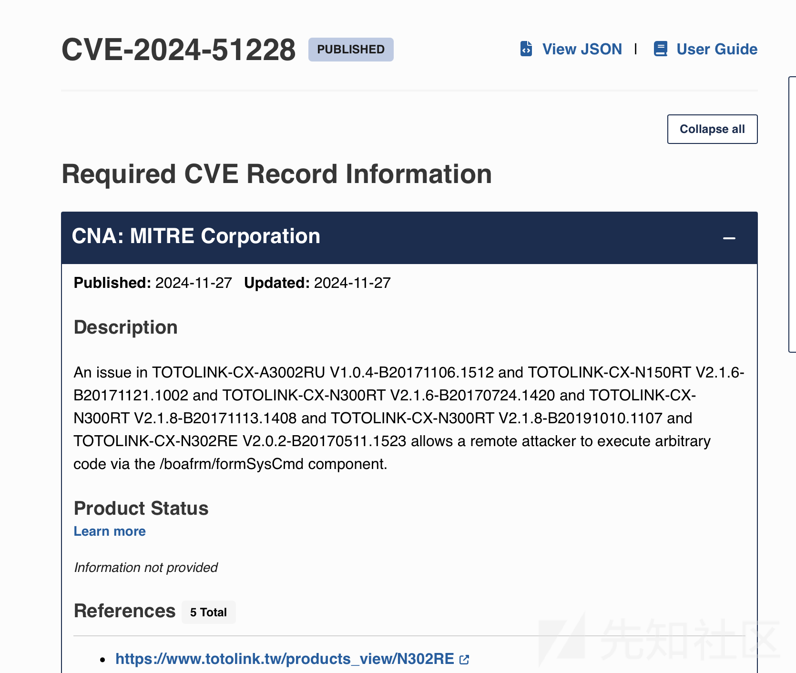
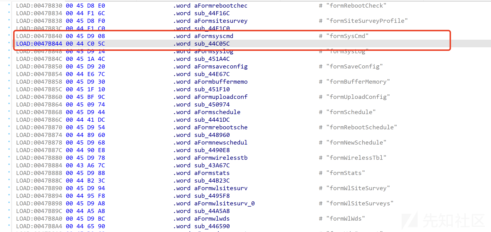
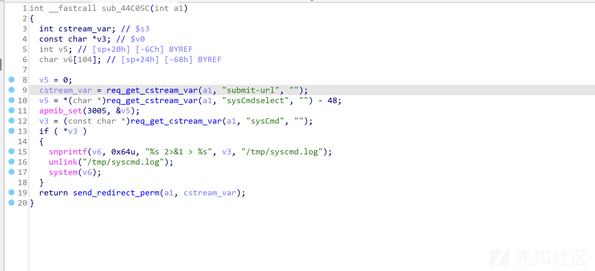
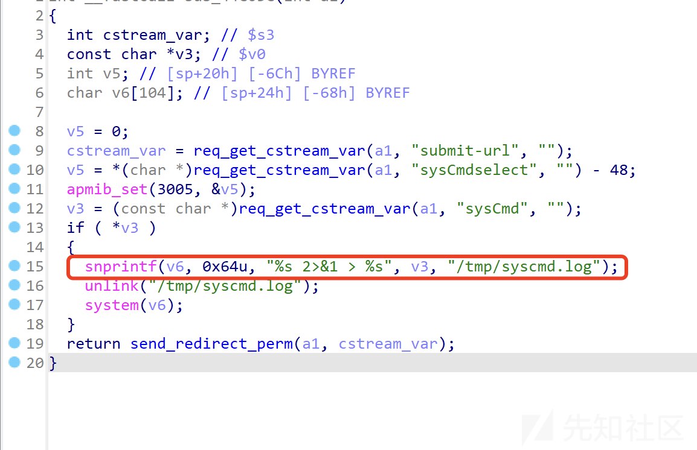
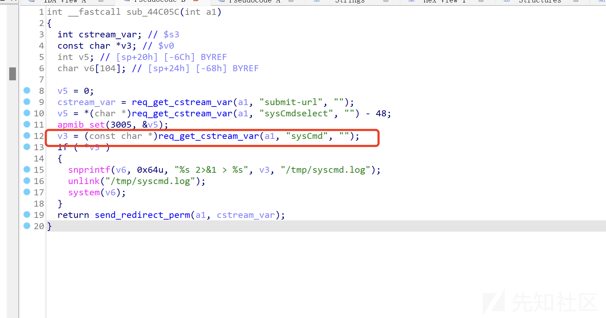

# TOTOLINK远程代码执行漏洞分析(CVE-2024-51228)-先知社区

> **来源**: https://xz.aliyun.com/news/16144  
> **文章ID**: 16144

---

# 漏洞通告：

# 漏洞分析

通告附件提供了payload，不过漏洞通告已经将关键信息告诉了我们。

**/boafrm/formSysCmd**组件存在漏洞

定位到`formSysCmd`函数

查看伪代码

查看函数内部发行`system`函数，参数`v6`

`v6`是15行构造的命令，占位符`v3`，`v3`是12行通过get请求sysCmd参数获取的。

