# 工控比赛中的一些iot固件分析-先知社区

> **来源**: https://xz.aliyun.com/news/16146  
> **文章ID**: 16146

---

# 基础知识

## 查壳检测

一般可执行文件可以通过套壳来防止源码泄露等  
常见的壳包括：

1. 压缩壳  
   定义：压缩壳主要通过压缩技术减少可执行文件的大小，同时在运行时动态解压缩代码。  
   优点：提高下载速度，减少存储空间。  
   示例：UPX（极限压缩），FUPX等。
2. 加密壳  
   定义：加密壳通过加密程序代码，防止代码被逆向工程和分析。  
   优点：保护软件版权，提高安全性。  
   示例：VMProtect，Themida等。
3. 混淆壳  
   定义：混淆壳通过改变代码结构和控制流，增加逆向工程的难度。  
   优点：使代码难以理解，增加破解难度。  
   示例：ProGuard（用于Java），ConfuserEx（用于.NET）  
   而检测壳的工具下载：  
   <http://www.52bug.cn/nxtool/3191.html>  
   使用方式  
   参考这个师傅的文章就好 我就不重复造轮子了  
   <https://blog.csdn.net/ftxyz23/article/details/133100418>

# 2020-工业信息安全技能大赛巡回赛

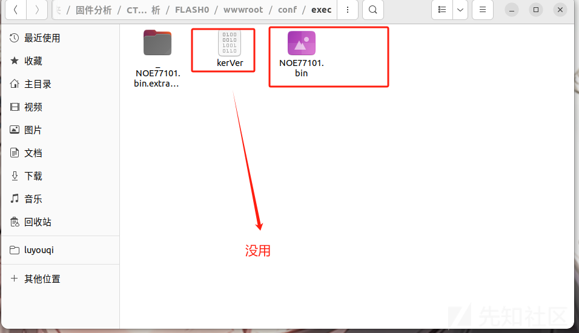

找了整个文件 就只有里有个bin文件 解压之后发现

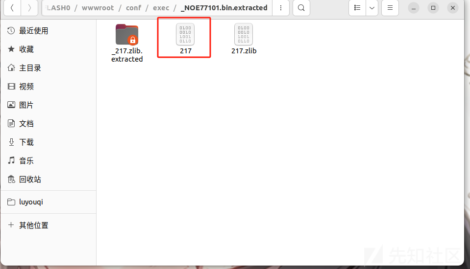

解压不出文件系统 而是解压了个217 查看一下发现是PowerPC big endian架构

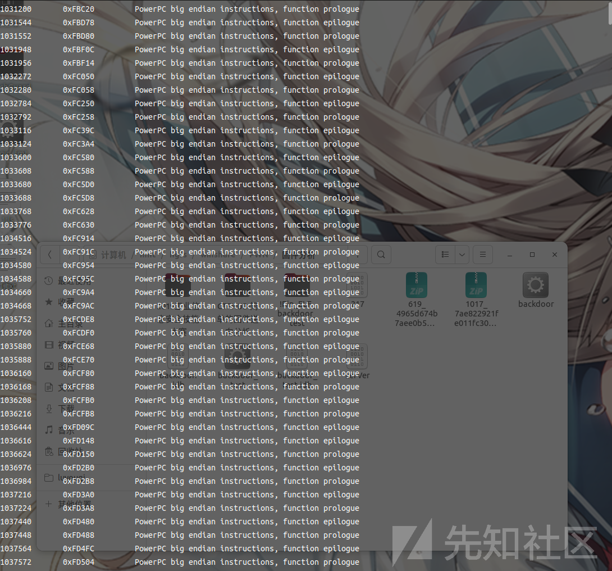

ida打开之后是解析不出函数的 需要载入idc脚本 来恢复 函数 这里参考一下hahali师傅的脚本

```
from idaapi import *

from idc import *


loadaddress = 0x10000

eaStart = 0x31eec4 + loadaddress

eaEnd = 0x348114 + loadaddress


ea = eaStart

eaEnd = eaEnd

while ea < eaEnd:

create_strlit(Dword(ea), BADADDR)

sName = get_strlit_contents(Dword(ea))

print sName

if sName:

eaFunc = Dword(ea + 4)

MakeName(eaFunc, sName)

MakeCode(eaFunc)

MakeFunction(eaFunc, BADADDR)

ea = ea + 16
```

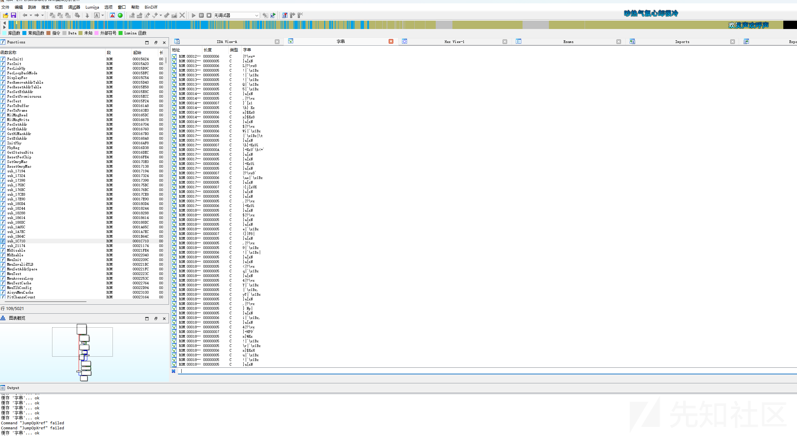

然后直接搜索 ftpuser发现

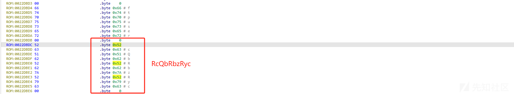

因此flag就是flag{RcQbRbzRyc}

# 2019-工业信息安全技能大赛-深圳站-二次设备固件逆向

直接打开提供的压缩包，只有一个home文件夹，由于题目中说要找硬编码字符串，直接在文件夹里搜索password之类的字符串

find . | xargs grep -ri password

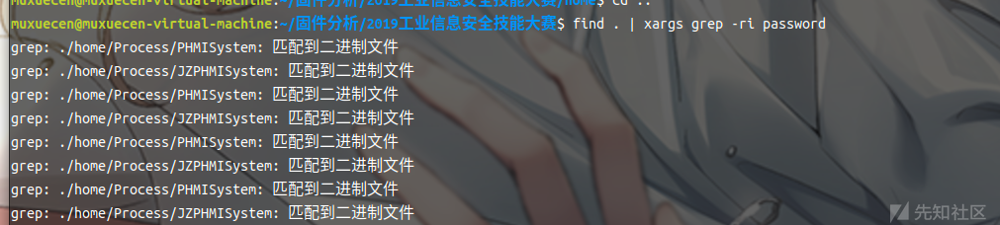

有两个文件都匹配到了 一个PHMISystem 一个JZPHMISystem 分别进行分析发现

## JZPHMISystem

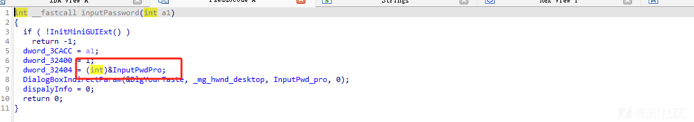

根据这个值发现

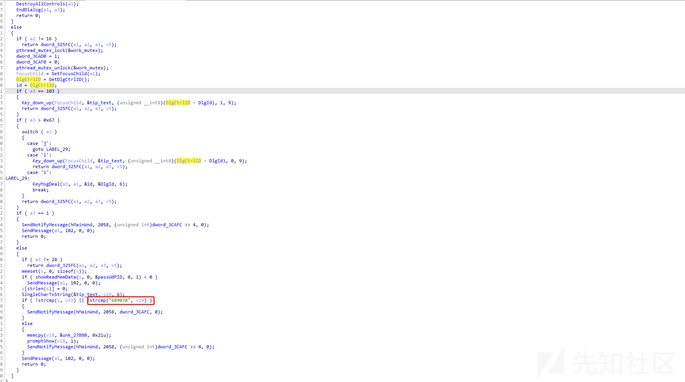

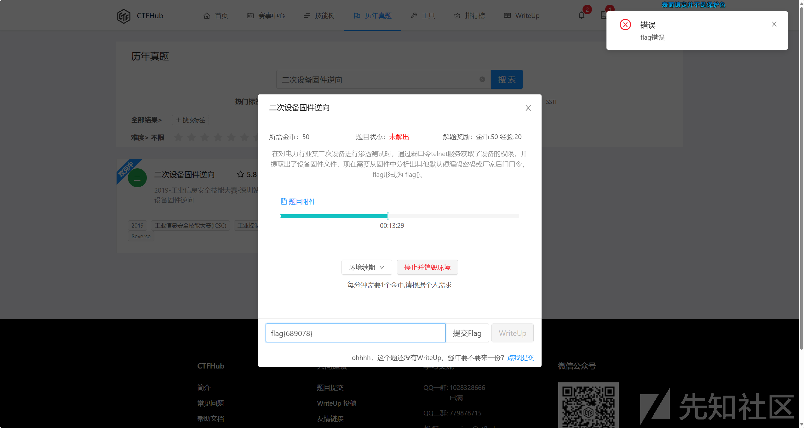

此时flag是错误的 我们继续跟踪另一个程序

## PHMISystem

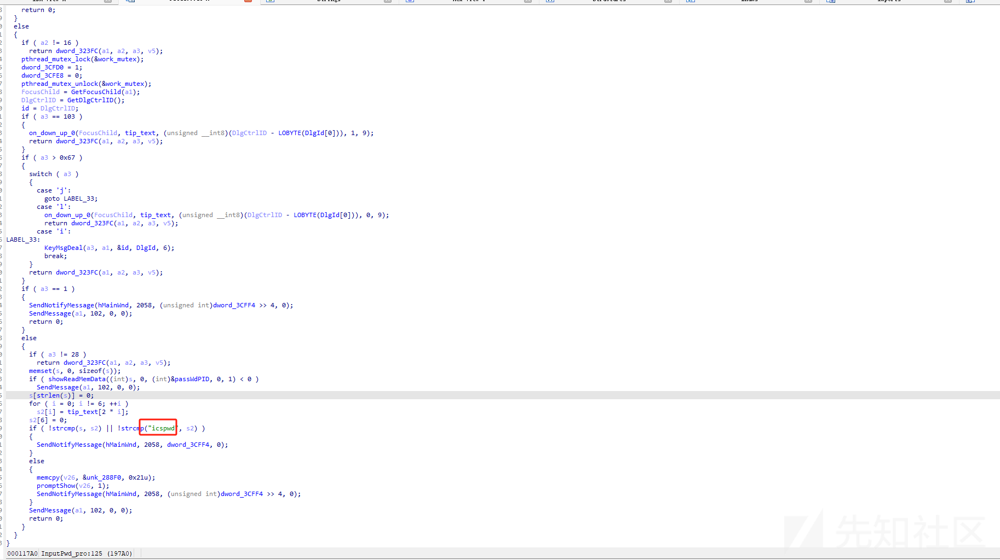

flag{icspwd}这个就是正确的

# firmware

## 题目详情：

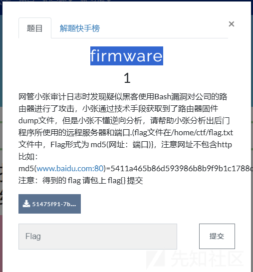

下载解压后 是个bin文件 经过多次提取找到文件系统 根据提示有后门程序 因此我们搜索backdoor发现在tmp下有一个文件但是直接用ida打开是分析不了的，猜测程序有加壳，测试一下发现

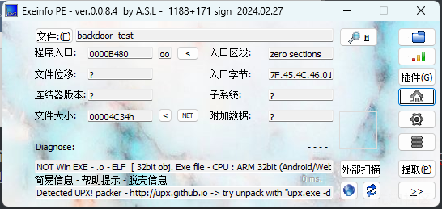

可以看到有一个Detected UPX！ 发现UPX压缩壳，所以我们解压一下就行

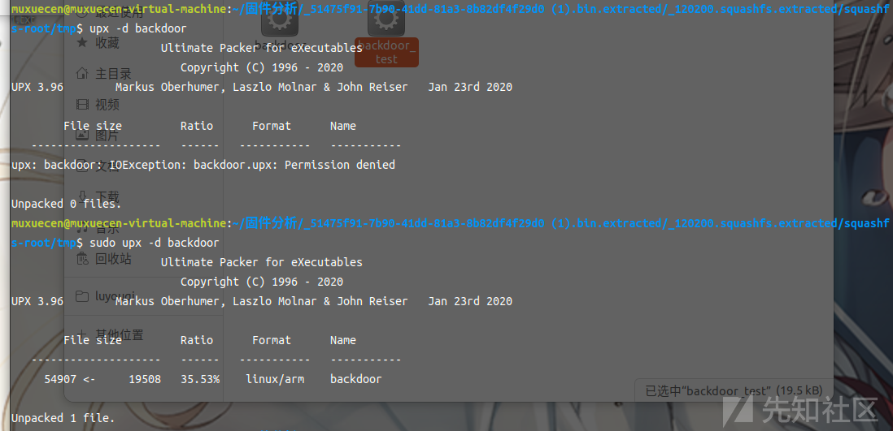

然后就可以去分析backdoor了

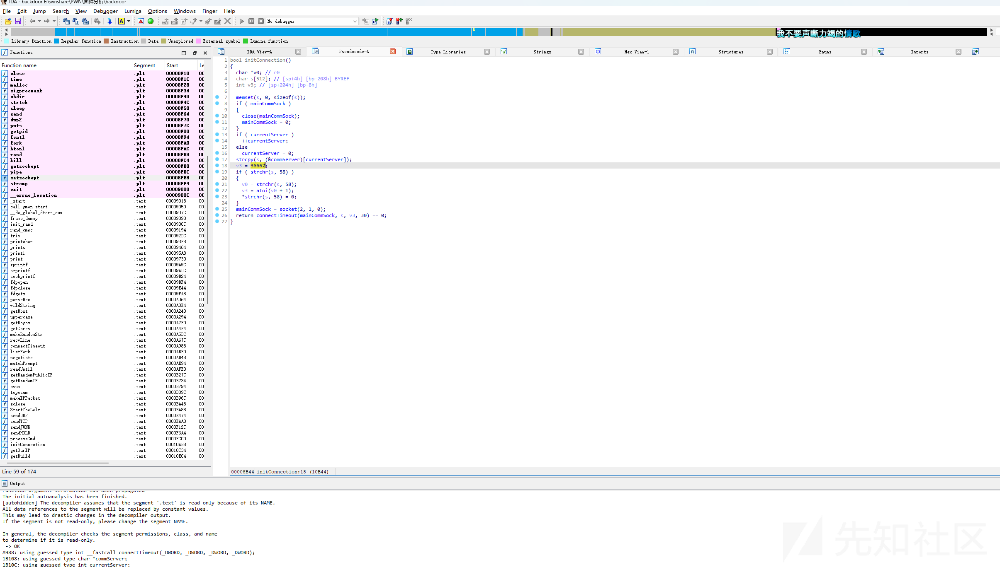

请帮助小张分析出后门程序所使用的远程服务器和端口. 我们通过查询字符串可以看到

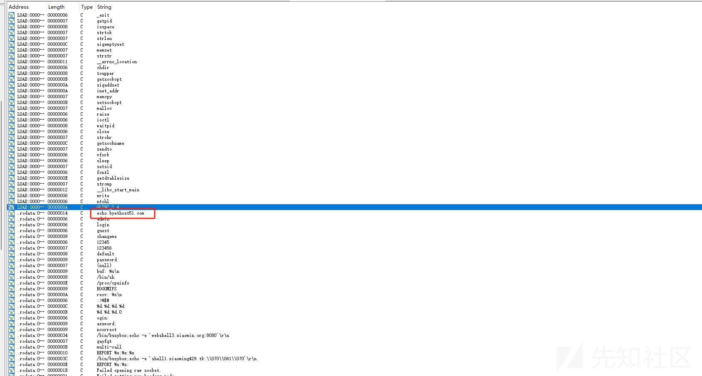

然后跟踪这个找到函数

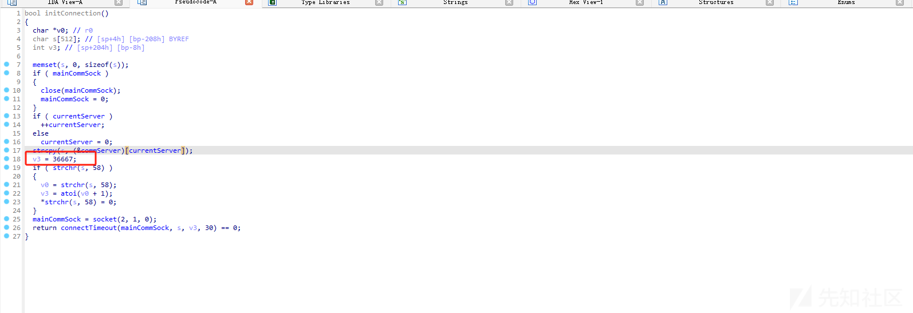

因此 就是echo.byethost51.com:36667


因此flag{33a422c45d551ac6e4756f59812a954b}
