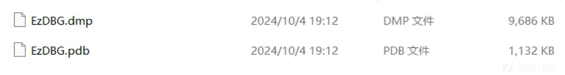
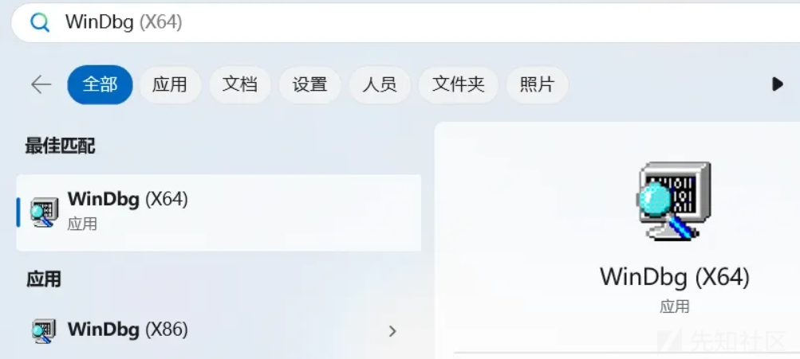
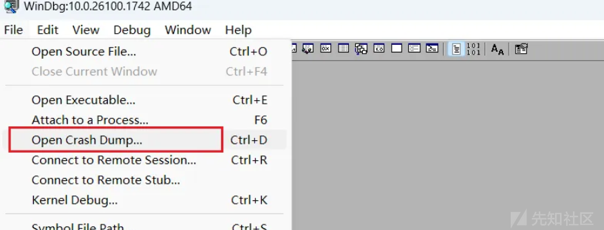
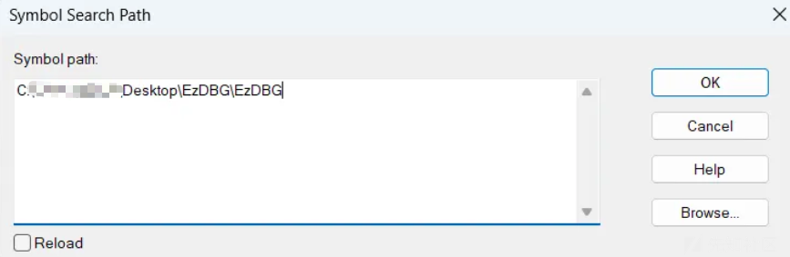
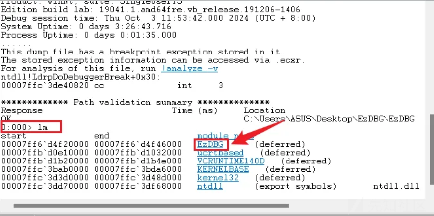
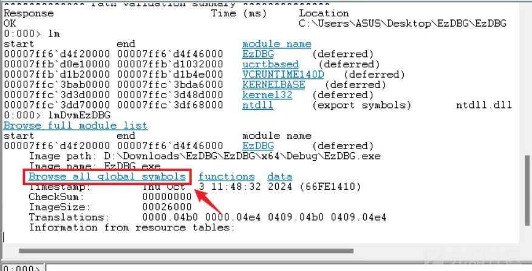
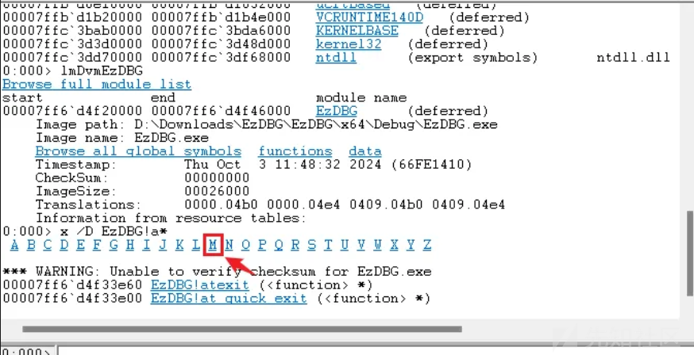
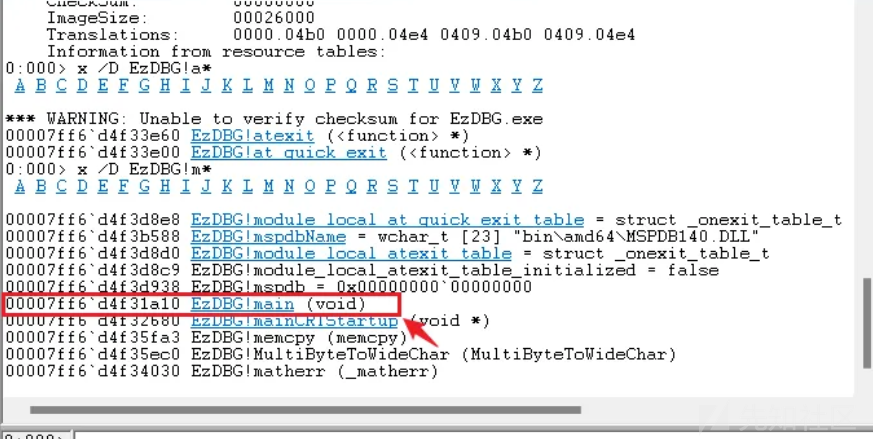
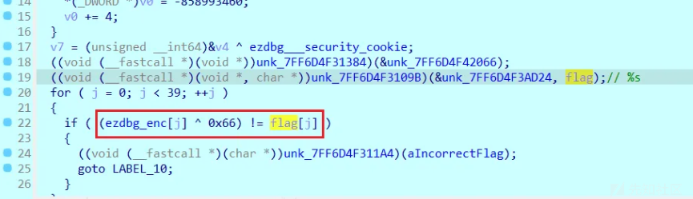

# 【SHCTF2024 EzDBG】使用Windbg静态分析dump文件-先知社区

> **来源**: https://xz.aliyun.com/news/16150  
> **文章ID**: 16150

---

**题目描述:** 一句话的意义在听者的心里，常像一只陌生的猫到屋里来，声息全无，直到“喵~”的一叫，你才发觉它的存在。



## 一、什么是DMP文件？

DMP文件是Dump（转储）的缩写，它是由Windows操作系统生成的一种文件。

其主要作用是在系统发生崩溃或蓝屏时，保存系统的内存镜像和其他相关信息，以便开发者能够通过分析这些信息来定位问题。DMP文件通常包含了大量的二进制数据，因此无法直接用常见的文本编辑器打开。

## 二、什么是PDB文件？

PDB文件是一个包含调试和程序符号信息的文件，用于在程序崩溃或调试时提供有关代码的详细信息。

**pdb符号文件是连接二进制指令和源代码之间的纽带，没有符号你所面对只有地址，由链接器自动生成。**

PDB文件包含了编译后的二进制可执行文件（如游戏客户端或服务器）的调试信息，包括函数、变量、类型信息以及源代码的映射关系。它与编译器生成的可执行文件相对应，可以帮助调试器在崩溃或调试时将二进制代码映射回源代码。使用PDB无需代码也可以掌握程序的堆栈运行状态

**主要内容：**

* **符号信息**：包括函数名、变量名、类名、源代码行号等信息，帮助调试器在崩溃或调试时关联到实际的源代码。
* **调试信息**：保存了有关程序结构、优化信息、以及调试时用到的函数调用堆栈等内容。

## 三、如何打开？

* **使用WinDbg工具**
* **用Visual Studio**

---

## 四、解题

WinDbg 提供了一组命令行和图形界面工具，用于分析内存转储文件（通常是由操作系统或应用程序崩溃时生成的 .DMP文件），跟踪程序执行、检查变量和数据结构、分析堆栈跟踪、监视系统性能等。

Windows系统一般自带有windbg工具，



**加载dmp文件**



**加载符号文件(pdb文件)**




用lm命令列出已有模块：



点击蓝色的EzDBG查看EzDBG的详细信息：



继续点击Broese all qlobal symbols找一下EzDBG的符号都有哪些，



点击M，显示EzDBG模块下的M开头的函数，其中就包括了main函数，找到了main函数的地址是 00007ff6d4f31a10



WinDbg不便分析函数，使用 IDA64 打开.dmp文件进一步分析

直接根据地址找到main函数位置


F5反编译即可查看函数



exp

```
enc=[0x35, 0x2E, 0x25, 0x32, 0x20, 0x1D, 0x03, 0x5E, 0x07, 0x56, 
  0x00, 0x03, 0x57, 0x57, 0x53, 0x50, 0x00, 0x54, 0x07, 0x00, 
  0x07, 0x07, 0x00, 0x03, 0x50, 0x02, 0x51, 0x5E, 0x5E, 0x03, 
  0x5F, 0x02, 0x56, 0x03, 0x57, 0x00, 0x50, 0x50, 0x1B]

flag=""

for i in range(len(enc)):
    result=enc[i]^0x66
    flag+=chr(result)

print(flag)
#SHCTF{e8a0fe1156f2afaafe6d788e9d0e1f66}

```
