# 分享OAuth2.0原理及漏洞挖掘技巧案例分析-先知社区

> **来源**: https://xz.aliyun.com/news/16153  
> **文章ID**: 16153

---

## 0x1 前言

### 一、浅谈

不知道师傅们平常有没有碰到就是在登录比如说百度时，登录页面有需要使用一段第三方社交媒体的账户(QQ、微博、微信)登录的情况，而这种大多数都是使用OAuth 2.0框架构建的。

然而再挖掘SRC的过程中，在听别的师傅讲课听到关于这方面的只是，这次特地来学习OAuth2.0原理及漏洞挖掘技巧。

### 二、描述

下面就以简单的百度平台进行一个简单的前胃菜讲解，让师傅们更加好的理解OAuth 2.0原理，然后进行挖掘OAuth 2.0漏洞相关操作

下面就是使用第三方社交媒体的账户(QQ、微博、微信)登录，可以使用第三方社交媒体扫描登录

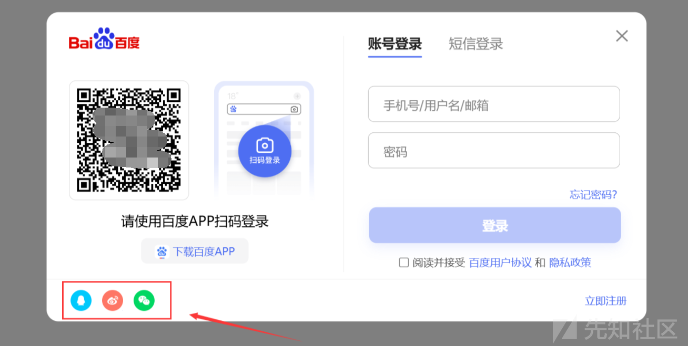

就像下面的这个一样直接使用微信扫码就可以登录百度

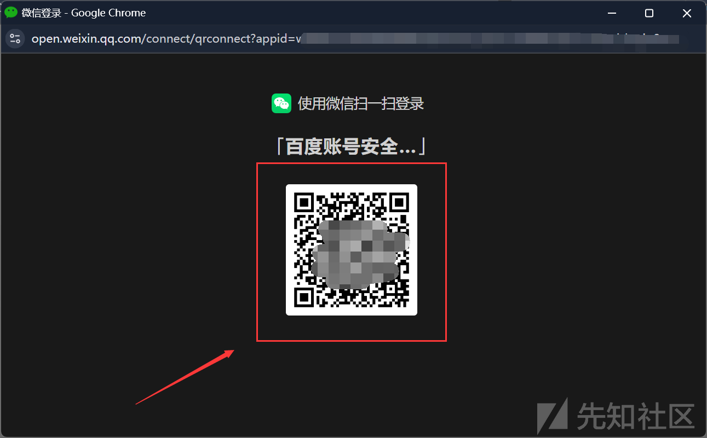

这里假设百度使用微信扫码，然后直接使用微信扫码登录，不需要手机验证点击确认登录，那么师傅们想想是不是可以存在一个逻辑设计缺陷的漏洞，那么我们是不是可以进行一个钓鱼操作，直接把这个可以生成二维码钓鱼，就像下面的这个一样，做个恶意的二维码页面，然后发群里，让别人直接去扫这个二维码，不需要确认，直接就可以登录了


## 0x2 OAuth2.0简介

### 一、什么是 OAuth？

OAuth 是一种常用的授权框架，它允许网站和 Web 应用程序请求对另一个应用程序上的用户帐户的有限访问权限。至关重要的是，OAuth 允许用户授予此访问权限，而无需向请求应用程序公开其登录凭据。这意味着用户可以微调他们想要共享的数据，而不必将其帐户的全部控制权交给第三方。

基本 OAuth 流程广泛用于集成需要访问用户帐户中某些数据的第三方功能。例如，应用程序可能使用 OAuth 请求访问您的电子邮件联系人列表，以便可以推荐要联系的人。但是，相同的机制也用于提供第三方身份验证服务，允许用户使用他们在其他网站上的帐户登录。

### 二、OAuth 2.0 如何工作？

OAuth 2.0 最初是作为在应用程序之间共享特定数据访问权限的一种方式而开发的。它的工作原理是定义三个不同方（即客户端应用程序、资源所有者和 OAuth 服务提供商）之间的一系列交互。

* **客户端应用程序**——想要访问用户数据的网站或网络应用程序。
* **资源所有者**——客户端应用程序想要访问其数据的用户。
* **OAuth 服务提供商**- 控制用户数据及其访问权限的网站或应用程序。他们通过提供与授权服务器和资源服务器交互的 API 来支持 OAuth。

实际的 OAuth 流程可以通过多种不同的方式实现。这些方式被称为 OAuth“流程”或“授权类型”。在本主题中，我们将重点介绍“授权代码”和“隐式”授权类型，因为它们是迄今为止最常见的授权类型。从广义上讲，这两种授权类型都涉及以下阶段：

1. 客户端应用程序请求访问用户数据的子集，指定他们想要使用哪种授权类型以及他们想要什么样的访问权限。
2. 提示用户登录 OAuth 服务并明确同意请求的访问。
3. 客户端应用程序会收到一个唯一的访问令牌，证明他们有用户授予的访问请求数据的权限。具体如何实现取决于授权类型。
4. 客户端应用程序使用此访问令牌进行 API 调用，从资源服务器获取相关数据。

在了解如何使用 OAuth 进行身份验证之前，了解此基本 OAuth 流程的基础知识非常重要。如果您对 OAuth 完全陌生，我们建议您在继续阅读之前先熟悉我们将要介绍的两种授权类型的细节。

### 三、认证流程

OAuth协议的基本流程大致如下：

* Client请求Resource Owner的授权，请求中一般包含要访问的资源路径、操作类型、Client的身份等信息
* Resource Owner批准授权并将"授权证据"发送给Client，Resource Owner批准的典型的做法是AS提供授权审批界面让Resource Owner显式批准
* Client向Authorization Server请求"访问令牌(Access Token)"，此时Client需向Authorization Server提供RO的"授权证据"以及Client自己身份的凭证
* Authorization Server验证通过后，向Client返回"Access Token"，访问令牌也有多种类型，若为Author bearer类型，那么谁持有访问令牌，谁就能访问资源
* Client携带"Access Token"访问Resource Server上的资源，在令牌的有效期内Client可以多次携带令牌去访问资源
* Resource Server验证令牌的有效性，比如：是否伪造、是否越权、是否过期，验证通过后，才能提供服务

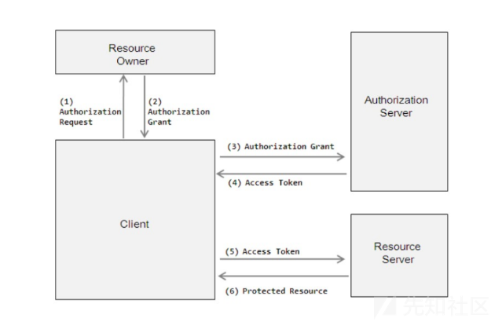

## 0x3 OAuth 授权类型

### 一、什么是 OAuth 授予类型？

OAuth 授权类型决定了 OAuth 流程中涉及的步骤的确切顺序。授权类型还会影响客户端应用程序在每个阶段与 OAuth 服务的通信方式，包括访问令牌本身的发送方式。因此，授权类型通常被称为“OAuth 流程”。

必须先将 OAuth 服务配置为支持特定的授权类型，然后客户端应用程序才能启动相应的流程。客户端应用程序在发送给 OAuth 服务的初始授权请求中指定要使用哪种授权类型。

授权类型有多种，每种类型的复杂程度和安全性考虑程度各不相同。我们将重点介绍“授权代码”和“隐式”授权类型，因为这两种类型是目前最常见的。

### 二、授权码模式

授权码授予类型最初看起来相当复杂，但一旦你熟悉了一些基础知识，它实际上比你想象的要简单。

简而言之，客户端应用程序和 OAuth 服务首先使用重定向来交换一系列基于浏览器的 HTTP 请求，以启动流程。系统会询问用户是否同意所请求的访问。如果用户同意，则向客户端应用程序授予“授权码”。然后，客户端应用程序与 OAuth 服务交换此代码以接收“访问令牌”，他们可以使用该令牌进行 API 调用以获取相关用户数据。

从代码/令牌交换开始，所有通信都通过安全的、预配置的反向通道在服务器之间发送，因此对最终用户是不可见的。此安全通道是在客户端应用程序首次向 OAuth 服务注册时建立的。此时`client_secret`还会生成一个，客户端应用程序在发送这些服务器到服务器请求时必须使用它来验证自身身份。

由于最敏感的数据（访问令牌和用户数据）不会通过浏览器发送，因此这种授权类型可以说是最安全的。如果可能的话，服务器端应用程序最好始终使用此授权类型。

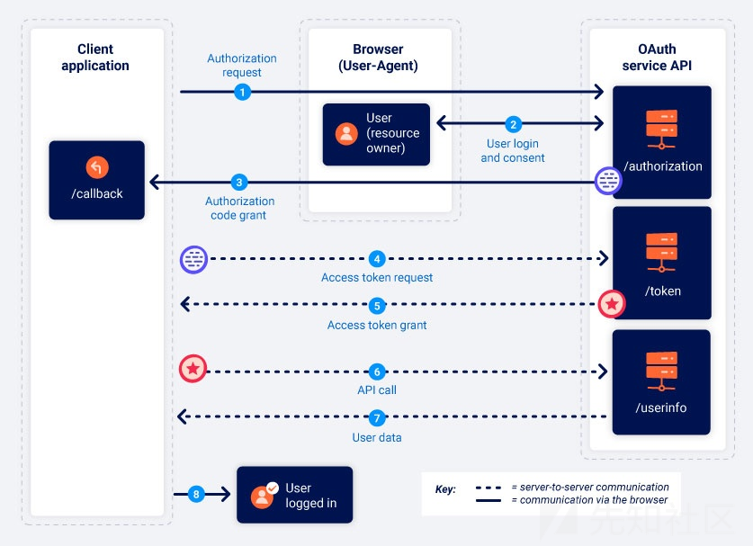

下面是对上述流程的细化介绍：

Step 1：授权请求

客户端应用程序向OAuth服务的/authorization端点发送请求，请求访问特定用户数据的权限

```
GET /authorization?client_id=12345&redirect_uri=https://client-app.com/callback&response_type=code&scope=openid%20profile&state=ae13d489bd00e3c24 HTTP/1.1
Host: oauth-authorization-server.com

```

此请求包含以下值得注意的参数，这些参数通常在查询字符串中提供：

* client\_id：客户端应用程序的唯一标识符的强制参数，此值是在客户端应用程序向OAuth服务注册时生成的
* redirect\_uri：向客户端应用程序发送授权代码时用户浏览器应重定向到的URI，这也被称为"回调URI"或回调端点"
* response\_type：确定客户端应用程序期望的响应类型以及它想要启动的流，对于授权代码授予类型，值应为代码
* scope：用于指定客户端应用程序要访问用户数据的哪个子集，这些可能是由OAuth提供程序设置的自定义作用域，也可能是由OpenIDConnect规范定义的标准化作用域
* state：用于存储与客户端应用程序上的当前会话绑定的唯一、不可更改的值，OAuth服务应该在响应中返回这个确切的值以及授权代码，通过确保对其/callback端点的请求来自发起OAuth流的同一个人，此参数可作为客户端应用程序的CSRF令牌形式

Step 2：用户登录授权

授权服务器收到初始请求时，它会把用户重定向到登录页面，在那里他们将被提示登录到OAuth提供商的帐户(通常是社交媒体账户)，然后将向它们显示客户端应用程序想要访问的数据列表，这是基于授权请求中定义的作用域，用户可以选择是否同意此访问，需要注意的是一旦用户批准了客户端应用程序的给定作用域，只要用户与OAuth服务仍有有效会话，此步骤就会自动完成。换言之当用户第一次选择使用社交媒体登录时，他们需要手动登录并表示同意，但如果他们稍后重新访问客户端应用程序，通常只需单击一下即可重新登录

Step 3：授予授权码

如果用户同意请求的访问，他们的浏览器将被重定向到授权请求的redirect\_uri参数中指定的/recallback端点，生成的GET请求将包含作为查询参数的授权码，根据配置它还可以发送与授权请求中的值相同的状态参数

```
GET /callback?code=a1b2c3d4e5f6g7h8&state=ae13d489bd00e3c24 HTTP/1.1
Host: client-app.com

```

Step 4：访问令牌请求

客户端应用程序接收到授权代码就需要将其交换为Access Token，它向OAuth服务的/token端点发送一个服务器到服务器的POST请求，从那时起所有通信都发生在一个安全的后台通道中，因此攻击者通常无法观察或控制通信

```
POST /token HTTP/1.1
Host: oauth-authorization-server.com
…
client_id=12345&client_secret=SECRET&redirect_uri=https://client-app.com/callback&grant_type=authorization_code&code=a1b2c3d4e5f6g7h8

```

除了client\_id和授权码之外，我们还会发现存在以下新参数：

client\_secret：客户端应用程序必须通过包括在向OAuth服务注册时分配的密钥来对自己进行身份验证

grant\_type：用于确保新端点知道客户端应用程序要使用哪种授予类型，在这种情况下应该将其设置为authorization\_code

Step 5：Access token grant

OAuth服务将验证Access Token请求，如果一切如预期进行则服务器通过向客户端应用程序授予具有所请求作用域的accesstoken来进行响应

```
{
    "access_token": "z0y9x8w7v6u5",
    "token_type": "Bearer",
    "expires_in": 3600,
    "scope": "openid profile",
    …
}

```

Step 6：API接口调用

客户端应用程序有了Access Code后就可以从资源服务器获取用户的数据了，它可以对OAuth服务的/userinfo端点进行API调用，accessToekn一般在"Authorization：Bearer"头中提交以证明客户端应用程序具有访问此数据的权限

```
GET /userinfo HTTP/1.1
Host: oauth-resource-server.com
Authorization: Bearer z0y9x8w7v6u5

```

Step 7：资源获取

资源服务器需要验证token是否有效以及它是否属于当前客户端应用程序，如果是则通过发送所请求的资源，随后基于访问令牌的范围的用户数据来进行响应

```
{
    "username":"carlos",
    "email":"carlos@carlos-montoya.net",
    …
}

```

### 三、隐式授权类型

隐式授权类型要简单得多。客户端应用程序无需先获取授权码，然后再将其换成访问令牌，而是在用户同意后立即收到访问令牌。

您可能想知道为什么客户端应用程序并不总是使用隐式授权类型。答案相对简单 - 它的安全性要低得多。使用隐式授权类型时，所有通信都通过浏览器重定向进行 - 没有像授权代码流中那样的安全反向通道。这意味着敏感的访问令牌和用户数据更容易受到潜在攻击。

隐式授予类型更适合单页应用程序和本机桌面应用程序，这些应用程序无法轻松地`client_secret`在后端存储，因此，使用授权码授予类型不会带来太多好处。

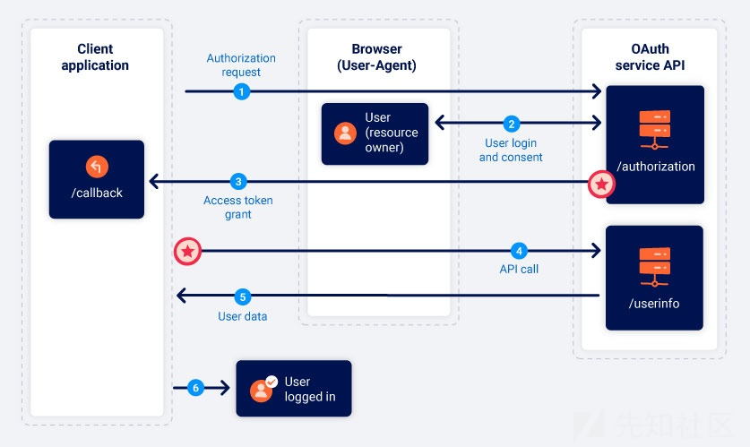

Step 1：授权请求

隐式流的启动方式与授权代码流大致相同，唯一的主要区别是response\_type参数必须设置为token

```
GET /authorization?client_id=12345&redirect_uri=https://client-app.com/callback&response_type=token&scope=openid%20profile&state=ae13d489bd00e3c24 HTTP/1.1
Host: oauth-authorization-server.com

```

Step 2：用户登录授权

用户登录并决定是否同意请求的权限，此过程与授权代码流的过程完全相同

Step 3：获取访问令牌

如果用户同意所请求的访问，OAuth服务将用户的浏览器重定向到授权请求中指定的redirect\_uri，但是它不会发送包含授权代码的查询参数，而是将访问令牌和其他特定于令牌的数据作为URL片段发送，而由于访问令牌以URL片段的形式发送，因此它永远不会直接发送到客户端应用程序，相反客户端应用程序必须使用合适的脚本来提取片段并存储它

```
GET /callback#access_token=z0y9x8w7v6u5&token_type=Bearer&expires_in=5000&scope=openid%20profile&state=ae13d489bd00e3c24 HTTP/1.1
Host: client-app.com

```

Step 4：API接口调用

客户端应用程序成功地从URL片段中提取访问令牌后就可以使用它对OAuth服务的/userinfo端点进行API调用，此过程通过浏览器实现

```
GET /userinfo HTTP/1.1
Host: oauth-resource-server.com
Authorization: Bearer z0y9x8w7v6u5

```

Step 5：资源访问

资源服务器应验证令牌是否有效以及它是否属于当前客户端应用程序，如果有效它将根据与访问令牌关联的作用域发送请求的资源，即用户的数据，客户端应用程序最终可以将此数据用于其预期目的，在OAuth身份验证的情况下，它通常被用作ID来授予用户一个经过身份验证的会话，从而有效地将用户登录

```
{
    "username":"carlos",
    "email":"carlos@carlos-montoya.net"
}

```

## 0x4 漏洞案例分享

### 一、通过 OAuth 隐式流程绕过身份验证

#### 漏洞原理

隐式授权通过浏览器发送访问令牌，访问令牌作为URL片段从OAuth服务通过用户浏览器发送到客户端应用程序。然后客户端应用程序使用JavaScript访问令牌。麻烦的是，如果应用程序想要在用户关闭页面后保持会话，它需要将当前用户数据（通常是用户D和访问令牌）存储在某处。

如果在客户端没有对访问令牌与请求中其他数据匹配，则可导致修改服务器可能判断的键值而访问到其他人的资源。

#### 漏洞复现

在打复现这个漏洞之前，我这里给师傅们拿一个图片给大家看看，这个漏洞呢主要是网站对于token的一个鉴定，他只要鉴定token正确，那么就可以直接登录成功，类似与水平越权的效果，水平越权修改那个id值

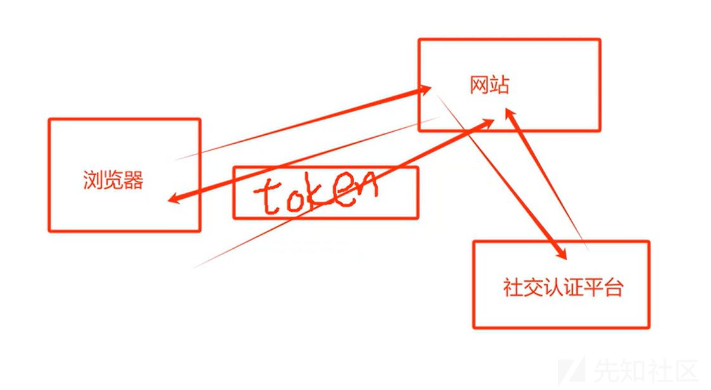

**靶场地址：**

<https://portswigger.net/web-security/oauth/lab-oauth-authentication-bypass-via-oauth-implicit-flow>

**靶场介绍：**

此实验室使用 OAuth 服务允许用户使用其社交媒体帐户登录。客户端应用程序的验证存在缺陷，攻击者可以在不知道密码的情况下登录其他用户的帐户。

要解答这个实验，请登录 Carlos 的账户。他的电子邮件地址是`carlos@carlos-montoya.net`。

您可以使用以下凭证通过自己的社交媒体帐户登录：`wiener:peter`。

进入靶场后进行登录时会跳转到一个模拟的第三方社交类的站点进行认证授权

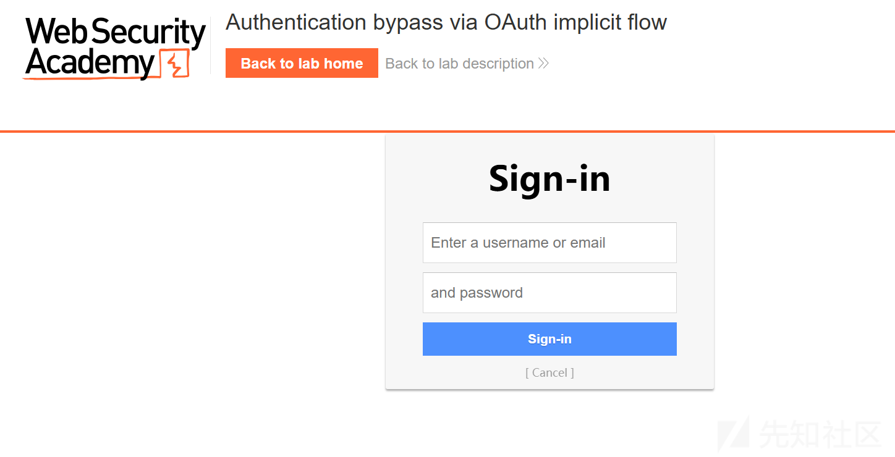

然后填写我们的账户信息：wiener:peter，然后我们这里全程进行抓取数据包，方便我们后面对这个站点的流量走向的一个分析

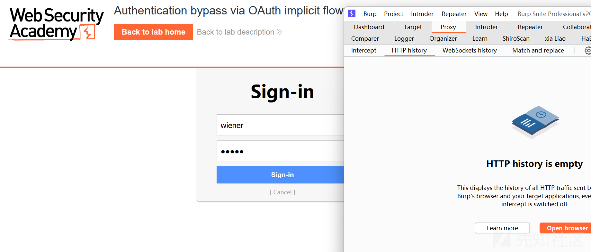

填写表单完成认证后会出现以下提示

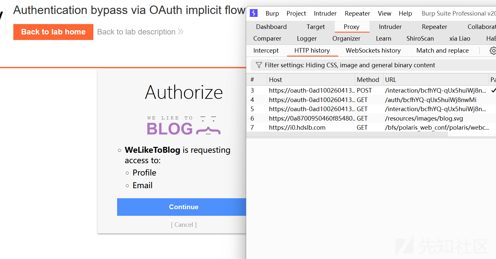

我们点击网站"My Account"的时候此时会直接跳转到第三方平台进行身份认证，触发以下URL请求

```
GET /auth?client_id=cw37x4gulbxbjgyrcttol&redirect_uri=https://0a8700950460f854807a443c00c90004.web-security-academy.net/oauth-callback&response_type=token&nonce=1823642418&scope=openid%20profile%20email HTTP/2
Host: oauth-0ad100260413f8ee80df426e02c60093.oauth-server.net
Cookie: _session=_ndBHv51oX4gLnbGjgD7B; _session.legacy=_ndBHv51oX4gLnbGjgD7B
User-Agent: Mozilla/5.0 (Windows NT 10.0; Win64; x64; rv:133.0) Gecko/20100101 Firefox/133.0
Accept: text/html,application/xhtml+xml,application/xml;q=0.9,*/*;q=0.8
Accept-Language: zh-CN,zh;q=0.8,zh-TW;q=0.7,zh-HK;q=0.5,en-US;q=0.3,en;q=0.2
Accept-Encoding: gzip, deflate, br
Upgrade-Insecure-Requests: 1
Sec-Fetch-Dest: document
Sec-Fetch-Mode: navigate
Sec-Fetch-Site: cross-site
X-Forwarded-For: 127.0.0.1
Priority: u=0, i
Te: trailers

```

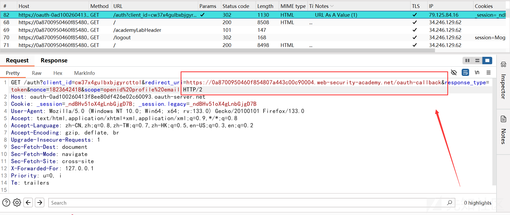

然后我们可以翻数据包，看到/authenticate路径下就是我们认证的校验值，需要特别注意的就是我们的这个token值，也就是我上面画的那张图片，这里就直接校验token值，我们直接把email进行替换，然后再放包发包操作

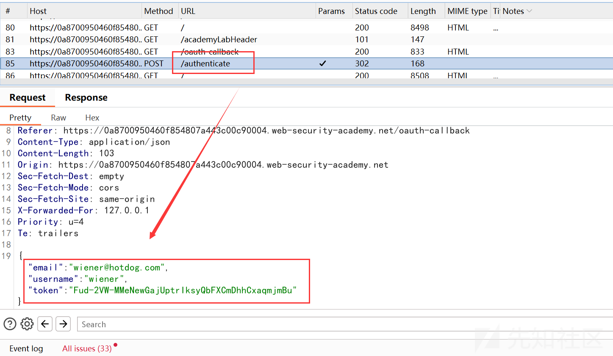

进行替换成carlos@carlos-montoya.net邮箱

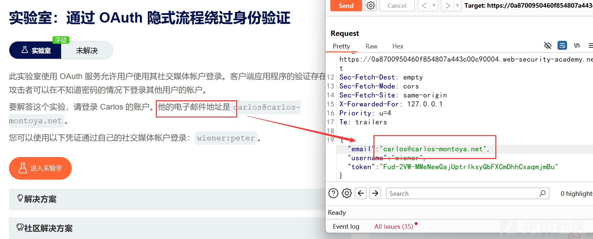

这里直接使用bp进行跳转

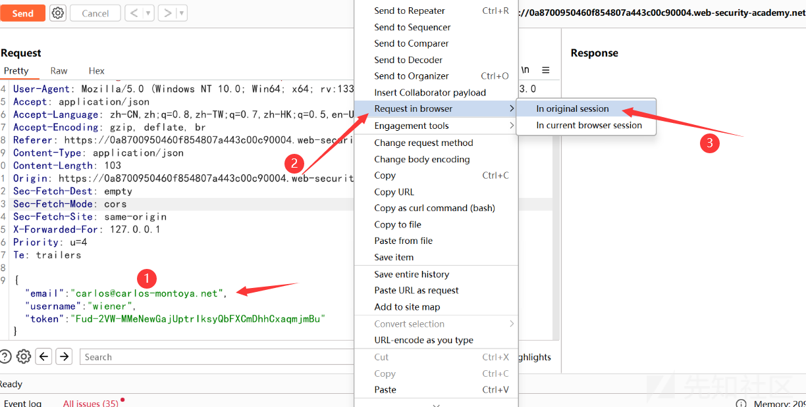

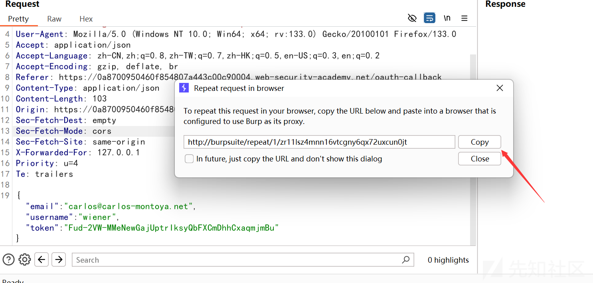

复制到浏览器，然后再点击这个按钮

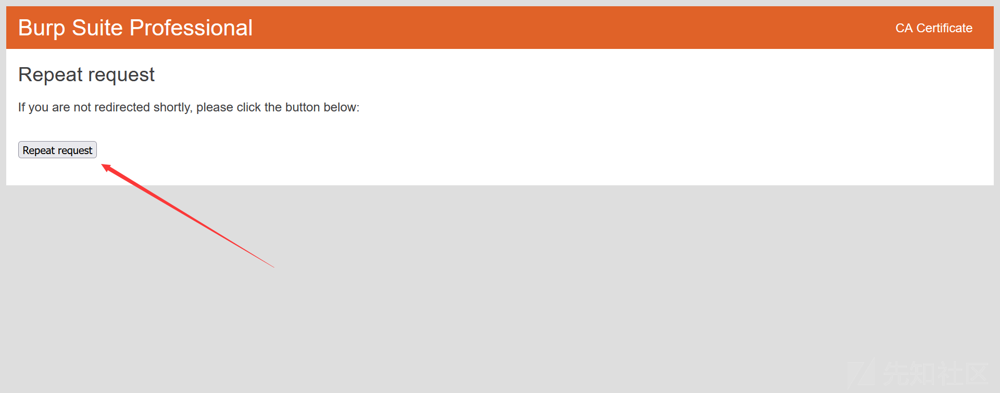

就可以看到我们直接进行了水平越权的一个操作了，成功登录了carlos用户

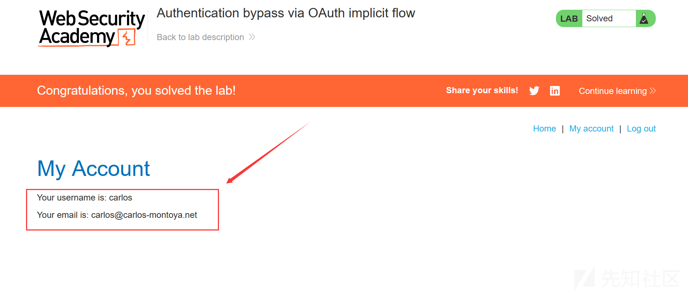

### 二、OAuth缺陷接管账号

#### 漏洞原理

OAuth缺陷接管账号漏洞的原理其实挺简单的。OAuth是一种授权协议，允许用户在不提供账号密码的情况下，授权第三方应用访问他们的某些资源，比如在社交媒体上的信息。

总的来说，OAuth缺陷接管账号漏洞就是利用了OAuth在回调URL和令牌管理上的不安全设计，让攻击者能够在用户不知情的情况下窃取或伪造这些关键信息，从而接管用户的账号。

#### 简单案例分享

简单来讲就是在登录过程中，比如可以使用第三方应用授权登录，且扫描二维码登录不需要确认校验，直接扫码即可登录，那么就可以使用二维码钓鱼之类的危害，就是文章开头的描述的百度案例一样。

这里进入后台，然后有一个使用微信绑定，扫描二维码的功能

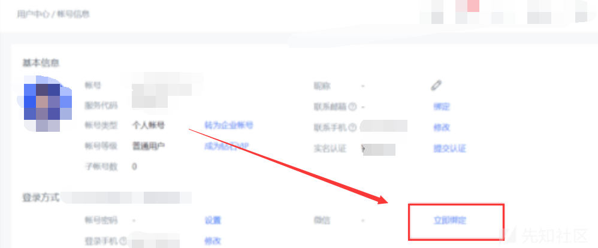

点击立即绑定，然后就会弹出来一个二维码，那么我们就可以拿这个二维码进行一个钓鱼欺骗，让别人扫描二维码，从而绑定别人的微信号

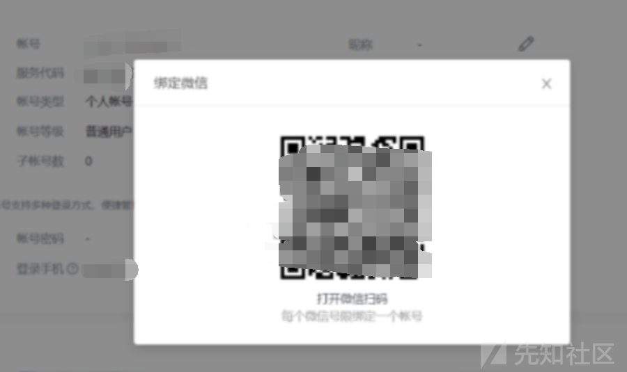

就跟我上面的一个，搞一个钓鱼的二维码模板，然后往一些网安群里面一发，说什么小白免费领取网安教程，只需要扫描此二维码即可（肯定有人扫的）


## 0x5 总结

好了，关于OAuth2.0原理及漏洞挖掘技巧的文章到这里就已经给师傅们分享完了，这篇文章主要是从一个简单的案例来开头，然后后面讲OAuth2.0原理以及相关的一些相关知识。最后以两个案例漏洞复现来给师傅们更加深刻的理解这个漏洞，最后希望这篇文章对师傅们有帮助，祝师傅们多挖洞，多过洞！

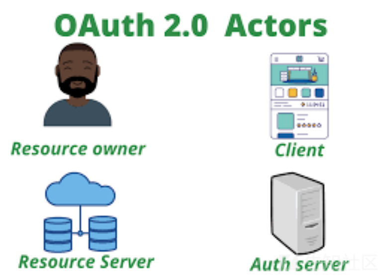

参考链接：  
<https://portswigger.net/web-security/all-labs#oauth-authentication>  
<https://www.bilibili.com/video/BV1GMYceAEgF/>
