# 某转逆向分析（环境检测，sign值分析）-先知社区

> **来源**: https://xz.aliyun.com/news/16157  
> **文章ID**: 16157

---

本文仅作技术交流分享

## 正文

打开app,发现有环境风险提醒，说明肯定有环境检测代码。

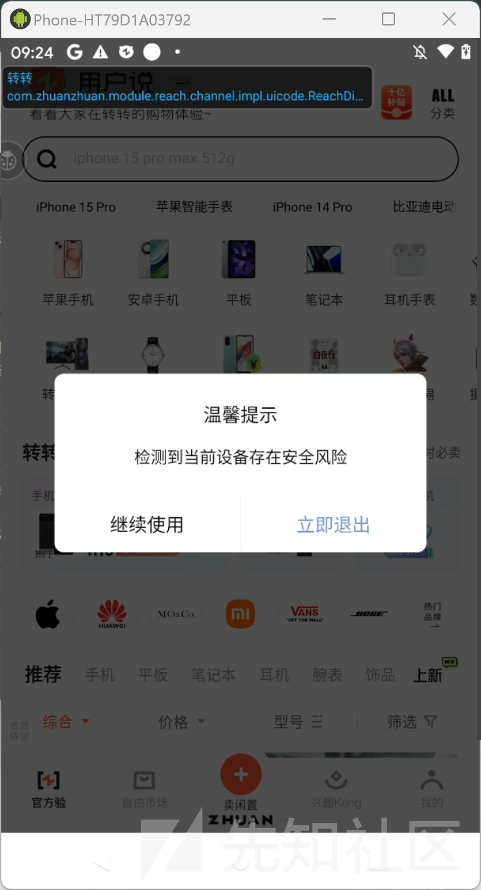

下面先分析一下这里的环境检测的机制。  
直接把apk扔到jadx里，没有发现加壳痕迹。通过多次尝试，最终发现搜索字段"检测到当前设备存在安全风险"

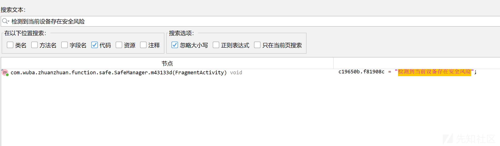  
这是个root检测  
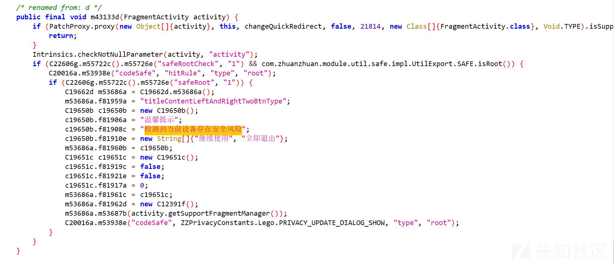  
然后在这个类中还意外发现了模拟器检测和网络环境检测

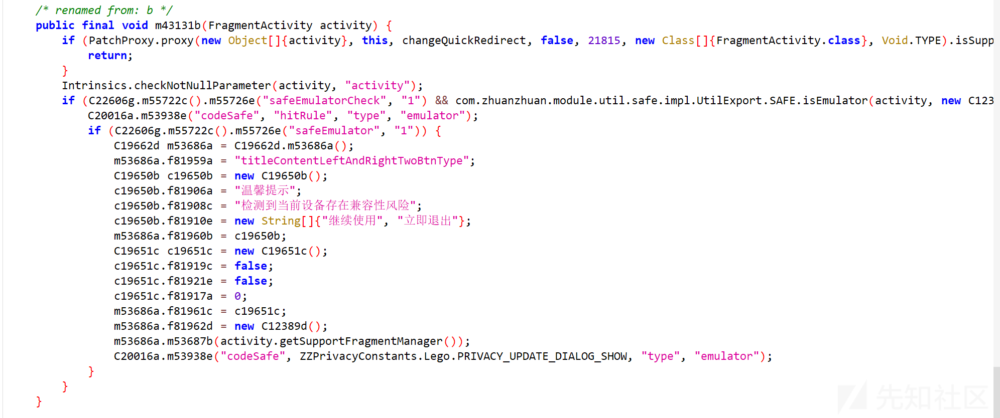

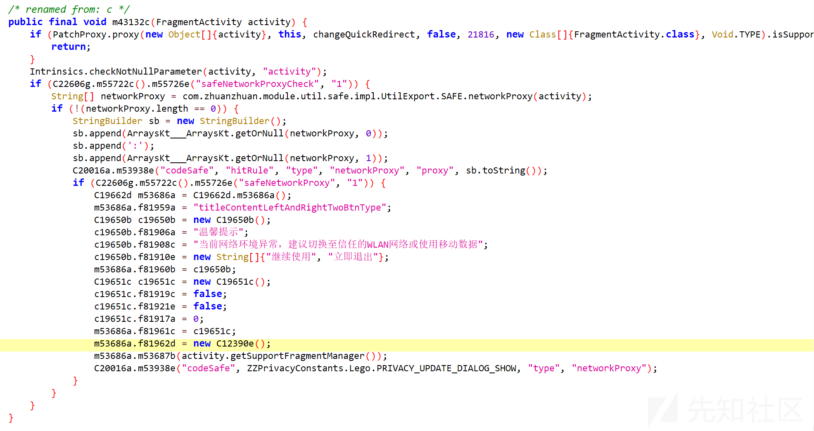  
下面来分析一下root检测和网络检测。别问为什么不分析模拟器检测，问就是jadx没有成功把模拟器检测部分的代码反编译出来（QAQ）

#### root检测

可以看到这里先是使用了美团的热更新框架robust  
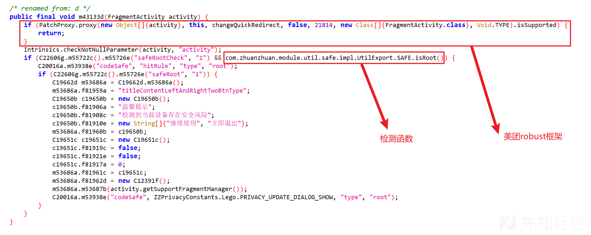  
<https://tech.meituan.com/2016/09/14/android-robust.html>

简单来说就是通过PatchProxy.proxy方法传入相关参数（包含 activity、this、changeQuickRedirect 等以及指定 FragmentActivity类型等）判断是否加载了补丁，如果加载了就return了，不执行后面的代码。由于这里有显示环境监测弹框，所以说明是执行了后续代码的。后面出现的PatchProxy.proxy多数同样是可以忽略的

后面的com.zhuanzhuan.module.util.safe.impl.UtilExport.SAFE.isRoot()是检测函数。


下面是关键代码解析：  
`boolean exists = new File("/system/app/Superuser.apk").exists();`  
尝试创建一个代表"/system/app/Superuser.apk"这个文件路径的File对象，并通过exists()方法来检查该文件在系统中是否实际存在。在Android系统中，Superuser.apk文件通常与设备获取 root 权限后的相关管理应用有关，如果这个文件存在，很可能意味着设备已经root了  
`for (String str : m54412a(new String[]{"/system/bin/sh", "-c", "type su"})) {... }`  
调用m54412a方法执行{"/system/bin/sh", "-c", "type su"}命令（该命令是用于查看su命令的相关情况），并遍历其返回的每一行结果字符串

`if (StringsKt__StringsKt.contains$default((CharSequence) lowerCase, (CharSequence) "not found", false, 2, (Object) null)) {... }`  
检查转换后的小写字符串中是否包含"not found"这个子字符串，如果包含，说明通过"type su"命令执行的结果表明su命令未被找到，这种情况下将bool变量设置为Boolean.FALSE，意味着从这个命令执行角度来看，设备可能没有获取root权限相关的关键命令存在

`if (!exists &&!bool.booleanValue()) {... }`  
这里进行综合判断，如果前面检查的Superuser.apk文件不存在（!exists为true），并且通过"type su"命令执行结果判断得出设备似乎也没有su命令（!bool.booleanValue()为true），那就需要进一步查看设备的Build.TAGS信息  
`String TAGS = Build.TAGS;`  
获取设备的Build.TAGS属性值，Build.TAGS中包含了一些设备构建相关的标签信息，常用于判断设备的一些特殊状态等情况  
`if (!StringsKt__StringsKt.contains$default((CharSequence) TAGS, (CharSequence) "test-keys", false, 2, (Object) null)) { return false; }`  
检查Build.TAGS中是否包含"test-keys"字符串，如果不包含，同样返回false，意味着设备没有 root 权限相关标识，从整体综合判断角度不符合root设备的特征  
而如果前面的所有条件判断都通过了，最后就会返回true，表示判断设备是已经获取了root权限的状态

接着来看看m54412a函数

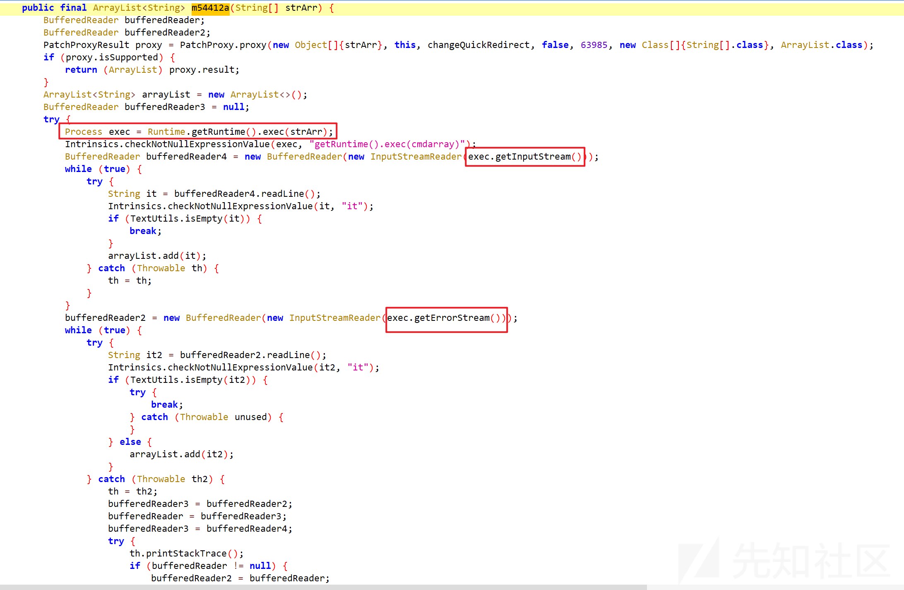  
简单来说这个函数是创建一个空的ArrayList<string>用于存放结果。接着利用Runtime.getRuntime().exec(strArr)执行传入的命令，获取到Process对象后，从其标准输入流中逐行读取内容，只要读取到的行内容不为空，就添加到ArrayList里。之后再从错误输入流中按同样方式读取内容，不为空的行也添加到ArrayList中。最后再将ArrayList返回</string>

总结一下，这个isRoot()主要使用了以下两种检测设备是否root的方式。  
文件检查方式：  
首先通过new File("/system/app/Superuser.apk").exists()检查/system/app/Superuser.apk文件是否存在。在 Android 系统的环境下，Superuser.apk文件的存在通常与设备获取root权限后的管理应用有关，该文件的存在可能暗示设备已 root。  
命令检查方式：  
执行{"/system/bin/sh", "-c", "type su"}命令（通过m54412a函数来执行并获取结果），这个命令用于查看su命令的相关情况。su命令在类Unix系统（包括Android底层中是切换用户身份，特别是获取root权限的关键命令。  
遍历命令执行后的结果字符串，将每个字符串转换为小写形式后，检查其中是否包含"not found"。如果包含，说明su命令可能不存在，将一个Boolean变量bool设为false；如果遍历完所有结果后bool仍为null，则将其设为true，以此来从su命令的角度判断设备是否可能具有 root 权限相关条件。

#### 网络检测

跳转到com.zhuanzhuan.module.util.safe.impl.UtilExport.SAFE.networkProxy

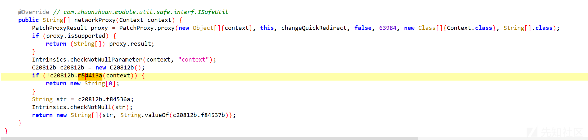

进入m54413a

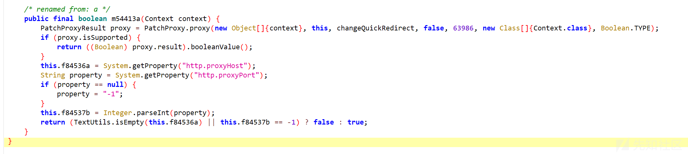  
这个就很简单了，这里直接用System.getProperty("http.proxyHost")和System.getProperty("http.proxyPort")获取系统代理地址和端口。如果都获取到了就返回true，说明存在代理

#### sign值分析

抓一个搜索包


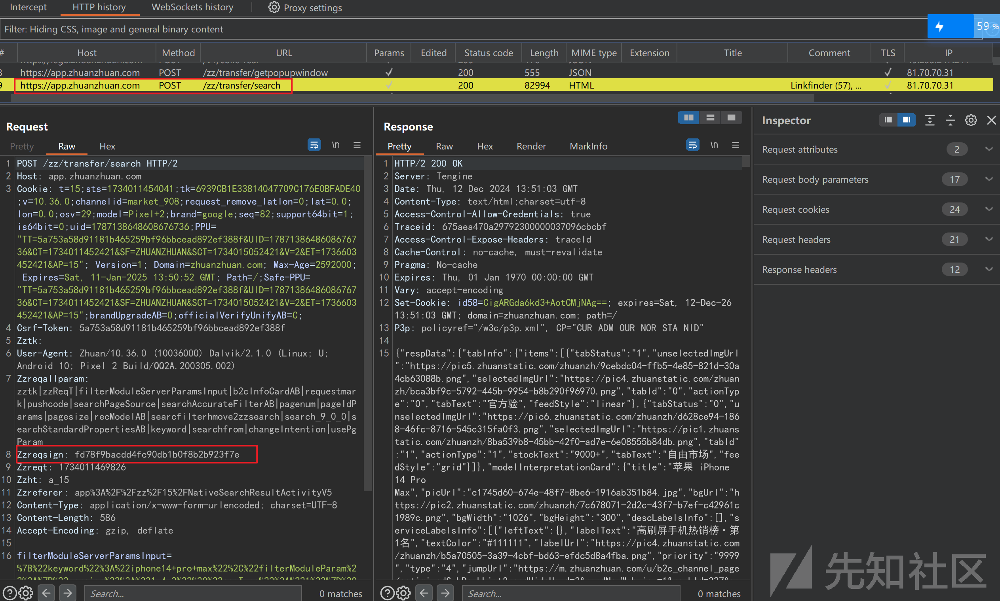

搜索zzreqsign,得到一个结果

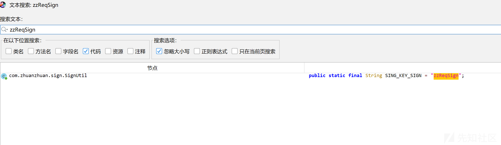  
点击进入

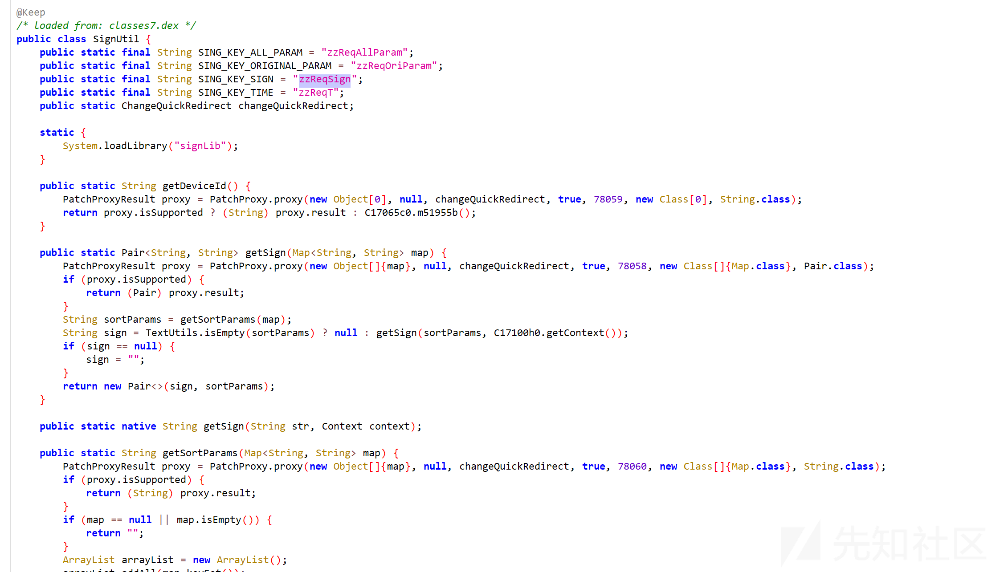

使用objection hook住这个类然后再搜索，看看生成请求是不是真的跟这里的方法有关。很幸运地发现这些方法大概率是跟zzreqsign相关的

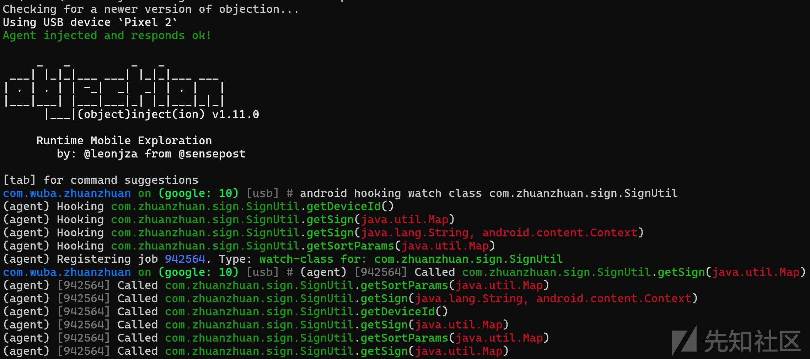

编写代码hook getSign(Map<String, String> map)

```
function main(){
    Java.perform(function(){
        let SignUtil = Java.use("com.zhuanzhuan.sign.SignUtil");
        SignUtil.getSign.overload("java.lang.String","android.content.Context").implementation = function (str, context) {
            console.log("SignUtil.getSign is called: str= ",str," context= ",context);
            let result = this.getSign(str, context);
            console.log("SignUtil.getSign result: ",result);
            return result;
        }
    })
}
setImmediate(main);

```

对比一下result确实是zzreqsign  


把signLib库拖到ida中

直接搜索getSign

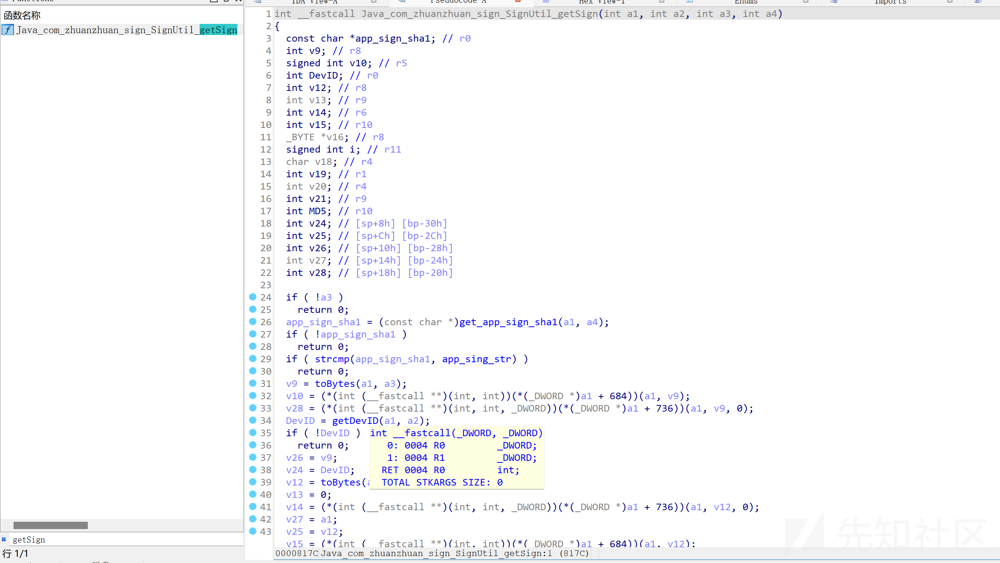  
由于是jni函数，所以直接修改第一个参数类型为JNIEnv\*

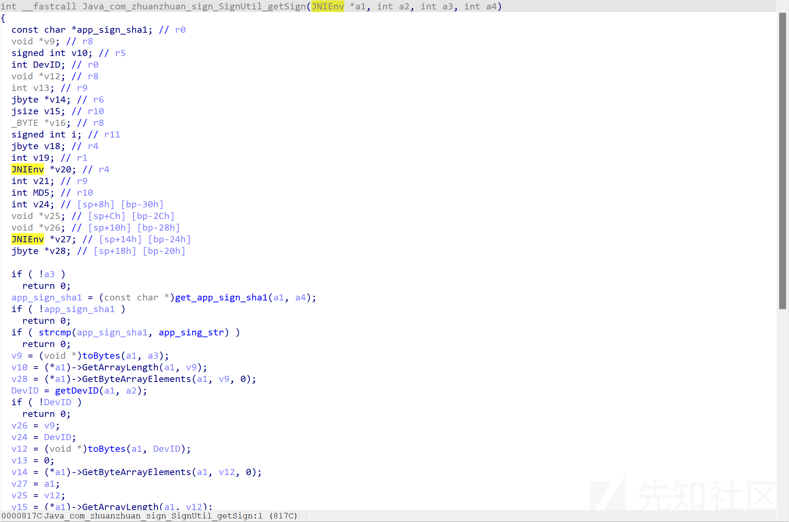

下面简要分析一下该过程

数据准备阶段

```
// 1. 验证应用签名
app_sign_sha1 = get_app_sign_sha1(a1, a4);
if (!app_sign_sha1 || strcmp(app_sign_sha1, app_sing_str))
    return 0;

// 2. 获取输入数据
v9 = toBytes(a1, a3);                    // 将输入转换为字节数组
v10 = GetArrayLength(a1, v9);            // 获取数组长度
v28 = GetByteArrayElements(a1, v9, 0);   // 获取字节数组内容

// 3. 获取设备ID
DevID = getDevID(a1, a2);
v12 = toBytes(a1, DevID);                // 设备ID转字节数组
v14 = GetByteArrayElements(a1, v12, 0);  // 获取设备ID字节内容
v15 = GetArrayLength(a1, v12);           // 获取设备ID长度

```

数据混淆阶段

```
// 1. 分配内存
v16 = malloc(v10);  // 分配与输入数据等长的内存

// 2. 混淆算法
for (i = 0; i < v10; ++i) {
    v18 = v28[v13 % v10];        // 获取输入数据的循环值
    v19 = (v13 + 1) % v15;       // 计算设备ID的索引
    v13 += 2;                     // 步进值为2
    v16[i] = v14[v19] ^ v18;     // 使用异或运算混淆数据
}

```

MD5 计算阶段

```
// 1. 创建新的字节数组（长度为原数据长度+9）
v21 = NewByteArray(v27, v10 + 9);

// 2. 填充混淆后的数据
SetByteArrayRegion(v20, v21, 0, v10, v16);

// 3. 在末尾添加固定字符串"smiletozz"
SetByteArrayRegion(v20, v21, v10, 9, "smiletozz");

// 4. 计算最终的MD5值
MD5 = getMD5(v27, v21);

```

接着再看看md5是否有被魔改

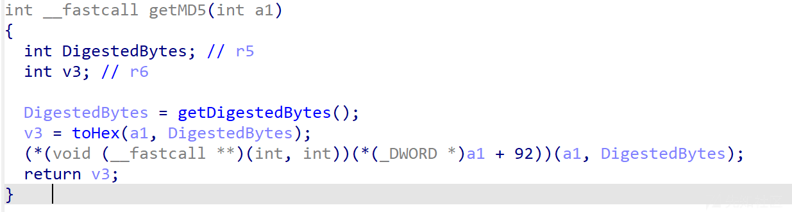  
进入获取MD5摘要的函数getDigestedBytes()

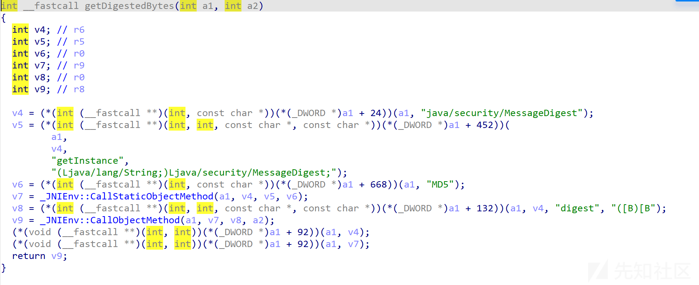  
这又是一个jni函数，于是把第一个类型改成JNIEnv\*,可以看到纯正的native函数写法

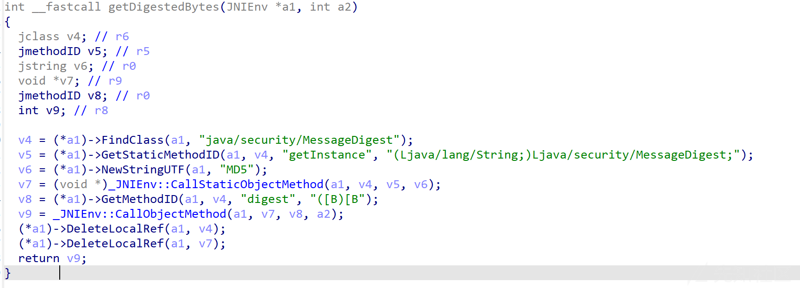

这段代码就等价于下面这段简单的java代码。这就是标准的实现MD5摘要的代码

```
public byte[] getDigestedBytes(byte[] input) {
    MessageDigest md = MessageDigest.getInstance("MD5");
    return md.digest(input);
}

```

于是，分析大致结束了
