# 第二届CN-fnstCTF  web题解-先知社区

> **来源**: https://xz.aliyun.com/news/16164  
> **文章ID**: 16164

---

# 第二届CN-fnstCTF web题解

## ez\_python

访问题目  
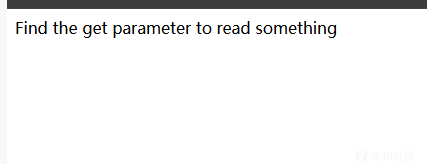  
应该是爆破参数，猜测一手 file 参数  
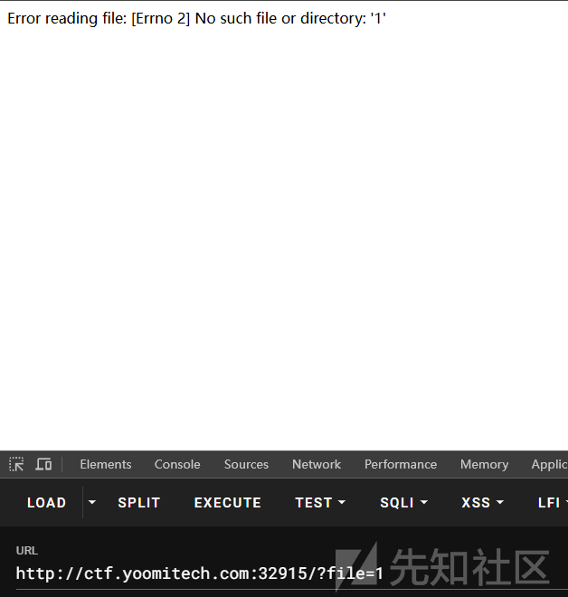

就是一个 file 读取文件  
  
python 写的后端  
尝试读取 app.py

得到源码

```
from flask import Flask, request, render_template_string
from flask_limiter import Limiter
from flask_limiter.util import get_remote_address
import waf

app = Flask(__name__)

limiter = Limiter(
    get_remote_address,
    app=app,
    default_limits=["300 per day", "75 per hour"]
)
@app.route('/')
@limiter.exempt
def index():
    file_path = request.args.get('file')
    if file_path and "proc" in file_path:
        return "只过滤了proc，别想用这个了，去读源码", 200
    if file_path:
        try:
            with open(file_path, 'r') as file:
                file_content = file.read()
            return f"{file_content}"
        except Exception as e:
            return f"Error reading file: {e}"
    return "Find the get parameter to read something"

@app.route('/shell')
@limiter.limit("10 per minute")
def shell():
    if request.args.get('name'):
        person = request.args.get('name')
        if not waf.waf_check(person):
            mistake = "Something is banned"
            return mistake
        template = 'Hi, %s' % person
        return render_template_string(template)
    some = 'who you are?'
    return render_template_string(some)

@app.errorhandler(429)
def ratelimit_error(e):
    return "工具？ 毫无意义，去手搓", 429

if __name__ == '__main__':
    app.run(debug=False, host='0.0.0.0', port=8000)

```

先读取一手 waf

```
def waf_check(value):
    dangerous_patterns = ['os', 'set', '__builtins__', '=', '.', '{{', '}}', 'popen', '+', '__']
    for pattern in dangerous_patterns:
        if pattern in value:
            return False
    return True

```

简单绕过一下

关键字绕过的方法很多，中间加一个点就 ok  
然后就是下划线  
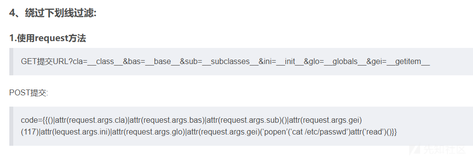

但是过滤了点  
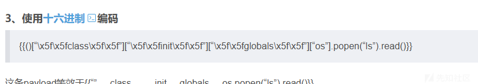  
这个是可以的

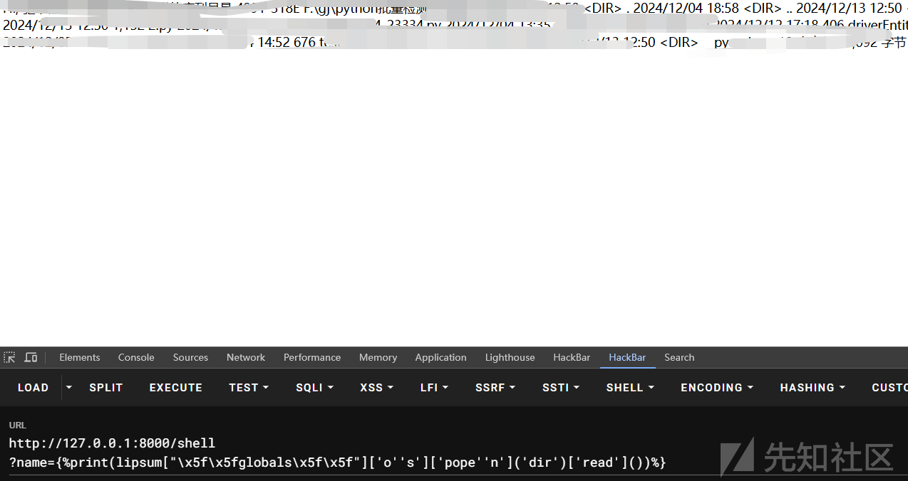  
本地打成功之后环境去打

然后直接一波  
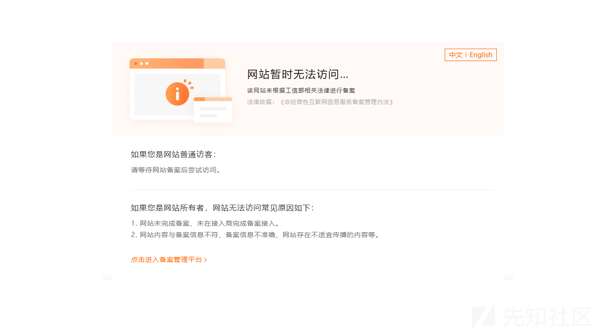  
给我搞糊涂了，以为是出题人故意设计的呢

看了一下源码

```
<html>
<head>
<meta http-equiv="Content-Type" content="textml;charset=UTF-8" />
   <style>body{background-color:#FFFFFF}</style> 
<title>Non-compliance ICP Filing</title>
  <script language="javascript" type="text/javascript">
         window.onload = function () { 
           document.getElementById("mainFrame").src= "http://batit.aliyun.com/alww.html?id=00000000004304787240"; 
            }
</script>   
</head>
  <body>
    <iframe style="width:860px; height:500px;position:absolute;margin-left:-430px;margin-top:-250px;top:50%;left:50%;" id="mainFrame" src="" frameborder="0" scrolling="no"></iframe>
    </body>
      </html>

```

是真的，可能网站没有备案啊

然后查一手 ip 再去访问就 ok 了

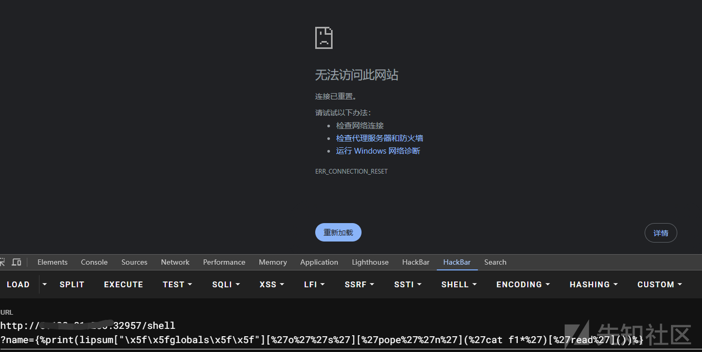  
逆天浏览器，cat 就报错，然后让队友去读的，是根本没有问题能出来的

## 三千零一夜

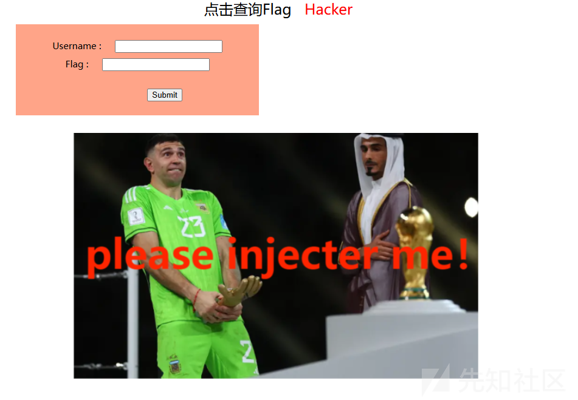

大概率 sql 注入

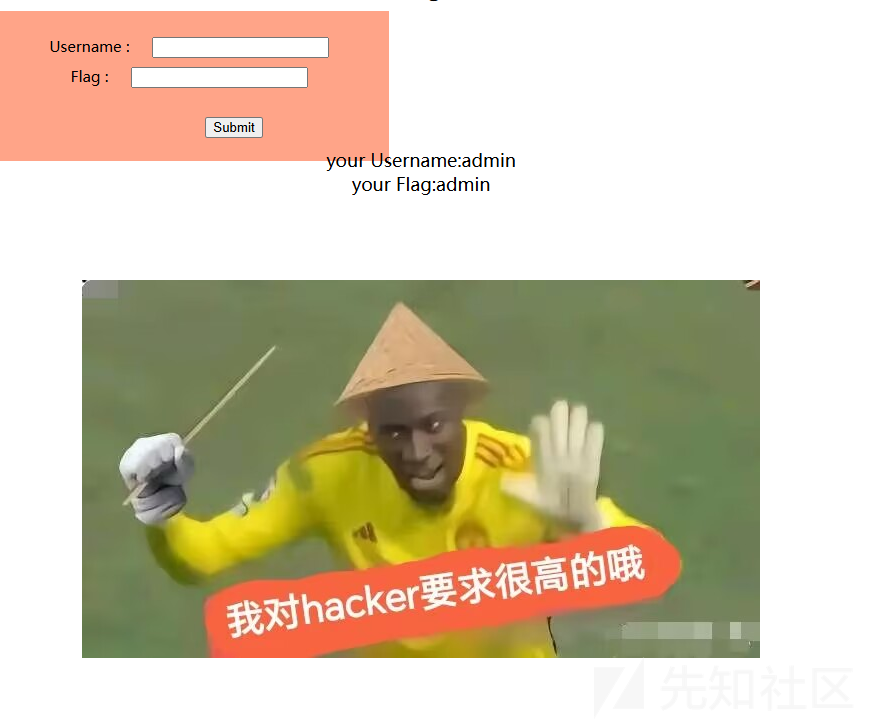  
输入\  
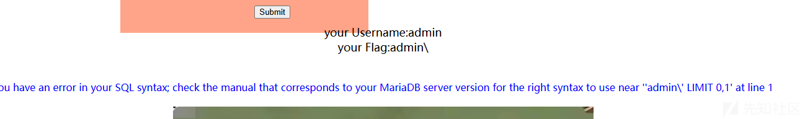  
单引号闭合，然后开始尝试注入

联合查询一手，看看回显位

这里是需要双写，然后注释符也被过滤了，可以逻辑闭合  
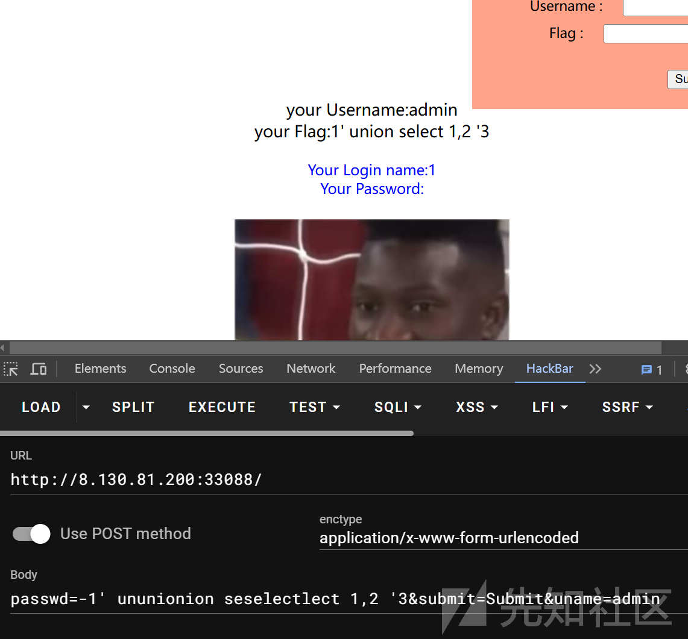

回显位是 1  
查询数据库  
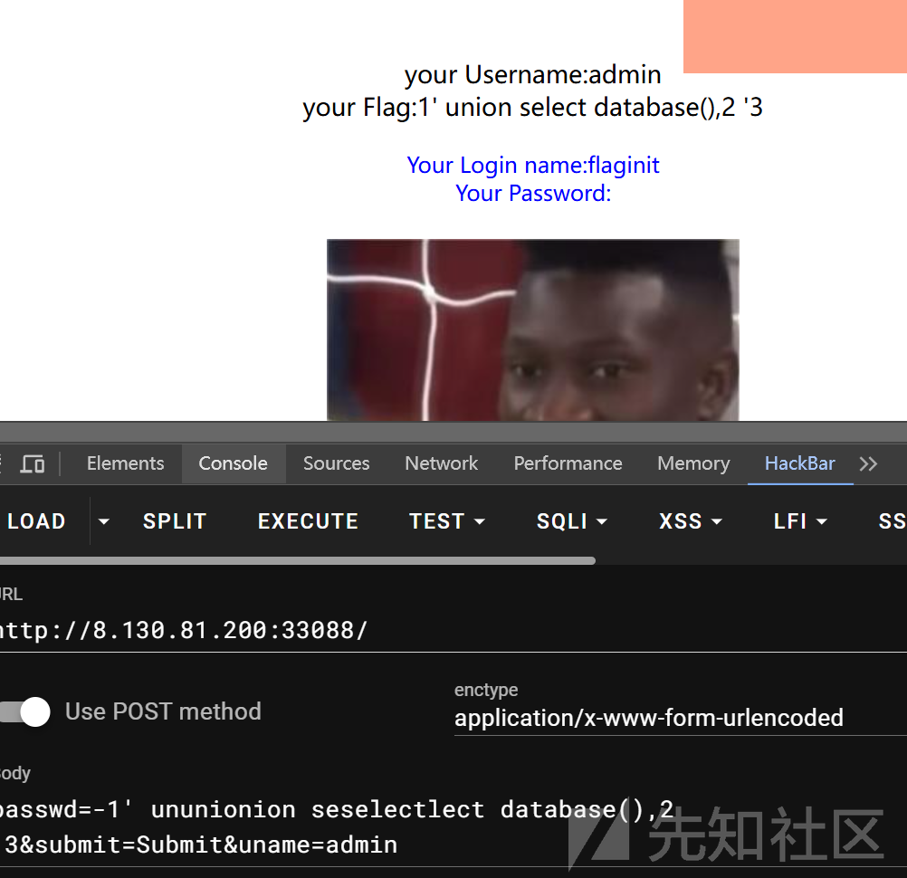  
查出数据库为 flaginit  
然后查询表

=符号是被过滤了，可以 like，但是 like 也本过滤了，可以双写绕过

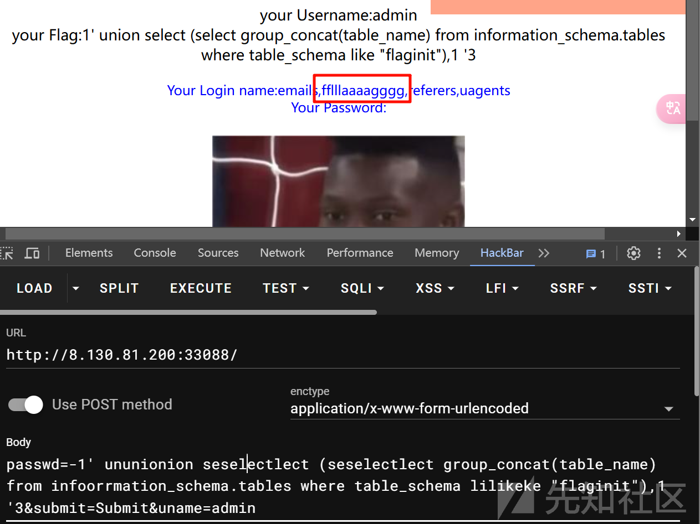  
查询 fflllaaaagggg 表的列名

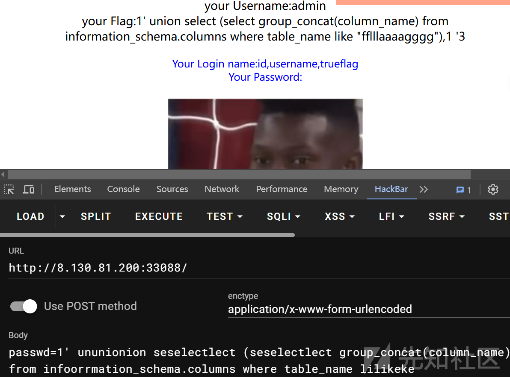  
为 trueflag，然后查询真 flag

然后死活查询不到 flag

之后题目也被下架了，估计方法是没有什么问题的，题目原因
